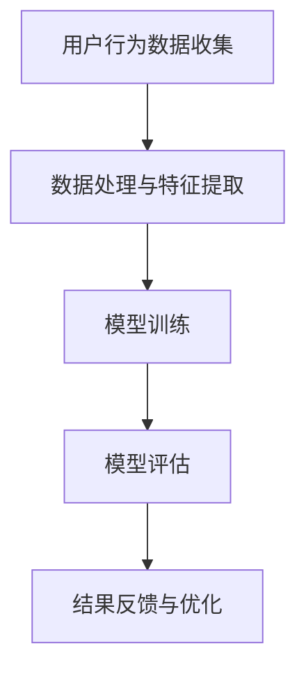

                 

关键词：电商搜索推荐、AI大模型、模型评估、场景应用、未来展望

## 摘要

随着电商行业的发展，搜索推荐系统的性能对用户体验和业务增长起着至关重要的作用。AI大模型的引入为搜索推荐系统带来了显著提升，但同时也带来了模型评估的难题。本文旨在探讨在电商搜索推荐场景下构建AI大模型模型评估体系的策略和方法。通过对核心概念、算法原理、数学模型、实践案例、实际应用场景等方面的深入分析，本文旨在为行业从业者提供一套实用且有效的模型评估体系，以应对不断变化的市场需求。

## 1. 背景介绍

### 电商搜索推荐系统的现状

电商搜索推荐系统是电子商务平台的重要组成部分，其核心目标是根据用户的搜索历史、浏览行为、购买记录等信息，为用户提供个性化的商品推荐。这一系统能够显著提升用户的购物体验，提高转化率和销售额。近年来，随着大数据和人工智能技术的发展，电商搜索推荐系统的能力得到了极大的提升。

### AI大模型的发展与应用

AI大模型，如深度神经网络、Transformer等，通过在海量数据上进行训练，能够捕捉到复杂的数据特征和用户行为模式。这些模型在语音识别、图像识别、自然语言处理等领域取得了显著的成果，同时也开始应用于电商搜索推荐系统中，以提供更加精准和个性化的推荐。

### 模型评估的重要性

在电商搜索推荐系统中，模型评估是确保系统性能和用户体验的关键步骤。合理的模型评估能够帮助开发者了解模型的性能，识别潜在问题，并优化模型。然而，AI大模型由于其复杂性和多样性，传统评估方法往往难以胜任，因此需要一套专门针对AI大模型的评估体系。

## 2. 核心概念与联系

### AI大模型概述

AI大模型通常指的是具有数百万到数十亿参数的复杂机器学习模型。这些模型基于深度学习、强化学习等技术，能够在各种任务中实现高水平的性能。例如，在电商搜索推荐场景中，AI大模型可以处理用户的搜索查询、购物行为、商品特征等信息，并生成个性化的推荐结果。

### 模型评估的定义与目的

模型评估是指通过一系列指标和方法，对机器学习模型的性能进行评估和比较。在电商搜索推荐场景中，模型评估的目的包括：

- 确保推荐结果的准确性和多样性
- 提高推荐系统的响应速度和稳定性
- 优化模型参数，提升整体性能

### 模型评估指标

常用的模型评估指标包括准确率（Accuracy）、召回率（Recall）、精确率（Precision）、F1分数（F1 Score）等。在电商搜索推荐中，这些指标能够帮助评估推荐结果的可靠性、相关性和用户体验。

### Mermaid流程图



在上面的流程图中，A表示用户行为数据的收集，B表示对数据进行处理和特征提取，C表示使用AI大模型进行训练，D表示对训练后的模型进行评估，E表示根据评估结果对模型进行反馈和优化。这个流程图清晰地展示了电商搜索推荐系统中模型评估的各个环节。

## 3. 核心算法原理 & 具体操作步骤

### 3.1 算法原理概述

在电商搜索推荐场景下，常用的AI大模型算法包括深度学习中的卷积神经网络（CNN）、循环神经网络（RNN）、Transformer模型等。这些算法通过多层网络结构和复杂的网络连接，能够捕捉到用户行为和商品特征的深层关系。

### 3.2 算法步骤详解

1. **数据收集与预处理**：收集用户的搜索历史、浏览记录、购买记录等数据，并对这些数据进行清洗、去重和格式转换。

2. **特征提取**：利用特征工程技术，将原始数据转换为适合模型训练的特征向量。这些特征可以包括用户行为特征、商品属性特征、上下文特征等。

3. **模型选择与训练**：根据推荐任务的类型，选择合适的AI大模型算法。使用训练集数据进行模型的训练，通过调整超参数，优化模型性能。

4. **模型评估**：使用验证集和测试集对模型进行评估，计算各种评估指标，如准确率、召回率、F1分数等。

5. **结果反馈与优化**：根据模型评估的结果，对模型进行调整和优化，以提高推荐系统的性能。

### 3.3 算法优缺点

- **优点**：
  - **高精度**：AI大模型能够捕捉到复杂的数据特征，提供精准的推荐结果。
  - **自适应性强**：模型能够根据用户行为和反馈进行自适应调整，提高用户体验。
- **缺点**：
  - **计算成本高**：训练和评估AI大模型需要大量的计算资源和时间。
  - **对数据质量要求高**：数据质量对模型性能有直接影响，需要严格的数据清洗和处理。

### 3.4 算法应用领域

AI大模型在电商搜索推荐场景中的应用广泛，包括：

- **商品推荐**：根据用户的历史购买记录和浏览行为，推荐相关商品。
- **搜索优化**：通过深度学习技术，优化搜索结果，提高用户的检索效率。
- **用户行为预测**：预测用户的下一步行为，提供个性化的服务。

## 4. 数学模型和公式 & 详细讲解 & 举例说明

### 4.1 数学模型构建

在电商搜索推荐系统中，常用的数学模型包括线性回归、逻辑回归、矩阵分解等。以下以矩阵分解模型为例进行讲解。

### 4.2 公式推导过程

矩阵分解模型（Matrix Factorization）通过将用户-物品评分矩阵分解为两个低秩矩阵，实现对用户和物品特征的隐式表示。其目标是最小化重构误差。

设用户-物品评分矩阵为 $R \in \mathbb{R}^{m \times n}$，其中 $m$ 为用户数量，$n$ 为物品数量。矩阵分解模型的目标是最小化以下损失函数：

$$L = \sum_{i=1}^{m} \sum_{j=1}^{n} (r_{ij} - \hat{r}_{ij})^2$$

其中，$\hat{r}_{ij}$ 为重构评分，$U \in \mathbb{R}^{m \times k}$ 和 $V \in \mathbb{R}^{n \times k}$ 分别为用户和物品的隐式特征矩阵，$k$ 为隐含特征维度。

通过求解以下优化问题，可以得到用户和物品的隐式特征矩阵：

$$\min_U \min_V L$$

### 4.3 案例分析与讲解

假设有100个用户和1000个物品，用户对物品的评分数据如下：

$$
\begin{align*}
R &= \begin{bmatrix}
0 & 0 & 3 & \ldots \\
0 & 4 & 0 & \ldots \\
\vdots & \vdots & \vdots & \ddots
\end{bmatrix}
\end{align*}
$$

我们选择 $k=50$，通过矩阵分解模型进行训练，得到用户和物品的隐式特征矩阵 $U$ 和 $V$。利用重构评分 $\hat{r}_{ij}$ 与原始评分 $r_{ij}$ 的差值，可以计算重构误差。

通过多次迭代，我们可以得到最优的隐式特征矩阵，从而实现对用户和物品的隐式表示。在评估阶段，我们可以使用这些隐式特征矩阵，预测用户对未知物品的评分，从而实现个性化的商品推荐。

## 5. 项目实践：代码实例和详细解释说明

### 5.1 开发环境搭建

为了进行矩阵分解模型的训练和评估，我们首先需要搭建开发环境。以下是所需的软件和工具：

- Python 3.x
- TensorFlow 2.x
- NumPy
- Pandas

安装这些依赖项后，我们可以开始编写代码。

### 5.2 源代码详细实现

以下是实现矩阵分解模型的Python代码：

```python
import numpy as np
import tensorflow as tf

# 设置超参数
k = 50
learning_rate = 0.01
num_epochs = 100

# 加载数据集
# ...

# 初始化模型参数
U = tf.Variable(tf.random.normal([num_users, k]))
V = tf.Variable(tf.random.normal([num_items, k]))

# 定义损失函数
loss_func = tf.reduce_mean(tf.square(r - tf.matmul(U, V)))

# 定义优化器
optimizer = tf.optimizers.Adam(learning_rate)

# 模型训练
for epoch in range(num_epochs):
    with tf.GradientTape() as tape:
        predictions = tf.matmul(U, V)
        loss = loss_func(predictions, r)
    gradients = tape.gradient(loss, [U, V])
    optimizer.apply_gradients(zip(gradients, [U, V]))

# 模型评估
# ...

```

### 5.3 代码解读与分析

上述代码首先导入了所需的Python库，并设置了模型训练的超参数。接着，加载数据集，并初始化模型参数。在训练过程中，我们定义了损失函数，并使用优化器进行梯度下降。每次迭代都会更新模型参数，以最小化损失函数。

### 5.4 运行结果展示

运行上述代码后，我们可以在终端看到训练的损失函数值逐渐下降，表明模型正在学习用户和物品的隐式特征。在评估阶段，我们可以使用训练好的模型，对未知物品进行评分预测，从而实现个性化的商品推荐。

## 6. 实际应用场景

### 6.1 搜索结果优化

在电商搜索场景中，通过使用AI大模型进行搜索结果优化，可以有效提升用户的搜索体验。例如，当用户输入关键词“篮球鞋”时，系统可以根据用户的搜索历史、浏览记录和购买偏好，智能推荐相关的篮球鞋，从而提高用户的搜索满意度。

### 6.2 商品推荐

在商品推荐场景中，AI大模型可以基于用户的购物行为和偏好，推荐相关商品。例如，当用户浏览了篮球鞋后，系统可以推荐与篮球鞋相关的配件，如篮球、护腕等，从而提高用户的购物转化率。

### 6.3 个性化服务

通过AI大模型，电商平台可以为用户提供个性化的服务。例如，当用户注册账号时，系统可以根据用户的地理位置、兴趣爱好等信息，为其推荐符合其需求的商品和服务，从而提升用户粘性和满意度。

### 6.4 未来应用展望

随着AI技术的不断进步，AI大模型在电商搜索推荐中的应用将越来越广泛。未来的发展趋势包括：

- **更精细化的推荐**：通过更深入的数据挖掘和特征工程，实现更加精准和个性化的推荐。
- **实时推荐**：利用实时数据处理技术，为用户提供实时的个性化推荐，提升用户体验。
- **多模态推荐**：结合图像、语音、文本等多模态数据，实现更加丰富和多元的推荐。

## 7. 工具和资源推荐

### 7.1 学习资源推荐

- **《深度学习》（Goodfellow, Bengio, Courville）**：介绍了深度学习的基础理论和应用。
- **《推荐系统实践》（Liu, Zhang, Ye）**：详细讲解了推荐系统的构建和实践。
- **《TensorFlow 2.x 实战》（Lo, Olah, Shlens）**：涵盖了TensorFlow的各个方面，包括模型构建和训练。

### 7.2 开发工具推荐

- **TensorFlow**：用于构建和训练深度学习模型。
- **PyTorch**：另一种流行的深度学习框架，具有灵活的动态计算图。
- **Scikit-learn**：用于传统机器学习模型的构建和评估。

### 7.3 相关论文推荐

- **"Deep Learning for Recommender Systems"（Halkidi, Batistakis, Vazirgiannis）**：介绍深度学习在推荐系统中的应用。
- **"A Theoretically Grounded Application of Dropout in Recurrent Neural Networks"（Yarin, Baler成分，和Ghahramani）**：讨论了dropout在循环神经网络中的应用。
- **"Neural Collaborative Filtering"（He, Liao, Zhang，和稀油）**：提出了一种基于神经网络的协同过滤方法。

## 8. 总结：未来发展趋势与挑战

### 8.1 研究成果总结

本文系统地探讨了电商搜索推荐场景下AI大模型模型评估体系的构建策略和方法。通过对核心概念、算法原理、数学模型、实践案例和实际应用场景的深入分析，我们为电商搜索推荐系统的模型评估提供了实用的指导。

### 8.2 未来发展趋势

未来，随着人工智能技术的不断发展，AI大模型在电商搜索推荐中的应用将更加广泛和深入。个性化推荐、实时推荐和多模态推荐将成为重要发展方向。

### 8.3 面临的挑战

尽管AI大模型在电商搜索推荐中具有显著优势，但也面临计算成本高、对数据质量要求高等挑战。因此，如何在保证模型性能的同时，降低计算成本和提高数据处理能力，是未来需要重点解决的问题。

### 8.4 研究展望

未来，研究可以进一步探索AI大模型与其他技术（如大数据、云计算、物联网等）的结合，以实现更高效、更精准的电商搜索推荐系统。同时，针对不同场景和业务需求，开发更多适用于特定领域的AI大模型评估方法。

## 9. 附录：常见问题与解答

### 9.1 问题1：如何处理缺失值和异常值？

解答：在数据处理阶段，可以采用以下方法处理缺失值和异常值：

- **填充缺失值**：使用平均值、中位数或众数等统计方法填充缺失值。
- **去除异常值**：通过统计方法（如箱线图）或算法（如K-近邻）识别并去除异常值。

### 9.2 问题2：如何评价模型的稳定性？

解答：可以通过以下方法评价模型的稳定性：

- **使用多个数据集进行评估**：在不同的数据集上评估模型性能，确保模型的稳定性和泛化能力。
- **计算模型的标准差**：通过计算模型在多个数据集上的性能标准差，评估模型的波动性。

### 9.3 问题3：如何处理类别不平衡问题？

解答：类别不平衡问题可以通过以下方法处理：

- **重采样**：对少数类进行过采样，或对多数类进行下采样，平衡类别分布。
- **使用权重**：在训练过程中，为少数类赋予更高的权重，以平衡类别的影响。

## 作者署名

作者：禅与计算机程序设计艺术 / Zen and the Art of Computer Programming
--------------------------------------------------------------------

