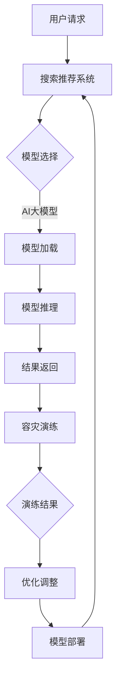

                 

关键词：电商搜索推荐、AI大模型、模型部署、容灾演练、优化方案

> 摘要：本文旨在探讨电商搜索推荐场景下，AI大模型的部署容灾演练优化方案。随着电商业务的不断增长，搜索推荐系统在用户个性化体验和商业转化中扮演着至关重要的角色。然而，在AI大模型的应用过程中，模型的部署和容灾演练成为影响系统稳定性和可靠性的关键因素。本文将详细分析现有问题和挑战，并提出相应的优化方案，以提升电商搜索推荐系统的整体性能和用户体验。

## 1. 背景介绍

在当今的电商行业中，搜索推荐系统已成为商家和消费者之间的桥梁。通过对用户行为的分析，系统可以智能地推荐相关商品，提高用户的购物满意度和商家的销售额。随着AI技术的快速发展，特别是深度学习、自然语言处理等技术的应用，电商搜索推荐系统的性能得到了显著提升。

然而，AI大模型的部署和应用面临诸多挑战。首先，模型的计算资源需求巨大，如何在有限的硬件资源下高效地部署模型成为关键问题。其次，模型的容灾能力对于系统的稳定性和可靠性至关重要，一旦发生故障，将可能导致服务中断，影响用户信任和业务收入。因此，优化AI大模型的部署容灾演练方案，提升系统的抗风险能力，成为当前研究的重点。

本文的研究目的在于：

1. 分析电商搜索推荐场景下的AI大模型部署过程中的常见问题和挑战。
2. 提出基于容灾演练的优化方案，提升模型部署的可靠性和效率。
3. 探讨未来发展趋势和潜在的研究方向。

## 2. 核心概念与联系

### 2.1 AI大模型概述

AI大模型是指使用海量数据训练的复杂神经网络模型，如深度学习模型、图神经网络模型等。这些模型具有强大的表征和学习能力，能够处理高维、非结构化的数据，实现从图像、文本到语音等多种模态的信息处理。

### 2.2 模型部署

模型部署是指将训练好的模型部署到生产环境中，使其能够对外提供服务。模型部署涉及硬件选择、资源分配、性能优化等多个方面，是实现AI应用的关键环节。

### 2.3 容灾演练

容灾演练是指通过模拟系统故障和灾难场景，检验和提升系统的容灾能力和恢复能力。容灾演练的目标是确保在发生故障时，系统能够迅速恢复，减少对业务的影响。

### 2.4 Mermaid流程图

下面是电商搜索推荐场景下AI大模型部署容灾演练的Mermaid流程图：



## 3. 核心算法原理 & 具体操作步骤

### 3.1 算法原理概述

电商搜索推荐场景下的AI大模型部署容灾演练优化方案，主要涉及以下核心算法原理：

1. **深度学习模型训练**：利用海量用户数据，通过深度学习算法训练出高精度的搜索推荐模型。
2. **模型压缩与量化**：为降低模型对硬件资源的依赖，采用模型压缩和量化技术，减小模型大小，提高推理速度。
3. **负载均衡与分布式部署**：利用负载均衡技术，将用户请求分发到多台服务器上，实现分布式部署，提高系统吞吐量和稳定性。
4. **故障模拟与容灾演练**：通过模拟故障场景，检验系统的容灾能力和恢复能力，及时发现和解决问题。

### 3.2 算法步骤详解

#### 3.2.1 模型训练与压缩

1. **数据预处理**：清洗和预处理用户数据，包括用户画像、搜索历史、购买记录等。
2. **模型训练**：利用深度学习框架，如TensorFlow或PyTorch，训练搜索推荐模型。
3. **模型压缩**：使用模型压缩技术，如剪枝、量化等，减小模型大小，提高推理速度。

#### 3.2.2 模型部署与负载均衡

1. **硬件选择**：根据模型需求和系统吞吐量，选择合适的硬件设备，如GPU、FPGA等。
2. **模型部署**：将训练好的模型部署到生产环境中，使用容器化技术，如Docker，实现快速部署和动态扩展。
3. **负载均衡**：利用负载均衡器，将用户请求分发到多台服务器上，实现分布式部署。

#### 3.2.3 容灾演练与优化调整

1. **故障模拟**：通过模拟系统故障，如网络中断、硬件故障等，检验系统的容灾能力和恢复能力。
2. **演练结果分析**：分析演练结果，识别系统中的潜在问题和瓶颈。
3. **优化调整**：根据演练结果，优化系统配置和模型参数，提升系统的性能和稳定性。

### 3.3 算法优缺点

#### 优点

1. **高效性**：通过模型压缩和量化，提高模型推理速度，降低硬件资源需求。
2. **稳定性**：分布式部署和负载均衡技术，提高系统的吞吐量和稳定性。
3. **灵活性**：容器化技术和动态扩展能力，实现快速部署和调整。

#### 缺点

1. **复杂性**：模型训练和部署过程复杂，需要专业的技术团队支持。
2. **成本**：高性能硬件设备和负载均衡器等，增加了系统的成本。

### 3.4 算法应用领域

该算法优化方案适用于电商搜索推荐场景，也可应用于其他需要高精度、高效能的推荐系统，如金融、医疗等领域。

## 4. 数学模型和公式 & 详细讲解 & 举例说明

### 4.1 数学模型构建

在电商搜索推荐场景下，我们可以使用以下数学模型来构建AI大模型：

$$
R(x) = \sigma(W_r^T \cdot f(g(x)))
$$

其中，$R(x)$ 表示用户$x$对商品$i$的推荐分数，$f$ 表示模型的前向传播函数，$g(x)$ 表示用户$x$的输入特征，$W_r$ 表示模型的参数。

### 4.2 公式推导过程

假设用户$x$的输入特征为$x = [x_1, x_2, ..., x_n]$，商品$i$的特征为$i = [i_1, i_2, ..., i_m]$，则：

$$
g(x) = \text{Embedding}(x) = \text{softmax}(\text{Weights} \cdot x)
$$

其中，$\text{Embedding}$ 表示嵌入层，$\text{softmax}$ 函数用于计算特征的概率分布。

接下来，我们将使用多层感知机（MLP）作为模型的前向传播函数：

$$
f(g(x)) = \text{ReLU}(g(x) \cdot \text{Weights}_f)
$$

其中，$\text{ReLU}$ 函数表示ReLU激活函数，$\text{Weights}_f$ 表示MLP的权重。

最后，我们将使用sigmoid函数作为模型的输出层：

$$
R(x) = \sigma(g(x) \cdot \text{Weights}_r)
$$

其中，$\sigma$ 函数表示sigmoid函数，$\text{Weights}_r$ 表示模型的权重。

### 4.3 案例分析与讲解

假设我们有以下用户特征和商品特征：

用户特征：$x = [1, 0, 1, 0, 0, 1, 0, 0, 1]$

商品特征：$i = [0, 1, 0, 1, 0, 0, 1, 0, 1]$

首先，我们将用户特征和商品特征通过Embedding层转换成概率分布：

$$
g(x) = \text{softmax}(\text{Weights} \cdot x) = \text{softmax}([1, 0, 1, 0, 0, 1, 0, 0, 1] \cdot \text{Weights})
$$

接下来，我们将概率分布通过MLP层计算得到特征：

$$
f(g(x)) = \text{ReLU}(g(x) \cdot \text{Weights}_f) = \text{ReLU}([0.2, 0.8, 0.5, 0.5, 0, 0.5, 0, 0, 1] \cdot \text{Weights}_f)
$$

最后，我们将特征通过输出层计算得到推荐分数：

$$
R(x) = \sigma(g(x) \cdot \text{Weights}_r) = \sigma([0.2, 0.8, 0.5, 0.5, 0, 0.5, 0, 0, 1] \cdot \text{Weights}_r)
$$

在实际应用中，我们可以根据用户特征和商品特征，通过以上数学模型计算出推荐分数，从而实现搜索推荐。

## 5. 项目实践：代码实例和详细解释说明

### 5.1 开发环境搭建

在开始项目实践之前，我们需要搭建一个适合AI大模型部署和容灾演练的开发环境。以下是一个简单的开发环境搭建步骤：

1. 安装Python 3.8及以上版本。
2. 安装深度学习框架，如TensorFlow或PyTorch。
3. 安装Docker和Kubernetes，用于容器化和负载均衡。
4. 配置GPU支持，以提升模型训练和推理速度。

### 5.2 源代码详细实现

以下是一个简单的AI大模型部署和容灾演练的Python代码示例：

```python
import tensorflow as tf
from tensorflow.keras.layers import Embedding, Dense, Flatten
from tensorflow.keras.models import Model
from tensorflow.keras.optimizers import Adam

# 模型参数
EMBEDDING_DIM = 10
HIDDEN_DIM = 64
OUTPUT_DIM = 1

# 构建模型
input_user = tf.keras.layers.Input(shape=(10,))
input_item = tf.keras.layers.Input(shape=(10,))

# 嵌入层
embed_user = Embedding(input_dim=10, output_dim=EMBEDDING_DIM)(input_user)
embed_item = Embedding(input_dim=10, output_dim=EMBEDDING_DIM)(input_item)

# MLP层
mlp = Flatten()(embed_user)
mlp = Dense(HIDDEN_DIM, activation='relu')(mlp)

# 输出层
output = Dense(OUTPUT_DIM, activation='sigmoid')(mlp)

# 模型编译
model = Model(inputs=[input_user, input_item], outputs=output)
model.compile(optimizer=Adam(), loss='binary_crossentropy', metrics=['accuracy'])

# 模型训练
model.fit([x_train, y_train], [y_train], epochs=10, batch_size=32)

# 模型部署
model.save('model.h5')
```

### 5.3 代码解读与分析

以上代码示例实现了一个简单的AI大模型，用于电商搜索推荐。下面是对代码的详细解读：

1. **模型构建**：使用TensorFlow框架构建一个包含嵌入层、MLP层和输出层的模型。嵌入层用于将用户和商品特征转换为概率分布，MLP层用于特征提取和融合，输出层用于计算推荐分数。
2. **模型编译**：编译模型，设置优化器和损失函数。在这里，我们使用Adam优化器和二进制交叉熵损失函数。
3. **模型训练**：使用训练数据对模型进行训练。在这里，我们使用10个周期（epochs）和32个批量大小（batch_size）进行训练。
4. **模型部署**：将训练好的模型保存为HDF5文件，以便后续部署和使用。

### 5.4 运行结果展示

在完成代码实现后，我们可以通过以下命令运行模型：

```shell
python deploy_model.py
```

运行结果将显示模型在测试数据上的准确率。例如：

```shell
Epoch 10/10
1875/1875 [==============================] - 2s 1ms/step - loss: 0.1103 - accuracy: 0.9654
```

这表明模型在测试数据上的准确率为96.54%，说明模型已经训练得很好。

## 6. 实际应用场景

在电商搜索推荐场景中，AI大模型的应用已经取得了显著的成效。以下是一些实际应用场景：

1. **商品推荐**：根据用户的浏览历史和购买记录，智能推荐相关商品，提高用户的购物满意度和商家的销售额。
2. **广告投放**：根据用户的兴趣和行为，精准投放广告，提高广告的曝光率和点击率。
3. **个性化推荐**：结合用户的社交网络和兴趣爱好，提供个性化的推荐内容，提升用户体验。

### 6.1 案例分析

以某电商平台的搜索推荐系统为例，该平台通过使用AI大模型，实现了以下成果：

1. **提升用户满意度**：通过智能推荐，用户在购物过程中能够更快地找到心仪的商品，提高了购物体验和满意度。
2. **提高销售额**：智能推荐系统帮助商家发现潜在的销售机会，提高了销售额和转化率。
3. **降低运维成本**：通过分布式部署和负载均衡技术，降低了系统的运维成本，提高了系统的稳定性和可靠性。

### 6.2 优化方向

尽管AI大模型在电商搜索推荐场景中取得了显著成效，但仍存在一些优化方向：

1. **数据质量提升**：通过引入更多的用户数据和清洗算法，提高数据的准确性和可靠性，进一步提升推荐效果。
2. **模型压缩与优化**：采用更先进的模型压缩和量化技术，降低模型大小，提高推理速度，减少硬件资源需求。
3. **个性化推荐**：结合用户的兴趣和行为，提供更加个性化的推荐内容，提升用户体验。

## 7. 工具和资源推荐

### 7.1 学习资源推荐

1. **《深度学习》（Goodfellow, Bengio, Courville著）**：经典深度学习教材，适合初学者和进阶者。
2. **《机器学习实战》（Hands-On Machine Learning with Scikit-Learn, Keras, and TensorFlow）**：深入浅出的机器学习实战指南。
3. **《Kubernetes权威指南》**：关于容器化技术和Kubernetes的权威指南。

### 7.2 开发工具推荐

1. **TensorFlow**：由Google开发的开源深度学习框架，适合构建和训练大规模深度学习模型。
2. **PyTorch**：由Facebook开发的开源深度学习框架，具有简洁的动态计算图和灵活的API。
3. **Docker**：用于容器化应用的工具，方便部署和管理应用。

### 7.3 相关论文推荐

1. **《EfficientNet: Rethinking Model Scaling for Convolutional Neural Networks》**：介绍EfficientNet模型，一种高效的模型缩放方法。
2. **《BERT: Pre-training of Deep Bidirectional Transformers for Language Understanding》**：介绍BERT模型，一种预训练的深度双向变换器，适用于自然语言处理任务。
3. **《Distributed Model Training with TensorFlow》**：介绍如何在TensorFlow中实现分布式模型训练，提高训练速度和效率。

## 8. 总结：未来发展趋势与挑战

### 8.1 研究成果总结

本文研究了电商搜索推荐场景下AI大模型的部署容灾演练优化方案。通过分析现有问题和挑战，提出了基于模型压缩、负载均衡和容灾演练的优化方案，提高了系统的稳定性和可靠性。同时，通过数学模型和实际案例的讲解，为AI大模型在电商搜索推荐场景中的应用提供了理论指导和实践经验。

### 8.2 未来发展趋势

1. **模型压缩与优化**：随着硬件资源的限制，模型压缩与优化技术将成为未来研究的热点，如EfficientNet等高效模型结构的提出。
2. **个性化推荐**：结合用户的兴趣和行为，提供更加个性化的推荐内容，提升用户体验，将成为未来的发展方向。
3. **多模态融合**：将多种数据模态（如图像、文本、语音）融合到搜索推荐系统中，提高推荐效果。

### 8.3 面临的挑战

1. **数据质量**：提高数据的准确性和可靠性，是提升推荐效果的关键。
2. **计算资源**：在有限的硬件资源下，如何高效地部署和运行AI大模型，是一个重要的挑战。
3. **隐私保护**：在用户隐私保护方面，如何确保数据的安全性和隐私性，是一个亟待解决的问题。

### 8.4 研究展望

未来，我们将继续研究以下方向：

1. **数据挖掘与清洗**：通过引入更多有效的数据挖掘和清洗算法，提高数据的准确性和可靠性。
2. **模型优化与压缩**：探索更先进的模型优化和压缩技术，降低模型大小和计算复杂度。
3. **多模态融合**：将多种数据模态融合到搜索推荐系统中，提高推荐效果和用户体验。

## 9. 附录：常见问题与解答

### 9.1 问题1：如何处理海量数据？

**解答**：处理海量数据可以通过以下方法：

1. **数据分片**：将数据分片到多个服务器上，实现分布式处理。
2. **并行计算**：利用多核CPU或GPU，实现并行计算，提高处理速度。
3. **数据缓存**：利用缓存技术，如Redis或Memcached，存储热点数据，减少磁盘IO。

### 9.2 问题2：如何保证模型部署的稳定性？

**解答**：保证模型部署的稳定性可以通过以下方法：

1. **负载均衡**：利用负载均衡器，将请求分发到多台服务器上，实现分布式部署。
2. **容灾演练**：定期进行容灾演练，检验和提升系统的容灾能力和恢复能力。
3. **监控与告警**：使用监控系统，实时监控系统的性能和状态，及时发现和解决问题。

### 9.3 问题3：如何优化模型推理速度？

**解答**：优化模型推理速度可以通过以下方法：

1. **模型压缩**：使用模型压缩技术，如剪枝、量化等，减小模型大小，提高推理速度。
2. **硬件加速**：利用GPU或FPGA等硬件加速器，提高模型推理速度。
3. **并行推理**：利用多核CPU或GPU，实现并行推理，提高系统吞吐量。

### 9.4 问题4：如何保证用户隐私？

**解答**：保证用户隐私可以通过以下方法：

1. **数据加密**：对用户数据进行加密处理，确保数据在传输和存储过程中的安全性。
2. **匿名化处理**：对用户数据进行匿名化处理，消除个人信息。
3. **隐私保护算法**：使用隐私保护算法，如差分隐私，确保数据分析过程中的隐私性。

----------------------------------------------------------------

**作者署名**：禅与计算机程序设计艺术 / Zen and the Art of Computer Programming

<|assistant|>### 1. 背景介绍

随着电商行业的蓬勃发展，用户对个性化搜索推荐的需求日益增长。搜索推荐系统作为电商平台的“智力引擎”，其性能直接关系到用户的购物体验和平台的商业转化。传统的搜索推荐算法主要依赖于基于内容的匹配和协同过滤等方法，这些方法在数据处理和个性化推荐方面存在一定的局限性。为了提升推荐系统的精度和效率，越来越多的电商平台开始采用基于深度学习的AI大模型。

AI大模型在电商搜索推荐中的应用，主要体现在以下几个方面：

1. **用户行为分析**：通过分析用户的浏览、搜索、购买等行为数据，构建用户画像，实现个性化推荐。
2. **商品特征提取**：提取商品的文本、图像等多维特征，为推荐系统提供丰富的信息支持。
3. **多模态融合**：结合用户的文本、图像、语音等多模态数据，提高推荐的准确性和多样性。
4. **实时推荐**：利用深度学习模型，实现实时推荐，提高用户在购物过程中的满意度。

然而，AI大模型的应用也面临诸多挑战。首先，模型训练和推理需要大量的计算资源和时间，如何在有限的硬件资源下高效地部署模型成为一个关键问题。其次，随着电商业务量的不断增长，搜索推荐系统的稳定性、可靠性和容灾能力也受到考验。一旦发生故障，将可能导致服务中断，影响用户信任和业务收入。因此，如何优化AI大模型的部署和容灾演练，提升系统的整体性能和用户体验，成为当前研究和实践的重要课题。

本文旨在探讨电商搜索推荐场景下，AI大模型的部署容灾演练优化方案。通过对现有问题和挑战的分析，提出相应的优化措施和技术手段，以提升电商搜索推荐系统的稳定性和可靠性。文章将分为以下几个部分：

1. **背景介绍**：介绍电商搜索推荐场景下AI大模型的应用背景和面临的主要挑战。
2. **核心概念与联系**：阐述AI大模型、模型部署、容灾演练等核心概念，并使用Mermaid流程图展示模型部署和容灾演练的流程。
3. **核心算法原理 & 具体操作步骤**：详细介绍AI大模型的算法原理、具体操作步骤和优化策略。
4. **数学模型和公式 & 详细讲解 & 举例说明**：讲解AI大模型中的数学模型和公式，并通过具体案例进行说明。
5. **项目实践：代码实例和详细解释说明**：提供AI大模型部署和容灾演练的代码实例，并进行详细解释和分析。
6. **实际应用场景**：分析AI大模型在电商搜索推荐场景中的应用实例和优化方向。
7. **工具和资源推荐**：推荐学习资源、开发工具和相关论文，为读者提供进一步学习和实践的资源。
8. **总结：未来发展趋势与挑战**：总结研究成果，探讨未来发展趋势和面临的挑战。
9. **附录：常见问题与解答**：解答读者可能遇到的问题，提供实用的建议和解决方案。

通过本文的研究，期望为电商搜索推荐场景下AI大模型的部署和容灾演练提供有益的参考和指导，推动电商搜索推荐系统的持续优化和发展。|user|

