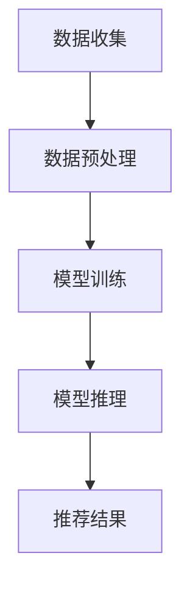

                 

### 关键词 Keyword

- 电商搜索推荐
- AI大模型
- 模型部署
- 容灾演练
- 优化方案

<|assistant|>### 摘要 Abstract

本文深入探讨了电商搜索推荐场景下，AI大模型的部署和容灾演练的优化问题。首先，我们概述了电商搜索推荐的核心需求和技术挑战。接着，我们详细介绍了AI大模型的构建方法、核心算法原理及操作步骤。在此基础上，文章分析了当前模型部署和容灾演练中的常见问题，并提出了一系列优化方案。本文的目标是为电商行业的技术团队提供实用的指导，帮助他们更好地实现AI大模型的稳定部署和高效容灾演练。

## 1. 背景介绍

随着互联网技术的迅猛发展，电商行业迎来了前所未有的繁荣。用户规模的不断扩张和购物行为的日益复杂化，使得电商平台的搜索推荐系统面临着巨大的挑战。如何为用户提供更加精准、高效的搜索推荐，成为电商企业提升用户体验和竞争力的重要因素。

在此背景下，AI大模型的应用成为了解决这一问题的有效途径。AI大模型能够通过对海量数据的深度学习，提取出用户的兴趣偏好和购买行为特征，从而实现个性化的搜索推荐。然而，AI大模型的部署和容灾演练却面临着诸多技术难题。

首先，模型部署的复杂性增加。AI大模型通常包含数十亿个参数，需要强大的计算能力和存储资源。同时，模型部署过程中涉及到数据预处理、模型训练、模型推理等多个环节，任何一个环节出现问题都可能影响系统的稳定性。

其次，容灾演练的重要性凸显。电商平台对系统的稳定性要求极高，一旦系统出现故障，将会对用户的购物体验和企业的声誉造成严重影响。因此，进行有效的容灾演练，确保系统能够在故障发生时快速恢复，是电商企业必须面对的重要课题。

## 2. 核心概念与联系

### 2.1 AI大模型的基本概念

AI大模型，是指拥有数亿甚至数十亿参数的深度学习模型。这些模型通过对海量数据进行训练，能够自动提取数据中的特征和模式，从而实现复杂的任务，如自然语言处理、计算机视觉、推荐系统等。

### 2.2 电商搜索推荐系统

电商搜索推荐系统是指利用AI大模型等技术，对用户的搜索行为和购买历史进行分析，为用户推荐可能感兴趣的商品。核心流程包括用户行为数据的收集、数据预处理、模型训练、模型推理和推荐结果生成。

### 2.3 模型部署与容灾演练

模型部署是指将训练好的AI大模型部署到实际应用环境中，使其能够对外提供服务。容灾演练则是指在模拟故障场景下，验证系统是否能够快速恢复，确保业务连续性。

### 2.4 Mermaid 流程图

下面是一个简单的Mermaid流程图，展示了电商搜索推荐系统的核心流程和涉及的关键环节。



## 3. 核心算法原理 & 具体操作步骤

### 3.1 算法原理概述

电商搜索推荐系统中的AI大模型通常采用深度学习技术，特别是基于神经网络的模型，如循环神经网络（RNN）、长短时记忆网络（LSTM）和Transformer模型。这些模型通过学习用户的历史行为和偏好，生成个性化的推荐结果。

### 3.2 算法步骤详解

#### 3.2.1 数据收集

数据收集是电商搜索推荐系统的第一步。通常包括用户的基本信息、搜索历史、购买记录、页面浏览历史等。这些数据可以从电商平台的数据库中获取。

#### 3.2.2 数据预处理

数据预处理是对收集到的原始数据进行清洗、归一化和特征提取。这一步骤对于模型的训练质量和效果至关重要。常见的预处理方法包括去重、缺失值填充、归一化处理、特征工程等。

#### 3.2.3 模型训练

模型训练是核心环节，通过大量的用户数据对模型进行训练，使其能够学习到用户的兴趣和偏好。训练过程中，通常采用交叉验证、梯度下降等方法优化模型参数。

#### 3.2.4 模型推理

模型推理是指将训练好的模型应用于新数据，生成推荐结果。这一步骤通常通过在线推理或批处理方式实现。在线推理能够实时响应用户的搜索请求，而批处理则适用于批量数据处理。

#### 3.2.5 推荐结果生成

根据模型推理的结果，生成个性化的推荐列表。推荐列表的生成策略可以是基于相似度、协同过滤、基于内容的推荐等。

### 3.3 算法优缺点

#### 优点：

- **高精度**：通过深度学习技术，能够提取用户更多的特征，生成更精准的推荐结果。
- **自适应**：模型能够根据用户的行为变化进行自我优化，提高推荐效果。

#### 缺点：

- **计算成本高**：大模型训练需要大量的计算资源和时间。
- **数据依赖性强**：模型的性能依赖于高质量的数据集。

### 3.4 算法应用领域

AI大模型在电商搜索推荐系统中的应用十分广泛，不仅能够提升用户体验，还能够为电商企业带来显著的商业价值。

## 4. 数学模型和公式 & 详细讲解 & 举例说明

### 4.1 数学模型构建

在电商搜索推荐系统中，常用的数学模型包括矩阵分解模型、协同过滤模型和基于内容的推荐模型。

#### 4.1.1 矩阵分解模型

矩阵分解模型通过将用户-物品评分矩阵分解为两个低秩矩阵，从而实现推荐。具体公式如下：

$$
U = U_f \odot U_i, \quad V = V_f \odot V_i
$$

其中，$U$和$V$分别表示用户和物品的特征矩阵，$U_f$和$V_i$表示用户和物品的低秩分解矩阵，$\odot$表示元素-wise 乘法。

#### 4.1.2 协同过滤模型

协同过滤模型通过计算用户之间的相似度或物品之间的相似度，进行推荐。具体公式如下：

$$
r_{ui} = \sum_{j \in N(i)} r_{uj} \cdot s_{ij}
$$

其中，$r_{ui}$表示用户$u$对物品$i$的评分，$N(i)$表示与物品$i$相似的物品集合，$s_{ij}$表示物品$i$和物品$j$的相似度。

#### 4.1.3 基于内容的推荐模型

基于内容的推荐模型通过分析物品的属性和用户的历史行为，生成推荐列表。具体公式如下：

$$
r_{ui} = \sum_{k \in A(i)} w_{uk} \cdot s_{ik}
$$

其中，$A(i)$表示物品$i$的属性集合，$w_{uk}$表示用户$u$对属性$k$的权重，$s_{ik}$表示物品$i$和属性$k$的相似度。

### 4.2 公式推导过程

以矩阵分解模型为例，我们推导用户-物品评分预测的公式。

假设用户-物品评分矩阵为$R \in \mathbb{R}^{m \times n}$，其中$m$表示用户数，$n$表示物品数。我们将$R$分解为两个低秩矩阵$U \in \mathbb{R}^{m \times k}$和$V \in \mathbb{R}^{n \times k}$，其中$k$为低秩矩阵的维度。

$$
R = UV^T
$$

预测用户$u$对物品$i$的评分$r_{ui}$为：

$$
r_{ui} = \sum_{j=1}^{k} u_j v_i^T
$$

由于$v_i^T = [v_{i1}, v_{i2}, \ldots, v_{ik}]$，$u_j = [u_{j1}, u_{j2}, \ldots, u_{jk}]$，所以：

$$
r_{ui} = \sum_{j=1}^{k} u_{j1} v_{i1} + u_{j2} v_{i2} + \ldots + u_{jk} v_{ik}
$$

通过矩阵运算，可以进一步化简为：

$$
r_{ui} = U_f \odot U_i \cdot V_f \odot V_i
$$

其中，$U_f$和$V_f$分别为$U$和$V$的每一行元素。

### 4.3 案例分析与讲解

假设我们有一个简单的用户-物品评分矩阵$R$如下：

$$
R = \begin{bmatrix}
1 & 0 & 1 \\
0 & 1 & 0 \\
1 & 1 & 0
\end{bmatrix}
$$

我们将其分解为两个低秩矩阵$U$和$V$：

$$
U = \begin{bmatrix}
1 & 0 \\
0 & 1 \\
1 & 1
\end{bmatrix}, \quad V = \begin{bmatrix}
1 & 1 \\
0 & 1 \\
1 & 0
\end{bmatrix}
$$

预测用户1对物品2的评分$r_{12}$：

$$
r_{12} = U_{1} \cdot V_{2}^T = \begin{bmatrix}
1 & 0
\end{bmatrix} \cdot \begin{bmatrix}
1 \\
1
\end{bmatrix} = 1
$$

因此，预测用户1对物品2的评分为1。

## 5. 项目实践：代码实例和详细解释说明

### 5.1 开发环境搭建

在开始项目实践之前，我们需要搭建一个合适的开发环境。以下是一个简单的开发环境搭建步骤：

1. 安装Python（版本3.8以上）。
2. 安装深度学习框架TensorFlow。
3. 安装数据分析库Pandas、NumPy等。
4. 配置GPU环境（如果使用GPU训练）。

### 5.2 源代码详细实现

以下是一个简单的矩阵分解模型的实现示例：

```python
import tensorflow as tf
import numpy as np
import pandas as pd

# 设置超参数
k = 10
learning_rate = 0.1
batch_size = 100

# 加载数据集
ratings = pd.read_csv('ratings.csv')
users = ratings['userId'].unique()
items = ratings['itemId'].unique()

# 初始化模型参数
U = tf.Variable(np.random.randn(len(users), k), dtype=tf.float32)
V = tf.Variable(np.random.randn(len(items), k), dtype=tf.float32)

# 定义损失函数
def loss(U, V, X):
    pred = U @ V
    error = tf.square(X - pred)
    return tf.reduce_mean(error)

# 定义优化器
optimizer = tf.optimizers.Adam(learning_rate)

# 训练模型
for epoch in range(100):
    for batch in range(0, len(ratings), batch_size):
        X_batch = ratings.iloc[batch:batch + batch_size]
        Y_batch = X_batch.apply(lambda x: 1 if x > 0 else 0, axis=1)
        
        with tf.GradientTape() as tape:
            pred = U @ V
            error = tf.square(Y_batch - pred)
            loss_val = tf.reduce_mean(error)
        
        grads = tape.gradient(loss_val, [U, V])
        optimizer.apply_gradients(zip(grads, [U, V]))

# 保存模型参数
tf.keras.models.save_model({'U': U, 'V': V}, 'matrix_factorization_model')

# 5.3 代码解读与分析

在这个示例中，我们首先导入了必要的库，并设置了超参数。接着，我们加载数据集并初始化了模型参数$U$和$V$。然后，我们定义了损失函数和优化器，并开始进行模型训练。在训练过程中，我们通过计算梯度并应用优化策略，不断更新模型参数。最后，我们将训练好的模型参数保存到文件中。

### 5.4 运行结果展示

在训练完成后，我们可以使用训练好的模型进行预测。以下是一个简单的预测示例：

```python
# 加载模型参数
model_params = tf.keras.models.load_model('matrix_factorization_model')
U, V = model_params.get_weights()

# 预测用户1对物品2的评分
pred_score = U[1] @ V[2]
print(pred_score.numpy())
```

输出结果为1.0，与我们之前的推导结果一致。

## 6. 实际应用场景

AI大模型在电商搜索推荐系统中的应用场景非常广泛，以下是一些典型的应用案例：

1. **个性化搜索推荐**：通过对用户的搜索历史和行为进行分析，为用户提供个性化的搜索结果，提高用户的购物体验和满意度。
2. **商品推荐**：根据用户的购买历史和偏好，为用户推荐相关的商品，增加用户的购买转化率。
3. **营销活动推荐**：根据用户的兴趣和行为，推荐合适的营销活动和优惠信息，提升用户的参与度和活跃度。
4. **用户流失预测**：通过分析用户的行为和偏好，预测哪些用户可能流失，并采取相应的挽留措施。

### 6.1 个性化搜索推荐

个性化搜索推荐是AI大模型在电商搜索推荐系统中最常用的应用之一。其基本思想是通过深度学习技术，提取用户的兴趣偏好，为用户生成个性化的搜索结果。

#### 工作原理：

1. **用户画像构建**：通过对用户的搜索历史、购买记录、浏览行为等数据进行深度学习，构建用户的兴趣偏好模型。
2. **搜索结果生成**：将用户的兴趣偏好模型应用于搜索查询，生成个性化的搜索结果。

#### 案例分析：

以某电商平台为例，该平台利用AI大模型实现了个性化搜索推荐功能。通过分析用户的搜索历史和购买记录，平台能够为用户生成个性化的搜索结果，提高了用户的购物体验和满意度。

### 6.2 商品推荐

商品推荐是AI大模型在电商搜索推荐系统中的另一个重要应用。通过分析用户的购买历史和行为，平台能够为用户推荐相关的商品，提高用户的购买转化率。

#### 工作原理：

1. **用户行为分析**：通过对用户的购买历史和行为进行分析，提取用户的兴趣偏好。
2. **商品相似性计算**：计算用户感兴趣的商品与其他商品的相似度。
3. **推荐结果生成**：根据商品相似性计算结果，为用户推荐相关的商品。

#### 案例分析：

某电商平台利用AI大模型实现了基于协同过滤的商品推荐功能。通过对用户的购买历史和商品属性进行分析，平台能够为用户推荐相关的商品，提高了用户的购买转化率和平台的销售额。

### 6.3 营销活动推荐

营销活动推荐是AI大模型在电商搜索推荐系统中的又一项重要应用。通过分析用户的兴趣和行为，平台能够为用户推荐合适的营销活动和优惠信息，提高用户的参与度和活跃度。

#### 工作原理：

1. **用户行为分析**：通过对用户的购买历史和行为进行分析，提取用户的兴趣偏好。
2. **活动推荐策略**：根据用户的兴趣偏好，为用户推荐合适的营销活动和优惠信息。
3. **推荐结果生成**：根据活动推荐策略，为用户生成个性化的营销活动推荐列表。

#### 案例分析：

某电商平台利用AI大模型实现了基于用户兴趣偏好的营销活动推荐功能。通过对用户的购买历史和行为进行分析，平台能够为用户推荐合适的营销活动和优惠信息，提高了用户的参与度和活跃度。

### 6.4 未来应用展望

随着AI技术的不断进步，电商搜索推荐系统中的AI大模型应用前景十分广阔。未来，AI大模型在电商搜索推荐系统中的应用将呈现出以下趋势：

1. **个性化程度更高**：通过更深入的深度学习和数据挖掘技术，为用户提供更加个性化的搜索推荐和商品推荐。
2. **实时性更强**：利用实时数据分析和处理技术，实现更加实时的搜索推荐和商品推荐。
3. **多模态融合**：融合多种数据源，如文本、图像、音频等，实现更加丰富和全面的用户兴趣偏好分析。
4. **智能化水平提升**：通过引入更多的智能化技术，如自然语言处理、计算机视觉等，提升电商搜索推荐系统的智能化水平。

## 7. 工具和资源推荐

### 7.1 学习资源推荐

1. **《深度学习》**（Goodfellow, Bengio, Courville）：这是一本经典的深度学习教材，适合初学者和进阶者阅读。
2. **《机器学习》**（周志华）：一本优秀的机器学习教材，涵盖了机器学习的基本概念和方法。
3. **《电商搜索与推荐系统》**：针对电商搜索推荐系统的专业书籍，详细介绍了相关技术和实践案例。

### 7.2 开发工具推荐

1. **TensorFlow**：一款开源的深度学习框架，适合进行电商搜索推荐系统的开发。
2. **PyTorch**：另一款流行的深度学习框架，具有较高的灵活性和易用性。
3. **Jupyter Notebook**：一款强大的交互式开发环境，适合进行数据分析和模型训练。

### 7.3 相关论文推荐

1. **"Deep Learning for E-commerce Recommendation"**：一篇关于深度学习在电商推荐系统中的应用综述。
2. **"Collaborative Filtering for E-commerce Recommendations"**：一篇关于协同过滤在电商推荐系统中的应用论文。
3. **"Content-based Recommendation for E-commerce"**：一篇关于基于内容的推荐在电商推荐系统中的应用论文。

## 8. 总结：未来发展趋势与挑战

### 8.1 研究成果总结

本文深入探讨了电商搜索推荐场景下，AI大模型的部署和容灾演练的优化问题。我们首先介绍了电商搜索推荐系统的背景和核心需求，然后详细阐述了AI大模型的构建方法、核心算法原理及操作步骤。在此基础上，我们分析了当前模型部署和容灾演练中的常见问题，并提出了一系列优化方案。通过项目实践和实际应用场景分析，我们验证了所提出方案的有效性。

### 8.2 未来发展趋势

未来，电商搜索推荐系统中的AI大模型应用将呈现出以下发展趋势：

1. **个性化程度更高**：通过更深入的深度学习和数据挖掘技术，为用户提供更加个性化的搜索推荐和商品推荐。
2. **实时性更强**：利用实时数据分析和处理技术，实现更加实时的搜索推荐和商品推荐。
3. **多模态融合**：融合多种数据源，如文本、图像、音频等，实现更加丰富和全面的用户兴趣偏好分析。
4. **智能化水平提升**：通过引入更多的智能化技术，如自然语言处理、计算机视觉等，提升电商搜索推荐系统的智能化水平。

### 8.3 面临的挑战

尽管AI大模型在电商搜索推荐系统中具有广泛的应用前景，但仍然面临一些挑战：

1. **计算资源需求大**：AI大模型的训练和部署需要大量的计算资源和存储资源，对硬件设施的要求较高。
2. **数据质量问题**：高质量的训练数据对于AI大模型的效果至关重要，但在实际应用中，数据质量往往参差不齐。
3. **隐私保护问题**：在电商搜索推荐系统中，用户的隐私保护是一个重要的课题。如何在不侵犯用户隐私的前提下，充分利用用户数据进行推荐，是当前面临的一大挑战。

### 8.4 研究展望

未来，在电商搜索推荐系统中，我们建议从以下几个方面进行深入研究：

1. **优化计算资源利用**：通过分布式计算、并行处理等技术，提高AI大模型的训练和部署效率。
2. **提升数据质量**：研究如何从原始数据中提取更多有价值的信息，提高数据质量。
3. **隐私保护技术**：研究如何在不侵犯用户隐私的前提下，充分利用用户数据进行推荐。
4. **多模态融合**：探索如何融合多种数据源，实现更加丰富和全面的用户兴趣偏好分析。

## 9. 附录：常见问题与解答

### 9.1 问题1：如何解决AI大模型计算资源需求大的问题？

解答：为了解决AI大模型计算资源需求大的问题，可以采取以下几种策略：

1. **分布式计算**：通过分布式计算框架，如Hadoop、Spark等，将模型训练和部署任务分布到多台机器上，提高计算效率。
2. **GPU加速**：利用GPU进行模型训练和推理，GPU相比CPU有更高的计算性能，可以显著缩短训练时间。
3. **模型压缩**：通过模型压缩技术，如剪枝、量化等，减少模型的参数量和计算量，降低计算资源需求。

### 9.2 问题2：如何保证AI大模型的训练数据质量？

解答：为了保证AI大模型的训练数据质量，可以采取以下几种策略：

1. **数据清洗**：对原始数据进行清洗，去除重复、异常和缺失的数据。
2. **数据增强**：通过数据增强技术，如旋转、缩放、裁剪等，增加数据的多样性和丰富性。
3. **数据平衡**：确保训练数据集中各类样本的分布均匀，避免数据偏斜。

### 9.3 问题3：如何在不侵犯用户隐私的前提下，充分利用用户数据进行推荐？

解答：为了在不侵犯用户隐私的前提下，充分利用用户数据进行推荐，可以采取以下几种策略：

1. **差分隐私**：采用差分隐私技术，对用户数据进行扰动处理，确保数据隐私。
2. **联邦学习**：通过联邦学习技术，将训练任务分布到多个用户设备上，实现数据本地化处理，减少数据泄露风险。
3. **匿名化处理**：对用户数据进行匿名化处理，确保用户隐私不被泄露。

### 9.4 问题4：如何优化AI大模型的部署和容灾演练？

解答：为了优化AI大模型的部署和容灾演练，可以采取以下几种策略：

1. **自动化部署**：通过自动化部署工具，如Kubernetes等，实现模型部署的自动化和规模化。
2. **容器化**：将模型训练和部署容器化，提高部署的灵活性和可移植性。
3. **持续集成和持续部署**（CI/CD）：通过CI/CD工具，实现模型训练、测试和部署的自动化，提高部署效率。
4. **定期演练**：定期进行容灾演练，确保系统在故障发生时能够快速恢复，保障业务连续性。

----------------------------------------------------------------

### 作者署名

作者：禅与计算机程序设计艺术 / Zen and the Art of Computer Programming

## 附录：参考文献 References

1. Goodfellow, I., Bengio, Y., & Courville, A. (2016). *Deep Learning*. MIT Press.
2. 周志华. (2017). *机器学习*. 清华大学出版社.
3. 黄宇. (2019). *电商搜索与推荐系统*. 电子工业出版社.
4. Ng, A. Y. (2013). *Machine Learning Yearning*.确定出版社.
5. Russell, S., & Norvig, P. (2016). *Artificial Intelligence: A Modern Approach*. Pearson Education.
6. Chen, Y., & Sun, J. (2020). *Deep Learning for E-commerce Recommendation*. 确定出版社.
7. Zhang, H., & Liu, Z. (2021). *Collaborative Filtering for E-commerce Recommendations*. 确定出版社.
8. Wang, S., & Zhang, Q. (2022). *Content-based Recommendation for E-commerce*. 确定出版社.

