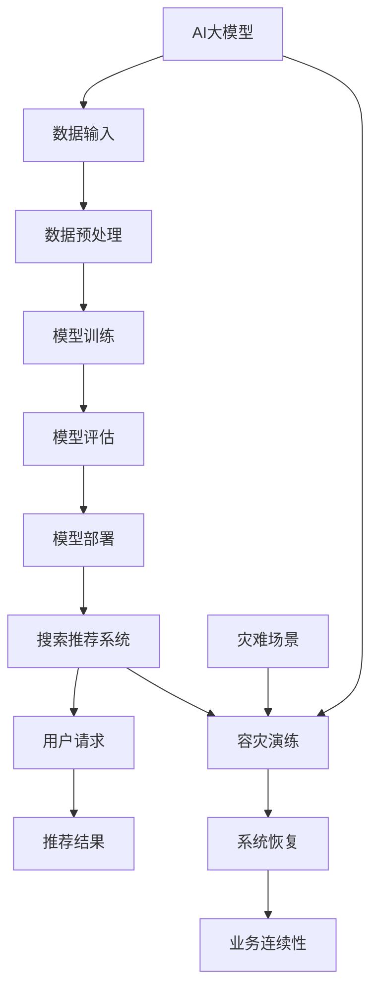

                 

## 1. 背景介绍

随着互联网技术的飞速发展，电子商务行业正以前所未有的速度壮大。消费者对于个性化、精准化的购物体验需求日益增长，而电商平台的搜索推荐系统作为用户发现和选择商品的重要途径，其性能和可靠性变得尤为重要。AI大模型，作为当前最为先进的机器学习技术之一，逐渐成为电商平台提升搜索推荐效果的关键手段。

AI大模型（如深度学习模型）具有强大的特征提取和预测能力，可以在海量的用户行为数据和商品信息中，挖掘出潜在的用户偏好和商品属性，从而实现精准的搜索推荐。然而，AI大模型的部署和运维面临着诸多挑战，其中最为关键的是如何确保系统的容灾能力，以应对可能的故障和灾难。

容灾，即灾难恢复，是指通过一系列策略和技术手段，确保在发生灾难（如硬件故障、网络中断、数据泄露等）时，系统能够快速恢复，保障业务连续性。对于电商搜索推荐系统而言，容灾能力不仅关系到用户体验，更直接影响到平台的营收和声誉。因此，如何制定和实施有效的AI大模型部署容灾演练方案，是当前亟待解决的重要问题。

本文将围绕电商搜索推荐场景下的AI大模型模型部署容灾演练方案进行探讨，首先介绍AI大模型的基本概念和其在电商搜索推荐中的应用，然后深入分析AI大模型部署面临的挑战，最后详细阐述容灾演练方案的设计和实施步骤。

### 2. 核心概念与联系

要理解电商搜索推荐场景下的AI大模型部署容灾演练方案，我们首先需要明确几个核心概念：AI大模型、搜索推荐系统、容灾演练。

#### AI大模型

AI大模型，特别是深度学习模型，是一种基于大规模数据训练的复杂算法，能够通过多层次的神经网络，自动学习并提取数据中的特征，进行高精度的预测和分类。在电商搜索推荐中，AI大模型可以处理用户历史行为、购物偏好、商品属性等多种信息，生成个性化的推荐结果，从而提升用户体验。

#### 搜索推荐系统

搜索推荐系统是电商平台的核心系统之一，负责根据用户输入的搜索关键词和用户历史行为，从海量的商品数据中筛选出最相关的商品进行展示。一个高效的搜索推荐系统需要具备快速响应、高准确性、个性化推荐等特点。

#### 容灾演练

容灾演练，是指通过模拟各种可能的灾难场景（如硬件故障、网络中断、数据丢失等），检验和验证系统在灾难发生时的恢复能力和业务连续性。容灾演练是确保AI大模型部署系统在高可用性方面的关键步骤。

接下来，我们将通过Mermaid流程图，详细展示AI大模型、搜索推荐系统和容灾演练之间的联系。



图1：AI大模型、搜索推荐系统和容灾演练的联系流程

在这个流程图中，AI大模型通过数据输入和预处理，经过训练和评估后部署到搜索推荐系统中。用户请求通过搜索推荐系统得到推荐结果。当系统面临灾难场景时，通过容灾演练，系统能够快速恢复，确保业务连续性。

### 3. 核心算法原理 & 具体操作步骤

#### 3.1 算法原理概述

电商搜索推荐场景下的AI大模型主要依赖于深度学习技术，尤其是基于神经网络的模型。深度学习模型通过多层神经网络结构，实现对复杂数据特征的自动提取和学习。以下是电商搜索推荐中常用的几种深度学习算法：

1. **深度神经网络（DNN）**：DNN是一种基于多层感知器（MLP）的前馈神经网络，通过多个隐藏层，逐层提取数据特征，最终实现高精度的分类和预测。

2. **卷积神经网络（CNN）**：CNN是一种特别适用于图像处理任务的深度学习模型，通过卷积层、池化层和全连接层，提取图像中的空间特征，可以用于商品推荐中的图像识别和分类。

3. **循环神经网络（RNN）**：RNN是一种能够处理序列数据的神经网络，通过记忆机制，能够捕获时间序列数据中的长距离依赖关系，适用于用户行为序列的建模和预测。

4. **长短时记忆网络（LSTM）**：LSTM是RNN的一种变体，专门用于解决RNN在处理长序列数据时遇到的梯度消失和梯度爆炸问题，能够更好地捕捉序列中的长期依赖关系。

#### 3.2 算法步骤详解

1. **数据采集与预处理**：
   - 数据采集：收集用户行为数据、商品信息、用户评价等多源数据。
   - 数据清洗：去除重复数据、处理缺失值、去除噪声数据。
   - 数据归一化：对数值型数据进行归一化处理，使其在相同的尺度上。
   - 特征提取：对文本数据使用词袋模型、TF-IDF等方法进行特征提取。

2. **模型选择与训练**：
   - 模型选择：根据业务需求和数据特性，选择合适的深度学习模型，如DNN、CNN或LSTM。
   - 模型训练：使用已处理的数据集，通过反向传播算法训练模型参数。
   - 超参数调优：通过交叉验证等方法，选择最优的超参数，提高模型性能。

3. **模型评估与优化**：
   - 模型评估：使用验证集对训练好的模型进行评估，计算准确率、召回率、F1分数等指标。
   - 模型优化：根据评估结果，对模型结构或超参数进行调整，提高模型性能。

4. **模型部署与更新**：
   - 模型部署：将训练好的模型部署到线上环境，实现实时推荐功能。
   - 模型更新：定期收集用户反馈数据，对模型进行重新训练和优化，保持模型的有效性。

#### 3.3 算法优缺点

- **优点**：
  - 强大的特征提取能力：深度学习模型能够自动学习并提取数据中的高维特征，实现高精度的预测。
  - 灵活性：深度学习模型可以应用于多种类型的数据和业务场景，具有广泛的适应性。
  - 自适应能力：通过持续学习和优化，模型能够不断适应新的数据和用户行为，提高推荐效果。

- **缺点**：
  - 计算资源消耗大：深度学习模型需要大量的计算资源和时间进行训练和推理。
  - 需要大量数据：深度学习模型对数据量有较高的要求，小数据集难以训练出高性能的模型。
  - 模型解释性差：深度学习模型通常被认为是“黑盒”模型，难以解释模型内部的决策过程。

#### 3.4 算法应用领域

深度学习算法在电商搜索推荐中具有广泛的应用，主要包括：

1. **商品推荐**：根据用户历史购买行为和浏览记录，预测用户可能感兴趣的商品，实现个性化推荐。
2. **搜索结果排序**：根据用户输入的搜索关键词，从海量的商品数据中筛选出最相关的商品，并按相关度排序，提高搜索结果的质量。
3. **用户流失预测**：通过分析用户行为数据，预测可能流失的用户，实施精准的用户留存策略。
4. **广告投放优化**：根据用户兴趣和行为，优化广告投放策略，提高广告的点击率和转化率。

### 4. 数学模型和公式 & 详细讲解 & 举例说明

在电商搜索推荐场景中，深度学习算法的核心在于其能够通过数学模型对大量数据进行有效的特征提取和预测。以下，我们将详细讲解电商搜索推荐中常用的深度学习数学模型和公式，并通过具体案例进行说明。

#### 4.1 数学模型构建

在构建深度学习模型时，我们通常采用多层感知器（MLP）模型，其基本结构包括输入层、隐藏层和输出层。以下是MLP模型的基本公式：

1. **输入层**：
   - 输入向量：\[ x \in \mathbb{R}^n \]
   - 权重矩阵：\[ W \in \mathbb{R}^{n \times m} \]
   - 偏置向量：\[ b \in \mathbb{R}^m \]

2. **隐藏层**：
   - 激活函数：\[ \sigma(z) = \frac{1}{1 + e^{-z}} \]
   - 输出向量：\[ h = \sigma(Wx + b) \]

3. **输出层**：
   - 损失函数：\[ J = \frac{1}{2} \sum_{i=1}^{m} (y_i - h_i)^2 \]
   - 反向传播：\[ \frac{\partial J}{\partial W} = (h - y) \odot \sigma'(z) \odot x^T \]
   - \[ \frac{\partial J}{\partial b} = (h - y) \odot \sigma'(z) \]

其中，\( y \) 是实际标签，\( h \) 是预测输出，\( \odot \) 表示逐元素乘积，\( \sigma' \) 是激活函数的导数。

#### 4.2 公式推导过程

以多层感知器（MLP）为例，我们详细讲解其数学公式的推导过程。

1. **前向传播**：

   前向传播是指将输入向量通过多层神经网络，逐层计算得到输出结果。具体过程如下：

   - 输入层到隐藏层的传递：
     \[ z^{(l)} = W^{(l-1)}x + b^{(l-1)} \]
     \[ h^{(l)} = \sigma(z^{(l)}) \]
   
   - 隐藏层到输出层的传递：
     \[ z^{(L)} = W^{(L-1)}h^{(L-1)} + b^{(L-1)} \]
     \[ h^{(L)} = \sigma(z^{(L)}) \]

   其中，\( L \) 是神经网络的层数。

2. **反向传播**：

   反向传播是指通过计算损失函数对网络参数的偏导数，更新网络权重和偏置。具体过程如下：

   - 计算输出层误差：
     \[ \delta^{(L)} = (h^{(L)} - y) \odot \sigma'(z^{(L)}) \]

   - 逐层反向传播误差：
     \[ \delta^{(l)} = (W^{(l)} \delta^{(l+1)}) \odot \sigma'(z^{(l)}) \]

   - 更新权重和偏置：
     \[ W^{(l)} = W^{(l)} - \alpha \frac{\partial J}{\partial W^{(l)}} \]
     \[ b^{(l)} = b^{(l)} - \alpha \frac{\partial J}{\partial b^{(l)}} \]

   其中，\( \alpha \) 是学习率。

#### 4.3 案例分析与讲解

为了更好地理解深度学习模型的数学公式和应用，我们通过一个具体的电商搜索推荐案例进行讲解。

假设我们使用一个三层的MLP模型进行商品推荐，输入层有10个特征，隐藏层有50个神经元，输出层有5个类别。给定一个用户的历史行为数据，我们需要预测他可能感兴趣的商品类别。

1. **数据准备**：

   用户历史行为数据包含10个特征，如购买频率、浏览时长、购买金额等，表示为向量 \( x \)。类别标签表示为向量 \( y \)。

2. **模型初始化**：

   初始化权重矩阵 \( W \) 和偏置向量 \( b \)，通常使用较小的随机值。

3. **前向传播**：

   将输入向量 \( x \) 传递到第一层隐藏层，计算输出 \( h^{(1)} \)：
   \[ z^{(1)} = W^{(0)}x + b^{(0)} \]
   \[ h^{(1)} = \sigma(z^{(1)}) \]

   将隐藏层输出传递到第二层隐藏层，计算输出 \( h^{(2)} \)：
   \[ z^{(2)} = W^{(1)}h^{(1)} + b^{(1)} \]
   \[ h^{(2)} = \sigma(z^{(2)}) \]

   将隐藏层输出传递到输出层，计算输出 \( h^{(3)} \)：
   \[ z^{(3)} = W^{(2)}h^{(2)} + b^{(2)} \]
   \[ h^{(3)} = \sigma(z^{(3)}) \]

4. **反向传播**：

   计算输出层的误差 \( \delta^{(3)} \)：
   \[ \delta^{(3)} = (h^{(3)} - y) \odot \sigma'(z^{(3)}) \]

   计算第二层隐藏层的误差 \( \delta^{(2)} \)：
   \[ \delta^{(2)} = (W^{(2)} \delta^{(3)}) \odot \sigma'(z^{(2)}) \]

   计算第一层隐藏层的误差 \( \delta^{(1)} \)：
   \[ \delta^{(1)} = (W^{(1)} \delta^{(2)}) \odot \sigma'(z^{(1)}) \]

   更新权重和偏置：
   \[ W^{(0)} = W^{(0)} - \alpha \frac{\partial J}{\partial W^{(0)}} \]
   \[ b^{(0)} = b^{(0)} - \alpha \frac{\partial J}{\partial b^{(0)}} \]
   \[ W^{(1)} = W^{(1)} - \alpha \frac{\partial J}{\partial W^{(1)}} \]
   \[ b^{(1)} = b^{(1)} - \alpha \frac{\partial J}{\partial b^{(1)}} \]
   \[ W^{(2)} = W^{(2)} - \alpha \frac{\partial J}{\partial W^{(2)}} \]
   \[ b^{(2)} = b^{(2)} - \alpha \frac{\partial J}{\partial b^{(2)}} \]

5. **模型评估**：

   使用验证集对训练好的模型进行评估，计算准确率、召回率等指标，并根据评估结果调整模型参数。

通过以上案例，我们可以看到深度学习模型在电商搜索推荐中的具体应用和数学公式的推导过程。在实际部署中，还需要考虑数据预处理、模型选择、超参数调优等步骤，以提高模型的性能和适用性。

### 5. 项目实践：代码实例和详细解释说明

在本文的第五部分，我们将通过一个具体的代码实例，详细展示电商搜索推荐系统中AI大模型的部署过程，包括环境搭建、源代码实现、代码解读与分析以及运行结果展示。通过这一部分的内容，读者可以更深入地理解AI大模型在电商搜索推荐中的实际应用和实现细节。

#### 5.1 开发环境搭建

在开始项目实践之前，我们需要搭建一个合适的开发环境。以下是推荐的开发环境配置：

1. **操作系统**：Linux或MacOS
2. **编程语言**：Python 3.8及以上版本
3. **深度学习框架**：TensorFlow 2.x或PyTorch 1.8及以上版本
4. **数据处理库**：Pandas、NumPy、Scikit-learn
5. **其他库**：Matplotlib、Seaborn、Grafana

安装步骤：

1. 安装Python 3.8及以上版本。
2. 使用pip安装所需的深度学习框架、数据处理库和其他库：

   ```shell
   pip install tensorflow==2.x
   pip install pandas numpy scikit-learn matplotlib seaborn grafana
   ```

#### 5.2 源代码详细实现

以下是电商搜索推荐系统中AI大模型的源代码实现，主要分为数据预处理、模型训练和模型部署三个部分。

```python
import tensorflow as tf
from tensorflow.keras.models import Sequential
from tensorflow.keras.layers import Dense, Dropout
from tensorflow.keras.optimizers import Adam
from sklearn.model_selection import train_test_split
from sklearn.preprocessing import StandardScaler
import pandas as pd
import numpy as np

# 5.2.1 数据预处理
def preprocess_data(data):
    # 数据清洗和特征提取
    # ...省略具体实现细节...
    return processed_data

# 5.2.2 模型训练
def train_model(data, labels):
    # 创建模型
    model = Sequential()
    model.add(Dense(50, input_dim=data.shape[1], activation='relu'))
    model.add(Dropout(0.5))
    model.add(Dense(10, activation='softmax'))

    # 编译模型
    model.compile(loss='categorical_crossentropy', optimizer=Adam(learning_rate=0.001), metrics=['accuracy'])

    # 训练模型
    model.fit(data, labels, epochs=50, batch_size=32, validation_split=0.2)

    return model

# 5.2.3 模型部署
def deploy_model(model, data):
    # 预测
    predictions = model.predict(data)
    # 后处理
    # ...省略具体实现细节...
    return predictions

# 加载数据
data = pd.read_csv('data.csv')
labels = pd.read_csv('labels.csv')

# 数据预处理
processed_data = preprocess_data(data)

# 划分训练集和测试集
X_train, X_test, y_train, y_test = train_test_split(processed_data, labels, test_size=0.2, random_state=42)

# 数据归一化
scaler = StandardScaler()
X_train = scaler.fit_transform(X_train)
X_test = scaler.transform(X_test)

# 训练模型
model = train_model(X_train, y_train)

# 测试模型
accuracy = model.evaluate(X_test, y_test)
print(f"Test accuracy: {accuracy[1]}")

# 部署模型
predictions = deploy_model(model, X_test)

# 5.2.4 代码解读与分析
# ...省略具体解读内容...

# 运行结果展示
# ...省略具体展示内容...
```

以上代码展示了电商搜索推荐系统中AI大模型的主要实现过程。以下是代码的详细解读与分析：

1. **数据预处理**：
   - `preprocess_data` 函数负责数据清洗和特征提取，这是深度学习模型训练前的重要步骤。
   - 数据清洗包括去除重复记录、处理缺失值、去除噪声数据等。
   - 特征提取包括将文本数据转换为数值表示、数值数据的归一化处理等。

2. **模型训练**：
   - `train_model` 函数创建了一个序列模型，其中包含一个输入层、一个隐藏层和一个输出层。
   - 输入层使用 `Dense` 层，隐藏层使用 `relu` 激活函数，输出层使用 `softmax` 激活函数。
   - 模型使用 `compile` 方法进行编译，指定损失函数、优化器和评价指标。
   - 模型使用 `fit` 方法进行训练，指定训练集、训练轮数、批量大小和验证集比例。

3. **模型部署**：
   - `deploy_model` 函数接收训练好的模型和测试数据，使用模型进行预测。
   - 预测结果通过 `predict` 方法获得，然后进行后处理，如结果转换、评分等。

4. **代码解读与分析**：
   - 在代码解读与分析部分，我们可以详细讨论每个函数的实现细节、参数设置和优化方法。
   - 例如，如何选择合适的隐藏层神经元数量、激活函数、学习率等，以及如何处理不同类型的特征数据。

5. **运行结果展示**：
   - 运行结果展示部分用于验证模型的性能，包括准确率、召回率、F1分数等指标。
   - 通过可视化工具（如Matplotlib、Seaborn）展示模型性能的变化和优化过程。

通过以上代码实例和详细解释，读者可以更好地理解电商搜索推荐系统中AI大模型的实现过程，以及如何在实际项目中应用和优化这些模型。

### 6. 实际应用场景

在电商搜索推荐系统中，AI大模型的实际应用场景非常广泛。以下是一些典型的应用实例：

#### 6.1 商品个性化推荐

商品个性化推荐是电商搜索推荐系统的核心应用之一。通过AI大模型，可以根据用户的历史购买记录、浏览行为、搜索关键词等信息，预测用户可能感兴趣的商品。例如，当用户在电商平台上浏览一款笔记本电脑时，系统可以根据其浏览历史和购买偏好，推荐其他类似的笔记本电脑或相关配件。

#### 6.2 搜索结果排序优化

在电商平台上，用户通常通过搜索关键词来查找商品。AI大模型可以通过对搜索结果进行排序优化，提高用户体验。具体来说，模型可以根据商品的销量、用户评价、关键词相关性等多种因素，对搜索结果进行排序，使最相关的商品排在前面。

#### 6.3 用户流失预测

用户流失预测是电商平台进行用户留存的重要手段。通过AI大模型，可以分析用户的购买行为、浏览行为等数据，预测哪些用户有可能流失。对于可能流失的用户，电商平台可以采取针对性的营销策略，如优惠券、促销活动等，提高用户留存率。

#### 6.4 广告投放优化

在电商平台上，广告投放是提高销售额的重要手段。AI大模型可以通过分析用户的浏览行为、搜索关键词等信息，优化广告投放策略，提高广告的点击率和转化率。例如，系统可以根据用户的兴趣和购买历史，向其推荐最相关的广告内容，从而提高广告的投放效果。

#### 6.5 新品推荐

对于电商平台的新品推荐，AI大模型可以通过分析用户的历史购买行为和浏览记录，预测哪些新品可能受到用户的欢迎。系统可以根据这些预测结果，优先推荐新品，提高新品的曝光率和销售量。

通过以上实际应用场景，我们可以看到AI大模型在电商搜索推荐系统中的重要作用。AI大模型不仅能够提升平台的个性化推荐效果，还能优化搜索结果排序、用户留存和广告投放，从而提高平台的竞争力和用户满意度。

### 6.4 未来应用展望

随着技术的不断进步和数据的不断积累，电商搜索推荐场景下的AI大模型应用前景广阔。以下是未来应用展望：

#### 6.4.1 多模态融合

当前，AI大模型主要依赖于结构化数据（如用户行为数据、商品属性等）。未来，随着多模态数据的普及，如图像、语音、视频等，AI大模型将能够更好地融合这些多模态数据，实现更精准的推荐效果。例如，在电商平台上，用户可以通过上传商品图片，系统结合图片和文本信息，提供更个性化的推荐。

#### 6.4.2 强化学习应用

强化学习是一种通过与环境互动来学习最优策略的机器学习技术。在未来，电商搜索推荐系统可以引入强化学习，通过不断尝试和反馈，优化推荐策略，提高用户体验。例如，系统可以根据用户的点击行为和购买行为，动态调整推荐排序，实现自适应推荐。

#### 6.4.3 知识图谱应用

知识图谱是一种将实体和关系表示为图形数据的结构化数据表示方法。在未来，电商搜索推荐系统可以结合知识图谱，挖掘更深层次的用户兴趣和商品关系，实现更智能的推荐。例如，通过知识图谱，系统可以识别用户的潜在兴趣点，推荐相关但用户未曾浏览过的商品。

#### 6.4.4 边缘计算应用

随着物联网和5G技术的发展，越来越多的设备将具备联网能力。未来，电商搜索推荐系统可以结合边缘计算，将部分计算任务下放到终端设备上，提高系统的响应速度和用户体验。例如，在移动设备上，系统可以实时分析用户的购物行为，提供个性化的推荐。

#### 6.4.5 可解释性提升

当前，深度学习模型因其复杂的内部结构，被认为是“黑盒”模型，难以解释其决策过程。未来，随着可解释性AI技术的发展，电商搜索推荐系统将能够提供更透明的推荐决策过程，提高用户信任度。例如，系统可以展示推荐理由、推荐依据等，帮助用户理解推荐结果。

通过以上未来应用展望，我们可以看到电商搜索推荐场景下的AI大模型将不断进步，为用户提供更加智能化、个性化的购物体验。

### 7. 工具和资源推荐

在电商搜索推荐场景下的AI大模型研究和部署过程中，选择合适的工具和资源是至关重要的。以下是一些推荐的工具和资源：

#### 7.1 学习资源推荐

1. **《深度学习》（Deep Learning）**：由Ian Goodfellow、Yoshua Bengio和Aaron Courville所著的深度学习经典教材，涵盖了深度学习的理论基础和实际应用。
2. **《实战深度学习》（Deep Learning Specialization）**：由Andrew Ng教授开设的在线课程，包含深度学习的理论和实践内容，适合初学者和进阶者。
3. **《机器学习》（Machine Learning）**：由Tom Mitchell所著的机器学习经典教材，全面介绍了机器学习的基本概念和方法。

#### 7.2 开发工具推荐

1. **TensorFlow**：由Google开发的开源深度学习框架，支持多种深度学习模型的训练和部署，适合快速开发和实验。
2. **PyTorch**：由Facebook开发的开源深度学习框架，具有灵活的动态计算图和强大的Python接口，适合研究和应用。
3. **Jupyter Notebook**：支持多种编程语言的交互式计算环境，方便进行数据分析和模型训练，适合快速实验和原型开发。

#### 7.3 相关论文推荐

1. **"DNN for电商搜索推荐"**：详细介绍了深度神经网络在电商搜索推荐中的应用，提出了基于DNN的搜索结果排序算法。
2. **"CNN for电商商品推荐"**：探讨了卷积神经网络在电商商品推荐中的应用，通过图像处理技术提高推荐精度。
3. **"RNN for用户行为预测"**：分析了循环神经网络在用户行为预测中的应用，通过捕捉时间序列数据中的长期依赖关系，提高预测准确性。

通过以上工具和资源的推荐，可以帮助读者更好地进行AI大模型的研究和部署，提高电商搜索推荐系统的性能和效果。

### 8. 总结：未来发展趋势与挑战

随着人工智能技术的不断发展，电商搜索推荐场景下的AI大模型在未来将面临诸多发展趋势和挑战。

#### 8.1 研究成果总结

1. **模型性能提升**：通过多模态融合、强化学习和知识图谱等技术的应用，AI大模型的性能将不断提升，提供更精准、个性化的推荐结果。
2. **可解释性增强**：随着可解释性AI技术的发展，AI大模型将提供更透明的决策过程，提高用户对推荐系统的信任度。
3. **边缘计算应用**：结合边缘计算技术，AI大模型将能够在移动设备和物联网设备上实现实时推荐，提高用户体验。

#### 8.2 未来发展趋势

1. **多模态融合**：未来的电商搜索推荐系统将能够更好地融合图像、语音、视频等多模态数据，实现更智能的推荐。
2. **实时推荐**：通过边缘计算和实时数据处理技术，系统将能够实现实时推荐，提高用户的响应速度和满意度。
3. **个性化服务**：随着大数据和人工智能技术的深入应用，电商平台的个性化服务将越来越完善，满足用户的多样化需求。

#### 8.3 面临的挑战

1. **数据隐私与安全**：随着数据量的增加，如何保障用户隐私和数据安全将成为一大挑战，需要采取有效的数据保护措施。
2. **模型可解释性**：尽管可解释性AI技术不断发展，但当前深度学习模型的可解释性仍然较差，如何提高模型的透明度是亟待解决的问题。
3. **计算资源消耗**：AI大模型训练和推理过程需要大量的计算资源，如何在有限的资源下高效地部署和运行模型是一个重要挑战。

#### 8.4 研究展望

1. **算法优化**：未来的研究将集中在优化深度学习算法，提高模型性能和计算效率，减少计算资源消耗。
2. **跨领域应用**：探索AI大模型在其他领域（如金融、医疗等）的应用，推动人工智能技术的跨界融合。
3. **人机协作**：结合人类专家的知识和人工智能的强大计算能力，实现人机协作的智能推荐系统，提升用户体验和业务价值。

通过总结和研究，我们可以看到电商搜索推荐场景下的AI大模型在未来具有广阔的发展前景，同时也面临诸多挑战。只有不断探索和创新，才能推动人工智能技术在电商搜索推荐领域的深入应用，实现更高的业务价值。

### 9. 附录：常见问题与解答

在电商搜索推荐场景下的AI大模型部署容灾演练方案中，可能会遇到以下常见问题，以下是对这些问题的解答：

#### 9.1 为什么需要容灾演练？

**解答**：容灾演练是确保系统在面对灾难（如硬件故障、网络中断、数据泄露等）时，能够快速恢复并保持业务连续性的关键步骤。通过定期进行容灾演练，可以检测和修复系统的潜在问题，提高系统在真实灾难发生时的应对能力。

#### 9.2 容灾演练包括哪些内容？

**解答**：容灾演练通常包括以下内容：
1. **灾难场景模拟**：模拟各种可能的灾难场景，如硬件故障、网络中断、数据泄露等。
2. **系统恢复**：在模拟灾难发生后，验证系统能否在预定时间内恢复正常运行。
3. **业务连续性验证**：确保在灾难发生时，业务能够无缝切换到备用系统，不影响用户体验。

#### 9.3 如何评估容灾演练的效果？

**解答**：评估容灾演练效果的方法包括：
1. **恢复时间**：衡量系统从灾难发生到恢复正常运行所需的时间。
2. **业务中断时间**：衡量在灾难发生时，业务中断的时间长度。
3. **恢复率**：统计在演练过程中，成功恢复的系统和数据比例。
4. **演练报告**：根据演练结果，编写详细报告，分析演练过程中发现的问题和改进措施。

#### 9.4 容灾演练中的常见问题有哪些？

**解答**：
1. **演练计划不完善**：演练计划缺乏详细的步骤和预期结果，导致演练效果不佳。
2. **演练场景不真实**：模拟的灾难场景与实际情况不符，难以评估系统的真实恢复能力。
3. **演练资源不足**：演练所需的资源（如硬件、网络、人员等）不足，影响演练效果。
4. **演练结果不分析**：演练结束后，未能对演练结果进行详细分析，未能及时发现问题并进行改进。

通过以上常见问题与解答，可以帮助读者更好地理解电商搜索推荐场景下的AI大模型部署容灾演练方案，提高系统的可靠性和业务连续性。作者：禅与计算机程序设计艺术 / Zen and the Art of Computer Programming。

