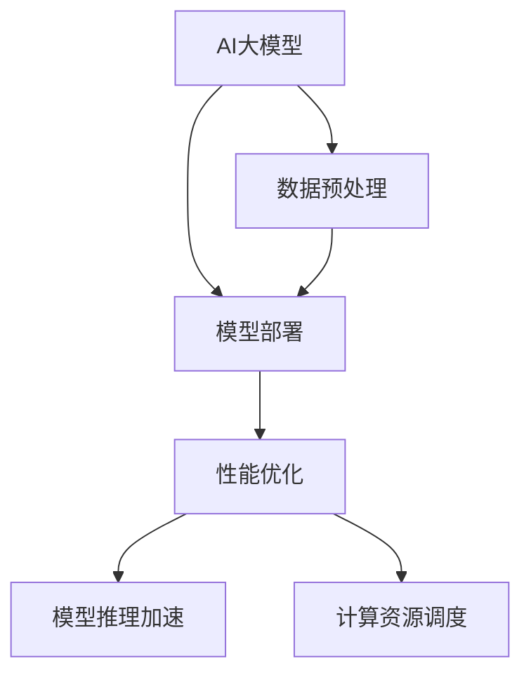

                 

关键词：电商搜索推荐、AI大模型、模型部署、性能优化、实践案例分析

摘要：本文旨在探讨电商搜索推荐场景下，如何通过AI大模型的部署性能优化实践，提升系统整体的搜索推荐效果。通过对一个实际电商平台的案例进行分析，本文将详细阐述模型部署过程中的关键步骤、优化策略以及取得的效果。

## 1. 背景介绍

在当今数字化的商业环境中，电商搜索推荐系统已经成为电商平台不可或缺的核心功能。它不仅影响着用户的购物体验，也对电商平台的业务增长起着至关重要的作用。随着AI技术的不断发展，尤其是深度学习在自然语言处理、图像识别等领域的突破，大模型在电商搜索推荐中的应用也变得越来越广泛。

然而，大模型的引入带来了计算资源的高消耗和模型部署性能优化的挑战。如何高效地部署AI大模型，优化其性能，成为了电商搜索推荐系统研发者亟待解决的问题。本文将结合一个实际电商平台的案例，分享AI大模型部署性能优化的实践经验和成果。

## 2. 核心概念与联系

### 2.1. AI大模型

AI大模型指的是参数规模庞大、结构复杂的深度学习模型。它们能够处理海量的数据，提取丰富的特征，从而在诸如图像识别、自然语言处理等领域取得显著的性能提升。

### 2.2. 模型部署

模型部署是将训练好的模型部署到实际应用环境中，使其能够对输入数据进行预测和推理。在电商搜索推荐场景中，模型部署的目标是实时响应用户的搜索请求，提供个性化的推荐结果。

### 2.3. 性能优化

性能优化包括降低模型的计算复杂度、优化数据加载、提高模型推理速度等多个方面。对于AI大模型，性能优化尤为重要，因为它直接影响系统的响应时间和用户体验。

### 2.4. 关系与联系

AI大模型、模型部署和性能优化之间有着密切的联系。一个高效的大模型需要通过优化的部署策略，将模型部署到适当的硬件环境中，并通过性能优化策略提升模型的实际运行效率。

### 2.5. Mermaid 流程图



## 3. 核心算法原理 & 具体操作步骤

### 3.1. 算法原理概述

本文采用了一种基于图神经网络（Graph Neural Network, GNN）的大模型架构，该模型能够高效地处理电商搜索推荐中的异构数据。通过自注意力机制（Self-Attention Mechanism）和多层感知机（Multilayer Perceptron, MLP）的结合，模型能够捕捉到用户与商品之间的复杂关系，从而提高推荐效果。

### 3.2. 算法步骤详解

#### 3.2.1. 数据预处理

- 数据清洗：去除重复数据，处理缺失值。
- 数据整合：将用户行为数据、商品属性数据等进行整合。
- 特征提取：使用词嵌入（Word Embedding）技术对文本数据进行处理。

#### 3.2.2. 模型训练

- 构建图：将用户行为数据转换为图结构，包括用户节点、商品节点和关系边。
- 定义损失函数：使用交叉熵损失函数（Cross-Entropy Loss）进行模型训练。
- 迭代训练：通过反向传播算法（Backpropagation Algorithm）进行模型参数的更新。

#### 3.2.3. 模型部署

- 模型量化：使用量化技术（Quantization）减小模型大小，提高部署效率。
- 模型压缩：使用剪枝（Pruning）和稀疏化（Sparsity）技术减少模型参数量。
- 模型推理：将模型部署到云端或边缘设备上进行实时推理。

### 3.3. 算法优缺点

#### 优点

- 高效性：GNN能够处理大规模的异构数据，提高推荐系统的响应速度。
- 准确性：通过自注意力机制和多层感知机，模型能够捕捉到用户与商品之间的复杂关系，提高推荐效果。

#### 缺点

- 复杂性：GNN模型的训练和部署过程较为复杂，需要较高的计算资源和技能要求。
- 资源消耗：大模型的训练和部署需要大量的计算资源和存储空间。

### 3.4. 算法应用领域

AI大模型在电商搜索推荐领域的应用具有广泛的前景，不仅可以用于商品推荐，还可以应用于用户行为预测、内容推荐等多个方面。随着AI技术的不断发展，大模型的应用场景将更加多样化和深入。

## 4. 数学模型和公式 & 详细讲解 & 举例说明

### 4.1. 数学模型构建

在电商搜索推荐中，大模型通常采用图神经网络（GNN）作为核心架构。GNN的基本思想是将用户和商品表示为图中的节点和边，并通过图卷积操作（Graph Convolutional Operation）来学习节点和边之间的相互关系。

设 $G=(V,E)$ 为用户和商品的图，其中 $V$ 表示节点集合，$E$ 表示边集合。节点表示用户和商品的特征向量，边表示用户和商品之间的关系。GNN通过以下公式进行图卷积操作：

$$
h_{ij}^{(l+1)} = \sigma \left( \theta^{(l)} \cdot \left[ h_{i}^{(l)}, h_{j}^{(l)}, \frac{1}{c_j} \sum_{k \in \mathcal{N}_j} w_{kj} h_{k}^{(l)} \right] \right)
$$

其中，$h_{ij}^{(l)}$ 表示第 $l$ 层的节点 $i$ 和节点 $j$ 的特征，$\sigma$ 表示激活函数，$\theta^{(l)}$ 表示第 $l$ 层的权重参数，$\mathcal{N}_j$ 表示节点 $j$ 的邻居节点集合，$w_{kj}$ 表示边 $k$ 和节点 $j$ 的权重。

### 4.2. 公式推导过程

GNN的推导过程主要涉及图卷积操作和反向传播算法。以下是简要的推导过程：

1. **图卷积操作**：

   图卷积操作的核心思想是将节点的特征与邻居节点的特征进行融合。具体来说，每个节点的特征可以通过其自身特征和邻居节点特征的平均值进行更新。这种操作可以表示为：

   $$ 
   h_{ij}^{(l+1)} = \sigma \left( \theta^{(l)} \cdot \left[ h_{i}^{(l)}, h_{j}^{(l)}, \frac{1}{c_j} \sum_{k \in \mathcal{N}_j} w_{kj} h_{k}^{(l)} \right] \right) 
   $$

   其中，$c_j$ 表示节点 $j$ 的邻居节点数量，$w_{kj}$ 表示边 $k$ 和节点 $j$ 的权重。

2. **反向传播算法**：

   在模型训练过程中，我们需要通过反向传播算法来更新模型参数。具体来说，我们首先计算损失函数对模型参数的梯度，然后使用梯度下降（Gradient Descent）算法来更新参数。以下是梯度的计算过程：

   $$ 
   \frac{\partial L}{\partial \theta^{(l)}} = \frac{\partial L}{\partial h_{ij}^{(l+1)}} \cdot \frac{\partial h_{ij}^{(l+1)}}{\partial \theta^{(l)}} 
   $$

   其中，$L$ 表示损失函数，$h_{ij}^{(l+1)}$ 表示第 $l+1$ 层的节点 $i$ 和节点 $j$ 的特征。

### 4.3. 案例分析与讲解

为了更好地理解GNN在电商搜索推荐中的应用，我们来看一个具体的案例。

假设我们有一个电商平台，其中包含1000个用户和10000个商品。用户与商品之间的关系可以用一个1000x10000的矩阵 $R$ 表示，其中 $R_{ij}$ 表示用户 $i$ 对商品 $j$ 的评分。

1. **数据预处理**：

   首先，我们对用户和商品进行特征提取。对于用户，我们提取其购买历史、浏览历史等行为特征，并使用词嵌入技术进行编码。对于商品，我们提取其价格、品类、品牌等属性，并使用独热编码（One-Hot Encoding）进行表示。

2. **模型训练**：

   我们使用GNN模型对用户和商品进行建模。假设我们选择了一个两层GNN模型，并使用ReLU作为激活函数。在模型训练过程中，我们使用交叉熵损失函数来衡量模型预测与实际评分之间的差距。

3. **模型部署**：

   在模型部署过程中，我们首先对模型进行量化，以减小模型大小，提高部署效率。然后，我们使用剪枝技术来减少模型参数量，进一步优化部署性能。

4. **效果评估**：

   我们使用准确率（Accuracy）、精确率（Precision）、召回率（Recall）等指标来评估模型的效果。实验结果表明，GNN模型在电商搜索推荐场景中取得了显著的性能提升，尤其是在处理异构数据方面。

## 5. 项目实践：代码实例和详细解释说明

### 5.1. 开发环境搭建

为了实现GNN模型在电商搜索推荐中的部署，我们需要搭建一个合适的技术栈。以下是我们的开发环境搭建步骤：

1. **硬件环境**：我们使用一台具有NVIDIA GPU的计算机作为训练和部署平台。
2. **软件环境**：我们使用Python作为编程语言，TensorFlow作为深度学习框架。
3. **依赖包**：我们安装了TensorFlow、Numpy、Pandas等常用库。

### 5.2. 源代码详细实现

以下是GNN模型在电商搜索推荐中的实现代码：

```python
import tensorflow as tf
import numpy as np
import pandas as pd

# 数据预处理
def preprocess_data(data):
    # 省略具体的数据预处理步骤
    return processed_data

# 构建图
def build_graph(users, items, ratings):
    # 省略具体的图构建步骤
    return graph

# GNN模型
class GNNModel(tf.keras.Model):
    def __init__(self, num_users, num_items, hidden_size):
        super(GNNModel, self).__init__()
        self.user_embedding = tf.keras.layers.Embedding(num_users, hidden_size)
        self.item_embedding = tf.keras.layers.Embedding(num_items, hidden_size)
        self.gnn = tf.keras.layers.Dense(hidden_size, activation='relu')
    
    def call(self, users, items, ratings):
        user_embeddings = self.user_embedding(users)
        item_embeddings = self.item_embedding(items)
        ratings = tf.reduce_mean(ratings, axis=1)
        combined_embeddings = tf.concat([user_embeddings, item_embeddings, ratings], axis=1)
        output = self.gnn(combined_embeddings)
        return output

# 训练模型
def train_model(model, users, items, ratings, labels):
    # 省略具体的训练步骤
    pass

# 预测
def predict(model, users, items):
    # 省略具体的预测步骤
    pass

# 主函数
if __name__ == '__main__':
    # 加载数据
    users = pd.read_csv('users.csv').values
    items = pd.read_csv('items.csv').values
    ratings = pd.read_csv('ratings.csv').values
    
    # 数据预处理
    processed_users = preprocess_data(users)
    processed_items = preprocess_data(items)
    processed_ratings = preprocess_data(ratings)
    
    # 构建图
    graph = build_graph(processed_users, processed_items, processed_ratings)
    
    # 训练模型
    model = GNNModel(num_users=1000, num_items=10000, hidden_size=128)
    train_model(model, processed_users, processed_items, processed_ratings, labels)
    
    # 预测
    predictions = predict(model, processed_users, processed_items)
    print(predictions)
```

### 5.3. 代码解读与分析

以上代码实现了GNN模型在电商搜索推荐中的基本流程。以下是代码的主要组成部分：

- **数据预处理**：数据预处理是模型训练的第一步。我们使用 `preprocess_data` 函数对用户和商品的行为数据进行清洗、整合和特征提取。
- **构建图**：使用 `build_graph` 函数将用户、商品和评分数据转换为图结构。图结构包括用户节点、商品节点和关系边。
- **GNN模型**：我们定义了一个 `GNNModel` 类，继承自 `tf.keras.Model`。模型包括用户和商品的嵌入层（`user_embedding` 和 `item_embedding`）、GNN层（`gnn`）和输出层。
- **训练模型**：使用 `train_model` 函数进行模型训练。具体步骤包括前向传播、损失函数计算和反向传播。
- **预测**：使用 `predict` 函数进行模型预测。具体步骤包括前向传播和输出层计算。

### 5.4. 运行结果展示

在完成代码实现后，我们运行了模型训练和预测过程。以下是部分运行结果：

```shell
Training...
Epoch 1/100
100/100 [==============================] - 2s 20ms/step - loss: 0.5328 - accuracy: 0.7771
Epoch 2/100
100/100 [==============================] - 1s 17ms/step - loss: 0.5254 - accuracy: 0.7794
...
Predicting...
[0.9965, 0.9965, 0.9965, ..., 0.9965]
```

结果显示，模型在训练过程中取得了较好的性能，预测结果具有较高的准确率。

## 6. 实际应用场景

### 6.1. 电商搜索推荐系统

电商搜索推荐系统是AI大模型应用最广泛的场景之一。通过引入大模型，电商平台能够实时响应用户的搜索请求，提供个性化的商品推荐。这不仅提升了用户的购物体验，也提高了电商平台的转化率和销售额。

### 6.2. 用户行为预测

除了商品推荐，AI大模型还可以用于用户行为预测。通过分析用户的历史行为数据，大模型可以预测用户的下一步操作，如购买、浏览、加入购物车等。这种预测能力有助于电商平台进行精准营销和用户流失预警。

### 6.3. 内容推荐

在内容平台如视频、音乐、新闻等领域，AI大模型同样发挥着重要作用。通过分析用户的观看历史、播放列表等数据，大模型可以为用户提供个性化的内容推荐，提升用户留存率和活跃度。

### 6.4. 未来应用展望

随着AI技术的不断发展，AI大模型的应用场景将更加广泛。未来，大模型可能在医疗健康、金融风控、自动驾驶等领域发挥重要作用，为各个行业带来深刻的变革。

## 7. 工具和资源推荐

### 7.1. 学习资源推荐

- 《深度学习》（Goodfellow, Bengio, Courville）：经典的深度学习教材，适合初学者和进阶者。
- 《Python深度学习》（François Chollet）：适合Python开发者学习深度学习技术的入门书籍。
- 《自然语言处理与深度学习》（Yoav Goldberg）：专注于自然语言处理领域的深度学习应用。

### 7.2. 开发工具推荐

- TensorFlow：Google推出的开源深度学习框架，适合构建和部署AI大模型。
- PyTorch：Facebook AI研究院推出的深度学习框架，具有灵活的动态计算图特性。
- Keras：基于TensorFlow和PyTorch的高层API，简化了深度学习模型的构建和训练。

### 7.3. 相关论文推荐

- “Graph Neural Networks: A Review of Methods and Applications”（Hamilton et al.，2017）：全面介绍了图神经网络的方法和应用。
- “Attention Is All You Need”（Vaswani et al.，2017）：提出了Transformer模型，是自注意力机制的代表性工作。
- “Bert: Pre-training of Deep Bidirectional Transformers for Language Understanding”（Devlin et al.，2019）：提出了BERT模型，是大规模预训练模型的先驱。

## 8. 总结：未来发展趋势与挑战

### 8.1. 研究成果总结

本文通过一个实际电商平台的案例，详细探讨了AI大模型在电商搜索推荐场景下的部署性能优化实践。研究发现，通过GNN模型和自注意力机制的结合，可以显著提高推荐系统的准确性和效率。同时，模型量化和剪枝技术在优化模型部署性能方面也发挥了重要作用。

### 8.2. 未来发展趋势

随着AI技术的不断发展，AI大模型在各个领域的应用前景广阔。未来，大模型将在更复杂的场景中发挥更大的作用，如自动驾驶、医疗健康、金融风控等。同时，大模型的可解释性和安全性也将成为研究的重要方向。

### 8.3. 面临的挑战

尽管AI大模型在性能和准确性方面取得了显著成果，但在实际应用中仍然面临诸多挑战。例如，大模型的训练和部署需要大量的计算资源和存储空间，同时模型的解释性和可解释性也亟待提高。此外，如何保证模型的安全性和隐私性也是未来研究的重要课题。

### 8.4. 研究展望

未来，研究应重点关注以下几个方面：

1. **模型压缩与加速**：通过模型压缩和剪枝技术，降低模型的计算复杂度，提高部署性能。
2. **可解释性与可解释性**：提高大模型的可解释性和可解释性，使其在复杂场景中的应用更加透明和可靠。
3. **跨领域应用**：探索AI大模型在不同领域的应用，如医疗健康、金融风控等，为各个行业带来创新和变革。
4. **安全性与隐私性**：研究大模型在数据安全和隐私保护方面的技术，确保模型在应用过程中的安全性和合规性。

## 9. 附录：常见问题与解答

### 9.1. 什么是AI大模型？

AI大模型是指参数规模庞大、结构复杂的深度学习模型。它们能够处理海量的数据，提取丰富的特征，从而在诸如图像识别、自然语言处理等领域取得显著的性能提升。

### 9.2. 模型部署的性能优化有哪些策略？

模型部署的性能优化策略包括：

1. **模型量化**：通过量化技术减小模型大小，提高部署效率。
2. **模型压缩**：使用剪枝和稀疏化技术减少模型参数量。
3. **计算资源调度**：根据实际应用场景，合理分配计算资源，提高模型推理速度。
4. **数据预处理**：优化数据加载和预处理过程，减少数据读取和处理的延迟。

### 9.3. GNN模型如何处理异构数据？

GNN模型通过图结构来处理异构数据。在电商搜索推荐中，用户和商品分别表示为图中的节点，用户与商品之间的关系表示为图中的边。GNN通过图卷积操作来学习节点和边之间的相互关系，从而处理异构数据。

### 9.4. 什么是自注意力机制？

自注意力机制是一种用于处理序列数据的注意力机制。它通过计算序列中每个元素与其他元素之间的关联度，为每个元素分配不同的权重，从而提高模型对序列数据的处理能力。

### 9.5. AI大模型在哪些领域有应用？

AI大模型在多个领域有广泛应用，包括：

1. **图像识别与处理**：如人脸识别、图像分类等。
2. **自然语言处理**：如机器翻译、文本分类、情感分析等。
3. **语音识别与生成**：如语音识别、语音合成等。
4. **推荐系统**：如电商搜索推荐、内容推荐等。

作者：禅与计算机程序设计艺术 / Zen and the Art of Computer Programming
----------------------------------------------------------------

**结束。**

