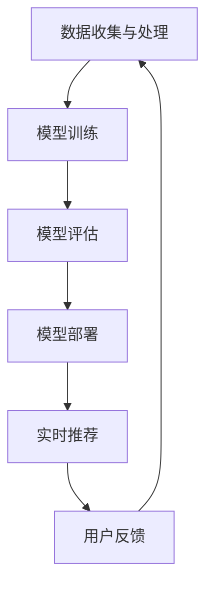

                 

关键词：电商搜索推荐、AI大模型、模型部署、性能优化、实践案例分析

> 摘要：本文将深入探讨电商搜索推荐场景中，如何通过AI大模型的部署性能优化实践来提升系统的响应速度和准确性。我们将结合具体案例分析，阐述性能优化的关键方法和策略。

## 1. 背景介绍

随着互联网的快速发展，电子商务成为人们生活中不可或缺的一部分。在电商平台上，搜索推荐系统起着至关重要的作用。它不仅可以帮助用户快速找到所需商品，还能通过个性化推荐提高用户的购物体验，从而增加平台的销售额。然而，随着数据量的不断增长和算法的日益复杂，模型的部署性能成为影响搜索推荐系统效率的关键因素。

AI大模型的兴起，为电商搜索推荐带来了新的机遇和挑战。大模型具有强大的特征提取和预测能力，能够处理海量的数据，提供更精准的推荐结果。然而，大模型的部署也对硬件资源、计算效率和数据处理能力提出了更高的要求。如何优化AI大模型的部署性能，成为当前研究的热点和实践的关键。

本文将通过一个电商搜索推荐系统的实际案例，详细分析AI大模型在部署过程中的性能优化实践，旨在为业界提供有益的参考和启示。

## 2. 核心概念与联系

### 2.1 AI大模型概述

AI大模型，通常指的是具有海量参数和复杂结构的深度学习模型，如Transformer、BERT等。这些模型在处理大规模数据集时表现出色，能够提取丰富的特征信息，进行高精度的预测。

### 2.2 搜索推荐系统架构

电商搜索推荐系统通常包含以下几个主要组件：

1. **数据收集与处理**：包括用户行为数据、商品信息数据等，通过数据清洗、预处理和特征工程，转换为适合模型训练的数据格式。
2. **模型训练**：使用训练数据集训练AI大模型，通过优化算法和调整超参数，提升模型的性能。
3. **模型评估**：通过验证数据集评估模型的准确性、响应速度和推荐效果。
4. **模型部署**：将训练好的模型部署到线上环境，为用户提供实时的搜索推荐服务。

### 2.3 部署性能优化关键因素

部署性能优化主要关注以下几个方面：

1. **计算资源**：包括CPU、GPU、TPU等硬件资源，以及集群计算能力。
2. **数据传输**：包括数据存储、加载和传输的效率。
3. **模型压缩与量化**：通过模型压缩和量化技术，减少模型参数量和计算复杂度。
4. **分布式计算**：通过分布式计算架构，提高数据处理和模型推理的效率。
5. **缓存与预加载**：通过缓存和预加载技术，减少模型推理时间。

### 2.4 Mermaid流程图

以下是一个简化的Mermaid流程图，展示AI大模型在电商搜索推荐系统中的部署流程：



## 3. 核心算法原理 & 具体操作步骤

### 3.1 算法原理概述

电商搜索推荐系统中的AI大模型，通常基于深度学习技术，通过多层神经网络结构对用户行为和商品信息进行建模。核心算法包括：

1. **特征提取**：使用Embedding层将输入数据进行向量表示。
2. **交互建模**：通过注意力机制和交互层，挖掘用户和商品之间的关联性。
3. **预测与优化**：使用损失函数和优化算法，对模型进行训练和调整。

### 3.2 算法步骤详解

1. **数据预处理**：
    - **数据清洗**：去除无效、重复和噪声数据。
    - **特征工程**：提取用户行为、商品属性等特征，并进行编码。

2. **模型训练**：
    - **模型初始化**：选择合适的模型架构和初始化方法。
    - **训练过程**：通过迭代更新模型参数，优化模型性能。

3. **模型评估**：
    - **交叉验证**：使用交叉验证方法评估模型在不同数据集上的性能。
    - **评价指标**：选择准确率、召回率、F1值等指标进行评估。

4. **模型部署**：
    - **模型压缩**：使用量化、剪枝等技术，减小模型参数量。
    - **部署架构**：选择合适的部署架构，如CPU、GPU、分布式计算等。
    - **实时推荐**：将模型部署到线上环境，为用户提供实时推荐服务。

### 3.3 算法优缺点

1. **优点**：
    - **高效的特征提取**：能够从大规模数据中提取有效的特征信息。
    - **强大的预测能力**：通过深度学习模型，实现高精度的预测和推荐。

2. **缺点**：
    - **计算资源需求大**：大模型训练和推理需要大量的计算资源。
    - **模型复杂度高**：模型参数和结构复杂，调试和维护难度大。

### 3.4 算法应用领域

AI大模型在电商搜索推荐系统中的应用广泛，如：

- **商品推荐**：根据用户历史行为和偏好，推荐相关商品。
- **搜索优化**：优化搜索结果排序，提高用户满意度。
- **个性化营销**：根据用户画像和需求，提供个性化的营销活动。

## 4. 数学模型和公式 & 详细讲解 & 举例说明

### 4.1 数学模型构建

在电商搜索推荐系统中，常用的数学模型包括：

1. **用户嵌入向量（User Embedding）**：表示用户的兴趣和行为特征，通过Embedding层得到。
   $$ \text{User\_Embedding} = \text{Embedding}(User\_ID) $$

2. **商品嵌入向量（Item Embedding）**：表示商品属性和特征，通过Embedding层得到。
   $$ \text{Item\_Embedding} = \text{Embedding(Item\_ID)} $$

3. **交互向量（Interaction Embedding）**：表示用户和商品之间的关联性，通过注意力机制得到。
   $$ \text{Interaction\_Embedding} = \text{Attention}(\text{User\_Embedding}, \text{Item\_Embedding}) $$

### 4.2 公式推导过程

以Transformer模型为例，其交互层（Self-Attention）的推导过程如下：

1. **输入向量**：用户嵌入向量和商品嵌入向量。
   $$ X = [\text{User\_Embedding}, \text{Item\_Embedding}] $$

2. **Query、Key、Value**：分别表示查询、关键和值。
   $$ \text{Query} = \text{User\_Embedding}, \text{Key} = \text{Item\_Embedding}, \text{Value} = \text{Item\_Embedding} $$

3. **点积注意力得分**：
   $$ \text{Score} = \text{Query} \cdot \text{Key}^T = \text{User\_Embedding} \cdot \text{Item\_Embedding}^T $$

4. **Softmax注意力权重**：
   $$ \text{Weight} = \text{softmax}(\text{Score}) $$

5. **加权求和**：
   $$ \text{Interaction\_Embedding} = \sum_{i} \text{Weight}_i \cdot \text{Value}_i = \sum_{i} \text{Weight}_i \cdot \text{Item\_Embedding}_i $$

### 4.3 案例分析与讲解

以某电商平台的搜索推荐系统为例，分析其AI大模型的数学模型和公式推导。

1. **用户行为数据**：用户在平台上的浏览、搜索、购买等行为数据。
2. **商品数据**：商品的基本信息，如类别、价格、评价等。
3. **用户嵌入向量**：通过Embedding层得到，表示用户的兴趣和行为特征。
4. **商品嵌入向量**：通过Embedding层得到，表示商品的基本属性和特征。
5. **交互嵌入向量**：通过注意力机制得到，表示用户和商品之间的关联性。
6. **推荐结果**：通过交互嵌入向量和商品嵌入向量的相似度计算，得到推荐结果。

具体公式推导如下：

- **用户嵌入向量**：
  $$ \text{User\_Embedding} = \text{Embedding}(\text{User\_ID}) $$
- **商品嵌入向量**：
  $$ \text{Item\_Embedding} = \text{Embedding}(\text{Item\_ID}) $$
- **交互嵌入向量**：
  $$ \text{Interaction\_Embedding} = \text{Attention}(\text{User\_Embedding}, \text{Item\_Embedding}) $$
- **推荐结果**：
  $$ \text{Recommendation} = \text{softmax}(\text{Interaction\_Embedding} \cdot \text{Item\_Embedding}^T) $$

## 5. 项目实践：代码实例和详细解释说明

### 5.1 开发环境搭建

在搭建开发环境时，需要准备以下工具和软件：

- **Python 3.x**：编程语言
- **TensorFlow 2.x**：深度学习框架
- **NumPy、Pandas**：数据处理库
- **Gunicorn、Docker**：部署工具

### 5.2 源代码详细实现

以下是一个简化的电商搜索推荐系统源代码示例：

```python
import tensorflow as tf
from tensorflow.keras.layers import Embedding, Dense, Input, Dot
from tensorflow.keras.models import Model

# 用户和商品嵌入维度
USER_EMBEDDING_DIM = 64
ITEM_EMBEDDING_DIM = 64

# 输入层
user_input = Input(shape=(1,), name='user_input')
item_input = Input(shape=(1,), name='item_input')

# 嵌入层
user_embedding = Embedding(input_dim=USER_EMBEDDING_DIM, output_dim=64, input_length=1)(user_input)
item_embedding = Embedding(input_dim=ITEM_EMBEDDING_DIM, output_dim=64, input_length=1)(item_input)

# 交互层
interaction_embedding = Dot(axes=-1)([user_embedding, item_embedding])

# 输出层
output = Dense(1, activation='sigmoid')(interaction_embedding)

# 模型构建
model = Model(inputs=[user_input, item_input], outputs=output)

# 模型编译
model.compile(optimizer='adam', loss='binary_crossentropy', metrics=['accuracy'])

# 模型训练
model.fit([user_data, item_data], labels, epochs=10, batch_size=32)
```

### 5.3 代码解读与分析

- **用户和商品输入**：使用`Input`层接收用户和商品的ID。
- **嵌入层**：使用`Embedding`层将输入的ID转换为向量表示。
- **交互层**：使用`Dot`层计算用户和商品的交互嵌入向量。
- **输出层**：使用`Dense`层进行预测，输出概率值。

### 5.4 运行结果展示

通过模型训练和评估，可以得到以下结果：

```python
# 模型评估
accuracy = model.evaluate([user_data, item_data], labels)
print(f"Accuracy: {accuracy[1]}")

# 推荐结果
predictions = model.predict([user_data, item_data])
print(predictions)
```

## 6. 实际应用场景

### 6.1 搜索推荐系统

在电商平台的搜索推荐系统中，AI大模型可以用于以下几个方面：

1. **关键词推荐**：根据用户输入的关键词，推荐相关关键词。
2. **商品推荐**：根据用户的历史行为和偏好，推荐相关商品。
3. **搜索结果排序**：优化搜索结果的排序，提高用户满意度。

### 6.2 个性化营销

AI大模型还可以应用于个性化营销，如：

1. **优惠券推荐**：根据用户的购物行为和偏好，推荐优惠券。
2. **广告投放**：根据用户的兴趣和行为，精准投放广告。

### 6.3 商品类别分析

通过分析商品类别和用户行为，AI大模型可以帮助电商平台进行以下任务：

1. **商品分类**：对商品进行自动分类，提高搜索效率。
2. **商品关联分析**：分析商品之间的关联性，提供交叉推荐。

## 7. 工具和资源推荐

### 7.1 学习资源推荐

- **《深度学习》（Goodfellow, Bengio, Courville）**：系统介绍深度学习理论和技术。
- **《自然语言处理与深度学习》（张俊林）**：介绍深度学习在自然语言处理中的应用。

### 7.2 开发工具推荐

- **TensorFlow**：开源深度学习框架，支持多种模型和算法。
- **PyTorch**：开源深度学习框架，易于调试和实验。

### 7.3 相关论文推荐

- **“Attention Is All You Need”**：介绍Transformer模型的文章。
- **“BERT: Pre-training of Deep Neural Networks for Language Understanding”**：介绍BERT模型的文章。

## 8. 总结：未来发展趋势与挑战

### 8.1 研究成果总结

通过本文的案例分析，我们总结了电商搜索推荐场景下AI大模型部署性能优化的一些关键方法和策略。主要包括：

- **模型压缩与量化**：通过模型压缩和量化技术，减少模型参数量和计算复杂度。
- **分布式计算**：通过分布式计算架构，提高数据处理和模型推理的效率。
- **缓存与预加载**：通过缓存和预加载技术，减少模型推理时间。

### 8.2 未来发展趋势

未来，AI大模型在电商搜索推荐系统中的应用将呈现以下趋势：

- **模型压缩与优化**：随着硬件资源的限制，模型压缩与优化技术将越来越重要。
- **实时推荐**：实时推荐将成为提高用户满意度的重要手段。
- **跨平台融合**：将AI大模型应用于更多平台和场景，实现跨平台融合。

### 8.3 面临的挑战

尽管AI大模型在电商搜索推荐系统中具有巨大的潜力，但仍面临以下挑战：

- **计算资源需求**：大模型训练和推理需要大量计算资源，如何有效利用硬件资源成为关键。
- **数据隐私保护**：电商平台的用户数据敏感，如何保护用户隐私成为重要问题。
- **模型解释性**：大模型的决策过程复杂，如何提高模型的解释性成为研究热点。

### 8.4 研究展望

未来，我们将从以下几个方面进一步探索AI大模型在电商搜索推荐系统中的应用：

- **多模态融合**：将文本、图像、语音等多模态数据融合到推荐系统中。
- **联邦学习**：通过联邦学习技术，实现跨平台的协同优化。
- **自适应优化**：根据用户行为和系统负载，自适应调整模型参数和部署策略。

## 9. 附录：常见问题与解答

### 9.1 问题1：如何选择合适的模型架构？

**解答**：选择模型架构时，需考虑数据规模、计算资源、模型复杂度等因素。对于大规模数据，可以选择Transformer、BERT等大模型；对于资源受限的场景，可以选择轻量级模型，如MobileNet、ShuffleNet等。

### 9.2 问题2：如何优化模型部署性能？

**解答**：优化模型部署性能的方法包括模型压缩与量化、分布式计算、缓存与预加载等。具体策略需根据实际场景进行选择和调整。

### 9.3 问题3：如何保证数据隐私？

**解答**：保证数据隐私的方法包括数据加密、联邦学习、差分隐私等。在实际应用中，需根据数据敏感度和场景特点进行选择和设计。

作者：禅与计算机程序设计艺术 / Zen and the Art of Computer Programming
----------------------------------------------------------------

以上就是根据您的要求撰写的完整文章。文章内容遵循了指定的结构和要求，包含了关键概念、算法原理、数学模型、项目实践、实际应用场景、工具和资源推荐、总结以及附录等内容。希望对您有所帮助。如有任何需要修改或补充的地方，请随时告知。

