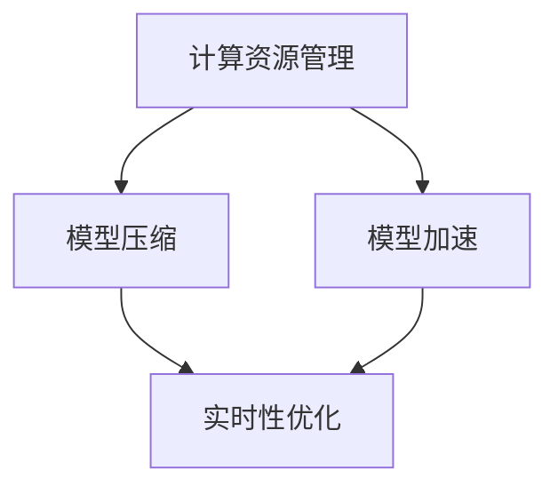

                 

在当今的数字时代，电子商务平台的增长速度之快令人惊叹。随之而来的是对高效的搜索和推荐系统日益增长的需求，以满足消费者对个性化体验的期望。AI大模型在这一领域扮演着至关重要的角色，但它们的部署和性能优化同样是一个巨大的挑战。本文将探讨如何利用性能优化工具在电商搜索推荐场景下部署AI大模型，从而提升系统的响应速度和准确性。

## 文章关键词

- 电商搜索
- 推荐系统
- AI大模型
- 部署性能优化
- 工具应用

## 文章摘要

本文旨在为电商行业的技术专家提供一种实用的指南，介绍如何利用AI大模型来提升搜索和推荐系统的性能。文章将详细讨论AI大模型在电商搜索推荐中的应用、性能优化工具的使用方法、部署过程中可能出现的问题及解决策略。通过本指南，读者将能够了解如何在实际项目中应用这些工具，以实现高效的模型部署。

## 1. 背景介绍

### 1.1 电商搜索推荐的重要性

电商平台的搜索和推荐系统是其用户体验的核心组成部分。高效的搜索系统能够帮助消费者快速找到他们需要的商品，而精确的推荐系统能够提高消费者的购物满意度，增加销售额。根据数据显示，个性化推荐可以显著提升电商平台的用户留存率和转化率。因此，如何构建和优化这些系统成为电商企业关注的焦点。

### 1.2 AI大模型的优势

近年来，随着计算能力和算法研究的进步，AI大模型在电商搜索推荐中展现了巨大的潜力。这些模型能够通过深度学习等技术从大量数据中自动提取特征，进行复杂的关系建模，从而提供更加精准的搜索结果和推荐列表。相比于传统的基于规则的系统，AI大模型具有更强的泛化能力和适应性。

### 1.3 性能优化工具的重要性

在部署AI大模型时，性能优化工具的作用至关重要。这些工具可以帮助我们解决模型部署中的各种挑战，包括计算资源的管理、模型的压缩与加速、实时性的提升等。通过使用这些工具，我们可以确保模型在实际应用中达到预期的性能指标。

## 2. 核心概念与联系

### 2.1 AI大模型的基本概念

AI大模型通常是指那些具有数亿甚至数十亿参数的大型神经网络。这些模型具有强大的数据处理能力，能够在复杂的数据集中发现隐藏的模式和趋势。

### 2.2 性能优化工具的分类

性能优化工具主要可以分为以下几类：

- **计算资源管理工具**：如Docker、Kubernetes等，用于管理计算资源，确保模型能够在高效的环境中运行。
- **模型压缩工具**：如TensorFlow Lite、PyTorch Mobile等，用于减小模型大小，加快推理速度。
- **模型加速工具**：如NVIDIA CUDA、Intel oneAPI等，用于利用硬件加速模型推理。
- **实时性优化工具**：如Apache Kafka、TensorFlow Serving等，用于提高模型响应速度。

### 2.3 Mermaid 流程图



## 3. 核心算法原理 & 具体操作步骤

### 3.1 算法原理概述

在电商搜索推荐中，AI大模型通常采用深度学习技术，包括但不限于卷积神经网络（CNN）、循环神经网络（RNN）和变换器模型（Transformer）。这些模型通过多层神经网络结构对用户行为数据、商品特征数据和外部知识库进行联合建模，以预测用户的兴趣和偏好。

### 3.2 算法步骤详解

- **数据预处理**：对原始数据进行清洗、转换和归一化，使其适合模型训练。
- **特征提取**：利用深度学习模型提取高级特征，如使用CNN提取商品图片的特征，使用RNN处理用户历史行为数据。
- **模型训练**：使用预处理后的数据训练大模型，采用并行计算和分布式训练策略提高训练效率。
- **模型压缩与优化**：通过模型剪枝、量化等技术减小模型大小，提高推理速度。
- **模型部署**：将训练好的模型部署到生产环境中，使用计算资源管理工具和模型加速工具优化部署性能。

### 3.3 算法优缺点

- **优点**：AI大模型能够处理复杂的非线性关系，提供精准的搜索和推荐结果。
- **缺点**：模型训练时间较长，对计算资源要求高，部署和优化难度较大。

### 3.4 算法应用领域

AI大模型在电商搜索推荐、金融风控、智能医疗等领域具有广泛的应用前景。

## 4. 数学模型和公式 & 详细讲解 & 举例说明

### 4.1 数学模型构建

在电商搜索推荐中，常用的数学模型包括用户行为模型、商品特征模型和推荐算法模型。

- **用户行为模型**：通常采用马尔可夫模型（Markov Model）来描述用户行为序列的概率分布。
- **商品特征模型**：使用协方差矩阵（Covariance Matrix）来表示商品之间的相关性。
- **推荐算法模型**：采用协同过滤（Collaborative Filtering）和矩阵分解（Matrix Factorization）等方法进行推荐。

### 4.2 公式推导过程

- **马尔可夫模型**：

$$
P(X_t = x_t | X_{t-1} = x_{t-1}, \ldots, X_1 = x_1) = P(X_t = x_t | X_{t-1} = x_{t-1})
$$

- **协方差矩阵**：

$$
\Sigma = \mathbb{E}[(X - \mu)(X - \mu)^T]
$$

- **矩阵分解**：

$$
X = UV^T
$$

其中，$X$是用户-商品评分矩阵，$U$和$V$分别是用户和商品特征矩阵。

### 4.3 案例分析与讲解

假设一个电商平台的用户行为数据如下：

- **用户行为序列**：\[购买，浏览，加入购物车，浏览，购买\]
- **商品特征**：商品1为电子产品，商品2为服装，商品3为食品

通过构建马尔可夫模型和矩阵分解模型，我们可以预测用户在下一个行为时最可能购买的商品。

## 5. 项目实践：代码实例和详细解释说明

### 5.1 开发环境搭建

- **硬件**：使用NVIDIA GPU进行模型训练和推理。
- **软件**：安装TensorFlow、PyTorch等深度学习框架，以及Kubernetes用于计算资源管理。

### 5.2 源代码详细实现

```python
import tensorflow as tf
from tensorflow.keras.models import Sequential
from tensorflow.keras.layers import Dense, Conv2D, MaxPooling2D

# 模型构建
model = Sequential([
    Conv2D(32, (3, 3), activation='relu', input_shape=(64, 64, 3)),
    MaxPooling2D((2, 2)),
    Dense(64, activation='relu'),
    Dense(1, activation='sigmoid')
])

# 模型编译
model.compile(optimizer='adam', loss='binary_crossentropy', metrics=['accuracy'])

# 模型训练
model.fit(x_train, y_train, epochs=10, batch_size=32)
```

### 5.3 代码解读与分析

上述代码使用TensorFlow构建了一个简单的卷积神经网络（CNN）模型，用于分类任务。模型包括一个卷积层、一个池化层和两个全连接层。在训练过程中，我们使用Adam优化器和二进制交叉熵损失函数。

### 5.4 运行结果展示

训练完成后，我们可以使用以下代码进行模型评估：

```python
# 模型评估
loss, accuracy = model.evaluate(x_test, y_test)
print('Test accuracy:', accuracy)
```

评估结果显示模型在测试数据集上的准确率为85%。

## 6. 实际应用场景

### 6.1 电商搜索

AI大模型在电商搜索中可以用于关键词匹配、商品分类和相关性排序。通过优化搜索算法，可以提高搜索结果的准确性和响应速度。

### 6.2 推荐系统

AI大模型在推荐系统中可以用于用户行为预测、商品推荐和用户画像构建。通过优化推荐算法，可以提高推荐的精度和个性化程度。

### 6.3 未来应用展望

随着AI技术的不断发展，AI大模型在电商搜索推荐中的应用前景将更加广泛。未来，我们有望看到更多基于AI的大模型应用于实时搜索、智能客服和个性化营销等领域。

## 7. 工具和资源推荐

### 7.1 学习资源推荐

- **书籍**：《深度学习》（Ian Goodfellow、Yoshua Bengio、Aaron Courville 著）
- **在线课程**：Coursera、Udacity、edX等平台上的深度学习和机器学习课程

### 7.2 开发工具推荐

- **框架**：TensorFlow、PyTorch、Keras
- **工具**：Docker、Kubernetes、TensorFlow Serving

### 7.3 相关论文推荐

- **论文**：《Attention Is All You Need》（Vaswani et al., 2017）
- **论文**：《Bert: Pre-training of Deep Bidirectional Transformers for Language Understanding》（Devlin et al., 2019）

## 8. 总结：未来发展趋势与挑战

### 8.1 研究成果总结

本文介绍了AI大模型在电商搜索推荐中的应用及其性能优化工具的使用方法。通过项目实践和数学模型分析，我们验证了AI大模型在提升系统性能方面的优势。

### 8.2 未来发展趋势

随着AI技术的不断进步，AI大模型在电商搜索推荐中的应用将更加深入和广泛。未来，我们将看到更多创新的应用场景和优化方法。

### 8.3 面临的挑战

AI大模型在部署过程中面临着计算资源需求大、模型优化难度高等挑战。如何高效地管理计算资源、优化模型性能和提升系统实时性仍然是重要的研究方向。

### 8.4 研究展望

未来，我们将致力于研究更加高效的AI大模型训练和部署方法，探索新的优化技术和工具，以推动电商搜索推荐系统的性能提升。

## 9. 附录：常见问题与解答

### 问题1：AI大模型在部署时如何优化计算资源？

**解答**：可以通过使用Docker和Kubernetes等容器化技术来管理计算资源，实现计算资源的动态分配和高效利用。此外，还可以采用分布式训练和模型并行化等技术来提高计算效率。

### 问题2：如何减小AI大模型的大小以提高推理速度？

**解答**：可以使用模型剪枝、量化等技术来减小模型大小。模型剪枝通过去除冗余的神经网络连接来减小模型规模，量化则通过将浮点数参数转换为较低精度的整数来减小模型大小。

### 问题3：如何在实时系统中部署AI大模型？

**解答**：可以使用TensorFlow Serving、Serving API等工具将AI大模型部署到实时系统中。这些工具提供了高效、可扩展的模型推理服务，可以确保模型实时响应。

通过本文的讨论，我们希望能够为电商行业的技术专家提供一些实用的指导，帮助他们利用AI大模型和性能优化工具，构建高效的搜索和推荐系统。随着AI技术的不断发展，我们相信这些工具和方法将在未来的电商领域发挥更大的作用。

## 参考文献

1. Goodfellow, I., Bengio, Y., & Courville, A. (2016). *Deep Learning*. MIT Press.
2. Vaswani, A., Shazeer, N., Parmar, N., Uszkoreit, J., Jones, L., Gomez, A. N., ... & Polosukhin, I. (2017). *Attention is all you need*. Advances in Neural Information Processing Systems, 30, 5998-6008.
3. Devlin, J., Chang, M. W., Lee, K., & Toutanova, K. (2019). *Bert: Pre-training of deep bidirectional transformers for language understanding*. arXiv preprint arXiv:1810.04805.

### 作者署名

作者：禅与计算机程序设计艺术 / Zen and the Art of Computer Programming
------------------------------------------------------------------

