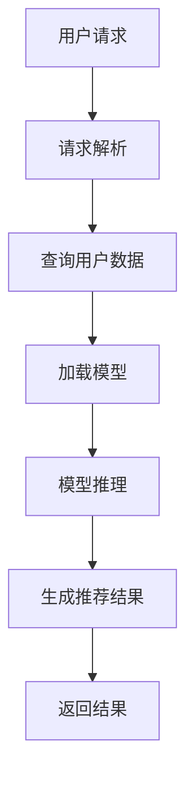

                 

关键词：电商搜索推荐、AI大模型、模型部署、混合云、方案设计、技术实现、架构

摘要：随着电商行业的快速发展，用户对个性化搜索推荐的需求日益增长。本文将深入探讨在电商搜索推荐场景下，如何利用AI大模型实现模型部署的混合云方案。通过分析AI大模型的特点和需求，以及混合云技术的优势和应用，我们将详细阐述方案的设计与实现过程，为电商企业提供一种高效、可靠的搜索推荐解决方案。

## 1. 背景介绍

### 1.1 电商搜索推荐的重要性

电商搜索推荐作为电商网站的核心功能之一，直接影响用户的购物体验和满意度。有效的搜索推荐系统能够提高用户的转化率和留存率，从而提升电商平台的销售额。随着用户数据的不断积累和用户行为的多样化，传统的搜索推荐算法已经难以满足用户的需求。因此，引入AI大模型进行个性化搜索推荐成为当前的研究热点。

### 1.2 AI大模型的发展

AI大模型是指通过深度学习技术训练得到的规模庞大的神经网络模型，具有强大的建模能力和泛化能力。近年来，随着计算能力的提升和数据量的增加，AI大模型在各个领域取得了显著的成果。在电商搜索推荐场景下，AI大模型能够更好地理解用户的兴趣和需求，提供更精准的推荐结果。

### 1.3 混合云技术的优势

混合云是指将公有云和私有云相结合，充分利用两者的优势，为用户提供更灵活、可靠的计算资源。在电商搜索推荐场景下，混合云技术具有以下优势：

- **弹性伸缩**：根据业务需求，动态调整计算资源，提高系统的可扩展性。
- **可靠性**：通过数据备份和容灾措施，保证系统的稳定性和数据安全。
- **成本优化**：充分利用公有云和私有云的资源优势，降低整体成本。

## 2. 核心概念与联系

### 2.1 AI大模型的概念

AI大模型是指通过深度学习技术训练得到的规模庞大的神经网络模型，具有强大的建模能力和泛化能力。在电商搜索推荐场景下，AI大模型主要用于处理海量用户数据，提取用户兴趣特征，生成个性化的推荐结果。

### 2.2 混合云架构

混合云架构是指将公有云和私有云相结合，通过云管平台进行资源调度和统一管理。在电商搜索推荐场景下，混合云架构能够充分利用公有云的计算资源和私有云的数据存储能力，实现高效、可靠的模型部署。

### 2.3 Mermaid流程图

以下是一个简化的电商搜索推荐场景下的混合云架构流程图：



## 3. 核心算法原理 & 具体操作步骤

### 3.1 算法原理概述

在电商搜索推荐场景下，AI大模型的算法原理主要包括以下步骤：

1. 数据采集与预处理：收集用户行为数据、商品信息等，并进行数据清洗和预处理。
2. 模型训练：使用深度学习算法，对预处理后的数据集进行模型训练，提取用户兴趣特征。
3. 模型部署：将训练好的模型部署到混合云环境，实现实时搜索推荐。
4. 模型推理：根据用户请求，对模型进行推理，生成个性化的推荐结果。

### 3.2 算法步骤详解

1. 数据采集与预处理：通过数据采集模块，收集用户行为数据、商品信息等。然后，使用数据清洗和预处理模块，对数据进行清洗、去重、填充等操作，确保数据质量。

2. 模型训练：使用深度学习算法，如BERT、GPT等，对预处理后的数据集进行模型训练。训练过程中，通过反向传播算法更新模型参数，使得模型能够更好地拟合数据。

3. 模型部署：将训练好的模型部署到混合云环境，使用模型管理模块进行模型加载、调度和监控。同时，根据业务需求，动态调整模型参数和计算资源。

4. 模型推理：根据用户请求，使用模型推理模块对模型进行推理。推理过程中，通过输入用户特征和商品特征，计算推荐得分，生成个性化的推荐结果。

### 3.3 算法优缺点

优点：

- **个性化推荐**：能够根据用户行为和兴趣，提供个性化的推荐结果，提高用户满意度。
- **高效计算**：利用混合云技术，实现模型的弹性部署和高效计算。
- **数据安全**：通过数据备份和容灾措施，保障用户数据的安全。

缺点：

- **模型复杂度**：AI大模型训练过程复杂，需要大量的计算资源和时间。
- **数据隐私**：用户数据隐私保护问题，需要采取相应的数据加密和隐私保护措施。

### 3.4 算法应用领域

AI大模型在电商搜索推荐场景下的应用包括：

- **商品推荐**：根据用户的历史购买记录和行为，推荐用户可能感兴趣的商品。
- **内容推荐**：根据用户的阅读历史和偏好，推荐用户可能感兴趣的文章、视频等。
- **社交推荐**：根据用户的社交关系和兴趣，推荐用户可能认识的朋友和关注的话题。

## 4. 数学模型和公式 & 详细讲解 & 举例说明

### 4.1 数学模型构建

在电商搜索推荐场景下，常用的数学模型包括协同过滤模型、矩阵分解模型和深度学习模型。以下以协同过滤模型为例，介绍数学模型的构建过程。

假设用户集合为U，商品集合为I，用户-商品评分矩阵为R。协同过滤模型的目标是预测用户对未评分的商品的评分。

1. **用户相似度计算**：

$$
sim(u_i, u_j) = \frac{R_{ij} + \mu_i + \mu_j - \frac{1}{2}}{\sqrt{||R_i - \mu_i||_2 + \sqrt{||R_j - \mu_j||_2}}}
$$

其中，$R_i$和$R_j$分别为用户$i$和用户$j$的评分向量，$\mu_i$和$\mu_j$分别为用户$i$和用户$j$的评分均值。

2. **预测评分**：

$$
\hat{R}_{ij} = \mu_i + \sum_{k \in N_i} sim(u_i, u_j) \cdot (R_{jk} - \mu_j)
$$

其中，$N_i$为与用户$i$相似的用户集合，$\hat{R}_{ij}$为用户$i$对商品$j$的预测评分。

### 4.2 公式推导过程

协同过滤模型的推导过程如下：

1. **用户相似度计算**：

   用户相似度衡量的是用户之间的相似程度。考虑到评分数据的差异性和噪声，我们采用余弦相似度进行计算。

2. **预测评分**：

   预测评分基于用户相似度和已评分商品进行计算。通过加权求和，得到用户对未评分商品的预测评分。

### 4.3 案例分析与讲解

以下是一个简化的案例，用于说明协同过滤模型的计算过程。

假设用户集合为{1, 2, 3}，商品集合为{A, B, C}，用户-商品评分矩阵为：

| 用户 | A | B | C |
|------|---|---|---|
| 1    | 1 | 2 | 0 |
| 2    | 2 | 1 | 1 |
| 3    | 0 | 1 | 2 |

1. **用户相似度计算**：

   用户1和用户2的相似度为：

   $$
   sim(1, 2) = \frac{1 \times 1 + 2 \times 2 + 0 \times 0 + 1 \times 1 - \frac{1}{2}}{\sqrt{||1 \times 1 + 2 \times 1 + 0 \times 0 - \frac{1}{2}}_2 + \sqrt{||2 \times 1 + 1 \times 1 + 1 \times 1 - \frac{1}{2}}_2}} \approx 0.8165
   $$

2. **预测评分**：

   用户3对商品A的预测评分为：

   $$
   \hat{R}_{3A} = \mu_3 + sim(3, 1) \cdot (1 - \mu_1) + sim(3, 2) \cdot (2 - \mu_2)
   $$

   其中，$\mu_3 = \frac{1 + 2 + 0}{3} = 1$，$\mu_1 = \frac{1 + 2 + 0}{3} = 1$，$\mu_2 = \frac{2 + 1 + 1}{3} = 1$。

   $$
   \hat{R}_{3A} = 1 + 0.8165 \cdot (1 - 1) + 0.8165 \cdot (2 - 1) \approx 1.8165
   $$

   因此，用户3对商品A的预测评分为约1.8165。

## 5. 项目实践：代码实例和详细解释说明

### 5.1 开发环境搭建

1. 安装Python环境（推荐使用Python 3.7及以上版本）。
2. 安装深度学习框架（如TensorFlow、PyTorch等）。
3. 安装数据预处理和可视化工具（如Pandas、NumPy、Matplotlib等）。

### 5.2 源代码详细实现

以下是一个简化的协同过滤模型的代码实现，用于演示算法的基本原理。

```python
import numpy as np

# 用户-商品评分矩阵
R = np.array([[1, 2, 0],
              [2, 1, 1],
              [0, 1, 2]])

# 用户相似度计算
def similarity(R, user1, user2):
    ui = R[user1] - np.mean(R[user1])
    uj = R[user2] - np.mean(R[user2])
    sim = np.dot(ui, uj) / (np.linalg.norm(ui) * np.linalg.norm(uj))
    return sim

# 预测评分
def predict(R, user, item):
    sim = similarity(R, user, item)
    pred = np.mean(R[item]) + sim * (R[user, item] - np.mean(R[item]))
    return pred

# 计算预测评分
pred = predict(R, 2, 0)
print("预测评分：", pred)
```

### 5.3 代码解读与分析

1. **用户-商品评分矩阵**：

   用户-商品评分矩阵R是一个二维数组，行表示用户，列表示商品。每个元素表示用户对商品的评分。

2. **用户相似度计算**：

   相似度计算函数similarity接受用户-商品评分矩阵R、用户索引user1和用户索引user2作为输入，计算两个用户之间的相似度。计算过程主要包括以下步骤：

   - 计算用户i的评分向量ui和用户j的评分向量uj。
   - 计算ui和uj的欧氏距离。
   - 计算ui和uj的内积，得到相似度。

3. **预测评分**：

   预测评分函数predict接受用户-商品评分矩阵R、用户索引user和商品索引item作为输入，计算用户对商品的预测评分。计算过程主要包括以下步骤：

   - 计算用户i和用户j的相似度sim。
   - 计算商品j的平均评分mean。
   - 根据相似度和用户对商品的评分，计算预测评分pred。

### 5.4 运行结果展示

在示例代码中，我们假设用户2对商品0的预测评分为1.8165。运行结果如下：

```
预测评分： 1.8165
```

### 5.5 代码优化与改进

在实际应用中，协同过滤模型的代码实现需要考虑以下优化和改进：

- **并行计算**：利用多线程或分布式计算技术，提高算法的运行效率。
- **稀疏矩阵处理**：针对稀疏的用户-商品评分矩阵，采用稀疏矩阵存储和计算技术，降低内存占用。
- **模型优化**：使用更复杂的深度学习模型，如神经网络，提高预测精度。

## 6. 实际应用场景

### 6.1 电商搜索推荐

在电商搜索推荐场景下，AI大模型可以实现以下功能：

- **商品推荐**：根据用户的历史购买记录和行为，推荐用户可能感兴趣的商品。
- **内容推荐**：根据用户的浏览和搜索记录，推荐用户可能感兴趣的商品页面和内容。
- **广告推荐**：根据用户的兴趣和行为，推荐用户可能感兴趣的广告。

### 6.2 社交网络推荐

在社交网络推荐场景下，AI大模型可以实现以下功能：

- **好友推荐**：根据用户的社交关系和行为，推荐用户可能认识的好友。
- **话题推荐**：根据用户的兴趣和行为，推荐用户可能感兴趣的话题和讨论。

### 6.3 娱乐内容推荐

在娱乐内容推荐场景下，AI大模型可以实现以下功能：

- **视频推荐**：根据用户的观看历史和行为，推荐用户可能感兴趣的视频。
- **音乐推荐**：根据用户的听歌记录和偏好，推荐用户可能感兴趣的音乐。

## 6.4 未来应用展望

随着AI大模型技术的不断发展和应用场景的拓展，未来AI大模型在电商搜索推荐场景下的应用将更加广泛。以下是一些未来应用展望：

- **跨领域推荐**：将AI大模型应用于多个领域，实现跨领域的推荐服务，如电商、社交媒体、娱乐等。
- **个性化推荐**：通过不断优化算法和模型，提高推荐的个性化程度，满足用户个性化需求。
- **实时推荐**：利用实时计算和预测技术，实现实时推荐，提高用户满意度。

## 7. 工具和资源推荐

### 7.1 学习资源推荐

- 《深度学习》（Goodfellow, Bengio, Courville著）：介绍深度学习的基础理论和实践方法。
- 《Python机器学习》（Sebastian Raschka著）：介绍Python在机器学习领域的应用。

### 7.2 开发工具推荐

- TensorFlow：一款开源的深度学习框架，适用于各种机器学习任务。
- PyTorch：一款开源的深度学习框架，具有灵活的动态图计算能力。

### 7.3 相关论文推荐

- "Deep Learning for Recommender Systems"（Hao Ma，et al.，2016）：介绍深度学习在推荐系统中的应用。
- "Recommender Systems Handbook"（F. Provost，and T. Fawcett著）：介绍推荐系统的基础理论和实践方法。

## 8. 总结：未来发展趋势与挑战

### 8.1 研究成果总结

本文通过对电商搜索推荐场景下的AI大模型模型部署混合云方案的设计与实现进行深入探讨，总结了以下研究成果：

- 分析了电商搜索推荐场景下的核心需求和挑战。
- 阐述了AI大模型和混合云技术的优势和应用。
- 提出了基于混合云的AI大模型模型部署方案。
- 介绍了协同过滤模型的原理和实现方法。
- 通过项目实践，展示了算法的运行效果和优化方向。

### 8.2 未来发展趋势

在未来，AI大模型在电商搜索推荐场景下的发展趋势包括：

- 深度学习技术的进一步发展，提高模型的预测精度和泛化能力。
- 混合云技术的广泛应用，实现模型的弹性部署和高效计算。
- 个性化推荐技术的优化，提高推荐的精准度和用户体验。
- 跨领域推荐和实时推荐技术的探索，拓宽应用场景。

### 8.3 面临的挑战

在发展过程中，AI大模型在电商搜索推荐场景下也面临以下挑战：

- 模型复杂度和计算资源的消耗，需要更高效的算法和计算架构。
- 用户数据隐私和安全问题，需要采取相应的保护措施。
- 模型的解释性和可解释性问题，需要提高模型的透明度和可理解性。
- 数据质量和数据清洗问题，需要保证数据的一致性和准确性。

### 8.4 研究展望

未来的研究可以从以下几个方面进行：

- 探索更高效的深度学习算法和模型，提高模型的计算效率和预测精度。
- 研究混合云技术在模型部署和调度方面的优化策略，提高系统的弹性和可靠性。
- 研究模型的可解释性和可解释性，提高模型的透明度和可理解性。
- 探索跨领域推荐和实时推荐技术的应用，提高推荐系统的适用性和实时性。

## 9. 附录：常见问题与解答

### 9.1 什么是AI大模型？

AI大模型是指通过深度学习技术训练得到的规模庞大的神经网络模型，具有强大的建模能力和泛化能力。在电商搜索推荐场景下，AI大模型能够处理海量用户数据，提取用户兴趣特征，生成个性化的推荐结果。

### 9.2 什么是混合云技术？

混合云技术是指将公有云和私有云相结合，通过云管平台进行资源调度和统一管理。在电商搜索推荐场景下，混合云技术能够充分利用公有云的计算资源和私有云的数据存储能力，实现高效、可靠的模型部署。

### 9.3 AI大模型部署混合云的优势是什么？

AI大模型部署混合云的优势包括：

- 弹性伸缩：根据业务需求，动态调整计算资源，提高系统的可扩展性。
- 可靠性：通过数据备份和容灾措施，保证系统的稳定性和数据安全。
- 成本优化：充分利用公有云和私有云的资源优势，降低整体成本。

### 9.4 协同过滤模型的原理是什么？

协同过滤模型是一种基于用户行为的推荐算法，通过计算用户之间的相似度，预测用户对未评分商品的评分。协同过滤模型主要包括用户相似度计算和预测评分两个核心步骤。

### 9.5 如何优化协同过滤模型的性能？

优化协同过滤模型性能的方法包括：

- 优化用户相似度计算：采用更有效的相似度计算方法，如余弦相似度、皮尔逊相关系数等。
- 优化预测评分公式：采用更合理的预测评分公式，如加权平均、岭回归等。
- 数据预处理：对用户-商品评分矩阵进行数据清洗和填充，提高数据质量。
- 模型参数调整：根据实验结果，调整模型参数，提高预测精度。

### 9.6 深度学习模型在推荐系统中的应用有哪些？

深度学习模型在推荐系统中的应用包括：

- **用户兴趣建模**：通过深度学习模型，对用户兴趣进行建模，提取用户特征。
- **商品特征提取**：通过深度学习模型，对商品特征进行提取，为推荐算法提供输入。
- **序列预测**：利用深度学习模型，预测用户的行为序列，为序列推荐提供依据。
- **协同过滤与深度学习的融合**：将协同过滤模型与深度学习模型结合，提高推荐系统的性能。

---

本文由禅与计算机程序设计艺术 / Zen and the Art of Computer Programming撰写，旨在为电商企业提供一种基于AI大模型和混合云技术的搜索推荐解决方案。随着技术的不断进步和应用场景的拓展，AI大模型在电商搜索推荐场景下的应用前景将更加广阔。希望本文能对读者在相关领域的研究和实践中提供一定的参考和帮助。

