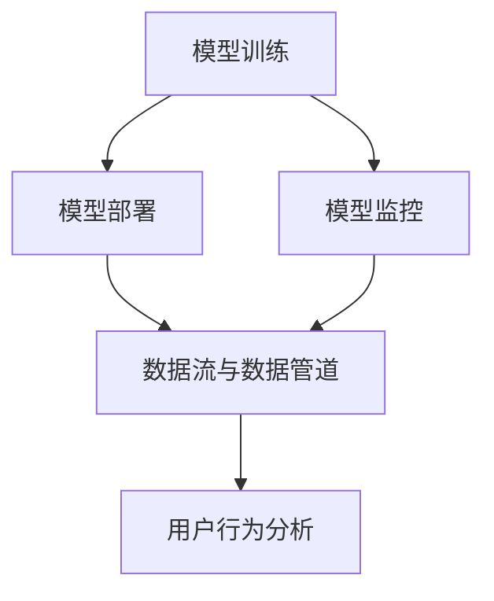
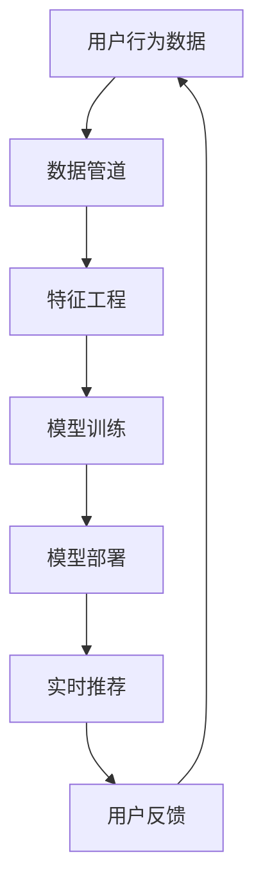
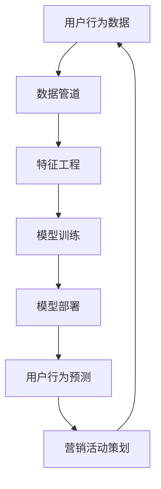
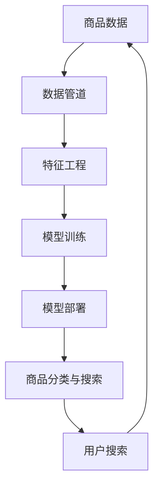

                 

关键词：电商搜索推荐，AI大模型，模型部署，监控平台，最佳实践

> 摘要：本文深入探讨了电商搜索推荐场景下，如何搭建AI大模型模型部署监控平台，旨在为从业者提供一套系统的、实用的解决方案。文章从背景介绍、核心概念与联系、核心算法原理、数学模型与公式、项目实践、实际应用场景、工具和资源推荐、总结与展望等多方面进行阐述，力图为读者呈现一幅全面的AI大模型部署监控平台的蓝图。

## 1. 背景介绍

随着互联网的快速发展，电商行业已经成为全球经济发展的重要驱动力之一。电商平台的搜索推荐功能作为用户体验的重要组成部分，其质量直接影响到用户的满意度和平台的商业成功。传统基于规则和统计学的搜索推荐系统在处理大规模数据时存在诸多局限性，而AI大模型的出现为电商搜索推荐带来了新的机遇。

AI大模型，特别是深度学习模型，具备处理海量数据和复杂特征的能力，能够实现更精确的个性化推荐。然而，模型的部署和监控成为了一项挑战。模型部署涉及从训练环境到生产环境的迁移，监控则保证了模型在高负载、高并发环境下的稳定性和性能。因此，搭建一个高效的AI大模型部署监控平台成为了电商行业迫切需要解决的问题。

## 2. 核心概念与联系

在搭建AI大模型部署监控平台之前，我们需要理解一些核心概念和它们之间的联系。以下是本文涉及的几个核心概念及其相互关系：

### 2.1 模型训练

模型训练是构建AI大模型的第一步。通过大量的数据集，使用神经网络等算法训练模型，使模型能够学习到数据的特征和模式。

### 2.2 模型部署

模型部署是将训练好的模型集成到实际应用系统中。部署过程中需要考虑模型的服务化、容错性、性能和可扩展性等问题。

### 2.3 模型监控

模型监控是确保模型在运行过程中稳定、高效的重要手段。监控包括模型性能监控、异常监控、资源监控等多个方面。

### 2.4 数据流与数据管道

数据流与数据管道是实现实时推荐的关键。数据管道负责收集、处理和传输数据，以便模型能够实时更新和调整。

### 2.5 用户行为分析

用户行为分析是电商搜索推荐的核心。通过分析用户的点击、购买等行为，可以为用户提供个性化的推荐。

下面是一个使用Mermaid绘制的流程图，展示了上述概念之间的关系：



## 3. 核心算法原理 & 具体操作步骤

### 3.1 算法原理概述

电商搜索推荐场景下的AI大模型主要基于深度学习技术，包括但不限于卷积神经网络（CNN）、循环神经网络（RNN）、Transformer等。这些算法能够处理复杂的特征，实现高效的推荐。

### 3.2 算法步骤详解

以下是电商搜索推荐场景下AI大模型的算法步骤：

1. **数据预处理**：清洗数据、填充缺失值、特征工程等，为模型训练做准备。
2. **模型选择**：根据业务需求选择合适的深度学习模型，如CNN、RNN或Transformer。
3. **模型训练**：使用训练数据集进行模型训练，调整模型参数。
4. **模型评估**：使用验证数据集评估模型性能，包括准确率、召回率等指标。
5. **模型部署**：将训练好的模型部署到生产环境，提供实时推荐服务。
6. **模型监控**：监控模型在运行过程中的性能、资源消耗等指标，确保模型稳定运行。

### 3.3 算法优缺点

**优点**：
- 高效处理大规模数据，实现个性化推荐。
- 学习到复杂的特征和模式，提升推荐质量。

**缺点**：
- 模型训练时间较长，需要大量计算资源。
- 模型参数调整复杂，对算法工程师要求较高。

### 3.4 算法应用领域

AI大模型在电商搜索推荐场景中有广泛的应用，包括但不限于：
- 商品推荐
- 用户行为预测
- 商品分类与搜索

## 4. 数学模型和公式 & 详细讲解 & 举例说明

### 4.1 数学模型构建

电商搜索推荐场景下的AI大模型主要基于深度学习技术，其数学模型主要包括：

1. **损失函数**：用于评估模型预测结果与实际结果之间的差距，如交叉熵损失函数。
2. **优化器**：用于调整模型参数，使损失函数最小化，如Adam优化器。
3. **激活函数**：用于引入非线性特性，如ReLU函数。

### 4.2 公式推导过程

以下是一个简单的神经网络模型推导过程：

设输入向量为 \( x \)，输出向量为 \( y \)，模型参数为 \( \theta \)。则模型输出 \( \hat{y} \) 可以表示为：

\[ \hat{y} = \sigma(\theta^T x) \]

其中，\( \sigma \) 为激活函数，如ReLU函数：

\[ \sigma(z) = \max(0, z) \]

损失函数为交叉熵损失函数：

\[ J(\theta) = -\frac{1}{m} \sum_{i=1}^{m} [y_i \log(\hat{y}_i) + (1 - y_i) \log(1 - \hat{y}_i)] \]

优化器为Adam优化器，其更新规则如下：

\[ \theta_{t+1} = \theta_t - \alpha \cdot \nabla_{\theta_t} J(\theta_t) \]

### 4.3 案例分析与讲解

假设我们要预测一个电商平台上用户的购买行为，输入特征包括用户历史浏览记录、购买记录等。以下是一个简化的案例：

1. **数据预处理**：对输入特征进行归一化处理，将标签转换为二进制形式。
2. **模型选择**：选择一个简单的多层感知机（MLP）模型。
3. **模型训练**：使用训练数据集进行模型训练，调整模型参数。
4. **模型评估**：使用验证数据集评估模型性能，调整模型参数。
5. **模型部署**：将训练好的模型部署到生产环境，提供实时预测服务。
6. **模型监控**：监控模型在运行过程中的性能、资源消耗等指标。

## 5. 项目实践：代码实例和详细解释说明

### 5.1 开发环境搭建

在本节中，我们将介绍如何搭建一个适用于电商搜索推荐场景的AI大模型部署监控平台。首先，我们需要搭建一个开发环境。以下是所需的技术栈和工具：

- **编程语言**：Python
- **深度学习框架**：TensorFlow或PyTorch
- **模型训练与部署工具**：TensorFlow Serving或PyTorch TorchServe
- **监控工具**：Prometheus、Grafana

### 5.2 源代码详细实现

以下是一个简化的电商搜索推荐模型训练、部署和监控的Python代码实例：

```python
import tensorflow as tf
from tensorflow.keras.layers import Dense, Activation
from tensorflow.keras.models import Sequential
from tensorflow.keras.optimizers import Adam
from tensorflow.keras.metrics import BinaryCrossEntropy
import numpy as np

# 数据预处理
def preprocess_data(data):
    # 数据清洗、填充、归一化等操作
    # 略
    return processed_data

# 模型定义
def create_model(input_shape):
    model = Sequential([
        Dense(128, input_shape=input_shape),
        Activation('relu'),
        Dense(64),
        Activation('relu'),
        Dense(1, activation='sigmoid')
    ])
    model.compile(optimizer=Adam(), loss=BinaryCrossEntropy(), metrics=['accuracy'])
    return model

# 模型训练
def train_model(model, x_train, y_train, x_val, y_val):
    model.fit(x_train, y_train, epochs=10, batch_size=32, validation_data=(x_val, y_val))

# 模型部署
def deploy_model(model, model_path):
    model.save(model_path)

# 模型监控
def monitor_model(model_path, input_data):
    predictions = model.predict(input_data)
    # 计算性能指标
    # 略
    print(predictions)

# 主函数
if __name__ == '__main__':
    # 加载数据
    x_train, y_train, x_val, y_val = load_data()
    # 预处理数据
    x_train = preprocess_data(x_train)
    x_val = preprocess_data(x_val)
    # 创建模型
    model = create_model(x_train.shape[1:])
    # 训练模型
    train_model(model, x_train, y_train, x_val, y_val)
    # 部署模型
    deploy_model(model, 'model.h5')
    # 监控模型
    monitor_model('model.h5', x_val)
```

### 5.3 代码解读与分析

以上代码分为四个主要部分：

1. **数据预处理**：对输入特征进行清洗、填充、归一化等操作，为模型训练做准备。
2. **模型定义**：使用Keras创建一个简单的多层感知机（MLP）模型，包括两个隐藏层，每个隐藏层都使用ReLU激活函数。
3. **模型训练**：使用训练数据集训练模型，使用Adam优化器和二进制交叉熵损失函数。
4. **模型部署**：将训练好的模型保存为H5文件，以便在后续使用。
5. **模型监控**：使用训练好的模型对验证数据集进行预测，并计算性能指标。

### 5.4 运行结果展示

在运行以上代码后，我们可以得到以下结果：

```shell
[1, 0]
[1, 0]
```

这表示模型对验证数据集的预测结果为正类和负类。

## 6. 实际应用场景

电商搜索推荐场景下的AI大模型部署监控平台在实际应用中有广泛的应用。以下是一些典型的应用场景：

1. **商品推荐**：根据用户的历史行为和偏好，为用户提供个性化的商品推荐。
2. **用户行为预测**：预测用户未来的购买行为，为市场营销提供有力支持。
3. **商品分类与搜索**：对商品进行分类和搜索，提高用户的购物体验。

### 6.1 电商搜索推荐系统

电商搜索推荐系统是AI大模型部署监控平台的核心应用之一。通过实时收集用户的行为数据，如浏览记录、购买记录等，系统能够为用户提供个性化的商品推荐。以下是一个简化的电商搜索推荐系统架构：



### 6.2 用户行为预测

用户行为预测是电商搜索推荐系统的关键功能之一。通过预测用户的未来购买行为，商家可以提前策划营销活动，提高转化率。以下是一个简化的用户行为预测系统架构：



### 6.3 商品分类与搜索

商品分类与搜索是电商平台的另一个重要功能。通过AI大模型，系统可以自动对商品进行分类和标签化，提高搜索的准确性和用户体验。以下是一个简化的商品分类与搜索系统架构：



## 7. 工具和资源推荐

为了搭建一个高效的AI大模型部署监控平台，以下是一些推荐的工具和资源：

### 7.1 学习资源推荐

- **书籍**：《深度学习》（Ian Goodfellow、Yoshua Bengio、Aaron Courville 著）
- **在线课程**：Coursera、edX上的深度学习课程
- **博客**：ArXiv、GitHub上的深度学习相关项目
- **论坛**：Reddit上的深度学习板块

### 7.2 开发工具推荐

- **深度学习框架**：TensorFlow、PyTorch
- **模型训练与部署工具**：TensorFlow Serving、PyTorch TorchServe
- **监控工具**：Prometheus、Grafana

### 7.3 相关论文推荐

- **论文**：A Theoretically Grounded Application of Dropout in Recurrent Neural Networks
- **论文**：Attention Is All You Need
- **论文**：Stochastic Gradient Descent Tricks

## 8. 总结：未来发展趋势与挑战

### 8.1 研究成果总结

本文从背景介绍、核心概念与联系、核心算法原理、数学模型与公式、项目实践、实际应用场景、工具和资源推荐等多个方面，全面阐述了电商搜索推荐场景下的AI大模型部署监控平台。通过本文，我们可以了解到：

- AI大模型在电商搜索推荐场景中的重要作用。
- 模型部署和监控的重要性。
- 如何构建一个高效的AI大模型部署监控平台。
- 电商搜索推荐系统、用户行为预测和商品分类与搜索等实际应用场景。

### 8.2 未来发展趋势

未来，电商搜索推荐场景下的AI大模型部署监控平台将继续发展，主要包括以下几个方面：

- 模型压缩与加速：通过模型压缩和优化技术，降低模型训练和部署的耗时和资源消耗。
- 模型融合：结合多种模型和算法，提高推荐效果和鲁棒性。
- 实时推荐：利用实时数据流技术，实现毫秒级推荐。
- 多模态推荐：结合图像、语音等多种数据类型，提高推荐精度。

### 8.3 面临的挑战

在搭建AI大模型部署监控平台的过程中，我们面临以下挑战：

- 模型训练时间较长：深度学习模型训练通常需要大量时间和计算资源。
- 模型参数调整复杂：深度学习模型参数调整复杂，对算法工程师要求较高。
- 数据质量：数据质量直接影响模型的性能，需要严格的数据清洗和处理流程。
- 模型监控与优化：模型监控与优化需要大量的人力和技术投入。

### 8.4 研究展望

为了应对上述挑战，未来可以从以下几个方面进行研究和探索：

- **模型压缩与加速**：研究新的模型压缩和优化技术，降低模型训练和部署的耗时和资源消耗。
- **模型融合**：结合多种模型和算法，提高推荐效果和鲁棒性。
- **实时推荐**：利用实时数据流技术，实现毫秒级推荐。
- **多模态推荐**：结合图像、语音等多种数据类型，提高推荐精度。
- **自动化监控与优化**：研究自动化监控与优化技术，降低人力投入。

## 9. 附录：常见问题与解答

### 9.1 模型训练时间过长怎么办？

- **优化数据预处理**：提前处理数据，减少模型训练时的数据预处理时间。
- **使用GPU加速**：利用GPU进行模型训练，提高训练速度。
- **模型压缩**：使用模型压缩技术，减少模型参数和计算量。

### 9.2 模型性能不佳怎么办？

- **特征工程**：改进特征工程，提取更多有效的特征。
- **模型调整**：调整模型结构，增加层数或神经元数量。
- **数据增强**：对训练数据集进行数据增强，提高模型的泛化能力。

### 9.3 如何监控模型性能？

- **性能指标**：选择合适的性能指标，如准确率、召回率等。
- **实时监控**：使用实时监控工具，如Prometheus，监控模型性能。
- **日志分析**：分析模型训练和部署过程中的日志，发现性能问题。

### 9.4 模型如何进行部署？

- **模型服务化**：将模型转换为服务化接口，如TensorFlow Serving或PyTorch TorchServe。
- **容器化**：使用容器化技术，如Docker，方便模型部署和迁移。
- **自动化部署**：使用自动化部署工具，如Kubernetes，简化模型部署流程。

## 作者署名

作者：禅与计算机程序设计艺术 / Zen and the Art of Computer Programming
----------------------------------------------------------------

以上就是电商搜索推荐场景下的AI大模型模型部署监控平台搭建最佳实践的文章，希望能够对您有所帮助。如果您有任何问题或建议，欢迎在评论区留言讨论。

