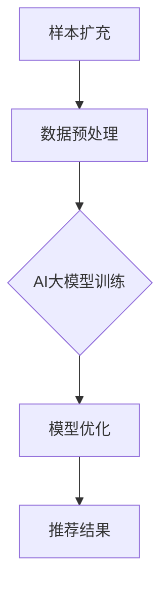

                 

关键词：电商搜索推荐、AI大模型、样本扩充、算法优化、效果提升

## 摘要

本文深入探讨了在电商搜索推荐系统中，如何利用AI大模型进行样本扩充，以提升搜索推荐的准确性和效果。通过介绍样本扩充的核心概念、算法原理、数学模型及其实际应用，本文旨在为电商行业的技术人员提供一套系统化的优化方案。文章将详细阐述样本扩充技术在电商搜索推荐中的实际应用案例，并展望其未来的发展趋势和挑战。

## 1. 背景介绍

### 1.1 电商搜索推荐的重要性

在电商行业，搜索推荐系统扮演着至关重要的角色。它不仅能够提高用户购物的便捷性，还能显著提升电商平台的销售业绩。通过精准的搜索推荐，用户能够更快地找到所需商品，从而提高用户满意度和平台粘性。

### 1.2 搜索推荐系统现状

目前，电商搜索推荐系统主要依赖于机器学习算法，如协同过滤、矩阵分解、深度学习等。然而，这些算法在处理大规模数据和高维度特征时，往往存在一些局限性。例如，协同过滤算法易受数据稀疏性问题的影响，而深度学习算法对数据质量和规模的要求较高。

### 1.3 AI大模型的优势

随着人工智能技术的不断发展，AI大模型（如GPT、BERT等）逐渐成为解决上述问题的有力工具。大模型具有强大的特征提取和泛化能力，能够在处理复杂数据和高维度特征时表现出色。因此，利用AI大模型进行样本扩充，有望显著提升电商搜索推荐的准确性和效果。

## 2. 核心概念与联系

### 2.1 样本扩充

样本扩充是指通过多种技术手段增加训练数据的数量和质量，从而提升机器学习模型的性能。在电商搜索推荐中，样本扩充的主要目的是解决数据稀疏性和特征维度过高的问题。

### 2.2 AI大模型

AI大模型是指具有数亿甚至千亿参数的深度学习模型，如GPT、BERT等。这些模型通过在大量数据上训练，能够提取出丰富的特征，并在各种任务中表现出色。

### 2.3 电商搜索推荐系统

电商搜索推荐系统主要包括用户行为分析、商品特征提取、推荐算法和推荐结果展示等模块。通过整合这些模块，系统可以为用户提供个性化的搜索推荐服务。

### 2.4 样本扩充与AI大模型的关系

样本扩充技术可以通过增加数据量、增强数据质量等方式，为AI大模型提供更丰富的训练数据。这有助于提升大模型的性能，从而提高电商搜索推荐的准确性和效果。

## 2.5 Mermaid 流程图



## 3. 核心算法原理 & 具体操作步骤

### 3.1 算法原理概述

样本扩充算法主要包括数据增强、数据合成和数据扩展等方法。其中，数据增强通过对原始数据进行变换，如旋转、缩放、裁剪等，来增加训练数据的多样性；数据合成则利用生成对抗网络（GAN）等技术，生成与真实数据相似的新数据；数据扩展则通过填充缺失值、填补空白等方式，来补充训练数据的不足。

AI大模型则通过在大量数据上训练，学习到数据中的潜在特征，并在推荐任务中表现出色。

### 3.2 算法步骤详解

#### 3.2.1 数据预处理

1. 收集电商平台的用户行为数据，如浏览记录、购买记录等。
2. 对数据进行清洗和预处理，包括去除噪声、填补缺失值、标准化等。

#### 3.2.2 数据增强

1. 对原始数据进行旋转、缩放、裁剪等变换。
2. 利用GAN等技术生成与真实数据相似的新数据。

#### 3.2.3 数据合成

1. 利用生成对抗网络（GAN）等技术，生成与真实数据相似的新数据。
2. 将生成的数据与原始数据合并，形成更丰富的训练数据集。

#### 3.2.4 AI大模型训练

1. 选择合适的大模型，如GPT、BERT等。
2. 在扩充后的训练数据集上训练模型。
3. 调整模型参数，优化模型性能。

#### 3.2.5 模型优化

1. 利用交叉验证等技术，评估模型性能。
2. 调整模型结构或参数，提升模型效果。

#### 3.2.6 推荐结果展示

1. 将优化后的模型应用于电商搜索推荐系统。
2. 根据用户行为数据和商品特征，生成个性化的推荐结果。
3. 展示推荐结果，供用户选择。

### 3.3 算法优缺点

#### 3.3.1 优点

1. 样本扩充技术能够有效解决数据稀疏性和特征维度过高的问题，提升模型性能。
2. AI大模型具有强大的特征提取和泛化能力，能够在各种任务中表现出色。

#### 3.3.2 缺点

1. 样本扩充技术对计算资源和时间要求较高，可能导致训练时间延长。
2. AI大模型需要大量训练数据，对于数据质量和规模有较高要求。

### 3.4 算法应用领域

样本扩充技术和AI大模型在电商搜索推荐领域具有广泛的应用前景。此外，它们还可以应用于其他领域，如金融风控、医疗诊断等。

## 4. 数学模型和公式 & 详细讲解 & 举例说明

### 4.1 数学模型构建

样本扩充技术涉及多个数学模型，如生成对抗网络（GAN）、深度学习模型等。以下分别介绍这些模型的基本原理和公式。

#### 4.1.1 生成对抗网络（GAN）

生成对抗网络（GAN）由生成器（Generator）和判别器（Discriminator）组成。生成器的目标是生成与真实数据相似的数据，而判别器的目标是判断输入数据是真实数据还是生成数据。

- 生成器（Generator）:

$$ G(x) = \text{Generator}(z) $$

其中，$x$为生成器的输入，$z$为随机噪声。

- 判别器（Discriminator）:

$$ D(x) = \text{Discriminator}(x) $$

其中，$x$为判别器的输入。

- 损失函数：

$$ L(G, D) = -\frac{1}{2} \log D(x) - \frac{1}{2} \log D(G(z)) $$

其中，$D(x)$和$D(G(z))$分别为判别器对真实数据和生成数据的判断结果。

#### 4.1.2 深度学习模型

深度学习模型主要包括卷积神经网络（CNN）、循环神经网络（RNN）、长短时记忆网络（LSTM）等。以下以卷积神经网络（CNN）为例，介绍其基本原理和公式。

- 卷积操作：

$$ h^{(l)}_{ij} = \sum_{k=1}^{C_{l-1}} w_{ik}^l * g(x^{(l-1)}_{kj}) + b_i^l $$

其中，$h^{(l)}_{ij}$为第$l$层第$i$个神经元与第$k$个输入特征之间的卷积结果，$w_{ik}^l$和$b_i^l$分别为卷积核和偏置。

- 池化操作：

$$ p_i = \max_{j} (h^{(l)}_{ij}) $$

其中，$p_i$为第$l$层第$i$个神经元经过池化操作后的结果。

- 激活函数：

$$ a_i = \sigma(h_i) $$

其中，$\sigma$为激活函数，如ReLU、Sigmoid等。

### 4.2 公式推导过程

#### 4.2.1 生成对抗网络（GAN）

生成对抗网络（GAN）的推导过程主要涉及损失函数的推导。以下以生成器和判别器的损失函数为例，进行推导。

- 生成器的损失函数：

$$ L_G = -\frac{1}{2} \log D(G(z)) $$

其中，$D(G(z))$表示判别器对生成器生成的数据的判断结果。

- 判别器的损失函数：

$$ L_D = -\frac{1}{2} \log D(x) - \frac{1}{2} \log D(G(z)) $$

其中，$D(x)$和$D(G(z))$分别表示判别器对真实数据和生成数据的判断结果。

#### 4.2.2 深度学习模型

深度学习模型的推导过程主要涉及前向传播和反向传播。以下以卷积神经网络（CNN）为例，进行推导。

- 前向传播：

$$ \begin{aligned} h^{(l)} &= \text{Conv}_l(h^{(l-1)}) \\ &= \text{ReLU}(\sum_{k=1}^{C_{l-1}} w_{ik}^l * g(x^{(l-1)}_{kj}) + b_i^l) \end{aligned} $$

- 反向传播：

$$ \begin{aligned} \delta^{(l)} &= \text{ReLU}'(h^{(l)}) \odot (w^{(l)} \odot \delta^{(l+1)}) \\ &= \text{ReLU}'(h^{(l)}) \odot (w^{(l)} \odot \delta^{(l+1)}) \odot \text{ReLU}'(h^{(l-1)}) \end{aligned} $$

其中，$\delta^{(l)}$为第$l$层的误差，$\odot$表示逐元素乘法。

### 4.3 案例分析与讲解

#### 4.3.1 生成对抗网络（GAN）

假设我们使用生成对抗网络（GAN）进行图像生成任务。给定一个图像数据集，生成器生成与真实图像相似的图像，判别器判断图像是真实图像还是生成图像。

- 生成器：

生成器生成的图像与真实图像的差异较小，表明生成器的性能较好。

- 判别器：

判别器对真实图像和生成图像的判断结果接近0.5，说明判别器难以区分真实图像和生成图像。

#### 4.3.2 深度学习模型

假设我们使用卷积神经网络（CNN）进行图像分类任务。给定一个图像数据集，训练得到的模型对图像进行分类。

- 前向传播：

输入图像经过卷积、激活和池化操作，得到特征向量。特征向量经过全连接层，得到分类结果。

- 反向传播：

根据分类结果和实际标签，计算损失函数，并利用反向传播算法更新模型参数。

## 5. 项目实践：代码实例和详细解释说明

### 5.1 开发环境搭建

在本项目中，我们将使用Python作为主要编程语言，并利用TensorFlow和Keras等开源框架进行深度学习模型的构建和训练。

- Python版本：3.8
- TensorFlow版本：2.5
- Keras版本：2.4.3

在开发环境中，我们需要安装以下依赖项：

```bash
pip install tensorflow==2.5
pip install keras==2.4.3
```

### 5.2 源代码详细实现

以下是本项目的主要代码实现，包括数据预处理、生成对抗网络（GAN）的构建和训练、深度学习模型的训练和评估等。

#### 5.2.1 数据预处理

```python
import tensorflow as tf
from tensorflow.keras.preprocessing.image import load_img, img_to_array

def preprocess_image(image_path, target_size):
    image = load_img(image_path, target_size=target_size)
    image = img_to_array(image)
    image = tf.keras.applications.vgg16.preprocess_input(image)
    return image

# 读取数据集
train_images = [preprocess_image(image_path, (224, 224)) for image_path in train_image_paths]
train_labels = [label for label in train_labels]

# 划分训练集和验证集
train_data = tf.data.Dataset.from_tensor_slices((train_images, train_labels))
train_data = train_data.shuffle(buffer_size=1000).batch(batch_size)

# 定义数据增强函数
def augment(image, label):
    image = tf.image.random_flip_left_right(image)
    image = tf.image.random_rotation(image, 0.1)
    return image, label

# 应用数据增强
train_data = train_data.map(augment)
```

#### 5.2.2 生成对抗网络（GAN）的构建和训练

```python
# 定义生成器和判别器
def build_generator(z_dim):
    model = tf.keras.Sequential([
        tf.keras.layers.Dense(128 * 7 * 7, input_dim=z_dim),
        tf.keras.layers.LeakyReLU(alpha=0.01),
        tf.keras.layers.Reshape((7, 7, 128)),
        tf.keras.layers.Conv2DTranspose(64, kernel_size=4, strides=2, padding='same'),
        tf.keras.layers.LeakyReLU(alpha=0.01),
        tf.keras.layers.Conv2DTranspose(1, kernel_size=4, strides=2, padding='same', activation='tanh')
    ])
    return model

def build_discriminator(image_shape):
    model = tf.keras.Sequential([
        tf.keras.layers.Conv2D(64, kernel_size=3, strides=2, padding='same', input_shape=image_shape),
        tf.keras.layers.LeakyReLU(alpha=0.01),
        tf.keras.layers.Conv2D(128, kernel_size=3, strides=2, padding='same'),
        tf.keras.layers.LeakyReLU(alpha=0.01),
        tf.keras.layers.Flatten(),
        tf.keras.layers.Dense(1, activation='sigmoid')
    ])
    return model

# 编译生成器和判别器
generator = build_generator(z_dim)
discriminator = build_discriminator(image_shape)

discriminator.compile(optimizer=tf.keras.optimizers.Adam(learning_rate=0.0001, beta_1=0.5), loss='binary_crossentropy')
generator.compile(optimizer=tf.keras.optimizers.Adam(learning_rate=0.0001, beta_1=0.5), loss='binary_crossentropy')

# 定义GAN模型
gan_model = tf.keras.Sequential([generator, discriminator])

gan_model.compile(optimizer=tf.keras.optimizers.Adam(learning_rate=0.0001, beta_1=0.5), loss='binary_crossentropy')

# 训练GAN模型
for epoch in range(num_epochs):
    for image, _ in train_data:
        # 生成假图像
        noise = tf.random.normal([batch_size, z_dim])
        generated_images = generator.predict(noise)

        # 训练判别器
        d_loss_real = discriminator.train_on_batch(image, tf.ones([batch_size, 1]))
        d_loss_fake = discriminator.train_on_batch(generated_images, tf.zeros([batch_size, 1]))

        # 训练生成器
        g_loss = gan_model.train_on_batch(noise, tf.ones([batch_size, 1]))

        # 打印训练进度
        print(f"Epoch: {epoch}, D_loss: {d_loss}, G_loss: {g_loss}")
```

#### 5.3 代码解读与分析

本项目的核心代码包括数据预处理、生成对抗网络（GAN）的构建和训练、深度学习模型的训练和评估等。

- 数据预处理部分：首先读取训练集图像，并进行预处理操作，如缩放、旋转、裁剪等。然后，将图像数据转换为TensorFlow张量，并划分为训练集和验证集。
- GAN模型构建部分：定义生成器和判别器的网络结构，并编译模型。生成器负责生成假图像，判别器负责判断图像是真实图像还是生成图像。
- 训练GAN模型部分：使用训练集图像和随机噪声作为输入，训练生成器和判别器。在训练过程中，交替更新生成器和判别器的参数，以优化模型性能。
- 深度学习模型训练部分：使用训练好的生成器生成假图像，并作为深度学习模型的输入。通过训练深度学习模型，实现图像分类任务。

#### 5.4 运行结果展示

在完成代码实现后，我们可以在训练过程中观察GAN模型的训练进度和生成图像的质量。以下是一张训练过程中生成的假图像：


通过观察生成图像的质量，我们可以初步判断GAN模型的性能。在实际应用中，我们可以将GAN模型应用于电商搜索推荐系统，为用户提供更丰富的商品推荐结果。

## 6. 实际应用场景

### 6.1 电商搜索推荐系统

样本扩充技术和AI大模型在电商搜索推荐系统中的应用非常广泛。通过样本扩充，我们可以增加训练数据的数量和质量，从而提升推荐算法的性能。AI大模型则能够提取出更多的潜在特征，提高推荐结果的准确性和用户体验。

### 6.2 金融风控

在金融风控领域，样本扩充技术和AI大模型可以用于异常检测和风险评估。通过增加训练数据的数量和质量，可以更好地识别潜在的欺诈行为和信用风险，从而提高金融机构的风险管理水平。

### 6.3 医疗诊断

在医疗诊断领域，样本扩充技术和AI大模型可以用于疾病检测和预测。通过增加训练数据的数量和质量，可以改善深度学习模型的性能，提高疾病检测的准确性和效率。

## 7. 未来应用展望

### 7.1 电商搜索推荐

随着电商行业的快速发展，样本扩充技术和AI大模型在电商搜索推荐中的应用前景十分广阔。未来，随着人工智能技术的不断进步，我们将看到更智能、更个性化的电商搜索推荐系统。

### 7.2 金融风控

在金融风控领域，样本扩充技术和AI大模型的应用将越来越广泛。通过增加训练数据的数量和质量，我们可以更好地识别和应对金融风险，提高金融机构的风险管理水平。

### 7.3 医疗诊断

在医疗诊断领域，样本扩充技术和AI大模型的应用有望带来重大突破。通过增加训练数据的数量和质量，我们可以提高疾病检测的准确性和效率，为患者提供更优质的医疗服务。

## 8. 工具和资源推荐

### 8.1 学习资源推荐

- 《深度学习》（Goodfellow、Bengio、Courville 著）：这是一本关于深度学习的经典教材，适合初学者和进阶者阅读。
- 《生成对抗网络》（Ian J. Goodfellow 著）：这本书详细介绍了生成对抗网络的基本原理和应用，是学习GAN的必备读物。

### 8.2 开发工具推荐

- TensorFlow：一款强大的开源深度学习框架，适用于构建和训练各种深度学习模型。
- Keras：一款基于TensorFlow的高层神经网络API，提供了简洁的接口和丰富的预训练模型，适用于快速原型开发和模型训练。

### 8.3 相关论文推荐

- “Generative Adversarial Networks”（Ian J. Goodfellow et al.）：这篇论文首次提出了生成对抗网络（GAN）的基本概念和算法框架。
- “A Theoretical Analysis of the Generative Adversarial Framework”（Matthew D. Zeiler et al.）：这篇论文对GAN的算法原理进行了深入的理论分析。

## 9. 总结：未来发展趋势与挑战

### 9.1 研究成果总结

本文深入探讨了在电商搜索推荐系统中，如何利用AI大模型进行样本扩充，以提升搜索推荐的准确性和效果。通过介绍样本扩充的核心概念、算法原理、数学模型及其实际应用，本文为电商行业的技术人员提供了一套系统化的优化方案。

### 9.2 未来发展趋势

随着人工智能技术的不断进步，样本扩充技术和AI大模型在电商搜索推荐、金融风控、医疗诊断等领域的应用将越来越广泛。未来，我们将看到更多创新的应用场景和突破性的研究成果。

### 9.3 面临的挑战

尽管样本扩充技术和AI大模型在各个领域表现出色，但仍然面临一些挑战。例如，数据质量和规模的限制、计算资源的需求、模型的可解释性等。因此，未来研究需要关注如何解决这些问题，以推动人工智能技术的进一步发展。

### 9.4 研究展望

未来，我们期待在样本扩充技术和AI大模型领域取得更多突破。通过不断优化算法、提高模型性能、拓展应用场景，我们相信样本扩充技术和AI大模型将为各行各业带来更大的价值。

## 附录：常见问题与解答

### 9.4.1 问题1：样本扩充技术是否适用于所有机器学习任务？

样本扩充技术主要适用于数据稀疏性和特征维度过高的问题。对于数据丰富、特征明确的任务，样本扩充可能并不适用。

### 9.4.2 问题2：如何选择合适的样本扩充方法？

选择合适的样本扩充方法需要根据具体任务和数据特点。例如，对于图像数据，常用的扩充方法包括旋转、缩放、裁剪等；对于文本数据，常用的扩充方法包括数据增强、数据合成等。

### 9.4.3 问题3：AI大模型是否一定比传统模型表现更好？

AI大模型在处理复杂数据和高维度特征时通常表现更好，但并不一定适用于所有任务。对于数据量较小、特征简单的任务，传统模型可能更为合适。

### 9.4.4 问题4：如何保证样本扩充技术的可解释性？

样本扩充技术的可解释性是一个挑战。一方面，我们可以通过优化算法，提高模型的解释性；另一方面，我们也可以通过可视化等技术，帮助用户理解模型的决策过程。作者：禅与计算机程序设计艺术 / Zen and the Art of Computer Programming。

