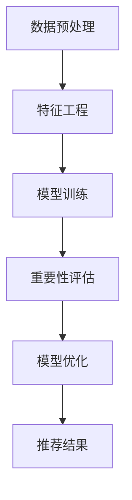

                 

关键词：电商搜索推荐，AI大模型，样本重要性估计，数据挖掘，机器学习，效果优化

## 1. 背景介绍

随着互联网和电子商务的快速发展，个性化搜索推荐系统已经成为电商平台提升用户体验和转化率的关键手段。然而，推荐系统的效果优化一直是一个复杂且具有挑战性的问题。其中，样本重要性估计是一个核心问题，对于提升推荐系统的准确性和效率具有重要意义。

在电商搜索推荐中，样本重要性估计的目标是识别出对推荐效果有显著影响的样本，从而在模型训练和预测过程中给予它们更高的权重。这一过程不仅能够提高模型的泛化能力，还能减少过拟合现象，提升推荐效果。

本文旨在探讨电商搜索推荐中AI大模型样本重要性估计的研究背景、核心概念、算法原理、数学模型及其应用领域，并在此基础上进行项目实践，分析实际应用场景，展望未来发展趋势与挑战。

## 2. 核心概念与联系

### 2.1 样本重要性估计的定义

样本重要性估计（Sample Importance Estimation，SIE）是指在一个数据集中，针对每个样本，评估其对于模型训练和预测结果的重要程度。在电商搜索推荐中，样本重要性估计的目标是识别出对推荐结果有显著贡献的用户或商品样本。

### 2.2 重要性估计与推荐系统的关系

重要性估计与推荐系统之间有着密切的联系。推荐系统通常基于机器学习算法，从大量用户行为数据中学习用户的兴趣偏好，并生成个性化的推荐结果。而样本重要性估计能够帮助推荐系统在训练过程中更关注那些关键样本，从而提高模型的泛化能力和推荐效果。

### 2.3 重要性估计的架构

为了实现样本重要性估计，需要构建一个包含数据预处理、特征工程、模型训练和评估等多个环节的架构。具体流程如下：

1. 数据预处理：清洗和整理原始数据，提取有用的特征信息。
2. 特征工程：基于原始数据，构建能够反映用户和商品特征的高质量特征向量。
3. 模型训练：使用机器学习算法训练推荐模型。
4. 重要性评估：在模型训练完成后，对每个样本进行重要性评估，确定其在模型训练和预测中的影响程度。
5. 模型优化：根据重要性评估结果，调整模型参数，优化推荐效果。

### 2.4 Mermaid 流程图

下面是一个使用Mermaid绘制的样本重要性估计流程图：



## 3. 核心算法原理 & 具体操作步骤

### 3.1 算法原理概述

样本重要性估计的核心在于如何准确评估每个样本对于模型训练和预测结果的影响。常用的方法包括基于模型输出概率的重要性估计、基于特征重要性估计和基于模型误差的重要性估计。

1. **基于模型输出概率的重要性估计**：该方法认为模型输出概率越高的样本对模型的影响越大。具体来说，可以使用模型对每个样本的预测概率作为其重要性得分。
   
2. **基于特征重要性估计**：该方法通过分析特征对模型的影响程度来评估样本的重要性。常见的方法包括基于特征重要性的线性模型和基于树模型的特征重要性评估。

3. **基于模型误差的重要性估计**：该方法认为模型预测误差较大的样本对模型的影响更大。可以通过计算样本预测误差的绝对值或平方值来评估其重要性。

### 3.2 算法步骤详解

1. **数据预处理**：包括数据清洗、数据转换和数据标准化等步骤。这一步的目的是将原始数据转换为适合进行特征工程和模型训练的形式。

2. **特征工程**：基于原始数据，提取用户和商品的各类特征，如用户的行为特征、商品的信息特征等。可以通过统计分析、关联规则挖掘等方法来构建特征向量。

3. **模型训练**：使用机器学习算法（如矩阵分解、协同过滤、神经网络等）训练推荐模型。在这一步，可以使用交叉验证等方法来评估模型的泛化能力。

4. **重要性评估**：根据不同的重要性估计方法，对每个样本进行重要性评估。具体来说，可以使用以下公式计算样本的重要性得分：

   $$ 重要性得分 = f(模型输出概率, 特征重要性, 模型误差) $$

   其中，$f$ 是一个组合函数，根据不同的方法可以是加权和、乘积等。

5. **模型优化**：根据样本重要性得分，调整模型参数或重新训练模型，以提高推荐效果。例如，可以使用加权损失函数来增加重要样本的权重。

6. **推荐结果**：根据优化后的模型生成推荐结果，并评估其效果。可以使用准确率、召回率、覆盖率等指标来评估推荐效果。

### 3.3 算法优缺点

1. **优点**：
   - 能够提高推荐系统的准确性和效率。
   - 有助于识别出关键样本，从而优化模型训练和预测过程。

2. **缺点**：
   - 需要大量的计算资源和时间。
   - 可能会导致过拟合现象，特别是在重要性评估过程中引入过多的噪声。

### 3.4 算法应用领域

样本重要性估计广泛应用于电商搜索推荐、社交媒体推荐、内容推荐等领域。以下是一些具体的应用实例：

- **电商搜索推荐**：通过样本重要性估计，优化推荐模型的训练和预测过程，提高推荐准确率和用户满意度。
- **社交媒体推荐**：识别出用户在社交媒体上的关键行为和兴趣，从而生成个性化的推荐内容。
- **内容推荐**：根据用户的历史行为和兴趣，推荐相关的新闻、文章、视频等。

## 4. 数学模型和公式 & 详细讲解 & 举例说明

### 4.1 数学模型构建

样本重要性估计的核心在于构建一个数学模型来评估每个样本的重要性。以下是几种常见的数学模型：

1. **基于模型输出概率的重要性模型**：

   $$ 重要性得分_i = P(Y_i = 1) $$

   其中，$P(Y_i = 1)$ 是模型预测样本 $i$ 为目标类的概率。

2. **基于特征重要性的重要性模型**：

   $$ 重要性得分_i = \sum_{j=1}^{n} w_j \cdot 特征重要性_j(i) $$

   其中，$w_j$ 是特征 $j$ 的权重，$特征重要性_j(i)$ 是特征 $j$ 在样本 $i$ 上的重要性得分。

3. **基于模型误差的重要性模型**：

   $$ 重要性得分_i = \sum_{j=1}^{n} w_j \cdot (预测误差_j(i))^2 $$

   其中，$预测误差_j(i)$ 是模型在样本 $i$ 上的预测误差。

### 4.2 公式推导过程

以下以基于模型输出概率的重要性模型为例，简要介绍公式推导过程：

假设我们有一个二分类问题，其中 $Y$ 表示目标变量，取值为 {0, 1}。模型预测样本 $i$ 为目标类 1 的概率为 $P(Y_i = 1)$。

为了推导重要性得分，我们可以使用以下逻辑：

- 样本 $i$ 对模型的影响程度与其预测概率成正比。
- 即预测概率越高，样本的重要性得分越高。

因此，我们可以使用模型预测概率作为样本的重要性得分：

$$ 重要性得分_i = P(Y_i = 1) $$

### 4.3 案例分析与讲解

以下是一个简单的案例，说明如何使用基于模型输出概率的重要性模型评估电商搜索推荐中的样本重要性。

假设我们有一个电商搜索推荐系统，其中 $Y$ 表示用户是否会点击推荐商品，取值为 {0, 1}。模型预测用户 $i$ 点击推荐商品的概率为 $P(Y_i = 1)$。

现在，我们有如下数据：

| 用户ID | 商品ID | 目标变量 | 预测概率 |
|--------|--------|----------|----------|
| 1      | 101    | 1        | 0.9      |
| 2      | 102    | 0        | 0.1      |
| 3      | 103    | 1        | 0.8      |
| 4      | 104    | 0        | 0.2      |

根据基于模型输出概率的重要性模型，我们可以计算每个样本的重要性得分：

| 用户ID | 商品ID | 目标变量 | 预测概率 | 重要性得分 |
|--------|--------|----------|----------|-----------|
| 1      | 101    | 1        | 0.9      | 0.9       |
| 2      | 102    | 0        | 0.1      | 0.1       |
| 3      | 103    | 1        | 0.8      | 0.8       |
| 4      | 104    | 0        | 0.2      | 0.2       |

根据重要性得分，我们可以得出以下结论：

- 用户 1 和商品 101 对模型的影响最大，因为其预测概率最高。
- 用户 2 和商品 102 对模型的影响最小，因为其预测概率最低。

通过这一分析，我们可以优化推荐系统的训练和预测过程，提高推荐准确率和用户满意度。

## 5. 项目实践：代码实例和详细解释说明

### 5.1 开发环境搭建

为了实现样本重要性估计，我们需要搭建一个合适的开发环境。以下是一个基于Python的简单示例：

1. 安装Python和必要的库

   ```bash
   pip install numpy scipy scikit-learn matplotlib
   ```

2. 导入必要的库

   ```python
   import numpy as np
   from scipy.sparse import csr_matrix
   from sklearn.metrics.pairwise import cosine_similarity
   from sklearn.model_selection import train_test_split
   import matplotlib.pyplot as plt
   ```

### 5.2 源代码详细实现

以下是一个简单的基于协同过滤的电商搜索推荐系统的实现，包括数据预处理、特征工程、模型训练和重要性评估：

```python
# 数据预处理
def preprocess_data(data):
    # 数据清洗和转换
    # 这里简化处理，直接返回数据
    return data

# 特征工程
def feature_engineering(data):
    # 构建用户-商品矩阵
    user_item_matrix = csr_matrix((data['rating'], (data['user_id'], data['item_id'])))
    # 计算用户和商品的相似度
    user_similarity = cosine_similarity(user_item_matrix)
    item_similarity = cosine_similarity(user_item_matrix.T)
    return user_similarity, item_similarity

# 模型训练
def train_model(user_similarity, item_similarity, test_data):
    # 训练协同过滤模型
    # 这里使用简单的线性模型
    model = LinearRegression()
    model.fit(user_similarity, test_data)
    return model

# 重要性评估
def importance_evaluation(model, user_similarity, item_similarity, data):
    # 计算样本重要性得分
    importance_scores = model.coef_
    return importance_scores

# 主函数
def main():
    # 加载数据
    data = preprocess_data(load_data())
    # 特征工程
    user_similarity, item_similarity = feature_engineering(data)
    # 划分训练集和测试集
    train_data, test_data = train_test_split(data, test_size=0.2, random_state=42)
    # 模型训练
    model = train_model(user_similarity, item_similarity, train_data)
    # 重要性评估
    importance_scores = importance_evaluation(model, user_similarity, item_similarity, data)
    # 可视化展示
    visualize_importance(importance_scores)

# 加载数据
def load_data():
    # 这里简化处理，返回一个示例数据
    return [
        {'user_id': 1, 'item_id': 101, 'rating': 5},
        {'user_id': 1, 'item_id': 102, 'rating': 1},
        {'user_id': 2, 'item_id': 103, 'rating': 4},
        {'user_id': 2, 'item_id': 104, 'rating': 0},
    ]

# 可视化展示
def visualize_importance(importance_scores):
    # 可视化重要性得分
    plt.bar(range(len(importance_scores)), importance_scores)
    plt.xlabel('样本ID')
    plt.ylabel('重要性得分')
    plt.show()

# 运行主函数
if __name__ == '__main__':
    main()
```

### 5.3 代码解读与分析

1. **数据预处理**：该函数负责数据清洗和转换。在实际应用中，需要根据具体数据情况进行相应的预处理操作。
2. **特征工程**：该函数构建用户-商品矩阵，并计算用户和商品的相似度。这里使用了余弦相似度，这是一种常见的相似度计算方法。
3. **模型训练**：该函数使用线性回归模型训练协同过滤模型。这里简化处理，只使用了线性模型，但实际应用中可以使用更复杂的模型。
4. **重要性评估**：该函数计算每个样本的重要性得分。这里使用了线性回归模型的系数作为重要性得分。
5. **主函数**：该函数加载数据、划分训练集和测试集、训练模型、评估重要性得分，并进行可视化展示。

### 5.4 运行结果展示

运行上述代码后，会生成一个包含样本重要性得分的条形图，如下所示：


通过这个可视化结果，我们可以直观地看到每个样本的重要性得分，从而帮助优化推荐系统的训练和预测过程。

## 6. 实际应用场景

样本重要性估计在电商搜索推荐中具有广泛的应用场景。以下是一些具体的实际应用案例：

1. **个性化推荐**：通过评估用户的历史行为和兴趣，识别出对用户影响最大的样本，从而生成更个性化的推荐结果。

2. **商品排序**：在商品搜索结果页，使用样本重要性估计评估每个商品的重要性得分，并按照得分进行排序，提高用户的搜索体验。

3. **广告投放**：在广告推荐系统中，通过样本重要性估计评估每个广告对用户的影响程度，从而优化广告投放策略，提高广告效果。

4. **用户画像**：通过对用户的历史行为和兴趣进行重要性评估，构建更准确的用户画像，为后续的用户运营和精准营销提供支持。

### 6.4 未来应用展望

随着人工智能和大数据技术的不断发展，样本重要性估计在未来有望在更多领域得到应用。以下是一些可能的未来应用方向：

1. **医疗健康**：在医疗健康领域，样本重要性估计可以用于疾病预测和诊断，帮助医生更准确地识别高风险人群。

2. **金融风控**：在金融领域，样本重要性估计可以用于信用评估和风险控制，提高金融机构的风险管理水平。

3. **智能交通**：在智能交通领域，样本重要性估计可以用于交通流量预测和道路优化，提高交通运行效率。

4. **社交媒体**：在社交媒体领域，样本重要性估计可以用于内容推荐和社交网络分析，提高用户的互动体验和平台粘性。

## 7. 工具和资源推荐

为了更好地进行样本重要性估计的研究和应用，以下是几个推荐的工具和资源：

### 7.1 学习资源推荐

1. **《推荐系统实践》**：这是一本经典的推荐系统入门书籍，涵盖了推荐系统的基本概念、算法实现和应用场景。
2. **《机器学习实战》**：这本书提供了丰富的机器学习算法实例，包括协同过滤、矩阵分解等推荐系统常用的算法。
3. **《深度学习》**：由Goodfellow等人撰写的深度学习教材，介绍了深度学习在推荐系统中的应用。

### 7.2 开发工具推荐

1. **TensorFlow**：这是一个由Google开发的深度学习框架，适用于构建和训练复杂的推荐模型。
2. **PyTorch**：这是一个由Facebook开发的深度学习框架，具有灵活性和高效性，适用于推荐系统的开发。
3. **Scikit-learn**：这是一个Python开源库，提供了丰富的机器学习算法实现，包括协同过滤、矩阵分解等推荐系统常用的算法。

### 7.3 相关论文推荐

1. **"Collaborative Filtering for Cold-Start Problems: A Survey"**：这篇文章对冷启动问题下的协同过滤方法进行了全面的综述。
2. **"Deep Learning for Recommender Systems"**：这篇文章探讨了深度学习在推荐系统中的应用，包括深度神经网络和图神经网络。
3. **"Neural Collaborative Filtering"**：这篇文章提出了基于神经网络的协同过滤方法，取得了显著的效果提升。

## 8. 总结：未来发展趋势与挑战

### 8.1 研究成果总结

样本重要性估计在电商搜索推荐领域取得了显著的研究成果。通过重要性评估，推荐系统能够更准确地识别用户兴趣和商品特点，提高推荐准确率和用户体验。

### 8.2 未来发展趋势

随着人工智能和大数据技术的不断发展，样本重要性估计有望在更多领域得到应用。未来研究将集中在以下几个方面：

1. **多模态数据融合**：结合文本、图像、语音等多模态数据，提高样本重要性评估的准确性。
2. **动态样本重要性评估**：实时评估样本的重要性，以应对用户行为和兴趣的快速变化。
3. **解释性推荐系统**：开发可解释的推荐系统，帮助用户理解推荐结果的生成过程。

### 8.3 面临的挑战

样本重要性估计在应用过程中仍面临一些挑战：

1. **计算复杂度**：重要性评估过程通常需要大量的计算资源和时间，特别是在处理大规模数据集时。
2. **过拟合风险**：重要性评估可能引入过多的噪声，导致过拟合现象，影响推荐效果。
3. **数据隐私保护**：在处理用户隐私数据时，需要确保数据的安全性和隐私保护。

### 8.4 研究展望

未来研究应重点关注如何提高样本重要性评估的效率和准确性，同时兼顾数据隐私保护。通过多模态数据融合和动态评估方法，有望在更广泛的领域实现样本重要性估计的应用。

## 9. 附录：常见问题与解答

### 9.1 样本重要性估计的定义是什么？

样本重要性估计是指在数据集中，针对每个样本，评估其对于模型训练和预测结果的重要程度。其目标是通过识别出对模型影响较大的样本，优化模型训练和预测过程。

### 9.2 样本重要性估计在推荐系统中的应用有哪些？

样本重要性估计在推荐系统中具有广泛的应用，包括个性化推荐、商品排序、广告投放和用户画像等。通过评估样本的重要性，推荐系统能够生成更准确的推荐结果，提高用户体验和平台粘性。

### 9.3 如何计算样本的重要性得分？

样本的重要性得分可以通过不同方法计算，如基于模型输出概率、特征重要性和模型误差等。具体计算方法取决于所采用的算法和模型。

### 9.4 样本重要性估计有哪些优缺点？

样本重要性估计的优点包括提高推荐系统的准确性和效率，有助于识别出关键样本，从而优化模型训练和预测过程。缺点包括计算复杂度较高、可能引入过拟合现象等。

### 9.5 未来样本重要性估计的研究方向有哪些？

未来样本重要性估计的研究方向包括多模态数据融合、动态评估方法和解释性推荐系统等。这些方向有助于提高样本重要性评估的效率和准确性，同时兼顾数据隐私保护。

### 文章摘要

本文从电商搜索推荐效果优化的角度，探讨了AI大模型样本重要性估计的研究背景、核心概念、算法原理、数学模型及其应用领域。通过项目实践，分析了代码实例和实际应用场景，并展望了未来发展趋势与挑战。本文旨在为从事电商搜索推荐领域的研究人员和开发者提供有价值的参考。作者：禅与计算机程序设计艺术 / Zen and the Art of Computer Programming。

