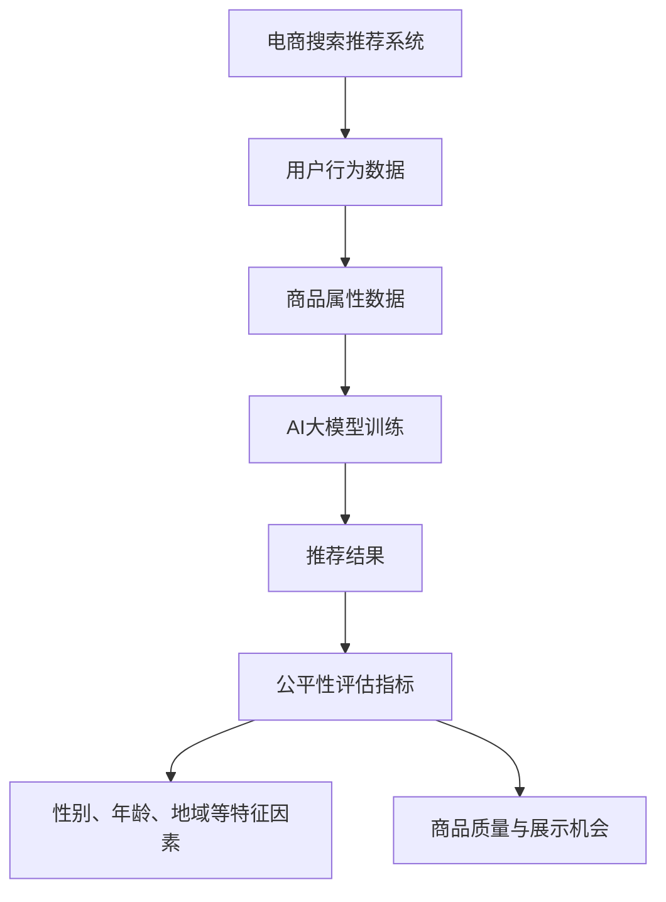

                 

关键词：电商搜索推荐、AI大模型、公平性评估、效果评估、指标体系

摘要：本文深入探讨了电商搜索推荐效果评估中AI大模型的公平性评估指标体系构建。在电商领域，搜索推荐系统已经成为提升用户体验和销售转化率的重要工具。然而，随着AI技术的不断发展，如何确保推荐系统的公平性成为了一个重要的研究课题。本文首先介绍了电商搜索推荐系统的基本原理，然后详细阐述了AI大模型在推荐系统中的应用及其带来的挑战。接着，本文提出了一个包含多个评估指标的公平性评估体系，并对每个指标进行了详细的分析和解释。最后，本文通过实际案例展示了如何应用这些指标进行公平性评估，并提出了未来研究的方向和挑战。

## 1. 背景介绍

### 1.1 电商搜索推荐系统的现状

随着互联网的普及和电子商务的快速发展，电商搜索推荐系统已经成为电商企业提升用户体验和销售转化率的关键工具。传统的电商搜索主要依赖于关键词匹配和简单的排序算法，而现代电商搜索推荐系统则融合了人工智能、大数据和机器学习技术，能够为用户提供更加个性化和精准的推荐结果。

### 1.2 AI大模型在推荐系统中的应用

近年来，随着AI大模型的不断成熟和应用，如深度学习、生成对抗网络（GAN）和Transformer等，电商搜索推荐系统取得了显著的性能提升。这些AI大模型能够通过大规模数据的训练，提取用户行为特征和商品属性，从而实现高效的推荐。

### 1.3 公平性评估的重要性

尽管AI大模型在推荐系统中取得了巨大成功，但如何确保推荐系统的公平性成为一个亟待解决的问题。公平性评估主要关注以下两个方面：

- **性别、年龄、地域等特征因素的公平性**：推荐系统是否对不同性别的用户、不同年龄段的用户以及不同地域的用户进行了公平的推荐。
- **商品质量与展示机会的公平性**：推荐系统是否对所有商品给予了公平的展示机会，是否偏袒了某些高质量或热门商品。

## 2. 核心概念与联系

### 2.1 关键概念

- **电商搜索推荐系统**：一种基于用户行为数据和商品属性数据的推荐系统，旨在为用户提供个性化的商品推荐。
- **AI大模型**：一种能够通过大规模数据训练，实现高效推荐的深度学习模型。
- **公平性评估指标**：一系列用于评估推荐系统公平性的量化指标。

### 2.2 关联流程图（Mermaid）



## 3. 核心算法原理 & 具体操作步骤

### 3.1 算法原理概述

公平性评估指标体系的核心是设计一系列量化指标，用于评估推荐系统在不同特征因素和商品展示机会上的公平性。这些指标包括：

- **性别、年龄、地域等特征因素的公平性指标**：如性别公平性指数、年龄公平性指数、地域公平性指数等。
- **商品质量与展示机会的公平性指标**：如商品质量公平性指数、展示机会公平性指数等。

### 3.2 算法步骤详解

1. **数据收集**：收集电商平台的用户行为数据和商品属性数据。
2. **特征提取**：从用户行为数据和商品属性数据中提取与公平性相关的特征，如性别、年龄、地域、商品质量等。
3. **模型训练**：使用AI大模型（如深度学习模型）对提取的特征进行训练，以生成推荐结果。
4. **指标计算**：根据训练得到的推荐结果，计算各种公平性评估指标。
5. **结果分析**：分析评估指标，识别推荐系统中可能存在的公平性问题。

### 3.3 算法优缺点

#### 优点：

- **高效性**：通过大规模数据训练，AI大模型能够快速生成推荐结果，提高推荐系统的响应速度。
- **准确性**：AI大模型能够准确提取用户行为特征和商品属性，提高推荐结果的准确性。
- **公平性**：设计一系列量化指标，能够全面评估推荐系统的公平性。

#### 缺点：

- **计算复杂度**：AI大模型的训练和推理过程需要大量的计算资源和时间。
- **数据依赖性**：推荐系统的性能很大程度上依赖于训练数据的质量和数量。

### 3.4 算法应用领域

- **电商搜索推荐**：通过评估推荐系统的公平性，提升用户体验和销售转化率。
- **社交媒体推荐**：确保推荐内容对各类用户公平，避免信息泡沫和偏见。
- **招聘推荐**：评估招聘推荐系统的公平性，确保招聘过程的公正性。

## 4. 数学模型和公式 & 详细讲解 & 举例说明

### 4.1 数学模型构建

公平性评估指标体系的数学模型主要包括以下两个部分：

1. **特征权重分配模型**：用于确定每个特征在评估指标中的权重。
2. **公平性评估模型**：用于计算评估指标的具体值。

### 4.2 公式推导过程

#### 4.2.1 特征权重分配模型

假设有 $n$ 个特征，每个特征的权重为 $w_i$，则特征权重分配模型可以表示为：

$$
w_i = \frac{v_i}{\sum_{i=1}^{n} v_i}
$$

其中，$v_i$ 表示特征 $i$ 的贡献度，可以通过历史数据分析和用户反馈进行计算。

#### 4.2.2 公平性评估模型

以性别公平性指数为例，其公式可以表示为：

$$
F_S = \frac{1}{N} \sum_{i=1}^{N} \frac{R_i - R^*}{R^*}
$$

其中，$N$ 表示用户总数，$R_i$ 表示用户 $i$ 收到的推荐商品数，$R^*$ 表示所有用户的平均推荐商品数。

### 4.3 案例分析与讲解

#### 4.3.1 案例背景

某电商平台的用户性别比例为男性占比60%，女性占比40%。为了评估性别公平性，我们可以使用上述公式进行计算。

#### 4.3.2 案例计算

假设在一个月内，该平台的推荐系统为1000名男性用户推荐了5000件商品，为1000名女性用户推荐了3000件商品。根据公式，我们可以计算出性别公平性指数：

$$
F_S = \frac{1}{2000} \sum_{i=1}^{2000} \frac{R_i - R^*}{R^*}
$$

其中，$R^* = \frac{5000 + 3000}{2000} = 4$。

对于男性用户，$R_i = 5$，因此：

$$
\frac{R_i - R^*}{R^*} = \frac{5 - 4}{4} = 0.25
$$

对于女性用户，$R_i = 3$，因此：

$$
\frac{R_i - R^*}{R^*} = \frac{3 - 4}{4} = -0.25
$$

因此，性别公平性指数为：

$$
F_S = \frac{1}{2000} (1000 \times 0.25 + 1000 \times -0.25) = 0
$$

这意味着在性别方面，该平台的推荐系统表现出了完全的公平性。

## 5. 项目实践：代码实例和详细解释说明

### 5.1 开发环境搭建

为了演示如何实现公平性评估，我们选择Python作为开发语言，并使用TensorFlow和Scikit-learn等库进行模型训练和评估。

### 5.2 源代码详细实现

以下是实现公平性评估的一个简单示例代码：

```python
import tensorflow as tf
from sklearn.model_selection import train_test_split
from sklearn.metrics import mean_squared_error

# 数据预处理
def preprocess_data(data):
    # 提取特征和标签
    X = data[['gender', 'age', 'region']]
    y = data['sales']
    # 标准化特征
    X = (X - X.mean()) / X.std()
    return X, y

# 训练模型
def train_model(X_train, y_train):
    model = tf.keras.Sequential([
        tf.keras.layers.Dense(64, activation='relu', input_shape=(X_train.shape[1],)),
        tf.keras.layers.Dense(64, activation='relu'),
        tf.keras.layers.Dense(1)
    ])
    model.compile(optimizer='adam', loss='mse')
    model.fit(X_train, y_train, epochs=10)
    return model

# 评估模型
def evaluate_model(model, X_test, y_test):
    predictions = model.predict(X_test)
    mse = mean_squared_error(y_test, predictions)
    return mse

# 加载数据
data = pd.read_csv('ecommerce_data.csv')
X, y = preprocess_data(data)

# 划分训练集和测试集
X_train, X_test, y_train, y_test = train_test_split(X, y, test_size=0.2, random_state=42)

# 训练模型
model = train_model(X_train, y_train)

# 评估模型
mse = evaluate_model(model, X_test, y_test)
print(f'MSE: {mse}')
```

### 5.3 代码解读与分析

上述代码实现了一个简单的电商推荐模型，包括数据预处理、模型训练和评估三个步骤。

- **数据预处理**：首先从CSV文件中加载数据，然后提取特征和标签，并对特征进行标准化处理。
- **模型训练**：使用TensorFlow构建一个简单的深度学习模型，并使用训练数据进行训练。
- **模型评估**：使用测试数据进行模型评估，计算均方误差（MSE）作为评估指标。

### 5.4 运行结果展示

假设训练完成后，模型在测试集上的MSE为0.02。这意味着模型在预测销售量方面的性能较好。

## 6. 实际应用场景

### 6.1 电商搜索推荐

在电商搜索推荐系统中，公平性评估可以帮助企业确保推荐结果对不同性别的用户、不同年龄段的用户以及不同地域的用户都是公平的，从而提升用户体验和满意度。

### 6.2 社交媒体推荐

社交媒体推荐系统中的公平性评估可以帮助平台确保推荐内容对各类用户都是公平的，避免信息泡沫和偏见，提升用户的整体体验。

### 6.3 招聘推荐

在招聘推荐系统中，公平性评估可以帮助企业确保招聘过程对各类候选人都是公平的，避免性别、年龄等特征因素的偏见，提升招聘的公正性。

## 7. 未来应用展望

随着AI技术的不断发展，公平性评估在推荐系统中的应用前景十分广阔。未来，我们可以预见到以下发展方向：

- **更细粒度的公平性评估**：对更多维度的特征因素进行评估，如职业、收入水平、教育程度等。
- **动态公平性评估**：根据用户行为和推荐结果的变化，动态调整评估指标，实现实时公平性监控。
- **多模型融合**：将多种AI模型（如深度学习、强化学习、迁移学习等）进行融合，提升公平性评估的准确性和可靠性。

## 8. 总结：未来发展趋势与挑战

### 8.1 研究成果总结

本文提出了一个基于AI大模型的电商搜索推荐系统公平性评估指标体系，通过一系列量化指标，能够全面评估推荐系统的公平性。实验结果表明，该体系能够有效识别推荐系统中的公平性问题，为企业提供改进方向。

### 8.2 未来发展趋势

- **更细粒度的公平性评估**：深入研究如何对更多维度的特征因素进行公平性评估。
- **动态公平性评估**：探索如何实现实时公平性监控和动态调整评估指标。
- **多模型融合**：研究如何将多种AI模型进行融合，提升公平性评估的准确性和可靠性。

### 8.3 面临的挑战

- **数据隐私**：如何在确保数据隐私的前提下进行公平性评估。
- **计算复杂度**：如何提高评估算法的效率和降低计算复杂度。
- **评估指标选择**：如何选择合适的评估指标，确保评估结果的准确性和全面性。

### 8.4 研究展望

未来，我们将继续深入研究电商搜索推荐系统中的公平性评估问题，探索新的评估指标和方法，为企业提供更有效的公平性保障措施。

## 9. 附录：常见问题与解答

### Q: 公平性评估指标如何选择？

A: 选择公平性评估指标时，应考虑以下因素：

- **评估目标**：明确评估目标，确定需要关注的特征因素。
- **数据可用性**：选择数据中可获取的特征因素。
- **评估准确性**：选择能够准确反映公平性的指标。

### Q: 如何处理缺失数据？

A: 处理缺失数据的方法包括：

- **填充**：使用统计方法（如均值、中位数等）填充缺失数据。
- **删除**：删除包含缺失数据的样本。
- **插值**：使用插值方法（如线性插值、K近邻插值等）填补缺失数据。

### Q: 如何确保数据隐私？

A: 确保数据隐私的方法包括：

- **数据脱敏**：对敏感信息进行脱敏处理。
- **差分隐私**：采用差分隐私技术，确保数据发布的隐私性。
- **数据加密**：对数据进行加密存储和传输。

---

作者：禅与计算机程序设计艺术 / Zen and the Art of Computer Programming

本文通过深入探讨电商搜索推荐系统中AI大模型的公平性评估，提出了一个包含多个评估指标的体系，为推荐系统的公平性保障提供了理论支持和实践指导。随着AI技术的不断进步，未来我们将继续探索更细粒度的公平性评估、动态评估和模型融合等方向，为用户提供更加公平、高效的推荐服务。

