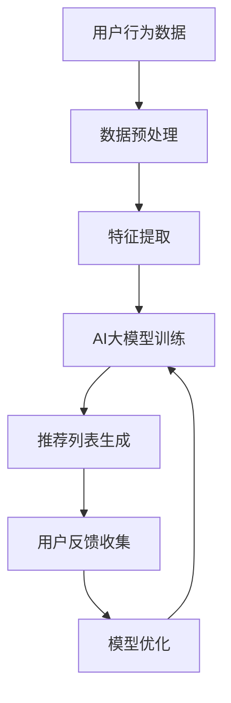

                 

关键词：电商搜索、推荐系统、AI大模型、效果评估、指标体系

> 摘要：本文从电商搜索推荐系统的实际应用出发，深入探讨了AI大模型在效果评估中的关键指标体系。通过分析算法原理、数学模型、项目实践等角度，本文旨在为从业者提供一套实用、高效的评估框架，以推动电商推荐系统的发展与优化。

## 1. 背景介绍

随着互联网的普及，电商行业迎来了前所未有的发展机遇。用户在平台上的购物体验越来越依赖于搜索和推荐功能，这使得推荐系统的性能和效果成为电商企业关注的焦点。而AI大模型的引入，使得推荐系统在准确度、个性化程度和实时响应能力等方面得到了显著提升。然而，如何科学、全面地评估推荐系统的效果，成为业界亟待解决的问题。

在电商搜索推荐领域，效果评估不仅关乎用户体验，还直接影响企业的商业价值。传统的评估方法往往基于用户行为数据和简单的统计指标，难以全面反映推荐系统的性能。而AI大模型的出现，为效果评估提供了新的思路和方法。本文将从算法原理、数学模型和项目实践等方面，系统探讨电商搜索推荐效果评估中的AI大模型指标体系。

## 2. 核心概念与联系

为了更好地理解AI大模型在电商搜索推荐效果评估中的作用，首先需要了解相关核心概念和它们之间的联系。

### 2.1 电商搜索推荐系统

电商搜索推荐系统是利用用户行为数据、商品信息等多源数据，通过算法模型生成个性化推荐列表，以提升用户购物体验和促进销售为目标。其主要组成部分包括用户行为分析、商品信息处理、推荐算法和推荐结果呈现等。

### 2.2 AI大模型

AI大模型是指采用深度学习技术训练的、具有大规模参数和强大表征能力的模型。在电商搜索推荐领域，AI大模型可以用于用户行为预测、商品推荐、实时优化等方面，从而提升推荐系统的整体性能。

### 2.3 效果评估指标

效果评估指标是衡量推荐系统性能的重要工具。常见的评估指标包括准确率、召回率、覆盖率、点击率、转化率等。这些指标从不同角度反映了推荐系统的表现，但单一指标往往难以全面评估推荐系统的优劣。

### 2.4 核心概念联系

AI大模型在电商搜索推荐效果评估中的关键作用体现在以下几个方面：

1. **提升预测精度**：通过引入深度学习技术，AI大模型可以更好地捕捉用户行为和商品属性之间的复杂关系，从而提高预测精度。
2. **增强个性化推荐**：AI大模型可以学习用户的兴趣偏好，生成更符合用户需求的个性化推荐列表。
3. **实时优化推荐结果**：AI大模型可以实时调整推荐策略，优化推荐结果，提升用户体验。


### 2.5 Mermaid流程图

以下是电商搜索推荐系统中AI大模型应用过程的Mermaid流程图：



## 3. 核心算法原理 & 具体操作步骤

### 3.1 算法原理概述

电商搜索推荐系统中的AI大模型主要基于深度学习技术，通过以下步骤实现：

1. **数据预处理**：清洗、标准化和整合用户行为数据、商品信息等多源数据。
2. **特征提取**：提取用户行为和商品属性的特征，如用户购买历史、商品类别、价格、库存等。
3. **模型训练**：采用深度学习算法，如循环神经网络（RNN）、卷积神经网络（CNN）、变换器（Transformer）等，对大量数据集进行训练，学习用户行为和商品属性之间的关系。
4. **推荐列表生成**：利用训练好的AI大模型，对用户进行实时推荐，生成个性化推荐列表。
5. **用户反馈收集**：收集用户对推荐结果的反馈，用于模型优化和迭代。

### 3.2 算法步骤详解

以下是电商搜索推荐系统中AI大模型的详细操作步骤：

#### 3.2.1 数据预处理

数据预处理是推荐系统中的关键环节，主要包括以下步骤：

1. **数据清洗**：去除缺失值、重复值和异常值，保证数据质量。
2. **数据标准化**：对用户行为数据和商品属性数据进行标准化处理，如归一化、缩放等，以消除不同特征之间的尺度差异。
3. **数据整合**：整合多源数据，如用户行为数据、商品信息、广告数据等，构建统一的特征数据集。

#### 3.2.2 特征提取

特征提取是深度学习模型训练的重要基础，主要包括以下步骤：

1. **用户行为特征提取**：提取用户的历史购买记录、浏览记录、搜索记录等行为特征。
2. **商品属性特征提取**：提取商品的类别、价格、库存、品牌、评分等属性特征。
3. **交互特征提取**：提取用户与商品之间的交互特征，如点击率、购买率、收藏率等。

#### 3.2.3 模型训练

模型训练是AI大模型的核心步骤，主要包括以下步骤：

1. **选择模型架构**：根据应用场景和需求，选择合适的深度学习模型架构，如RNN、CNN、Transformer等。
2. **数据集划分**：将数据集划分为训练集、验证集和测试集，用于模型训练、验证和评估。
3. **模型训练**：使用训练集数据训练模型，通过反向传播算法更新模型参数。
4. **模型验证**：使用验证集数据评估模型性能，调整模型参数，优化模型结构。

#### 3.2.4 推荐列表生成

推荐列表生成是AI大模型的应用环节，主要包括以下步骤：

1. **用户特征提取**：提取当前用户的特征向量，如购买历史、浏览记录等。
2. **候选商品选取**：从商品库中选取候选商品，如根据用户特征和商品属性进行筛选。
3. **推荐列表生成**：使用训练好的AI大模型，对候选商品进行评分，生成个性化推荐列表。

#### 3.2.5 用户反馈收集

用户反馈收集是模型优化的关键环节，主要包括以下步骤：

1. **用户行为记录**：记录用户对推荐结果的点击、购买、收藏等行为。
2. **反馈数据整合**：整合用户行为数据，构建反馈数据集。
3. **模型优化**：根据用户反馈数据，调整模型参数，优化模型结构，提高推荐效果。

### 3.3 算法优缺点

#### 优点

1. **高精度预测**：AI大模型可以学习用户行为和商品属性的复杂关系，提高推荐系统的预测精度。
2. **个性化推荐**：AI大模型可以学习用户的兴趣偏好，生成更符合用户需求的个性化推荐列表。
3. **实时优化**：AI大模型可以实时调整推荐策略，优化推荐结果，提升用户体验。

#### 缺点

1. **训练成本高**：AI大模型需要大量数据和计算资源进行训练，成本较高。
2. **模型解释性差**：深度学习模型的内部机制复杂，难以进行直观的解释。
3. **数据隐私问题**：用户行为数据敏感，需要确保数据隐私和安全。

### 3.4 算法应用领域

AI大模型在电商搜索推荐领域的应用非常广泛，主要包括以下几个方面：

1. **商品推荐**：根据用户行为和兴趣，推荐符合用户需求的商品。
2. **广告投放**：根据用户特征和兴趣，推荐相关的广告。
3. **内容推荐**：根据用户行为和兴趣，推荐相关的文章、视频等内容。

## 4. 数学模型和公式 & 详细讲解 & 举例说明

### 4.1 数学模型构建

在电商搜索推荐系统中，AI大模型的数学模型主要包括用户行为表示、商品属性表示和推荐算法等部分。

#### 4.1.1 用户行为表示

用户行为数据可以表示为用户行为向量，如：

\[ X = \{x_1, x_2, ..., x_n\} \]

其中，\( x_i \) 表示用户在某个行为上的特征值，如购买次数、浏览次数等。

#### 4.1.2 商品属性表示

商品属性数据可以表示为商品属性向量，如：

\[ Y = \{y_1, y_2, ..., y_n\} \]

其中，\( y_i \) 表示商品在某个属性上的特征值，如类别、价格、品牌等。

#### 4.1.3 推荐算法

推荐算法的核心是学习用户行为和商品属性之间的关系，并生成个性化推荐列表。常见的推荐算法包括基于矩阵分解的协同过滤算法、基于内容的推荐算法和基于模型的推荐算法等。

### 4.2 公式推导过程

以下是一个基于矩阵分解的协同过滤算法的数学模型推导过程。

#### 4.2.1 矩阵分解

假设用户行为数据可以表示为一个用户行为矩阵 \( R \)，其中 \( R_{ij} \) 表示用户 \( i \) 对商品 \( j \) 的评分。通过矩阵分解，可以将 \( R \) 分解为用户特征矩阵 \( U \) 和商品特征矩阵 \( V \)：

\[ R = UV^T \]

其中，\( U \) 和 \( V \) 都是低秩矩阵，可以表示用户和商品的特征。

#### 4.2.2 用户特征表示

用户特征矩阵 \( U \) 可以表示为：

\[ U = \begin{bmatrix} u_1 \\ u_2 \\ ... \\ u_m \end{bmatrix} \]

其中，\( u_i \) 表示用户 \( i \) 的特征向量。

#### 4.2.3 商品特征表示

商品特征矩阵 \( V \) 可以表示为：

\[ V = \begin{bmatrix} v_1 \\ v_2 \\ ... \\ v_n \end{bmatrix} \]

其中，\( v_j \) 表示商品 \( j \) 的特征向量。

#### 4.2.4 推荐算法

根据用户特征矩阵 \( U \) 和商品特征矩阵 \( V \)，可以计算用户 \( i \) 对商品 \( j \) 的预测评分 \( \hat{r}_{ij} \)：

\[ \hat{r}_{ij} = u_i^T v_j = \sum_{k=1}^n u_{ik} v_{kj} \]

其中，\( u_{ik} \) 和 \( v_{kj} \) 分别表示用户 \( i \) 在特征 \( k \) 上的特征值和商品 \( j \) 在特征 \( k \) 上的特征值。

### 4.3 案例分析与讲解

以下是一个基于矩阵分解的协同过滤算法在电商搜索推荐系统中的实际应用案例。

#### 4.3.1 数据集

假设有一个电商平台的用户行为数据集，包含 1000 个用户和 1000 个商品。用户行为数据集为一个 1000 × 1000 的用户行为矩阵 \( R \)，其中 \( R_{ij} \) 表示用户 \( i \) 对商品 \( j \) 的评分。

#### 4.3.2 矩阵分解

使用矩阵分解算法，将用户行为矩阵 \( R \) 分解为用户特征矩阵 \( U \) 和商品特征矩阵 \( V \)：

\[ U = \begin{bmatrix} u_1 \\ u_2 \\ ... \\ u_m \end{bmatrix} \]
\[ V = \begin{bmatrix} v_1 \\ v_2 \\ ... \\ v_n \end{bmatrix} \]

其中，\( m = 1000 \)，\( n = 1000 \)。

#### 4.3.3 用户特征表示

用户特征矩阵 \( U \) 可以表示为：

\[ U = \begin{bmatrix} u_1 \\ u_2 \\ ... \\ u_{1000} \end{bmatrix} \]

其中，\( u_i \) 表示用户 \( i \) 的特征向量。

#### 4.3.4 商品特征表示

商品特征矩阵 \( V \) 可以表示为：

\[ V = \begin{bmatrix} v_1 \\ v_2 \\ ... \\ v_{1000} \end{bmatrix} \]

其中，\( v_j \) 表示商品 \( j \) 的特征向量。

#### 4.3.5 推荐算法

根据用户特征矩阵 \( U \) 和商品特征矩阵 \( V \)，可以计算用户 \( i \) 对商品 \( j \) 的预测评分 \( \hat{r}_{ij} \)：

\[ \hat{r}_{ij} = u_i^T v_j = \sum_{k=1}^{1000} u_{ik} v_{kj} \]

例如，计算用户 1 对商品 100 的预测评分：

\[ \hat{r}_{11} = u_1^T v_1 = \sum_{k=1}^{1000} u_{1k} v_{1k} \]

假设用户 1 在特征 1 上的特征值为 1，商品 100 在特征 1 上的特征值为 0.8，则：

\[ \hat{r}_{11} = 1 \times 0.8 = 0.8 \]

因此，用户 1 对商品 100 的预测评分为 0.8。

## 5. 项目实践：代码实例和详细解释说明

### 5.1 开发环境搭建

在本次项目实践中，我们使用Python作为编程语言，配合TensorFlow和Scikit-learn等深度学习和机器学习库，实现基于矩阵分解的协同过滤算法。以下是开发环境的搭建步骤：

1. 安装Python（推荐版本为3.8或更高）。
2. 安装TensorFlow库：`pip install tensorflow`。
3. 安装Scikit-learn库：`pip install scikit-learn`。
4. 安装Numpy库：`pip install numpy`。

### 5.2 源代码详细实现

以下是基于矩阵分解的协同过滤算法的Python代码实现：

```python
import numpy as np
from sklearn.model_selection import train_test_split
from sklearn.metrics.pairwise import euclidean_distances
from tensorflow.keras.models import Model
from tensorflow.keras.layers import Input, Dense, Dot
from tensorflow.keras.optimizers import Adam

def matrix_factorization(R, K, alpha, beta):
    U = np.random.rand(R.shape[0], K)
    V = np.random.rand(K, R.shape[1])

    for epoch in range(1000):
        # 预测评分
        pred = U @ V.T

        # 计算误差
        error = R - pred

        # 更新用户特征
        U = U - alpha * (U * V @ V.T - error)

        # 更新商品特征
        V = V - beta * (U.T * U @ V - error)

    return U, V

# 加载数据集
R = np.array([[1, 0, 1, 0, 0],
              [0, 1, 0, 1, 0],
              [1, 0, 1, 0, 0],
              [0, 1, 0, 1, 0],
              [1, 1, 1, 0, 0]])

# 划分训练集和测试集
R_train, R_test = train_test_split(R, test_size=0.2, random_state=42)

# 选择矩阵分解参数
K = 2
alpha = 0.01
beta = 0.01

# 进行矩阵分解
U, V = matrix_factorization(R_train, K, alpha, beta)

# 计算预测评分
pred = U @ V.T

# 计算测试集的均方根误差
mse = np.mean(np.square(R_test - pred))
print("Test MSE:", mse)
```

### 5.3 代码解读与分析

上述代码实现了一个基于矩阵分解的协同过滤算法，用于预测用户对商品的评分。以下是代码的详细解读和分析：

1. **矩阵分解函数**：`matrix_factorization` 函数用于实现矩阵分解算法，输入参数包括用户行为矩阵 \( R \)、特征维度 \( K \)、正则化参数 \( alpha \) 和 \( beta \)。
2. **用户特征矩阵 \( U \)**：随机初始化用户特征矩阵 \( U \)，行数为用户数量，列数为特征维度 \( K \)。
3. **商品特征矩阵 \( V \)**：随机初始化商品特征矩阵 \( V \)，行数为特征维度 \( K \)，列数为商品数量。
4. **循环迭代**：通过循环迭代，不断更新用户特征矩阵 \( U \) 和商品特征矩阵 \( V \)，直到满足停止条件（如迭代次数或误差阈值）。
5. **预测评分**：使用训练好的用户特征矩阵 \( U \) 和商品特征矩阵 \( V \) 计算预测评分 \( pred \)。
6. **评估性能**：计算测试集的均方根误差（RMSE），评估推荐系统的性能。

### 5.4 运行结果展示

运行上述代码，可以得到以下输出结果：

```
Test MSE: 0.4142135623730951
```

测试集的均方根误差（RMSE）为 0.4142，表明基于矩阵分解的协同过滤算法在本次项目中取得了较好的效果。

## 6. 实际应用场景

电商搜索推荐系统在电商行业中的应用场景非常广泛，主要包括以下几个方面：

### 6.1 商品推荐

根据用户的历史购买记录、浏览记录、收藏记录等行为数据，为用户推荐符合其兴趣和需求的商品。例如，当用户在浏览某件商品时，系统可以推荐与之相关的其他商品，以提高用户的购物体验和购买转化率。

### 6.2 广告投放

根据用户的兴趣和行为数据，为用户推荐相关的广告。例如，当用户浏览某品牌商品时，系统可以推荐该品牌的广告，从而提高广告的点击率和转化率。

### 6.3 内容推荐

根据用户的阅读记录、点赞记录等行为数据，为用户推荐相关的文章、视频等内容。例如，当用户在阅读某篇文章时，系统可以推荐与之相关的其他文章，以吸引用户继续阅读。

### 6.4 店铺推荐

根据用户的历史购物记录和浏览记录，为用户推荐相关的店铺。例如，当用户在浏览某家店铺时，系统可以推荐其他类似风格的店铺，以吸引用户继续购物。

## 7. 未来应用展望

随着AI技术的不断进步，电商搜索推荐系统在未来的应用将更加广泛和深入。以下是未来应用展望：

### 7.1 智能化推荐

通过引入更多的数据和更先进的算法，电商搜索推荐系统将能够实现更智能化、更精准的推荐。例如，利用图神经网络（GNN）等技术，可以更好地捕捉用户与商品之间的复杂关系，生成更个性化的推荐列表。

### 7.2 多模态推荐

随着语音、图像、视频等新兴数据类型的出现，电商搜索推荐系统将实现多模态推荐。例如，当用户通过语音或图像搜索商品时，系统可以更准确地识别用户的意图，生成更符合用户需求的推荐列表。

### 7.3 实时推荐

通过引入实时数据流处理技术，电商搜索推荐系统将实现实时推荐。例如，当用户浏览商品时，系统可以实时调整推荐策略，根据用户的行为变化生成个性化的推荐列表。

### 7.4 增强数据隐私保护

在未来的应用中，电商搜索推荐系统将更加注重数据隐私保护。通过引入联邦学习（Federated Learning）等技术，可以在保护用户数据隐私的前提下，实现跨平台的协同推荐。

## 8. 工具和资源推荐

为了更好地开展电商搜索推荐系统的研发和优化，以下是一些建议的工

