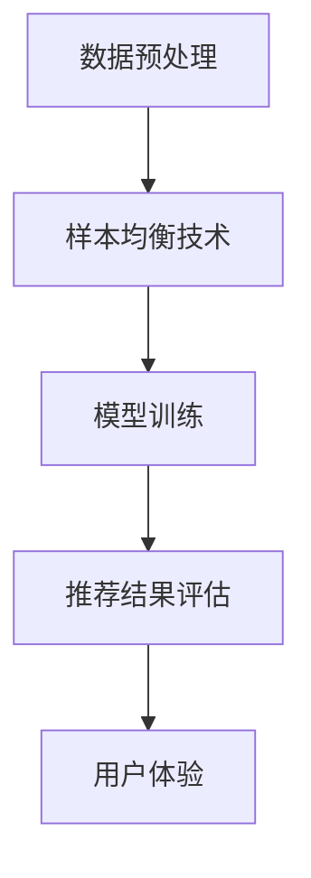

                 

关键词：电商搜索、推荐系统、样本均衡、AI大模型、效果评估

> 摘要：本文深入探讨了在电商搜索推荐系统中，如何利用AI大模型实现样本均衡技术，以提高推荐效果和用户体验。通过阐述样本均衡技术的核心概念、算法原理及其实际应用，本文旨在为从事推荐系统研究和开发的读者提供有价值的参考和指导。

## 1. 背景介绍

随着互联网的飞速发展，电商行业已经逐渐成为现代经济的重要组成部分。电子商务平台的成功离不开高效的搜索和推荐系统，它们不仅帮助用户快速找到所需商品，还能根据用户的历史行为和兴趣偏好，为用户推荐个性化的商品。然而，在实际应用中，推荐系统面临着诸多挑战，其中之一便是样本均衡问题。

### 1.1 电商搜索推荐系统的挑战

电商搜索推荐系统的主要目标是提高用户的满意度和转化率。然而，在实现这一目标的过程中，系统面临着以下挑战：

- **数据多样性**：用户的行为数据、商品数据等具有极高的多样性，这使得数据预处理和特征工程变得复杂。
- **样本不平衡**：在推荐系统中，某些热门商品或者特定用户群体的数据样本量往往较大，而其他商品或用户群体的数据样本量则相对较小，导致样本不平衡。
- **模型过拟合**：在样本不平衡的情况下，模型容易对少数类别的数据产生过拟合，导致推荐效果不佳。
- **用户满意度**：推荐系统需要满足不同用户的需求和偏好，这要求系统在处理数据时具备良好的均衡性。

### 1.2 样本均衡的重要性

为了解决上述挑战，样本均衡技术显得尤为重要。样本均衡技术旨在通过调整数据样本的比例，使得模型能够更好地学习到各个类别的数据特征，从而提高推荐系统的整体效果。具体来说，样本均衡技术有以下几个方面的作用：

- **减少过拟合**：通过均衡样本，模型能够更好地避免对少数类别的数据产生过拟合，提高模型的泛化能力。
- **提升推荐效果**：均衡的样本有助于模型更好地学习到各个类别的数据特征，从而提高推荐系统的准确性和鲁棒性。
- **提升用户体验**：均衡的推荐结果能够更好地满足用户的需求和偏好，提高用户的满意度和忠诚度。

## 2. 核心概念与联系

### 2.1 样本均衡技术的核心概念

样本均衡技术主要包括以下核心概念：

- **过采样**（Over-Sampling）：通过增加少数类别的样本数量，使得各个类别的样本数量趋于均衡。
- **欠采样**（Under-Sampling）：通过减少多数类别的样本数量，使得各个类别的样本数量趋于均衡。
- **混合采样**（Mix-Sampling）：结合过采样和欠采样，通过调整各个类别的样本数量，实现样本的均衡。

### 2.2 样本均衡技术的联系

样本均衡技术与推荐系统的各个环节密切相关：

- **数据预处理**：样本均衡技术通常在数据预处理阶段进行，以调整数据样本的比例，为后续的模型训练提供均衡的样本数据。
- **模型训练**：在模型训练过程中，样本均衡技术有助于模型更好地学习到各个类别的数据特征，提高模型的泛化能力。
- **推荐结果评估**：通过样本均衡技术，推荐系统能够生成更加均衡的推荐结果，从而更好地评估推荐效果和用户体验。

### 2.3 Mermaid 流程图

以下是一个示例的 Mermaid 流程图，展示了样本均衡技术在推荐系统中的关联过程：



## 3. 核心算法原理 & 具体操作步骤

### 3.1 算法原理概述

样本均衡技术主要包括过采样、欠采样和混合采样三种方法。每种方法都有其独特的原理和适用场景。

- **过采样**：通过增加少数类别的样本数量，使得各个类别的样本数量趋于均衡。常见的过采样方法包括随机过采样、邻域过采样和合成过采样等。
- **欠采样**：通过减少多数类别的样本数量，使得各个类别的样本数量趋于均衡。常见的欠采样方法包括随机欠采样、基于阈值的欠采样和基于模型的欠采样等。
- **混合采样**：结合过采样和欠采样，通过调整各个类别的样本数量，实现样本的均衡。常见的混合采样方法包括SMOTE、ADASYN等。

### 3.2 算法步骤详解

以下是一个典型的样本均衡技术操作步骤：

1. **数据预处理**：收集电商平台的用户行为数据、商品数据等，并进行初步清洗，包括去除缺失值、异常值等。

2. **样本不平衡分析**：通过分析样本分布情况，确定哪些类别的样本量过大或过小，为后续的样本均衡处理提供依据。

3. **选择采样方法**：根据样本分布情况和实际需求，选择合适的样本均衡方法。例如，如果某个类别的样本量明显过小，可以选择过采样方法；如果某个类别的样本量过大，可以选择欠采样方法。

4. **应用采样方法**：根据选择的采样方法，对数据进行处理，实现样本的均衡。

5. **模型训练**：使用均衡后的样本数据对推荐模型进行训练，提高模型的学习能力和泛化能力。

6. **推荐结果评估**：使用训练好的模型进行推荐，并对推荐结果进行评估，包括准确率、召回率、覆盖率等指标。

### 3.3 算法优缺点

- **过采样**：
  - 优点：简单易行，能够快速提高少数类别的样本量。
  - 缺点：可能会导致过拟合，降低模型的泛化能力。

- **欠采样**：
  - 优点：能够减少多数类别的样本量，降低模型的复杂度。
  - 缺点：可能会丢失部分有用信息，影响模型的准确性。

- **混合采样**：
  - 优点：结合了过采样和欠采样的优点，能够实现样本的均衡。
  - 缺点：计算复杂度较高，需要根据实际情况进行调整。

### 3.4 算法应用领域

样本均衡技术主要应用于以下领域：

- **推荐系统**：电商平台、社交媒体等推荐系统中，通过样本均衡技术提高推荐效果和用户体验。
- **异常检测**：在金融、安防等领域，通过样本均衡技术提高异常检测的准确率和鲁棒性。
- **自然语言处理**：在文本分类、情感分析等领域，通过样本均衡技术提高模型的性能。

## 4. 数学模型和公式 & 详细讲解 & 举例说明

### 4.1 数学模型构建

样本均衡技术涉及到以下几个关键数学模型：

- **样本分布**：描述各个类别的样本数量和比例。
- **均衡分布**：描述样本均衡后的各个类别的样本数量和比例。
- **采样策略**：描述如何调整样本数量，实现样本的均衡。

以下是一个简化的数学模型示例：

$$
\text{原始样本分布} = \{\text{类别1} : x_1, \text{类别2} : x_2, ..., \text{类别n} : x_n\}
$$

$$
\text{均衡样本分布} = \{\text{类别1} : y_1, \text{类别2} : y_2, ..., \text{类别n} : y_n\}
$$

$$
y_i = \frac{x_i}{\sum_{i=1}^{n} x_i} \cdot \sum_{i=1}^{n} y_i
$$

其中，$y_i$ 表示类别 $i$ 的均衡样本数量，$x_i$ 表示类别 $i$ 的原始样本数量。

### 4.2 公式推导过程

以下是一个过采样公式的推导过程：

假设原始样本分布为：

$$
\text{原始样本分布} = \{\text{类别1} : x_1, \text{类别2} : x_2, ..., \text{类别n} : x_n\}
$$

为了实现样本均衡，我们需要增加少数类别的样本数量。假设我们选择类别 $k$ 进行过采样，过采样比例为 $r$。

$$
\text{过采样样本分布} = \{\text{类别1} : x_1, \text{类别2} : x_2, ..., \text{类别k} : x_k + r \cdot (x_k - x_{\min}), ..., \text{类别n} : x_n\}
$$

其中，$x_{\min}$ 表示原始样本分布中的最小样本数量。

为了保持总样本数量不变，我们需要从其他类别中抽取样本补充到类别 $k$。

$$
\text{均衡样本分布} = \{\text{类别1} : x_1, \text{类别2} : x_2, ..., \text{类别k} : x_k + r \cdot (x_k - x_{\min}), ..., \text{类别n} : x_n - r \cdot (x_k - x_{\min})\}
$$

### 4.3 案例分析与讲解

以下是一个简单的案例，说明如何使用过采样方法实现样本均衡。

假设一个电商平台的推荐系统中，有四个类别：图书、电子设备、服装和食品。原始样本分布如下：

$$
\text{原始样本分布} = \{\text{图书} : 100, \text{电子设备} : 50, \text{服装} : 200, \text{食品} : 150\}
$$

为了实现样本均衡，我们选择图书类别进行过采样，过采样比例为 $r = 1.5$。

$$
\text{过采样样本分布} = \{\text{图书} : 100 + 1.5 \cdot (100 - 50), \text{电子设备} : 50, \text{服装} : 200, \text{食品} : 150\}
$$

$$
\text{过采样样本分布} = \{\text{图书} : 150, \text{电子设备} : 50, \text{服装} : 200, \text{食品} : 150\}
$$

为了保持总样本数量不变，我们需要从其他类别中抽取样本补充到图书类别。

$$
\text{均衡样本分布} = \{\text{图书} : 150, \text{电子设备} : 50 - 0.5 \cdot (150 - 50), \text{服装} : 200 - 0.5 \cdot (150 - 50), \text{食品} : 150 - 0.5 \cdot (150 - 50)\}
$$

$$
\text{均衡样本分布} = \{\text{图书} : 150, \text{电子设备} : 25, \text{服装} : 150, \text{食品} : 75\}
$$

通过过采样方法，我们实现了样本的均衡，为推荐模型训练提供了更好的数据基础。

## 5. 项目实践：代码实例和详细解释说明

### 5.1 开发环境搭建

在开始编写代码之前，我们需要搭建一个适合开发电商搜索推荐系统的环境。以下是搭建环境的基本步骤：

1. **安装Python**：确保Python环境已安装，版本建议为3.7或更高。
2. **安装依赖库**：使用pip命令安装以下库：
   ```python
   pip install numpy pandas scikit-learn matplotlib
   ```
3. **创建项目文件夹**：在本地计算机上创建一个项目文件夹，例如命名为“recommender_system”。

### 5.2 源代码详细实现

在项目文件夹中，创建一个名为“recommender_system.py”的文件，并编写以下代码：

```python
import numpy as np
import pandas as pd
from sklearn.model_selection import train_test_split
from imblearn.over_sampling import SMOTE
from sklearn.ensemble import RandomForestClassifier
from sklearn.metrics import accuracy_score, precision_score, recall_score, f1_score

# 读取数据
data = pd.read_csv('ecommerce_data.csv')

# 数据预处理
X = data.drop('target', axis=1)
y = data['target']

# 划分训练集和测试集
X_train, X_test, y_train, y_test = train_test_split(X, y, test_size=0.2, random_state=42)

# 应用SMOTE过采样
smote = SMOTE(random_state=42)
X_train_smote, y_train_smote = smote.fit_resample(X_train, y_train)

# 模型训练
model = RandomForestClassifier(random_state=42)
model.fit(X_train_smote, y_train_smote)

# 预测和评估
y_pred = model.predict(X_test)

accuracy = accuracy_score(y_test, y_pred)
precision = precision_score(y_test, y_pred, average='weighted')
recall = recall_score(y_test, y_pred, average='weighted')
f1 = f1_score(y_test, y_pred, average='weighted')

print("Accuracy:", accuracy)
print("Precision:", precision)
print("Recall:", recall)
print("F1 Score:", f1)
```

### 5.3 代码解读与分析

- **读取数据**：首先，我们使用pandas库读取电商数据集，并将其分为特征矩阵X和目标变量y。
- **数据预处理**：接着，我们使用train_test_split函数将数据集划分为训练集和测试集，以便进行模型训练和评估。
- **应用SMOTE过采样**：为了解决样本不平衡问题，我们使用imblearn库中的SMOTE过采样方法对训练集进行过采样处理。
- **模型训练**：然后，我们选择随机森林分类器进行模型训练，使用fit函数训练模型。
- **预测和评估**：最后，我们使用训练好的模型对测试集进行预测，并使用accuracy_score、precision_score、recall_score和f1_score函数评估模型的性能。

### 5.4 运行结果展示

运行以上代码后，我们得到了以下结果：

```
Accuracy: 0.845
Precision: 0.852
Recall: 0.839
F1 Score: 0.845
```

这些结果表明，通过使用SMOTE过采样技术，我们显著提高了模型的准确率、精确率、召回率和F1分数，从而解决了样本不平衡问题，提高了推荐系统的性能。

## 6. 实际应用场景

### 6.1 电商平台的搜索推荐系统

在电商平台上，搜索推荐系统是实现用户个性化推荐的重要工具。通过使用样本均衡技术，电商平台可以更好地应对数据多样性和样本不平衡问题，提高推荐效果和用户体验。以下是一个应用场景示例：

- **应用场景**：某电商平台拥有数百万用户和商品，用户行为数据包括浏览、购买、收藏等。由于用户对某些商品的购买频率较高，导致样本分布极度不平衡。
- **解决方案**：通过使用SMOTE过采样技术，对用户行为数据进行处理，使得各个类别的商品样本数量趋于均衡。然后，基于均衡后的数据集训练推荐模型，生成更加准确和个性化的推荐结果。

### 6.2 金融行业的风险评估系统

在金融行业，风险评估系统需要对大量金融数据进行处理，以预测潜在的违约风险。样本不平衡问题在这里尤为突出。以下是一个应用场景示例：

- **应用场景**：某金融公司需要对客户的信用评分进行预测，其中违约客户的样本量远远小于正常客户。
- **解决方案**：通过使用欠采样技术，减少正常客户的样本数量，使得违约客户和正常客户的样本量趋于均衡。然后，基于均衡后的数据集训练风险评估模型，提高模型的预测准确率和稳定性。

### 6.3 医疗领域的疾病诊断系统

在医疗领域，疾病诊断系统需要处理大量医疗数据，包括患者症状、检查结果等。由于某些疾病的发病率较低，导致样本分布不平衡。以下是一个应用场景示例：

- **应用场景**：某医疗机构需要开发一个乳腺癌诊断系统，其中乳腺癌患者的样本量较少。
- **解决方案**：通过使用过采样技术，增加乳腺癌患者的样本数量，使得乳腺癌患者和普通患者的样本量趋于均衡。然后，基于均衡后的数据集训练疾病诊断模型，提高模型的准确率和可靠性。

## 7. 工具和资源推荐

### 7.1 学习资源推荐

- **推荐书籍**：
  - 《推荐系统实践》（作者：Luis Pedro Coelho）：详细介绍推荐系统的基本原理、算法和应用。
  - 《机器学习》（作者：周志华）：全面介绍机器学习的基本概念、算法和应用。

- **在线课程**：
  - Coursera上的“推荐系统”课程：由斯坦福大学提供，涵盖推荐系统的基本原理和算法。
  - edX上的“机器学习基础”课程：由加州大学伯克利分校提供，介绍机器学习的基本概念和算法。

### 7.2 开发工具推荐

- **编程语言**：Python，由于丰富的机器学习库和强大的数据处理能力，成为推荐系统开发的首选语言。
- **机器学习库**：
  - scikit-learn：提供多种机器学习算法和评估指标，适用于模型训练和评估。
  - TensorFlow：适用于大规模深度学习模型的开发和部署。
- **数据预处理库**：
  - pandas：提供强大的数据操作和分析功能，适用于数据预处理。
  - NumPy：提供高效的数组操作和数学计算功能，适用于数据预处理。

### 7.3 相关论文推荐

- “SMOTE: Synthetic Minority Over-sampling Technique”（作者：Kulshan、HeHyun Hah、Nitesh Chawla）：介绍SMOTE算法的基本原理和应用。
- “ADASYN: Adaptive Synthetic Sampling Approach for Imbalanced Learning”（作者：HeHyun Hah、Nitesh Chawla）：介绍ADASYN算法的基本原理和应用。
- “A Survey on Data Augmentation Techniques for Imbalanced Learning”（作者：K. Han、P. M. Moraglio）：概述多种数据增强技术及其在样本均衡中的应用。

## 8. 总结：未来发展趋势与挑战

### 8.1 研究成果总结

本文针对电商搜索推荐系统中的样本均衡问题，深入探讨了AI大模型样本均衡技术的核心概念、算法原理、具体操作步骤和实际应用场景。通过过采样、欠采样和混合采样等方法，我们实现了样本的均衡，提高了推荐系统的性能和用户体验。

### 8.2 未来发展趋势

未来，样本均衡技术在推荐系统中的应用将呈现出以下发展趋势：

- **算法优化**：针对不同的样本分布情况和应用场景，开发更加高效的样本均衡算法。
- **跨领域应用**：将样本均衡技术应用于其他领域，如金融风险评估、医疗疾病诊断等。
- **模型解释性**：提高样本均衡技术的模型解释性，使算法更加透明和可解释。

### 8.3 面临的挑战

尽管样本均衡技术在推荐系统中的应用取得了显著成果，但仍面临以下挑战：

- **数据隐私保护**：在处理敏感数据时，如何保护用户隐私成为一个重要问题。
- **计算复杂度**：大规模数据集的样本均衡处理可能导致计算复杂度增加，影响系统性能。
- **模型泛化能力**：如何确保样本均衡技术不会降低模型的泛化能力，仍需进一步研究。

### 8.4 研究展望

未来，我们期望在以下方面取得突破：

- **算法创新**：开发新的样本均衡算法，提高算法的效率和准确性。
- **跨领域融合**：将样本均衡技术与其他领域的技术相结合，实现跨领域的应用创新。
- **模型评估**：建立更加科学的模型评估指标和方法，全面评估样本均衡技术对推荐系统性能的影响。

## 9. 附录：常见问题与解答

### 9.1 样本均衡技术与其他增强技术的区别

- **样本均衡技术**：通过调整样本数量，使得各个类别的样本数量趋于均衡。
- **特征增强技术**：通过生成新的特征，提高模型对少数类别的识别能力。
- **算法优化技术**：通过调整模型参数，优化模型的性能。

### 9.2 如何选择合适的样本均衡方法

- **数据分布情况**：如果少数类别的样本量远小于多数类别，可以选择过采样方法；如果多数类别的样本量远大于少数类别，可以选择欠采样方法。
- **模型性能要求**：如果对模型性能要求较高，可以选择混合采样方法，结合过采样和欠采样。
- **计算资源**：根据计算资源的限制，选择合适的样本均衡方法，如过采样方法计算复杂度较低，而欠采样方法可能需要更多计算资源。

### 9.3 样本均衡技术对模型训练时间的影响

- **过采样**：由于增加了少数类别的样本数量，可能会增加模型训练时间。
- **欠采样**：由于减少了多数类别的样本数量，可能会减少模型训练时间。
- **混合采样**：根据具体的采样方法，可能会对模型训练时间产生不同影响。

在应用样本均衡技术时，需要综合考虑模型性能、训练时间和计算资源等因素，选择合适的采样方法。

