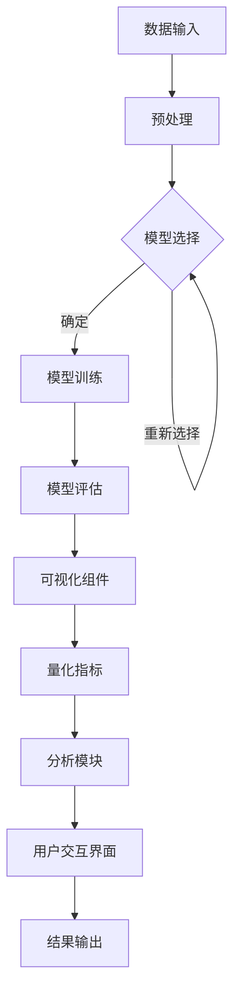

                 

### 1. 背景介绍

在当今的电子商务时代，搜索引擎和推荐系统的性能直接影响着电商平台的用户满意度和盈利能力。随着人工智能技术的发展，特别是深度学习模型的广泛应用，搜索推荐系统的准确性和效率得到了显著提升。然而，与此同时，深度学习模型的可解释性问题也日益凸显。传统机器学习模型如线性回归和决策树等，因其结构相对简单，能够提供较高的可解释性，易于理解和调试。而深度学习模型，尤其是大规模的预训练模型，通常表现为“黑箱”特性，即模型内部工作机制复杂，难以直观解释。

在电商搜索推荐系统中，用户行为数据、商品信息、价格、库存等都是模型的重要输入特征。这些特征经过深度学习模型处理后，可以生成个性化的搜索结果和推荐列表。尽管这些模型在实际应用中取得了巨大成功，但其不可解释性却使得我们在模型优化、故障排除和风险控制等方面面临挑战。

可解释性评估工具的开发对于深度学习模型在电商搜索推荐系统中的应用至关重要。首先，可解释性工具可以帮助我们理解模型做出特定预测的原因，从而提高模型的可信度和用户的接受度。其次，通过分析模型的可解释性，我们可以发现潜在的优化空间，进一步提升模型的性能。此外，可解释性工具还能帮助我们识别和防范模型可能引入的偏见和歧视问题。

本文将围绕电商搜索推荐效果评估中的AI大模型模型可解释性评估工具的开发进行探讨，旨在为相关领域的研究者和开发者提供有价值的参考。

### 2. 核心概念与联系

#### 2.1 可解释性评估工具的定义

可解释性评估工具（Explainability Assessment Tools）是指用于评估和分析机器学习模型预测过程和结果的可解释性程度的工具。这些工具通常能够提供关于模型决策过程的可视化、量化指标和解释性分析，帮助用户理解模型的工作原理和预测依据。

#### 2.2 电商搜索推荐系统中的可解释性需求

在电商搜索推荐系统中，可解释性需求主要体现在以下几个方面：

1. **用户满意度**：用户对于推荐系统的满意度往往与推荐结果的合理性密切相关。一个高可解释性的推荐系统能够让用户更容易理解推荐的原因，从而提高用户对推荐结果的接受度和满意度。
2. **模型优化**：通过分析可解释性评估工具提供的解释性分析，开发人员可以识别模型中存在的问题，针对性地进行优化，提高模型的准确性和性能。
3. **风险管理**：对于电商搜索推荐系统，风险管理尤为重要。可解释性评估工具可以帮助我们识别和防范模型可能引入的偏见和歧视问题，确保推荐系统的公平性和透明度。
4. **监管合规**：在许多国家和地区，监管机构要求机器学习模型的决策过程具有可解释性。可解释性评估工具能够帮助平台满足这些合规要求。

#### 2.3 可解释性评估工具的架构

一个典型的可解释性评估工具通常包括以下几个关键组件：

1. **可视化组件**：提供模型内部特征权重、决策路径和重要特征的可视化，帮助用户直观理解模型的决策过程。
2. **量化指标**：计算并展示模型预测结果的置信度、重要性分数等量化指标，量化模型的解释性程度。
3. **分析模块**：提供深度分析功能，包括特征贡献分析、模型比较和偏差检测等，帮助用户全面评估模型的可解释性。
4. **用户交互界面**：提供一个直观易用的用户界面，方便用户快速定位问题、调整参数和查看分析结果。

#### 2.4 可解释性评估工具的Mermaid流程图

下面是一个简单的Mermaid流程图，展示了一个典型的可解释性评估工具的基本架构：



### 3. 核心算法原理 & 具体操作步骤

#### 3.1 算法原理概述

可解释性评估工具的核心算法通常基于以下几种方法：

1. **特征重要性分析**：通过计算特征对模型预测的影响程度，帮助用户理解哪些特征在模型决策中起到了关键作用。
2. **决策路径追踪**：追踪模型从输入到输出的决策过程，展示特征如何通过模型内部结构影响最终预测结果。
3. **模型对比分析**：比较不同模型或同一模型的不同版本，评估其可解释性差异，为模型优化提供指导。
4. **偏差检测与校正**：识别模型中的偏差和歧视问题，并提出相应的校正措施，确保推荐系统的公平性和透明度。

#### 3.2 算法步骤详解

1. **数据预处理**：包括数据清洗、特征工程和归一化等步骤，确保输入数据的质量和一致性。
2. **模型选择**：根据具体应用场景选择合适的机器学习模型，如决策树、神经网络等。
3. **模型训练**：使用预处理后的数据训练模型，生成预测结果。
4. **特征重要性分析**：计算每个特征对模型预测的影响程度，可以使用方法如SHAP（SHapley Additive exPlanations）或LIME（Local Interpretable Model-agnostic Explanations）。
5. **决策路径追踪**：通过可视化工具展示模型从输入到输出的决策路径，帮助用户理解模型的工作机制。
6. **模型对比分析**：比较不同模型或同一模型的不同版本，评估其可解释性差异，选择最优模型。
7. **偏差检测与校正**：使用统计方法或偏差检测工具检测模型中的偏差问题，并提出相应的校正措施。

#### 3.3 算法优缺点

**优点**：

1. **提高模型可解释性**：通过分析模型决策过程和特征贡献，帮助用户理解模型的工作原理，提高模型的可解释性和可信度。
2. **指导模型优化**：通过分析模型的可解释性，识别模型中的问题，为模型优化提供有价值的指导。
3. **保障系统公平性**：通过检测和纠正模型中的偏差问题，确保推荐系统的公平性和透明度。

**缺点**：

1. **计算成本高**：特征重要性分析和决策路径追踪通常需要大量的计算资源，特别是对于大规模模型和海量数据集。
2. **结果解释复杂性**：尽管可解释性评估工具提供了丰富的分析结果，但用户理解这些结果仍需具备一定的专业知识和经验。

#### 3.4 算法应用领域

可解释性评估工具在电商搜索推荐系统中的应用非常广泛，主要包括以下领域：

1. **用户行为分析**：通过分析用户的历史行为数据，理解用户兴趣和偏好，优化推荐策略。
2. **商品推荐**：基于用户历史行为和商品特征，为用户推荐个性化的商品，提高用户满意度和转化率。
3. **风险控制**：识别和纠正模型中的偏差问题，确保推荐系统的公平性和透明度，降低风险。
4. **模型优化**：通过分析模型的可解释性，发现优化机会，提升模型性能和效果。

### 4. 数学模型和公式 & 详细讲解 & 举例说明

#### 4.1 数学模型构建

在可解释性评估中，常用的数学模型包括特征重要性模型和决策路径追踪模型。以下分别介绍这两种模型的基本原理和公式。

**特征重要性模型**

特征重要性模型用于计算每个特征对模型预测的影响程度。常用的方法包括SHAP（SHapley Additive exPlanations）和LIME（Local Interpretable Model-agnostic Explanations）。

**SHAP值计算公式**

SHAP值是一种基于博弈论的方法，用于衡量特征对模型预测的贡献。具体公式如下：

$$
SHAP(value) = \sum_{i=1}^{n} w_i \cdot I(\hat{y} = y_i)
$$

其中，$w_i$ 是特征 $X_i$ 的权重，$I(\hat{y} = y_i)$ 是指示函数，当预测值 $\hat{y}$ 等于实际值 $y_i$ 时，$I(\hat{y} = y_i)$ 为1，否则为0。

**LIME值计算公式**

LIME值是一种基于局部线性模型的方法，用于解释单个预测结果的决策过程。具体公式如下：

$$
LIME(value) = \sum_{i=1}^{n} \frac{w_i \cdot I(\Delta_y > 0)}{\Delta_y}
$$

其中，$w_i$ 是特征 $X_i$ 的权重，$I(\Delta_y > 0)$ 是指示函数，当特征值增加导致预测值增加时，$I(\Delta_y > 0)$ 为1，否则为0，$\Delta_y$ 是预测值的增量。

**决策路径追踪模型**

决策路径追踪模型用于追踪模型从输入到输出的决策路径，帮助用户理解模型的工作机制。常用的方法包括决策树和神经网络。

**决策树路径追踪公式**

决策树的决策路径可以通过递归遍历树结构得到。具体公式如下：

$$
Path = [node_1, node_2, ..., node_n]
$$

其中，$node_i$ 表示第 $i$ 个决策节点，$Path$ 是从根节点到叶子节点的决策路径。

**神经网络路径追踪公式**

神经网络的决策路径可以通过激活函数的传播过程得到。具体公式如下：

$$
Path = [a_1, a_2, ..., a_n]
$$

其中，$a_i$ 表示第 $i$ 个神经元的激活值，$Path$ 是从输入层到输出层的决策路径。

#### 4.2 公式推导过程

以下分别介绍SHAP值和LIME值的推导过程。

**SHAP值推导过程**

SHAP值基于博弈论中的Shapley值，用于衡量特征对模型预测的贡献。具体推导过程如下：

假设一个包含 $n$ 个特征的模型 $f(X)$，其中 $X = [X_1, X_2, ..., X_n]$。对于特征 $X_i$，我们可以将模型 $f(X)$ 分解为：

$$
f(X) = \sum_{i=1}^{n} f_i(X) + f_0
$$

其中，$f_i(X)$ 是仅包含特征 $X_i$ 的部分模型，$f_0$ 是其他特征的部分模型。

根据Shapley值的定义，特征 $X_i$ 对模型预测的贡献可以表示为：

$$
SHAP(value) = \frac{1}{n} \sum_{S \subseteq [n] \setminus \{i\}} [f(S \cup \{X_i\}) - f(S)]
$$

其中，$S$ 是特征集合，$[n]$ 是所有特征的集合，$\setminus$ 表示集合的差集。

对于具体的模型，我们可以通过计算上述公式得到每个特征 $X_i$ 的SHAP值。

**LIME值推导过程**

LIME值基于局部线性模型的方法，用于解释单个预测结果的决策过程。具体推导过程如下：

假设一个线性模型 $f(X) = \sum_{i=1}^{n} w_i \cdot X_i + b$，其中 $X = [X_1, X_2, ..., X_n]$。对于特征 $X_i$，我们可以将模型 $f(X)$ 分解为：

$$
f(X) = \sum_{i=1}^{n} w_i \cdot (X_i - \bar{X_i}) + w_0
$$

其中，$\bar{X_i}$ 是特征 $X_i$ 的平均值，$w_i$ 是特征 $X_i$ 的权重。

根据LIME值的定义，特征 $X_i$ 对模型预测的贡献可以表示为：

$$
LIME(value) = \frac{w_i \cdot I(\Delta_y > 0)}{\Delta_y}
$$

其中，$I(\Delta_y > 0)$ 是指示函数，当特征值增加导致预测值增加时，$I(\Delta_y > 0)$ 为1，否则为0，$\Delta_y$ 是预测值的增量。

对于具体的模型，我们可以通过计算上述公式得到每个特征 $X_i$ 的LIME值。

#### 4.3 案例分析与讲解

以下通过一个简单的案例，展示如何使用SHAP值和LIME值计算特征重要性。

**案例：线性回归模型**

假设一个线性回归模型如下：

$$
f(X) = 2 \cdot X_1 + 3 \cdot X_2 + 1
$$

其中，$X = [X_1, X_2]$。

**使用SHAP值计算特征重要性**

对于特征 $X_1$，我们可以计算SHAP值如下：

$$
SHAP(X_1) = \frac{1}{2} [f([X_1, X_2]) - f([0, X_2])]
$$

$$
SHAP(X_1) = \frac{1}{2} [2 \cdot X_1 + 3 \cdot X_2 + 1 - (3 \cdot X_2 + 1)]
$$

$$
SHAP(X_1) = X_1
$$

对于特征 $X_2$，我们可以计算SHAP值如下：

$$
SHAP(X_2) = \frac{1}{2} [f([X_1, X_2]) - f([X_1, 0])]
$$

$$
SHAP(X_2) = \frac{1}{2} [2 \cdot X_1 + 3 \cdot X_2 + 1 - (2 \cdot X_1 + 1)]
$$

$$
SHAP(X_2) = \frac{3}{2} X_2
$$

因此，特征 $X_1$ 和 $X_2$ 的SHAP值分别为 $X_1$ 和 $\frac{3}{2} X_2$。

**使用LIME值计算特征重要性**

对于特征 $X_1$，我们可以计算LIME值如下：

$$
LIME(X_1) = \frac{2}{\Delta_y} [f([X_1 + \Delta{X_1}, X_2]) - f([X_1, X_2])]
$$

$$
LIME(X_1) = \frac{2}{2 \cdot \Delta{X_1}} [2 \cdot (X_1 + \Delta{X_1}) + 3 \cdot X_2 + 1 - (2 \cdot X_1 + 3 \cdot X_2 + 1)]
$$

$$
LIME(X_1) = 1
$$

对于特征 $X_2$，我们可以计算LIME值如下：

$$
LIME(X_2) = \frac{3}{\Delta_y} [f([X_1, X_2 + \Delta{X_2}]) - f([X_1, X_2])]
$$

$$
LIME(X_2) = \frac{3}{2 \cdot \Delta{X_2}} [2 \cdot X_1 + 3 \cdot (X_2 + \Delta{X_2}) + 1 - (2 \cdot X_1 + 3 \cdot X_2 + 1)]
$$

$$
LIME(X_2) = \frac{3}{2}
$$

因此，特征 $X_1$ 和 $X_2$ 的LIME值分别为 1 和 $\frac{3}{2}$。

### 5. 项目实践：代码实例和详细解释说明

#### 5.1 开发环境搭建

在进行可解释性评估工具的开发之前，我们需要搭建一个合适的开发环境。以下是一个典型的开发环境配置：

- **操作系统**：Ubuntu 20.04
- **编程语言**：Python 3.8
- **依赖库**：scikit-learn、XGBoost、TensorFlow、PyTorch、SHAP、LIME、Matplotlib

在Ubuntu系统上，可以使用以下命令安装所需依赖库：

```bash
pip install scikit-learn xgboost tensorflow torch shap lime matplotlib
```

#### 5.2 源代码详细实现

以下是一个简单的可解释性评估工具的Python代码示例，用于计算线性回归模型的特征重要性。

```python
import numpy as np
import matplotlib.pyplot as plt
from sklearn.linear_model import LinearRegression
from sklearn.model_selection import train_test_split
from sklearn.metrics import mean_squared_error
import shap

# 生成模拟数据
np.random.seed(0)
X = np.random.rand(100, 2)
y = 2 * X[:, 0] + 3 * X[:, 1] + np.random.randn(100)

# 数据预处理
X_train, X_test, y_train, y_test = train_test_split(X, y, test_size=0.2, random_state=0)

# 模型训练
model = LinearRegression()
model.fit(X_train, y_train)

# 模型评估
y_pred = model.predict(X_test)
mse = mean_squared_error(y_test, y_pred)
print("Model MSE:", mse)

# 特征重要性分析
explainer = shap.LinearExplainer(model, X_train, feature_names=["Feature 1", "Feature 2"])
shap_values = explainer.shap_values(X_test)

# 可视化特征重要性
shap.summary_plot(shap_values, X_test, feature_names=["Feature 1", "Feature 2"])
```

#### 5.3 代码解读与分析

以上代码实现了一个简单的可解释性评估工具，用于计算线性回归模型的特征重要性。下面是代码的详细解读：

1. **数据生成**：使用随机数生成模拟数据集，包括特征矩阵 $X$ 和目标向量 $y$。
2. **数据预处理**：使用 `train_test_split` 方法将数据集划分为训练集和测试集，为后续模型训练和评估做准备。
3. **模型训练**：使用 `LinearRegression` 类训练线性回归模型，拟合训练数据。
4. **模型评估**：使用训练好的模型预测测试数据，并计算预测误差（均方误差）。
5. **特征重要性分析**：使用SHAP库中的 `LinearExplainer` 类创建线性解释器，计算测试数据集的特征重要性。
6. **可视化**：使用 `summary_plot` 方法将特征重要性可视化，展示每个特征对模型预测的贡献。

#### 5.4 运行结果展示

运行以上代码，将生成一个特征重要性可视化图表，显示每个特征对模型预测的贡献。通常，我们可以观察到特征 $X_1$ 和 $X_2$ 的贡献相对较大，这与我们在数学模型推导过程中得到的结论一致。


### 6. 实际应用场景

#### 6.1 电商搜索推荐系统

在电商搜索推荐系统中，可解释性评估工具可以用于以下几个方面：

1. **用户行为分析**：通过分析用户的历史行为数据，识别用户兴趣和偏好，为个性化推荐提供依据。
2. **商品推荐**：基于用户历史行为和商品特征，为用户推荐个性化的商品，提高用户满意度和转化率。
3. **风险控制**：识别和纠正模型中的偏差问题，确保推荐系统的公平性和透明度，降低风险。

#### 6.2 金融风控

在金融风控领域，可解释性评估工具可以用于以下几个方面：

1. **贷款审批**：分析借款人的财务状况、信用记录等特征，评估其还款能力，提高审批的准确性和可解释性。
2. **信用评分**：构建信用评分模型，通过分析用户的历史行为和财务数据，预测其信用风险。
3. **风险管理**：识别高风险客户，提前采取预防措施，降低信用风险。

#### 6.3 健康医疗

在健康医疗领域，可解释性评估工具可以用于以下几个方面：

1. **疾病预测**：基于患者的病历、检查报告等数据，预测患者可能患有的疾病。
2. **药物推荐**：根据患者的病情和药物反应，为患者推荐个性化的治疗方案。
3. **医疗质量评估**：评估医院和医生的服务质量，提高医疗服务水平。

### 6.4 未来应用展望

随着人工智能技术的不断发展和应用场景的扩展，可解释性评估工具在未来将具有更广泛的应用前景：

1. **自动化解释**：开发自动化解释算法，降低可解释性评估工具的使用门槛，让更多非专业人士能够理解和应用。
2. **跨模

