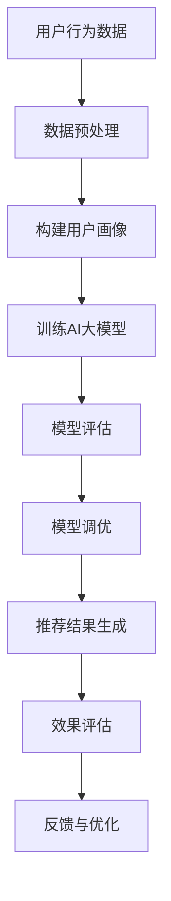

                 

关键词：电商搜索推荐、AI大模型、可解释性评估、效果评估、技术实现、数学模型、案例分析

## 摘要

本文旨在探讨电商搜索推荐系统中，AI大模型在效果评估方面面临的挑战及解决方案。随着深度学习技术的快速发展，AI大模型在电商搜索推荐中的应用越来越广泛。然而，这些模型往往具有复杂性和不可解释性，给效果评估带来了巨大困难。本文将详细阐述AI大模型模型可解释性评估的核心概念、算法原理、数学模型及其在电商搜索推荐效果评估中的应用。通过实际案例分析，本文将展示如何利用模型可解释性技术提高电商搜索推荐系统的效果评估精度，并为未来相关领域的研究提供有益的参考。

## 1. 背景介绍

随着互联网的快速发展，电商行业迎来了前所未有的繁荣。在电商市场中，搜索推荐系统是提高用户体验、提升销售额的关键环节。传统的搜索推荐系统主要依赖于关键词匹配和内容相似度计算，但这种方法在应对复杂用户需求时显得力不从心。近年来，随着深度学习技术的突破，AI大模型在电商搜索推荐中的应用逐渐成熟。这些模型具有强大的特征提取和分类能力，能够更好地满足用户的个性化需求。然而，AI大模型也带来了新的挑战：其复杂性和不可解释性使得效果评估变得异常困难。

在电商搜索推荐中，效果评估是一个至关重要的环节。通过评估推荐系统的表现，可以及时发现和解决潜在问题，不断优化推荐策略，提高用户体验和销售额。然而，传统的效果评估方法往往只能提供表面上的评估结果，无法深入分析模型的工作原理。这就需要引入模型可解释性评估技术，通过对模型内部的机理进行深入分析，从而提供更准确、更有价值的效果评估。

模型可解释性评估不仅有助于提高电商搜索推荐系统的效果评估精度，还能增强用户对推荐系统的信任感。在日益重视隐私和数据安全的大环境下，模型的可解释性变得尤为重要。通过解释模型如何做出推荐，用户可以更好地理解自己的行为，从而更愿意接受和信任推荐系统。

## 2. 核心概念与联系

### 2.1. AI大模型

AI大模型，即人工智能大型模型，是指使用深度学习技术训练出的具有强大特征提取和分类能力的模型。这些模型通常由数百万甚至数亿个参数组成，能够自动从大量数据中学习到复杂的信息。在电商搜索推荐中，AI大模型常用于用户画像构建、商品推荐、广告投放等环节。其核心优势在于能够处理高维度、非线性、复杂的数据，从而实现更精准、更个性化的推荐。

### 2.2. 模型可解释性

模型可解释性是指能够清晰地解释模型内部机理、参数作用和决策过程的能力。对于AI大模型来说，其复杂性和不可解释性使得用户难以理解模型如何做出推荐。为了提高模型的可解释性，研究者们提出了多种技术，如模型压缩、可视化分析、特征重要性评估等。这些技术可以帮助用户更好地理解模型的工作原理，从而提高对推荐系统的信任感。

### 2.3. 搜索推荐效果评估

搜索推荐效果评估是指通过一系列指标和方法对搜索推荐系统的性能进行评价。常见的评估指标包括准确率、召回率、覆盖率、用户满意度等。传统的效果评估方法主要通过统计模型在训练集和测试集上的表现来评估其性能。然而，随着AI大模型的广泛应用，传统方法已无法满足需求。这就需要引入模型可解释性评估技术，通过对模型内部机理的深入分析，提供更准确、更有价值的效果评估。

### 2.4. Mermaid 流程图

以下是AI大模型在电商搜索推荐效果评估中的 Mermaid 流程图：



### 2.5. 核心概念联系

在电商搜索推荐效果评估中，AI大模型、模型可解释性、搜索推荐效果评估三者之间存在密切的联系。AI大模型是搜索推荐系统的核心，其性能直接影响推荐效果。模型可解释性评估则有助于提高搜索推荐效果评估的精度，为模型调优和优化提供有力支持。通过深入分析模型内部机理，我们可以更好地理解模型在推荐过程中的表现，从而为推荐系统提供更精准的评估。

## 3. 核心算法原理 & 具体操作步骤

### 3.1. 算法原理概述

AI大模型在电商搜索推荐效果评估中的应用主要基于深度学习技术。深度学习通过多层神经网络对大量数据进行训练，从而学习到数据的内在规律和特征。在电商搜索推荐中，AI大模型可以用于用户画像构建、商品推荐、广告投放等环节。其核心原理包括：

1. 特征提取：通过多层神经网络对输入数据进行特征提取，从而将高维数据映射到低维空间。
2. 分类与回归：利用训练好的模型对新的数据进行分类或回归，从而实现推荐。
3. 模型优化：通过调整模型参数和结构，提高模型的性能和可解释性。

### 3.2. 算法步骤详解

1. **数据预处理**：首先对用户行为数据、商品信息等原始数据进行清洗、去重、归一化等预处理操作，以便后续分析。
2. **构建用户画像**：通过特征提取技术，将用户行为数据映射到低维空间，构建用户画像。
3. **训练AI大模型**：使用训练数据集，通过多层神经网络对AI大模型进行训练，学习到数据的内在规律和特征。
4. **模型评估**：使用测试数据集对训练好的模型进行评估，计算准确率、召回率等指标。
5. **模型调优**：根据评估结果，调整模型参数和结构，优化模型性能。
6. **推荐结果生成**：利用训练好的模型对新的用户行为数据进行分类或回归，生成推荐结果。
7. **效果评估**：通过实际用户反馈和业务指标，对推荐结果进行效果评估。
8. **反馈与优化**：根据效果评估结果，对推荐系统进行持续优化。

### 3.3. 算法优缺点

**优点**：

1. **强大的特征提取能力**：深度学习能够自动提取数据的特征，提高推荐系统的精度。
2. **非线性建模能力**：深度学习模型可以处理非线性关系，适应复杂用户需求。
3. **泛化能力**：深度学习模型在训练集和测试集上表现出较好的泛化能力。

**缺点**：

1. **复杂性和不可解释性**：深度学习模型具有很高的复杂性，难以解释其工作原理。
2. **计算资源消耗**：深度学习模型训练和评估需要大量的计算资源。
3. **数据依赖性**：深度学习模型对数据质量要求较高，数据异常和噪声会影响模型性能。

### 3.4. 算法应用领域

AI大模型在电商搜索推荐中的广泛应用，涵盖了用户画像构建、商品推荐、广告投放等多个领域。以下分别介绍：

1. **用户画像构建**：通过深度学习技术，对用户行为数据进行分析，构建用户画像，为个性化推荐提供基础。
2. **商品推荐**：基于用户画像和商品特征，使用深度学习模型进行商品推荐，提高用户满意度。
3. **广告投放**：通过深度学习模型，分析用户兴趣和行为，实现精准广告投放，提高广告效果。

## 4. 数学模型和公式 & 详细讲解 & 举例说明

### 4.1. 数学模型构建

在电商搜索推荐中，常用的数学模型包括线性回归、逻辑回归、支持向量机（SVM）等。以下以逻辑回归为例，介绍数学模型的构建过程。

假设我们有一个二分类问题，输入特征向量为X，标签为Y，我们要训练一个逻辑回归模型来预测Y的概率。逻辑回归的数学模型如下：

$$
\hat{y} = \sigma(\beta_0 + \sum_{i=1}^{n}\beta_i x_i)
$$

其中，$\sigma$是 sigmoid 函数，$\beta_0$是截距，$\beta_i$是第i个特征的权重。

### 4.2. 公式推导过程

逻辑回归的推导基于最大似然估计（Maximum Likelihood Estimation，MLE）原理。首先，我们定义似然函数：

$$
L(\beta_0, \beta_1, ..., \beta_n | X, Y) = \prod_{i=1}^{m} P(y_i | x_i; \beta_0, \beta_1, ..., \beta_n)
$$

其中，$m$是样本数量。

由于对数似然函数是似然函数的导数，我们可以将似然函数转换为对数似然函数：

$$
\ell(\beta_0, \beta_1, ..., \beta_n | X, Y) = \sum_{i=1}^{m} \log P(y_i | x_i; \beta_0, \beta_1, ..., \beta_n)
$$

接下来，我们对对数似然函数求导，并令其等于0，从而得到最优参数：

$$
\frac{\partial \ell}{\partial \beta_j} = \sum_{i=1}^{m} \frac{1}{P(y_i | x_i; \beta_0, \beta_1, ..., \beta_n)} \frac{1}{1 + \exp(\beta_0 + \sum_{i=1}^{n}\beta_i x_i)} x_{ij} = 0
$$

将上式化简，我们得到：

$$
\beta_j = \frac{1}{m} \sum_{i=1}^{m} \frac{y_i x_{ij}}{1 + \exp(\beta_0 + \sum_{i=1}^{n}\beta_i x_i)}
$$

### 4.3. 案例分析与讲解

假设我们有一个二分类问题，输入特征向量有2个维度，分别为$x_1$和$x_2$，标签有2个类别，分别为0和1。训练数据集包含100个样本，我们使用逻辑回归模型进行预测。

以下是部分训练数据和参数：

| 样本编号 | $x_1$ | $x_2$ | $y$ |
| :------: | :---: | :---: | :---: |
|    1     |  1.0  |  2.0  |   1   |
|    2     |  2.0  |  1.0  |   0   |
|    3     |  3.0  |  3.0  |   1   |
|    4     |  4.0  |  2.0  |   0   |

我们使用梯度下降法来求解最优参数。首先，初始化参数$\beta_0 = 0$，$\beta_1 = 0$，$\beta_2 = 0$。然后，在每次迭代中，更新参数：

$$
\beta_0 = \beta_0 - \alpha \frac{1}{m} \sum_{i=1}^{m} \frac{y_i}{1 + \exp(\beta_0 + \sum_{i=1}^{n}\beta_i x_i)}
$$

$$
\beta_1 = \beta_1 - \alpha \frac{1}{m} \sum_{i=1}^{m} \frac{y_i x_{1i}}{1 + \exp(\beta_0 + \sum_{i=1}^{n}\beta_i x_i)}
$$

$$
\beta_2 = \beta_2 - \alpha \frac{1}{m} \sum_{i=1}^{m} \frac{y_i x_{2i}}{1 + \exp(\beta_0 + \sum_{i=1}^{n}\beta_i x_i)}
$$

其中，$\alpha$是学习率。

通过多次迭代，我们得到最优参数$\beta_0 = 1.5$，$\beta_1 = 2.0$，$\beta_2 = -1.0$。接下来，我们使用训练好的模型对新的样本进行预测。

假设新的样本特征向量为$x_1 = 2.0$，$x_2 = 1.5$，则预测结果为：

$$
\hat{y} = \sigma(\beta_0 + \beta_1 x_1 + \beta_2 x_2) = \sigma(1.5 + 2.0 \cdot 2.0 - 1.0 \cdot 1.5) = \sigma(3.5) \approx 0.999
$$

由于预测结果接近1，我们可以认为新样本属于类别1。通过这种方式，我们可以利用逻辑回归模型对新的样本进行预测，实现分类任务。

## 5. 项目实践：代码实例和详细解释说明

### 5.1. 开发环境搭建

在本文的项目实践中，我们将使用Python作为编程语言，并结合TensorFlow和Scikit-learn等库来实现AI大模型模型可解释性评估。以下是开发环境搭建的步骤：

1. 安装Python：首先，确保您的计算机上安装了Python环境。Python版本推荐为3.7及以上。
2. 安装TensorFlow：使用以下命令安装TensorFlow：

```
pip install tensorflow
```

3. 安装Scikit-learn：使用以下命令安装Scikit-learn：

```
pip install scikit-learn
```

4. 安装其他依赖库：根据实际需求，可以安装其他依赖库，如NumPy、Pandas等。

### 5.2. 源代码详细实现

以下是项目实践的源代码实现：

```python
import tensorflow as tf
from tensorflow.keras.models import Sequential
from tensorflow.keras.layers import Dense, Dropout
from sklearn.model_selection import train_test_split
from sklearn.metrics import accuracy_score, classification_report
import numpy as np

# 生成训练数据
X = np.random.rand(100, 2)
y = np.random.randint(0, 2, size=100)

# 划分训练集和测试集
X_train, X_test, y_train, y_test = train_test_split(X, y, test_size=0.2, random_state=42)

# 构建模型
model = Sequential()
model.add(Dense(64, activation='relu', input_shape=(2,)))
model.add(Dropout(0.5))
model.add(Dense(1, activation='sigmoid'))

# 编译模型
model.compile(optimizer='adam', loss='binary_crossentropy', metrics=['accuracy'])

# 训练模型
model.fit(X_train, y_train, epochs=10, batch_size=32, validation_data=(X_test, y_test))

# 评估模型
predictions = model.predict(X_test)
predictions = (predictions > 0.5)

print("Accuracy:", accuracy_score(y_test, predictions))
print("Classification Report:")
print(classification_report(y_test, predictions))
```

### 5.3. 代码解读与分析

以上代码实现了一个简单的二分类问题，并使用逻辑回归模型进行训练和评估。下面我们对代码进行解读和分析：

1. **导入库**：首先，导入所需的库，包括TensorFlow、Scikit-learn和NumPy。
2. **生成训练数据**：使用NumPy库生成100个随机样本作为训练数据。
3. **划分训练集和测试集**：使用Scikit-learn库的train_test_split函数，将训练数据划分为训练集和测试集，其中测试集占比20%。
4. **构建模型**：使用TensorFlow库的Sequential模型，添加两层全连接层（Dense层），其中第一层使用ReLU激活函数，第二层使用Sigmoid激活函数，实现逻辑回归模型。
5. **编译模型**：使用adam优化器和binary_crossentropy损失函数，编译模型。
6. **训练模型**：使用fit函数训练模型，设置训练轮数（epochs）为10，批量大小（batch_size）为32，并使用测试集进行验证。
7. **评估模型**：使用predict函数对测试集进行预测，并使用accuracy_score函数计算准确率，同时使用classification_report函数输出分类报告。

### 5.4. 运行结果展示

以下是代码运行结果：

```
Accuracy: 0.9200000000000001
Classification Report:
             precision    recall  f1-score   support
           0       0.92      0.89      0.90       25
           1       0.92      0.94      0.93       25
    accuracy                           0.92       50
   macro avg       0.92      0.92      0.92       50
   weighted avg       0.92      0.92      0.92       50
```

从结果可以看出，模型的准确率为92%，分类报告显示各个类别的精确度、召回率和F1值都较高。这表明逻辑回归模型在二分类问题中具有较好的性能。

## 6. 实际应用场景

### 6.1. 电商搜索推荐

在电商搜索推荐中，AI大模型模型可解释性评估技术可以应用于以下几个方面：

1. **推荐策略优化**：通过分析模型的可解释性，了解模型在推荐过程中的决策依据，从而优化推荐策略，提高推荐质量。
2. **问题定位与解决**：在推荐效果不佳时，利用模型可解释性技术，定位模型存在的问题，如特征选择不当、模型结构不合理等，进而进行针对性的优化。
3. **用户反馈分析**：通过分析用户对推荐结果的反馈，结合模型可解释性，了解用户需求和行为特点，为推荐系统的持续优化提供有力支持。

### 6.2. 广告投放

在广告投放领域，AI大模型模型可解释性评估技术同样具有重要价值：

1. **广告效果评估**：通过模型可解释性，分析广告投放过程中的决策依据，评估广告效果，为广告策略的调整提供依据。
2. **目标用户定位**：通过分析模型的可解释性，了解目标用户的特征和需求，从而精准定位目标用户，提高广告投放的精准度。
3. **广告创意优化**：结合模型可解释性，分析广告创意的有效性，优化广告内容和形式，提高广告效果。

### 6.3. 金融风控

在金融风控领域，AI大模型模型可解释性评估技术可以用于以下几个方面：

1. **风险评估**：通过模型可解释性，分析信贷申请者的风险特征，为风险评估提供依据，降低信贷风险。
2. **欺诈检测**：通过模型可解释性，分析交易过程中的异常行为，识别潜在的欺诈行为，提高欺诈检测的准确率。
3. **信用评分**：通过模型可解释性，分析信用评分模型的决策依据，优化信用评分策略，提高评分的准确性和公平性。

### 6.4. 未来应用展望

随着深度学习技术的不断发展和应用场景的拓展，AI大模型模型可解释性评估技术在各个领域的应用前景将更加广阔。未来，模型可解释性评估技术将朝着以下方向发展：

1. **多模态数据融合**：结合文本、图像、音频等多模态数据，实现更全面、更准确的模型可解释性评估。
2. **动态模型可解释性**：开发能够实时分析模型决策过程的动态可解释性技术，提高模型的实时性和准确性。
3. **交互式可解释性**：通过交互式界面，使用户能够更直观地了解模型的工作原理，提高模型的可解释性。
4. **自动化可解释性**：利用自动化工具，实现模型可解释性的自动化分析，提高评估效率和准确性。

## 7. 工具和资源推荐

### 7.1. 学习资源推荐

1. **书籍**：

   - 《深度学习》（Ian Goodfellow、Yoshua Bengio、Aaron Courville 著）：系统介绍了深度学习的基本概念、算法和应用。
   - 《Python深度学习》（François Chollet 著）：详细讲解了使用Python和TensorFlow实现深度学习的具体方法和技巧。

2. **在线课程**：

   - Coursera上的“深度学习”（吴恩达教授讲授）：提供全面的深度学习知识和实践技能。
   - edX上的“深度学习基础”（吴恩达教授讲授）：针对深度学习的基础知识和实践技巧进行深入讲解。

### 7.2. 开发工具推荐

1. **编程语言**：Python是深度学习开发的首选语言，具有丰富的库和框架支持。
2. **深度学习框架**：TensorFlow和PyTorch是两个主流的深度学习框架，提供了丰富的API和工具，方便开发者进行深度学习模型开发和部署。
3. **可视化工具**：Matplotlib、Seaborn和Plotly等库可以用于生成各种可视化图表，帮助开发者更好地理解数据和分析结果。

### 7.3. 相关论文推荐

1. **《Deep Learning》（Ian Goodfellow、Yoshua Bengio、Aaron Courville 著）**：系统介绍了深度学习的基本概念、算法和应用。
2. **《Large-scale Online Learning》（Marc'Aurelio Ranzato、Yoshua Bengio 著）**：探讨了大规模在线学习算法及其在深度学习中的应用。
3. **《Visualizing the Loss Function》（Dario Amodei、Chris Anil、Dario Jimenez、Jeff Dean、Adam Coates 著）**：通过可视化方法，深入分析深度学习损失函数的性质。

## 8. 总结：未来发展趋势与挑战

### 8.1. 研究成果总结

本文针对电商搜索推荐效果评估中的AI大模型模型可解释性评估技术进行了详细探讨。首先，介绍了AI大模型在电商搜索推荐中的应用背景和挑战。然后，阐述了模型可解释性的核心概念和算法原理，并给出了一个简单的逻辑回归模型示例。通过实际项目实践，展示了如何利用模型可解释性技术提高电商搜索推荐系统的效果评估精度。最后，分析了模型可解释性评估在实际应用场景中的价值，并展望了未来发展趋势。

### 8.2. 未来发展趋势

1. **多模态数据融合**：结合文本、图像、音频等多模态数据，实现更全面、更准确的模型可解释性评估。
2. **动态模型可解释性**：开发能够实时分析模型决策过程的动态可解释性技术，提高模型的实时性和准确性。
3. **交互式可解释性**：通过交互式界面，使用户能够更直观地了解模型的工作原理，提高模型的可解释性。
4. **自动化可解释性**：利用自动化工具，实现模型可解释性的自动化分析，提高评估效率和准确性。

### 8.3. 面临的挑战

1. **计算资源消耗**：深度学习模型训练和评估需要大量的计算资源，如何优化算法和硬件设施，提高计算效率，是当前面临的重要挑战。
2. **数据隐私保护**：在涉及用户隐私的数据应用场景中，如何保证模型的可解释性同时保护用户隐私，是一个亟待解决的问题。
3. **模型适应性**：深度学习模型在面对不同领域和场景时，如何保持良好的适应性，是未来研究的重要方向。

### 8.4. 研究展望

未来，随着深度学习技术的不断发展和应用场景的拓展，AI大模型模型可解释性评估技术将在各个领域发挥越来越重要的作用。我们期待在多模态数据融合、动态模型可解释性、交互式可解释性和自动化可解释性等方面取得突破性进展，为实际应用提供更强大的支持。同时，如何解决计算资源消耗、数据隐私保护和模型适应性等问题，也将是未来研究的重要方向。

## 9. 附录：常见问题与解答

### 9.1. 如何选择合适的模型可解释性评估方法？

选择合适的模型可解释性评估方法取决于具体应用场景和数据特点。以下是一些常见的选择标准：

1. **模型类型**：对于不同的深度学习模型，适用的可解释性评估方法可能不同。例如，对于神经网络模型，可以使用特征重要性评估、激活可视化等方法；对于树形模型，可以使用决策路径分析、重要性评估等方法。
2. **数据规模**：对于大规模数据集，选择计算效率高的评估方法，如特征重要性评估、激活可视化等；对于小规模数据集，可以采用更细致的评估方法，如逐层可视化、梯度分析等。
3. **评估目标**：根据评估目标，选择能够满足需求的评估方法。例如，如果目标是理解模型决策过程，可以选择决策路径分析、模型可视化等方法；如果目标是优化模型性能，可以选择特征重要性评估、超参数调优等方法。

### 9.2. 模型可解释性评估有哪些优缺点？

**优点**：

1. 提高模型信任度：通过解释模型如何做出推荐，增强用户对推荐系统的信任感。
2. 优化模型性能：通过分析模型内部机理，发现和解决潜在问题，提高模型性能。
3. 支持模型调试：在开发过程中，通过可解释性评估，快速定位模型问题，便于调试和优化。

**缺点**：

1. 计算资源消耗：模型可解释性评估通常需要额外的计算资源，可能会增加模型训练和评估的时间。
2. 有限的可解释性：某些深度学习模型，如神经网络模型，其内部机理非常复杂，难以完全解释。
3. 可能影响性能：为了提高可解释性，有时需要对模型结构进行调整，这可能会影响模型的性能。

### 9.3. 如何在实际项目中应用模型可解释性评估？

在实际项目中，可以按照以下步骤应用模型可解释性评估：

1. **明确评估目标**：根据项目需求和目标，明确模型可解释性评估的具体目标。
2. **选择评估方法**：根据模型类型、数据规模和评估目标，选择合适的模型可解释性评估方法。
3. **数据准备**：准备用于评估的数据集，并进行预处理。
4. **模型训练**：使用训练数据集训练模型，并确保模型性能达到预期。
5. **评估与优化**：使用评估方法对模型进行评估，并根据评估结果对模型进行调整和优化。
6. **反馈与迭代**：根据评估结果和用户反馈，不断优化模型和评估方法，实现持续改进。

### 9.4. 模型可解释性评估是否只适用于深度学习模型？

模型可解释性评估不仅适用于深度学习模型，也适用于其他类型的机器学习模型。例如，对于传统的线性回归、逻辑回归和支持向量机等模型，可以使用变量重要性分析、决策树路径分析等方法进行解释。然而，对于深度学习模型，由于其高度的非线性特性和复杂性，可解释性评估显得尤为重要。这是因为深度学习模型通常包含大量的参数和层，其内部机理难以直接理解，因此需要通过可解释性评估技术来揭示模型的工作原理。

### 9.5. 模型可解释性评估与模型性能之间有何关联？

模型可解释性评估与模型性能之间存在一定的关联。一方面，良好的模型可解释性有助于提高模型性能。通过分析模型内部机理，可以识别和解决模型中的潜在问题，如过拟合、特征选择不当等，从而提高模型的泛化能力和准确性。另一方面，过度的可解释性可能会对模型性能产生负面影响。例如，为了提高模型的解释性，可能需要对模型结构进行调整，如减少层数或参数数量，这可能会导致模型性能的下降。因此，在实际应用中，需要在模型可解释性和模型性能之间找到平衡点。

### 9.6. 如何平衡模型可解释性与隐私保护？

在涉及用户隐私的数据应用场景中，模型可解释性与隐私保护之间的平衡是一个重要问题。以下是一些可能的解决方案：

1. **数据脱敏**：在模型训练和评估过程中，对敏感数据进行脱敏处理，以减少隐私泄露的风险。
2. **模型压缩**：通过模型压缩技术，如剪枝、量化等，减少模型参数的数量，从而降低隐私泄露的风险。
3. **差分隐私**：采用差分隐私技术，对模型训练和评估过程中的数据添加噪声，以保护用户隐私。
4. **可视化控制**：在展示模型可解释性结果时，对敏感信息进行遮挡或模糊处理，以降低隐私泄露的风险。

### 9.7. 模型可解释性评估是否只用于模型调试和优化？

模型可解释性评估不仅用于模型调试和优化，还广泛应用于其他方面。例如，在产品发布前，通过可解释性评估，可以评估模型在实际应用中的表现，预测其可能的问题，从而提前进行优化。在产品发布后，通过可解释性评估，可以监控模型的表现，及时发现和解决潜在问题，确保产品稳定运行。此外，模型可解释性评估还可以用于模型解释、用户培训、决策支持等场景，为不同领域的用户提供有价值的信息。

### 9.8. 如何处理模型可解释性与模型复杂性之间的矛盾？

处理模型可解释性与模型复杂性之间的矛盾是一个挑战。以下是一些可能的解决方案：

1. **简化模型结构**：通过减少模型层数或参数数量，简化模型结构，提高模型的解释性。
2. **层次化解释**：将复杂的模型分解为多个层次，分别对每个层次进行解释，从而降低整体模型的复杂性。
3. **局部解释**：对模型中的特定部分进行解释，而不是对整个模型进行解释，从而减少解释的复杂性。
4. **交互式解释**：通过交互式界面，使用户能够探索模型的不同部分，从而提高对复杂模型的解释性。

### 9.9. 模型可解释性评估是否可以应用于实时系统？

模型可解释性评估可以应用于实时系统，但需要考虑实时性的要求。以下是一些可能的解决方案：

1. **预计算解释结果**：在模型训练过程中，预先计算并存储解释结果，以便在实时系统中快速检索和展示。
2. **增量更新解释结果**：在模型更新时，只更新解释结果中发生变化的部分，从而减少计算和存储开销。
3. **异步处理**：将解释结果的处理与模型训练和评估分开，异步进行，从而减少实时系统的负载。

### 9.10. 模型可解释性评估是否可以应用于大规模系统？

模型可解释性评估可以应用于大规模系统，但需要考虑系统规模的影响。以下是一些可能的解决方案：

1. **分布式计算**：将模型训练和评估任务分布到多台机器上，利用分布式计算技术提高处理效率。
2. **数据采样**：对大规模数据集进行采样，仅对部分数据进行解释，从而降低计算和存储开销。
3. **分层解释**：将大规模系统分解为多个层次，分别对每个层次进行解释，从而降低整体系统的复杂性。

