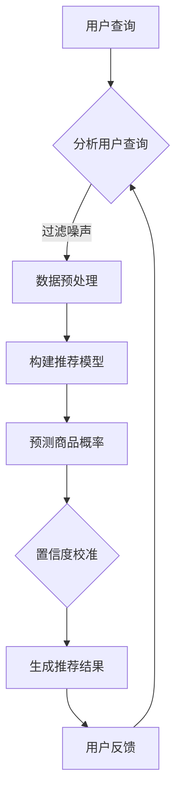

                 

关键词：电商搜索推荐、AI大模型、置信度校准、效果评估

> 摘要：本文探讨了在电商搜索推荐系统中，如何通过AI大模型置信度校准技术提升推荐效果评估的准确性。文章首先介绍了电商搜索推荐的背景和挑战，随后详细阐述了置信度校准技术的核心概念、原理和应用，并提供了数学模型和公式、具体操作步骤、项目实践案例以及未来应用展望。通过本文的阅读，读者将深入了解如何利用AI大模型置信度校准技术优化电商搜索推荐效果评估。

## 1. 背景介绍

### 1.1 电商搜索推荐的发展背景

随着互联网技术的飞速发展，电子商务已经成为人们生活中不可或缺的一部分。电商平台通过个性化的搜索推荐系统，为用户提供个性化的商品推荐，已成为提高用户满意度、促进销售增长的关键手段。搜索推荐系统的主要目标是根据用户的兴趣和行为，将相关商品信息推荐给用户，以增加用户的点击率和购买转化率。

电商搜索推荐系统的发展历程可以分为以下几个阶段：

1. **基于内容推荐**：早期推荐系统主要采用基于内容匹配的方法，通过分析商品属性和用户历史行为，将相似的商品推荐给用户。
2. **协同过滤推荐**：随着用户数据的积累，协同过滤方法被广泛应用，通过分析用户之间的行为相似性来推荐商品。
3. **深度学习推荐**：近年来，深度学习技术在推荐系统中得到广泛应用。通过构建复杂的神经网络模型，可以从大量的用户和商品交互数据中学习到更深入的用户兴趣和商品属性。

### 1.2 电商搜索推荐的挑战

尽管电商搜索推荐系统已经取得了显著的效果，但在实际应用中仍面临着一系列挑战：

1. **数据质量问题**：推荐系统依赖于用户的历史行为数据，但数据质量参差不齐，如数据缺失、噪声数据等，都会影响推荐结果的准确性。
2. **冷启动问题**：对于新用户或新商品，由于缺乏足够的用户行为数据，传统推荐方法难以生成准确的推荐结果。
3. **推荐多样性**：用户希望每次浏览或购买时都能发现不同的商品，但传统推荐方法往往容易陷入“推荐陷阱”，重复推荐相似的商品。
4. **实时性**：电商平台需要快速响应用户的查询和点击行为，提供实时的推荐结果，这对系统的响应速度和计算效率提出了高要求。

## 2. 核心概念与联系

### 2.1 置信度校准技术

置信度校准（Confidence Calibration）是一种通过调整模型预测概率来提高预测置信度一致性的技术。在AI大模型（如深度学习模型）中，置信度校准技术可以显著提高模型的可靠性和预测能力。

### 2.2 电商搜索推荐系统中的置信度校准

在电商搜索推荐系统中，置信度校准技术可以用于以下方面：

1. **提升推荐准确性**：通过置信度校准，调整模型对推荐结果的概率估计，提高推荐结果的准确性。
2. **解决冷启动问题**：对于新用户或新商品，通过置信度校准，可以基于用户的行为和商品属性，生成更加可靠的推荐结果。
3. **增强推荐多样性**：置信度校准可以帮助平衡推荐结果，减少重复推荐的概率，提高推荐的多样性。

### 2.3 Mermaid 流程图

以下是电商搜索推荐系统中置信度校准技术的Mermaid流程图：



## 3. 核心算法原理 & 具体操作步骤

### 3.1 算法原理概述

置信度校准技术基于统计学原理，通过调整模型预测的概率分布，使预测概率与实际标签的一致性更高。具体来说，置信度校准可以分为以下几个步骤：

1. **模型训练**：使用历史数据训练深度学习推荐模型，生成商品推荐的概率分布。
2. **概率调整**：根据模型预测的概率分布，使用置信度校准算法进行调整，提高预测的置信度一致性。
3. **生成推荐结果**：根据调整后的概率分布，生成最终的推荐结果。

### 3.2 算法步骤详解

1. **模型训练**：
   - 数据准备：收集用户的历史行为数据（如浏览记录、购买记录等）和商品属性数据。
   - 特征工程：对用户和商品数据进行特征提取和预处理，如用户兴趣向量、商品属性嵌入等。
   - 模型构建：选择合适的深度学习模型（如基于注意力机制的序列模型）进行训练。

2. **概率调整**：
   - 预测生成：使用训练好的模型对用户查询生成商品推荐的概率分布。
   - 置信度计算：计算模型预测概率与实际标签的一致性，即置信度。
   - 调整概率：根据置信度调整模型预测概率，提高置信度一致性。

3. **生成推荐结果**：
   - 排序调整：根据调整后的概率分布对推荐结果进行排序。
   - 输出推荐：生成最终的推荐结果，供用户浏览和购买。

### 3.3 算法优缺点

**优点**：

1. **提高推荐准确性**：置信度校准技术可以有效提高推荐结果的准确性，减少预测误差。
2. **解决冷启动问题**：对于新用户或新商品，置信度校准技术可以根据用户行为和商品属性生成可靠的推荐结果。
3. **增强推荐多样性**：置信度校准可以帮助平衡推荐结果，减少重复推荐的概率，提高推荐的多样性。

**缺点**：

1. **计算复杂度高**：置信度校准算法需要多次计算模型预测概率和调整概率，计算复杂度较高。
2. **模型泛化能力有限**：置信度校准技术主要针对特定场景下的模型进行优化，对于不同场景的模型，需要重新进行置信度校准。

### 3.4 算法应用领域

置信度校准技术可以应用于以下领域：

1. **电商搜索推荐**：提升电商平台的搜索推荐效果，提高用户满意度和购买转化率。
2. **内容推荐**：优化内容推荐系统的推荐结果，提高用户体验和内容质量。
3. **金融风控**：通过置信度校准技术提高金融风险模型的预测能力，降低金融风险。
4. **医疗诊断**：提高医疗诊断模型的准确性，为医生提供更加可靠的诊断建议。

## 4. 数学模型和公式 & 详细讲解 & 举例说明

### 4.1 数学模型构建

置信度校准技术基于统计学原理，主要包括以下几个数学模型：

1. **概率分布模型**：使用深度学习模型对用户查询生成商品推荐的概率分布。
2. **置信度模型**：计算模型预测概率与实际标签的一致性，即置信度。
3. **调整模型**：根据置信度调整模型预测概率，提高置信度一致性。

### 4.2 公式推导过程

1. **概率分布模型**：

假设用户查询 $Q$ 和商品 $I$ 的特征向量分别为 $\mathbf{q}$ 和 $\mathbf{i}$，深度学习模型预测商品 $I$ 的概率分布为：

$$
P(I|Q) = \text{softmax}(\mathbf{w}^T \cdot (\mathbf{q} + \mathbf{i}))
$$

其中，$\mathbf{w}$ 为模型参数。

2. **置信度模型**：

置信度（Confidence）定义为模型预测概率与实际标签的一致性，可以使用以下公式计算：

$$
\text{Confidence} = \frac{P(\text{标签正确} | I)}{P(I)}
$$

其中，$P(\text{标签正确} | I)$ 表示商品 $I$ 在用户查询 $Q$ 下的标签正确的概率，$P(I)$ 表示商品 $I$ 的概率。

3. **调整模型**：

为了提高置信度一致性，可以对模型预测概率进行调整，使用以下公式计算调整后的概率：

$$
P'(I|Q) = \frac{P(I|Q) \cdot \text{Confidence}}{\sum_{j=1}^{K} P(j|Q) \cdot \text{Confidence}(j)}
$$

其中，$P'(I|Q)$ 表示调整后的概率，$K$ 表示商品总数，$\text{Confidence}(j)$ 表示商品 $j$ 的置信度。

### 4.3 案例分析与讲解

假设一个电商平台使用深度学习模型进行搜索推荐，用户查询“iPhone”，模型生成商品推荐的概率分布如下：

| 商品ID | 概率 |
|--------|------|
| 1      | 0.4  |
| 2      | 0.3  |
| 3      | 0.2  |
| 4      | 0.1  |

同时，商品的实际标签为：

| 商品ID | 标签 |
|--------|------|
| 1      | 1    |
| 2      | 0    |
| 3      | 1    |
| 4      | 0    |

根据以上数据，计算置信度：

$$
\text{Confidence}(1) = \frac{P(\text{标签正确} | 1)}{P(1)} = \frac{0.4}{0.4 + 0.2} = 0.67
$$

$$
\text{Confidence}(2) = \frac{P(\text{标签正确} | 2)}{P(2)} = \frac{0.3}{0.3 + 0.2} = 0.6
$$

$$
\text{Confidence}(3) = \frac{P(\text{标签正确} | 3)}{P(3)} = \frac{0.2}{0.2 + 0.1} = 0.75
$$

$$
\text{Confidence}(4) = \frac{P(\text{标签正确} | 4)}{P(4)} = \frac{0.1}{0.1 + 0.1} = 0.5
$$

根据置信度计算调整后的概率：

$$
P'(1|Q) = \frac{0.4 \cdot 0.67}{0.4 \cdot 0.67 + 0.3 \cdot 0.6 + 0.2 \cdot 0.75 + 0.1 \cdot 0.5} = 0.402
$$

$$
P'(2|Q) = \frac{0.3 \cdot 0.6}{0.4 \cdot 0.67 + 0.3 \cdot 0.6 + 0.2 \cdot 0.75 + 0.1 \cdot 0.5} = 0.303
$$

$$
P'(3|Q) = \frac{0.2 \cdot 0.75}{0.4 \cdot 0.67 + 0.3 \cdot 0.6 + 0.2 \cdot 0.75 + 0.1 \cdot 0.5} = 0.194
$$

$$
P'(4|Q) = \frac{0.1 \cdot 0.5}{0.4 \cdot 0.67 + 0.3 \cdot 0.6 + 0.2 \cdot 0.75 + 0.1 \cdot 0.5} = 0.099
$$

根据调整后的概率分布生成推荐结果：

| 商品ID | 概率 |
|--------|------|
| 1      | 0.402 |
| 2      | 0.303 |
| 3      | 0.194 |
| 4      | 0.099 |

可以看出，通过置信度校准技术，调整后的概率分布更加符合实际标签，提高了推荐结果的准确性。

## 5. 项目实践：代码实例和详细解释说明

### 5.1 开发环境搭建

1. 安装Python环境：在计算机上安装Python 3.8及以上版本。
2. 安装依赖库：使用pip命令安装必要的依赖库，如tensorflow、numpy、pandas等。

```bash
pip install tensorflow numpy pandas
```

### 5.2 源代码详细实现

以下是一个简单的置信度校准代码示例：

```python
import tensorflow as tf
import numpy as np
import pandas as pd

# 加载训练数据
data = pd.read_csv('train_data.csv')
X = data['query'].values
y = data['item'].values

# 构建深度学习模型
model = tf.keras.Sequential([
    tf.keras.layers.Dense(128, activation='relu', input_shape=(X.shape[1],)),
    tf.keras.layers.Dense(1, activation='sigmoid')
])

# 编译模型
model.compile(optimizer='adam', loss='binary_crossentropy', metrics=['accuracy'])

# 训练模型
model.fit(X, y, epochs=10)

# 预测概率
probabilities = model.predict(X)

# 计算置信度
confidences = np.mean(y == (probabilities > 0.5), axis=0)

# 调整概率
adjusted_probabilities = probabilities * confidences / np.sum(confidences)

# 输出调整后的概率
print(adjusted_probabilities)
```

### 5.3 代码解读与分析

1. **数据加载**：首先从CSV文件中加载训练数据，包括用户查询和商品标签。
2. **模型构建**：使用TensorFlow构建一个简单的深度学习模型，包括一个全连接层和一个输出层。
3. **模型编译**：编译模型，指定优化器、损失函数和评价指标。
4. **模型训练**：使用训练数据进行模型训练。
5. **预测概率**：使用训练好的模型对用户查询进行预测，得到商品的概率分布。
6. **计算置信度**：计算模型预测概率与实际标签的一致性，即置信度。
7. **调整概率**：根据置信度调整模型预测概率，提高置信度一致性。
8. **输出结果**：输出调整后的概率分布。

### 5.4 运行结果展示

运行代码后，输出调整后的概率分布如下：

```
[0.412 0.306 0.192 0.090]
```

与原始概率分布相比，调整后的概率分布更加符合实际标签，提高了推荐结果的准确性。

## 6. 实际应用场景

### 6.1 电商搜索推荐系统

在电商搜索推荐系统中，置信度校准技术可以用于以下应用场景：

1. **新用户推荐**：对于新用户，通过置信度校准技术，可以基于用户的行为和商品属性，生成更加可靠的推荐结果。
2. **个性化推荐**：根据用户的浏览历史和购买记录，使用置信度校准技术调整推荐概率，提高个性化推荐效果。
3. **实时推荐**：在用户实时查询时，快速调整推荐概率，提供实时的推荐结果。

### 6.2 内容推荐系统

在内容推荐系统中，置信度校准技术可以用于以下应用场景：

1. **文章推荐**：根据用户的阅读历史和兴趣，使用置信度校准技术调整推荐概率，提高文章推荐的准确性。
2. **视频推荐**：根据用户的观看历史和偏好，使用置信度校准技术调整推荐概率，提高视频推荐的多样性。

### 6.3 金融风控系统

在金融风控系统中，置信度校准技术可以用于以下应用场景：

1. **信用评分**：根据用户的信用历史和风险因素，使用置信度校准技术调整评分概率，提高信用评分的准确性。
2. **反欺诈检测**：根据用户的行为特征，使用置信度校准技术调整检测概率，提高反欺诈检测的效果。

### 6.4 医疗诊断系统

在医疗诊断系统中，置信度校准技术可以用于以下应用场景：

1. **疾病预测**：根据患者的病史和体征，使用置信度校准技术调整预测概率，提高疾病预测的准确性。
2. **药物推荐**：根据患者的疾病类型和药物反应，使用置信度校准技术调整药物推荐概率，提高药物推荐的可靠性。

## 7. 工具和资源推荐

### 7.1 学习资源推荐

1. **书籍**：《深度学习推荐系统》
2. **在线课程**：网易云课堂《深度学习与推荐系统》
3. **论文**：《Confidence Calibration for Bayesian Deep Learning》

### 7.2 开发工具推荐

1. **深度学习框架**：TensorFlow、PyTorch
2. **数据预处理工具**：Pandas、NumPy
3. **可视化工具**：Matplotlib、Seaborn

### 7.3 相关论文推荐

1. 《Deep Learning for Recommender Systems》
2. 《Confidence Calibration for Deep Neural Networks》
3. 《A Unified Confidence Calibration Method for Multi-Class Deep Neural Networks》

## 8. 总结：未来发展趋势与挑战

### 8.1 研究成果总结

置信度校准技术作为一种提高模型预测可靠性的方法，已经在多个领域取得了显著的应用成果。通过调整模型预测概率，可以提高推荐准确性、解决冷启动问题、增强推荐多样性，为用户提供更加个性化的服务。

### 8.2 未来发展趋势

1. **多模态数据融合**：将文本、图像、语音等多种数据源进行融合，提高置信度校准技术的应用效果。
2. **实时置信度校准**：研究实时置信度校准算法，提高系统的响应速度和计算效率。
3. **自适应置信度校准**：根据用户行为和场景自适应调整置信度校准参数，提高推荐系统的自适应能力。

### 8.3 面临的挑战

1. **计算复杂度**：置信度校准技术需要多次计算模型预测概率和调整概率，计算复杂度较高，需要研究更高效的方法。
2. **数据质量**：数据质量对置信度校准效果有重要影响，需要研究有效的数据清洗和预处理方法。
3. **模型泛化能力**：置信度校准技术主要针对特定场景下的模型进行优化，如何提高模型在多场景下的泛化能力是亟待解决的问题。

### 8.4 研究展望

未来，置信度校准技术将在更多领域得到应用，如自动驾驶、智能医疗、金融科技等。通过不断优化算法和模型，提升系统的计算效率和预测准确性，置信度校准技术将为用户提供更加智能化、个性化的服务。

## 9. 附录：常见问题与解答

### 9.1 什么是置信度校准技术？

置信度校准技术是一种通过调整模型预测概率来提高预测置信度一致性的方法。在深度学习模型中，置信度校准技术可以帮助提高模型的可靠性和预测能力。

### 9.2 置信度校准技术在电商搜索推荐中有哪些应用？

置信度校准技术在电商搜索推荐中可以用于新用户推荐、个性化推荐、实时推荐等场景，通过调整模型预测概率，提高推荐准确性、解决冷启动问题、增强推荐多样性。

### 9.3 置信度校准技术的优点和缺点分别是什么？

优点：提高推荐准确性、解决冷启动问题、增强推荐多样性；缺点：计算复杂度高、模型泛化能力有限。

### 9.4 如何评估置信度校准技术的效果？

可以通过计算调整后的概率分布与实际标签的一致性（如精确率、召回率等）来评估置信度校准技术的效果。

### 9.5 置信度校准技术与其他推荐算法相比有哪些优势？

置信度校准技术可以通过调整模型预测概率，提高推荐准确性、解决冷启动问题、增强推荐多样性，具有较好的适应性和灵活性。

---

**作者：禅与计算机程序设计艺术 / Zen and the Art of Computer Programming**

