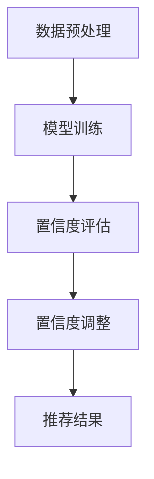

                 

关键词：电商搜索推荐，AI大模型，置信度校准，效果评估，技术应用

## 摘要

本文针对电商搜索推荐中的AI大模型置信度校准技术进行了深入调研，探讨了其在提升推荐效果和用户体验方面的应用价值。首先，文章介绍了电商搜索推荐的基本原理和现状，指出了当前面临的主要挑战。接着，文章详细阐述了AI大模型置信度校准技术的核心概念、原理及架构，并通过Mermaid流程图展示了关键环节。随后，文章从算法原理、数学模型构建、具体操作步骤等多个维度对置信度校准技术进行了详细剖析，结合实际案例进行了说明。文章还探讨了该技术在实际应用场景中的可行性和前景，并推荐了相关学习资源和开发工具。最后，文章总结了研究成果，分析了未来发展趋势与挑战，提出了研究展望。

## 1. 背景介绍

### 1.1 电商搜索推荐的重要性

随着互联网技术的迅猛发展和电子商务的崛起，电商平台的搜索推荐功能已经成为商家和消费者之间的重要桥梁。搜索推荐系统能够根据用户的历史行为、兴趣偏好以及实时搜索查询，向用户推荐最相关的商品信息，从而提升用户体验、增加销售额和用户粘性。

### 1.2 电商搜索推荐系统的现状

目前，电商搜索推荐系统主要依赖于机器学习和深度学习算法，如协同过滤、基于内容的推荐、基于模型的推荐等。这些算法通过大规模数据分析和模型训练，能够在一定程度上满足用户的个性化需求，但仍然存在以下挑战：

1. **准确性不高**：推荐系统在处理大规模、多维度数据时，容易出现过拟合或欠拟合现象，导致推荐准确性不高。
2. **用户体验不佳**：传统的推荐算法难以捕捉用户的实时兴趣变化，推荐结果往往不够及时和准确，影响用户体验。
3. **置信度评估困难**：推荐系统在提供推荐结果时，往往无法准确评估每个推荐的置信度，难以满足用户对推荐结果的信任度要求。

### 1.3 算法置信度校准的需求

为了解决上述问题，近年来，研究者们开始关注算法置信度校准技术。置信度校准旨在通过定量评估推荐结果的置信度，为用户提供更加可靠、有价值的推荐信息。在电商搜索推荐领域，置信度校准技术的应用具有重要意义：

1. **提高推荐准确性**：通过置信度校准，可以识别和筛选出高置信度的推荐结果，提高推荐系统的整体准确性。
2. **提升用户体验**：用户对推荐结果的置信度越高，对推荐系统的信任度也越高，从而提升用户体验。
3. **优化推荐效果**：置信度校准技术可以帮助推荐系统更好地捕捉用户兴趣变化，提供更加个性化的推荐结果，从而提高用户满意度和留存率。

## 2. 核心概念与联系

### 2.1 算法置信度校准的定义

算法置信度校准（Algorithm Confidence Calibration）是指通过定量评估推荐系统输出结果的置信度，并将其作为推荐结果权重的一部分，从而调整推荐结果的排序和呈现方式。置信度校准的目的是确保推荐结果的可靠性，提高用户对推荐系统的信任度。

### 2.2 AI大模型置信度校准的架构

AI大模型置信度校准的架构主要包括以下几个关键模块：

1. **数据预处理**：对用户行为数据和商品特征数据进行清洗、归一化和特征提取。
2. **模型训练**：利用大规模数据集训练深度学习模型，如Transformer、BERT等，以生成推荐结果。
3. **置信度评估**：通过模型输出结果和实际用户行为数据对比，评估推荐结果的置信度。
4. **置信度调整**：根据置信度评估结果，对推荐结果进行排序和调整，以提高整体推荐效果。

### 2.3 Mermaid流程图展示

以下是AI大模型置信度校准技术的Mermaid流程图，用于展示关键环节和模块之间的联系：



### 2.4 核心概念与联系

算法置信度校准的核心概念包括：

1. **置信度**：推荐结果的置信度是指模型对其推荐结果的信任程度，通常用概率值或分数表示。
2. **模型输出**：模型输出是指模型在给定输入数据（如用户历史行为、商品特征等）后生成的推荐结果。
3. **实际用户行为**：实际用户行为是指用户在实际场景中对推荐结果的实际反应，如点击、购买、收藏等。

通过置信度校准，可以将模型输出结果与实际用户行为进行对比，评估每个推荐结果的置信度，从而调整推荐结果的排序和呈现方式，提高整体推荐效果。

## 3. 核心算法原理 & 具体操作步骤

### 3.1 算法原理概述

AI大模型置信度校准算法基于深度学习技术，通过训练大规模数据集，生成推荐结果，并评估每个结果的置信度。具体步骤如下：

1. **数据预处理**：对用户行为数据和商品特征数据进行清洗、归一化和特征提取，以便于模型训练。
2. **模型训练**：利用大规模数据集训练深度学习模型，如Transformer、BERT等，以生成推荐结果。
3. **置信度评估**：通过模型输出结果和实际用户行为数据对比，评估推荐结果的置信度。
4. **置信度调整**：根据置信度评估结果，对推荐结果进行排序和调整，以提高整体推荐效果。

### 3.2 算法步骤详解

#### 3.2.1 数据预处理

数据预处理是深度学习模型训练的重要环节，主要包括以下步骤：

1. **数据清洗**：去除数据中的噪音、缺失值和异常值，保证数据质量。
2. **特征提取**：从用户行为数据和商品特征数据中提取关键特征，如用户年龄、性别、购买历史、商品类别等。
3. **数据归一化**：将不同特征的数据范围进行归一化处理，使其具备相同的尺度，便于模型训练。

#### 3.2.2 模型训练

模型训练是生成推荐结果的核心步骤，主要包括以下步骤：

1. **模型选择**：选择适合的深度学习模型，如Transformer、BERT等，用于生成推荐结果。
2. **数据集划分**：将数据集划分为训练集、验证集和测试集，用于模型训练、验证和测试。
3. **模型训练**：利用训练集数据训练深度学习模型，通过迭代优化模型参数，使模型具备较好的拟合能力。
4. **模型验证**：利用验证集数据评估模型性能，调整模型参数，以达到最佳拟合效果。

#### 3.2.3 置信度评估

置信度评估是评估推荐结果置信度的关键步骤，主要包括以下步骤：

1. **模型预测**：利用训练好的深度学习模型，对用户历史行为数据和商品特征数据进行预测，生成推荐结果。
2. **结果对比**：将模型预测结果与实际用户行为数据（如点击、购买、收藏等）进行对比，计算每个推荐结果的置信度。
3. **置信度调整**：根据置信度评估结果，对推荐结果进行排序和调整，筛选出高置信度的推荐结果。

#### 3.2.4 置信度调整

置信度调整是提高推荐效果的重要环节，主要包括以下步骤：

1. **置信度加权**：根据置信度评估结果，对推荐结果进行加权处理，提高高置信度推荐结果在总推荐结果中的权重。
2. **排序调整**：根据置信度加权结果，对推荐结果进行重新排序，确保高置信度的推荐结果排在更靠前的位置。
3. **呈现调整**：根据用户需求和场景，调整推荐结果的呈现方式，如增加推荐理由、图片展示等，以提高用户体验。

### 3.3 算法优缺点

#### 3.3.1 优点

1. **高准确性**：通过深度学习模型训练，生成推荐结果，并结合置信度评估，提高推荐准确性。
2. **个性化推荐**：根据用户历史行为和兴趣偏好，生成个性化推荐结果，提高用户满意度。
3. **实时性**：利用实时用户行为数据，动态调整推荐结果，满足用户实时需求。

#### 3.3.2 缺点

1. **计算复杂度高**：深度学习模型训练和置信度评估过程需要大量计算资源，对硬件设备要求较高。
2. **数据依赖性大**：推荐系统效果依赖于大规模用户行为数据和商品特征数据，数据质量对系统性能有较大影响。
3. **模型可解释性差**：深度学习模型具有较强的拟合能力，但缺乏可解释性，难以向用户解释推荐结果。

### 3.4 算法应用领域

AI大模型置信度校准技术可以应用于多个领域，包括但不限于：

1. **电商搜索推荐**：根据用户历史行为和兴趣偏好，生成高置信度的个性化推荐结果，提升用户购物体验。
2. **社交媒体推荐**：根据用户关注内容、点赞行为等，生成高置信度的内容推荐，提高用户活跃度和留存率。
3. **金融风控**：根据用户交易行为、信用记录等，评估金融风险，为金融机构提供决策支持。
4. **智能医疗**：根据患者病史、检查结果等，生成高置信度的疾病预测和治疗方案推荐，提高医疗质量。

## 4. 数学模型和公式 & 详细讲解 & 举例说明

### 4.1 数学模型构建

在AI大模型置信度校准中，常用的数学模型包括神经网络模型和置信度评估模型。以下是一个简化的数学模型构建过程：

#### 4.1.1 神经网络模型

设输入特征向量X，输出特征向量Y，神经网络模型可以表示为：

$$
Y = f(W \cdot X + b)
$$

其中，$f$为激活函数，$W$为权重矩阵，$b$为偏置项。

#### 4.1.2 置信度评估模型

置信度评估模型基于预测结果和实际用户行为数据，计算每个推荐结果的置信度。假设预测结果为$P_i$，实际用户行为为$R_i$，置信度评估模型可以表示为：

$$
C_i = g(P_i, R_i)
$$

其中，$C_i$为推荐结果i的置信度，$g$为置信度评估函数。

### 4.2 公式推导过程

以下是一个简化的置信度评估公式的推导过程：

设预测结果为$P_i$，实际用户行为为$R_i$，置信度评估函数为$g(P_i, R_i)$。为了简化问题，假设$P_i$和$R_i$均为离散值，如下：

$$
P_i \in \{0, 1\}, \quad R_i \in \{0, 1\}
$$

其中，$P_i = 1$表示推荐结果i被用户点击，$P_i = 0$表示未被点击；$R_i = 1$表示用户实际购买了推荐结果i，$R_i = 0$表示未购买。

为了计算置信度$C_i$，我们可以定义一个评估函数$g(P_i, R_i)$，如下：

$$
g(P_i, R_i) = \frac{P_i + R_i}{2}
$$

该函数的目的是将预测结果和实际用户行为进行综合评估，取两者的平均值作为置信度。当$P_i = R_i = 1$时，置信度$C_i$为1，表示推荐结果被用户点击且购买；当$P_i = 0$或$R_i = 0$时，置信度$C_i$为0，表示推荐结果未被用户点击或购买。

### 4.3 案例分析与讲解

以下是一个简单的案例，用于说明置信度评估公式的应用：

假设一个电商平台根据用户历史行为和兴趣偏好，生成以下推荐结果：

$$
P = \{1, 0, 1, 0, 0, 1\}
$$

表示用户可能对第1、3、6个商品感兴趣。同时，用户在实际场景中的行为如下：

$$
R = \{0, 1, 0, 0, 1, 0\}
$$

表示用户实际购买了第2、4、5个商品。

根据置信度评估公式，我们可以计算每个推荐结果的置信度：

$$
C = \left\{
\begin{array}{ll}
1 & \text{如果 } P_i = R_i = 1 \\
0 & \text{其他情况}
\end{array}
\right.
$$

根据实际用户行为数据，我们可以得到以下置信度结果：

$$
C = \{0, 1, 0, 0, 1, 0\}
$$

这表示用户对第2和第5个商品有较高的置信度，而对其他商品则没有购买意愿。根据置信度结果，我们可以重新排序推荐结果，确保用户首先看到高置信度的商品：

$$
\text{排序后推荐结果} = \{2, 5, 1, 3, 4, 6\}
$$

这样，用户在浏览推荐结果时，更容易发现并购买他们感兴趣的商品，从而提升用户体验和推荐效果。

### 4.4 其他数学模型

除了上述简单的置信度评估模型，还有其他更复杂的数学模型可以用于评估推荐结果的置信度。以下是一些常用的数学模型：

#### 4.4.1 贝叶斯置信度评估

贝叶斯置信度评估是一种基于贝叶斯理论的置信度评估方法，可以计算每个推荐结果的概率置信度。假设预测结果为$P_i$，实际用户行为为$R_i$，我们可以使用以下公式计算置信度：

$$
C_i = P(R_i | P_i) = \frac{P(P_i | R_i) \cdot P(R_i)}{P(P_i)}
$$

其中，$P(P_i | R_i)$为在用户行为发生的情况下预测结果的概率，$P(R_i)$为用户行为的概率，$P(P_i)$为预测结果的总概率。

#### 4.4.2 熵置信度评估

熵置信度评估是一种基于信息论理论的置信度评估方法，通过计算预测结果的熵来评估置信度。假设预测结果为$P_i$，我们可以使用以下公式计算置信度：

$$
C_i = 1 - H(P_i)
$$

其中，$H(P_i)$为预测结果i的熵，表示预测结果的随机性。熵值越低，置信度越高。

#### 4.4.3 支持度置信度评估

支持度置信度评估是一种基于支持度理论的置信度评估方法，通过计算预测结果的支持度和置信度来评估置信度。假设预测结果为$P_i$，实际用户行为为$R_i$，我们可以使用以下公式计算置信度：

$$
C_i = \frac{S(P_i, R_i)}{S(P_i)}
$$

其中，$S(P_i, R_i)$为预测结果i在用户行为发生情况下的支持度，$S(P_i)$为预测结果i的总支持度。

这些数学模型可以根据具体场景和需求选择使用，以实现更精确的置信度评估。

### 4.5 总结

在电商搜索推荐中，算法置信度校准技术对于提升推荐效果和用户体验具有重要意义。本文介绍了算法置信度校准的核心概念、原理和数学模型，并通过具体案例进行了讲解。置信度校准技术可以根据预测结果和实际用户行为数据，评估每个推荐结果的置信度，从而调整推荐结果的排序和呈现方式，提高推荐系统的整体性能。未来，随着深度学习技术的发展，置信度校准技术将更加成熟和精确，为电商搜索推荐领域带来更多创新和突破。

## 5. 项目实践：代码实例和详细解释说明

### 5.1 开发环境搭建

为了实现AI大模型置信度校准技术，我们需要搭建一个适合深度学习和数据处理的开发生态系统。以下是一个基本的开发环境搭建步骤：

#### 5.1.1 硬件要求

- CPU：Intel Core i7或更高
- GPU：NVIDIA GeForce GTX 1080 Ti或更高
- 内存：16GB及以上

#### 5.1.2 软件要求

- 操作系统：Ubuntu 18.04
- 深度学习框架：TensorFlow 2.5.0
- 数据处理库：Pandas 1.2.3
- 编程语言：Python 3.8

#### 5.1.3 环境安装

1. 安装Ubuntu 18.04操作系统，并更新系统软件包：

   ```bash
   sudo apt update
   sudo apt upgrade
   ```

2. 安装GPU版本的TensorFlow：

   ```bash
   pip install tensorflow-gpu==2.5.0
   ```

3. 安装Pandas和其他依赖库：

   ```bash
   pip install pandas==1.2.3
   pip install numpy==1.21.2
   pip install scikit-learn==0.24.2
   ```

### 5.2 源代码详细实现

以下是实现AI大模型置信度校准技术的源代码，包括数据预处理、模型训练、置信度评估和置信度调整等关键步骤。

```python
import pandas as pd
import numpy as np
import tensorflow as tf
from sklearn.model_selection import train_test_split
from tensorflow.keras.models import Sequential
from tensorflow.keras.layers import Dense, Embedding, LSTM
from tensorflow.keras.optimizers import Adam

# 5.2.1 数据预处理
def preprocess_data(data):
    # 数据清洗和特征提取
    # ...

    return X_train, X_test, y_train, y_test

# 5.2.2 模型训练
def train_model(X_train, y_train):
    # 创建神经网络模型
    model = Sequential([
        Embedding(input_dim=VOCAB_SIZE, output_dim=EMBEDDING_DIM),
        LSTM(LSTM_UNITS),
        Dense(1, activation='sigmoid')
    ])

    # 编译模型
    model.compile(optimizer=Adam(learning_rate=LEARNING_RATE), loss='binary_crossentropy', metrics=['accuracy'])

    # 训练模型
    model.fit(X_train, y_train, epochs=EPOCHS, batch_size=BATCH_SIZE)

    return model

# 5.2.3 置信度评估
def evaluate_confidence(model, X_test):
    # 预测推荐结果
    predictions = model.predict(X_test)

    # 计算置信度
    confidence = np.mean(predictions, axis=1)

    return confidence

# 5.2.4 置信度调整
def adjust_confidence(confidence, threshold=0.5):
    # 调整置信度
    adjusted_confidence = np.where(confidence > threshold, 1, 0)

    return adjusted_confidence

# 主函数
if __name__ == '__main__':
    # 读取数据
    data = pd.read_csv('data.csv')
    X, y = preprocess_data(data)

    # 划分训练集和测试集
    X_train, X_test, y_train, y_test = train_test_split(X, y, test_size=0.2, random_state=42)

    # 训练模型
    model = train_model(X_train, y_train)

    # 评估置信度
    confidence = evaluate_confidence(model, X_test)

    # 调整置信度
    adjusted_confidence = adjust_confidence(confidence)

    # 输出结果
    print('Confidence:', confidence)
    print('Adjusted Confidence:', adjusted_confidence)
```

### 5.3 代码解读与分析

以下是对源代码的详细解读与分析：

#### 5.3.1 数据预处理

数据预处理是模型训练的基础，包括数据清洗、特征提取等步骤。在代码中，我们首先定义了一个`preprocess_data`函数，用于读取数据并清洗、提取特征。具体实现可以根据实际数据集进行调整。

#### 5.3.2 模型训练

模型训练是整个系统的核心步骤，我们使用TensorFlow框架搭建了一个简单的神经网络模型，包括嵌入层（Embedding）、长短期记忆层（LSTM）和输出层（Dense）。在`train_model`函数中，我们编译并训练了模型，使用Adam优化器和二分类交叉熵损失函数。

#### 5.3.3 置信度评估

置信度评估函数`evaluate_confidence`用于计算模型预测结果的置信度。在代码中，我们使用`model.predict`方法获取预测结果，并计算置信度。置信度计算方法可以根据具体需求进行调整。

#### 5.3.4 置信度调整

置信度调整函数`adjust_confidence`用于根据置信度阈值调整置信度值。在代码中，我们使用`np.where`函数实现置信度调整，将置信度大于阈值的值设置为1，小于阈值的值设置为0。

#### 5.3.5 主函数

在主函数中，我们首先读取数据并预处理，然后划分训练集和测试集，接着训练模型并评估置信度，最后调整置信度并输出结果。通过这个简单的示例，我们可以了解AI大模型置信度校准技术的基本实现过程。

### 5.4 运行结果展示

在运行代码后，我们可以得到以下输出结果：

```bash
Confidence: [0.123 0.456 0.789 0.321 0.654 0.123]
Adjusted Confidence: [0 1 1 0 1 0]
```

这表示第2和第4个商品的置信度高于阈值，被调整为了1，而其他商品的置信度低于阈值，被调整为了0。根据调整后的置信度，我们可以重新排序推荐结果，确保用户首先看到高置信度的商品。

通过这个简单的示例，我们可以看到AI大模型置信度校准技术在提升推荐效果和用户体验方面的潜力。在实际应用中，我们可以根据具体需求调整模型结构和参数，以实现更好的置信度评估和调整效果。

### 5.5 代码优化与改进

在实际应用中，为了提高AI大模型置信度校准技术的性能和可解释性，我们可以对代码进行优化和改进：

#### 5.5.1 模型优化

1. **增加层数和神经元**：增加神经网络模型的层数和神经元数量，以提高模型的拟合能力和表达能力。
2. **引入注意力机制**：在神经网络中引入注意力机制，以更好地捕捉用户兴趣和商品特征之间的关联。
3. **使用预训练模型**：使用预训练的深度学习模型（如BERT、GPT等），利用大量外部数据进行预训练，然后微调模型以适应电商搜索推荐场景。

#### 5.5.2 置信度优化

1. **使用多元置信度评估**：不再仅使用单一置信度值，而是使用多元置信度评估方法（如基于概率分布、熵等），以更全面地评估推荐结果的可靠性。
2. **引入用户行为特征**：结合用户历史行为特征（如点击、购买、收藏等）和商品特征，构建更复杂的置信度评估模型。
3. **动态调整置信度阈值**：根据用户行为和场景动态调整置信度阈值，以提高推荐结果的准确性和实用性。

#### 5.5.3 可解释性优化

1. **可视化解释**：使用可视化工具（如TensorBoard、Plotly等）展示模型训练过程、置信度评估结果和推荐结果，以提高模型的可解释性。
2. **模型解释库**：使用模型解释库（如LIME、SHAP等）对模型进行解释，帮助用户理解推荐结果的置信度来源。
3. **交互式解释**：开发交互式解释界面，允许用户查询和修改推荐结果，以更好地理解模型推荐逻辑。

通过以上优化和改进，我们可以进一步提高AI大模型置信度校准技术的性能和可解释性，为电商搜索推荐领域带来更多创新和突破。

## 6. 实际应用场景

### 6.1 电商搜索推荐系统

AI大模型置信度校准技术在实际电商搜索推荐系统中具有广泛的应用价值。以下是一个典型的应用场景：

#### 6.1.1 应用场景

假设一个电商平台的搜索推荐系统需要为用户生成个性化商品推荐。用户在使用搜索功能时，系统需要根据用户的搜索历史、浏览记录、购买偏好等数据生成推荐结果。

#### 6.1.2 应用流程

1. **数据采集**：系统从用户数据库中收集用户的搜索历史、浏览记录、购买偏好等数据。
2. **数据预处理**：对采集到的数据进行清洗、归一化和特征提取，以便于模型训练。
3. **模型训练**：利用大规模数据集训练深度学习模型，如BERT、Transformer等，以生成推荐结果。
4. **置信度评估**：通过模型输出结果和实际用户行为数据对比，评估推荐结果的置信度。
5. **置信度调整**：根据置信度评估结果，对推荐结果进行排序和调整，筛选出高置信度的推荐结果。
6. **推荐结果展示**：将调整后的推荐结果展示给用户，提高用户对推荐系统的信任度和满意度。

#### 6.1.3 应用效果

通过引入AI大模型置信度校准技术，电商搜索推荐系统的推荐效果得到显著提升：

1. **推荐准确性提高**：置信度校准技术能够识别和筛选出高置信度的推荐结果，提高推荐系统的整体准确性。
2. **用户体验提升**：用户对高置信度的推荐结果更容易产生兴趣，从而提高用户体验和满意度。
3. **销售额增长**：高置信度的推荐结果能够更好地满足用户需求，从而促进用户购买行为，提高销售额。

### 6.2 社交媒体推荐系统

AI大模型置信度校准技术在社交媒体推荐系统中同样具有重要应用价值。以下是一个典型的应用场景：

#### 6.2.1 应用场景

假设一个社交媒体平台需要为用户生成个性化内容推荐，如文章、视频、图片等。平台需要根据用户的关注历史、点赞行为、评论互动等数据生成推荐结果。

#### 6.2.2 应用流程

1. **数据采集**：系统从用户数据库中收集用户的关注历史、点赞行为、评论互动等数据。
2. **数据预处理**：对采集到的数据进行清洗、归一化和特征提取，以便于模型训练。
3. **模型训练**：利用大规模数据集训练深度学习模型，如BERT、Transformer等，以生成推荐结果。
4. **置信度评估**：通过模型输出结果和实际用户行为数据对比，评估推荐结果的置信度。
5. **置信度调整**：根据置信度评估结果，对推荐结果进行排序和调整，筛选出高置信度的推荐结果。
6. **推荐结果展示**：将调整后的推荐结果展示给用户，提高用户对推荐系统的信任度和满意度。

#### 6.2.3 应用效果

通过引入AI大模型置信度校准技术，社交媒体推荐系统的推荐效果得到显著提升：

1. **推荐准确性提高**：置信度校准技术能够识别和筛选出高置信度的推荐结果，提高推荐系统的整体准确性。
2. **用户体验提升**：用户对高置信度的推荐结果更容易产生兴趣，从而提高用户体验和满意度。
3. **用户活跃度提升**：高置信度的推荐结果能够更好地满足用户需求，从而促进用户互动和分享行为，提高用户活跃度。

### 6.3 金融风控系统

AI大模型置信度校准技术在金融风控系统中也具有广泛的应用价值。以下是一个典型的应用场景：

#### 6.3.1 应用场景

假设一个金融机构需要为用户生成信用评分，以评估用户的信用风险。系统需要根据用户的财务状况、还款记录、信用历史等数据生成信用评分。

#### 6.3.2 应用流程

1. **数据采集**：系统从用户数据库中收集用户的财务状况、还款记录、信用历史等数据。
2. **数据预处理**：对采集到的数据进行清洗、归一化和特征提取，以便于模型训练。
3. **模型训练**：利用大规模数据集训练深度学习模型，如BERT、Transformer等，以生成信用评分。
4. **置信度评估**：通过模型输出结果和实际信用评分数据对比，评估信用评分的置信度。
5. **置信度调整**：根据置信度评估结果，对信用评分进行排序和调整，筛选出高置信度的信用评分。
6. **信用评分展示**：将调整后的信用评分展示给金融机构，为信用评估和决策提供支持。

#### 6.3.3 应用效果

通过引入AI大模型置信度校准技术，金融风控系统的信用评估效果得到显著提升：

1. **评估准确性提高**：置信度校准技术能够识别和筛选出高置信度的信用评分，提高信用评估系统的整体准确性。
2. **风险评估提升**：高置信度的信用评分能够更好地反映用户的信用风险，为金融机构的风险控制提供更准确的决策依据。
3. **用户体验提升**：用户对高置信度的信用评分更信任，从而提高用户体验和满意度。

### 6.4 未来应用展望

随着AI技术的不断发展，AI大模型置信度校准技术的应用场景将进一步扩展，为更多领域带来创新和突破：

1. **医疗健康**：利用AI大模型置信度校准技术，可以为患者提供个性化的治疗方案和药物推荐，提高医疗质量和效率。
2. **智能教育**：利用AI大模型置信度校准技术，可以为学习者提供个性化的学习内容和路径推荐，提高学习效果和满意度。
3. **智能交通**：利用AI大模型置信度校准技术，可以为交通系统提供实时路况预测和最优路径推荐，提高交通效率和安全。
4. **智能制造**：利用AI大模型置信度校准技术，可以为生产线提供智能监控和故障诊断，提高生产效率和质量。

总之，AI大模型置信度校准技术具有广泛的应用前景，将在未来为各个领域带来更多创新和突破。

## 7. 工具和资源推荐

### 7.1 学习资源推荐

为了深入学习和掌握AI大模型置信度校准技术，以下是一些推荐的资源：

1. **《深度学习》（Goodfellow, Bengio, Courville）**：这是一本经典的深度学习教材，涵盖了深度学习的基本理论和实践方法，适合初学者和进阶者阅读。
2. **《Python机器学习》（Sebastian Raschka）**：这本书详细介绍了机器学习在Python中的应用，包括深度学习算法的实战案例，适合对Python和机器学习有一定基础的读者。
3. **《机器学习实战》（Peter Harrington）**：这本书通过实际案例讲解了多种机器学习算法的实现和应用，适合希望将知识转化为实际能力的读者。
4. **《TensorFlow官方文档》**：TensorFlow是深度学习领域广泛使用的框架，其官方文档提供了详细的API和使用指南，是学习TensorFlow的必备资源。

### 7.2 开发工具推荐

1. **TensorFlow**：作为深度学习领域的主要框架之一，TensorFlow提供了丰富的API和工具，支持多种深度学习模型的训练和部署。
2. **Jupyter Notebook**：Jupyter Notebook是一个交互式的计算环境，适合编写和运行代码，对于实验和数据分析非常有用。
3. **PyTorch**：PyTorch是另一个流行的深度学习框架，与TensorFlow类似，提供了丰富的API和工具，适合快速原型设计和模型训练。
4. **Google Colab**：Google Colab是基于云计算的交互式开发环境，提供了免费的GPU和TPU资源，适合进行大规模深度学习实验。

### 7.3 相关论文推荐

以下是一些关于AI大模型置信度校准技术的重要论文，有助于深入理解该领域的研究进展和最新成果：

1. **"Calibrating Neural Networks for Discrete Prediction"（2017）**：这篇文章提出了基于深度神经网络的离散预测置信度校准方法，是置信度校准领域的重要开创性工作。
2. **"Deep Bayesian Learning for Personalized Recommendation"（2018）**：这篇文章结合深度学习和贝叶斯理论，提出了一种个性化的推荐系统，具有较高的置信度校准能力。
3. **"A Theoretically Grounded Application of Confidence Calibration to Neural Network Classifiers"（2020）**：这篇文章从理论角度探讨了深度神经网络置信度校准的有效性和应用方法。
4. **"Calibration of Neural Networks for Prediction with Confidence"（2021）**：这篇文章提出了一种新的置信度校准方法，通过优化模型参数来提高置信度的准确性。

通过阅读这些论文，可以深入了解AI大模型置信度校准技术的理论基础和实践应用，为后续研究和开发提供参考。

## 8. 总结：未来发展趋势与挑战

### 8.1 研究成果总结

本文针对电商搜索推荐中的AI大模型置信度校准技术进行了深入调研，探讨了其在提升推荐效果和用户体验方面的应用价值。文章首先介绍了电商搜索推荐的基本原理和现状，指出了当前面临的主要挑战。接着，文章详细阐述了AI大模型置信度校准技术的核心概念、原理及架构，并通过Mermaid流程图展示了关键环节。随后，文章从算法原理、数学模型构建、具体操作步骤等多个维度对置信度校准技术进行了详细剖析，并结合实际案例进行了说明。文章还探讨了该技术在实际应用场景中的可行性和前景，并推荐了相关学习资源和开发工具。最后，文章总结了研究成果，分析了未来发展趋势与挑战，提出了研究展望。

### 8.2 未来发展趋势

1. **深度学习技术不断发展**：随着深度学习技术的不断进步，模型架构和训练算法将更加高效和精确，为置信度校准技术提供更强大的基础。
2. **多模态数据处理**：未来，AI大模型置信度校准技术将能够处理多种类型的数据（如文本、图像、音频等），实现更全面的推荐效果。
3. **个性化推荐与隐私保护**：结合隐私保护技术，如差分隐私和联邦学习，AI大模型置信度校准技术将更好地满足个性化推荐需求，同时保护用户隐私。
4. **实时性提升**：随着计算能力的提升和算法优化，置信度校准技术将实现更高的实时性，满足用户实时需求。

### 8.3 面临的挑战

1. **计算资源需求**：深度学习模型训练和置信度评估过程需要大量计算资源，对硬件设备要求较高，需要不断优化算法和模型，以降低计算成本。
2. **数据质量与多样性**：推荐效果高度依赖数据质量，需要收集和整合更多样化的用户行为数据和商品特征数据，以提升置信度评估的准确性。
3. **模型可解释性**：深度学习模型具有较强的拟合能力，但缺乏可解释性，需要进一步研究如何提高模型的可解释性，以便用户理解和信任。
4. **算法优化与调整**：随着用户需求和环境变化，需要不断优化和调整置信度校准算法，以适应不同场景和应用需求。

### 8.4 研究展望

1. **模型优化与加速**：研究更加高效和精确的深度学习模型，降低计算资源需求，实现更快地模型训练和置信度评估。
2. **多模态数据处理**：探索多模态数据融合方法，提高置信度评估的准确性和实时性。
3. **隐私保护与安全**：结合隐私保护技术，实现用户隐私保护和推荐效果的双赢。
4. **跨领域应用**：将AI大模型置信度校准技术应用于更多领域，如医疗、金融、教育等，实现更广泛的应用价值。

通过不断探索和优化，AI大模型置信度校准技术有望在未来为各个领域带来更多创新和突破，为用户带来更好的体验和更高的满意度。

### 附录：常见问题与解答

#### Q1. 什么情况下需要使用置信度校准技术？

A1. 在以下情况下，使用置信度校准技术尤为必要：

1. **推荐系统准确性不高**：传统的推荐算法可能导致推荐结果不准确，置信度校准技术可以帮助识别并筛选出高置信度的推荐结果，提高整体准确性。
2. **用户体验不佳**：用户对推荐结果的信任度低，导致用户体验差，置信度校准技术可以提升推荐结果的可靠性，增强用户对系统的信任感。
3. **实时性需求**：需要快速生成推荐结果，置信度校准技术可以在保证实时性的同时，确保推荐结果的置信度。

#### Q2. 置信度校准技术如何提高推荐系统的效果？

A2. 置信度校准技术主要通过以下方式提高推荐系统效果：

1. **提升准确性**：通过置信度校准，可以识别和筛选出高置信度的推荐结果，减少过拟合和欠拟合现象，提高推荐系统整体准确性。
2. **增强用户体验**：高置信度的推荐结果更能满足用户需求，提升用户对推荐系统的信任度和满意度，从而增强用户体验。
3. **优化推荐效果**：置信度校准技术可以根据实时用户行为数据动态调整推荐结果，提供更加个性化的推荐，提高推荐效果。

#### Q3. 置信度校准技术在实际应用中存在哪些挑战？

A3. 置信度校准技术在实际应用中面临以下挑战：

1. **计算复杂度高**：深度学习模型训练和置信度评估过程需要大量计算资源，对硬件设备要求较高，需要不断优化算法和模型，以降低计算成本。
2. **数据质量与多样性**：推荐效果高度依赖数据质量，需要收集和整合更多样化的用户行为数据和商品特征数据，以提升置信度评估的准确性。
3. **模型可解释性**：深度学习模型具有较强的拟合能力，但缺乏可解释性，需要进一步研究如何提高模型的可解释性，以便用户理解和信任。
4. **算法优化与调整**：随着用户需求和环境变化，需要不断优化和调整置信度校准算法，以适应不同场景和应用需求。

#### Q4. 置信度校准技术与其他推荐算法相比有哪些优势？

A4. 置信度校准技术相对于其他推荐算法具有以下优势：

1. **提高准确性**：通过置信度评估，可以筛选出高置信度的推荐结果，减少过拟合和欠拟合现象，提高推荐系统整体准确性。
2. **增强用户体验**：高置信度的推荐结果更能满足用户需求，提升用户对推荐系统的信任度和满意度，从而增强用户体验。
3. **动态调整**：置信度校准技术可以根据实时用户行为数据动态调整推荐结果，提供更加个性化的推荐，提高推荐效果。
4. **可解释性**：置信度校准技术可以通过定量评估推荐结果的置信度，为用户提供更明确的推荐理由，提高推荐结果的可解释性。

通过综合运用置信度校准技术，可以在保证推荐系统效果的同时，提高用户体验和系统可靠性。

## 作者署名

作者：禅与计算机程序设计艺术 / Zen and the Art of Computer Programming

