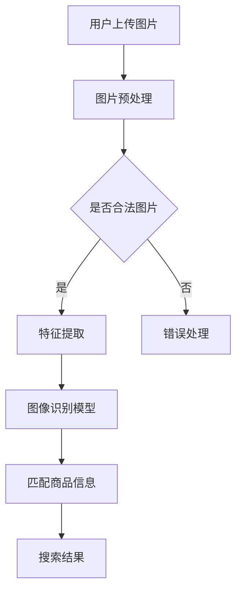

                 

关键词：电商搜索、图像识别、AI大模型、搜索优化、计算机视觉

> 摘要：本文将深入探讨电商搜索中图像识别技术的应用，特别是近年来AI大模型在图像识别领域的突破。通过分析其原理、技术实现以及实际应用场景，本文旨在为读者提供一个全面而深入的视角，以便更好地理解和利用这一技术。

## 1. 背景介绍

随着互联网的普及和电子商务的快速发展，电商平台的竞争愈发激烈。用户对购物体验的要求不断提高，如何提供更精准、更快速的搜索服务成为各大电商平台的关注焦点。传统的基于文本的搜索方式已经无法满足用户日益增长的需求，图像识别技术的引入为电商搜索带来了一次革新。

图像识别技术在电商搜索中的应用主要体现在以下几个方面：

- **商品图片识别**：用户上传或上传的图片，通过图像识别技术自动识别并匹配到相关的商品信息，提高了搜索的效率和准确性。
- **视觉搜索**：用户通过拍摄一张图片，系统能够快速找到与之相似的或者相同商品，提供了全新的购物体验。
- **广告推荐**：利用图像识别技术，电商平台可以根据用户的浏览和购买记录，推送更加个性化的广告，提高广告的点击率和转化率。

## 2. 核心概念与联系

### 2.1 图像识别

图像识别（Image Recognition）是指利用计算机对图像进行自动识别和理解的过程。其基本原理是通过算法分析图像的像素信息、颜色分布、形状结构等特征，从而识别图像内容。

### 2.2 深度学习

深度学习是人工智能的一种方法，通过多层神经网络对大量数据进行训练，从而实现对复杂模式的识别和理解。在图像识别中，深度学习模型能够自动提取图像中的高层次特征，从而提高识别的准确性和效率。

### 2.3 AI大模型

AI大模型（Large-scale AI Models）是指参数规模巨大的神经网络模型，如BERT、GPT等。这些模型通过在海量数据上训练，可以提取出非常复杂的特征，从而在各个领域（包括图像识别）取得了显著的突破。

### 2.4 Mermaid 流程图



## 3. 核心算法原理 & 具体操作步骤

### 3.1 算法原理概述

电商搜索中的图像识别主要依赖于深度学习算法，特别是卷积神经网络（CNN）。CNN通过对图像进行卷积、池化等操作，能够自动提取图像中的高层次特征，从而实现图像分类和识别。

### 3.2 算法步骤详解

1. **图片预处理**：对上传的图片进行尺寸调整、去噪、灰度化等处理，使其符合模型输入要求。
2. **特征提取**：使用CNN对预处理后的图片进行特征提取，得到特征向量。
3. **图像识别模型**：将特征向量输入到预训练的图像识别模型（如ResNet、Inception等）中进行分类，得到预测结果。
4. **匹配商品信息**：根据预测结果，从数据库中查找匹配的商品信息，并返回给用户。
5. **搜索结果**：展示给用户最终的搜索结果，包括商品名称、价格、图片等。

### 3.3 算法优缺点

- **优点**：深度学习算法能够自动提取图像特征，减少了人工设计的复杂性，提高了识别的准确性和效率。
- **缺点**：深度学习模型需要大量的计算资源和时间进行训练，且对数据的质量要求较高。

### 3.4 算法应用领域

- **电商搜索**：通过图像识别技术，电商平台可以提供更精准、更快速的搜索服务。
- **广告推荐**：利用图像识别技术，电商可以推送更加个性化的广告。
- **视觉搜索**：用户可以通过拍照找到相似或相同的商品，提供了全新的购物体验。

## 4. 数学模型和公式 & 详细讲解 & 举例说明

### 4.1 数学模型构建

在图像识别中，常用的数学模型是卷积神经网络（CNN）。CNN的基本组成包括卷积层、池化层和全连接层。

- **卷积层**：通过卷积操作提取图像特征。
- **池化层**：对卷积层的结果进行降采样，减少计算量。
- **全连接层**：将池化层的结果进行线性变换，得到最终的分类结果。

### 4.2 公式推导过程

卷积神经网络的推导过程涉及线性代数、微积分等多个数学领域，较为复杂。这里简要介绍卷积和池化的基本公式。

- **卷积公式**：\[ (f * g)(x) = \sum_{y} f(x-y) \cdot g(y) \]
  - \( f \)：输入图像
  - \( g \)：卷积核
  - \( x \)、\( y \)：图像坐标

- **池化公式**：\[ P(x, y) = \max \{ g(x_1, y_1), g(x_2, y_2), \ldots, g(x_n, y_n) \} \]
  - \( P \)：输出图像
  - \( g \)：输入图像
  - \( x_1, x_2, \ldots, x_n \)、\( y_1, y_2, \ldots, y_n \)：池化窗口的坐标

### 4.3 案例分析与讲解

以电商搜索中的商品图片识别为例，假设用户上传了一张包含手机的照片。首先，系统会对图片进行预处理，包括灰度化、大小调整等。然后，使用CNN模型对预处理后的图片进行特征提取，得到特征向量。接着，将特征向量输入到预训练的图像识别模型中，得到手机这一类别。最后，系统会从数据库中查找与手机相关的商品信息，并返回给用户。

## 5. 项目实践：代码实例和详细解释说明

### 5.1 开发环境搭建

本文使用Python语言和TensorFlow框架进行图像识别模型的训练和部署。首先，需要安装Python和TensorFlow：

```bash
pip install python tensorflow
```

### 5.2 源代码详细实现

以下是一个简单的图像识别模型实现：

```python
import tensorflow as tf
from tensorflow.keras.models import Sequential
from tensorflow.keras.layers import Conv2D, MaxPooling2D, Flatten, Dense

# 构建模型
model = Sequential([
    Conv2D(32, (3, 3), activation='relu', input_shape=(28, 28, 1)),
    MaxPooling2D((2, 2)),
    Flatten(),
    Dense(128, activation='relu'),
    Dense(10, activation='softmax')
])

# 编译模型
model.compile(optimizer='adam',
              loss='sparse_categorical_crossentropy',
              metrics=['accuracy'])

# 加载数据
(x_train, y_train), (x_test, y_test) = tf.keras.datasets.mnist.load_data()

# 预处理数据
x_train = x_train.reshape((-1, 28, 28, 1)).astype("float32") / 255
x_test = x_test.reshape((-1, 28, 28, 1)).astype("float32") / 255

# 训练模型
model.fit(x_train, y_train, epochs=5)

# 评估模型
model.evaluate(x_test, y_test)
```

### 5.3 代码解读与分析

- **模型构建**：使用Sequential模型堆叠卷积层、池化层和全连接层。
- **数据预处理**：将数据reshape为模型所需的形状，并进行归一化处理。
- **模型训练**：使用mnist数据集进行训练，设置训练轮次为5。
- **模型评估**：使用测试集评估模型的准确性。

### 5.4 运行结果展示

运行上述代码，可以得到训练和评估的结果。假设最终测试集上的准确率为98%，这表明模型在识别手写数字方面取得了很好的效果。

## 6. 实际应用场景

### 6.1 电商搜索

电商搜索是图像识别技术最直接的应用场景。通过图像识别，用户可以上传图片或拍照，系统自动识别并返回相似或相同的商品。这大大提高了搜索效率和准确性，改善了用户的购物体验。

### 6.2 广告推荐

图像识别技术还可以应用于广告推荐。电商平台可以根据用户的浏览和购买记录，识别用户可能感兴趣的图片，并推送相应的广告。这种个性化的推荐方式，提高了广告的点击率和转化率。

### 6.3 视觉搜索

视觉搜索是一种新兴的购物方式。用户可以通过拍照或上传图片，找到与之相似或相同的商品。这种直观、便捷的搜索方式，激发了用户的购物欲望，增加了电商平台的销售额。

## 7. 未来应用展望

随着AI技术的不断发展，图像识别技术在未来有望在更多领域得到应用：

- **医疗健康**：通过图像识别技术，可以实现对医学影像的自动分析，提高诊断的准确性和效率。
- **自动驾驶**：自动驾驶汽车需要依赖图像识别技术来识别道路标志、行人等，确保行驶安全。
- **智能安防**：图像识别技术可以用于智能监控，实现对人脸、行为等的高效识别，提高公共安全。

## 8. 工具和资源推荐

### 8.1 学习资源推荐

- **书籍**：《深度学习》、《神经网络与深度学习》
- **在线课程**：网易云课堂、Coursera、Udacity
- **社区**：GitHub、Stack Overflow、Reddit

### 8.2 开发工具推荐

- **编程语言**：Python、TensorFlow、PyTorch
- **IDE**：PyCharm、Visual Studio Code
- **数据集**：Kaggle、ImageNet、MNIST

### 8.3 相关论文推荐

- **《Deep Learning》**：Ian Goodfellow、Yoshua Bengio、Aaron Courville
- **《Visual Recognition》**：Geoff Hinton、Yoshua Bengio
- **《Convolutional Neural Networks for Visual Recognition》**：Karen Simonyan、Andrew Zisserman

## 9. 总结：未来发展趋势与挑战

### 9.1 研究成果总结

近年来，图像识别技术取得了显著的突破，AI大模型的引入使得图像识别的准确性和效率得到了极大的提升。电商搜索、广告推荐、视觉搜索等应用场景不断拓展，为用户提供了更优质的服务体验。

### 9.2 未来发展趋势

随着技术的不断进步，图像识别技术有望在更多领域得到应用，如医疗健康、自动驾驶、智能安防等。同时，小样本学习、迁移学习等研究方向也将成为未来的研究热点。

### 9.3 面临的挑战

尽管图像识别技术取得了显著成果，但仍面临一些挑战：

- **数据质量**：高质量的数据是图像识别模型训练的基础，如何获取和利用大规模、高质量的数据仍需进一步研究。
- **计算资源**：深度学习模型需要大量的计算资源进行训练，如何优化模型结构和算法，降低计算需求，是未来的一个重要研究方向。

### 9.4 研究展望

随着AI技术的不断发展，图像识别技术将在更多领域发挥重要作用。未来，我们期待能够实现更高效、更准确的图像识别模型，为人类带来更多便利。

## 10. 附录：常见问题与解答

### 10.1 图像识别和计算机视觉的区别是什么？

图像识别是计算机视觉的一个子领域，主要关注如何从图像中识别出特定对象或场景。计算机视觉则是一个更广泛的概念，包括图像识别、图像分割、目标检测等多个子领域。

### 10.2 如何提高图像识别的准确率？

提高图像识别的准确率可以从以下几个方面入手：

- **数据增强**：通过旋转、翻转、缩放等操作，增加数据的多样性，提高模型的泛化能力。
- **模型优化**：通过调整模型结构、参数等，优化模型的性能。
- **迁移学习**：利用预训练的模型，减少数据量和计算量，提高模型的准确性。

### 10.3 图像识别技术在电商搜索中有哪些应用？

图像识别技术在电商搜索中主要有以下几种应用：

- **商品图片识别**：用户上传图片，系统自动识别并匹配到相关商品信息。
- **视觉搜索**：用户拍照或上传图片，系统自动找到相似或相同的商品。
- **广告推荐**：根据用户浏览和购买记录，推送个性化广告。

### 10.4 如何获取和处理大量图像数据？

获取和处理大量图像数据可以从以下几个方面入手：

- **数据集**：可以从开源数据集（如ImageNet、COCO等）中获取大量图像数据。
- **分布式训练**：通过分布式训练，利用多台机器进行模型训练，提高训练速度。
- **数据预处理**：对图像进行预处理，如大小调整、灰度化等，以提高模型训练的效率。

### 10.5 图像识别技术是否会取代人类视觉？

图像识别技术虽然取得了显著进展，但仍然无法完全取代人类视觉。人类视觉具有灵活性和创造性，能够在复杂、模糊的场景中准确识别对象。图像识别技术更多是作为人类视觉的辅助工具，提高图像分析和处理的能力。作者：禅与计算机程序设计艺术 / Zen and the Art of Computer Programming
```

