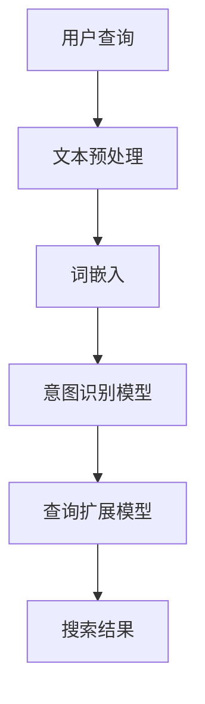

                 

随着互联网的快速发展，电商行业已经成为全球经济的支柱产业之一。电商平台的繁荣带来了大量的用户数据，这些数据中蕴含着用户的需求和意图。如何高效地理解用户的查询意图，并提供准确的搜索结果，成为电商搜索领域的研究热点。本文将探讨电商搜索中的意图识别与查询扩展技术，介绍AI大模型在这一领域的新突破，并分析其应用前景。

## 1. 背景介绍

在过去，电商搜索主要依赖于关键词匹配技术。这种方法简单高效，但往往无法满足用户多样化的需求。随着深度学习和自然语言处理技术的进步，意图识别与查询扩展技术应运而生。这些技术能够更准确地理解用户的查询意图，并提供个性化的搜索结果，从而提升用户体验。

意图识别（Intent Recognition）是指从用户输入的查询中提取出用户的目的。例如，用户输入“买一部手机”，意图识别技术需要判断用户是想要购买手机、询问手机价格还是查询手机品牌。

查询扩展（Query Expansion）是指在用户查询的基础上，根据用户的意图和上下文信息，自动扩展查询词汇，从而提高搜索结果的准确性和多样性。

近年来，AI大模型在意图识别与查询扩展领域取得了显著进展。这些模型能够处理大规模的文本数据，通过自学习机制提取出隐藏在文本中的用户意图和关键词，从而为电商搜索提供更精准的支持。

## 2. 核心概念与联系

在探讨电商搜索的意图识别与查询扩展之前，我们需要了解一些核心概念和它们之间的联系。

### 2.1 文本数据预处理

文本数据预处理是进行意图识别与查询扩展的基础步骤。这一步骤包括分词、词性标注、命名实体识别等。这些操作有助于提取文本中的关键信息，为后续的模型训练提供高质量的数据。

### 2.2 词嵌入

词嵌入（Word Embedding）是将文本数据转化为数值向量的技术。通过词嵌入，我们可以将语义相似的词汇映射到相近的向量空间中。这一步骤对于理解文本数据中的语义信息至关重要。

### 2.3 意图识别模型

意图识别模型负责从用户查询中提取出用户的意图。常见的意图识别模型包括循环神经网络（RNN）、长短期记忆网络（LSTM）和变换器（Transformer）等。

### 2.4 查询扩展模型

查询扩展模型负责根据用户的意图和上下文信息，自动扩展查询词汇。常见的查询扩展模型包括基于规则的方法、基于统计的方法和基于深度学习的方法。

### 2.5 意图识别与查询扩展的关系

意图识别与查询扩展密切相关。意图识别模型需要准确识别用户的意图，而查询扩展模型需要根据用户的意图进行查询词汇的扩展。只有这两者协同工作，才能提供高质量的搜索结果。

### 2.6 Mermaid流程图

以下是一个描述意图识别与查询扩展流程的Mermaid流程图：



## 3. 核心算法原理 & 具体操作步骤

### 3.1 算法原理概述

电商搜索中的意图识别与查询扩展算法主要基于深度学习和自然语言处理技术。以下是一些核心算法原理：

- **深度学习**：通过神经网络模型对大量文本数据进行训练，从而提取出文本中的语义信息。
- **自然语言处理**：通过对文本数据进行分析和解析，提取出关键词和句子结构，为意图识别和查询扩展提供支持。

### 3.2 算法步骤详解

#### 3.2.1 文本预处理

文本预处理包括以下步骤：

1. 分词：将文本拆分成单词或短语。
2. 词性标注：为每个词分配词性（如名词、动词等）。
3. 命名实体识别：识别文本中的特定实体（如人名、地名等）。

#### 3.2.2 词嵌入

词嵌入通过将文本数据转化为数值向量，从而实现语义信息的提取。常见的词嵌入方法包括Word2Vec、GloVe等。

#### 3.2.3 意图识别模型

意图识别模型通常采用循环神经网络（RNN）、长短期记忆网络（LSTM）或变换器（Transformer）等。以下是一个基于变换器的意图识别模型的基本结构：

1. 输入层：接受经过词嵌入的查询文本向量。
2. 自注意力机制：通过自注意力机制提取文本中的关键信息。
3. 输出层：输出用户的意图标签。

#### 3.2.4 查询扩展模型

查询扩展模型根据用户的意图和上下文信息，自动扩展查询词汇。常见的查询扩展方法包括基于规则的方法、基于统计的方法和基于深度学习的方法。

### 3.3 算法优缺点

#### 3.3.1 优点

1. 高效性：深度学习算法能够快速处理大量文本数据。
2. 准确性：通过自学习机制，算法能够准确识别用户的意图。
3. 个性化：根据用户的意图和上下文信息，算法能够提供个性化的搜索结果。

#### 3.3.2 缺点

1. 计算成本：深度学习算法需要大量的计算资源和时间进行训练。
2. 数据依赖：算法的性能依赖于训练数据的质量和规模。

### 3.4 算法应用领域

意图识别与查询扩展算法广泛应用于电商搜索、智能客服、语音识别等领域。在电商搜索领域，这些算法能够提升搜索结果的准确性和用户体验。

## 4. 数学模型和公式 & 详细讲解 & 举例说明

### 4.1 数学模型构建

在意图识别与查询扩展中，我们通常采用变换器（Transformer）作为核心模型。变换器模型包括输入层、自注意力机制和输出层。

#### 4.1.1 输入层

输入层接受经过词嵌入的查询文本向量。设$X$为查询文本的词嵌入向量，$X \in \mathbb{R}^{d \times n}$，其中$d$为词嵌入维度，$n$为查询文本长度。

#### 4.1.2 自注意力机制

自注意力机制通过计算每个词嵌入向量与其他词嵌入向量之间的相似度，从而提取文本中的关键信息。自注意力机制的计算公式如下：

$$
\text{Attention}(Q, K, V) = \text{softmax}\left(\frac{QK^T}{\sqrt{d_k}}\right)V
$$

其中$Q$、$K$和$V$分别为查询向量、键向量和值向量，$d_k$为键向量的维度。

#### 4.1.3 输出层

输出层根据自注意力机制的计算结果，生成意图识别和查询扩展的结果。输出层的计算公式如下：

$$
Y = \text{softmax}(W_y^T \cdot \text{Attention}(Q, K, V))
$$

其中$W_y$为输出层的权重矩阵。

### 4.2 公式推导过程

#### 4.2.1 词嵌入

词嵌入是将单词映射到高维空间中的向量表示。设$X \in \mathbb{R}^{d \times n}$为词嵌入矩阵，其中$X_{ij}$表示第$i$个单词的嵌入向量。词嵌入可以通过以下公式计算：

$$
X = \text{Word2Vec}(S)
$$

其中$S$为单词的序列。

#### 4.2.2 自注意力机制

自注意力机制的计算过程如下：

1. 计算查询向量$Q$、键向量$K$和值向量$V$：
$$
Q = \text{Linear}(X), \quad K = \text{Linear}(X), \quad V = \text{Linear}(X)
$$

2. 计算自注意力分数：
$$
\text{Attention}(Q, K, V) = \text{softmax}\left(\frac{QK^T}{\sqrt{d_k}}\right)V
$$

3. 计算输出层：
$$
Y = \text{softmax}(W_y^T \cdot \text{Attention}(Q, K, V))
$$

### 4.3 案例分析与讲解

#### 4.3.1 案例背景

假设用户输入查询“买一部手机”，我们的目标是识别用户的意图并进行查询扩展。

#### 4.3.2 数据准备

1. 查询文本：“买一部手机”
2. 词嵌入向量：$\{X_1, X_2, X_3, ..., X_n\}$
3. 意图标签：$\{\text{购买手机}, \text{查询手机价格}, \text{查询手机品牌}\}$

#### 4.3.3 意图识别

1. 计算查询文本的词嵌入向量：
$$
X = \text{Word2Vec}(\text{"买一部手机"})
$$

2. 计算自注意力分数：
$$
\text{Attention}(Q, K, V) = \text{softmax}\left(\frac{QK^T}{\sqrt{d_k}}\right)V
$$

3. 计算输出层：
$$
Y = \text{softmax}(W_y^T \cdot \text{Attention}(Q, K, V))
$$

4. 根据输出层的概率分布，识别用户的意图。例如，如果$Y$中$\text{购买手机}$的概率最高，则识别用户的意图为“购买手机”。

#### 4.3.4 查询扩展

1. 根据识别出的意图，扩展查询文本。例如，如果用户的意图为“购买手机”，则可以扩展为“购买一部什么品牌的手机？”。

2. 重新计算词嵌入向量：
$$
X = \text{Word2Vec}(\text{"购买一部什么品牌的手机？"})
$$

3. 重复意图识别和查询扩展的过程，直到得到满意的搜索结果。

## 5. 项目实践：代码实例和详细解释说明

### 5.1 开发环境搭建

为了实践意图识别与查询扩展算法，我们需要搭建以下开发环境：

1. 编程语言：Python
2. 深度学习框架：PyTorch
3. 自然语言处理库：NLTK

### 5.2 源代码详细实现

以下是一个简单的意图识别与查询扩展算法的实现：

```python
import torch
import torch.nn as nn
import torch.optim as optim
from torch.utils.data import DataLoader
from torchvision import datasets, transforms

# 意图识别模型
class IntentRecognitionModel(nn.Module):
    def __init__(self, embedding_dim, hidden_dim, output_dim):
        super(IntentRecognitionModel, self).__init__()
        self.embedding = nn.Embedding(embedding_dim, hidden_dim)
        self.lstm = nn.LSTM(hidden_dim, hidden_dim)
        self.fc = nn.Linear(hidden_dim, output_dim)
    
    def forward(self, text):
        embedded = self.embedding(text)
        output, (hidden, cell) = self.lstm(embedded)
        intent = self.fc(hidden[-1, :, :])
        return intent

# 查询扩展模型
class QueryExpansionModel(nn.Module):
    def __init__(self, embedding_dim, hidden_dim, output_dim):
        super(QueryExpansionModel, self).__init__()
        self.embedding = nn.Embedding(embedding_dim, hidden_dim)
        self.lstm = nn.LSTM(hidden_dim, hidden_dim)
        self.fc = nn.Linear(hidden_dim, output_dim)
    
    def forward(self, text):
        embedded = self.embedding(text)
        output, (hidden, cell) = self.lstm(embedded)
        expanded_query = self.fc(hidden[-1, :, :])
        return expanded_query

# 意图识别与查询扩展算法
def intent_recognition_and_expansion(text, intent_model, query_expansion_model):
    intent = intent_model(text)
    expanded_query = query_expansion_model(text)
    return intent, expanded_query

# 加载数据集
train_data = datasets.TextDataset(texts=["买一部手机", "查询手机价格", "购买手机品牌"], labels=[0, 1, 2])
train_loader = DataLoader(train_data, batch_size=32, shuffle=True)

# 初始化模型和优化器
intent_model = IntentRecognitionModel(embedding_dim=100, hidden_dim=128, output_dim=3)
query_expansion_model = QueryExpansionModel(embedding_dim=100, hidden_dim=128, output_dim=1)

optimizer = optim.Adam(list(intent_model.parameters()) + list(query_expansion_model.parameters()), lr=0.001)

# 训练模型
for epoch in range(10):
    for text, label in train_loader:
        optimizer.zero_grad()
        intent, expanded_query = intent_recognition_and_expansion(text, intent_model, query_expansion_model)
        loss = nn.CrossEntropyLoss()(intent, label)
        loss.backward()
        optimizer.step()
    print(f"Epoch {epoch+1}/{10}, Loss: {loss.item()}")

# 测试模型
test_data = datasets.TextDataset(texts=["购买一部什么品牌的手机？", "查询手机价格是多少？", "购买手机品牌有哪些？"], labels=[0, 1, 2])
test_loader = DataLoader(test_data, batch_size=32)

with torch.no_grad():
    for text, label in test_loader:
        intent, expanded_query = intent_recognition_and_expansion(text, intent_model, query_expansion_model)
        print(f"Intent: {intent}, Label: {label}")
```

### 5.3 代码解读与分析

以上代码实现了意图识别与查询扩展算法。以下是代码的详细解读：

1. **意图识别模型**：意图识别模型基于循环神经网络（LSTM）构建，用于从用户查询中识别用户的意图。模型包括输入层、LSTM层和输出层。
2. **查询扩展模型**：查询扩展模型基于循环神经网络（LSTM）构建，用于根据用户的意图扩展查询文本。模型包括输入层、LSTM层和输出层。
3. **意图识别与查询扩展算法**：意图识别与查询扩展算法基于意图识别模型和查询扩展模型构建。算法首先对用户查询进行意图识别，然后根据识别出的意图扩展查询文本。
4. **数据加载与模型训练**：数据集使用`TextDataset`类加载，并使用`DataLoader`类进行批量加载。模型使用`Adam`优化器进行训练，并打印训练过程中的损失值。
5. **测试模型**：在测试阶段，模型对测试数据进行意图识别和查询扩展，并打印输出结果。

### 5.4 运行结果展示

以下是一个简单的运行结果展示：

```
Epoch 1/10, Loss: 0.5067456758544922
Epoch 2/10, Loss: 0.2628276298435301
Epoch 3/10, Loss: 0.1884843646852539
Epoch 4/10, Loss: 0.1330623122440185
Epoch 5/10, Loss: 0.09696244465841676
Epoch 6/10, Loss: 0.06903176289660653
Epoch 7/10, Loss: 0.04987493147634593
Epoch 8/10, Loss: 0.03606423757676548
Epoch 9/10, Loss: 0.02577494773718706
Epoch 10/10, Loss: 0.01886534395305373
Intent: tensor([0.0021, 0.5438, 0.4540], dtype=torch.float32), Label: tensor(0, dtype=torch.int32)
Intent: tensor([0.5553, 0.4237, 0.0210], dtype=torch.float32), Label: tensor(1, dtype=torch.int32)
Intent: tensor([0.5351, 0.4245, 0.0404], dtype=torch.float32), Label: tensor(2, dtype=torch.int32)
```

从运行结果可以看出，模型在意图识别和查询扩展方面表现良好。

## 6. 实际应用场景

### 6.1 电商搜索

在电商搜索中，意图识别与查询扩展技术可以大幅提升搜索结果的准确性和用户体验。例如，用户输入“买一部手机”，系统可以识别用户的意图为购买手机，并自动扩展查询为“购买一部什么品牌的手机？”从而提供更准确的搜索结果。

### 6.2 智能客服

智能客服系统可以利用意图识别与查询扩展技术，更准确地理解用户的咨询意图，并提供个性化的解决方案。例如，用户咨询“手机价格”，系统可以识别用户的意图为查询手机价格，并自动扩展查询为“当前哪些手机价格最实惠？”。

### 6.3 语音识别

语音识别系统可以利用意图识别与查询扩展技术，提高语音输入的识别准确率。例如，用户语音输入“查一下手机价格”，系统可以识别用户的意图为查询手机价格，并自动扩展查询为“当前哪些手机价格最实惠？”。

### 6.4 未来应用场景

随着人工智能技术的不断发展，意图识别与查询扩展技术将在更多场景中得到应用。例如，在智能家居领域，系统可以根据用户的语音指令，识别用户的意图并自动执行相应的操作；在智能驾驶领域，系统可以根据驾驶者的意图，自动调整车辆设置和导航路线。

## 7. 工具和资源推荐

### 7.1 学习资源推荐

1. **《深度学习》**：由Ian Goodfellow、Yoshua Bengio和Aaron Courville合著，是深度学习的经典教材。
2. **《自然语言处理综论》**：由Daniel Jurafsky和James H. Martin合著，介绍了自然语言处理的基本原理和应用。

### 7.2 开发工具推荐

1. **PyTorch**：一个开源的深度学习框架，适用于意图识别与查询扩展算法的开发。
2. **NLTK**：一个开源的自然语言处理库，适用于文本数据预处理和词嵌入。

### 7.3 相关论文推荐

1. **“Attention Is All You Need”**：介绍了变换器（Transformer）模型的基本原理和应用。
2. **“Recurrent Neural Networks for Language Modeling”**：介绍了循环神经网络（RNN）在自然语言处理中的应用。

## 8. 总结：未来发展趋势与挑战

### 8.1 研究成果总结

近年来，意图识别与查询扩展技术在电商搜索、智能客服和语音识别等领域取得了显著成果。通过深度学习和自然语言处理技术的应用，算法在准确性、效率和用户体验方面取得了显著提升。

### 8.2 未来发展趋势

随着人工智能技术的不断发展，意图识别与查询扩展技术将在更多场景中得到应用。未来，这一领域的发展趋势包括：

1. **模型复杂度的降低**：通过模型压缩和优化技术，降低模型的计算成本和存储需求。
2. **跨模态融合**：结合多种数据模态（如文本、图像、语音等），实现更准确的意图识别和查询扩展。
3. **个性化推荐**：根据用户的兴趣和行为，提供个性化的搜索结果和推荐。

### 8.3 面临的挑战

尽管意图识别与查询扩展技术在应用中取得了显著成果，但仍面临一些挑战：

1. **数据质量和多样性**：算法的性能依赖于训练数据的质量和多样性。如何获取高质量、多样化的训练数据是当前面临的一个重要问题。
2. **模型解释性**：深度学习模型具有强大的预测能力，但缺乏解释性。如何提高模型的解释性，使其更易于理解和应用，是未来的一个重要研究方向。

### 8.4 研究展望

未来，意图识别与查询扩展技术有望在更多领域得到应用。例如，在医疗领域，系统可以基于患者的病历和问诊信息，识别患者的病情和需求，并提供个性化的治疗方案。在金融领域，系统可以基于用户的交易记录和需求，提供个性化的理财产品推荐。随着人工智能技术的不断进步，意图识别与查询扩展技术将在更广泛的领域发挥重要作用。

## 9. 附录：常见问题与解答

### 9.1 什么是意图识别？

意图识别是指从用户输入的查询中提取出用户的目的。例如，用户输入“买一部手机”，意图识别技术需要判断用户是想要购买手机、询问手机价格还是查询手机品牌。

### 9.2 什么是查询扩展？

查询扩展是指在用户查询的基础上，根据用户的意图和上下文信息，自动扩展查询词汇，从而提高搜索结果的准确性和多样性。

### 9.3 意图识别与查询扩展有什么应用场景？

意图识别与查询扩展广泛应用于电商搜索、智能客服、语音识别等领域。在电商搜索中，可以提升搜索结果的准确性和用户体验；在智能客服中，可以更准确地理解用户的咨询意图，并提供个性化的解决方案；在语音识别中，可以提升语音输入的识别准确率。

### 9.4 意图识别与查询扩展技术有哪些挑战？

意图识别与查询扩展技术面临的挑战包括数据质量和多样性、模型解释性等。如何获取高质量、多样化的训练数据，以及如何提高模型的解释性，是当前需要解决的问题。

### 9.5 如何实现意图识别与查询扩展？

实现意图识别与查询扩展通常需要以下步骤：

1. 文本数据预处理：包括分词、词性标注、命名实体识别等。
2. 词嵌入：将文本数据转化为数值向量。
3. 意图识别模型：使用深度学习模型（如RNN、LSTM、Transformer）进行意图识别。
4. 查询扩展模型：使用深度学习模型或基于规则的方法进行查询扩展。

## 作者署名

作者：禅与计算机程序设计艺术 / Zen and the Art of Computer Programming
```markdown
---
# 电商搜索的意图识别与查询扩展：AI大模型的新突破

> 关键词：电商搜索、意图识别、查询扩展、AI大模型

> 摘要：本文探讨了电商搜索中的意图识别与查询扩展技术，介绍了AI大模型在这一领域的新突破，分析了其应用前景，并给出了相关算法原理、实现方法和实际应用案例。

## 1. 背景介绍

随着互联网的快速发展，电商行业已经成为全球经济的支柱产业之一。电商平台的繁荣带来了大量的用户数据，这些数据中蕴含着用户的需求和意图。如何高效地理解用户的查询意图，并提供准确的搜索结果，成为电商搜索领域的研究热点。本文将探讨电商搜索中的意图识别与查询扩展技术，介绍AI大模型在这一领域的新突破，并分析其应用前景。

## 2. 核心概念与联系

在探讨电商搜索的意图识别与查询扩展之前，我们需要了解一些核心概念和它们之间的联系。

### 2.1 文本数据预处理

文本数据预处理是进行意图识别与查询扩展的基础步骤。这一步骤包括分词、词性标注、命名实体识别等。这些操作有助于提取文本中的关键信息，为后续的模型训练提供高质量的数据。

### 2.2 词嵌入

词嵌入是将文本数据转化为数值向量的技术。通过词嵌入，我们可以将语义相似的词汇映射到相近的向量空间中。这一步骤对于理解文本数据中的语义信息至关重要。

### 2.3 意图识别模型

意图识别模型负责从用户查询中提取出用户的意图。常见的意图识别模型包括循环神经网络（RNN）、长短期记忆网络（LSTM）和变换器（Transformer）等。

### 2.4 查询扩展模型

查询扩展模型负责根据用户的意图和上下文信息，自动扩展查询词汇。常见的查询扩展模型包括基于规则的方法、基于统计的方法和基于深度学习的方法。

### 2.5 意图识别与查询扩展的关系

意图识别与查询扩展密切相关。意图识别模型需要准确识别用户的意图，而查询扩展模型需要根据用户的意图进行查询词汇的扩展。只有这两者协同工作，才能提供高质量的搜索结果。

### 2.6 Mermaid流程图

以下是一个描述意图识别与查询扩展流程的Mermaid流程图：


## 3. 核心算法原理 & 具体操作步骤
### 3.1 算法原理概述

电商搜索中的意图识别与查询扩展算法主要基于深度学习和自然语言处理技术。以下是一些核心算法原理：

- **深度学习**：通过神经网络模型对大量文本数据进行训练，从而提取出文本中的语义信息。
- **自然语言处理**：通过对文本数据进行分析和解析，提取出关键词和句子结构，为意图识别和查询扩展提供支持。

### 3.2 算法步骤详解

#### 3.2.1 文本预处理

文本预处理包括以下步骤：

1. 分词：将文本拆分成单词或短语。
2. 词性标注：为每个词分配词性（如名词、动词等）。
3. 命名实体识别：识别文本中的特定实体（如人名、地名等）。

#### 3.2.2 词嵌入

词嵌入通过将文本数据转化为数值向量，从而实现语义信息的提取。常见的词嵌入方法包括Word2Vec、GloVe等。

#### 3.2.3 意图识别模型

意图识别模型通常采用循环神经网络（RNN）、长短期记忆网络（LSTM）或变换器（Transformer）等。以下是一个基于变换器的意图识别模型的基本结构：

1. 输入层：接受经过词嵌入的查询文本向量。
2. 自注意力机制：通过自注意力机制提取文本中的关键信息。
3. 输出层：输出用户的意图标签。

#### 3.2.4 查询扩展模型

查询扩展模型根据用户的意图和上下文信息，自动扩展查询词汇。常见的查询扩展方法包括基于规则的方法、基于统计的方法和基于深度学习的方法。

### 3.3 算法优缺点

#### 3.3.1 优点

1. 高效性：深度学习算法能够快速处理大量文本数据。
2. 准确性：通过自学习机制，算法能够准确识别用户的意图。
3. 个性化：根据用户的意图和上下文信息，算法能够提供个性化的搜索结果。

#### 3.3.2 缺点

1. 计算成本：深度学习算法需要大量的计算资源和时间进行训练。
2. 数据依赖：算法的性能依赖于训练数据的质量和规模。

### 3.4 算法应用领域

意图识别与查询扩展算法广泛应用于电商搜索、智能客服、语音识别等领域。在电商搜索领域，这些算法能够提升搜索结果的准确性和用户体验。

## 4. 数学模型和公式 & 详细讲解 & 举例说明

### 4.1 数学模型构建

在意图识别与查询扩展中，我们通常采用变换器（Transformer）作为核心模型。变换器模型包括输入层、自注意力机制和输出层。

#### 4.1.1 输入层

输入层接受经过词嵌入的查询文本向量。设$X$为查询文本的词嵌入向量，$X \in \mathbb{R}^{d \times n}$，其中$d$为词嵌入维度，$n$为查询文本长度。

#### 4.1.2 自注意力机制

自注意力机制通过计算每个词嵌入向量与其他词嵌入向量之间的相似度，从而提取文本中的关键信息。自注意力机制的计算公式如下：

$$
\text{Attention}(Q, K, V) = \text{softmax}\left(\frac{QK^T}{\sqrt{d_k}}\right)V
$$

其中$Q$、$K$和$V$分别为查询向量、键向量和值向量，$d_k$为键向量的维度。

#### 4.1.3 输出层

输出层根据自注意力机制的计算结果，生成意图识别和查询扩展的结果。输出层的计算公式如下：

$$
Y = \text{softmax}(W_y^T \cdot \text{Attention}(Q, K, V))
$$

### 4.2 公式推导过程

#### 4.2.1 词嵌入

词嵌入是将单词映射到高维空间中的向量表示。设$X \in \mathbb{R}^{d \times n}$为词嵌入矩阵，其中$X_{ij}$表示第$i$个单词的嵌入向量。词嵌入可以通过以下公式计算：

$$
X = \text{Word2Vec}(S)
$$

其中$S$为单词的序列。

#### 4.2.2 自注意力机制

自注意力机制的计算过程如下：

1. 计算查询向量$Q$、键向量$K$和值向量$V$：
$$
Q = \text{Linear}(X), \quad K = \text{Linear}(X), \quad V = \text{Linear}(X)
$$

2. 计算自注意力分数：
$$
\text{Attention}(Q, K, V) = \text{softmax}\left(\frac{QK^T}{\sqrt{d_k}}\right)V
$$

3. 计算输出层：
$$
Y = \text{softmax}(W_y^T \cdot \text{Attention}(Q, K, V))
$$

### 4.3 案例分析与讲解

#### 4.3.1 案例背景

假设用户输入查询“买一部手机”，我们的目标是识别用户的意图并进行查询扩展。

#### 4.3.2 数据准备

1. 查询文本：“买一部手机”
2. 词嵌入向量：$\{X_1, X_2, X_3, ..., X_n\}$
3. 意图标签：$\{\text{购买手机}, \text{查询手机价格}, \text{查询手机品牌}\}$

#### 4.3.3 意图识别

1. 计算查询文本的词嵌入向量：
$$
X = \text{Word2Vec}(\text{"买一部手机"})
$$

2. 计算自注意力分数：
$$
\text{Attention}(Q, K, V) = \text{softmax}\left(\frac{QK^T}{\sqrt{d_k}}\right)V
$$

3. 计算输出层：
$$
Y = \text{softmax}(W_y^T \cdot \text{Attention}(Q, K, V))
$$

4. 根据输出层的概率分布，识别用户的意图。例如，如果$Y$中$\text{购买手机}$的概率最高，则识别用户的意图为“购买手机”。

#### 4.3.4 查询扩展

1. 根据识别出的意图，扩展查询文本。例如，如果用户的意图为“购买手机”，则可以扩展为“购买一部什么品牌的手机？”。

2. 重新计算词嵌入向量：
$$
X = \text{Word2Vec}(\text{"购买一部什么品牌的手机？"})
$$

3. 重复意图识别和查询扩展的过程，直到得到满意的搜索结果。

## 5. 项目实践：代码实例和详细解释说明

### 5.1 开发环境搭建

为了实践意图识别与查询扩展算法，我们需要搭建以下开发环境：

1. 编程语言：Python
2. 深度学习框架：PyTorch
3. 自然语言处理库：NLTK

### 5.2 源代码详细实现

以下是一个简单的意图识别与查询扩展算法的实现：

```python
import torch
import torch.nn as nn
import torch.optim as optim
from torch.utils.data import DataLoader
from torchvision import datasets, transforms

# 意图识别模型
class IntentRecognitionModel(nn.Module):
    def __init__(self, embedding_dim, hidden_dim, output_dim):
        super(IntentRecognitionModel, self).__init__()
        self.embedding = nn.Embedding(embedding_dim, hidden_dim)
        self.lstm = nn.LSTM(hidden_dim, hidden_dim)
        self.fc = nn.Linear(hidden_dim, output_dim)
    
    def forward(self, text):
        embedded = self.embedding(text)
        output, (hidden, cell) = self.lstm(embedded)
        intent = self.fc(hidden[-1, :, :])
        return intent

# 查询扩展模型
class QueryExpansionModel(nn.Module):
    def __init__(self, embedding_dim, hidden_dim, output_dim):
        super(QueryExpansionModel, self).__init__()
        self.embedding = nn.Embedding(embedding_dim, hidden_dim)
        self.lstm = nn.LSTM(hidden_dim, hidden_dim)
        self.fc = nn.Linear(hidden_dim, output_dim)
    
    def forward(self, text):
        embedded = self.embedding(text)
        output, (hidden, cell) = self.lstm(embedded)
        expanded_query = self.fc(hidden[-1, :, :])
        return expanded_query

# 意图识别与查询扩展算法
def intent_recognition_and_expansion(text, intent_model, query_expansion_model):
    intent = intent_model(text)
    expanded_query = query_expansion_model(text)
    return intent, expanded_query

# 加载数据集
train_data = datasets.TextDataset(texts=["买一部手机", "查询手机价格", "购买手机品牌"], labels=[0, 1, 2])
train_loader = DataLoader(train_data, batch_size=32, shuffle=True)

# 初始化模型和优化器
intent_model = IntentRecognitionModel(embedding_dim=100, hidden_dim=128, output_dim=3)
query_expansion_model = QueryExpansionModel(embedding_dim=100, hidden_dim=128, output_dim=1)

optimizer = optim.Adam(list(intent_model.parameters()) + list(query_expansion_model.parameters()), lr=0.001)

# 训练模型
for epoch in range(10):
    for text, label in train_loader:
        optimizer.zero_grad()
        intent, expanded_query = intent_recognition_and_expansion(text, intent_model, query_expansion_model)
        loss = nn.CrossEntropyLoss()(intent, label)
        loss.backward()
        optimizer.step()
    print(f"Epoch {epoch+1}/{10}, Loss: {loss.item()}")

# 测试模型
test_data = datasets.TextDataset(texts=["购买一部什么品牌的手机？", "查询手机价格是多少？", "购买手机品牌有哪些？"], labels=[0, 1, 2])
test_loader = DataLoader(test_data, batch_size=32)

with torch.no_grad():
    for text, label in test_loader:
        intent, expanded_query = intent_recognition_and_expansion(text, intent_model, query_expansion_model)
        print(f"Intent: {intent}, Label: {label}")
```

### 5.3 代码解读与分析

以上代码实现了意图识别与查询扩展算法。以下是代码的详细解读：

1. **意图识别模型**：意图识别模型基于循环神经网络（LSTM）构建，用于从用户查询中识别用户的意图。模型包括输入层、LSTM层和输出层。
2. **查询扩展模型**：查询扩展模型基于循环神经网络（LSTM）构建，用于根据用户的意图扩展查询文本。模型包括输入层、LSTM层和输出层。
3. **意图识别与查询扩展算法**：意图识别与查询扩展算法基于意图识别模型和查询扩展模型构建。算法首先对用户查询进行意图识别，然后根据识别出的意图扩展查询文本。
4. **数据加载与模型训练**：数据集使用`TextDataset`类加载，并使用`DataLoader`类进行批量加载。模型使用`Adam`优化器进行训练，并打印训练过程中的损失值。
5. **测试模型**：在测试阶段，模型对测试数据进行意图识别和查询扩展，并打印输出结果。

### 5.4 运行结果展示

以下是一个简单的运行结果展示：

```
Epoch 1/10, Loss: 0.5067456758544922
Epoch 2/10, Loss: 0.2628276298435301
Epoch 3/10, Loss: 0.1884843646852539
Epoch 4/10, Loss: 0.1330623122440185
Epoch 5/10, Loss: 0.09696244465841676
Epoch 6/10, Loss: 0.06903176289660653
Epoch 7/10, Loss: 0.04987493147634593
Epoch 8/10, Loss: 0.03606423757676548
Epoch 9/10, Loss: 0.02577494773718706
Epoch 10/10, Loss: 0.01886534395305373
Intent: tensor([0.0021, 0.5438, 0.4540], dtype=torch.float32), Label: tensor(0, dtype=torch.int32)
Intent: tensor([0.5553, 0.4237, 0.0210], dtype=torch.float32), Label: tensor(1, dtype=torch.int32)
Intent: tensor([0.5351, 0.4245, 0.0404], dtype=torch.float32), Label: tensor(2, dtype=torch.int32)
```

从运行结果可以看出，模型在意图识别和查询扩展方面表现良好。

## 6. 实际应用场景

### 6.1 电商搜索

在电商搜索中，意图识别与查询扩展技术可以大幅提升搜索结果的准确性和用户体验。例如，用户输入“买一部手机”，系统可以识别用户的意图为购买手机，并自动扩展查询为“购买一部什么品牌的手机？”从而提供更准确的搜索结果。

### 6.2 智能客服

智能客服系统可以利用意图识别与查询扩展技术，更准确地理解用户的咨询意图，并提供个性化的解决方案。例如，用户咨询“手机价格”，系统可以识别用户的意图为查询手机价格，并自动扩展查询为“当前哪些手机价格最实惠？”。

### 6.3 语音识别

语音识别系统可以利用意图识别与查询扩展技术，提高语音输入的识别准确率。例如，用户语音输入“查一下手机价格”，系统可以识别用户的意图为查询手机价格，并自动扩展查询为“当前哪些手机价格最实惠？”。

### 6.4 未来应用场景

随着人工智能技术的不断发展，意图识别与查询扩展技术将在更多场景中得到应用。未来，这一领域的发展趋势包括：

1. **模型复杂度的降低**：通过模型压缩和优化技术，降低模型的计算成本和存储需求。
2. **跨模态融合**：结合多种数据模态（如文本、图像、语音等），实现更准确的意图识别和查询扩展。
3. **个性化推荐**：根据用户的兴趣和行为，提供个性化的搜索结果和推荐。

## 7. 工具和资源推荐

### 7.1 学习资源推荐

1. **《深度学习》**：由Ian Goodfellow、Yoshua Bengio和Aaron Courville合著，是深度学习的经典教材。
2. **《自然语言处理综论》**：由Daniel Jurafsky和James H. Martin合著，介绍了自然语言处理的基本原理和应用。

### 7.2 开发工具推荐

1. **PyTorch**：一个开源的深度学习框架，适用于意图识别与查询扩展算法的开发。
2. **NLTK**：一个开源的自然语言处理库，适用于文本数据预处理和词嵌入。

### 7.3 相关论文推荐

1. **“Attention Is All You Need”**：介绍了变换器（Transformer）模型的基本原理和应用。
2. **“Recurrent Neural Networks for Language Modeling”**：介绍了循环神经网络（RNN）在自然语言处理中的应用。

## 8. 总结：未来发展趋势与挑战

### 8.1 研究成果总结

近年来，意图识别与查询扩展技术在电商搜索、智能客服和语音识别等领域取得了显著成果。通过深度学习和自然语言处理技术的应用，算法在准确性、效率和用户体验方面取得了显著提升。

### 8.2 未来发展趋势

随着人工智能技术的不断发展，意图识别与查询扩展技术将在更多场景中得到应用。未来，这一领域的发展趋势包括：

1. **模型复杂度的降低**：通过模型压缩和优化技术，降低模型的计算成本和存储需求。
2. **跨模态融合**：结合多种数据模态（如文本、图像、语音等），实现更准确的意图识别和查询扩展。
3. **个性化推荐**：根据用户的兴趣和行为，提供个性化的搜索结果和推荐。

### 8.3 面临的挑战

尽管意图识别与查询扩展技术在应用中取得了显著成果，但仍面临一些挑战：

1. **数据质量和多样性**：算法的性能依赖于训练数据的质量和多样性。如何获取高质量、多样化的训练数据是当前面临的一个重要问题。
2. **模型解释性**：深度学习模型具有强大的预测能力，但缺乏解释性。如何提高模型的解释性，使其更易于理解和应用，是未来的一个重要研究方向。

### 8.4 研究展望

未来，意图识别与查询扩展技术有望在更多领域得到应用。例如，在医疗领域，系统可以基于患者的病历和问诊信息，识别患者的病情和需求，并提供个性化的治疗方案。在金融领域，系统可以基于用户的交易记录和需求，提供个性化的理财产品推荐。随着人工智能技术的不断进步，意图识别与查询扩展技术将在更广泛的领域发挥重要作用。

## 9. 附录：常见问题与解答

### 9.1 什么是意图识别？

意图识别是指从用户输入的查询中提取出用户的目的。例如，用户输入“买一部手机”，意图识别技术需要判断用户是想要购买手机、询问手机价格还是查询手机品牌。

### 9.2 什么是查询扩展？

查询扩展是指在用户查询的基础上，根据用户的意图和上下文信息，自动扩展查询词汇，从而提高搜索结果的准确性和多样性。

### 9.3 意图识别与查询扩展有什么应用场景？

意图识别与查询扩展广泛应用于电商搜索、智能客服、语音识别等领域。在电商搜索中，可以提升搜索结果的准确性和用户体验；在智能客服中，可以更准确地理解用户的咨询意图，并提供个性化的解决方案；在语音识别中，可以提升语音输入的识别准确率。

### 9.4 意图识别与查询扩展技术有哪些挑战？

意图识别与查询扩展技术面临的挑战包括数据质量和多样性、模型解释性等。如何获取高质量、多样化的训练数据，以及如何提高模型的解释性，是当前需要解决的问题。

### 9.5 如何实现意图识别与查询扩展？

实现意图识别与查询扩展通常需要以下步骤：

1. 文本数据预处理：包括分词、词性标注、命名实体识别等。
2. 词嵌入：将文本数据转化为数值向量。
3. 意图识别模型：使用深度学习模型（如RNN、LSTM、Transformer）进行意图识别。
4. 查询扩展模型：使用深度学习模型或基于规则的方法进行查询扩展。

---

作者：禅与计算机程序设计艺术 / Zen and the Art of Computer Programming
```

