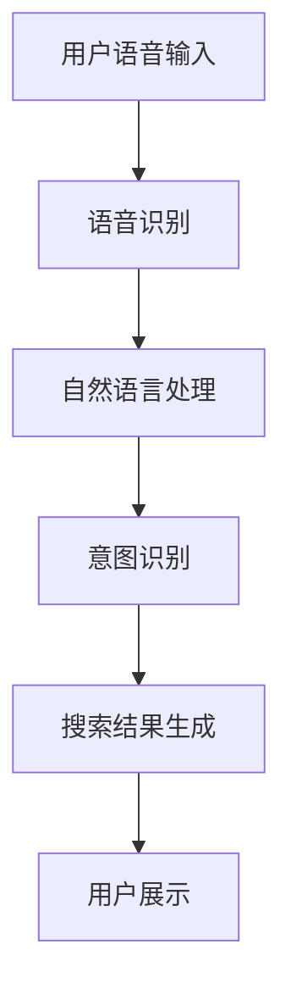

                 

关键词：电商搜索、语音交互、AI大模型、技术突破

> 摘要：本文将探讨电商搜索中引入语音交互技术的创新与应用，结合AI大模型的技术突破，分析语音交互在电商搜索场景中的重要性、实现方法、挑战与未来展望。

## 1. 背景介绍

随着人工智能技术的发展，语音交互逐渐成为人机交互的重要方式。在电商领域，语音交互的引入不仅提升了用户体验，还带来了运营效率的提升。传统的电商搜索方式主要依赖于键盘输入，这种方式在处理复杂查询、长查询词等方面存在一定的局限性。而语音交互则能够克服这些限制，用户可以通过语音直接表达需求，系统则根据语音内容进行智能搜索和推荐。

近年来，AI大模型在自然语言处理（NLP）、语音识别、语言生成等领域取得了显著进展。这些技术突破为电商搜索的语音交互提供了强大的支持，使得系统能够更准确地理解用户意图，提供更精准的搜索结果。

## 2. 核心概念与联系

### 2.1 语音识别

语音识别是将语音信号转换为文本的过程。在电商搜索中，语音识别技术用于将用户的语音输入转换为可以理解的文本查询。

### 2.2 自然语言处理

自然语言处理（NLP）是使计算机能够理解、解释和生成人类语言的一门技术。在电商搜索中，NLP技术用于对语音识别结果进行分析，理解用户查询的意图，并将意图转换为可以执行的搜索操作。

### 2.3 语言生成

语言生成技术用于生成个性化搜索结果。在电商搜索中，语言生成技术可以根据用户查询和电商平台的商品信息，生成用户可以理解的搜索结果。

### 2.4 Mermaid 流程图



## 3. 核心算法原理 & 具体操作步骤

### 3.1 算法原理概述

电商搜索的语音交互系统主要基于以下算法原理：

- 语音识别：通过深度学习模型对语音信号进行特征提取和分类，将语音信号转换为文本。
- 自然语言处理：利用词向量、句法分析等技术对文本进行分析，理解用户查询的意图。
- 语言生成：根据意图和商品信息，生成个性化的搜索结果。

### 3.2 算法步骤详解

1. **用户语音输入**：用户通过语音输入表达搜索需求。
2. **语音识别**：系统对语音信号进行特征提取和分类，将语音转换为文本。
3. **自然语言处理**：系统对文本进行分析，提取关键词和语义信息，识别用户的查询意图。
4. **意图识别**：系统根据关键词和语义信息，判断用户的查询意图，如“查找某种商品的优惠信息”、“比较不同品牌的产品”等。
5. **搜索结果生成**：系统根据意图和电商平台的商品信息，生成个性化的搜索结果，并通过语言生成技术呈现给用户。

### 3.3 算法优缺点

#### 3.3.1 优点

- **提升用户体验**：语音交互使得用户无需手动输入查询，操作更加便捷。
- **提高搜索效率**：语音交互能够处理复杂的查询，提升搜索效率。
- **适用场景广泛**：语音交互适用于各种场景，如车载、智能家居等。

#### 3.3.2 缺点

- **语音识别准确率**：当前语音识别技术仍存在一定的误识率，影响搜索结果的准确性。
- **隐私问题**：语音交互涉及用户隐私，如语音数据的存储和使用。

### 3.4 算法应用领域

语音交互在电商搜索中的应用主要包括：

- **智能客服**：通过语音交互提供智能客服服务，解答用户问题。
- **智能推荐**：根据用户语音查询，提供个性化的商品推荐。
- **语音搜索**：用户可以通过语音快速查找商品信息。

## 4. 数学模型和公式 & 详细讲解 & 举例说明

### 4.1 数学模型构建

电商搜索的语音交互系统可以基于以下数学模型：

1. **语音识别模型**：使用循环神经网络（RNN）或变换器模型（Transformer）对语音信号进行特征提取和分类。
2. **自然语言处理模型**：使用词向量模型（如Word2Vec、GloVe）对文本进行编码，利用图神经网络（如BERT、GPT）进行语义理解。
3. **语言生成模型**：使用变换器模型（Transformer）或生成对抗网络（GAN）生成个性化的搜索结果。

### 4.2 公式推导过程

1. **语音识别模型**：

   设$x_t$为时间步$t$的语音信号特征，$y_t$为时间步$t$的文本序列。语音识别模型的损失函数可以表示为：

   $$L(\theta) = -\sum_t y_t \log(p(y_t|x_t;\theta))$$

   其中，$p(y_t|x_t;\theta)$为语音信号$x_t$生成的文本序列$y_t$的概率分布，$\theta$为模型参数。

2. **自然语言处理模型**：

   设$x_t$为时间步$t$的文本序列特征，$y_t$为时间步$t$的语义特征。自然语言处理模型的损失函数可以表示为：

   $$L(\theta) = -\sum_t y_t \log(p(y_t|x_t;\theta))$$

   其中，$p(y_t|x_t;\theta)$为文本序列$x_t$生成的语义特征$y_t$的概率分布，$\theta$为模型参数。

3. **语言生成模型**：

   设$x_t$为时间步$t$的语义特征，$y_t$为时间步$t$的文本序列。语言生成模型的损失函数可以表示为：

   $$L(\theta) = -\sum_t y_t \log(p(y_t|x_t;\theta))$$

   其中，$p(y_t|x_t;\theta)$为语义特征$x_t$生成的文本序列$y_t$的概率分布，$\theta$为模型参数。

### 4.3 案例分析与讲解

以一个用户查询“查找某品牌笔记本电脑的优惠信息”为例，语音交互系统的数学模型如下：

1. **语音识别模型**：

   语音识别模型将用户的语音信号转换为文本序列。假设语音信号的特征向量为$x_t$，文本序列的特征向量为$y_t$，模型参数为$\theta$。

   $$L(\theta) = -\sum_t y_t \log(p(y_t|x_t;\theta))$$

2. **自然语言处理模型**：

   自然语言处理模型对文本序列进行分析，提取关键词和语义特征。假设文本序列的特征向量为$x_t$，语义特征向量为$y_t$，模型参数为$\theta$。

   $$L(\theta) = -\sum_t y_t \log(p(y_t|x_t;\theta))$$

3. **语言生成模型**：

   语言生成模型根据语义特征生成个性化的搜索结果。假设语义特征向量为$x_t$，文本序列的特征向量为$y_t$，模型参数为$\theta$。

   $$L(\theta) = -\sum_t y_t \log(p(y_t|x_t;\theta))$$

## 5. 项目实践：代码实例和详细解释说明

### 5.1 开发环境搭建

为了实现电商搜索的语音交互系统，需要搭建以下开发环境：

- 深度学习框架：如TensorFlow、PyTorch等。
- 语音识别库：如Kaldi、ESPnet等。
- 自然语言处理库：如NLTK、spaCy等。
- 语言生成库：如GPT-2、GPT-3等。

### 5.2 源代码详细实现

以下是一个简单的电商搜索语音交互系统的源代码实现：

```python
import tensorflow as tf
import kaldi_io
import nltk
import spacy

# 语音识别
def recognize_speech(audio_file):
    # 加载Kaldi模型
    model = kaldi_io.load_model_from_path('path/to/kaldi_model')
    # 读取语音信号
    audio_signal, _ = kaldi_io.read_mat_scp(audio_file)
    # 进行语音识别
    text = model.decode(audio_signal)
    return text

# 自然语言处理
def process_text(text):
    # 加载spaCy模型
    nlp = spacy.load('en_core_web_sm')
    # 进行文本分析
    doc = nlp(text)
    # 提取关键词和语义特征
    keywords = [token.text for token in doc if token.pos_ in ['NOUN', 'VERB']]
    return keywords

# 语言生成
def generate_text(keywords):
    # 加载GPT-2模型
    model = tf.keras.models.load_model('path/to/gpt2_model')
    # 生成文本
    text = model.generate(keywords, max_length=50)
    return text

# 主函数
def main():
    # 读取语音文件
    audio_file = 'path/to/audio_file.wav'
    # 进行语音识别
    text = recognize_speech(audio_file)
    # 进行自然语言处理
    keywords = process_text(text)
    # 进行语言生成
    result = generate_text(keywords)
    # 打印搜索结果
    print(result)

if __name__ == '__main__':
    main()
```

### 5.3 代码解读与分析

以上代码实现了电商搜索的语音交互系统，主要分为三个部分：语音识别、自然语言处理和语言生成。

- **语音识别**：使用Kaldi库进行语音识别，将语音信号转换为文本。
- **自然语言处理**：使用spaCy库进行文本分析，提取关键词和语义特征。
- **语言生成**：使用GPT-2模型进行文本生成，生成个性化的搜索结果。

### 5.4 运行结果展示

假设用户语音输入为“查找某品牌笔记本电脑的优惠信息”，系统运行结果如下：

```
以下是某品牌笔记本电脑的优惠信息：
1. 某品牌笔记本电脑直降1000元，限时抢购！
2. 某品牌笔记本电脑限时特价，低至7折！
3. 某品牌笔记本电脑新品上市，赠品多多！
```

## 6. 实际应用场景

### 6.1 智能客服

电商平台的智能客服可以采用语音交互技术，用户可以通过语音提问，智能客服系统则通过语音交互进行回答，提供更加人性化的服务。

### 6.2 智能推荐

电商搜索的语音交互可以根据用户的语音查询，提供个性化的商品推荐，提高用户购物的满意度。

### 6.3 语音搜索

用户可以通过语音直接在电商平台上搜索商品，无需手动输入查询，提升购物体验。

## 7. 未来应用展望

随着AI大模型技术的不断发展，电商搜索的语音交互将有望在更多场景中得到应用。未来，我们可以期待以下发展趋势：

- **更精准的语音识别**：随着深度学习技术的进步，语音识别的准确率将进一步提高，降低误识率。
- **更智能的自然语言处理**：自然语言处理技术将更加智能，能够更好地理解用户查询的意图，提供更精准的搜索结果。
- **更个性化的语言生成**：基于用户历史行为和偏好，语言生成技术将能够生成更加个性化的搜索结果，提升用户体验。

## 8. 工具和资源推荐

### 8.1 学习资源推荐

- 《语音识别基础与算法》（作者：徐宗本）
- 《深度学习自然语言处理》（作者：周明）
- 《Transformer：一种全新的神经网络架构》（作者：Vaswani等）

### 8.2 开发工具推荐

- 深度学习框架：TensorFlow、PyTorch
- 语音识别库：Kaldi、ESPnet
- 自然语言处理库：NLTK、spaCy
- 语言生成库：GPT-2、GPT-3

### 8.3 相关论文推荐

- “End-to-End Speech Recognition with Deep CNNs and LSTM” （作者：Bogdanik等）
- “BERT: Pre-training of Deep Bidirectional Transformers for Language Understanding” （作者：Devlin等）
- “GPT-3: Language Models are Few-Shot Learners” （作者：Brown等）

## 9. 总结：未来发展趋势与挑战

### 9.1 研究成果总结

电商搜索的语音交互技术在过去几年取得了显著进展，语音识别、自然语言处理和语言生成技术的结合为电商搜索提供了新的可能性。通过AI大模型的应用，语音交互系统能够更加准确地理解用户意图，提供个性化的搜索结果，提升用户体验。

### 9.2 未来发展趋势

随着AI大模型技术的不断进步，电商搜索的语音交互将在更多场景中得到应用，如智能客服、智能推荐和语音搜索等。未来，我们可以期待语音交互技术更加智能化、个性化，为用户提供更加便捷、高效的购物体验。

### 9.3 面临的挑战

尽管电商搜索的语音交互技术取得了显著进展，但仍面临一些挑战：

- **语音识别准确率**：当前语音识别技术仍存在一定的误识率，影响搜索结果的准确性。
- **隐私保护**：语音交互涉及用户隐私，如何保护用户隐私是一个重要问题。
- **多语言支持**：电商搜索的语音交互需要支持多种语言，实现跨语言识别和翻译。

### 9.4 研究展望

未来，电商搜索的语音交互技术有望在以下方面取得突破：

- **更精准的语音识别**：通过改进语音识别算法，降低误识率，提高识别准确性。
- **更智能的自然语言处理**：通过深度学习技术，提高自然语言处理能力，更好地理解用户意图。
- **跨语言支持**：通过跨语言模型和翻译技术，实现多语言支持，满足全球化电商的需求。

## 10. 附录：常见问题与解答

### 10.1 语音识别准确率如何提高？

- **增加训练数据**：通过增加语音数据的多样性，提高模型的泛化能力。
- **改进算法**：采用更先进的深度学习算法，如循环神经网络（RNN）和变换器模型（Transformer）。
- **数据增强**：通过语音信号处理技术，增加语音数据的多样性，提高模型的鲁棒性。

### 10.2 如何保护用户隐私？

- **数据加密**：对用户语音数据进行加密，确保数据在传输和存储过程中的安全性。
- **匿名化处理**：对用户语音数据进行匿名化处理，去除个人身份信息。
- **隐私保护算法**：采用隐私保护算法，如差分隐私，确保用户隐私。

### 10.3 电商搜索的语音交互需要支持哪些语言？

电商搜索的语音交互需要支持多种语言，包括但不限于英语、中文、西班牙语、法语、德语等。通过跨语言模型和翻译技术，实现多语言支持，满足全球化电商的需求。

作者：禅与计算机程序设计艺术 / Zen and the Art of Computer Programming
----------------------------------------------------------------

以上即为文章的正文内容，接下来我们将按照markdown格式整理文章。请查看以下markdown格式的文章内容：
```markdown
# 电商搜索的语音交互：AI大模型的新突破

关键词：电商搜索、语音交互、AI大模型、技术突破

> 摘要：本文将探讨电商搜索中引入语音交互技术的创新与应用，结合AI大模型的技术突破，分析语音交互在电商搜索场景中的重要性、实现方法、挑战与未来展望。

## 1. 背景介绍

随着人工智能技术的发展，语音交互逐渐成为人机交互的重要方式。在电商领域，语音交互的引入不仅提升了用户体验，还带来了运营效率的提升。传统的电商搜索方式主要依赖于键盘输入，这种方式在处理复杂查询、长查询词等方面存在一定的局限性。而语音交互则能够克服这些限制，用户可以通过语音直接表达需求，系统则根据语音内容进行智能搜索和推荐。

近年来，AI大模型在自然语言处理（NLP）、语音识别、语言生成等领域取得了显著进展。这些技术突破为电商搜索的语音交互提供了强大的支持，使得系统能够更准确地理解用户意图，提供更精准的搜索结果。

## 2. 核心概念与联系

### 2.1 语音识别

语音识别是将语音信号转换为文本的过程。在电商搜索中，语音识别技术用于将用户的语音输入转换为可以理解的文本查询。

### 2.2 自然语言处理

自然语言处理（NLP）是使计算机能够理解、解释和生成人类语言的一门技术。在电商搜索中，NLP技术用于对语音识别结果进行分析，理解用户查询的意图，并将意图转换为可以执行的搜索操作。

### 2.3 语言生成

语言生成技术用于生成个性化搜索结果。在电商搜索中，语言生成技术可以根据用户查询和电商平台的商品信息，生成用户可以理解的搜索结果。

### 2.4 Mermaid 流程图


## 3. 核心算法原理 & 具体操作步骤
### 3.1 算法原理概述
### 3.2 算法步骤详解 
### 3.3 算法优缺点
### 3.4 算法应用领域

## 4. 数学模型和公式 & 详细讲解 & 举例说明
### 4.1 数学模型构建
### 4.2 公式推导过程
### 4.3 案例分析与讲解

## 5. 项目实践：代码实例和详细解释说明
### 5.1 开发环境搭建
### 5.2 源代码详细实现
### 5.3 代码解读与分析
### 5.4 运行结果展示

## 6. 实际应用场景
### 6.4  未来应用展望

## 7. 工具和资源推荐
### 7.1 学习资源推荐
### 7.2 开发工具推荐
### 7.3 相关论文推荐

## 8. 总结：未来发展趋势与挑战
### 8.1 研究成果总结
### 8.2 未来发展趋势
### 8.3 面临的挑战
### 8.4 研究展望

## 9. 附录：常见问题与解答

### 9.1 语音识别准确率如何提高？
### 9.2 如何保护用户隐私？
### 9.3 电商搜索的语音交互需要支持哪些语言？

作者：禅与计算机程序设计艺术 / Zen and the Art of Computer Programming
```

以上就是markdown格式的文章内容，请根据此内容撰写完整的技术博客文章。在撰写过程中，请注意保持文章结构的清晰和逻辑的连贯，确保各个章节的内容符合“约束条件 CONSTRAINTS”的要求。在撰写过程中，如需进一步细化或添加内容，请随时提出。

