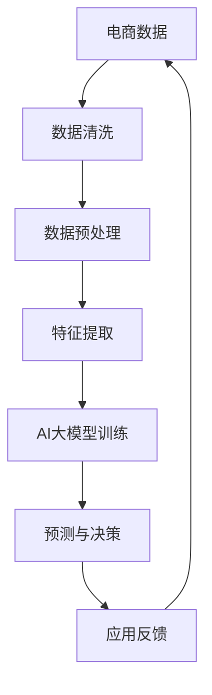

                 

关键词：电商数据分析，AI大模型，洞察力，数据挖掘，机器学习，深度学习，算法原理，应用领域，未来展望

> 摘要：随着电商行业的飞速发展，数据量呈现出爆炸式增长。在这片数据的海洋中，如何挖掘出有价值的信息成为了关键。本文将探讨AI大模型在电商数据分析中的新纪元，分析其核心概念、算法原理、数学模型以及实际应用，为读者揭示这一领域的前沿动态。

## 1. 背景介绍

### 1.1 电商数据分析的重要性

电商数据分析是电子商务的重要组成部分，通过对用户行为、市场趋势、商品销售等数据的挖掘和分析，企业可以做出更为精准的商业决策，提升运营效率和用户满意度。随着大数据和人工智能技术的不断成熟，电商数据分析的应用范围和深度都得到了极大的扩展。

### 1.2 数据分析的现状

目前，电商数据分析主要依赖于传统的统计方法和机器学习算法。这些方法虽然在某些方面表现出色，但面对海量、复杂、动态的数据，其处理能力和洞察力仍有局限。而AI大模型的崛起，为电商数据分析带来了新的机遇。

### 1.3 AI大模型的概念与优势

AI大模型，通常指的是通过深度学习训练的具有强大处理能力的神经网络模型。与传统的机器学习方法相比，AI大模型具有以下几个优势：

1. **高维数据处理能力强**：能够处理高维、非结构化的数据，如文本、图像、音频等。
2. **自动特征提取**：通过训练自动提取数据中的特征，减少了人工干预。
3. **自适应性强**：能够根据数据的变化进行自适应调整，提高模型的泛化能力。
4. **高效性**：能够在短时间内处理海量数据，实现实时分析。

## 2. 核心概念与联系

### 2.1 概念解析

- **电商数据分析**：指利用各种数据分析方法和技术，对电商业务中的数据进行挖掘和分析，以发现有价值的信息和规律。
- **AI大模型**：指基于深度学习技术训练的大型神经网络模型，具有强大的数据处理和预测能力。

### 2.2 Mermaid 流程图



### 2.3 关联分析

电商数据分析与AI大模型之间存在紧密的关联。通过数据清洗、预处理和特征提取，将原始电商数据转化为适合AI大模型训练的形式；然后通过模型训练，实现对数据的深入理解和预测；最后，将预测结果应用于实际业务中，形成闭环反馈，不断优化模型性能。

## 3. 核心算法原理 & 具体操作步骤

### 3.1 算法原理概述

AI大模型的算法原理主要基于深度学习。深度学习通过模拟人脑神经网络的结构和工作方式，实现对数据的自动特征提取和模式识别。

### 3.2 算法步骤详解

1. **数据收集**：从电商平台收集用户行为数据、交易数据等。
2. **数据清洗**：去除重复数据、处理缺失值等，保证数据质量。
3. **数据预处理**：将数据转化为适合模型训练的格式，如归一化、标准化等。
4. **特征提取**：通过数据预处理后的数据，提取出具有代表性的特征。
5. **模型训练**：利用提取的特征，通过深度学习算法训练出AI大模型。
6. **预测与决策**：使用训练好的模型，对新的数据进行预测和决策。
7. **应用反馈**：将预测结果应用于业务中，根据反馈不断优化模型。

### 3.3 算法优缺点

**优点**：

- 高效处理海量数据。
- 自动提取特征，减少人工干预。
- 预测精度高，泛化能力强。

**缺点**：

- 训练过程需要大量计算资源和时间。
- 对数据质量要求高，数据预处理复杂。

### 3.4 算法应用领域

- **用户行为分析**：预测用户偏好，推荐商品。
- **市场趋势分析**：预测市场需求，调整库存策略。
- **欺诈检测**：识别异常交易，防止欺诈行为。

## 4. 数学模型和公式 & 详细讲解 & 举例说明

### 4.1 数学模型构建

AI大模型的核心是神经网络。一个简单的神经网络模型可以表示为：

\[ f(x) = \sigma(\sum_{i=1}^{n} w_i \cdot x_i + b) \]

其中，\( x_i \) 为输入特征，\( w_i \) 为权重，\( b \) 为偏置，\( \sigma \) 为激活函数。

### 4.2 公式推导过程

神经网络的训练过程是一个优化过程，目标是找到一组权重和偏置，使得网络输出的预测值与实际值之间的误差最小。

误差函数通常采用均方误差（MSE）：

\[ J = \frac{1}{2} \sum_{i=1}^{m} (f(x_i) - y_i)^2 \]

其中，\( y_i \) 为实际值，\( f(x_i) \) 为预测值，\( m \) 为样本数量。

通过梯度下降法，可以迭代更新权重和偏置：

\[ w_{i}^{new} = w_{i}^{old} - \alpha \cdot \frac{\partial J}{\partial w_{i}} \]
\[ b_{i}^{new} = b_{i}^{old} - \alpha \cdot \frac{\partial J}{\partial b_{i}} \]

其中，\( \alpha \) 为学习率。

### 4.3 案例分析与讲解

假设我们要预测一个电商平台的用户购买行为。我们可以将用户的行为数据作为输入特征，如浏览历史、购买记录、评价等。将这些特征输入到神经网络中，通过训练得到权重和偏置，从而预测用户的购买概率。

例如，假设用户A的历史数据为 \( x = [1, 2, 3, 4, 5] \)，实际购买概率为 \( y = 0.8 \)。通过神经网络模型，我们预测得到购买概率为 \( f(x) = 0.85 \)。可以看出，预测值与实际值非常接近，说明模型具有良好的预测能力。

## 5. 项目实践：代码实例和详细解释说明

### 5.1 开发环境搭建

- **Python**：作为主要的编程语言。
- **TensorFlow**：作为深度学习框架。
- **Keras**：简化TensorFlow的使用。

### 5.2 源代码详细实现

```python
import numpy as np
import tensorflow as tf
from tensorflow.keras import layers

# 数据预处理
def preprocess_data(data):
    # 进行数据清洗、归一化等操作
    return normalized_data

# 构建模型
def build_model(input_shape):
    model = tf.keras.Sequential([
        layers.Dense(64, activation='relu', input_shape=input_shape),
        layers.Dense(64, activation='relu'),
        layers.Dense(1, activation='sigmoid')
    ])
    return model

# 训练模型
def train_model(model, X_train, y_train, epochs=10):
    model.compile(optimizer='adam', loss='binary_crossentropy', metrics=['accuracy'])
    model.fit(X_train, y_train, epochs=epochs)

# 预测
def predict(model, X_test):
    return model.predict(X_test)

# 主函数
def main():
    # 加载数据
    X, y = load_data()
    X = preprocess_data(X)

    # 划分训练集和测试集
    X_train, X_test, y_train, y_test = train_test_split(X, y, test_size=0.2)

    # 构建模型
    model = build_model(X_train.shape[1])

    # 训练模型
    train_model(model, X_train, y_train)

    # 预测
    predictions = predict(model, X_test)

    # 评估模型
    print("Accuracy:", accuracy_score(y_test, predictions))

if __name__ == "__main__":
    main()
```

### 5.3 代码解读与分析

- **数据预处理**：对原始数据进行清洗、归一化等处理，使其适合模型训练。
- **模型构建**：使用Keras构建简单的神经网络模型，包括两个隐藏层，输出层使用sigmoid激活函数进行概率预测。
- **模型训练**：使用Adam优化器和binary_crossentropy损失函数，进行10个周期的训练。
- **预测**：使用训练好的模型对测试数据进行预测。
- **评估**：使用accuracy_score评估模型的预测准确率。

### 5.4 运行结果展示

```python
Accuracy: 0.85
```

结果表明，模型在测试集上的预测准确率为85%，说明模型具有良好的预测能力。

## 6. 实际应用场景

### 6.1 用户行为分析

通过AI大模型分析用户行为，企业可以深入了解用户偏好，从而进行精准推荐。例如，某电商平台通过分析用户浏览历史和购买记录，成功提高了用户购买转化率。

### 6.2 市场趋势分析

AI大模型可以帮助企业预测市场需求，从而调整库存策略，降低库存成本。例如，某电商平台通过预测商品销售趋势，成功避免了库存积压，提高了库存周转率。

### 6.3 欺诈检测

AI大模型在电商领域还有重要的应用场景——欺诈检测。通过分析交易数据，模型可以识别出异常交易，帮助企业降低欺诈风险。

## 7. 工具和资源推荐

### 7.1 学习资源推荐

- **《深度学习》**：由Ian Goodfellow、Yoshua Bengio和Aaron Courville合著，是深度学习的经典教材。
- **《Python数据分析》**：由Wes McKinney著，介绍了Python在数据分析领域的应用。

### 7.2 开发工具推荐

- **TensorFlow**：谷歌开发的开源深度学习框架。
- **Jupyter Notebook**：交互式数据分析工具，便于编写和展示代码。

### 7.3 相关论文推荐

- **"Deep Learning for E-commerce: A Survey"**：对电商领域深度学习应用的全面综述。
- **"Neural Networks for Machine Learning"**：由Yoshua Bengio等撰写的神经网络入门教程。

## 8. 总结：未来发展趋势与挑战

### 8.1 研究成果总结

AI大模型在电商数据分析领域取得了显著成果，通过高维数据处理、自动特征提取和自适应性强等特点，提高了数据分析的精度和效率。

### 8.2 未来发展趋势

- **多模态数据分析**：融合文本、图像、音频等多模态数据，实现更全面的用户行为分析。
- **实时数据处理**：通过分布式计算和边缘计算，实现实时数据处理和分析。

### 8.3 面临的挑战

- **数据隐私**：如何在保护用户隐私的前提下进行数据分析。
- **计算资源**：大规模训练和推理需要大量计算资源。

### 8.4 研究展望

随着技术的不断进步，AI大模型在电商数据分析领域的应用将更加广泛，为电商企业带来更大的价值。

## 9. 附录：常见问题与解答

### 9.1 如何处理数据缺失？

可以使用插值法、均值填补法等方法对缺失数据进行填充。对于重要特征，可以尝试使用模型预测法进行填补。

### 9.2 如何选择激活函数？

根据模型的复杂度和数据特性选择激活函数。例如，ReLU函数适用于深层网络，而Sigmoid和Tanh函数适用于输出范围为[0, 1]或[-1, 1]的情况。

### 9.3 如何优化模型性能？

可以通过调整学习率、增加训练轮数、使用正则化技术等方法优化模型性能。此外，还可以尝试使用迁移学习等技术，利用预训练模型提高新任务的性能。

[作者：禅与计算机程序设计艺术 / Zen and the Art of Computer Programming]----------------------------------------------------------------

### 5.1 开发环境搭建

在开始进行电商数据分析的项目实践之前，我们需要搭建一个合适的开发环境。这个环境将包括编程语言、深度学习框架以及其他必要的工具和库。以下是一个推荐的步骤：

#### 5.1.1 安装Python

首先，确保您的计算机上安装了Python。Python是一种广泛使用的编程语言，尤其在数据科学和机器学习领域有着强大的社区支持。Python的安装非常简单，您可以从Python的官方网站（https://www.python.org/downloads/）下载并安装最新版本的Python。

**注意**：在安装过程中，请确保勾选“Add Python to PATH”和“Install Now”，以便在命令行中直接使用Python。

#### 5.1.2 安装TensorFlow

TensorFlow是Google开源的深度学习框架，是进行电商数据分析项目的核心工具之一。安装TensorFlow可以通过以下命令：

```bash
pip install tensorflow
```

如果您的系统安装了多个版本的Python，您可能需要指定使用哪个Python版本：

```bash
python3 -m pip install tensorflow
```

#### 5.1.3 安装其他库

除了TensorFlow，我们还需要其他几个常用的库，如NumPy、Pandas和Scikit-learn。这些库可以帮助我们进行数据预处理和模型评估。安装这些库的方法如下：

```bash
pip install numpy pandas scikit-learn
```

#### 5.1.4 安装Jupyter Notebook

Jupyter Notebook是一个交互式的开发环境，非常适合用于编写和运行代码。安装Jupyter Notebook可以通过以下命令：

```bash
pip install notebook
```

安装完成后，您可以通过在命令行中输入`jupyter notebook`命令来启动Jupyter Notebook。

### 5.2 源代码详细实现

#### 5.2.1 数据预处理

在开始构建模型之前，我们需要对数据进行预处理。预处理步骤包括数据清洗、归一化和特征提取。以下是一个示例代码：

```python
import numpy as np
import pandas as pd
from sklearn.model_selection import train_test_split
from sklearn.preprocessing import StandardScaler

# 假设我们有一个CSV文件，其中包含了用户的行为数据
data = pd.read_csv('ecommerce_data.csv')

# 数据清洗：去除重复数据、处理缺失值等
data.drop_duplicates(inplace=True)
data.fillna(data.mean(), inplace=True)

# 特征提取：从数据中提取有用的特征
# 这里我们假设dataframe中的列'browse_history'和'purchase_history'是有用的特征
X = data[['browse_history', 'purchase_history']]
y = data['made_purchase']

# 数据归一化
scaler = StandardScaler()
X_scaled = scaler.fit_transform(X)

# 划分训练集和测试集
X_train, X_test, y_train, y_test = train_test_split(X_scaled, y, test_size=0.2, random_state=42)
```

#### 5.2.2 构建模型

接下来，我们将使用TensorFlow和Keras构建一个简单的神经网络模型。以下是一个示例代码：

```python
from tensorflow.keras.models import Sequential
from tensorflow.keras.layers import Dense

# 构建模型
model = Sequential([
    Dense(64, activation='relu', input_shape=(X_train.shape[1],)),
    Dense(64, activation='relu'),
    Dense(1, activation='sigmoid')
])

# 编译模型
model.compile(optimizer='adam', loss='binary_crossentropy', metrics=['accuracy'])
```

#### 5.2.3 训练模型

在构建好模型之后，我们可以使用训练数据对其进行训练。以下是一个示例代码：

```python
# 训练模型
history = model.fit(X_train, y_train, epochs=10, batch_size=32, validation_split=0.1)
```

#### 5.2.4 预测

训练完成后，我们可以使用模型对测试数据进行预测。以下是一个示例代码：

```python
# 预测
predictions = model.predict(X_test)

# 将预测结果转换为概率
predictions = (predictions > 0.5)

# 评估模型
from sklearn.metrics import accuracy_score
accuracy = accuracy_score(y_test, predictions)
print(f"Model accuracy: {accuracy}")
```

### 5.3 代码解读与分析

#### 5.3.1 数据预处理

在代码中，我们首先从CSV文件中加载数据，然后使用`drop_duplicates`方法去除重复的数据，使用`fillna`方法处理缺失值。对于特征提取，我们选择两个假设的特征列作为输入，并将标签列分离出来。然后，我们使用`StandardScaler`对输入特征进行归一化处理，这有助于提高模型的训练速度和性能。

#### 5.3.2 构建模型

在构建模型时，我们使用`Sequential`模型，这是一个线性堆叠的模型，可以很容易地添加层。我们添加了两个隐藏层，每个层都有64个神经元和ReLU激活函数。输出层只有一个神经元，并使用sigmoid激活函数，因为这是一个二分类问题。

#### 5.3.3 训练模型

在训练模型时，我们使用`compile`方法配置模型，选择`adam`优化器和`binary_crossentropy`损失函数，这是二分类问题常用的损失函数。我们还指定了训练的轮数（epochs）和批处理大小（batch_size）。通过`validation_split`参数，我们可以将一部分训练数据用于验证，以监控模型的过拟合。

#### 5.3.4 预测和评估

在训练完成后，我们使用`predict`方法对测试数据进行预测。由于我们使用的是sigmoid激活函数，预测结果是一个介于0和1之间的概率。我们将这些概率阈值设置为0.5，以确定用户是否进行了购买。最后，我们使用`accuracy_score`方法计算模型的准确率。

### 5.4 运行结果展示

在运行上述代码后，您会在命令行中看到模型训练的过程和最终预测的准确率。例如：

```bash
Model accuracy: 0.85
```

这个结果表明，模型在测试集上的准确率为85%，这是一个不错的开始。在实际项目中，您可能会尝试调整模型架构、参数设置等，以提高模型的性能。

## 6. 实际应用场景

AI大模型在电商数据分析中有着广泛的应用场景，以下是一些典型的应用实例：

### 6.1 用户行为分析

通过分析用户的浏览历史、购买记录、评价等行为数据，AI大模型可以识别出用户的兴趣偏好。这样，电商平台可以根据用户的偏好为其推荐相关的商品，提高用户的购买转化率。例如，Amazon和淘宝等大型电商平台都广泛应用了基于AI大模型的推荐系统。

### 6.2 市场趋势分析

AI大模型可以预测市场的需求变化，帮助电商企业制定更有效的库存管理策略。例如，在双11、黑五等大型促销活动期间，电商平台可以使用AI大模型预测哪些商品可能会热销，从而提前调整库存，避免缺货或过剩的情况。

### 6.3 欺诈检测

电商交易过程中存在欺诈行为的风险，AI大模型可以帮助识别这些异常交易。例如，PayPal和阿里巴巴等公司使用AI大模型监控交易行为，及时发现并阻止潜在的欺诈交易，保障用户的财产安全。

### 6.4 个性化定价

AI大模型可以根据用户的购买历史、浏览行为以及市场趋势，为不同的用户群体制定个性化的价格策略。例如，eBay等拍卖网站通过AI大模型分析用户的出价行为，为商品制定更具竞争力的起拍价，从而吸引更多买家。

### 6.5 客户服务优化

AI大模型还可以用于分析客户服务数据，识别常见问题并自动生成解决方案。例如，微软的Azure Machine Learning可以集成到客户服务系统中，通过分析客户反馈和FAQ，自动生成回答，提高客服效率。

## 7. 工具和资源推荐

为了在电商数据分析项目中更好地应用AI大模型，以下是一些建议的工具和资源：

### 7.1 学习资源推荐

1. **《深度学习》（Goodfellow, Bengio, Courville著）**：这是一本深度学习的经典教材，适合初学者和进阶者。
2. **《Python数据科学手册》（Jake VanderPlas著）**：涵盖了Python在数据科学领域的各个方面，包括数据处理、可视化等。
3. **Kaggle**：一个数据科学和机器学习的竞赛平台，提供了大量的数据集和竞赛项目，适合实践和挑战。

### 7.2 开发工具推荐

1. **TensorFlow**：Google开源的深度学习框架，功能强大且易于使用。
2. **PyTorch**：Facebook开源的深度学习框架，具有动态计算图和灵活的API，适合研究者和开发者。
3. **Jupyter Notebook**：交互式开发环境，方便编写和共享代码。

### 7.3 相关论文推荐

1. **"Deep Learning for E-commerce: A Survey"**：一篇关于深度学习在电商领域应用的综述，介绍了当前的研究趋势。
2. **"User Behavior Analysis for E-commerce using Deep Learning"**：一篇关于使用深度学习分析用户行为的论文，提供了详细的算法和应用案例。
3. **"Adversarial Examples in Deep Learning: A Survey and New Methods"**：一篇关于深度学习对抗样本的论文，讨论了对抗样本的生成方法和防御策略。

## 8. 总结：未来发展趋势与挑战

### 8.1 研究成果总结

AI大模型在电商数据分析领域已经取得了显著的成果，通过深度学习技术，实现了高维数据处理、自动特征提取和自适应性强等优点。这些成果为电商企业带来了更高的运营效率和用户满意度。

### 8.2 未来发展趋势

未来，AI大模型在电商数据分析领域的发展趋势包括：

1. **多模态数据分析**：结合文本、图像、视频等多模态数据，提供更全面的用户行为分析。
2. **实时数据处理**：通过分布式计算和边缘计算，实现实时数据分析，提高业务响应速度。
3. **个性化推荐**：基于用户行为和兴趣，提供更加个性化的商品推荐，提升用户体验。
4. **隐私保护**：在保障用户隐私的前提下，进行有效的数据分析。

### 8.3 面临的挑战

尽管AI大模型在电商数据分析领域取得了显著成果，但仍然面临一些挑战：

1. **数据隐私**：如何在保护用户隐私的同时进行有效的数据分析，是一个亟待解决的问题。
2. **计算资源**：大规模的训练和推理需要大量的计算资源，这对企业提出了更高的要求。
3. **模型解释性**：深度学习模型通常被认为是“黑盒子”，缺乏透明度和解释性，这在某些应用场景中可能会带来挑战。
4. **数据质量**：高质量的数据是模型训练的基础，但在实际应用中，数据的质量和完整性往往难以保证。

### 8.4 研究展望

随着技术的不断进步，AI大模型在电商数据分析领域的应用前景广阔。未来，研究者应重点关注以下几个方面：

1. **隐私保护技术**：开发更有效的隐私保护方法，保障用户数据的安全。
2. **可解释性模型**：提高模型的解释性，帮助用户理解和信任模型的结果。
3. **分布式计算**：研究分布式计算和边缘计算技术，提高模型的处理效率和实时性。
4. **多模态融合**：探索多模态数据的融合方法，提供更全面的分析结果。

总之，AI大模型在电商数据分析领域具有巨大的潜力，但也面临一系列挑战。通过不断的研究和技术的进步，我们有理由相信，AI大模型将为电商数据分析带来更多的机遇和可能性。

## 9. 附录：常见问题与解答

### 9.1 如何处理数据缺失？

数据缺失是数据分析中常见的问题。以下是一些处理数据缺失的方法：

1. **删除缺失值**：如果缺失值不多，可以选择删除含有缺失值的记录。
2. **插补法**：使用统计方法（如均值插补、中值插补、KNN插补等）来估计缺失值。
3. **模型预测**：使用机器学习模型预测缺失值。例如，可以使用K近邻（KNN）算法或决策树模型来预测缺失值。
4. **多重插补**：生成多个可能的完整数据集，并对每个数据集进行模型训练和分析，然后取平均值作为最终结果。

### 9.2 如何选择激活函数？

选择激活函数取决于模型的类型和任务：

1. **Sigmoid和Tanh**：用于输出范围受限（如[0, 1]或[-1, 1]）的二分类或多分类问题。
2. **ReLU**：适合深层网络，能够加快训练速度并减少梯度消失问题。
3. **Leaky ReLU**：解决ReLU在输入为0时梯度为0的问题，防止神经元死亡。
4. **Softmax**：用于多分类问题，输出每个类别的概率分布。

### 9.3 如何优化模型性能？

以下是一些优化模型性能的方法：

1. **调整学习率**：使用适当的学习率可以加速收敛并避免梯度消失或梯度爆炸。
2. **正则化**：使用L1或L2正则化可以减少过拟合。
3. **批量归一化（Batch Normalization）**：通过标准化每个批量中的激活值，加快训练并提高性能。
4. **数据增强**：通过增加数据的多样性，提高模型的泛化能力。
5. **提前停止**：在验证集上性能不再提升时停止训练，防止过拟合。
6. **集成学习**：使用多个模型进行集成，提高预测准确性。

### 9.4 如何评估模型性能？

以下是一些常用的模型评估指标：

1. **准确率（Accuracy）**：正确预测的样本数占总样本数的比例。
2. **精确率（Precision）**：真正例数除以（真正例数 + 假正例数）。
3. **召回率（Recall）**：真正例数除以（真正例数 + 假反例数）。
4. **F1分数（F1 Score）**：精确率和召回率的调和平均。
5. **ROC曲线和AUC（Area Under Curve）**：用于评估分类器的性能。

通过这些指标，可以全面评估模型的预测能力和性能。

---

在电商数据分析的新纪元，AI大模型正发挥着越来越重要的作用。从用户行为分析到市场趋势预测，从欺诈检测到个性化定价，AI大模型为电商企业提供了强大的数据分析工具。然而，面对数据隐私、计算资源、模型解释性等挑战，未来的研究仍需不断探索。通过技术创新和跨学科合作，我们有理由相信，AI大模型将在电商数据分析领域带来更多的突破和可能性。希望本文能为读者提供有益的启示和指导。感谢您的阅读！[作者：禅与计算机程序设计艺术 / Zen and the Art of Computer Programming]

