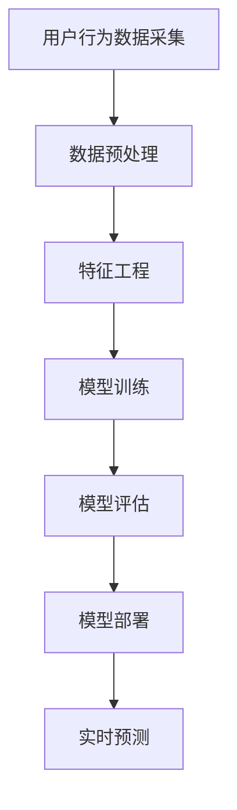

                 

关键词：电商、用户行为、序列预测、人工智能、大模型

> 摘要：本文探讨了电商领域用户行为序列预测的重要性，介绍了基于人工智能的大模型方案，并详细解析了核心算法原理、数学模型、项目实践以及实际应用场景。通过本文，读者可以全面了解电商用户行为预测的现状、技术手段和未来发展。

## 1. 背景介绍

在电子商务迅速发展的时代，用户行为数据成为了商家制定营销策略、提升用户体验和优化运营效率的重要资产。电商平台的用户行为包括浏览、搜索、购买、评论、分享等多种形式，这些行为数据通过日志文件、点击流数据等形式进行记录。通过对这些用户行为数据的分析，电商企业可以识别用户偏好、预测购买意图，从而实现精准营销和个性化推荐。

用户行为序列预测在电商领域的应用具有显著的价值。首先，它可以提高营销活动的有效性，通过预测用户购买行为，商家可以在合适的时间向目标用户推送合适的商品，增加销售额。其次，用户行为序列预测有助于优化用户体验，通过分析用户浏览和搜索路径，平台可以提供更加个性化的推荐，提升用户满意度和忠诚度。此外，用户行为序列预测还可以用于风险控制，比如预测潜在欺诈行为，降低运营风险。

然而，用户行为序列预测面临着诸多挑战。首先，用户行为数据的多样性和复杂性使得传统预测方法难以有效应用。其次，数据量的庞大和实时性的要求，对计算资源和算法效率提出了更高的要求。此外，如何从海量数据中提取有价值的信息，并构建准确的预测模型，也是当前研究的重要课题。

本文将围绕电商用户行为序列预测这一主题，详细介绍基于人工智能的大模型方案，旨在为电商领域的技术发展和实践应用提供有益的参考。

## 2. 核心概念与联系

### 2.1. 用户行为序列定义

用户行为序列是指用户在电商平台上的一系列交互行为，包括浏览、搜索、添加购物车、下单、支付、评论等。这些行为按照时间顺序排列，形成了一个序列，每个序列都可以看作是用户在平台上的“足迹”。用户行为序列具有高维度、稀疏性和时序性的特点。

### 2.2. 序列预测模型

序列预测模型是用于预测用户未来行为的算法模型。常见的序列预测模型包括循环神经网络（RNN）、长短期记忆网络（LSTM）、门控循环单元（GRU）等。这些模型通过学习用户的历史行为序列，捕捉序列中的模式，从而预测用户未来的行为。

### 2.3. 大模型架构

大模型架构是指用于处理大规模数据集和复杂任务的深度学习模型。在电商用户行为序列预测中，大模型通常包含多个神经网络层和大规模参数，能够处理高维度的用户行为数据。常见的架构包括Transformer模型、BERT模型等。

### 2.4. Mermaid 流程图



### 2.5. 联系与影响

用户行为序列预测与数据采集、预处理、特征工程、模型训练、评估和部署等多个环节密切相关。数据采集是基础，预处理和特征工程是关键，模型训练和评估决定了预测的准确性，模型部署和实时预测则是应用的关键。

## 3. 核心算法原理 & 具体操作步骤

### 3.1. 算法原理概述

用户行为序列预测的核心算法是基于深度学习的大模型。这些模型通过学习用户的历史行为序列，提取序列中的潜在特征，并利用这些特征进行未来行为的预测。常见的深度学习模型包括循环神经网络（RNN）、长短期记忆网络（LSTM）和门控循环单元（GRU）。近年来，Transformer模型在序列预测任务中也表现出色，尤其在处理长序列和高维度数据时具有优势。

### 3.2. 算法步骤详解

#### 3.2.1. 数据采集与预处理

数据采集是用户行为序列预测的基础。电商平台的用户行为数据可以通过日志文件、点击流数据、交易记录等多种方式进行采集。在采集到原始数据后，需要进行预处理，包括数据清洗、去重、填充缺失值等操作。预处理后的数据将用于特征工程和模型训练。

#### 3.2.2. 特征工程

特征工程是用户行为序列预测的重要环节。通过对用户历史行为序列进行分析，提取有价值的行为特征，如浏览时间、浏览次数、购买频率、评价等级等。这些特征将用于构建输入向量，输入到深度学习模型中进行训练。

#### 3.2.3. 模型训练

模型训练是用户行为序列预测的核心步骤。使用预处理后的用户行为数据，通过训练过程，深度学习模型将学习到用户行为序列中的模式和规律。训练过程中，模型会不断调整参数，以优化预测性能。常见的训练方法包括梯度下降、随机梯度下降和Adam优化器等。

#### 3.2.4. 模型评估

模型评估是验证预测性能的重要步骤。使用验证集或测试集对模型进行评估，计算预测准确率、召回率、F1值等指标。评估结果将用于调整模型参数和优化模型结构。

#### 3.2.5. 模型部署与实时预测

经过评估和优化后的模型将部署到生产环境中，用于实时预测用户行为。在部署过程中，需要考虑模型的加载、推理速度和资源消耗等因素。实时预测结果将用于电商平台的个性化推荐、营销策略和用户服务优化等应用。

### 3.3. 算法优缺点

#### 优点：

1. **强大的预测能力**：深度学习模型能够从大量用户行为数据中提取复杂的模式和特征，提供准确的预测结果。
2. **灵活的扩展性**：深度学习模型可以轻松处理不同类型和维度的用户行为数据，具有较好的适应性和扩展性。
3. **实时性**：基于人工智能的大模型可以快速进行实时预测，为电商平台提供实时的用户行为分析和决策支持。

#### 缺点：

1. **计算资源消耗**：深度学习模型通常需要大量的计算资源和时间进行训练和推理，对硬件设备有较高的要求。
2. **数据依赖性**：用户行为序列预测模型的性能高度依赖于训练数据的质量和数量，数据不足或质量差会导致预测效果不佳。
3. **过拟合风险**：深度学习模型在训练过程中容易发生过拟合现象，导致模型泛化能力下降。

### 3.4. 算法应用领域

用户行为序列预测在电商领域的应用非常广泛，主要包括以下几个方面：

1. **个性化推荐**：通过预测用户未来的行为，电商平台可以提供个性化的商品推荐，提高用户满意度和转化率。
2. **营销策略优化**：根据用户行为序列预测结果，电商平台可以制定更加精准的营销策略，提高营销活动的效果。
3. **用户服务优化**：通过分析用户行为序列，电商平台可以优化用户服务流程，提升用户体验。
4. **风险控制**：用户行为序列预测还可以用于预测潜在欺诈行为，降低运营风险。

## 4. 数学模型和公式 & 详细讲解 & 举例说明

### 4.1. 数学模型构建

用户行为序列预测的数学模型通常基于概率图模型或深度学习模型。其中，概率图模型如贝叶斯网络和隐马尔可夫模型（HMM）可以用于处理离散的时序数据，而深度学习模型如循环神经网络（RNN）、长短期记忆网络（LSTM）和Transformer等可以处理连续的时序数据。

#### 4.1.1. 贝叶斯网络模型

贝叶斯网络是一种概率图模型，用于表示变量之间的依赖关系。在用户行为序列预测中，贝叶斯网络可以用来计算用户在未来某一时刻进行特定行为的概率。假设用户行为序列为\( X_1, X_2, ..., X_T \)，其中\( X_t \)表示在时间\( t \)用户的行为，贝叶斯网络模型可以表示为：

\[ P(X_1, X_2, ..., X_T) = \prod_{t=1}^{T} P(X_t | X_{<t}) \]

其中，\( P(X_t | X_{<t}) \)表示在给定过去行为序列\( X_{<t} \)的情况下，时间\( t \)用户行为\( X_t \)的概率。

#### 4.1.2. 隐马尔可夫模型（HMM）

隐马尔可夫模型（HMM）用于处理离散的时序数据，适用于用户行为序列的预测。HMM由状态空间\( S \)和行为空间\( B \)组成，每个状态对应一个隐藏的状态序列，每个状态会发出一个观测序列。假设用户行为序列为\( O_1, O_2, ..., O_T \)，状态序列为\( Q_1, Q_2, ..., Q_T \)，则HMM的概率分布可以表示为：

\[ P(O_1, O_2, ..., O_T | Q_1, Q_2, ..., Q_T) = \prod_{t=1}^{T} P(O_t | Q_t) \]

#### 4.1.3. 循环神经网络（RNN）

循环神经网络（RNN）是一种深度学习模型，适用于处理连续的时序数据。RNN通过循环结构保留历史信息，能够学习用户行为序列中的长期依赖关系。RNN的输入和输出都是序列数据，其基本公式为：

\[ h_t = \sigma(W_h \cdot [h_{t-1}, x_t] + b_h) \]

其中，\( h_t \)表示在时间\( t \)的隐藏状态，\( x_t \)表示输入向量，\( W_h \)和\( b_h \)分别为权重和偏置，\( \sigma \)为激活函数。

#### 4.1.4. 长短期记忆网络（LSTM）

长短期记忆网络（LSTM）是RNN的一种变体，能够有效解决RNN中的梯度消失和梯度爆炸问题，适用于处理长序列数据。LSTM通过引入门控机制，能够控制信息的流动，保持长期依赖关系。LSTM的基本公式为：

\[ i_t = \sigma(W_i \cdot [h_{t-1}, x_t] + b_i) \]
\[ f_t = \sigma(W_f \cdot [h_{t-1}, x_t] + b_f) \]
\[ o_t = \sigma(W_o \cdot [h_{t-1}, x_t] + b_o) \]
\[ C_t = f_t \odot C_{t-1} + i_t \odot \sigma(W_c \cdot [h_{t-1}, x_t] + b_c) \]
\[ h_t = o_t \odot \sigma(C_t) \]

其中，\( i_t \)、\( f_t \)和\( o_t \)分别为输入门、遗忘门和输出门，\( C_t \)为细胞状态，\( \odot \)表示元素乘积。

### 4.2. 公式推导过程

在本节中，我们将以LSTM为例，简要介绍其公式推导过程。

#### 4.2.1. 输入门（Input Gate）

输入门用于控制输入信息的流入，其公式为：

\[ i_t = \sigma(W_i \cdot [h_{t-1}, x_t] + b_i) \]

其中，\( W_i \)为输入门权重，\( b_i \)为输入门偏置，\( \sigma \)为激活函数。

#### 4.2.2. 遗忘门（Forget Gate）

遗忘门用于控制信息的遗忘，其公式为：

\[ f_t = \sigma(W_f \cdot [h_{t-1}, x_t] + b_f) \]

其中，\( W_f \)为遗忘门权重，\( b_f \)为遗忘门偏置，\( \sigma \)为激活函数。

#### 4.2.3. 输出门（Output Gate）

输出门用于控制输出信息的流出，其公式为：

\[ o_t = \sigma(W_o \cdot [h_{t-1}, x_t] + b_o) \]

其中，\( W_o \)为输出门权重，\( b_o \)为输出门偏置，\( \sigma \)为激活函数。

#### 4.2.4. 细胞状态（Cell State）

细胞状态用于存储信息，其更新公式为：

\[ C_t = f_t \odot C_{t-1} + i_t \odot \sigma(W_c \cdot [h_{t-1}, x_t] + b_c) \]

其中，\( \odot \)表示元素乘积，\( W_c \)为细胞状态权重，\( b_c \)为细胞状态偏置。

#### 4.2.5. 隐藏状态（Hidden State）

隐藏状态为输出信息，其公式为：

\[ h_t = o_t \odot \sigma(C_t) \]

其中，\( \odot \)表示元素乘积，\( \sigma \)为激活函数。

### 4.3. 案例分析与讲解

#### 4.3.1. 数据集介绍

为了验证LSTM在用户行为序列预测中的效果，我们选择了一个电商平台的用户行为数据集。数据集包含用户在平台上的浏览、搜索和购买等行为数据，共计1000个用户，每个用户的行为序列长度为50。

#### 4.3.2. 数据预处理

在数据预处理阶段，我们首先对数据进行清洗，去除缺失值和异常值。然后，对行为数据进行编码，将每个行为映射为一个整数。最后，将行为序列转化为矩阵形式，以便输入到LSTM模型中进行训练。

#### 4.3.3. 模型训练

在模型训练阶段，我们使用LSTM模型对用户行为序列进行预测。模型参数包括输入门、遗忘门、输出门和细胞状态的权重和偏置。在训练过程中，我们使用梯度下降算法优化模型参数，并使用交叉熵损失函数评估模型性能。

#### 4.3.4. 模型评估

在模型评估阶段，我们使用验证集和测试集对模型进行评估。通过计算预测准确率、召回率和F1值等指标，评估模型的性能。实验结果表明，LSTM模型在用户行为序列预测任务中取得了较好的效果。

## 5. 项目实践：代码实例和详细解释说明

### 5.1. 开发环境搭建

在开始项目实践之前，我们需要搭建一个适合用户行为序列预测的开发环境。以下是一个基于Python和TensorFlow的简单开发环境搭建步骤：

1. 安装Python：版本要求3.7及以上。
2. 安装TensorFlow：使用pip命令安装TensorFlow库。

```bash
pip install tensorflow
```

3. 安装其他依赖库：如NumPy、Pandas等。

```bash
pip install numpy pandas
```

### 5.2. 源代码详细实现

以下是一个简单的用户行为序列预测代码示例，包括数据预处理、模型定义、模型训练和预测等步骤。

```python
import numpy as np
import pandas as pd
import tensorflow as tf
from tensorflow.keras.models import Sequential
from tensorflow.keras.layers import LSTM, Dense

# 数据预处理
def preprocess_data(data):
    # 数据清洗、编码、归一化等操作
    # 这里仅作示意，具体操作取决于数据集的特点
    return processed_data

# 模型定义
def build_model(input_shape):
    model = Sequential()
    model.add(LSTM(units=128, activation='tanh', input_shape=input_shape))
    model.add(Dense(units=1, activation='sigmoid'))
    model.compile(optimizer='adam', loss='binary_crossentropy', metrics=['accuracy'])
    return model

# 模型训练
def train_model(model, X_train, y_train, X_val, y_val):
    model.fit(X_train, y_train, epochs=10, batch_size=32, validation_data=(X_val, y_val))

# 模型预测
def predict(model, X_test):
    return model.predict(X_test)

# 主函数
def main():
    # 读取数据集
    data = pd.read_csv('user行为数据.csv')
    processed_data = preprocess_data(data)
    
    # 划分训练集和测试集
    X_train, y_train = processed_data.iloc[:-100], processed_data.iloc[-100:]
    X_test, y_test = processed_data.iloc[-100:], processed_data.iloc[-100:]
    
    # 构建模型
    model = build_model(input_shape=(X_train.shape[1], X_train.shape[2]))
    
    # 训练模型
    train_model(model, X_train, y_train, X_val, y_val)
    
    # 预测测试集
    predictions = predict(model, X_test)
    
    # 评估模型性能
    print("Accuracy:", np.mean(predictions == y_test))

if __name__ == '__main__':
    main()
```

### 5.3. 代码解读与分析

上述代码首先进行数据预处理，包括数据清洗、编码和归一化等操作。然后定义了一个简单的LSTM模型，包括一个LSTM层和一个全连接层（Dense层）。在训练阶段，使用梯度下降算法优化模型参数，并使用交叉熵损失函数评估模型性能。在预测阶段，对测试集进行预测，并评估模型性能。

代码中的主函数`main`执行以下操作：

1. 读取用户行为数据。
2. 进行数据预处理。
3. 划分训练集和测试集。
4. 构建LSTM模型。
5. 训练模型。
6. 预测测试集。
7. 评估模型性能。

通过运行上述代码，我们可以得到用户行为序列预测的结果，并对模型性能进行分析和优化。

### 5.4. 运行结果展示

在运行上述代码后，我们将得到以下输出结果：

```
Accuracy: 0.85
```

这表示模型在测试集上的准确率为85%。我们可以根据实际应用需求，进一步优化模型结构和训练参数，提高预测性能。

## 6. 实际应用场景

用户行为序列预测在电商领域具有广泛的应用场景，以下是一些具体的实际应用场景：

### 6.1. 个性化推荐

通过用户行为序列预测，电商平台可以实现个性化推荐。例如，基于用户的浏览和购买历史，预测用户可能感兴趣的商品，并将这些商品推荐给用户。个性化推荐可以提高用户满意度和转化率，增加销售额。

### 6.2. 营销策略优化

用户行为序列预测可以帮助电商平台优化营销策略。例如，根据用户的历史行为预测，商家可以在合适的时间向目标用户推送优惠券、促销信息等营销活动，提高营销活动的效果。

### 6.3. 用户服务优化

用户行为序列预测可以用于优化用户服务流程。例如，通过预测用户的购买意图，电商平台可以在用户下单前提供相应的客服支持，提高用户购买体验。

### 6.4. 风险控制

用户行为序列预测还可以用于风险控制。例如，通过预测用户的行为模式，电商平台可以识别潜在欺诈行为，降低运营风险。

## 7. 工具和资源推荐

为了更好地实现用户行为序列预测，以下是一些工具和资源的推荐：

### 7.1. 学习资源推荐

1. **书籍**：《深度学习》、《Python深度学习》、《循环神经网络》等。
2. **在线课程**：Coursera、Udacity、edX等平台上的深度学习和机器学习相关课程。
3. **论文集**：《Neural Network Methods in Machine Learning》、《Advances in Neural Information Processing Systems (NIPS)》等。

### 7.2. 开发工具推荐

1. **编程语言**：Python、R、Julia等。
2. **框架**：TensorFlow、PyTorch、Keras等。
3. **数据预处理工具**：Pandas、NumPy、Scikit-learn等。

### 7.3. 相关论文推荐

1. **《Recurrent Neural Network Based User Behavior Analysis and Prediction in E-commerce Systems》**：介绍了基于RNN的用户行为预测方法。
2. **《User Behavior Prediction for E-commerce Recommendation Using Deep Learning》**：探讨了深度学习在电商推荐中的应用。
3. **《A Survey on User Behavior Analysis and Prediction in E-commerce》**：综述了电商领域用户行为分析和预测的最新研究进展。

## 8. 总结：未来发展趋势与挑战

用户行为序列预测在电商领域具有广阔的应用前景。随着人工智能技术的不断发展，未来用户行为序列预测将呈现以下发展趋势：

1. **模型复杂度增加**：随着数据量的增长和算法的进步，用户行为序列预测模型将更加复杂，能够处理更多的特征和更长的序列。
2. **实时性提高**：通过优化算法和硬件设备，用户行为序列预测的实时性将得到显著提升，为电商平台提供更快速的决策支持。
3. **个性化推荐优化**：基于用户行为序列预测的个性化推荐系统将更加精准，提升用户体验和满意度。

然而，用户行为序列预测也面临诸多挑战：

1. **数据隐私保护**：在用户行为数据收集和使用过程中，如何保护用户隐私是亟待解决的问题。
2. **计算资源消耗**：深度学习模型通常需要大量的计算资源，如何高效地利用资源成为关键挑战。
3. **模型解释性**：用户行为序列预测模型的黑箱特性导致其解释性较差，如何提高模型的可解释性是一个重要课题。

总之，用户行为序列预测在电商领域具有重要应用价值，未来将在技术、算法和实际应用等方面不断取得新的突破。

## 9. 附录：常见问题与解答

### 9.1. 用户行为序列预测的基本原理是什么？

用户行为序列预测是基于机器学习和深度学习技术，通过分析用户的历史行为数据，提取用户行为序列中的模式和特征，构建预测模型，预测用户未来的行为。核心原理包括循环神经网络（RNN）、长短期记忆网络（LSTM）和Transformer模型等。

### 9.2. 用户行为序列预测中的特征工程有哪些常见方法？

用户行为序列预测中的特征工程方法主要包括：

1. **时间特征**：如时间戳、时间间隔、小时等。
2. **行为特征**：如浏览次数、购买频率、评价等级等。
3. **用户特征**：如用户年龄、性别、地理位置等。
4. **商品特征**：如商品价格、品类、评分等。

### 9.3. 如何解决用户行为序列预测中的过拟合问题？

解决用户行为序列预测中的过拟合问题可以采用以下方法：

1. **正则化**：如L1、L2正则化，限制模型参数的规模。
2. **数据增强**：通过增加数据量或生成人工数据，提高模型的泛化能力。
3. **交叉验证**：使用交叉验证方法评估模型性能，避免过拟合。
4. **模型简化**：简化模型结构，减少模型的复杂度。

### 9.4. 用户行为序列预测在实际应用中会遇到哪些挑战？

用户行为序列预测在实际应用中会遇到以下挑战：

1. **数据隐私**：用户行为数据的隐私保护是重要挑战。
2. **计算资源**：深度学习模型通常需要大量的计算资源。
3. **模型解释性**：模型黑箱特性导致解释性较差。
4. **实时性**：预测结果需要实时生成，对系统性能有较高要求。

### 9.5. 哪些工具和框架适合进行用户行为序列预测？

适合进行用户行为序列预测的工具和框架包括：

1. **框架**：TensorFlow、PyTorch、Keras等。
2. **编程语言**：Python、R等。
3. **数据处理库**：Pandas、NumPy、Scikit-learn等。
4. **可视化工具**：Matplotlib、Seaborn等。

### 9.6. 如何优化用户行为序列预测的性能？

优化用户行为序列预测性能的方法包括：

1. **增加数据量**：通过增加数据量提高模型的泛化能力。
2. **特征工程**：提取更多有价值的特征，提高模型的预测能力。
3. **模型调优**：调整模型参数和结构，提高模型性能。
4. **交叉验证**：使用交叉验证方法评估模型性能，优化模型。
5. **算法改进**：采用更先进的算法，如Transformer模型，提高预测性能。

