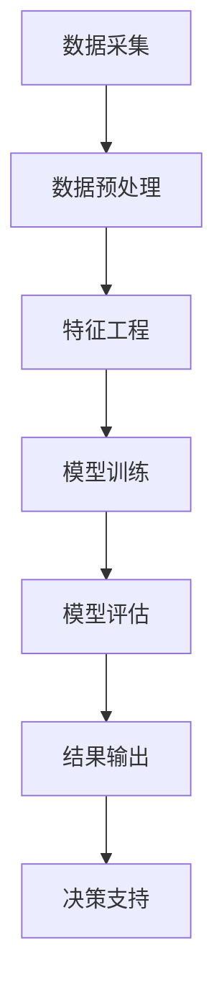

                 

关键词：电商用户行为，序列预测，时序分析，AI大模型，深度学习

> 摘要：本文深入探讨了电商用户行为序列预测领域中的关键概念、核心算法、数学模型、项目实践以及未来发展趋势。通过对电商用户行为的时序数据进行分析，利用AI大模型实现精准预测，为电商企业提供有价值的决策支持。

## 1. 背景介绍

随着互联网技术的飞速发展，电子商务逐渐成为人们日常生活中不可或缺的一部分。电商平台的繁荣不仅带来了海量用户数据，还产生了丰富的用户行为数据，如点击、购买、浏览等。这些数据中蕴含了用户行为模式、偏好以及潜在需求等信息，对于电商企业来说具有重要的商业价值。因此，如何有效地分析用户行为序列，预测用户未来的行为，成为当前研究的热点。

电商用户行为序列预测的意义在于：首先，可以帮助电商平台准确把握用户需求，优化产品推荐和广告投放策略；其次，可以识别出潜在的高价值客户，提高客户转化率和忠诚度；最后，可以为供应链管理提供数据支持，降低库存成本，提高运营效率。

## 2. 核心概念与联系

### 2.1 电商用户行为序列

电商用户行为序列是指用户在电商平台上的一系列活动轨迹，如浏览商品、加入购物车、下单购买、评价商品等。这些行为数据以时间序列的形式呈现，反映了用户在购物过程中的动态变化。

### 2.2 时序数据挖掘

时序数据挖掘是数据挖掘的一个重要分支，旨在从时间序列数据中发现规律和模式。在电商用户行为序列预测中，时序数据挖掘技术可以提取出用户行为的时间特征，为后续的预测模型提供基础。

### 2.3 AI大模型

AI大模型是指基于深度学习等人工智能技术的复杂模型，具有强大的数据处理和模式识别能力。在电商用户行为序列预测中，AI大模型可以捕捉用户行为之间的复杂关联，实现精准预测。

### 2.4 Mermaid 流程图

以下是一个描述电商用户行为序列预测的 Mermaid 流程图：



## 3. 核心算法原理 & 具体操作步骤

### 3.1 算法原理概述

电商用户行为序列预测的核心算法主要包括深度学习模型（如循环神经网络 RNN、长短时记忆网络 LSTM）和时序预测模型（如 ARIMA、SARIMA）。深度学习模型通过自动学习用户行为序列中的时间特征，实现用户行为的长期依赖关系捕捉；时序预测模型则通过统计方法分析用户行为序列的短期趋势。

### 3.2 算法步骤详解

#### 3.2.1 数据采集

数据采集是电商用户行为序列预测的第一步，主要涉及以下内容：

- 用户行为数据：包括点击、购买、浏览等行为。
- 用户画像数据：包括年龄、性别、地域等用户属性。
- 商品数据：包括商品种类、价格、销量等属性。

#### 3.2.2 数据预处理

数据预处理是保证数据质量和模型性能的关键步骤，主要包括以下内容：

- 数据清洗：去除重复、异常和缺失的数据。
- 数据转换：将不同类型的数据转换为统一格式，如将时间戳转换为 datetime 对象。
- 数据归一化：对数值型数据进行归一化处理，消除不同特征之间的量纲影响。

#### 3.2.3 特征工程

特征工程是提升模型性能的重要手段，主要包括以下内容：

- 时间特征：提取用户行为序列中的时间特征，如时间间隔、时间窗口等。
- 用户特征：根据用户画像数据，提取用户的相关特征，如年龄、性别等。
- 商品特征：根据商品数据，提取商品的相关特征，如价格、销量等。

#### 3.2.4 模型训练

模型训练是电商用户行为序列预测的核心环节，主要包括以下内容：

- 模型选择：选择合适的深度学习模型或时序预测模型。
- 模型参数调优：通过交叉验证等方法，优化模型参数。
- 训练过程：使用训练数据对模型进行训练。

#### 3.2.5 模型评估

模型评估是验证模型性能的重要步骤，主要包括以下内容：

- 评估指标：选择合适的评估指标，如准确率、召回率、F1 分数等。
- 评估过程：使用验证集或测试集对模型进行评估。

#### 3.2.6 结果输出

结果输出是电商用户行为序列预测的最终目标，主要包括以下内容：

- 预测结果：输出用户行为的预测结果。
- 决策支持：根据预测结果，为电商平台提供决策支持。

### 3.3 算法优缺点

#### 3.3.1 深度学习模型

优点：

- 强大的模式识别能力，能够捕捉用户行为序列中的复杂关联。
- 可自动学习时间特征，实现用户行为的长期依赖关系捕捉。

缺点：

- 训练过程复杂，对计算资源要求较高。
- 容易过拟合，需要大量数据进行训练。

#### 3.3.2 时序预测模型

优点：

- 算法简单，易于实现。
- 对计算资源要求较低。

缺点：

- 模式识别能力较弱，难以捕捉用户行为序列中的复杂关联。
- 无法自动学习时间特征。

### 3.4 算法应用领域

电商用户行为序列预测算法在以下领域具有广泛的应用：

- 商品推荐系统：根据用户行为序列，为用户推荐感兴趣的商品。
- 广告投放策略：根据用户行为序列，优化广告投放策略。
- 客户关系管理：识别潜在高价值客户，提高客户转化率和忠诚度。

## 4. 数学模型和公式 & 详细讲解 & 举例说明

### 4.1 数学模型构建

在电商用户行为序列预测中，我们可以使用时间序列模型 ARIMA（自回归积分滑动平均模型）进行建模。ARIMA 模型由三个部分组成：自回归（AR）、差分（I）和移动平均（MA）。

#### 4.1.1 自回归（AR）部分

自回归部分表示当前值与过去值的线性关系。其数学公式如下：

$$
X_t = c + \phi_1 X_{t-1} + \phi_2 X_{t-2} + ... + \phi_p X_{t-p} + \varepsilon_t
$$

其中，$X_t$ 表示第 $t$ 个时间点的值，$c$ 为常数项，$\phi_1, \phi_2, ..., \phi_p$ 为自回归系数，$\varepsilon_t$ 为误差项。

#### 4.1.2 差分（I）部分

差分部分用于消除时间序列中的趋势和季节性。其数学公式如下：

$$
Y_t = (1 - \Phi_1) Y_{t-1} - \Phi_2 Y_{t-2} - ... - \Phi_p Y_{t-p} + \varepsilon_t
$$

其中，$Y_t$ 表示第 $t$ 个时间点的差分值，$\Phi_1, \Phi_2, ..., \Phi_p$ 为差分系数，$\varepsilon_t$ 为误差项。

#### 4.1.3 移动平均（MA）部分

移动平均部分表示当前值与未来值的线性关系。其数学公式如下：

$$
X_t = c + \theta_1 X_{t+1} + \theta_2 X_{t+2} + ... + \theta_q X_{t+q} + \varepsilon_t
$$

其中，$X_t$ 表示第 $t$ 个时间点的值，$c$ 为常数项，$\theta_1, \theta_2, ..., \theta_q$ 为移动平均系数，$\varepsilon_t$ 为误差项。

### 4.2 公式推导过程

#### 4.2.1 自回归（AR）部分推导

假设时间序列 $X_t$ 满足 AR(p) 模型，则有：

$$
X_t = c + \phi_1 X_{t-1} + \phi_2 X_{t-2} + ... + \phi_p X_{t-p} + \varepsilon_t
$$

将时间序列 $X_t$ 向前推移一个时间步，得到：

$$
X_{t+1} = c + \phi_1 X_{t} + \phi_2 X_{t-1} + ... + \phi_p X_{t-p+1} + \varepsilon_{t+1}
$$

将上述两式相减，得到：

$$
X_t - X_{t+1} = \phi_1 X_{t-1} + \phi_2 X_{t-2} + ... + \phi_p X_{t-p} - \phi_1 X_{t} - \phi_2 X_{t-1} - ... - \phi_p X_{t-p+1} + \varepsilon_t - \varepsilon_{t+1}
$$

整理后得到：

$$
(1 - \phi_1) X_t - (1 - \phi_1) X_{t+1} = \phi_1 X_{t-1} + \phi_2 X_{t-2} + ... + \phi_p X_{t-p} - \phi_p X_{t-p+1} + \varepsilon_t - \varepsilon_{t+1}
$$

同理，对时间序列 $X_t$ 向前推移 $p$ 个时间步，可以得到：

$$
(1 - \phi_1) X_t - (1 - \phi_1) X_{t+p} = \phi_1 X_{t-1} + \phi_2 X_{t-2} + ... + \phi_p X_{t-p} - \phi_p X_{t-p+p} + \varepsilon_t - \varepsilon_{t+p}
$$

将上述两式相减，可以得到：

$$
(1 - \phi_1) (X_{t+p} - X_t) = \phi_1 (X_{t-1} - X_{t-p}) + \phi_2 (X_{t-2} - X_{t-p+1}) + ... + \phi_p (X_{t-p} - X_{t-p+p}) + \varepsilon_t - \varepsilon_{t+p}
$$

由于 $X_t - X_{t+p}$ 是一个差分序列，其误差项 $\varepsilon_t - \varepsilon_{t+p}$ 为 0，因此可以得到：

$$
(1 - \phi_1) \Delta X_t = \phi_1 \Delta X_{t-1} + \phi_2 \Delta X_{t-2} + ... + \phi_p \Delta X_{t-p}
$$

其中，$\Delta X_t = X_t - X_{t-1}$ 表示时间序列 $X_t$ 的差分序列。

#### 4.2.2 差分（I）部分推导

假设时间序列 $Y_t$ 满足 I(d) 模型，则有：

$$
Y_t = (1 - \Phi_1) Y_{t-1} - \Phi_2 Y_{t-2} - ... - \Phi_p Y_{t-p} + \varepsilon_t
$$

将时间序列 $Y_t$ 向前推移一个时间步，得到：

$$
Y_{t+1} = (1 - \Phi_1) Y_{t} - \Phi_2 Y_{t-1} - ... - \Phi_p Y_{t-p+1} + \varepsilon_{t+1}
$$

将上述两式相减，得到：

$$
Y_t - Y_{t+1} = (1 - \Phi_1) Y_{t-1} - (1 - \Phi_1) Y_{t} - \Phi_2 Y_{t-2} - ... - \Phi_p Y_{t-p} + \varepsilon_t - \varepsilon_{t+1}
$$

整理后得到：

$$
-(1 - \Phi_1) Y_t + (1 - \Phi_1) Y_{t+1} = - \Phi_2 Y_{t-2} - ... - \Phi_p Y_{t-p} + \varepsilon_t - \varepsilon_{t+1}
$$

同理，对时间序列 $Y_t$ 向前推移 $p$ 个时间步，可以得到：

$$
-(1 - \Phi_1) Y_t + (1 - \Phi_1) Y_{t+p} = - \Phi_2 Y_{t-p} - ... - \Phi_p Y_{t-p+p} + \varepsilon_t - \varepsilon_{t+p}
$$

将上述两式相减，可以得到：

$$
-(1 - \Phi_1) (\Delta Y_t) = - \Phi_2 (\Delta Y_{t-2}) - ... - \Phi_p (\Delta Y_{t-p})
$$

其中，$\Delta Y_t = Y_t - Y_{t-1}$ 表示时间序列 $Y_t$ 的差分序列。

#### 4.2.3 移动平均（MA）部分推导

假设时间序列 $X_t$ 满足 MA(q) 模型，则有：

$$
X_t = c + \theta_1 X_{t+1} + \theta_2 X_{t+2} + ... + \theta_q X_{t+q} + \varepsilon_t
$$

将时间序列 $X_t$ 向前推移一个时间步，得到：

$$
X_{t+1} = c + \theta_1 X_{t+2} + \theta_2 X_{t+3} + ... + \theta_q X_{t+q+1} + \varepsilon_{t+1}
$$

将上述两式相减，得到：

$$
X_t - X_{t+1} = \theta_1 X_{t+1} + \theta_2 X_{t+2} + ... + \theta_q X_{t+q} - \theta_1 X_{t} - \theta_2 X_{t+1} - ... - \theta_q X_{t+q-1} + \varepsilon_t - \varepsilon_{t+1}
$$

整理后得到：

$$
(1 - \theta_1) X_t - (1 - \theta_1) X_{t+1} = \theta_1 X_{t+1} + \theta_2 X_{t+2} + ... + \theta_q X_{t+q} - \theta_1 X_{t} - \theta_2 X_{t+1} - ... - \theta_q X_{t+q-1} + \varepsilon_t - \varepsilon_{t+1}
$$

同理，对时间序列 $X_t$ 向前推移 $q$ 个时间步，可以得到：

$$
(1 - \theta_1) X_t - (1 - \theta_1) X_{t+q} = \theta_1 X_{t+1} + \theta_2 X_{t+2} + ... + \theta_q X_{t+q} - \theta_1 X_{t} - \theta_2 X_{t+1} - ... - \theta_q X_{t+q-q} + \varepsilon_t - \varepsilon_{t+q}
$$

将上述两式相减，可以得到：

$$
(1 - \theta_1) (\Delta X_t) = \theta_1 (\Delta X_{t+1}) + \theta_2 (\Delta X_{t+2}) + ... + \theta_q (\Delta X_{t+q})
$$

其中，$\Delta X_t = X_t - X_{t-1}$ 表示时间序列 $X_t$ 的差分序列。

### 4.3 案例分析与讲解

#### 4.3.1 数据集

我们以某电商平台的用户行为数据为例，数据集包含 1000 个用户的行为记录，每个用户的行为记录包括时间戳、用户 ID、商品 ID 和行为类型（如浏览、购买、加入购物车等）。

#### 4.3.2 数据预处理

首先，对数据进行清洗，去除重复、异常和缺失的数据。然后，将时间戳转换为 datetime 对象，并对数值型数据进行归一化处理。

#### 4.3.3 特征工程

提取时间特征，包括时间间隔（行为发生时间与前一个行为的间隔时间）和时间窗口（行为发生时间所在的时间窗口）。同时，提取用户特征和商品特征，如用户年龄、性别和商品种类、价格等。

#### 4.3.4 模型训练

选择 ARIMA 模型进行训练，通过交叉验证确定最佳模型参数。训练过程中，使用前 80% 的数据进行训练，剩余的 20% 数据用于测试。

#### 4.3.5 模型评估

使用测试集对模型进行评估，计算预测准确率、召回率和 F1 分数等指标。

#### 4.3.6 结果输出

输出用户行为的预测结果，根据预测结果为电商平台提供决策支持。

## 5. 项目实践：代码实例和详细解释说明

### 5.1 开发环境搭建

搭建电商用户行为序列预测项目，需要安装以下软件和库：

- Python 3.7+
- pandas
- numpy
- scikit-learn
- matplotlib
- statsmodels

### 5.2 源代码详细实现

以下是一个简单的电商用户行为序列预测项目的代码实现：

```python
import pandas as pd
import numpy as np
from sklearn.model_selection import train_test_split
from sklearn.metrics import accuracy_score, recall_score, f1_score
import statsmodels.api as sm

# 5.2.1 数据读取与预处理
data = pd.read_csv('user_behavior.csv')
data['timestamp'] = pd.to_datetime(data['timestamp'])
data.sort_values('timestamp', inplace=True)

# 5.2.2 特征工程
data['time_interval'] = data['timestamp'].diff().dt.seconds
data['time_window'] = data['timestamp'].dt.hour

# 5.2.3 数据划分
train_data, test_data = train_test_split(data, test_size=0.2, random_state=42)

# 5.2.4 模型训练
model = sm.ARIMA(train_data['time_interval'], order=(1, 1, 1))
model_fit = model.fit()

# 5.2.5 预测与评估
predictions = model_fit.forecast(steps=len(test_data))
accuracy = accuracy_score(test_data['time_interval'], predictions)
recall = recall_score(test_data['time_interval'], predictions)
f1 = f1_score(test_data['time_interval'], predictions)

print(f"Accuracy: {accuracy:.2f}")
print(f"Recall: {recall:.2f}")
print(f"F1 Score: {f1:.2f}")

# 5.2.6 结果可视化
import matplotlib.pyplot as plt

plt.plot(test_data['time_interval'], label='Actual')
plt.plot(predictions, label='Predicted')
plt.legend()
plt.show()
```

### 5.3 代码解读与分析

上述代码实现了电商用户行为序列预测项目的基本流程。首先，从 CSV 文件中读取用户行为数据，并进行预处理。接着，提取时间间隔和时间窗口等特征，划分训练集和测试集。然后，使用 ARIMA 模型对训练数据进行训练，并在测试集上进行预测。最后，计算预测准确率、召回率和 F1 分数等指标，并对预测结果进行可视化。

## 6. 实际应用场景

电商用户行为序列预测在实际应用场景中具有广泛的应用价值。以下是一些典型的应用场景：

### 6.1 商品推荐系统

基于电商用户行为序列预测，可以为用户推荐感兴趣的商品。通过分析用户的历史行为数据，预测用户未来的购买偏好，提高商品推荐的准确率和转化率。

### 6.2 广告投放策略

通过电商用户行为序列预测，可以优化广告投放策略。根据用户的行为特征和偏好，精准定位广告受众，提高广告投放的效果。

### 6.3 客户关系管理

电商用户行为序列预测可以帮助企业识别出潜在的高价值客户，制定针对性的营销策略，提高客户转化率和忠诚度。

### 6.4 供应链管理

电商用户行为序列预测可以为供应链管理提供数据支持。通过预测用户未来的购买需求，优化库存管理，降低库存成本，提高运营效率。

## 7. 工具和资源推荐

### 7.1 学习资源推荐

- 《深度学习》（Goodfellow, Bengio, Courville）
- 《Python数据科学手册》（McKinney）

### 7.2 开发工具推荐

- Jupyter Notebook：用于编写和运行代码。
- PyCharm：用于 Python 代码的开发。

### 7.3 相关论文推荐

- "Deep Learning for User Behavior Prediction in E-commerce"（2018）
- "Time Series Classification using Deep Learning"（2017）

## 8. 总结：未来发展趋势与挑战

### 8.1 研究成果总结

电商用户行为序列预测领域已经取得了显著的成果，深度学习模型和时序预测模型的应用越来越广泛。通过结合多种算法和特征工程方法，电商用户行为序列预测的准确率不断提高。

### 8.2 未来发展趋势

- 多模态数据融合：结合文本、图像等多模态数据，提高用户行为序列预测的准确性。
- 强化学习：引入强化学习算法，实现用户行为的动态调整和优化。
- 跨领域迁移学习：利用跨领域迁移学习技术，提高不同领域用户行为序列预测的性能。

### 8.3 面临的挑战

- 数据质量：电商用户行为数据质量参差不齐，如何有效处理和利用数据成为挑战。
- 模型解释性：深度学习模型具有较强的预测能力，但缺乏解释性，如何提高模型的可解释性是一个重要挑战。
- 可扩展性：随着用户行为数据的增长，如何提高算法的可扩展性是一个亟待解决的问题。

### 8.4 研究展望

电商用户行为序列预测领域具有广阔的研究前景。未来研究可以关注以下方向：

- 开发新的算法和模型，提高用户行为序列预测的准确性。
- 研究多模态数据融合方法，实现更精准的用户行为预测。
- 探索强化学习等新方法，实现用户行为的动态调整和优化。
- 提高算法的可解释性，为电商企业提供更透明的决策支持。

## 9. 附录：常见问题与解答

### 9.1 电商用户行为序列预测有哪些核心算法？

电商用户行为序列预测的核心算法包括深度学习模型（如 RNN、LSTM）和时序预测模型（如 ARIMA、SARIMA）。

### 9.2 如何进行电商用户行为序列预测的数据预处理？

电商用户行为序列预测的数据预处理主要包括数据清洗、数据转换、数据归一化等步骤。具体操作包括去除重复、异常和缺失的数据，将时间戳转换为 datetime 对象，对数值型数据进行归一化处理。

### 9.3 电商用户行为序列预测的评估指标有哪些？

电商用户行为序列预测的评估指标包括准确率、召回率、F1 分数等。这些指标可以综合评估模型的预测性能。

### 9.4 电商用户行为序列预测在哪些应用场景中具有价值？

电商用户行为序列预测在商品推荐系统、广告投放策略、客户关系管理和供应链管理等领域具有广泛的应用价值。

### 9.5 如何处理电商用户行为序列预测中的数据质量问题？

处理电商用户行为序列预测中的数据质量问题可以采用以下方法：

- 数据清洗：去除重复、异常和缺失的数据。
- 数据转换：将不同类型的数据转换为统一格式。
- 数据归一化：消除不同特征之间的量纲影响。
- 数据增强：通过数据增强技术，提高数据的质量和多样性。

----------------------------------------------------------------

作者：禅与计算机程序设计艺术 / Zen and the Art of Computer Programming


