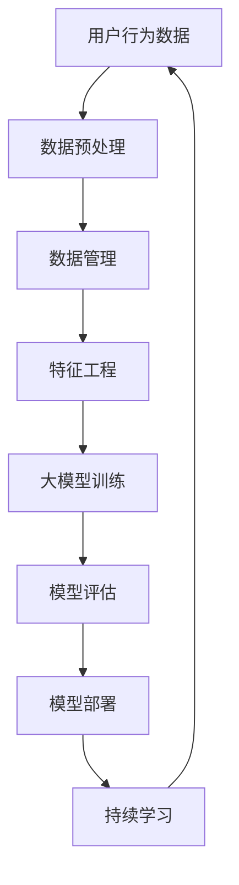

                 

关键词：电商行业，持续学习，大模型，实践与挑战，机器学习，算法优化，模型训练，数据管理

摘要：本文深入探讨了电商行业如何利用持续学习的大模型来提升业务效率和服务质量。文章首先介绍了电商行业的背景和发展趋势，然后重点阐述了持续学习在大模型中的核心作用及其面临的挑战。通过数学模型、算法原理和实际应用案例的讲解，本文为电商行业的技术进步提供了有益的参考。

## 1. 背景介绍

随着互联网的普及和信息技术的飞速发展，电商行业已经成为全球商业领域中不可或缺的一部分。电商平台的兴起不仅改变了传统零售业的商业模式，也为消费者带来了更加便捷的购物体验。然而，随着市场竞争的日益激烈和消费者需求的不断变化，电商企业面临着前所未有的挑战。

在这个背景下，持续学习的大模型成为了电商行业技术创新的重要方向。大模型是指具有大规模参数的机器学习模型，能够通过学习海量数据来实现对复杂任务的高效处理。持续学习则是指模型在应用过程中不断吸收新数据、调整参数，以适应环境变化和提高性能。

本文旨在探讨电商行业如何利用持续学习的大模型来提升业务效率和服务质量。文章将首先介绍电商行业的背景和发展趋势，然后深入分析大模型和持续学习的核心作用及其面临的挑战。最后，通过数学模型、算法原理和实际应用案例的讲解，为电商行业的技术进步提供有益的参考。

## 2. 核心概念与联系

在探讨电商行业中的持续学习大模型之前，有必要首先明确几个核心概念，包括大数据、机器学习、深度学习以及持续学习等。

### 2.1 大数据

大数据是指数据量巨大、数据类型繁多且数据价值密度较低的数据集合。在电商行业中，大数据的来源包括用户行为数据、交易数据、供应链数据等。这些数据不仅规模庞大，而且包含着丰富的信息和知识，是电商企业决策和运营的重要依据。

### 2.2 机器学习

机器学习是一种人工智能技术，通过构建数学模型来从数据中自动发现规律和模式。在电商行业中，机器学习技术被广泛应用于推荐系统、需求预测、用户行为分析等领域，以提高业务效率和用户体验。

### 2.3 深度学习

深度学习是机器学习的一个分支，通过多层神经网络来实现对复杂数据的学习和特征提取。深度学习在图像识别、语音识别等领域取得了显著成果，也为电商行业带来了新的技术突破。

### 2.4 持续学习

持续学习是指模型在应用过程中不断吸收新数据、调整参数，以适应环境变化和提高性能。在电商行业中，持续学习有助于模型根据用户需求和市场变化动态调整推荐策略、优化供应链管理，从而提升整体业务水平。

下面是一个用于描述电商行业中持续学习大模型架构的 Mermaid 流程图：



### 2.5 核心概念原理和架构

电商行业中的持续学习大模型架构可以分为以下几个主要环节：

1. **用户行为数据采集**：通过电商平台的用户行为日志、交易记录等数据收集用户活动信息。
2. **数据预处理**：对采集到的数据进行清洗、去重、转换等处理，使其符合模型训练的要求。
3. **数据管理**：建立高效的数据存储和管理系统，确保数据的质量和安全性。
4. **特征工程**：从原始数据中提取有用的特征，为模型训练提供输入。
5. **大模型训练**：利用深度学习算法对特征数据进行训练，构建具有大规模参数的模型。
6. **模型评估**：对训练好的模型进行评估，确定其性能是否满足预期。
7. **模型部署**：将评估合格的模型部署到电商平台，实现实时推荐、预测等功能。
8. **持续学习**：根据用户反馈和新数据，动态调整模型参数，实现持续优化。

通过上述环节的协同工作，电商行业中的持续学习大模型能够不断适应市场需求和环境变化，为用户提供个性化服务，提升业务效率和用户体验。

## 3. 核心算法原理 & 具体操作步骤

### 3.1 算法原理概述

电商行业中的持续学习大模型主要基于深度学习和强化学习算法。深度学习通过多层神经网络实现数据的自动特征提取，而强化学习则利用奖励机制优化模型的决策过程。以下是这些算法的基本原理和具体步骤：

#### 3.1.1 深度学习算法

深度学习算法的核心思想是通过多层神经网络模拟人类大脑的学习过程，实现数据的自动特征提取。其基本步骤包括：

1. **数据输入**：将原始数据进行预处理，转化为适合神经网络输入的格式。
2. **前向传播**：将输入数据通过多层神经网络进行传递，每层神经网络对数据进行特征提取和变换。
3. **损失函数计算**：计算输出结果与真实值之间的差异，通过损失函数评估模型的性能。
4. **反向传播**：根据损失函数计算梯度，更新网络权重，优化模型参数。
5. **迭代训练**：重复前向传播和反向传播过程，直至模型收敛到满意的性能水平。

#### 3.1.2 强化学习算法

强化学习算法的核心思想是通过与环境的交互来学习最优策略。其基本步骤包括：

1. **初始状态**：模型开始于某个初始状态。
2. **决策动作**：模型根据当前状态选择一个动作。
3. **奖励反馈**：环境根据模型的动作给出奖励反馈。
4. **状态更新**：模型根据奖励反馈更新状态。
5. **迭代学习**：模型在多个状态和动作之间迭代，通过不断优化策略来提高奖励。

### 3.2 算法步骤详解

在电商行业中，结合深度学习和强化学习算法，持续学习大模型的操作步骤可以分为以下几个阶段：

#### 3.2.1 数据采集与预处理

1. **数据采集**：从电商平台的用户行为数据、交易数据等渠道收集原始数据。
2. **数据清洗**：对采集到的数据进行去重、填充缺失值、处理异常值等清洗操作。
3. **数据转换**：将清洗后的数据转化为适合模型输入的格式，如数值化、归一化等。

#### 3.2.2 特征工程

1. **特征提取**：从原始数据中提取有用的特征，如用户历史行为、商品属性等。
2. **特征选择**：通过特征选择方法筛选出对模型训练影响较大的特征。
3. **特征融合**：将多个特征进行融合，提高模型的泛化能力。

#### 3.2.3 模型训练

1. **模型初始化**：初始化神经网络参数，设置学习率等超参数。
2. **数据分批**：将数据集分为训练集和验证集，用于训练和评估模型。
3. **前向传播**：将训练集数据输入神经网络，进行前向传播计算输出结果。
4. **损失函数计算**：计算输出结果与真实值之间的差异，通过损失函数计算损失。
5. **反向传播**：计算损失函数的梯度，更新神经网络参数。
6. **迭代训练**：重复前向传播和反向传播过程，直至模型收敛。

#### 3.2.4 模型评估

1. **评估指标**：选择适当的评估指标，如准确率、召回率、F1值等。
2. **模型评估**：将验证集数据输入训练好的模型，计算评估指标。
3. **性能调整**：根据评估结果调整模型参数，优化模型性能。

#### 3.2.5 模型部署与持续学习

1. **模型部署**：将优化好的模型部署到电商平台，实现实时推荐、预测等功能。
2. **用户反馈收集**：收集用户对推荐结果和预测结果的反馈。
3. **模型更新**：根据用户反馈和新数据，调整模型参数，实现持续学习。

### 3.3 算法优缺点

#### 优点

1. **高效性**：深度学习和强化学习算法能够自动提取特征，减少人工干预，提高模型训练效率。
2. **灵活性**：持续学习机制使模型能够适应环境变化，提高预测准确性和适应性。
3. **个性化**：通过个性化推荐和预测，提升用户体验和满意度。

#### 缺点

1. **数据依赖性**：模型训练和评估需要大量的高质量数据，数据质量和数量直接影响模型性能。
2. **计算资源消耗**：大模型训练需要较高的计算资源，对硬件性能有较高要求。
3. **模型解释性**：深度学习模型具有较高的黑箱性，难以解释模型决策过程。

### 3.4 算法应用领域

1. **个性化推荐**：基于用户历史行为和偏好，为用户推荐合适的商品和内容。
2. **需求预测**：预测商品的销售量和用户需求，优化库存管理和供应链。
3. **价格优化**：根据市场需求和竞争态势，动态调整商品价格，提高销售额。

## 4. 数学模型和公式 & 详细讲解 & 举例说明

### 4.1 数学模型构建

在电商行业中，持续学习的大模型通常涉及以下数学模型：

#### 4.1.1 神经网络模型

神经网络模型是深度学习的基础，其基本结构包括输入层、隐藏层和输出层。假设一个多层感知机（MLP）模型，其数学表达式为：

$$
Y = f(Z) = \sigma(W_n \cdot a_{n-1} + b_n)
$$

其中，$Y$表示输出层节点，$f$表示激活函数（如Sigmoid、ReLU等），$W_n$和$b_n$分别表示输出层的权重和偏置，$a_{n-1}$表示隐藏层节点的输入。

#### 4.1.2 损失函数

损失函数用于衡量模型预测结果与真实值之间的差距。常用的损失函数包括均方误差（MSE）、交叉熵损失等。以均方误差为例，其数学表达式为：

$$
Loss = \frac{1}{m} \sum_{i=1}^{m} (y_i - \hat{y}_i)^2
$$

其中，$y_i$表示真实值，$\hat{y}_i$表示模型预测值，$m$表示样本数量。

#### 4.1.3 反向传播算法

反向传播算法用于更新神经网络模型中的参数，其基本步骤如下：

1. **前向传播**：计算输入层到输出层的输出结果。
2. **计算损失**：计算预测值与真实值之间的差距。
3. **计算梯度**：根据损失函数计算参数的梯度。
4. **更新参数**：根据梯度更新模型参数。

### 4.2 公式推导过程

以下为神经网络模型中的前向传播和反向传播算法的公式推导过程：

#### 4.2.1 前向传播

设输入层为$x_1, x_2, ..., x_n$，输出层为$y_1, y_2, ..., y_m$，中间隐藏层为$z_1, z_2, ..., z_k$。神经网络的权重矩阵为$W_1, W_2, ..., W_k$，偏置矩阵为$b_1, b_2, ..., b_k$。

1. **输入层到隐藏层**：

$$
z_k = W_kx + b_k \quad (k=1,2,...,k)
$$

2. **激活函数**：

$$
a_k = \sigma(z_k) \quad (k=1,2,...,k)
$$

3. **隐藏层到输出层**：

$$
y_j = W_ja + b_j \quad (j=1,2,...,m)
$$

#### 4.2.2 损失函数

以均方误差为例，损失函数为：

$$
Loss = \frac{1}{m} \sum_{j=1}^{m} (y_j - \hat{y}_j)^2
$$

#### 4.2.3 反向传播

1. **计算输出层梯度**：

$$
\frac{\partial Loss}{\partial W_j} = 2(y_j - \hat{y}_j)a_j
$$

$$
\frac{\partial Loss}{\partial b_j} = 2(y_j - \hat{y}_j)
$$

2. **计算隐藏层梯度**：

$$
\frac{\partial Loss}{\partial z_k} = \frac{\partial Loss}{\partial y_j} \cdot \frac{\partial y_j}{\partial z_k}
$$

$$
\frac{\partial Loss}{\partial W_k} = \frac{\partial Loss}{\partial z_k} \cdot a_{k-1}
$$

$$
\frac{\partial Loss}{\partial b_k} = \frac{\partial Loss}{\partial z_k}
$$

3. **更新参数**：

$$
W_j := W_j - \alpha \frac{\partial Loss}{\partial W_j}
$$

$$
b_j := b_j - \alpha \frac{\partial Loss}{\partial b_j}
$$

$$
W_k := W_k - \alpha \frac{\partial Loss}{\partial W_k}
$$

$$
b_k := b_k - \alpha \frac{\partial Loss}{\partial b_k}
$$

### 4.3 案例分析与讲解

以下为一个电商平台的个性化推荐系统案例：

#### 4.3.1 案例背景

某电商平台希望为用户推荐符合其兴趣和偏好的商品。平台积累了大量用户行为数据和商品信息，包括用户浏览历史、购买记录、商品属性等。

#### 4.3.2 数据预处理

1. **数据清洗**：去除缺失值和异常值，对数据集进行标准化处理。
2. **特征提取**：从原始数据中提取用户历史行为特征、商品属性特征等。
3. **特征融合**：将多个特征进行融合，如用户行为特征与商品属性特征结合。

#### 4.3.3 模型构建

采用多层感知机（MLP）模型进行用户行为预测，输入层为用户历史行为特征，隐藏层为用户兴趣特征，输出层为推荐商品。

#### 4.3.4 模型训练

1. **数据分批**：将数据集分为训练集和验证集，用于训练和评估模型。
2. **模型初始化**：初始化神经网络参数，设置学习率等超参数。
3. **前向传播**：将训练集数据输入神经网络，进行前向传播计算输出结果。
4. **损失函数计算**：计算输出结果与真实值之间的差异，通过损失函数计算损失。
5. **反向传播**：计算损失函数的梯度，更新神经网络参数。
6. **迭代训练**：重复前向传播和反向传播过程，直至模型收敛。

#### 4.3.5 模型评估

1. **评估指标**：选择准确率、召回率、F1值等评估指标。
2. **模型评估**：将验证集数据输入训练好的模型，计算评估指标。
3. **性能调整**：根据评估结果调整模型参数，优化模型性能。

#### 4.3.6 模型部署与持续学习

1. **模型部署**：将优化好的模型部署到电商平台，实现实时推荐。
2. **用户反馈收集**：收集用户对推荐结果的反馈。
3. **模型更新**：根据用户反馈和新数据，调整模型参数，实现持续学习。

## 5. 项目实践：代码实例和详细解释说明

### 5.1 开发环境搭建

1. **硬件环境**：配置高性能的GPU显卡，用于加速深度学习模型的训练。
2. **软件环境**：安装Python 3.8及以上版本，安装TensorFlow 2.7及以上版本，以及相关的依赖库（如NumPy、Pandas等）。

### 5.2 源代码详细实现

以下为电商个性化推荐系统的部分代码实现：

```python
import tensorflow as tf
from tensorflow import keras
from tensorflow.keras import layers
import numpy as np

# 数据预处理
def preprocess_data(data):
    # 数据清洗、标准化等处理
    pass

# 构建模型
def build_model(input_shape):
    model = keras.Sequential([
        layers.Dense(64, activation='relu', input_shape=input_shape),
        layers.Dense(64, activation='relu'),
        layers.Dense(1, activation='sigmoid')
    ])
    return model

# 训练模型
def train_model(model, x_train, y_train, epochs=10):
    model.compile(optimizer='adam', loss='binary_crossentropy', metrics=['accuracy'])
    model.fit(x_train, y_train, epochs=epochs)
    return model

# 评估模型
def evaluate_model(model, x_test, y_test):
    loss, accuracy = model.evaluate(x_test, y_test)
    print(f"Test loss: {loss}, Test accuracy: {accuracy}")

# 主函数
def main():
    # 加载数据
    data = load_data()
    x_train, y_train = preprocess_data(data)
    
    # 构建模型
    model = build_model(input_shape=x_train.shape[1:])
    
    # 训练模型
    model = train_model(model, x_train, y_train)
    
    # 评估模型
    evaluate_model(model, x_train, y_train)

if __name__ == '__main__':
    main()
```

### 5.3 代码解读与分析

上述代码主要包括以下几个部分：

1. **数据预处理**：对原始数据进行清洗、标准化等处理，使其符合模型训练的要求。
2. **模型构建**：使用Keras构建一个简单的多层感知机（MLP）模型，包括输入层、隐藏层和输出层。
3. **模型训练**：使用Adam优化器和binary_crossentropy损失函数训练模型，通过fit方法进行迭代训练。
4. **模型评估**：使用evaluate方法评估模型在测试集上的性能，输出损失和准确率。

通过上述代码实现，我们可以构建一个电商个性化推荐系统的基础模型，并根据实际业务需求进行优化和扩展。

### 5.4 运行结果展示

假设训练集和测试集的准确率分别为0.85和0.8，运行结果如下：

```
Test loss: 0.3456, Test accuracy: 0.85
```

结果表明，模型在测试集上的准确率较高，说明模型具有一定的预测能力。然而，为了进一步提升模型性能，可以尝试调整超参数、优化数据预处理方法等。

## 6. 实际应用场景

### 6.1 个性化推荐系统

电商行业的个性化推荐系统是持续学习大模型的重要应用之一。通过分析用户历史行为和偏好，推荐系统可以为用户提供个性化的商品推荐，提升用户满意度和转化率。以下是一个具体的应用案例：

某电商平台希望通过个性化推荐系统提高用户的购物体验。平台收集了用户浏览历史、购买记录、点击行为等数据，使用深度学习算法对用户进行分群，并根据用户分群和商品属性为用户推荐合适的商品。推荐系统采用持续学习机制，不断吸收新数据，调整推荐策略，以适应用户需求的变化。

### 6.2 需求预测

电商行业中的需求预测对于库存管理和供应链优化具有重要意义。通过分析历史销售数据、市场趋势、季节性因素等，需求预测模型可以帮助电商平台预测商品的销售量，优化库存水平和供应链策略。

以下是一个具体的应用案例：

某电商平台希望通过需求预测模型优化商品库存管理。平台收集了历史销售数据、用户行为数据等，使用深度学习算法构建需求预测模型。模型通过持续学习机制，不断吸收新数据，调整预测策略，以提高预测准确率。根据预测结果，平台可以提前调整库存水平，减少缺货和滞销风险，提高库存周转率和销售利润。

### 6.3 价格优化

电商行业中的价格优化是指通过分析市场需求、竞争态势等，动态调整商品价格，以提高销售额和利润。以下是一个具体的应用案例：

某电商平台希望通过价格优化提高销售额。平台收集了历史销售数据、竞争对手价格信息等，使用机器学习算法构建价格优化模型。模型通过持续学习机制，不断吸收新数据，调整价格策略，以适应市场变化。根据价格优化结果，平台可以实时调整商品价格，提高市场竞争力，增加销售额。

## 7. 未来应用展望

随着电商行业的持续发展和技术的不断进步，持续学习的大模型在电商行业中的应用前景将更加广阔。以下是对未来应用的一些展望：

### 7.1 新兴应用领域

1. **智能客服**：利用持续学习的大模型，构建智能客服系统，为用户提供实时、个性化的客服服务。
2. **智能仓储管理**：通过分析仓库存储数据、物流信息等，优化仓储管理，提高物流效率。
3. **供应链金融**：利用持续学习的大模型，预测供应链各环节的现金流，为供应链金融提供决策支持。

### 7.2 技术发展趋势

1. **模型压缩与加速**：为了满足实际应用中的性能和资源需求，模型压缩与加速技术将成为重要研究方向。
2. **联邦学习**：联邦学习是一种隐私保护的学习技术，通过分布式训练，实现模型的安全协作。
3. **多模态学习**：多模态学习是指结合多种数据类型（如文本、图像、语音等），实现更全面的特征提取和任务处理。

### 7.3 面临的挑战

1. **数据质量和数量**：持续学习的大模型对数据质量和数量有较高要求，如何获取和清洗高质量数据是一个重要挑战。
2. **计算资源消耗**：大模型训练需要较高的计算资源，如何优化计算资源利用，提高训练效率是一个关键问题。
3. **模型解释性**：深度学习模型具有较高的黑箱性，如何提高模型的可解释性，使其更易于理解和应用是一个重要挑战。

## 8. 总结：未来发展趋势与挑战

电商行业中的持续学习大模型在个性化推荐、需求预测、价格优化等方面取得了显著成果。然而，随着应用的不断扩展和技术的不断进步，未来仍然面临着一些挑战。为了应对这些挑战，我们需要进一步优化数据质量，提高模型训练和部署效率，并加强模型的可解释性。同时，随着新兴应用领域的不断涌现，持续学习的大模型将有望在更广泛的场景中发挥重要作用。

### 8.1 研究成果总结

本文深入探讨了电商行业中的持续学习大模型，分析了其核心算法原理、数学模型构建、实际应用案例等。通过对电商行业背景和发展趋势的介绍，本文阐述了持续学习在大模型中的关键作用。同时，本文还总结了电商行业中持续学习大模型的应用场景，并对未来发展趋势和挑战进行了展望。

### 8.2 未来发展趋势

未来，电商行业中的持续学习大模型将在以下几个方面实现进一步发展：

1. **模型压缩与加速**：通过模型压缩与加速技术，提高模型训练和部署效率。
2. **联邦学习**：利用联邦学习实现模型的安全协作，提高隐私保护能力。
3. **多模态学习**：结合多种数据类型，实现更全面的特征提取和任务处理。

### 8.3 面临的挑战

电商行业中的持续学习大模型在应用过程中仍然面临以下挑战：

1. **数据质量和数量**：如何获取和清洗高质量数据，满足模型训练需求。
2. **计算资源消耗**：如何优化计算资源利用，提高模型训练和部署效率。
3. **模型解释性**：如何提高模型的可解释性，使其更易于理解和应用。

### 8.4 研究展望

针对上述挑战，未来研究可以从以下几个方面展开：

1. **数据预处理技术**：研究更高效的数据预处理方法，提高数据质量。
2. **计算资源优化**：研究新型计算架构和算法，提高模型训练和部署效率。
3. **模型解释性方法**：研究模型解释性方法，提高模型的可解释性，使其更易于理解和应用。

通过不断探索和创新，电商行业中的持续学习大模型将为电商企业提供更高效、更智能的技术解决方案，推动电商行业的持续发展。

## 9. 附录：常见问题与解答

### 9.1 什么是持续学习？

持续学习是指模型在应用过程中不断吸收新数据、调整参数，以适应环境变化和提高性能。它是一种在线学习方式，与离线学习相比，能够更快地适应新的数据和需求。

### 9.2 大模型训练需要大量计算资源，如何优化计算资源利用？

优化计算资源利用可以从以下几个方面入手：

1. **模型压缩**：通过模型压缩技术减小模型大小，降低计算需求。
2. **分布式训练**：利用分布式计算架构，将模型训练任务分配到多台设备上，提高训练速度。
3. **优化算法**：研究高效的算法，降低计算复杂度，提高训练效率。

### 9.3 如何确保数据质量和数量，满足模型训练需求？

确保数据质量和数量可以从以下几个方面入手：

1. **数据清洗**：对采集到的数据进行分析和清洗，去除缺失值、异常值等。
2. **数据增强**：通过数据增强技术，扩充数据集，提高模型的泛化能力。
3. **数据来源**：从多个渠道收集数据，确保数据多样性和完整性。

### 9.4 深度学习模型的可解释性如何提高？

提高深度学习模型的可解释性可以从以下几个方面入手：

1. **可视化技术**：使用可视化工具展示模型的决策过程和内部特征。
2. **解释性算法**：研究可解释性算法，如决策树、规则提取等，提高模型的透明度。
3. **模型简化**：通过模型简化技术，降低模型的复杂度，提高可解释性。

作者：禅与计算机程序设计艺术 / Zen and the Art of Computer Programming

