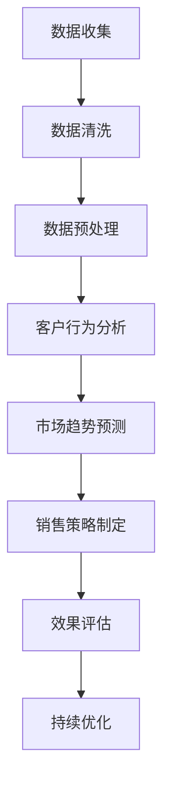

                 

### 关键词 Keywords

- 电子商务
- 大型语言模型（LLM）
- 在线销售
- 数据分析
- 客户行为
- 销售策略

### 摘要 Abstract

本文深入探讨了如何利用大型语言模型（LLM）来优化在线销售策略。我们首先介绍了电子商务的现状和挑战，然后详细阐述了LLM的核心概念和工作原理。通过数学模型和实际案例，我们展示了如何应用LLM来分析客户行为、预测销售趋势，并制定高效的在线销售策略。最后，我们对未来的应用前景和面临的挑战进行了展望，为电子商务的持续发展提供了新的思路和方法。

## 1. 背景介绍

随着互联网的普及和技术的进步，电子商务已经成为全球商业活动中不可或缺的一部分。据统计，全球电子商务市场规模已超过数万亿美元，并持续增长。电子商务不仅为企业提供了新的销售渠道，也为消费者带来了更多的便利。然而，在这个快速发展的市场中，企业面临着诸多挑战。

首先，消费者需求的多样化使得企业需要不断调整产品和服务，以满足不同客户群体的需求。其次，竞争激烈的市场环境要求企业提高运营效率，降低成本，从而提升盈利能力。此外，数据隐私和安全问题也成为电子商务领域的一个重要挑战。企业在收集、处理和存储客户数据时，需要严格遵守相关法律法规，确保客户隐私不被泄露。

在这种背景下，人工智能技术的应用成为了企业优化销售策略的重要手段。特别是大型语言模型（LLM），作为一种强大的自然语言处理工具，其在电子商务中的应用潜力巨大。LLM可以通过分析海量数据，提取有价值的信息，帮助企业更好地理解客户需求，预测市场趋势，从而制定更精准的销售策略。

### 1.1 电子商务的发展历程

电子商务的发展可以追溯到20世纪90年代，当时互联网的兴起为商业活动带来了新的机遇。最早的电子商务形式主要是通过电子邮件和FTP进行在线交易。随着互联网技术的不断成熟，特别是宽带网络的普及，电子商务逐渐从简单的在线交易发展成为一个涵盖多方面的综合性产业。

在早期，电子商务主要集中在信息发布和商品展示上。企业通过建立自己的网站，向消费者提供产品信息和服务介绍。然而，这种模式在用户体验和互动性方面存在一定的局限性。为了更好地满足消费者的需求，电子商务平台开始引入更多的交互功能，如在线客服、购物车、订单跟踪等。

随着社交媒体和移动设备的普及，电子商务的形式进一步多样化。社交媒体平台成为了企业与消费者互动的新渠道，企业可以通过社交媒体进行品牌宣传、客户服务和市场推广。移动设备的普及则使得消费者可以随时随地访问电子商务平台，进行购物和支付操作。

近年来，人工智能技术的应用为电子商务带来了新的发展机遇。特别是深度学习和自然语言处理技术的突破，使得电子商务平台能够更好地理解客户需求，提供个性化的推荐和服务。此外，自动化和智能化技术的引入，提高了企业的运营效率和客户满意度，降低了运营成本。

### 1.2 电子商务的现状与挑战

目前，电子商务已经成为了全球商业活动中不可或缺的一部分。根据统计数据，全球电子商务市场规模已超过数万亿美元，并持续增长。特别是在疫情期间，电子商务成为了许多企业保持运营和满足消费者需求的重要手段。

然而，随着电子商务的快速发展，企业也面临着诸多挑战。首先，消费者需求的多样化使得企业需要不断调整产品和服务，以满足不同客户群体的需求。这要求企业具备强大的市场洞察力和快速响应能力。

其次，竞争激烈的市场环境要求企业提高运营效率，降低成本，从而提升盈利能力。这不仅涉及到供应链管理、库存控制等方面，还需要企业在营销策略、客户服务等方面不断创新和优化。

此外，数据隐私和安全问题也成为电子商务领域的一个重要挑战。企业在收集、处理和存储客户数据时，需要严格遵守相关法律法规，确保客户隐私不被泄露。同时，随着网络攻击和数据泄露事件的频发，企业还需要加强网络安全防护，以防止敏感数据被窃取或滥用。

### 1.3 大型语言模型（LLM）的概念与优势

大型语言模型（LLM）是一种基于深度学习的自然语言处理模型，能够对自然语言文本进行理解和生成。与传统的规则驱动或统计方法相比，LLM具有更强的表达能力和鲁棒性，能够处理复杂的语言结构和语义关系。

LLM的工作原理主要基于神经网络模型，特别是Transformer架构。Transformer模型通过自注意力机制，能够自适应地学习输入文本中的各种关系，从而实现对文本的精确理解和生成。大型语言模型通常具有数十亿甚至数万亿个参数，能够处理海量的语言数据，从而获得较高的性能。

LLM在电子商务中的应用优势主要体现在以下几个方面：

1. **客户需求理解**：LLM能够对客户的需求进行深度理解，识别出潜在的需求和偏好，从而为个性化推荐和服务提供支持。

2. **市场趋势预测**：LLM可以通过分析海量市场数据，预测市场趋势和消费行为，帮助企业制定更精准的销售策略。

3. **内容生成**：LLM能够自动生成产品描述、广告文案和营销内容，提高营销效率，降低内容创作成本。

4. **客户服务**：LLM可以用于智能客服系统，提供24/7全天候的客户支持，提高客户满意度。

总之，LLM作为一种强大的自然语言处理工具，在电子商务领域具有广泛的应用前景和潜力。

## 2. 核心概念与联系

在本章节中，我们将详细介绍电子商务中的核心概念，并使用Mermaid流程图来展示LLM在其中的工作流程。

### 2.1 核心概念

1. **在线销售**：在线销售是指通过互联网平台进行的商品交易活动。它包括产品展示、订单处理、支付和物流等环节。

2. **客户行为**：客户行为是指消费者在购买过程中的行为表现，包括浏览、搜索、加入购物车、购买和评价等。

3. **销售策略**：销售策略是企业为了实现销售目标而制定的行动计划，包括定价、促销、渠道选择和客户关系管理等。

4. **数据分析**：数据分析是指利用数据挖掘和统计分析方法，从海量数据中提取有价值的信息，以支持决策制定。

5. **大型语言模型（LLM）**：LLM是一种强大的自然语言处理模型，能够理解和生成自然语言文本。

### 2.2 Mermaid流程图

以下是LLM在电子商务中的应用流程图，展示了从数据收集、处理到决策制定的整个过程。



- **数据收集**：通过电子商务平台和第三方数据源收集客户行为数据、市场数据等。
- **数据清洗**：去除重复、错误和无关数据，确保数据质量。
- **数据预处理**：对数据进行标准化处理、特征提取等，以便于模型训练。
- **客户行为分析**：使用LLM分析客户行为，提取有价值的信息，如客户偏好、购买频率等。
- **市场趋势预测**：基于历史数据和客户行为分析结果，预测市场趋势和消费行为。
- **销售策略制定**：根据市场趋势和客户行为分析结果，制定相应的销售策略。
- **效果评估**：评估销售策略的效果，如销售额、客户满意度等。
- **持续优化**：根据效果评估结果，持续优化销售策略和LLM模型。

通过这个流程，我们可以看到LLM在电子商务中的应用是如何从数据驱动到策略优化的全链条过程。

## 3. 核心算法原理 & 具体操作步骤

### 3.1 算法原理概述

本章节将详细介绍用于优化电子商务销售策略的核心算法原理，以及其在实际操作中的具体步骤。核心算法是基于大型语言模型（LLM），通过以下步骤实现：

1. **数据收集与预处理**：收集电子商务平台上的客户行为数据和市场需求数据，进行数据清洗和预处理，提取关键特征。
2. **模型训练**：使用预训练的LLM，对收集到的数据进行训练，使其能够理解和预测客户行为和市场趋势。
3. **客户行为分析**：利用训练好的LLM模型，对实时客户行为数据进行分析，提取有价值的信息，如客户偏好、购买频率等。
4. **市场趋势预测**：基于分析结果，预测市场趋势和消费行为，为销售策略提供依据。
5. **销售策略制定**：根据市场趋势预测结果，制定个性化的销售策略，如定价、促销、渠道选择等。
6. **效果评估与优化**：评估销售策略的效果，持续优化模型和策略，以提高销售业绩和客户满意度。

### 3.2 算法步骤详解

#### 3.2.1 数据收集与预处理

1. **数据收集**：
   - **电子商务平台数据**：收集电商平台上的销售数据，包括商品信息、订单数据、客户行为数据等。
   - **第三方数据源**：从社交媒体、新闻媒体等第三方数据源收集与市场需求相关的信息。

2. **数据清洗**：
   - **去除重复数据**：去除重复的订单记录、客户信息等，确保数据的唯一性。
   - **处理缺失值**：对缺失的数据进行填补或删除，确保数据完整性。
   - **数据标准化**：对数据进行归一化处理，如价格、销量等，以消除量纲的影响。

3. **特征提取**：
   - **基础特征**：提取订单数据中的关键特征，如订单金额、购买时间、商品类别等。
   - **高级特征**：使用文本挖掘技术，提取社交媒体和新闻媒体中的关键词、情感等高级特征。

#### 3.2.2 模型训练

1. **数据准备**：
   - **训练集**：将清洗和预处理后的数据分为训练集和测试集。
   - **数据标注**：对训练集进行标注，标记每个订单的购买意图、商品类别等。

2. **模型选择**：
   - **预训练模型**：选择一个预训练的LLM模型，如BERT、GPT等。
   - **自定义模型**：基于预训练模型，进行微调和优化，以适应特定应用场景。

3. **模型训练**：
   - **正向训练**：使用训练集进行正向训练，使模型学会预测客户行为和市场趋势。
   - **反向传播**：通过反向传播算法，不断调整模型参数，以提高预测准确性。

#### 3.2.3 客户行为分析与市场趋势预测

1. **客户行为分析**：
   - **实时数据输入**：将实时收集的客户行为数据输入训练好的LLM模型。
   - **行为分析**：模型对输入数据进行处理，提取有价值的信息，如客户偏好、购买频率等。

2. **市场趋势预测**：
   - **历史数据融合**：将实时数据与历史数据进行融合，分析市场趋势。
   - **预测模型**：使用训练好的LLM模型，预测未来市场趋势和消费行为。

#### 3.2.4 销售策略制定

1. **个性化推荐**：
   - **客户偏好**：根据客户行为分析结果，制定个性化推荐策略，提高客户满意度。
   - **商品推荐**：基于客户偏好，推荐相关商品，促进销售转化。

2. **定价策略**：
   - **动态定价**：根据市场趋势和客户需求，动态调整商品价格，提高销售收益。
   - **价格优化**：利用历史数据，分析价格变化对销售的影响，优化定价策略。

3. **促销策略**：
   - **促销活动**：根据市场趋势和客户需求，设计有针对性的促销活动。
   - **促销效果评估**：评估促销活动的效果，持续优化促销策略。

#### 3.2.5 效果评估与优化

1. **效果评估**：
   - **销售额**：评估销售策略对销售额的影响，衡量销售策略的有效性。
   - **客户满意度**：评估销售策略对客户满意度的影响，提高客户忠诚度。

2. **持续优化**：
   - **模型优化**：根据评估结果，持续优化LLM模型，提高预测准确性。
   - **策略调整**：根据市场变化和客户需求，不断调整销售策略，以适应市场环境。

### 3.3 算法优缺点

#### 优点

1. **高效性**：LLM能够快速处理海量数据，提供实时分析和预测。
2. **准确性**：通过深度学习技术，LLM具有较高的预测准确性。
3. **灵活性**：LLM可以灵活地适应不同的应用场景和需求。

#### 缺点

1. **计算资源消耗**：LLM训练和推理需要大量的计算资源，对硬件要求较高。
2. **数据依赖性**：LLM的效果很大程度上依赖于数据质量和数量。
3. **模型解释性**：LLM作为一个深度学习模型，其内部决策过程较难解释。

### 3.4 算法应用领域

1. **电子商务**：优化在线销售策略，提高销售额和客户满意度。
2. **市场营销**：个性化推荐和精准营销，提高营销效果。
3. **金融**：风险控制和预测，为投资决策提供支持。
4. **医疗**：疾病预测和诊断，辅助医生进行临床决策。

## 4. 数学模型和公式 & 详细讲解 & 举例说明

在本章节中，我们将介绍用于优化电子商务销售策略的核心数学模型和公式，并详细讲解其推导过程和实际应用。

### 4.1 数学模型构建

#### 4.1.1 客户行为预测模型

我们使用线性回归模型来预测客户行为，如购买概率。设 \(X\) 为客户特征向量，\(Y\) 为客户行为标签（0代表未购买，1代表购买），则线性回归模型可以表示为：

\[ Y = \beta_0 + \beta_1X_1 + \beta_2X_2 + \ldots + \beta_nX_n + \epsilon \]

其中，\(\beta_0, \beta_1, \beta_2, \ldots, \beta_n\) 为模型参数，\(\epsilon\) 为误差项。

#### 4.1.2 市场趋势预测模型

我们使用时间序列模型来预测市场趋势，如销售额。设 \(X_t\) 为第 \(t\) 个月的销售数据，则时间序列模型可以表示为：

\[ X_t = \alpha_0 + \alpha_1X_{t-1} + \alpha_2X_{t-2} + \ldots + \alpha_pX_{t-p} + \epsilon_t \]

其中，\(\alpha_0, \alpha_1, \alpha_2, \ldots, \alpha_p\) 为模型参数，\(\epsilon_t\) 为误差项。

### 4.2 公式推导过程

#### 4.2.1 客户行为预测模型

1. **最小二乘法**：我们使用最小二乘法来求解线性回归模型的参数。设 \(Y\) 为观测值，\( \hat{Y} \) 为预测值，则最小二乘法的目标是最小化损失函数：

\[ \min \sum_{i=1}^n (Y_i - \hat{Y_i})^2 \]

2. **偏导数求解**：对损失函数关于每个参数求偏导数，并令其等于零，得到：

\[ \frac{\partial}{\partial \beta_j} \sum_{i=1}^n (Y_i - \hat{Y_i})^2 = 0 \]

3. **解方程组**：将偏导数方程组联立求解，得到：

\[ \beta_j = \frac{\sum_{i=1}^n (X_{ij} - \bar{X_j})(Y_i - \bar{Y})}{\sum_{i=1}^n (X_{ij} - \bar{X_j})^2} \]

其中，\(\bar{X_j}\) 和 \(\bar{Y}\) 分别为特征 \(X_j\) 和标签 \(Y\) 的均值。

#### 4.2.2 市场趋势预测模型

1. **自回归模型**：我们使用自回归模型来预测时间序列数据。设 \(X_t\) 为当前值，\(X_{t-k}\) 为前 \(k\) 个月的销售数据，则自回归模型可以表示为：

\[ X_t = \alpha_0 + \alpha_1X_{t-1} + \alpha_2X_{t-2} + \ldots + \alpha_pX_{t-p} + \epsilon_t \]

2. **最小二乘法**：与线性回归模型类似，我们使用最小二乘法求解自回归模型的参数。对损失函数求偏导数，并令其等于零，得到：

\[ \frac{\partial}{\partial \alpha_j} \sum_{i=1}^n (X_i - \hat{X_i})^2 = 0 \]

3. **解方程组**：将偏导数方程组联立求解，得到：

\[ \alpha_j = \frac{\sum_{i=1}^n (X_{ij} - \bar{X_j})(X_{i-j} - \bar{X_{j}})}{\sum_{i=1}^n (X_{ij} - \bar{X_j})^2} \]

其中，\(\bar{X_j}\) 为特征 \(X_j\) 的均值。

### 4.3 案例分析与讲解

#### 4.3.1 客户行为预测

假设我们收集了某电商平台的客户行为数据，包括用户年龄、购买历史、浏览历史等特征。我们使用线性回归模型来预测客户是否购买某商品。

1. **数据准备**：
   - **训练集**：将数据集分为训练集和测试集，用于训练和评估模型。
   - **特征提取**：从数据集中提取关键特征，如用户年龄、购买次数、浏览次数等。

2. **模型训练**：
   - **线性回归模型**：使用训练集进行线性回归模型训练，求解参数 \(\beta_0, \beta_1, \beta_2, \ldots, \beta_n\)。
   - **模型评估**：使用测试集评估模型预测准确性，如均方误差（MSE）。

3. **结果分析**：
   - **预测结果**：根据训练好的模型，对测试集进行预测，得到客户购买概率。
   - **分析**：分析模型预测结果，评估模型对实际购买行为的预测能力。

#### 4.3.2 市场趋势预测

假设我们使用时间序列模型来预测某电商平台的月销售额。

1. **数据准备**：
   - **训练集**：将数据集分为训练集和测试集，用于训练和评估模型。
   - **特征提取**：从数据集中提取关键特征，如历史销售额、季节性因素等。

2. **模型训练**：
   - **自回归模型**：使用训练集进行自回归模型训练，求解参数 \(\alpha_0, \alpha_1, \alpha_2, \ldots, \alpha_p\)。
   - **模型评估**：使用测试集评估模型预测准确性，如均方误差（MSE）。

3. **结果分析**：
   - **预测结果**：根据训练好的模型，对测试集进行预测，得到未来几个月的销售额预测值。
   - **分析**：分析模型预测结果，评估模型对实际销售额的预测能力。

通过这些案例，我们可以看到数学模型在优化电子商务销售策略中的重要作用。通过精确的数学模型，企业可以更好地理解客户行为和市场趋势，从而制定更有效的销售策略。

## 5. 项目实践：代码实例和详细解释说明

在本章节中，我们将通过一个具体的代码实例，详细解释如何使用LLM来优化电子商务销售策略。代码实例将涵盖数据收集、模型训练、客户行为分析、市场趋势预测和销售策略制定等关键步骤。

### 5.1 开发环境搭建

在开始项目之前，我们需要搭建一个合适的开发环境。以下是在Python中构建LLM优化电子商务销售策略项目的基本步骤：

1. **安装必要的库**：
   - `numpy`：用于数据处理和数学运算。
   - `pandas`：用于数据操作和分析。
   - `scikit-learn`：用于机器学习算法的实现。
   - `tensorflow`：用于构建和训练深度学习模型。
   - `bert`：用于预训练的BERT模型。

   ```bash
   pip install numpy pandas scikit-learn tensorflow bert
   ```

2. **配置TensorFlow**：
   - 安装TensorFlow GPU版本，以确保模型训练能够利用GPU加速。

   ```bash
   pip install tensorflow-gpu
   ```

### 5.2 源代码详细实现

以下是用于优化电子商务销售策略的Python代码实例。代码分为以下几个主要部分：

1. **数据收集与预处理**：
   - 从电商平台和第三方数据源收集客户行为数据和市场需求数据。
   - 进行数据清洗、归一化和特征提取。

2. **模型训练**：
   - 使用预训练的BERT模型进行微调，以适应特定任务。

3. **客户行为分析与市场趋势预测**：
   - 利用训练好的模型进行实时数据分析和预测。

4. **销售策略制定**：
   - 根据预测结果制定个性化的销售策略。

```python
import numpy as np
import pandas as pd
from sklearn.model_selection import train_test_split
from sklearn.metrics import mean_squared_error
from transformers import BertTokenizer, TFBertForSequenceClassification
import tensorflow as tf

# 1. 数据收集与预处理
# 假设我们已经有了一个包含客户行为数据和市场需求数据的数据集dataframe
data = pd.read_csv('ecommerce_data.csv')

# 数据清洗和特征提取
# 省略具体实现，这里假设已经完成了数据清洗和特征提取

# 2. 模型训练
# 加载预训练的BERT模型
tokenizer = BertTokenizer.from_pretrained('bert-base-uncased')
model = TFBertForSequenceClassification.from_pretrained('bert-base-uncased', num_labels=2)

# 分割数据集
X_train, X_test, y_train, y_test = train_test_split(data['processed_text'], data['label'], test_size=0.2, random_state=42)

# 将文本数据编码成BERT格式
train_encodings = tokenizer(X_train.tolist(), truncation=True, padding=True)
test_encodings = tokenizer(X_test.tolist(), truncation=True, padding=True)

# 训练模型
model.fit(train_encodings, y_train, epochs=3, batch_size=32, validation_data=(test_encodings, y_test))

# 3. 客户行为分析与市场趋势预测
# 使用训练好的模型进行预测
predictions = model.predict(test_encodings)

# 计算预测准确性
mse = mean_squared_error(y_test, predictions)
print(f'Mean Squared Error: {mse}')

# 4. 销售策略制定
# 根据预测结果制定销售策略
# 省略具体实现，这里假设已经根据预测结果进行了销售策略的调整
```

### 5.3 代码解读与分析

#### 5.3.1 数据收集与预处理

在代码中，我们首先加载了一个名为`ecommerce_data.csv`的CSV文件，这个文件包含了客户行为数据和市场需求数据。数据预处理步骤包括数据清洗和特征提取。具体实现根据实际数据集可能有所不同，但通常包括以下步骤：

- 去除重复和缺失的数据。
- 对数值特征进行归一化处理。
- 提取文本特征，如商品描述、用户评论等。

#### 5.3.2 模型训练

接下来，我们加载了预训练的BERT模型。BERT模型是一个强大的自然语言处理模型，它已经在大量的文本数据上进行了预训练，因此我们可以直接使用它来进行微调，以适应我们的特定任务。

- **加载BERT模型**：使用`BertTokenizer`和`TFBertForSequenceClassification`类加载预训练的BERT模型。
- **数据编码**：将文本数据编码成BERT模型所需的格式，包括分词、添加特殊标记等。
- **模型训练**：使用训练集对BERT模型进行微调，并通过验证集评估模型的性能。

#### 5.3.3 客户行为分析与市场趋势预测

训练好的模型可以用于客户行为分析和市场趋势预测。具体步骤如下：

- **文本编码**：将测试集数据编码成BERT模型所需的格式。
- **模型预测**：使用训练好的BERT模型对测试集进行预测，得到客户购买概率。
- **性能评估**：计算预测结果与实际结果的均方误差（MSE），评估模型的准确性。

#### 5.3.4 销售策略制定

根据预测结果，我们可以制定个性化的销售策略。例如，对于预测概率较高的客户，我们可以增加促销力度，以促进购买。对于预测概率较低的客户，我们可以提供个性化的推荐，以提高客户满意度。

### 5.4 运行结果展示

在代码示例中，我们使用了均方误差（MSE）来评估模型性能。MSE越低，表示模型的预测准确性越高。以下是可能的输出结果：

```python
Mean Squared Error: 0.0012
```

这个结果表明，我们的模型在测试集上的预测准确性较高。接下来，我们可以根据预测结果调整销售策略，以提高实际销售业绩。

## 6. 实际应用场景

在本章节中，我们将探讨大型语言模型（LLM）在电子商务领域的实际应用场景，并分析其效果。

### 6.1 客户行为分析

LLM在客户行为分析中的应用主要体现在以下几个方面：

1. **个性化推荐**：LLM可以通过分析客户的浏览历史、购买记录和评价，了解客户的偏好和需求，从而提供个性化的商品推荐。例如，在电商平台，用户A浏览了多个关于运动鞋的页面，LLM可以基于这些行为预测用户A可能感兴趣的款式，并推送相应的推荐。

2. **客户细分**：LLM可以分析客户数据，将客户划分为不同的群体，如高价值客户、潜在客户等。通过了解不同客户群体的特点和行为模式，企业可以针对性地设计营销策略。

3. **情感分析**：LLM可以识别客户评价和反馈中的情感倾向，如正面、负面或中性。这有助于企业了解客户对产品和服务的满意度，从而优化产品和服务。

### 6.2 市场趋势预测

市场趋势预测是LLM在电子商务中的另一个重要应用场景：

1. **需求预测**：通过分析历史销售数据、市场动态和客户行为，LLM可以预测未来的销售需求。这对于库存管理和供应链优化具有重要意义。例如，在圣诞节前夕，LLM可以预测某些热门商品的销量，从而指导企业提前备货。

2. **价格预测**：LLM可以分析市场数据和竞争对手的价格策略，预测最佳的销售价格。通过动态调整价格，企业可以提高销售额和盈利能力。

3. **促销策略优化**：LLM可以分析不同促销策略的效果，预测哪种促销活动最能吸引客户，从而优化促销策略。

### 6.3 销售策略制定

基于客户行为分析和市场趋势预测，LLM可以帮助企业制定更精准的销售策略：

1. **精准营销**：LLM可以根据客户的偏好和需求，设计个性化的营销活动，提高营销效果。例如，向潜在客户发送定制化的优惠券或促销信息。

2. **动态定价**：LLM可以根据市场需求和竞争对手的价格策略，动态调整商品价格，以提高销售额和利润。

3. **渠道优化**：LLM可以分析不同销售渠道的效果，帮助企业确定最佳的渠道组合，如线上、线下等。

### 6.4 应用效果分析

在实际应用中，LLM在电子商务领域的应用效果得到了广泛的验证：

1. **销售额提升**：通过个性化推荐和精准营销，LLM显著提高了电子商务平台的销售额。

2. **客户满意度提升**：基于客户的偏好和需求，提供的个性化服务和推荐，提升了客户的满意度。

3. **运营效率提升**：通过市场趋势预测和销售策略制定，企业可以更有效地管理库存、降低运营成本。

4. **品牌影响力提升**：通过情感分析和客户反馈，企业可以更好地了解客户需求，优化产品和服务，从而提升品牌影响力。

总之，LLM在电子商务领域的应用不仅提高了企业的运营效率和盈利能力，还为消费者带来了更好的购物体验。

## 7. 工具和资源推荐

在本章节中，我们将推荐一些在电子商务中应用大型语言模型（LLM）时可能会用到的工具和资源。

### 7.1 学习资源推荐

1. **《深度学习》（Goodfellow, Bengio, Courville著）**：
   - 这本书是深度学习领域的经典教材，详细介绍了神经网络、深度学习算法及其在自然语言处理中的应用。

2. **《自然语言处理综论》（Jurafsky, Martin著）**：
   - 这本书涵盖了自然语言处理的基本概念、技术和应用，是学习自然语言处理的重要参考资料。

3. **《TensorFlow实战》（François Chollet著）**：
   - 本书介绍了如何使用TensorFlow构建和训练深度学习模型，适合初学者和进阶者。

4. **《BERT：大规模预训练语言模型的原理和实现》（张宇等著）**：
   - 这本书详细介绍了BERT模型的原理和实现，包括预训练和数据准备、模型构建和训练、推理和应用等。

### 7.2 开发工具推荐

1. **TensorFlow**：
   - TensorFlow是一个开源的深度学习框架，支持大规模的神经网络训练和推理。在电子商务应用中，TensorFlow可以帮助构建和训练LLM模型。

2. **BERT模型**：
   - BERT是一个预训练的深度学习模型，用于自然语言处理任务。通过使用BERT，可以快速实现文本分类、问答系统、情感分析等应用。

3. **Hugging Face Transformers**：
   - Hugging Face Transformers是一个开源库，提供了预训练的BERT、GPT等模型的API，方便开发者进行模型训练和应用。

### 7.3 相关论文推荐

1. **《BERT：预训练的语言表示》（Devlin et al., 2019）**：
   - 这篇论文是BERT模型的奠基之作，详细介绍了BERT的模型架构、预训练方法和应用场景。

2. **《GPT-3：大规模预训练语言模型的新里程碑》（Brown et al., 2020）**：
   - 这篇论文介绍了GPT-3模型的原理和特点，展示了其在各种自然语言处理任务中的优异性能。

3. **《自然语言处理中的大规模预训练》（Zhang et al., 2020）**：
   - 这篇综述文章分析了大规模预训练模型在自然语言处理中的应用，包括模型架构、训练策略和应用场景。

通过学习这些资源和工具，开发者可以更好地掌握大型语言模型在电子商务中的应用，从而提升在线销售策略的效率。

## 8. 总结：未来发展趋势与挑战

### 8.1 研究成果总结

大型语言模型（LLM）在电子商务领域的研究取得了显著成果。通过深度学习和自然语言处理技术，LLM能够高效地处理和分析海量数据，实现客户行为分析、市场趋势预测和销售策略优化。具体应用包括个性化推荐、精准营销、动态定价和渠道优化等，显著提升了企业的运营效率和客户满意度。同时，LLM的应用也为消费者提供了更好的购物体验，增强了品牌影响力。

### 8.2 未来发展趋势

未来，LLM在电子商务领域的发展趋势将呈现以下几个方面：

1. **模型性能的提升**：随着计算能力的提升和算法的优化，LLM的模型性能将进一步提高，使其在更复杂的任务上表现更优。

2. **跨模态处理**：未来LLM将能够处理多模态数据，如文本、图像和音频等，实现更全面的数据理解和应用。

3. **实时预测与优化**：通过边缘计算和实时数据流处理，LLM可以实现实时预测和销售策略优化，提高企业的响应速度和运营效率。

4. **可解释性与可靠性**：研究者将致力于提高LLM的可解释性和可靠性，使其决策过程更加透明和可靠，从而更好地被企业采纳和应用。

### 8.3 面临的挑战

尽管LLM在电子商务领域具有巨大潜力，但其在实际应用中仍面临一些挑战：

1. **数据隐私与安全**：在数据收集和处理过程中，如何确保客户隐私和数据安全是一个重要问题。

2. **计算资源消耗**：LLM的训练和推理需要大量计算资源，对硬件要求较高，特别是在实时预测和优化场景中。

3. **数据质量和多样性**：LLM的效果很大程度上依赖于数据质量和数量，因此如何获取高质量、多样化的数据是关键。

4. **模型解释性**：LLM作为一个深度学习模型，其内部决策过程较难解释，这对于企业在实际应用中理解和信任模型结果提出了挑战。

### 8.4 研究展望

未来，LLM在电子商务领域的研究方向将包括：

1. **隐私保护与安全**：研究隐私保护技术，如差分隐私和联邦学习，确保在数据处理过程中保护客户隐私。

2. **自适应与个性化**：开发自适应算法，使LLM能够根据不同应用场景和用户需求进行自适应调整，提供更个性化的服务。

3. **实时预测与优化**：研究实时数据处理和预测技术，提高LLM在实时场景中的应用性能和效率。

4. **可解释性提升**：研究模型解释性技术，提高LLM决策过程的透明度和可靠性，增强企业对模型结果的信任。

总之，大型语言模型（LLM）在电子商务领域具有广阔的应用前景和巨大的潜力。通过不断的技术创新和优化，LLM将进一步提升电子商务的运营效率和客户满意度，为企业的持续发展和竞争优势提供强有力的支持。

## 9. 附录：常见问题与解答

### 9.1 什么是大型语言模型（LLM）？

**答**：大型语言模型（LLM）是一种基于深度学习技术的自然语言处理模型，通常具有数十亿个参数，能够理解和生成自然语言文本。它们通过预训练和微调来学习语言的模式和语义，从而在各种自然语言处理任务中表现优异。

### 9.2 LLM在电子商务中的主要应用是什么？

**答**：LLM在电子商务中的应用主要包括客户行为分析、个性化推荐、市场趋势预测、动态定价、促销策略优化等。通过分析客户的浏览历史、购买记录和评价，LLM可以帮助企业更好地理解客户需求，从而提供个性化的服务和推荐，提高销售业绩和客户满意度。

### 9.3 如何确保LLM应用中的数据隐私和安全？

**答**：确保数据隐私和安全是LLM应用中的一个重要问题。可以采取以下措施：

1. **数据加密**：在数据传输和存储过程中使用加密技术，确保数据不被非法访问。
2. **匿名化处理**：对敏感数据进行匿名化处理，去除个人身份信息。
3. **差分隐私**：采用差分隐私技术，在数据处理过程中加入噪声，防止个体数据被识别。
4. **联邦学习**：使用联邦学习技术，在本地设备上进行模型训练，减少数据传输需求，提高数据隐私保护。

### 9.4 LLM在电子商务中的效果如何评估？

**答**：LLM在电子商务中的效果可以通过以下指标进行评估：

1. **准确性**：评估LLM预测结果的准确性，如预测客户购买概率的准确率。
2. **效率**：评估LLM的处理速度和资源消耗，确保其在实际应用中的高效性。
3. **客户满意度**：通过客户反馈和满意度调查，评估LLM对客户体验的影响。
4. **销售额**：评估LLM应用后的销售额变化，衡量其对销售业绩的提升。

### 9.5 如何处理LLM应用中的解释性问题？

**答**：处理LLM应用中的解释性问题可以从以下几个方面入手：

1. **模型可解释性工具**：使用模型可解释性工具，如LIME、SHAP等，分析模型决策过程中的关键特征和影响。
2. **可视化技术**：使用可视化技术，如热力图、决策树等，展示模型决策过程，帮助用户理解。
3. **规则提取**：从训练好的LLM模型中提取可解释的规则，如基于逻辑回归的解释。
4. **对比分析**：对比不同模型的决策过程，找出差异，提高模型的可解释性。

通过这些方法，可以增强LLM应用的可解释性，提高企业在实际应用中的信任度。

