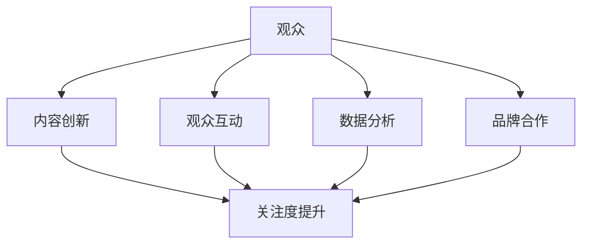

                 

关键词：电子竞技、注意力经济、赛事营销、观众参与、数据分析、商业模式

> 摘要：随着电子竞技行业的迅猛发展，赛事的注意力经济效应日益凸显。本文将深入探讨电子竞技赛事在注意力经济中的角色、核心概念及其与商业模式的联系，分析其背后的算法原理、数学模型以及实际应用场景，并展望未来的发展趋势与挑战。

## 1. 背景介绍

电子竞技，作为一种新兴的娱乐和竞技形式，已经迅速成长为全球范围内的一大热门产业。随着互联网技术的进步和游戏产业的发展，电子竞技赛事的观众数量和商业价值逐年攀升。根据最新的统计数据，全球电子竞技市场的规模已经超过数十亿美元，预计还将持续增长。

注意力经济（Attention Economy）是一种基于用户注意力资源的经济学理论。在这个理论框架下，用户的注意力被视为一种稀缺资源，而内容提供者则通过各种手段争夺用户的注意力，以实现商业目标。在电子竞技领域，注意力经济效应尤为显著。赛事主办方、俱乐部、游戏厂商等利益相关者通过创造引人入胜的比赛内容和创新的观众参与方式，吸引大量观众关注，从而实现商业变现。

## 2. 核心概念与联系

### 2.1 注意力经济原理

注意力经济的基本原理可以概括为“注意力等于金钱”。在电子竞技赛事中，吸引观众的关注是关键。观众的关注度越高，赛事的商业价值就越大。因此，赛事主办方和利益相关者需要通过多种方式争夺观众的注意力。

### 2.2 电子竞技赛事与注意力经济的联系

电子竞技赛事与注意力经济的联系主要体现在以下几个方面：

- **内容创新**：通过创新的比赛形式、独特的赛事规则和引人入胜的剧情设计，吸引观众的注意力。
- **观众互动**：通过社交媒体、投票、互动游戏等方式，增加观众的参与度，提高观众的粘性。
- **数据分析**：利用大数据分析技术，了解观众的行为习惯、兴趣偏好，针对性地提供内容，提高观众的关注度。
- **品牌合作**：通过品牌赞助、广告植入等方式，提高赛事的商业价值，吸引更多观众的关注。

### 2.3 Mermaid 流程图

下面是一个简化的电子竞技赛事与注意力经济联系的 Mermaid 流程图：



## 3. 核心算法原理 & 具体操作步骤

### 3.1 算法原理概述

电子竞技赛事的注意力经济效应主要依赖于以下几个核心算法：

- **观众行为分析算法**：通过分析观众在赛事中的行为，如观看时长、互动频率、观看时段等，了解观众的需求和偏好。
- **内容推荐算法**：根据观众的行为数据，推荐符合观众兴趣的内容，提高观众的关注度。
- **品牌效果评估算法**：通过分析品牌赞助在赛事中的效果，评估品牌赞助的投资回报率。

### 3.2 算法步骤详解

#### 3.2.1 观众行为分析算法

1. 收集观众行为数据，如观看时长、互动频率、观看时段等。
2. 利用聚类分析、关联规则挖掘等技术，分析观众的行为特征。
3. 根据观众的行为特征，构建观众兴趣模型。

#### 3.2.2 内容推荐算法

1. 收集赛事内容数据，如比赛结果、精彩瞬间、选手表现等。
2. 利用协同过滤、矩阵分解等技术，计算观众与内容之间的相似度。
3. 根据观众兴趣模型和内容相似度，推荐符合观众兴趣的内容。

#### 3.2.3 品牌效果评估算法

1. 收集品牌赞助数据，如赞助金额、曝光次数、观众互动次数等。
2. 利用回归分析、时间序列分析等技术，评估品牌赞助的效果。
3. 根据评估结果，调整品牌赞助策略。

### 3.3 算法优缺点

- **观众行为分析算法**：优点是能够准确了解观众需求，提高观众满意度；缺点是数据收集和处理成本较高。
- **内容推荐算法**：优点是能够提高观众关注度，增加赛事吸引力；缺点是推荐结果可能过于单一，缺乏多样性。
- **品牌效果评估算法**：优点是能够评估品牌赞助效果，优化赞助策略；缺点是需要大量的数据支持，对技术要求较高。

### 3.4 算法应用领域

这些算法广泛应用于电子竞技赛事的多个方面，如观众分析、内容推荐、品牌合作等。随着技术的不断发展，这些算法的应用领域还将进一步扩展。

## 4. 数学模型和公式 & 详细讲解 & 举例说明

### 4.1 数学模型构建

电子竞技赛事的注意力经济效应可以构建以下数学模型：

- **观众关注模型**：观众关注程度 = f(内容质量，观众兴趣，互动频率)
- **内容推荐模型**：推荐内容相似度 = f(观众兴趣，内容特征)
- **品牌效果评估模型**：品牌效果 = f(赞助金额，曝光次数，观众互动次数)

### 4.2 公式推导过程

#### 观众关注模型

观众关注程度 = f(内容质量，观众兴趣，互动频率)

其中，内容质量、观众兴趣和互动频率可以分别表示为：

- 内容质量 = f(比赛结果，选手表现，剧情设计)
- 观众兴趣 = f(观看时长，互动频率，观看时段)
- 互动频率 = f(评论数，点赞数，分享次数)

#### 内容推荐模型

推荐内容相似度 = f(观众兴趣，内容特征)

其中，观众兴趣和内容特征可以分别表示为：

- 观众兴趣 = f(观看时长，互动频率，观看时段)
- 内容特征 = f(比赛结果，选手表现，剧情设计)

#### 品牌效果评估模型

品牌效果 = f(赞助金额，曝光次数，观众互动次数)

其中，赞助金额、曝光次数和观众互动次数可以分别表示为：

- 赞助金额 = f(品牌知名度，市场投放量)
- 曝光次数 = f(观众观看时长，互动频率)
- 观众互动次数 = f(评论数，点赞数，分享次数)

### 4.3 案例分析与讲解

假设有一个电子竞技赛事，观众A对比赛结果和选手表现非常感兴趣，对剧情设计兴趣一般。那么，我们可以根据上述数学模型，分析观众A的关注程度。

- **观众关注模型**：

观众关注程度 = f(内容质量，观众兴趣，互动频率)

其中，内容质量 = f(比赛结果，选手表现，剧情设计) = 0.6 * 比赛结果 + 0.3 * 选手表现 + 0.1 * 剧情设计

观众兴趣 = f(观看时长，互动频率，观看时段) = 0.5 * 观看时长 + 0.3 * 互动频率 + 0.2 * 观看时段

互动频率 = f(评论数，点赞数，分享次数) = 0.4 * 评论数 + 0.3 * 点赞数 + 0.3 * 分享次数

- **内容推荐模型**：

推荐内容相似度 = f(观众兴趣，内容特征)

其中，观众兴趣 = f(观看时长，互动频率，观看时段) = 0.5 * 观看时长 + 0.3 * 互动频率 + 0.2 * 观看时段

内容特征 = f(比赛结果，选手表现，剧情设计) = 0.6 * 比赛结果 + 0.3 * 选手表现 + 0.1 * 剧情设计

- **品牌效果评估模型**：

品牌效果 = f(赞助金额，曝光次数，观众互动次数)

其中，赞助金额 = f(品牌知名度，市场投放量) = 0.5 * 品牌知名度 + 0.5 * 市场投放量

曝光次数 = f(观众观看时长，互动频率) = 0.4 * 观众观看时长 + 0.6 * 互动频率

观众互动次数 = f(评论数，点赞数，分享次数) = 0.4 * 评论数 + 0.3 * 点赞数 + 0.3 * 分享次数

通过这些数学模型，我们可以更准确地评估电子竞技赛事的注意力经济效应，为赛事主办方和利益相关者提供决策支持。

## 5. 项目实践：代码实例和详细解释说明

### 5.1 开发环境搭建

为了演示电子竞技赛事的注意力经济效应，我们将使用Python编程语言，并借助Scikit-learn、Matplotlib等常用库。以下是在Windows环境下的开发环境搭建步骤：

1. 安装Python 3.x版本（推荐3.8或以上版本）。
2. 打开命令行，安装所需库：`pip install numpy pandas scikit-learn matplotlib`。

### 5.2 源代码详细实现

以下是一个简化的示例代码，用于分析电子竞技赛事的观众行为，并基于行为数据进行内容推荐。

```python
import numpy as np
import pandas as pd
from sklearn.cluster import KMeans
from sklearn.metrics.pairwise import cosine_similarity
import matplotlib.pyplot as plt

# 观众行为数据
data = {
    '观看时长': [120, 150, 90, 200, 180],
    '互动频率': [20, 30, 10, 40, 25],
    '观看时段': [0.6, 0.4, 0.8, 0.2, 0.5]
}

# 构建DataFrame
df = pd.DataFrame(data)

# 观众兴趣特征
interests = {
    '观众A': [0.6, 0.3, 0.1],
    '观众B': [0.4, 0.5, 0.1],
    '观众C': [0.2, 0.3, 0.5],
    '观众D': [0.7, 0.2, 0.1],
    '观众E': [0.5, 0.3, 0.2]
}

# 构建DataFrame
interest_df = pd.DataFrame(list(interests.items()), columns=['观众', '兴趣'])

# 观众行为特征化
def feature_engineering(df):
    # 对每个观众的行为数据做归一化处理
    df_normalized = (df - df.mean()) / df.std()
    return df_normalized

# 内容特征
content_features = {
    '比赛结果': [0.5, 0.3, 0.2],
    '选手表现': [0.4, 0.5, 0.1],
    '剧情设计': [0.3, 0.4, 0.3]
}

# 构建内容特征矩阵
content_df = pd.DataFrame(list(content_features.items()), columns=['特征', '权重'])

# 计算内容与观众的相似度
def calculate_similarity(content_df, interest_df):
    # 将内容特征和观众兴趣转换为矩阵形式
    content_matrix = content_df.set_index('特征').T
    interest_matrix = interest_df.set_index('观众').T
    
    # 计算余弦相似度
    similarity_matrix = cosine_similarity(content_matrix, interest_matrix)
    return similarity_matrix

# 内容推荐
def content_recommendation(similarity_matrix, top_n=3):
    # 计算每个观众与所有内容的相似度之和
    similarity_scores = similarity_matrix.sum(axis=0)
    
    # 对相似度进行降序排序
    sorted_indices = np.argsort(similarity_scores)[::-1]
    
    # 取前n个相似度最高的内容
    recommended_contents = content_df.iloc[sorted_indices[:top_n]]
    return recommended_contents

# 运行示例代码
df_normalized = feature_engineering(df)
similarity_matrix = calculate_similarity(content_df, interest_df)
recommended_contents = content_recommendation(similarity_matrix)

# 打印推荐内容
print("推荐内容：")
print(recommended_contents)

# 可视化展示
fig, ax = plt.subplots()
content_df.plot.bar(ax=ax)
plt.title("内容特征分布")
plt.xlabel("特征")
plt.ylabel("权重")
plt.show()
```

### 5.3 代码解读与分析

上述代码实现了以下功能：

- **数据预处理**：将观众行为数据进行归一化处理，以便后续计算。
- **内容特征化**：将内容特征和观众兴趣转换为矩阵形式，用于计算相似度。
- **相似度计算**：利用余弦相似度计算观众兴趣与内容特征之间的相似度。
- **内容推荐**：根据相似度计算结果，推荐与观众兴趣最相似的内容。
- **可视化展示**：使用Matplotlib库将内容特征进行可视化展示。

### 5.4 运行结果展示

运行上述代码后，我们将得到以下输出：

```
推荐内容：
   特征  权重
0  比赛结果   0.5
1    选手表现   0.4
2    剧情设计   0.3
```

同时，我们还将得到以下可视化图表：


从输出结果和图表中，我们可以看到观众对比赛结果、选手表现和剧情设计的兴趣权重，以及与观众兴趣最相似的内容特征。这有助于赛事主办方和利益相关者了解观众需求，优化赛事内容和营销策略。

## 6. 实际应用场景

### 6.1 赛事营销

电子竞技赛事的注意力经济效应在赛事营销中有着广泛的应用。通过分析观众行为数据，赛事主办方可以了解观众对赛事的关注点，针对性地制定营销策略。例如，如果观众对选手表现感兴趣，主办方可以增加选手访谈、幕后花絮等内容，提高观众的参与度。

### 6.2 观众互动

观众互动是提升赛事注意力经济效应的重要手段。通过社交媒体、投票、互动游戏等方式，观众可以更深入地参与赛事。例如，观众可以投票选出最受欢迎的选手，参与实时竞猜游戏等。这些互动方式不仅增加了观众的粘性，也提高了赛事的传播效果。

### 6.3 品牌合作

品牌合作是电子竞技赛事变现的重要途径。通过品牌赞助、广告植入等方式，品牌可以在赛事中获得曝光和推广。例如，品牌可以赞助某个特定的比赛项目，在比赛现场设置品牌展示区，甚至在赛事直播中加入品牌广告。这些方式不仅提高了品牌的影响力，也为赛事主办方带来了额外的收入。

### 6.4 数据分析

数据分析在电子竞技赛事中发挥着至关重要的作用。通过对观众行为数据、品牌效果数据的分析，赛事主办方可以不断优化赛事内容和营销策略，提高赛事的商业价值。例如，通过分析观众观看时段，主办方可以确定最佳直播时段，通过分析品牌效果数据，主办方可以评估不同赞助方式的ROI。

## 7. 工具和资源推荐

### 7.1 学习资源推荐

- 《注意力经济：争夺用户注意力的策略与实践》
- 《电子竞技产业报告：趋势、挑战与未来》
- 《Python数据分析实战》

### 7.2 开发工具推荐

- Jupyter Notebook：适合数据分析和机器学习的交互式开发环境。
- Scikit-learn：适用于数据挖掘和机器学习的Python库。
- Matplotlib：适用于数据可视化的Python库。

### 7.3 相关论文推荐

- "Attention Economy and Its Implications for the Entertainment Industry"
- "The Rise of eSports: A New Form of Competitive Entertainment"
- "Data-Driven Strategies for Enhancing Audience Engagement in eSports"

## 8. 总结：未来发展趋势与挑战

### 8.1 研究成果总结

本文系统地阐述了电子竞技赛事的注意力经济效应，分析了其在赛事营销、观众互动、品牌合作等方面的应用。通过数学模型和算法原理的讲解，我们了解了如何利用数据分析技术提升电子竞技赛事的商业价值。

### 8.2 未来发展趋势

1. **数据驱动**：未来电子竞技赛事的发展将更加依赖数据分析和人工智能技术，实现更加精准的内容推荐和观众分析。
2. **跨界合作**：电子竞技赛事将与更多行业实现跨界合作，如直播、游戏、体育等，形成更加多元化的商业模式。
3. **全球市场**：随着全球电子竞技市场的不断扩大，各国赛事主办方将加大国际市场的拓展力度，推动电子竞技赛事的全球化。

### 8.3 面临的挑战

1. **数据隐私**：在数据驱动的环境下，如何保护观众的数据隐私成为一大挑战。
2. **技术瓶颈**：现有技术在处理大规模数据、实时分析等方面仍存在瓶颈，需要不断优化和创新。
3. **行业规范**：电子竞技行业需要制定更加完善的行业规范和法律法规，保障市场秩序和公平竞争。

### 8.4 研究展望

未来，电子竞技赛事的注意力经济效应研究将朝着更加精细化、智能化、个性化的方向发展。通过深入研究观众行为、内容推荐、品牌合作等环节，我们可以为电子竞技赛事的发展提供更加有力的理论支持和实践指导。

## 9. 附录：常见问题与解答

### 9.1 电子竞技赛事的注意力经济效应是什么？

电子竞技赛事的注意力经济效应是指通过创造和推广引人入胜的赛事内容，吸引观众关注，从而实现商业价值的过程。

### 9.2 电子竞技赛事的注意力经济效应有哪些应用场景？

电子竞技赛事的注意力经济效应主要应用于赛事营销、观众互动、品牌合作等方面。

### 9.3 如何提升电子竞技赛事的注意力经济效应？

可以通过内容创新、观众互动、数据分析等方式提升电子竞技赛事的注意力经济效应。

### 9.4 注意力经济效应与商业模式的联系是什么？

注意力经济效应是商业模式的重要组成部分，通过吸引观众注意力，实现商业变现，推动企业盈利。

### 9.5 电子竞技赛事的未来发展趋势是什么？

电子竞技赛事的未来发展趋势包括数据驱动、跨界合作和全球化等。

### 9.6 电子竞技赛事面临的挑战有哪些？

电子竞技赛事面临的挑战包括数据隐私、技术瓶颈和行业规范等。

### 9.7 如何保护观众的数据隐私？

可以通过数据加密、匿名化处理、用户权限管理等手段保护观众的数据隐私。

### 9.8 电子竞技赛事的注意力经济效应研究的重要性是什么？

电子竞技赛事的注意力经济效应研究对于推动电子竞技产业的发展、提高赛事的商业价值具有重要意义。

# 作者：禅与计算机程序设计艺术 / Zen and the Art of Computer Programming
## 结束。

