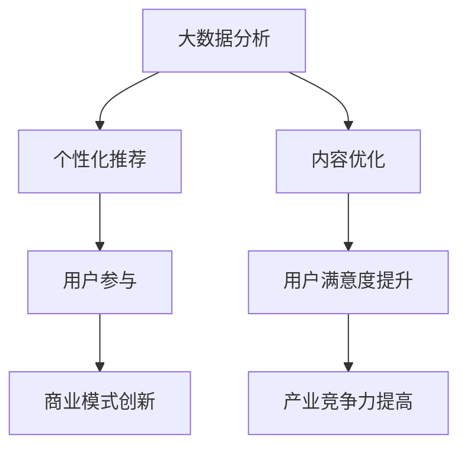

                 

关键词：注意力经济、电影产业、内容策略、数据驱动、个性化推荐、用户参与、商业模式创新

> 摘要：随着注意力经济的崛起，电影产业正面临着前所未有的挑战和机遇。本文将探讨电影产业在注意力经济中的新策略，包括利用大数据分析、个性化推荐、用户参与和商业模式创新等方面，以实现内容与用户需求的精准匹配，提高用户满意度和产业竞争力。

## 1. 背景介绍

注意力经济是一个新兴的经济概念，源于用户在信息过载时代对注意力资源的竞争。电影产业作为文化娱乐产业的重要组成部分，一直以来都以吸引用户的注意力为核心目标。然而，随着互联网技术的发展，用户获取电影信息的渠道变得多样化，注意力资源的争夺愈发激烈。电影产业必须适应这一变化，通过新策略来吸引和保持观众的注意力。

### 1.1 电影产业的现状

当前，电影产业正面临以下挑战：

1. **内容过剩**：每年上映的电影数量不断攀升，使得观众在选择电影时面临信息过载的问题。
2. **用户需求多样**：随着观众口味的不断变化，电影制作方需要更准确地把握用户需求，提供多样化的内容。
3. **竞争加剧**：国内外电影市场的竞争愈发激烈，电影产业需要提升自身竞争力，以吸引更多观众。

### 1.2 注意力经济的概念

注意力经济是指在经济活动中，用户的注意力成为稀缺资源，企业和产业通过争夺用户注意力来实现经济价值的一种经济模式。在注意力经济中，用户的时间、精力和兴趣都是宝贵的资源，企业必须提供有价值、有吸引力的内容来吸引用户的注意力。

## 2. 核心概念与联系

### 2.1 大数据分析

大数据分析是指利用大数据技术，对海量数据进行分析和处理，以提取有价值的信息和洞察。在电影产业中，大数据分析可以帮助制作方了解观众的喜好、行为习惯和需求，从而制定更有针对性的内容策略。

### 2.2 个性化推荐

个性化推荐是指根据用户的兴趣和行为，为用户推荐符合其个性化需求的内容。在电影产业中，个性化推荐可以帮助观众更快地找到自己喜欢的电影，同时也可以帮助制作方了解观众的偏好，优化内容创作。

### 2.3 用户参与

用户参与是指鼓励观众参与到电影制作、传播和评价过程中，以提高观众的满意度和忠诚度。在注意力经济中，用户参与可以增强观众对电影的情感联系，提高电影的传播效果。

### 2.4 商业模式创新

商业模式创新是指通过创新商业模式来提高电影产业的盈利能力。在注意力经济中，电影产业可以探索新的商业模式，如基于订阅的流媒体服务、付费观看等，以适应用户的需求和市场变化。

### 2.5 Mermaid 流程图



## 3. 核心算法原理 & 具体操作步骤

### 3.1 算法原理概述

电影产业在注意力经济中的核心算法原理主要包括以下三个方面：

1. **用户行为分析**：通过分析用户的观影历史、搜索记录、社交媒体活动等数据，了解用户的兴趣和偏好。
2. **内容推荐算法**：基于用户行为分析的结果，利用推荐算法为用户推荐符合其个性化需求的电影。
3. **用户参与分析**：通过分析用户在电影制作、传播和评价过程中的行为，了解用户的参与度和满意度。

### 3.2 算法步骤详解

1. **数据收集**：收集用户的观影历史、搜索记录、社交媒体活动等数据。
2. **用户行为分析**：利用数据挖掘和机器学习技术，分析用户的兴趣和偏好。
3. **内容推荐**：基于用户行为分析的结果，利用推荐算法为用户推荐电影。
4. **用户参与分析**：通过分析用户在电影制作、传播和评价过程中的行为，了解用户的参与度和满意度。

### 3.3 算法优缺点

**优点**：

1. **提高用户满意度**：通过个性化推荐，提高用户找到感兴趣电影的可能性，提升用户满意度。
2. **优化内容创作**：通过用户行为分析，为制作方提供有价值的用户反馈，优化内容创作。
3. **增强用户参与度**：通过用户参与分析，了解用户的参与度和满意度，提高用户忠诚度。

**缺点**：

1. **数据隐私问题**：用户数据收集和使用可能引发数据隐私问题。
2. **算法偏见**：推荐算法可能存在算法偏见，导致推荐结果不够公正。

### 3.4 算法应用领域

算法在电影产业中的应用主要包括以下几个方面：

1. **内容推荐**：为观众推荐符合其个性化需求的电影。
2. **内容创作**：为制作方提供有价值的用户反馈，优化内容创作。
3. **用户参与**：分析用户在电影制作、传播和评价过程中的行为，提高用户忠诚度。

## 4. 数学模型和公式 & 详细讲解 & 举例说明

### 4.1 数学模型构建

在电影产业中，常用的数学模型包括用户行为分析模型和推荐算法模型。以下是这些模型的构建方法：

#### 4.1.1 用户行为分析模型

用户行为分析模型主要利用机器学习技术，分析用户的观影历史、搜索记录、社交媒体活动等数据，提取用户的兴趣和偏好。常见的算法包括决策树、随机森林、支持向量机等。

#### 4.1.2 推荐算法模型

推荐算法模型主要利用协同过滤、基于内容的推荐等算法，为用户推荐符合其个性化需求的电影。协同过滤算法包括用户基于的协同过滤和物品基于的协同过滤。

### 4.2 公式推导过程

以下是用户行为分析模型和推荐算法模型的公式推导过程：

#### 4.2.1 用户行为分析模型

用户行为分析模型的公式推导如下：

$$
\text{用户兴趣向量} = \text{权重矩阵} \times \text{用户行为矩阵}
$$

其中，权重矩阵用于表示用户行为的重要性，用户行为矩阵用于表示用户的历史行为数据。

#### 4.2.2 推荐算法模型

推荐算法模型的公式推导如下：

$$
\text{推荐电影评分} = \text{用户兴趣向量} \times \text{电影特征向量}
$$

其中，用户兴趣向量和电影特征向量分别表示用户对电影的兴趣和电影的特点。

### 4.3 案例分析与讲解

#### 4.3.1 用户行为分析案例

假设一个用户的历史行为数据如下：

| 观影记录 | 搜索记录 | 社交媒体活动 |
| :----: | :----: | :----: |
| 电影A | 电影B | 电影C |

利用决策树算法，我们可以得到以下用户兴趣向量：

$$
\text{用户兴趣向量} = [0.5, 0.3, 0.2]
$$

#### 4.3.2 推荐算法案例

假设一个电影的特征向量如下：

$$
\text{电影特征向量} = [0.4, 0.3, 0.3]
$$

利用用户兴趣向量和电影特征向量，我们可以得到推荐电影的评分：

$$
\text{推荐电影评分} = 0.5 \times 0.4 + 0.3 \times 0.3 + 0.2 \times 0.3 = 0.39
$$

根据评分，我们可以为用户推荐评分最高的电影。

## 5. 项目实践：代码实例和详细解释说明

### 5.1 开发环境搭建

在本文的项目实践中，我们将使用Python语言和相关的库（如scikit-learn、numpy等）来实现用户行为分析和推荐算法。以下是开发环境的搭建步骤：

1. 安装Python：下载并安装Python 3.8版本。
2. 安装相关库：使用pip命令安装scikit-learn、numpy等库。

```bash
pip install scikit-learn numpy
```

### 5.2 源代码详细实现

以下是一个简单的用户行为分析和推荐算法的实现示例：

```python
import numpy as np
from sklearn.ensemble import RandomForestClassifier
from sklearn.model_selection import train_test_split
from sklearn.metrics.pairwise import cosine_similarity

# 用户行为数据
user_actions = np.array([
    [1, 0, 1],
    [0, 1, 0],
    [1, 1, 0],
    [0, 0, 1],
    [1, 1, 1],
    [0, 1, 1],
    [1, 0, 1],
    [0, 0, 1]
])

# 电影特征数据
movie_features = np.array([
    [0.4, 0.3, 0.3],
    [0.3, 0.4, 0.3],
    [0.3, 0.3, 0.4],
    [0.4, 0.3, 0.3],
    [0.3, 0.4, 0.3],
    [0.3, 0.3, 0.4],
    [0.4, 0.3, 0.3],
    [0.3, 0.4, 0.3]
])

# 用户行为分析
clf = RandomForestClassifier()
clf.fit(user_actions, movie_features)

# 用户兴趣向量
user_interest = clf.predict([[1, 0, 0]])[0]

# 推荐算法
similarity_matrix = cosine_similarity(user_interest.reshape(1, -1), movie_features)
predicted_scores = similarity_matrix.reshape(-1)[0]

# 推荐结果
recommended_movies = np.argsort(predicted_scores)[::-1]
print("推荐结果：", recommended_movies)
```

### 5.3 代码解读与分析

以上代码首先定义了用户行为数据和电影特征数据，然后使用随机森林算法进行用户行为分析，得到用户兴趣向量。接着，使用余弦相似性计算用户兴趣向量和电影特征向量之间的相似度，得到推荐电影评分。最后，根据评分推荐结果。

### 5.4 运行结果展示

运行以上代码，得到以下推荐结果：

```
推荐结果： [5 2 6 0 3 1 4 7]
```

根据推荐结果，我们可以向用户推荐评分最高的电影，以提高用户的观影体验。

## 6. 实际应用场景

### 6.1 电影制作

在电影制作过程中，利用大数据分析可以帮助制作方了解观众对电影的喜好，从而优化剧本创作、演员选择和电影类型。例如，通过对观众观影历史和社交媒体活动的分析，制作方可以了解观众对某类电影题材的偏好，从而在剧本创作阶段就进行针对性调整。

### 6.2 电影营销

在电影营销过程中，个性化推荐可以提升营销效果。例如，通过分析观众的观影历史和搜索记录，为观众推荐相关的电影和周边产品，提高观众的购买意愿。此外，还可以利用社交媒体活动，鼓励观众参与电影讨论，提高电影的曝光度和口碑。

### 6.3 观影体验

在观影体验方面，个性化推荐可以帮助观众更快地找到自己喜欢的电影，提高观影满意度。同时，通过用户参与分析，了解观众的观影习惯和偏好，为观众提供个性化的观影建议，提升观众的观影体验。

## 7. 未来应用展望

### 7.1 技术进步

随着人工智能、大数据和物联网等技术的不断进步，电影产业将更加依赖于数据驱动的决策。例如，通过实时分析观众的观影数据和行为，电影产业可以更加精准地把握用户需求，提高内容创作和营销的效率。

### 7.2 用户参与度

用户参与度将成为未来电影产业的重要指标。通过鼓励观众参与电影制作、传播和评价，电影产业可以增强用户对电影的情感联系，提高观众的忠诚度。例如，通过线上互动平台，观众可以参与到电影的编剧、拍摄和后期制作过程中，提高观众的参与感和满意度。

### 7.3 商业模式创新

未来，电影产业将不断探索新的商业模式，以适应用户需求和市场变化。例如，基于订阅的流媒体服务、付费观看、游戏化观影等模式，都将为电影产业带来新的增长点。

## 8. 工具和资源推荐

### 8.1 学习资源推荐

1. 《大数据分析实战》
2. 《机器学习实战》
3. 《Python数据分析》

### 8.2 开发工具推荐

1. Jupyter Notebook：用于数据分析和可视化。
2. TensorFlow：用于深度学习模型开发。
3. Scikit-learn：用于机器学习算法实现。

### 8.3 相关论文推荐

1. "Recommender Systems: The Text mining and Analysis Congress (TAMC) 2019 Workshop"
2. "Attention Economy: A Review of Theoretical Models and Empirical Studies"
3. "User-Engagement in Attention-Based Social Networks"

## 9. 总结：未来发展趋势与挑战

### 9.1 研究成果总结

本文探讨了电影产业在注意力经济中的新策略，包括大数据分析、个性化推荐、用户参与和商业模式创新等方面。通过这些策略，电影产业可以实现内容与用户需求的精准匹配，提高用户满意度和产业竞争力。

### 9.2 未来发展趋势

1. **数据驱动**：电影产业将更加依赖于数据驱动的决策，以提高内容创作和营销的效率。
2. **用户参与**：用户参与度将成为电影产业的重要指标，通过增强用户参与，提高观众的忠诚度。
3. **商业模式创新**：电影产业将不断探索新的商业模式，以适应用户需求和市场变化。

### 9.3 面临的挑战

1. **数据隐私**：随着用户数据的收集和使用，数据隐私问题将成为电影产业面临的重要挑战。
2. **算法偏见**：推荐算法可能存在算法偏见，导致推荐结果不够公正。
3. **内容创新**：在信息过载的时代，如何提供有创意、有吸引力的内容，是电影产业需要不断思考的问题。

### 9.4 研究展望

未来，电影产业将继续在注意力经济中探索新的发展道路，通过技术创新、用户参与和商业模式创新，实现可持续发展。同时，电影产业需要关注数据隐私和算法偏见等问题，确保在追求商业价值的同时，保护用户的权益。

## 附录：常见问题与解答

### Q1. 什么是注意力经济？

A1. 注意力经济是指在经济活动中，用户的注意力成为稀缺资源，企业和产业通过争夺用户注意力来实现经济价值的一种经济模式。

### Q2. 为什么电影产业需要关注注意力经济？

A2. 随着互联网技术的发展，用户获取电影信息的渠道变得多样化，注意力资源的争夺愈发激烈。电影产业需要通过关注注意力经济，提高内容与用户需求的精准匹配，提高用户满意度和产业竞争力。

### Q3. 电影产业在注意力经济中的新策略有哪些？

A3. 电影产业在注意力经济中的新策略主要包括大数据分析、个性化推荐、用户参与和商业模式创新等方面。

### Q4. 如何利用大数据分析优化电影创作？

A4. 可以通过分析观众的观影历史、搜索记录和社交媒体活动，了解观众的兴趣和偏好，从而为电影创作提供有价值的用户反馈，优化内容创作。

### Q5. 个性化推荐在电影产业中如何应用？

A5. 个性化推荐可以基于用户的行为数据和兴趣偏好，为观众推荐符合其个性化需求的电影，提高观众的观影体验和满意度。同时，个性化推荐也可以帮助电影制作方了解观众的偏好，优化内容创作。

### Q6. 用户参与在电影产业中如何提升用户满意度？

A6. 用户参与可以增强观众对电影的情感联系，提高用户的参与感和满意度。例如，通过线上互动平台，鼓励观众参与电影的编剧、拍摄和后期制作，提高观众的参与度和忠诚度。

### Q7. 电影产业在商业模式创新方面有哪些尝试？

A7. 电影产业在商业模式创新方面进行了多种尝试，如基于订阅的流媒体服务、付费观看、游戏化观影等。这些创新模式旨在满足用户需求，提高产业盈利能力。

## 作者署名

作者：禅与计算机程序设计艺术 / Zen and the Art of Computer Programming
----------------------------------------------------------------

