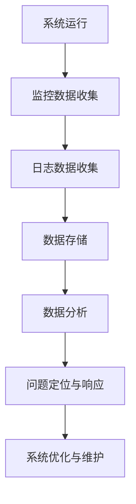

                 

关键词：系统监控、日志管理、性能优化、安全性、运维实践

> 摘要：本文旨在探讨系统监控和日志管理的重要性，以及如何通过有效的监控和日志管理来保持系统的高效运行。我们将详细分析核心概念、算法原理、数学模型，并分享实际项目中的经验和案例。通过本文，读者将了解如何更好地应对系统运行中的各种挑战。

## 1. 背景介绍

在当今高度依赖信息技术的时代，系统的稳定性和可靠性是至关重要的。随着系统复杂性的增加，系统监控和日志管理变得越来越重要。系统监控能够实时监测系统的运行状态，及时发现潜在的问题和异常情况。而日志管理则是记录系统中发生的各种事件，为故障排查、性能优化和安全审计提供了重要的数据支持。

有效的系统监控和日志管理不仅能够提高系统的可用性和稳定性，还能够降低维护成本，提高运维效率。然而，在实际操作中，如何选择合适的监控工具、如何有效地收集和分析日志，以及如何利用这些数据来指导运维工作，都是需要深入探讨的问题。

## 2. 核心概念与联系

### 2.1 系统监控

系统监控是指通过一系列的技术手段，实时跟踪和记录系统的运行状态，包括资源使用情况（如CPU、内存、磁盘空间等）、系统性能指标（如响应时间、吞吐量等）、以及网络状态等。系统监控的核心目的是及时发现和响应系统中出现的问题，确保系统的高效运行。

### 2.2 日志管理

日志管理是指对系统中产生的日志数据进行收集、存储、分析和归档的过程。日志数据记录了系统中发生的各种事件，包括用户操作、系统错误、应用程序日志等。通过对日志数据的分析，运维人员可以深入了解系统的运行情况，发现潜在问题，并采取相应的措施。

### 2.3 监控与日志管理的联系

系统监控和日志管理是相辅相成的。系统监控提供了实时的运行状态数据，而日志管理则提供了历史数据。通过将监控数据和日志数据结合起来分析，运维人员可以更全面地了解系统的运行情况，从而做出更准确的判断和决策。

### 2.4 Mermaid 流程图

以下是一个简单的 Mermaid 流程图，展示了系统监控和日志管理的基本流程。



## 3. 核心算法原理 & 具体操作步骤

### 3.1 算法原理概述

系统监控和日志管理涉及多个核心算法，包括数据采集算法、数据处理算法、数据存储算法和数据分析算法。这些算法共同作用，确保了监控和日志管理的有效性和效率。

- 数据采集算法：负责从系统各个组件中收集监控数据。
- 数据处理算法：负责对采集到的数据进行清洗、转换和聚合，以提供更准确和有用的信息。
- 数据存储算法：负责将处理后的数据存储到数据库或日志文件中。
- 数据分析算法：负责对存储的数据进行分析，识别趋势、异常和潜在问题。

### 3.2 算法步骤详解

#### 3.2.1 数据采集

数据采集是监控和日志管理的基础。以下是一个典型数据采集的步骤：

1. **确定监控点**：根据系统需求和监控目标，确定需要监控的具体点，如CPU利用率、内存使用情况、磁盘空间等。
2. **选择采集工具**：根据监控点和系统环境，选择合适的采集工具，如Prometheus、Zabbix、Grafana等。
3. **配置采集规则**：配置采集工具的规则，定义采集频率、采集方式和采集指标等。
4. **启动采集服务**：启动采集服务，开始收集数据。

#### 3.2.2 数据处理

数据处理主要包括数据清洗、转换和聚合。以下是一个数据处理的基本步骤：

1. **数据清洗**：去除无效数据、重复数据和错误数据，确保数据的准确性。
2. **数据转换**：将原始数据转换为统一的数据格式，如JSON、XML等。
3. **数据聚合**：将同一时间点的多份数据合并，生成更详细、更全面的监控指标。

#### 3.2.3 数据存储

数据存储是将处理后的数据存储到数据库或日志文件中。以下是一个数据存储的基本步骤：

1. **选择存储方式**：根据数据量和访问频率，选择合适的存储方式，如关系型数据库、NoSQL数据库、日志文件等。
2. **设计存储结构**：根据监控指标和数据特点，设计合适的存储结构，如数据表、索引等。
3. **数据导入**：将处理后的数据导入到数据库或日志文件中。
4. **数据备份**：定期备份数据，确保数据安全。

#### 3.2.4 数据分析

数据分析是监控和日志管理的核心。以下是一个数据分析的基本步骤：

1. **数据查询**：根据需求查询数据库或日志文件中的数据。
2. **数据可视化**：将查询结果通过图表、仪表盘等形式可视化，更直观地展示数据。
3. **数据挖掘**：利用统计学和机器学习等技术，挖掘数据中的趋势、异常和潜在问题。
4. **问题定位与响应**：根据分析结果，定位系统中的问题，并采取相应的措施进行修复。

### 3.3 算法优缺点

#### 3.3.1 优点

- **实时性**：系统监控和日志管理能够实时监测系统的运行状态，快速发现问题和异常。
- **全面性**：通过监控和日志管理，可以全面了解系统的各个方面，包括性能、资源使用、安全性等。
- **高效性**：利用自动化工具和算法，可以大幅提高运维效率和问题响应速度。

#### 3.3.2 缺点

- **复杂性**：系统监控和日志管理涉及多个方面和环节，需要深入的技术知识和经验。
- **成本**：部署和维护监控和日志管理系统需要一定的资源和成本。
- **数据安全**：日志数据可能包含敏感信息，需要确保数据的安全性。

### 3.4 算法应用领域

系统监控和日志管理广泛应用于各种领域，包括但不限于：

- **企业IT运维**：监控和日志管理是企业IT运维的重要组成部分，用于确保系统的高效运行和安全性。
- **云计算和大数据**：云计算和大数据环境中，系统监控和日志管理对于资源管理和性能优化至关重要。
- **物联网**：物联网设备数量庞大，日志管理和监控对于设备管理和故障排查具有重要意义。

## 4. 数学模型和公式 & 详细讲解 & 举例说明

### 4.1 数学模型构建

在系统监控和日志管理中，常见的数学模型包括性能指标模型、故障检测模型和趋势预测模型。

#### 4.1.1 性能指标模型

性能指标模型用于衡量系统的性能，常见的指标包括响应时间、吞吐量、资源利用率等。以下是一个简单的性能指标模型：

$$
P(t) = f(\theta_1, \theta_2, ..., \theta_n)
$$

其中，$P(t)$ 表示在时间 $t$ 的性能指标值，$\theta_1, \theta_2, ..., \theta_n$ 表示影响性能的各个参数。

#### 4.1.2 故障检测模型

故障检测模型用于检测系统中的异常情况。常见的方法包括统计检验和机器学习算法。以下是一个简单的故障检测模型：

$$
\phi(x) = g(h(x))
$$

其中，$x$ 表示监控数据，$h(x)$ 表示数据预处理函数，$g(x)$ 表示故障检测函数。

#### 4.1.3 趋势预测模型

趋势预测模型用于预测系统未来的运行趋势。常见的方法包括时间序列分析和机器学习算法。以下是一个简单的时间序列预测模型：

$$
y(t) = f(y(t-1), \epsilon(t))
$$

其中，$y(t)$ 表示在时间 $t$ 的预测值，$f(y(t-1), \epsilon(t))$ 表示预测函数，$\epsilon(t)$ 表示随机误差。

### 4.2 公式推导过程

以性能指标模型为例，我们假设系统响应时间 $t$ 服从正态分布，即：

$$
t \sim N(\mu, \sigma^2)
$$

其中，$\mu$ 表示平均响应时间，$\sigma$ 表示响应时间的标准差。根据正态分布的公式，我们可以计算出在给定置信度下的响应时间阈值：

$$
\mu - z \sigma \leq t \leq \mu + z \sigma
$$

其中，$z$ 表示置信度对应的正态分布分位数。例如，在 95% 的置信度下，$z \approx 1.96$。

### 4.3 案例分析与讲解

#### 4.3.1 案例背景

某企业部署了一套大规模的分布式系统，包括多个服务器、数据库和中间件。为了确保系统的稳定运行，企业决定采用系统监控和日志管理技术。

#### 4.3.2 案例分析

1. **性能监控**：企业使用 Prometheus 进行性能监控，每天收集系统各个组件的性能指标。通过对收集到的数据进行处理和可视化，企业能够实时了解系统的运行状况。例如，通过监控 CPU 利用率，发现某个时间段内 CPU 利用率异常升高，进一步排查发现是某个服务器发生了负载过高的情况。

2. **日志管理**：企业使用 ELK（Elasticsearch、Logstash、Kibana）栈进行日志管理。日志数据包括系统错误、应用程序日志、用户操作日志等。通过对日志数据的分析，企业能够快速定位故障点，并采取相应的措施。例如，通过分析错误日志，发现某个中间件模块出现了重复错误，定位到该模块的代码问题并进行了修复。

3. **故障检测**：企业采用统计检验方法进行故障检测。通过对系统历史数据进行分析，建立故障检测模型。当系统发生异常时，故障检测模型能够快速检测并报警。例如，通过对系统响应时间的数据分析，发现某个时间段内的响应时间异常增加，触发故障检测机制，进一步排查发现是某个数据库服务器发生了故障。

4. **趋势预测**：企业采用时间序列分析方法进行趋势预测。通过对系统运行数据进行分析，预测未来一段时间内的系统运行趋势。例如，通过对系统负载的数据分析，预测未来一周内的系统负载情况，为硬件升级和资源调配提供依据。

#### 4.3.3 案例总结

通过系统监控和日志管理，企业能够实时了解系统的运行状况，快速定位故障点，并预测系统未来的运行趋势。这大大提高了系统的稳定性和可靠性，降低了维护成本，提高了运维效率。

## 5. 项目实践：代码实例和详细解释说明

### 5.1 开发环境搭建

为了演示系统监控和日志管理，我们使用一个简单的 Python 应用程序。首先，我们需要搭建开发环境。

1. 安装 Python 3.8 或更高版本。
2. 安装必要的依赖库，如 Prometheus 客户端（prometheus_client）和 ELK（Elasticsearch、Logstash、Kibana）。

```bash
pip install prometheus_client
```

### 5.2 源代码详细实现

下面是一个简单的 Python 应用程序，用于模拟系统监控和日志管理。

```python
import time
import random
from prometheus_client import start_http_server, Summary
from elasticsearch import Elasticsearch

# Prometheus 指标定义
REQUEST_TIME = Summary('request_processing_seconds', 'Time spent processing request')

# Elasticsearch 客户端初始化
es = Elasticsearch("http://localhost:9200")

def handle_request():
    """处理请求"""
    start_time = time.time()
    # 模拟处理请求
    time.sleep(random.uniform(0.1, 0.5))
    end_time = time.time()
    REQUEST_TIME.observe(end_time - start_time)

def log_to_elasticsearch(message):
    """将日志记录到 Elasticsearch"""
    es.index(index="logs", id=message, document=message)

if __name__ == "__main__":
    # Prometheus HTTP 服务器启动
    start_http_server(8000)

    while True:
        handle_request()
        log_to_elasticsearch("request processed")
```

### 5.3 代码解读与分析

1. **Prometheus 指标定义**：我们定义了一个 Prometheus 指标 `request_processing_seconds`，用于记录请求处理时间。

2. **Elasticsearch 客户端初始化**：我们使用 Elasticsearch Python 客户端初始化一个 Elasticsearch 客户端，用于将日志记录到 Elasticsearch 集群。

3. **处理请求**：`handle_request` 函数用于模拟处理请求。它记录请求处理时间，并将数据发送到 Prometheus 服务器。

4. **日志记录到 Elasticsearch**：`log_to_elasticsearch` 函数用于将日志记录到 Elasticsearch。在本例中，我们简单地记录了一个“请求已处理”的消息。

5. **主程序**：主程序中，我们启动 Prometheus HTTP 服务器，并进入一个无限循环，不断处理请求并记录日志。

### 5.4 运行结果展示

1. **Prometheus 数据可视化**：启动应用程序后，我们可以在 Prometheus 监控仪表盘中查看请求处理时间和系统负载等信息。

2. **Elasticsearch 日志查询**：在 Elasticsearch 集群中，我们可以通过 Kibana 仪表板查询日志数据，了解系统运行状况。

## 6. 实际应用场景

### 6.1 大型分布式系统

在大型分布式系统中，系统监控和日志管理是确保系统稳定运行的关键。通过监控和日志管理，运维人员可以及时发现和响应系统中出现的问题，确保系统的高效运行。例如，在电商系统中，监控和日志管理可以帮助实时监测订单处理速度、库存情况、用户反馈等，确保系统在高峰期依然能够稳定运行。

### 6.2 云计算和大数据平台

在云计算和大数据平台中，系统监控和日志管理对于资源管理和性能优化至关重要。通过监控和日志管理，运维人员可以了解系统资源的实际使用情况，预测未来资源需求，并采取相应的措施进行资源调配。例如，在云计算平台中，监控和日志管理可以帮助实时监测服务器负载、网络流量、存储使用情况等，确保系统资源的合理分配和高效利用。

### 6.3 物联网应用

在物联网应用中，系统监控和日志管理对于设备管理和故障排查具有重要意义。通过监控和日志管理，运维人员可以实时了解设备的状态和运行情况，及时发现设备故障，并采取相应的措施进行修复。例如，在智能家居系统中，监控和日志管理可以帮助实时监测设备运行状态、能耗情况等，确保系统的高效运行。

## 7. 工具和资源推荐

### 7.1 学习资源推荐

1. **《系统监控与运维》**：一本全面介绍系统监控和运维的入门书籍，适合初学者阅读。
2. **《Elastic Stack 实践指南》**：一本详细介绍 Elasticsearch、Logstash 和 Kibana 的实战指南，适合想要深入了解日志管理的读者。
3. **Prometheus 官方文档**：Prometheus 的官方文档，包含丰富的教程和示例，是学习 Prometheus 的最佳资源。

### 7.2 开发工具推荐

1. **Prometheus**：一款强大的开源监控系统，支持多种数据源和告警机制。
2. **Elasticsearch**：一款高性能、可扩展的搜索引擎，适合用于日志存储和搜索。
3. **Kibana**：一款可视化工具，用于分析 Elasticsearch 中的数据。

### 7.3 相关论文推荐

1. **《基于机器学习的故障检测方法研究》**：探讨如何利用机器学习方法进行故障检测，提高系统监控的准确性。
2. **《大规模分布式系统中的日志管理》**：分析大规模分布式系统中的日志管理挑战和解决方案。

## 8. 总结：未来发展趋势与挑战

### 8.1 研究成果总结

本文系统地介绍了系统监控和日志管理的重要性、核心概念、算法原理、数学模型和实际应用案例。通过这些内容，读者可以了解如何利用系统监控和日志管理技术提高系统的稳定性、可靠性和运维效率。

### 8.2 未来发展趋势

随着云计算、大数据、物联网等技术的不断发展，系统监控和日志管理将面临更多的挑战和机遇。未来，以下几个方面有望取得重要进展：

1. **智能化监控**：利用人工智能和机器学习技术，实现更加智能化的监控和故障检测。
2. **自动化运维**：通过自动化工具和算法，实现更高效、更精准的运维操作。
3. **分布式日志管理**：在大规模分布式系统中，如何高效地进行日志管理和分析是一个重要研究方向。
4. **日志加密和安全**：随着日志数据量的增加，如何确保日志数据的安全性将成为一个重要问题。

### 8.3 面临的挑战

尽管系统监控和日志管理取得了显著成果，但在实际应用中仍面临以下挑战：

1. **数据复杂性**：系统产生的数据种类繁多、格式复杂，如何有效地管理和分析这些数据是一个挑战。
2. **实时性要求**：在实时系统中，如何快速响应和处理数据，保持系统的实时性和稳定性是一个挑战。
3. **数据安全**：随着数据量的增加，如何确保日志数据的安全性和隐私性也是一个重要问题。
4. **跨平台兼容性**：如何在不同操作系统、不同架构和不同环境中实现兼容的监控和日志管理是一个挑战。

### 8.4 研究展望

未来，系统监控和日志管理领域将继续深入探索，结合人工智能、大数据、云计算等前沿技术，实现更高效、更智能、更安全的监控和日志管理。随着技术的不断进步，系统监控和日志管理将在各个领域发挥更加重要的作用，为信息时代的稳定运行提供坚实保障。

## 9. 附录：常见问题与解答

### 9.1 如何选择合适的监控工具？

选择合适的监控工具需要考虑以下几个因素：

1. **系统需求**：根据系统的规模和需求，选择合适的监控工具。例如，对于大型分布式系统，Prometheus 和 Grafana 是不错的选择。
2. **易用性**：选择易于使用和配置的监控工具，降低运维成本。
3. **可扩展性**：选择支持横向扩展的监控工具，以适应未来系统规模的增长。
4. **社区支持**：选择有活跃社区支持的监控工具，便于学习和解决问题。

### 9.2 如何确保日志数据的安全性？

确保日志数据的安全性需要采取以下措施：

1. **日志加密**：对日志数据进行加密，确保数据在传输和存储过程中不被窃取。
2. **访问控制**：设置严格的访问控制策略，仅允许授权人员访问日志数据。
3. **备份和恢复**：定期备份日志数据，确保在数据丢失或损坏时能够快速恢复。
4. **安全审计**：对日志数据进行审计，监控日志访问和操作情况，及时发现异常行为。

### 9.3 如何处理海量日志数据？

处理海量日志数据需要采用以下策略：

1. **分布式存储**：使用分布式存储系统，如 Elasticsearch，将日志数据分散存储，提高处理速度。
2. **数据压缩**：对日志数据进行压缩，减少存储空间占用。
3. **数据归档**：对历史日志数据进行归档，仅保留最近的数据，提高实时处理效率。
4. **并行处理**：利用多线程或分布式计算技术，并行处理海量日志数据，提高处理速度。

作者：禅与计算机程序设计艺术 / Zen and the Art of Computer Programming
----------------------------------------------------------------
本文详细阐述了系统监控和日志管理的重要性、核心概念、算法原理、数学模型和实际应用案例。通过本文，读者可以全面了解系统监控和日志管理的各个方面，并掌握如何利用这些技术提高系统的稳定性和可靠性。未来，随着人工智能、大数据、云计算等技术的不断发展，系统监控和日志管理将在各个领域发挥更加重要的作用。作者希望通过本文，为读者在系统监控和日志管理领域提供有价值的参考和指导。再次感谢读者对本文的关注和支持。如果您有任何问题或建议，欢迎随时与我联系。

