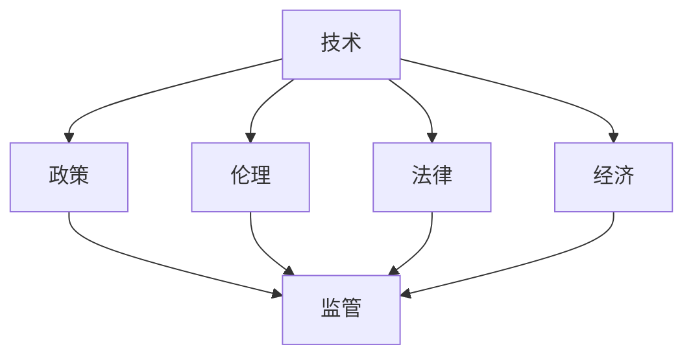

                 

关键词：人工智能、监管、创新、责任、可持续发展

> 摘要：随着人工智能技术的快速发展，如何在确保技术进步的同时，防止技术滥用和风险，成为了全球关注的焦点。本文从监管与创新的视角出发，探讨如何在推动人工智能负责任发展的过程中，平衡创新与安全，实现可持续的技术进步。

## 1. 背景介绍

### 1.1 人工智能的快速发展

近年来，人工智能（AI）技术在全球范围内取得了显著的进展。从深度学习、自然语言处理到计算机视觉，AI技术在各行各业都展现出了巨大的潜力。从医疗诊断到自动驾驶，从智能家居到金融分析，AI技术已经深刻改变了我们的生活方式和工作方式。

### 1.2 监管的重要性

随着AI技术的广泛应用，其潜在的风险和挑战也逐渐显现。数据隐私、算法偏见、安全漏洞等问题引发了广泛关注。因此，有效的监管机制成为确保AI技术负责任发展的重要保障。

### 1.3 创新的必要性

在监管的同时，我们不能忽视创新的必要性。创新是推动技术进步的关键动力，也是应对挑战的重要手段。如何在确保安全的前提下，激发创新活力，是实现可持续发展的关键。

## 2. 核心概念与联系

在讨论监管与创新的平衡时，我们需要理解几个核心概念：技术、政策、伦理、法律和经济。

### 2.1 技术

技术是推动AI发展的核心驱动力。技术进步不仅带来了新的应用场景，也为监管提供了技术手段。

### 2.2 政策

政策是引导技术发展方向的重要工具。政策的制定需要综合考虑技术、社会、经济等多方面因素，以实现长远的发展目标。

### 2.3 伦理

伦理是评价技术是否负责任的重要标准。伦理指导原则可以帮助我们在技术发展中坚守道德底线，避免技术滥用。

### 2.4 法律

法律是监管的基石。明确的法律框架可以为AI技术的发展提供稳定的环境，同时保护公众的权益。

### 2.5 经济

经济是技术创新的最终动力。经济利益可以激发创新活力，但同时也需要合理分配，确保技术进步惠及全社会。

### 2.6 Mermaid 流程图



## 3. 核心算法原理 & 具体操作步骤

### 3.1 算法原理概述

在AI监管与创新的讨论中，我们可以借助一些核心算法原理来理解其工作原理。例如，深度学习、强化学习等算法在AI技术的发展中起着关键作用。

### 3.2 算法步骤详解

#### 3.2.1 深度学习

1. 数据预处理：对输入数据进行标准化处理，使其适合深度学习模型。
2. 构建神经网络：设计并构建神经网络结构，包括输入层、隐藏层和输出层。
3. 训练模型：使用训练数据对神经网络模型进行训练，通过反向传播算法优化模型参数。
4. 评估模型：使用测试数据评估模型的性能，调整模型参数以提高准确性。

#### 3.2.2 强化学习

1. 环境构建：定义环境状态和动作空间。
2. 策略学习：通过与环境交互，学习最优策略。
3. 模型优化：使用优化算法调整策略，以实现目标最大化。

### 3.3 算法优缺点

- 深度学习：优点包括强大的数据建模能力和高度自动化的特征提取；缺点则包括对大量数据的需求和计算资源的消耗。
- 强化学习：优点在于能够解决复杂决策问题；缺点则是训练过程可能需要较长的时间和较大的计算资源。

### 3.4 算法应用领域

深度学习和强化学习在众多领域都有广泛应用，如自动驾驶、医疗诊断、金融分析等。

## 4. 数学模型和公式 & 详细讲解 & 举例说明

### 4.1 数学模型构建

在AI技术中，数学模型是核心组成部分。例如，神经网络中的激活函数、损失函数等都是重要的数学模型。

### 4.2 公式推导过程

以神经网络中的损失函数为例，其公式推导过程如下：

$$
L = \frac{1}{2} \sum_{i=1}^{n} (y_i - \hat{y}_i)^2
$$

其中，$L$ 表示损失函数，$y_i$ 表示实际输出，$\hat{y}_i$ 表示预测输出。

### 4.3 案例分析与讲解

以自动驾驶为例，我们可以通过构建数学模型来分析其安全性能。例如，通过计算车辆行驶过程中的速度、加速度等参数，评估自动驾驶系统的安全性。

## 5. 项目实践：代码实例和详细解释说明

### 5.1 开发环境搭建

在实践项目中，我们需要搭建一个合适的开发环境。例如，选择合适的编程语言和框架，配置必要的库和工具。

### 5.2 源代码详细实现

以下是一个简单的深度学习模型的实现示例：

```python
import tensorflow as tf

# 构建模型
model = tf.keras.Sequential([
    tf.keras.layers.Dense(128, activation='relu', input_shape=(784,)),
    tf.keras.layers.Dense(10, activation='softmax')
])

# 编译模型
model.compile(optimizer='adam',
              loss='categorical_crossentropy',
              metrics=['accuracy'])

# 训练模型
model.fit(x_train, y_train, epochs=5)
```

### 5.3 代码解读与分析

这段代码首先导入了 TensorFlow 库，然后构建了一个简单的神经网络模型。模型包含一个输入层、一个隐藏层和一个输出层。接着，编译模型并使用训练数据对其进行训练。

### 5.4 运行结果展示

通过训练，我们可以观察到模型的准确率逐渐提高。最终，我们可以评估模型在测试数据集上的性能。

## 6. 实际应用场景

### 6.1 自动驾驶

自动驾驶是 AI 技术的一个重要应用领域。通过构建深度学习模型，可以实现对车辆环境的实时感知和智能决策。

### 6.2 医疗诊断

AI 技术在医疗诊断中具有巨大潜力。通过分析医学影像和患者数据，可以辅助医生进行准确诊断。

### 6.3 金融分析

AI 技术在金融分析中也有广泛应用。通过构建机器学习模型，可以对市场趋势进行分析，帮助投资者做出更明智的决策。

## 6.4 未来应用展望

随着 AI 技术的不断发展，未来将有更多的应用场景。例如，智能城市、智能家居、智慧医疗等都将受益于 AI 技术的创新。

## 7. 工具和资源推荐

### 7.1 学习资源推荐

- 《深度学习》（Ian Goodfellow、Yoshua Bengio、Aaron Courville 著）
- 《强化学习》（Richard S. Sutton、Andrew G. Barto 著）

### 7.2 开发工具推荐

- TensorFlow
- PyTorch

### 7.3 相关论文推荐

- "Deep Learning for Autonomous Driving"
- "Reinforcement Learning: An Introduction"

## 8. 总结：未来发展趋势与挑战

### 8.1 研究成果总结

近年来，AI 技术在各个领域取得了显著的进展。然而，如何在确保技术进步的同时，防止技术滥用和风险，仍然是一个亟待解决的问题。

### 8.2 未来发展趋势

随着技术的不断进步，AI 技术将在更多领域得到应用。同时，监管机制也将逐步完善，以应对不断涌现的新挑战。

### 8.3 面临的挑战

AI 技术的发展面临着数据隐私、算法偏见、安全漏洞等多方面的挑战。因此，需要在技术创新的同时，注重监管和伦理问题。

### 8.4 研究展望

未来，我们将看到更多跨学科的研究合作，以推动 AI 技术的可持续发展。同时，监管机制也将不断完善，以保障技术进步与安全。

## 9. 附录：常见问题与解答

### 9.1 什么是人工智能监管？

人工智能监管是指对 AI 技术的合法性和安全性进行监督和检查的过程。目的是确保 AI 技术在道德和法律框架内发展，避免技术滥用和风险。

### 9.2 如何确保人工智能的负责任发展？

确保人工智能的负责任发展需要多方面的努力。首先，需要制定明确的法律和政策框架，确保 AI 技术的合法性和透明度。其次，需要推动伦理教育和普及，提高公众对 AI 技术的认识和接受度。最后，需要加强技术研究和创新，以应对不断涌现的新挑战。

## 参考文献

- Goodfellow, I., Bengio, Y., & Courville, A. (2016). Deep learning. MIT press.
- Sutton, R. S., & Barto, A. G. (2018). Reinforcement learning: An introduction. MIT press.
```

### 结语

人工智能技术的发展已经深刻改变了我们的世界。在享受技术进步带来的便利的同时，我们也需要关注其潜在的风险和挑战。通过有效的监管和创新，我们可以确保人工智能的负责任发展，实现可持续的技术进步。

**作者：禅与计算机程序设计艺术 / Zen and the Art of Computer Programming**  
[END]

