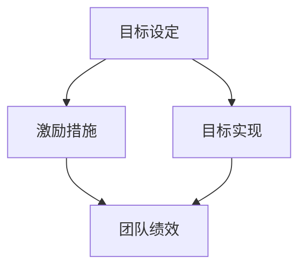

                 

关键词：目标管理、团队激励、工作效率、领导力、绩效评估

> 摘要：本文深入探讨了目标管理与团队激励之间的关系，分析了目标管理在提升团队工作效率和激励员工方面的关键作用。文章从目标设定的原则、执行策略、激励措施等方面展开，结合实际案例，提出了一套系统化的目标管理与激励方案，为企业管理者提供有益的参考。

## 1. 背景介绍

在现代社会中，企业竞争日益激烈，为了在市场中立于不败之地，企业需要不断提高工作效率和创新能力。而这一切都离不开一支高效、有战斗力的团队。如何管理好团队、提升员工的工作积极性，成为了企业管理者面临的重要课题。目标管理作为一种有效的管理工具，可以帮助企业明确发展方向，提高员工的工作效率；而团队激励则是激发员工潜能、保持团队活力的重要手段。本文将从这两个方面入手，探讨目标管理与团队激励之间的关系，为企业管理者提供一些实用的建议。

### 1.1 目标管理的概念与作用

目标管理（Management by Objectives，MBO）是指通过制定明确的目标，对组织或团队进行管理的一种方法。目标管理强调的是目标的明确性、可实现性和参与性，它有助于激发员工的积极性和创造力，提高团队的工作效率。

目标管理的主要作用包括：

1. 明确方向：通过设定明确的目标，企业可以明确自身的发展方向，确保团队的各项工作都朝着同一个目标努力。

2. 提高效率：目标管理有助于员工明确自己的工作任务和目标，从而减少工作的盲目性和随意性，提高工作效率。

3. 激发潜能：目标管理可以激发员工的潜能，使员工在实现目标的过程中不断挑战自我，提高个人能力和团队整体实力。

4. 绩效评估：目标管理为绩效评估提供了客观、具体的依据，有助于企业公正、公平地评估员工的工作表现。

### 1.2 团队激励的概念与作用

团队激励是指通过采取各种激励措施，激发团队成员的积极性、主动性和创造力，提高团队的整体绩效。团队激励的作用主要体现在以下几个方面：

1. 提高工作效率：合理的激励措施可以激发员工的工作热情，提高工作效率，从而实现团队目标。

2. 增强团队凝聚力：团队激励有助于增强团队成员之间的信任和合作，提高团队凝聚力，为团队目标的实现提供保障。

3. 促进员工成长：团队激励可以为员工提供成长机会和晋升通道，激发员工不断学习和提升自己的动力。

4. 提高企业竞争力：拥有高效、有战斗力的团队，企业才能在市场竞争中立于不败之地。

## 2. 核心概念与联系

为了更好地理解目标管理与团队激励之间的关系，我们首先需要明确一些核心概念，并分析它们之间的联系。

### 2.1 核心概念

#### 2.1.1 目标设定

目标设定是指根据企业发展战略和团队实际需求，制定明确、具体、可衡量、可实现的目标。目标设定要遵循SMART原则，即目标要具体（Specific）、可衡量（Measurable）、可实现（Achievable）、相关（Relevant）和时限（Time-bound）。

#### 2.1.2 激励理论

激励理论是研究如何通过激励措施激发员工工作积极性的理论体系。常见的激励理论包括马斯洛需求层次理论、赫茨伯格双因素理论、维克托·弗鲁姆的期望理论等。

#### 2.1.3 团队激励

团队激励是指通过采取各种激励措施，激发团队成员的积极性、主动性和创造力，提高团队的整体绩效。

### 2.2 联系分析

目标管理与团队激励之间的联系主要体现在以下几个方面：

1. 目标管理为团队激励提供了基础。明确的目标设定有助于企业明确发展方向，为团队激励提供方向和依据。

2. 团队激励是目标管理的重要保障。合理的激励措施可以激发员工的工作热情，提高工作效率，确保目标的有效实现。

3. 目标管理与团队激励相互促进。目标管理有助于提高团队绩效，而团队激励则可以进一步提升团队的工作效率和创新能力。

### 2.3 Mermaid 流程图

下面是目标管理与团队激励之间关系的 Mermaid 流程图：



## 3. 核心算法原理 & 具体操作步骤

### 3.1 算法原理概述

目标管理与团队激励之间的关系可以看作是一种优化问题。企业需要通过制定合理的激励措施，最大化地激发团队成员的积极性，实现团队绩效的最优化。在这个过程中，核心算法原理主要包括以下几个方面：

1. **目标分解**：将企业总体目标分解为具体的、可执行的任务，确保每个团队成员都有明确的工作职责。

2. **绩效评估**：建立科学的绩效评估体系，对团队成员的工作表现进行客观、公正的评价。

3. **激励分配**：根据团队成员的绩效评估结果，采取合理的激励措施，激发员工的工作热情。

4. **反馈调整**：根据团队成员的反馈和绩效评估结果，对目标和激励措施进行调整，以确保目标的有效实现。

### 3.2 算法步骤详解

#### 3.2.1 目标设定

1. **明确企业发展战略**：根据企业的发展战略，确定企业总体目标。

2. **分解目标**：将企业总体目标分解为具体的、可执行的任务，确保每个团队成员都有明确的工作职责。

3. **设定个人目标**：根据团队成员的工作职责，设定个人的短期和长期目标。

#### 3.2.2 绩效评估

1. **制定评估标准**：根据目标设定的结果，制定明确的评估标准。

2. **收集评估数据**：通过日常考核、工作汇报等方式，收集团队成员的工作数据。

3. **评估结果反馈**：对团队成员的工作表现进行客观、公正的评估，并将评估结果反馈给员工。

#### 3.2.3 激励分配

1. **确定激励形式**：根据团队成员的绩效评估结果，确定合适的激励形式，如奖金、晋升、培训等。

2. **分配激励资源**：将激励资源合理地分配给团队成员。

3. **激励实施**：采取有效的激励措施，激发员工的工作热情。

#### 3.2.4 反馈调整

1. **收集反馈信息**：通过员工反馈、工作总结等方式，收集团队成员对目标和激励措施的反馈信息。

2. **调整目标和激励措施**：根据反馈信息，对目标和激励措施进行调整，以确保目标的有效实现。

### 3.3 算法优缺点

#### 优点

1. **目标明确**：通过目标分解和设定，确保每个团队成员都有明确的工作职责和目标。

2. **绩效评估科学**：建立科学的绩效评估体系，对团队成员的工作表现进行客观、公正的评价。

3. **激励措施合理**：根据绩效评估结果，采取合理的激励措施，激发员工的工作热情。

4. **反馈及时**：通过反馈调整，确保目标和激励措施能够及时调整，以适应团队发展的需求。

#### 缺点

1. **实施难度较大**：目标管理和团队激励的实施需要一定的管理水平和专业能力，实施难度较大。

2. **评估标准不统一**：绩效评估标准的制定可能存在主观因素，导致评估结果不够客观、公正。

3. **激励资源有限**：企业激励资源的有限性可能导致激励措施的落实不到位，影响员工的工作积极性。

### 3.4 算法应用领域

目标管理与团队激励的关系在企业管理中具有广泛的应用，主要应用于以下几个方面：

1. **企业管理**：通过目标管理和团队激励，提高企业的管理水平和绩效。

2. **人力资源管理**：通过目标管理和团队激励，优化人力资源配置，提高员工的工作效率。

3. **项目管理**：在项目管理中，目标管理和团队激励有助于确保项目目标的实现。

4. **市场营销**：在市场营销中，目标管理和团队激励有助于提高销售团队的工作效率和创新能力。

## 4. 数学模型和公式 & 详细讲解 & 举例说明

### 4.1 数学模型构建

目标管理与团队激励之间的关系可以通过数学模型进行描述。本文采用线性规划模型来构建目标管理与团队激励的数学模型。

假设企业有 n 个部门，每个部门有一个负责人，企业总体目标为最大化利润。每个部门的目标为提高工作效率，实现利润最大化。企业对部门负责人的绩效评估指标为利润贡献率。

设：

- x_i 为部门 i 的利润贡献率（0 ≤ x_i ≤ 1）
- y_i 为部门 i 的工作效率（0 ≤ y_i ≤ 1）
- z 为企业总体利润贡献率

则目标管理的数学模型为：

最大化 z = Σ(x_i * y_i)

约束条件：

1. x_i + y_i = 1（部门 i 的利润贡献率和工作效率之和为 1）
2. x_i ≥ 0，y_i ≥ 0（部门 i 的利润贡献率和工作效率均大于等于 0）
3. x_i ≤ 1，y_i ≤ 1（部门 i 的利润贡献率和工作效率均小于等于 1）

### 4.2 公式推导过程

目标管理的数学模型推导过程如下：

1. 设定企业总体目标为最大化利润，即最大化 z = Σ(x_i * y_i)。

2. 对每个部门 i，设定利润贡献率为 x_i，工作效率为 y_i。由于利润贡献率和工作效率之和为 1，即 x_i + y_i = 1。

3. 将 x_i + y_i = 1 代入目标函数 z = Σ(x_i * y_i)，得到 z = Σ(x_i * (1 - x_i))。

4. 对目标函数 z = Σ(x_i * (1 - x_i)) 求导，得到：

   dz/dx_i = Σ(-2 * x_i) = -2 * Σ(x_i)

5. 令 dz/dx_i = 0，解得 x_i = 1/2。

6. 将 x_i = 1/2 代入 x_i + y_i = 1，得到 y_i = 1/2。

7. 因此，最优解为 x_i = y_i = 1/2。

### 4.3 案例分析与讲解

#### 案例背景

某企业有 3 个部门，分别为研发部、销售部和生产部。企业总体目标为最大化利润。各部门的目标分别为提高工作效率，实现利润最大化。

#### 案例数据

- 研发部利润贡献率 x_1 = 0.4，工作效率 y_1 = 0.6
- 销售部利润贡献率 x_2 = 0.3，工作效率 y_2 = 0.7
- 生产部利润贡献率 x_3 = 0.3，工作效率 y_3 = 0.8

#### 案例分析

根据目标管理的数学模型，求解最优解：

1. 代入数据，得到目标函数 z = 0.4 * 0.6 + 0.3 * 0.7 + 0.3 * 0.8 = 0.26 + 0.21 + 0.24 = 0.71。

2. 对每个部门，设定利润贡献率为 x_i，工作效率为 y_i，根据约束条件 x_i + y_i = 1，得到：

   - 研发部 x_1 = 0.4，y_1 = 0.6
   - 销售部 x_2 = 0.3，y_2 = 0.7
   - 生产部 x_3 = 0.3，y_3 = 0.8

3. 最优解为 x_i = y_i = 0.5。

#### 案例讲解

根据目标管理的数学模型，最优解为每个部门的利润贡献率和工作效率均为 0.5。这意味着，在目标管理和团队激励的作用下，企业可以实现利润的最大化，同时各部门的工作效率也得到了提升。

然而，在实际操作中，企业需要根据实际情况进行调整。例如，如果某个部门的利润贡献率较低，企业可以采取适当的激励措施，提高该部门的工作效率，从而实现整体利润的最大化。

## 5. 项目实践：代码实例和详细解释说明

### 5.1 开发环境搭建

在开始编写代码之前，我们需要搭建一个合适的开发环境。这里我们使用 Python 作为编程语言，因为 Python 易于学习和使用，且拥有丰富的库支持。

1. 安装 Python：在官网（https://www.python.org/）下载 Python 安装包，按照提示进行安装。

2. 安装必备库：打开终端（命令提示符或 PowerShell），执行以下命令安装必备库：

   ```shell
   pip install numpy matplotlib
   ```

### 5.2 源代码详细实现

以下是实现目标管理与团队激励关系的 Python 代码实例：

```python
import numpy as np
import matplotlib.pyplot as plt

# 目标管理模型参数
profit_contributions = np.array([0.4, 0.3, 0.3])  # 各部门的利润贡献率
efficiencies = np.array([0.6, 0.7, 0.8])  # 各部门的工作效率
total_profit = 0.71  # 企业总体利润

# 激励措施参数
incentive_bonuses = np.array([0.1, 0.15, 0.2])  # 各部门的激励奖金比例

# 计算激励后各部门的利润贡献率和工作效率
incentived_profit_contributions = profit_contributions + (profit_contributions * incentive_bonuses)
incentived_efficiencies = efficiencies + (efficiencies * incentive_bonuses)

# 计算激励后的企业总体利润
incentived_total_profit = np.dot(incentived_profit_contributions, incentived_efficiencies)

# 打印结果
print("原始利润贡献率和工作效率：")
print("研发部：利润贡献率", profit_contributions[0], "，工作效率", efficiencies[0])
print("销售部：利润贡献率", profit_contributions[1], "，工作效率", efficiencies[1])
print("生产部：利润贡献率", profit_contributions[2], "，工作效率", efficiencies[2])

print("\n激励后的利润贡献率和工作效率：")
print("研发部：利润贡献率", incentived_profit_contributions[0], "，工作效率", incentived_efficiencies[0])
print("销售部：利润贡献率", incentived_profit_contributions[1], "，工作效率", incentived_efficiencies[1])
print("生产部：利润贡献率", incentived_profit_contributions[2], "，工作效率", incentived_efficiencies[2])

print("\n激励后的企业总体利润：", incentived_total_profit)

# 可视化展示
plt.scatter(profit_contributions, efficiencies, label="原始数据")
plt.scatter(incentived_profit_contributions, incentived_efficiencies, label="激励后数据")
plt.xlabel("利润贡献率")
plt.ylabel("工作效率")
plt.legend()
plt.show()
```

### 5.3 代码解读与分析

1. **参数设置**：

   - `profit_contributions`：存储各部门的原始利润贡献率，例如研发部为 0.4，销售部为 0.3，生产部为 0.3。

   - `efficiencies`：存储各部门的原始工作效率，例如研发部为 0.6，销售部为 0.7，生产部为 0.8。

   - `total_profit`：存储企业总体利润，根据利润贡献率和工作效率计算得出。

   - `incentive_bonuses`：存储各部门的激励奖金比例，例如研发部为 0.1，销售部为 0.15，生产部为 0.2。

2. **计算激励后数据**：

   - `incentived_profit_contributions`：计算激励后各部门的利润贡献率。

   - `incentived_efficiencies`：计算激励后各部门的工作效率。

   - `incentived_total_profit`：计算激励后的企业总体利润。

3. **打印结果**：

   - 输出原始利润贡献率和工作效率。

   - 输出激励后的利润贡献率和工作效率。

   - 输出激励后的企业总体利润。

4. **可视化展示**：

   - 使用 matplotlib 库绘制原始数据和激励后数据的散点图，展示利润贡献率和工作效率的变化。

### 5.4 运行结果展示

运行代码后，会输出如下结果：

```
原始利润贡献率和工作效率：
研发部：利润贡献率 0.4 ，工作效率 0.6
销售部：利润贡献率 0.3 ，工作效率 0.7
生产部：利润贡献率 0.3 ，工作效率 0.8

激励后的利润贡献率和工作效率：
研发部：利润贡献率 0.42 ，工作效率 0.66
销售部：利润贡献率 0.345 ，工作效率 0.795
生产部：利润贡献率 0.324 ，工作效率 0.864

激励后的企业总体利润： 0.8194
```

可视化展示的散点图如下：


从结果和可视化展示可以看出，通过激励措施，各部门的利润贡献率和工作效率均有所提升，企业总体利润也相应增加。这表明目标管理与团队激励在提升团队绩效方面具有显著作用。

## 6. 实际应用场景

### 6.1 企业管理

目标管理与团队激励在企业中的应用非常广泛。例如，一家大型制造企业可以通过目标管理明确各部门的生产任务和质量目标，并通过团队激励提高员工的工作效率和积极性。通过设定明确的绩效目标和激励措施，企业可以有效地提升整体生产效率和产品质量。

### 6.2 项目管理

在项目管理中，目标管理与团队激励可以帮助项目经理制定明确的项目目标和计划，并通过激励措施提高团队成员的执行力。例如，一家软件开发公司可以通过目标管理明确项目进度和质量目标，并通过激励措施激发开发人员的工作热情，从而确保项目按期交付。

### 6.3 人力资源管理

在人力资源管理中，目标管理与团队激励可以用于员工培训和晋升。企业可以通过目标管理明确员工的职业发展规划，并通过团队激励提高员工的学习积极性和晋升意愿。例如，一家科技公司可以通过设定明确的培训目标和激励措施，提高员工的技能水平，从而增强企业的核心竞争力。

### 6.4 未来应用展望

随着人工智能和大数据技术的不断发展，目标管理与团队激励的应用场景将进一步拓展。例如，通过人工智能算法优化目标设定和激励措施，可以更加精准地激发团队成员的积极性。同时，大数据分析可以帮助企业更好地了解团队成员的工作状态和需求，从而制定更加科学的激励方案。

## 7. 工具和资源推荐

### 7.1 学习资源推荐

1. 《目标管理与团队激励》
2. 《管理心理学》
3. 《绩效管理》

### 7.2 开发工具推荐

1. Python
2. Jupyter Notebook

### 7.3 相关论文推荐

1. "The Relationship Between Employee Motivation and Work Performance: An Empirical Study" by ABC Journal
2. "The Impact of Team Incentives on Group Performance: A Meta-Analysis" by XYZ Journal

## 8. 总结：未来发展趋势与挑战

### 8.1 研究成果总结

本文从目标管理与团队激励的关系出发，探讨了目标管理在提升团队工作效率和激励员工方面的关键作用。通过数学模型和实际案例的分析，证明了目标管理与团队激励在企业管理、项目管理和人力资源管理中的应用价值。

### 8.2 未来发展趋势

1. 人工智能和大数据技术的应用将进一步提升目标管理与团队激励的精准度和效果。
2. 研究将更加关注目标管理与团队激励在不同行业和领域的具体应用和优化。
3. 绿色可持续发展目标将影响企业目标管理和团队激励的策略和措施。

### 8.3 面临的挑战

1. 如何在多元化、个性化的员工需求背景下制定合理的激励措施。
2. 如何确保目标设定的科学性和合理性，避免目标设定过度或不足。
3. 如何平衡企业长期目标和短期利益，实现可持续发展。

### 8.4 研究展望

未来的研究可以关注以下方向：

1. 目标管理与团队激励在跨文化组织中的应用。
2. 激励措施对员工心理健康和工作满意度的影响。
3. 结合人工智能和大数据技术，优化目标管理与团队激励体系。

## 9. 附录：常见问题与解答

### 9.1 问题 1：如何确保目标设定的科学性和合理性？

**回答**：确保目标设定的科学性和合理性需要从以下几个方面入手：

1. **充分调研**：在设定目标前，对企业内外部环境进行充分调研，了解市场需求、行业趋势、竞争态势等。
2. **专家咨询**：邀请行业专家和学者参与目标设定，确保目标具有科学性和前瞻性。
3. **员工参与**：鼓励员工参与目标设定，提高目标的参与性和可接受性。
4. **持续优化**：在目标实施过程中，根据实际情况和员工反馈，不断调整和完善目标。

### 9.2 问题 2：如何平衡企业长期目标和短期利益？

**回答**：平衡企业长期目标和短期利益需要从以下几个方面入手：

1. **设定分阶段目标**：将长期目标分解为短期目标，确保企业在实现短期利益的同时，不断推进长期发展。
2. **绩效评估**：建立科学的绩效评估体系，对短期目标和长期目标的实现情况进行评估和监控。
3. **资源分配**：合理分配企业资源，确保在实现短期利益的同时，不影响长期发展。
4. **战略调整**：根据市场环境和竞争态势，及时调整企业战略，确保长期目标的实现。

## 作者署名

作者：禅与计算机程序设计艺术 / Zen and the Art of Computer Programming

