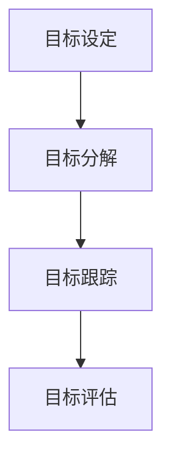

                 

关键词：目标管理、管理者、领导力、组织效率、技术团队、项目管理

> 摘要：本文旨在探讨目标管理在管理者领导力中的关键作用。通过深入分析目标管理的基本原理和实践方法，本文揭示了目标管理在提升组织效率、激发团队潜力以及实现企业战略目标中的重要性。此外，本文还结合实际案例，详细介绍了目标管理在技术团队和项目管理中的具体应用，以及未来的发展趋势和面临的挑战。

## 1. 背景介绍

在当今快速变化和竞争激烈的市场环境中，企业的成功与否往往取决于管理者的领导力和决策能力。而目标管理作为一种重要的管理工具，已经在各种组织中得到了广泛应用。目标管理不仅仅是一种方法，更是一种思维方式，它能够帮助管理者清晰定义组织的目标，确保团队朝着共同的方向努力，提高工作效率和执行力。

然而，目标管理并非一蹴而就，它需要管理者具备深厚的理论知识和丰富的实践经验。本文将从以下几个方面进行探讨：

- 目标管理的基本概念和原理
- 目标管理的核心流程和方法
- 目标管理在技术团队和项目管理中的具体应用
- 目标管理的数学模型和公式
- 目标管理的未来发展趋势和挑战

## 2. 核心概念与联系

### 2.1 目标管理的基本概念

目标管理是一种基于目标设定的管理方法，它强调组织目标的明确性、可衡量性和可达性。具体来说，目标管理包括以下几个关键概念：

- **目标设定**：明确组织的目标，并将其分解为具体的、可操作的任务。
- **目标分解**：将组织目标分解为更小、更具体的目标，以便更好地实现。
- **目标跟踪**：实时监控目标实现的进度，确保团队始终朝着正确的方向前进。
- **目标评估**：对目标实现的结果进行评估，以便及时调整和改进。

### 2.2 目标管理的基本原理

目标管理的基本原理可以概括为以下几点：

- **目标导向**：目标管理以目标为导向，强调目标的重要性。
- **参与式管理**：目标管理鼓励员工参与目标的设定和实现，提高团队的凝聚力和执行力。
- **持续改进**：目标管理强调持续改进，通过不断调整和优化，实现更高的目标。

### 2.3 目标管理的架构

为了更好地理解目标管理，我们可以使用Mermaid流程图来展示其基本架构：

在上图中，A表示目标设定，B表示目标分解，C表示目标跟踪，D表示目标评估。这些步骤相互关联，构成了目标管理的核心流程。

## 3. 核心算法原理 & 具体操作步骤

### 3.1 算法原理概述

目标管理的核心算法可以看作是一种分层目标设定和跟踪的方法。该方法的基本原理是将组织的大目标分解为具体的、可执行的小目标，并通过实时跟踪和评估，确保目标的实现。具体来说，目标管理的核心算法包括以下几个步骤：

1. **目标设定**：根据组织的战略目标和愿景，设定具体的、可衡量的目标。
2. **目标分解**：将大目标分解为更小、更具体的目标，确保每个目标都有明确的指标和责任人。
3. **目标跟踪**：实时监控目标的实现进度，确保团队始终朝着正确的方向前进。
4. **目标评估**：对目标实现的结果进行评估，及时调整和优化。

### 3.2 算法步骤详解

#### 3.2.1 目标设定

目标设定的第一步是明确组织的战略目标和愿景。管理者需要与团队进行充分的沟通，确保每个人都清楚组织的目标和方向。接下来，管理者需要将大目标分解为具体的、可衡量的目标。这些目标应该具有以下特点：

- **明确性**：目标应该明确、具体，避免模糊和抽象。
- **可衡量性**：目标应该有明确的指标，以便衡量实现程度。
- **可达性**：目标应该是可达的，避免过于理想化。

#### 3.2.2 目标分解

目标分解是将大目标分解为更小、更具体的目标。这一步骤需要管理者与团队共同参与，确保每个目标都有明确的指标和责任人。目标分解的步骤如下：

1. **确定关键成果**：根据大目标，确定关键成果，这些成果应该是具体、可衡量的。
2. **分配任务**：将关键成果分配给团队成员，确保每个目标都有明确的负责人。
3. **设定时间节点**：为每个目标设定明确的时间节点，以便实时监控和跟踪。

#### 3.2.3 目标跟踪

目标跟踪是确保目标实现进度的重要环节。管理者需要实时监控目标的实现情况，及时发现和解决问题。目标跟踪的步骤如下：

1. **定期会议**：定期召开团队会议，讨论目标实现的进展情况。
2. **数据收集**：收集与目标实现相关的数据，包括进度报告、反馈信息等。
3. **问题解决**：针对出现的问题，及时采取解决措施，确保目标的实现。

#### 3.2.4 目标评估

目标评估是对目标实现结果进行评估和反馈的重要环节。管理者需要根据目标的指标，对实现结果进行客观评估，以便及时调整和优化。目标评估的步骤如下：

1. **数据汇总**：收集与目标实现相关的数据，包括进度报告、反馈信息等。
2. **结果分析**：对数据进行分析，评估目标的实现程度。
3. **反馈与调整**：根据评估结果，对目标进行调整和优化，确保目标的实现。

### 3.3 算法优缺点

#### 3.3.1 优点

- **提高目标实现率**：通过明确的目标设定和分解，确保团队始终朝着正确的方向努力，提高目标的实现率。
- **增强团队凝聚力**：目标管理鼓励员工参与目标的设定和实现，提高团队的凝聚力和执行力。
- **持续改进**：目标管理强调持续改进，通过不断调整和优化，实现更高的目标。

#### 3.3.2 缺点

- **目标设定难度**：明确、具体、可衡量的目标设定难度较大，需要管理者具备深厚的专业知识和管理能力。
- **数据收集和处理**：目标跟踪和评估需要收集和处理大量的数据，对管理者的数据分析和处理能力要求较高。

### 3.4 算法应用领域

目标管理在许多领域都有广泛的应用，特别是在技术团队和项目管理中。以下是一些目标管理的具体应用领域：

- **软件开发项目**：通过目标管理，确保软件开发项目按照计划进行，提高项目的成功率。
- **产品管理**：通过目标管理，明确产品的目标和方向，确保产品开发符合市场需求。
- **运营管理**：通过目标管理，提高运营效率，确保业务目标的实现。
- **人力资源管理**：通过目标管理，激励员工实现个人和团队目标，提高员工满意度和工作效率。

## 4. 数学模型和公式 & 详细讲解 & 举例说明

### 4.1 数学模型构建

目标管理的数学模型可以看作是一个基于目标设定的动态优化模型。该模型的核心是目标函数和约束条件。

#### 目标函数

目标函数是衡量目标实现程度的指标，可以表示为：

$$
f(x) = \sum_{i=1}^{n} w_i \cdot g_i(x)
$$

其中，$w_i$ 表示第 $i$ 个目标的权重，$g_i(x)$ 表示第 $i$ 个目标在实现程度上的得分。

#### 约束条件

约束条件包括目标之间的依赖关系和资源的限制。具体来说，约束条件可以表示为：

$$
h_i(x) \leq 0, \quad i=1,2,...,m
$$

其中，$h_i(x)$ 表示第 $i$ 个约束条件。

### 4.2 公式推导过程

目标管理的公式推导过程可以分为以下几个步骤：

1. **目标设定**：根据组织的战略目标和愿景，设定具体的、可衡量的目标。
2. **目标分解**：将大目标分解为更小、更具体的目标，并设定相应的权重。
3. **目标跟踪**：实时监控目标的实现进度，计算目标得分。
4. **目标评估**：根据目标得分，评估目标的实现程度，并根据评估结果进行调整和优化。

### 4.3 案例分析与讲解

假设一个软件开发项目，目标是确保项目按期完成，并达到客户满意度。根据目标管理的数学模型，我们可以设定以下目标函数和约束条件：

#### 目标函数

$$
f(x) = w_1 \cdot g_1(x) + w_2 \cdot g_2(x)
$$

其中，$g_1(x)$ 表示项目完成度得分，$g_2(x)$ 表示客户满意度得分。

#### 约束条件

$$
h_1(x) = \text{项目完成度} - x \leq 0 \\
h_2(x) = \text{客户满意度} - x \leq 0
$$

#### 案例分析

假设项目团队有5个成员，每个成员负责一个模块的开发。根据项目目标和团队资源，我们可以设定以下目标函数和约束条件：

- 目标函数：
  $$ f(x) = 0.6 \cdot g_1(x) + 0.4 \cdot g_2(x) $$
- 约束条件：
  $$ h_1(x) = \sum_{i=1}^{5} \text{模块}

