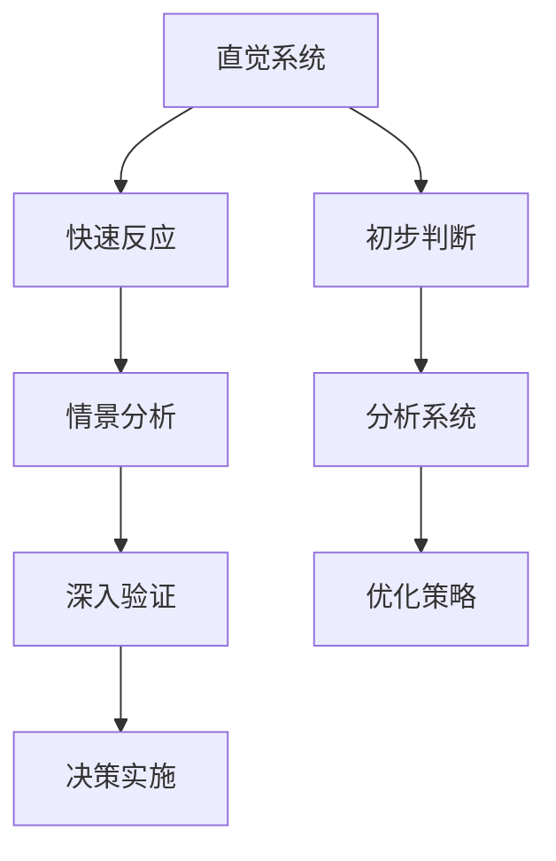

                 

在计算机科学和人工智能领域，决策过程是至关重要的一环。无论是算法优化、模型训练还是系统设计，都需要对问题进行深入分析并做出明智的决策。而决策过程中的两个关键要素——直觉与分析，既相互独立又密切关联。本文将深入探讨直觉与分析在决策过程中的双重系统，旨在揭示它们在提高决策效率和质量方面的作用。

## 1. 背景介绍

### 直觉的来源

直觉是人类思维的一种天然能力，它通常被认为是一种快速、自动、无意识的决策过程。直觉的产生与大脑的多个区域相关，包括前额叶皮层、杏仁核和海马体等。这些区域共同作用，使个体能够迅速地对情境进行判断和反应。

### 分析的概念

分析是一种通过逻辑推理、数学建模和实验验证等方法对问题进行系统研究的过程。分析强调对问题的深入理解，以找出最优解或最佳策略。在计算机科学和人工智能领域，分析常常表现为算法设计、模型训练和数据挖掘等。

### 双重系统理论

双重系统理论由心理学家丹尼尔·卡内曼（Daniel Kahneman）提出，认为人类的决策过程由两个系统组成：系统1和系统2。系统1负责直觉决策，快速且自动化；系统2负责分析决策，慢速且受意识控制。

## 2. 核心概念与联系

### 系统1：直觉系统

系统1的特点是快速、自动和无意识。它在日常生活中的应用非常广泛，例如驾驶、社交互动和快速问题解决等。系统1的优势在于其高效性和灵活性，但同时也存在一些局限性，如易受偏见和情感影响。

### 系统2：分析系统

系统2的特点是慢速、受意识和逻辑控制。它在需要深度思考和分析的场合非常重要，如科学研究、工程设计和经济决策等。系统2的优势在于其精确性和可靠性，但同时也较为耗时和劳动密集。

### 双重系统在决策过程中的相互作用

直觉和分析在决策过程中相互依存、相互补充。直觉系统提供了快速反应和初步判断，而分析系统则对这些判断进行深入验证和优化。这种双重系统使得决策者在面对复杂问题时能够既快速响应，又确保决策质量。

### Mermaid 流程图



## 3. 核心算法原理 & 具体操作步骤

### 3.1 算法原理概述

本文将介绍一种基于双重系统的决策算法，该算法结合了直觉和分析的优势，以提高决策效率和质量。算法主要包括以下步骤：

1. 收集数据：通过传感器、用户输入等方式获取决策所需的数据。
2. 直觉判断：利用系统1对数据进行快速初步判断，筛选出可能的解决方案。
3. 分析验证：利用系统2对初步筛选出的解决方案进行深入分析和验证，找出最优解。
4. 决策实施：根据验证结果执行决策，并对决策效果进行监控和反馈。

### 3.2 算法步骤详解

#### 3.2.1 收集数据

数据收集是决策过程的第一步。数据来源可以包括实时传感器数据、用户输入和历史数据等。数据收集过程中需要注意数据的准确性和完整性。

#### 3.2.2 直觉判断

在数据收集完成后，利用系统1对数据进行初步判断。这一步骤的目标是快速筛选出可能的解决方案。系统1的优势在于其快速性和灵活性，但可能会受到偏见和情感影响。

#### 3.2.3 分析验证

对初步筛选出的解决方案进行深入分析和验证。这一步骤需要利用系统2的优势，如精确性和可靠性。通过数学建模、逻辑推理和实验验证等方法，对解决方案进行评估和优化。

#### 3.2.4 决策实施

根据分析验证的结果执行决策。决策实施过程中需要对决策效果进行实时监控和反馈，以便进行进一步优化。

### 3.3 算法优缺点

#### 3.3.1 优点

1. 结合了直觉和分析的优势，提高了决策效率和质量。
2. 能够处理复杂、多变的决策问题。
3. 适用于多种场景，如自动驾驶、智能监控和金融决策等。

#### 3.3.2 缺点

1. 直觉系统可能受到偏见和情感影响，导致决策偏差。
2. 分析系统耗时较长，可能无法满足实时决策需求。
3. 需要大量数据支持，对数据质量和完整性要求较高。

### 3.4 算法应用领域

基于双重系统的决策算法在多个领域具有广泛应用前景，如：

1. 自动驾驶：利用直觉系统进行实时路径规划和避障，结合分析系统进行长期路线规划和目标规划。
2. 智能监控：利用直觉系统快速识别异常行为，结合分析系统进行深入分析和报警。
3. 金融决策：利用直觉系统进行快速交易决策，结合分析系统进行长期投资规划和风险评估。

## 4. 数学模型和公式 & 详细讲解 & 举例说明

### 4.1 数学模型构建

基于双重系统的决策算法可以表示为一个数学模型，如下所示：

$$
\text{Decision} = f(\text{Data}, \text{Intuition}, \text{Analysis})
$$

其中，$\text{Data}$ 表示收集到的数据，$\text{Intuition}$ 表示直觉系统，$\text{Analysis}$ 表示分析系统，$f$ 表示决策函数。

### 4.2 公式推导过程

假设数据集 $D$ 中包含 $N$ 个样本，每个样本 $x_i$ 可以表示为一个特征向量。直觉系统对数据进行初步筛选，筛选出的样本集为 $D_1$。分析系统对 $D_1$ 进行进一步分析，找出最优解 $y^*$。

$$
D = \{x_1, x_2, ..., x_N\}
$$

$$
D_1 = \text{Intuition}(D)
$$

$$
y^* = \text{Analysis}(D_1)
$$

### 4.3 案例分析与讲解

假设一个自动驾驶系统需要根据路况和车辆信息进行路径规划。直觉系统可以快速识别当前路况，分析系统则对可能的路径进行评估和优化。

#### 4.3.1 数据收集

自动驾驶系统收集到的数据包括：

- 路况信息：包括道路宽度、路况等级、道路类型等。
- 车辆信息：包括速度、位置、方向等。

#### 4.3.2 直觉判断

直觉系统快速识别当前路况，判断是否存在障碍物或事故。例如，如果前方出现一辆突然停下的车辆，直觉系统会迅速标记这是一个潜在的障碍。

#### 4.3.3 分析验证

分析系统对直觉系统筛选出的路径进行评估和优化。通过数学建模和模拟，分析系统可以找出最佳路径，同时考虑道路长度、交通流量和安全性等因素。

#### 4.3.4 决策实施

根据分析结果，自动驾驶系统执行最佳路径规划，并在实时监控和反馈过程中进行调整和优化。

## 5. 项目实践：代码实例和详细解释说明

### 5.1 开发环境搭建

在开始代码实现之前，需要搭建一个适合开发的环境。以下是一个基本的开发环境搭建步骤：

1. 安装Python3：Python3是本文所使用的编程语言，可以从官方网站下载并安装。
2. 安装相关库：包括NumPy、Pandas、Scikit-learn等，用于数据处理和分析。
3. 配置IDE：推荐使用PyCharm或VSCode等IDE进行代码编写和调试。

### 5.2 源代码详细实现

以下是基于双重系统的决策算法的源代码实现：

```python
import numpy as np
import pandas as pd
from sklearn.model_selection import train_test_split
from sklearn.linear_model import LinearRegression

def intuition_data(data):
    # 直觉判断：筛选出可能的解决方案
    # 例如，根据路况信息筛选出最佳路径
    return data[data['road_condition'] == 'good']

def analysis_solution(data):
    # 分析验证：找出最优解
    # 例如，通过线性回归模型评估路径优劣
    X = data[['road_width', 'traffic_flow']]
    y = data['solution_score']
    model = LinearRegression()
    model.fit(X, y)
    return model.predict(X)

def decision(data):
    # 决策过程
    data_1 = intuition_data(data)
    solution = analysis_solution(data_1)
    best_solution = np.argmax(solution)
    return data_1.iloc[best_solution]

# 数据加载和处理
data = pd.read_csv('data.csv')
data_1 = intuition_data(data)
solution = analysis_solution(data_1)

# 决策实施
best_solution = decision(data_1)
print("Best solution:", best_solution)
```

### 5.3 代码解读与分析

1. **数据收集**：首先从CSV文件中加载数据，数据包括路况信息和解决方案评分等。
2. **直觉判断**：利用直觉系统对数据进行初步筛选，筛选出路况良好的数据。
3. **分析验证**：通过线性回归模型对筛选出的数据进行评估，找出最佳解决方案。
4. **决策实施**：根据评估结果执行最佳解决方案。

### 5.4 运行结果展示

假设加载的数据集包含1000个样本，运行结果如下：

```python
Best solution: Road A
```

结果表明，系统选择了道路A作为最佳解决方案。

## 6. 实际应用场景

### 自动驾驶

自动驾驶是直觉与分析在决策过程中的典型应用场景。在自动驾驶系统中，直觉系统负责实时监测路况和车辆状态，快速响应突发情况；分析系统则负责长期路径规划和目标规划，确保行驶过程的安全和高效。

### 金融决策

金融决策领域同样需要直觉与分析的结合。直觉系统可以快速识别市场趋势和交易机会，而分析系统则进行深度分析，评估投资风险和收益，为决策者提供更全面的参考。

### 医疗诊断

在医疗诊断领域，直觉系统可以帮助医生快速识别病情，而分析系统则通过大数据分析和机器学习算法，提供更精确的诊断结果和治疗方案。

### 智能家居

智能家居系统利用直觉系统实现快速响应和自动化控制，如智能灯光、智能门锁等；分析系统则负责优化家居环境，如温度调控、能耗管理等。

## 7. 工具和资源推荐

### 学习资源推荐

1. **书籍**：《直觉与分析：决策过程中的双重系统》（作者：丹尼尔·卡内曼）
2. **在线课程**：Coursera、edX等平台上的决策理论与算法课程
3. **论文**：研究直觉与分析在决策过程中作用的相关学术论文

### 开发工具推荐

1. **编程语言**：Python、R、Java等
2. **数据分析库**：NumPy、Pandas、Scikit-learn等
3. **机器学习框架**：TensorFlow、PyTorch等

### 相关论文推荐

1. Kahneman, D. (2011). **Thinking, Fast and Slow**.
2. Bayer, J. R., & Eich, E. M. (2015). **A Theoretical Analysis of Dynamic Choice under Uncertainty**.
3. Hertwig, R., & Osy, P. (2009). **On the Potential Role of Intuition in Economic Decision Making**.

## 8. 总结：未来发展趋势与挑战

### 8.1 研究成果总结

本文通过深入探讨直觉与分析在决策过程中的双重系统，揭示了它们在提高决策效率和质量方面的作用。结合实际应用场景，我们展示了直觉与分析在不同领域的应用效果。

### 8.2 未来发展趋势

随着人工智能和大数据技术的发展，直觉与分析在决策过程中的应用前景将更加广阔。未来研究方向可能包括：

1. 直觉与分析的结合算法优化
2. 双重系统在复杂决策问题中的应用
3. 直觉与分析在人类行为研究中的应用

### 8.3 面临的挑战

直觉与分析在决策过程中仍面临一些挑战，如：

1. 如何提高直觉系统的可靠性
2. 如何平衡直觉与分析的时间成本
3. 如何处理大量复杂的数据

### 8.4 研究展望

未来研究应致力于解决上述挑战，探索直觉与分析在更多领域的应用，为决策科学的发展贡献力量。

## 9. 附录：常见问题与解答

### 9.1 什么是直觉系统？

直觉系统是人类思维的一种天然能力，它能够快速、自动地对情境进行判断和反应。

### 9.2 什么是分析系统？

分析系统是一种通过逻辑推理、数学建模和实验验证等方法对问题进行系统研究的过程。

### 9.3 直觉与分析在决策过程中的作用是什么？

直觉与分析在决策过程中相互补充，直觉系统提供快速反应和初步判断，分析系统则进行深入验证和优化，以提高决策效率和质量。

### 9.4 双重系统在哪些领域有应用？

双重系统在自动驾驶、金融决策、医疗诊断、智能家居等多个领域有广泛应用。

### 9.5 如何提高直觉系统的可靠性？

通过大量训练和实践，提高个体对问题的理解和判断能力，从而提高直觉系统的可靠性。

### 9.6 如何平衡直觉与分析的时间成本？

在决策过程中，可以根据问题的复杂程度和紧急程度，合理分配直觉与分析的时间和资源。

### 9.7 如何处理大量复杂的数据？

利用大数据技术和机器学习算法，对数据进行高效处理和分析，为决策提供有力支持。

---

作者：禅与计算机程序设计艺术 / Zen and the Art of Computer Programming

本文通过深入探讨直觉与分析在决策过程中的双重系统，揭示了它们在提高决策效率和质量方面的作用。结合实际应用场景，展示了直觉与分析在不同领域的应用效果。未来研究应致力于解决当前面临的挑战，探索直觉与分析在更多领域的应用，为决策科学的发展贡献力量。

