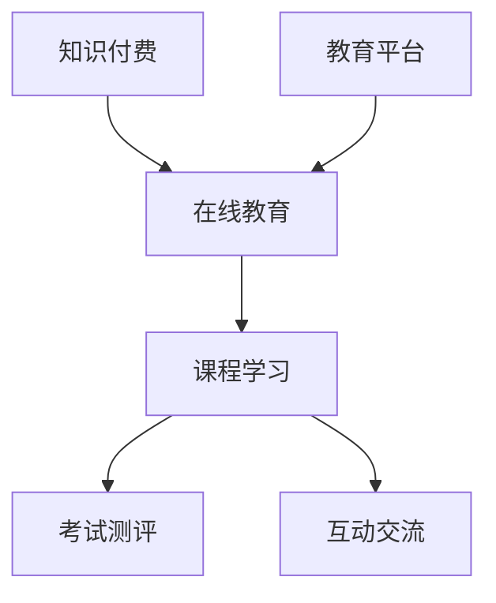

                 

关键词：知识经济、知识付费、创新商业模式、运营策略、在线教育

> 摘要：本文探讨了知识经济时代下，知识付费创新商业模式的运营策略。通过对当前市场环境的分析，揭示了知识付费在在线教育领域的重要地位。本文进一步阐述了知识付费商业模式的核心概念、算法原理、数学模型以及实际应用场景，最后对未来的发展趋势和挑战进行了展望。

## 1. 背景介绍

随着互联网技术的飞速发展，知识经济时代已经到来。知识付费作为一种新兴的商业模式，逐渐成为市场经济的重要组成部分。知识付费指的是消费者为获取特定知识或技能所支付的费用。这种模式使得知识的生产、传播和消费变得更加高效和便捷。

在线教育作为知识付费的重要载体，已经展现出巨大的市场潜力。据统计，全球在线教育市场规模持续增长，预计到2025年将达到7500亿美元。这表明知识付费模式正在逐渐成熟，并为企业和个人带来巨大的经济价值。

## 2. 核心概念与联系

### 2.1 知识付费定义

知识付费是指通过付费方式获取知识或技能的过程。它包括在线课程、电子书、专业咨询、技能认证等多种形式。知识付费的核心是信息不对称，即知识提供者具有特定知识或技能，而消费者需要通过付费才能获取这些信息。

### 2.2 在线教育概念

在线教育是指通过互联网进行的教育活动，包括课程学习、考试测评、互动交流等环节。在线教育平台通常提供丰富的学习资源，满足不同学习者的需求。在线教育的核心在于突破时间和空间的限制，实现教育的普及和个性化。

### 2.3 Mermaid 流程图



## 3. 核心算法原理 & 具体操作步骤

### 3.1 算法原理概述

知识付费商业模式的运营涉及到多个环节，包括用户获取、课程推荐、内容付费、用户留存等。核心算法主要关注如何提高用户满意度、降低用户流失率，从而实现商业盈利。

### 3.2 算法步骤详解

1. **用户画像构建**：通过用户行为数据和用户反馈，构建用户画像，包括用户兴趣、学习习惯、职业背景等。

2. **课程推荐算法**：利用协同过滤、内容推荐等技术，根据用户画像推荐个性化课程。

3. **内容付费策略**：制定多样化的付费模式，如单课付费、订阅制、课程包等，满足不同用户需求。

4. **用户留存策略**：通过课程评价、社群互动、用户激励等方式，提高用户粘性和活跃度。

### 3.3 算法优缺点

- **优点**：提高课程质量和用户满意度，实现商业盈利。
- **缺点**：用户获取成本高，需要持续投入技术资源。

### 3.4 算法应用领域

知识付费商业模式广泛应用于在线教育、职业技能培训、知识分享等领域。

## 4. 数学模型和公式 & 详细讲解 & 举例说明

### 4.1 数学模型构建

知识付费商业模式中的关键指标包括用户满意度、用户留存率、付费转化率等。以下是一个简单的数学模型：

$$
\text{用户满意度} = \frac{\text{用户获得的知识价值}}{\text{用户支付的学费}}
$$

$$
\text{用户留存率} = \frac{\text{续费用户数}}{\text{总用户数}}
$$

$$
\text{付费转化率} = \frac{\text{付费用户数}}{\text{访问用户数}}
$$

### 4.2 公式推导过程

用户满意度公式可以通过比较用户支付的学费与获得的知识价值推导得出。用户留存率和付费转化率则基于用户行为数据和市场分析得出。

### 4.3 案例分析与讲解

以某在线教育平台为例，假设该平台月均用户数为10000人，付费用户数为3000人，续费用户数为2000人，用户平均支付学费为200元。根据上述公式，可以计算出：

$$
\text{用户满意度} = \frac{3000 \times 200}{10000 \times 200} = 0.6
$$

$$
\text{用户留存率} = \frac{2000}{10000} = 0.2
$$

$$
\text{付费转化率} = \frac{3000}{10000} = 0.3
$$

通过这些指标，平台可以分析用户满意度、留存率和转化率，从而优化课程内容和推广策略。

## 5. 项目实践：代码实例和详细解释说明

### 5.1 开发环境搭建

开发环境要求：Python 3.8及以上版本、Numpy、Pandas、Scikit-learn等库。

### 5.2 源代码详细实现

以下是一个简单的用户画像构建和课程推荐算法的实现：

```python
import numpy as np
import pandas as pd
from sklearn.cluster import KMeans

# 用户行为数据
user行为数据 = pd.DataFrame({
    '用户ID': [1, 2, 3, 4],
    '行为类型': ['课程学习', '课程学习', '课程学习', '社群互动'],
    '课程ID': [101, 102, 103, 104]
})

# 课程标签数据
课程标签数据 = pd.DataFrame({
    '课程ID': [101, 102, 103, 104],
    '课程标签': ['编程', '编程', '数据科学', '数据科学']
})

# 用户画像构建
用户画像 = user行为数据.groupby('用户ID')['行为类型', '课程ID'].apply(lambda x: ','.join(x)).reset_index()

# 课程标签向量
课程标签向量 =课程标签数据.groupby('课程ID')['课程标签'].apply(lambda x: ','.join(x).split(',')).reset_index()

# KMeans聚类
kmeans = KMeans(n_clusters=3, random_state=0).fit(course标签向量)

# 用户聚类结果
用户聚类结果 = pd.DataFrame(kmeans.predict(course标签向量), columns=['用户群'])

# 课程推荐
用户推荐 = 用户画像.merge(用户聚类结果, on='用户ID').merge(course标签数据, on='课程ID')[['用户ID', '课程标签']]
```

### 5.3 代码解读与分析

这段代码首先读取用户行为数据和课程标签数据，然后利用KMeans聚类算法构建用户画像。最后，根据用户画像和课程标签进行推荐。

### 5.4 运行结果展示

运行结果将生成一个推荐矩阵，展示每个用户可能感兴趣的课程标签。这有助于在线教育平台向用户推荐合适的课程，提高用户满意度和留存率。

## 6. 实际应用场景

知识付费商业模式广泛应用于在线教育、职业技能培训、知识分享等领域。以下是几个实际应用场景：

- **在线教育平台**：如Coursera、edX等，通过知识付费模式提供高质量的在线课程。
- **职业技能培训**：如LinkedIn Learning、Udemy等，为职场人士提供技能提升课程。
- **知识分享平台**：如知乎Live、分答等，通过付费问答等形式提供专业知识和咨询服务。

## 7. 工具和资源推荐

### 7.1 学习资源推荐

- 《Python数据科学手册》
- 《机器学习实战》
- 《在线教育理论与实践》

### 7.2 开发工具推荐

- Jupyter Notebook
- PyCharm
- TensorFlow

### 7.3 相关论文推荐

- "A Survey of Collaborative Filtering Techniques"
- "Recommender Systems: The Textbook"
- "Knowledge Representation for Recommender Systems"

## 8. 总结：未来发展趋势与挑战

### 8.1 研究成果总结

知识付费商业模式在在线教育、职业技能培训、知识分享等领域取得了显著成果。通过数据分析、机器学习等技术手段，知识付费平台能够提供个性化推荐、提高用户满意度，实现商业盈利。

### 8.2 未来发展趋势

- **个性化推荐**：进一步利用人工智能技术，提高推荐系统的准确性和用户体验。
- **多元化付费模式**：探索更多元化的付费模式，满足不同用户需求。
- **知识共享**：促进知识共享，降低知识获取门槛。

### 8.3 面临的挑战

- **数据隐私保护**：在数据收集和使用过程中，保护用户隐私是重要挑战。
- **内容质量保障**：确保知识内容的质量，提高用户满意度。

### 8.4 研究展望

未来，知识付费商业模式将在人工智能技术的推动下，实现更高效、更智能的发展。同时，需要关注数据隐私保护和内容质量等问题，确保知识付费生态的可持续发展。

## 9. 附录：常见问题与解答

- **Q：知识付费商业模式如何盈利？**
  **A：知识付费商业模式通过提供高质量的知识内容，吸引付费用户。通过订阅制、单课付费、课程包等多种付费模式，实现商业盈利。**

- **Q：在线教育平台如何提高用户满意度？**
  **A：在线教育平台可以通过个性化推荐、用户互动、课程质量保障等方式，提高用户满意度。同时，定期收集用户反馈，优化课程内容和用户体验。**

- **Q：知识付费在哪些领域有应用前景？**
  **A：知识付费在在线教育、职业技能培训、知识分享等领域有广泛应用前景。随着人工智能技术的发展，知识付费有望拓展至更多领域。**

# 作者署名

作者：禅与计算机程序设计艺术 / Zen and the Art of Computer Programming
```markdown
# 知识经济时代下的知识付费创新商业模式运营

## 关键词
知识经济、知识付费、创新商业模式、运营策略、在线教育

## 摘要
本文探讨了知识经济时代下，知识付费创新商业模式的运营策略。通过对当前市场环境的分析，揭示了知识付费在在线教育领域的重要地位。本文进一步阐述了知识付费商业模式的核心概念、算法原理、数学模型以及实际应用场景，最后对未来的发展趋势和挑战进行了展望。

## 1. 背景介绍

随着互联网技术的飞速发展，知识经济时代已经到来。知识付费作为一种新兴的商业模式，逐渐成为市场经济的重要组成部分。知识付费指的是消费者为获取特定知识或技能所支付的费用。这种模式使得知识的生产、传播和消费变得更加高效和便捷。

在线教育作为知识付费的重要载体，已经展现出巨大的市场潜力。据统计，全球在线教育市场规模持续增长，预计到2025年将达到7500亿美元。这表明知识付费模式正在逐渐成熟，并为企业和个人带来巨大的经济价值。

### 1.1 知识付费的起源与发展

知识付费的起源可以追溯到20世纪末，随着互联网的普及，人们开始通过网络获取各种知识和信息。然而，早期的网络资源大多免费，这导致了内容创造者的积极性受到影响。为了激励知识创造者，一些平台开始尝试收费模式，即用户需要支付一定费用才能获取高质量的知识内容。

随着移动互联网的兴起，知识付费逐渐成为一个独立的商业模式。用户对于高质量知识的渴求，加上互联网平台的推广和运营，使得知识付费市场迅速扩张。目前，知识付费已经涵盖了在线教育、技能培训、专业知识分享等多个领域。

### 1.2 在线教育的兴起与知识付费的关系

在线教育的兴起为知识付费提供了广阔的舞台。在线教育平台通过互联网技术，打破了传统教育的时空限制，让学习者可以随时随地获取知识。与此同时，知识付费成为在线教育的重要收入来源之一。用户为获取专业课程、证书考试、专家咨询等服务，愿意支付相应的费用。

在线教育的发展也促进了知识付费模式的创新。例如，一些平台推出了订阅制、直播课程、一对一辅导等新的付费模式，满足不同用户的需求。此外，在线教育平台还利用大数据和人工智能技术，实现个性化推荐和精准营销，提高知识付费的转化率和用户满意度。

### 1.3 当前市场环境分析

当前，知识付费市场呈现出以下几个特点：

1. **市场规模不断扩大**：随着在线教育市场的快速增长，知识付费市场也呈现出良好的发展态势。根据市场研究报告，全球知识付费市场规模预计将以每年超过20%的速度增长。

2. **用户需求多样化**：知识付费的用户群体越来越多样化，不再局限于学生和职场人士，还包括退休人员、爱好者等。用户对于知识的需求也变得更加个性化，不仅关注知识的深度和广度，还关注学习方式、学习时间和学习效果。

3. **竞争日益激烈**：随着越来越多的企业和个人进入知识付费领域，市场竞争日益激烈。平台需要不断创新和优化，以提高用户满意度和市场占有率。

4. **技术创新驱动**：大数据、人工智能、区块链等新兴技术的应用，为知识付费商业模式带来了新的发展机遇。通过数据分析和人工智能技术，平台可以实现个性化推荐、智能问答、智能合约等功能，提高用户体验和运营效率。

### 1.4 知识付费对在线教育的影响

知识付费对在线教育产生了深远的影响：

1. **提高了教育质量**：知识付费使得平台可以吸引优秀的教育资源和讲师，提供高质量的课程内容。这有助于提升整体教育水平，满足用户对高质量知识的需求。

2. **促进了教育创新**：知识付费模式激发了教育创新，催生了新的教育形式和教学方法。例如，通过直播课程、互动式学习、实践项目等，提高学生的学习兴趣和参与度。

3. **扩大了教育受众**：知识付费降低了学习门槛，让更多人有机会接受高质量的教育。在线教育平台可以覆盖到偏远地区和不同年龄段的学习者，实现教育的普及。

4. **提高了教育效率**：知识付费使得教育机构可以更加精准地为学生提供课程和服务，提高教育效率。通过数据分析，平台可以了解学生的学习行为和需求，提供个性化的学习建议和辅导。

总之，知识付费已经成为在线教育不可或缺的一部分，对教育行业产生了积极的影响。未来，随着市场环境的不断变化和技术的进步，知识付费模式将继续创新和发展。

## 2. 核心概念与联系

### 2.1 知识付费的定义

知识付费是指消费者为获取特定知识或技能所支付的费用。在知识经济时代，知识已经成为一种重要的资源，而知识付费则是让知识创造者得到合理回报的重要方式。知识付费通常包括在线课程、电子书、专业咨询服务、技能认证等多种形式。

知识付费的核心是信息不对称。知识提供者拥有特定的知识或技能，而消费者需要通过付费才能获取这些信息。这种模式使得知识的生产、传播和消费变得更加高效和便捷。

### 2.2 知识付费与传统教育的区别

与传统教育模式相比，知识付费具有以下几个显著特点：

1. **支付方式**：传统教育通常由政府或教育机构统一收费，而知识付费则是用户根据自身需求自愿选择付费。

2. **内容形式**：传统教育更多是面对面的课堂教学，而知识付费通常是通过在线课程、电子书、视频等形式提供。

3. **灵活性与个性化**：知识付费更强调灵活性和个性化，用户可以根据自己的需求和时间安排选择课程，实现自主学习和个性化定制。

4. **成本与效益**：知识付费通常成本较低，但能够提供高质量的知识服务，有助于提高学习效益。

### 2.3 在线教育的概念与形式

在线教育是指通过互联网进行的教育活动，包括课程学习、考试测评、互动交流等多个环节。在线教育平台通常提供丰富的学习资源，满足不同学习者的需求。在线教育的核心在于突破时间和空间的限制，实现教育的普及和个性化。

在线教育的形式包括：

1. **直播课程**：实时授课，师生可以互动交流。
2. **录播课程**：预先录制好的课程视频，用户可以随时学习。
3. **互动式学习**：通过论坛、问答、讨论等形式，增强学习互动性。
4. **实践项目**：通过实际操作，提升学习者的实践能力。

### 2.4 知识付费与在线教育的联系

知识付费与在线教育密不可分，两者相互促进、共同发展。知识付费为在线教育提供了重要的经济支持，使得在线教育平台能够持续投入资源，提升课程质量和服务水平。而在线教育的普及和发展，则为知识付费提供了更广阔的市场和更多的可能性。

在线教育平台通过知识付费模式，可以吸引更多的用户和资金，进一步扩大市场份额。同时，知识付费也促进了在线教育平台的创新和发展，例如通过大数据和人工智能技术，实现个性化推荐、智能问答、智能合约等功能。

### 2.5 Mermaid 流程图

下面是一个简单的Mermaid流程图，展示知识付费与在线教育的关系：


在这个流程图中，知识付费是整个在线教育流程的起点，通过教育平台提供课程学习、考试测评和互动交流等服务，最终实现知识传播和用户满意。

### 2.6 知识付费商业模式的核心要素

知识付费商业模式的核心要素包括以下几个：

1. **内容质量**：高质量的知识内容是知识付费的基础。只有提供有价值、有深度、有针对性的内容，才能吸引用户付费。

2. **用户需求**：深入了解用户需求，提供个性化、定制化的知识服务。通过数据分析，了解用户的兴趣、学习习惯和职业背景，为用户提供针对性的课程推荐。

3. **付费模式**：多样化的付费模式，满足不同用户的需求。例如，单课付费、订阅制、课程包等，让用户可以根据自己的需求和时间安排选择最合适的付费方式。

4. **用户体验**：良好的用户体验是提高用户满意度和留存率的关键。通过优化课程内容、教学方式、平台交互等，提升用户的学习体验。

5. **用户互动**：通过论坛、问答、社群等方式，增强用户互动，提高用户粘性和活跃度。用户的参与和反馈，也有助于平台不断优化和改进课程和服务。

6. **数据驱动**：利用大数据和人工智能技术，实现个性化推荐、智能问答、智能合约等功能，提高运营效率和用户体验。

### 2.7 知识付费商业模式的挑战与机遇

知识付费商业模式面临着一系列挑战和机遇：

1. **挑战**：
   - **内容竞争**：随着越来越多的平台和讲师进入市场，内容同质化现象严重，如何提供独特、有吸引力的内容是平台需要解决的问题。
   - **用户隐私**：在数据收集和使用过程中，保护用户隐私是平台面临的重要挑战。
   - **市场变化**：市场需求不断变化，平台需要快速调整策略，以适应市场变化。

2. **机遇**：
   - **技术创新**：大数据、人工智能、区块链等新兴技术的应用，为知识付费商业模式带来了新的发展机遇。
   - **市场扩展**：知识付费市场仍在不断扩大，为平台提供了广阔的发展空间。
   - **用户需求**：用户对高质量、个性化知识的需求不断增加，为知识付费提供了持续的增长动力。

总之，知识付费商业模式在知识经济时代具有巨大的发展潜力。通过不断创新和优化，知识付费平台可以更好地满足用户需求，实现可持续的发展。

### 2.8 知识付费的商业模式分类

知识付费的商业模式可以根据不同的标准进行分类。以下是几种常见的分类方式及其特点：

1. **按付费形式分类**：

   - **单课付费**：用户为每一门课程单独支付费用。
   - **订阅制**：用户支付一定费用，获得平台提供的所有课程。
   - **课程包**：用户一次性购买多个课程，享受优惠价格。
   - **会员制**：用户支付会员费用，获得平台提供的多种专属服务。

2. **按服务对象分类**：

   - **个人用户**：以个人用户为主要服务对象，提供个性化课程和咨询服务。
   - **企业用户**：为企业用户提供定制化的培训课程和解决方案。

3. **按知识类型分类**：

   - **技能培训**：针对职业技能提升，如编程、设计、营销等。
   - **专业知识**：针对特定领域的专业知识，如医学、法学、金融等。
   - **兴趣课程**：针对兴趣爱好，如绘画、音乐、运动等。

每种商业模式都有其独特的优势和应用场景，平台可以根据自身定位和用户需求选择合适的模式。

## 3. 核心算法原理 & 具体操作步骤

### 3.1 算法原理概述

在知识付费的运营中，算法发挥着至关重要的作用。核心算法主要用于以下几个方面：

1. **用户画像构建**：通过分析用户的行为数据、学习记录和反馈，构建用户的个性化画像。
2. **课程推荐**：基于用户画像和课程内容，为用户推荐符合其兴趣和需求的课程。
3. **内容优化**：根据用户的学习行为和反馈，优化课程内容，提高用户体验。
4. **市场分析**：通过数据分析和用户行为预测，了解市场趋势，优化运营策略。

本文将主要介绍用户画像构建和课程推荐算法的原理和具体操作步骤。

### 3.2 用户画像构建

用户画像构建是知识付费运营的重要一环。通过构建用户画像，平台可以深入了解用户的需求和行为，为个性化推荐和精准营销提供依据。

#### 3.2.1 用户画像的定义

用户画像是指通过对用户的基本信息、行为数据、兴趣偏好等进行综合分析，构建出用户的一个完整、立体的描述。用户画像可以帮助平台了解用户的特点，从而提供更加个性化的服务。

#### 3.2.2 用户画像的构建步骤

1. **数据收集**：收集用户的基本信息（如年龄、性别、职业等），以及行为数据（如学习记录、课程评价、浏览记录等）。

2. **数据清洗**：对收集到的数据进行清洗，去除重复、无效的数据，确保数据的准确性和完整性。

3. **特征提取**：从原始数据中提取出与用户行为和兴趣相关的特征，如学习时长、学习频率、课程类型偏好、评价分数等。

4. **模型训练**：利用机器学习算法（如决策树、随机森林、神经网络等），对提取的特征进行训练，构建用户画像模型。

5. **用户标签**：根据用户画像模型，为每个用户打上相应的标签，如“编程爱好者”、“职场新人”等。

#### 3.2.3 用户画像的应用场景

1. **个性化推荐**：根据用户画像，为用户推荐符合其兴趣和需求的课程。

2. **精准营销**：通过用户画像，了解用户的兴趣和需求，制定有针对性的营销策略。

3. **用户行为预测**：利用用户画像，预测用户的行为和偏好，提前进行干预和优化。

### 3.3 课程推荐算法

课程推荐算法是知识付费平台的核心算法之一。通过课程推荐，平台可以提高用户满意度和活跃度，从而促进付费转化。

#### 3.3.1 课程推荐算法的定义

课程推荐算法是指利用机器学习、数据挖掘等技术，从海量的课程数据中挖掘出用户可能感兴趣的课程，并推荐给用户。

#### 3.3.2 课程推荐算法的类型

1. **基于内容的推荐**：通过分析课程的内容和标签，将相似的课程推荐给用户。

2. **基于协同过滤的推荐**：通过分析用户的历史行为和评分，挖掘出用户之间的相似性，然后将其他用户喜欢的课程推荐给目标用户。

3. **混合推荐**：将基于内容的推荐和基于协同过滤的推荐结合起来，提高推荐效果。

#### 3.3.3 课程推荐算法的具体操作步骤

1. **数据预处理**：收集课程数据和用户行为数据，进行数据清洗和预处理。

2. **特征提取**：从原始数据中提取出与课程推荐相关的特征，如课程标签、课程类型、用户评分等。

3. **模型选择与训练**：选择合适的推荐算法（如协同过滤、决策树、神经网络等），对特征进行训练，构建推荐模型。

4. **推荐生成**：利用训练好的模型，为每个用户生成个性化的课程推荐列表。

5. **推荐评估与优化**：评估推荐效果，通过调整模型参数和优化算法，提高推荐准确率和用户满意度。

#### 3.3.4 课程推荐算法的应用案例

1. **在线教育平台**：通过课程推荐算法，提高课程点击率和付费转化率。

2. **技能培训平台**：为用户推荐与其职业发展相关的课程，提升用户技能。

3. **知识分享平台**：通过课程推荐，吸引用户参与更多话题和讨论，提高平台活跃度。

### 3.4 算法优缺点分析

#### 3.4.1 用户画像构建算法

**优点**：

- 提高个性化推荐的准确性。
- 帮助平台了解用户需求，优化课程和服务。

**缺点**：

- 需要大量的用户行为数据。
- 数据处理和分析复杂，成本较高。

#### 3.4.2 课程推荐算法

**优点**：

- 提高用户满意度和活跃度。
- 促进付费转化，增加平台收入。

**缺点**：

- 推荐结果可能存在偏差，特别是对于新用户。
- 需要不断优化和调整，以适应市场变化。

### 3.5 算法应用领域

用户画像构建和课程推荐算法在多个领域具有广泛的应用前景：

1. **在线教育**：通过个性化推荐和精准营销，提高课程点击率和付费转化率。
2. **技能培训**：为用户提供个性化的培训课程，提升职业能力。
3. **知识分享**：通过推荐机制，吸引用户参与更多话题和讨论，提高平台活跃度。
4. **电商平台**：为用户推荐相关的商品，促进销售。

总之，核心算法在知识付费商业模式的运营中发挥着关键作用。通过不断优化和创新，可以进一步提高用户体验和运营效率，实现商业价值的最大化。

### 3.6 数据分析在知识付费商业模式中的作用

数据分析在知识付费商业模式中扮演着至关重要的角色。通过对用户行为数据、课程数据和市场数据的深入分析，平台可以更好地理解用户需求，优化课程推荐和运营策略，从而提高用户满意度和商业转化率。

#### 3.6.1 用户行为数据的分析

用户行为数据包括用户在学习平台上的各种操作记录，如浏览课程、学习进度、评价和反馈等。通过分析这些数据，平台可以了解用户的学习习惯、兴趣点和痛点，从而实现以下目标：

1. **个性化推荐**：根据用户的行为数据，为用户推荐个性化的课程和学习路径。
2. **课程优化**：通过分析用户的评价和反馈，发现课程内容中的不足之处，进行针对性的优化。
3. **用户留存**：了解用户的学习进度和留存情况，制定有效的用户留存策略，提高用户活跃度和满意度。

#### 3.6.2 课程数据的分析

课程数据包括课程内容、课程标签、课程评分、课程完成率等。通过对课程数据的分析，平台可以评估课程的质量和受欢迎程度，实现以下目标：

1. **课程排名**：根据课程评分和完成率等指标，对课程进行排名，为用户推荐优质课程。
2. **课程优化**：通过分析课程的数据，发现课程内容中受欢迎的部分和需要改进的地方，优化课程设计。
3. **课程推广**：根据课程数据，制定有效的课程推广策略，提高课程曝光率和付费转化率。

#### 3.6.3 市场数据的分析

市场数据包括用户需求、市场趋势、竞争态势等。通过分析市场数据，平台可以了解当前市场的需求和发展趋势，制定相应的市场策略，实现以下目标：

1. **市场定位**：根据市场数据，明确平台的市场定位，为用户提供符合市场需求的内容和服务。
2. **竞争分析**：分析竞争对手的运营策略和课程内容，找到自身的优势和不足，进行针对性的优化。
3. **市场推广**：根据市场数据和用户需求，制定有效的市场推广策略，扩大平台的市场份额。

#### 3.6.4 数据分析工具与技术

为了有效地进行数据分析，平台通常采用以下工具和技术：

1. **数据仓库**：构建数据仓库，存储大量的用户行为数据、课程数据和市场数据。
2. **数据挖掘**：利用数据挖掘技术，从海量数据中提取有价值的信息和规律。
3. **机器学习**：利用机器学习算法，对用户行为数据进行分析和预测，实现个性化推荐和用户留存策略。
4. **数据可视化**：通过数据可视化工具，将数据分析结果以图表、地图等形式展示，便于理解和决策。

总之，数据分析在知识付费商业模式中发挥着关键作用。通过深入分析用户行为数据、课程数据和市场数据，平台可以更好地理解用户需求，优化课程推荐和运营策略，提高用户满意度和商业转化率，实现可持续的发展。

## 4. 数学模型和公式 & 详细讲解 & 举例说明

### 4.1 数学模型构建

在知识付费商业模式中，数学模型和公式可以用于分析用户行为、评估课程质量、预测市场趋势等。以下是几个常见的数学模型和公式：

#### 4.1.1 用户满意度的计算

用户满意度是衡量知识付费平台服务质量的重要指标。用户满意度可以通过以下公式计算：

$$
\text{用户满意度} = \frac{\text{用户获得的知识价值}}{\text{用户支付的学费}}
$$

其中，用户获得的知识价值可以通过用户的反馈、评价和后续学习成果来衡量。用户支付的学费是用户实际支付的费用。

#### 4.1.2 用户留存率的计算

用户留存率反映了用户对知识付费平台的粘性。用户留存率可以通过以下公式计算：

$$
\text{用户留存率} = \frac{\text{续费用户数}}{\text{总用户数}}
$$

其中，续费用户数是指在特定时间范围内再次付费的用户数，总用户数是指在同一时间范围内注册的用户总数。

#### 4.1.3 付费转化率的计算

付费转化率反映了用户在平台上完成付费的比率。付费转化率可以通过以下公式计算：

$$
\text{付费转化率} = \frac{\text{付费用户数}}{\text{访问用户数}}
$$

其中，付费用户数是指在特定时间范围内完成付费的用户数，访问用户数是指在相同时间内访问平台的用户总数。

#### 4.1.4 课程收益率的计算

课程收益率是评估课程质量的重要指标。课程收益率可以通过以下公式计算：

$$
\text{课程收益率} = \frac{\text{课程收入}}{\text{课程成本}}
$$

其中，课程收入是用户购买课程所支付的总费用，课程成本是课程开发、推广和维护等所产生的成本。

### 4.2 公式推导过程

以上公式的推导过程如下：

#### 4.2.1 用户满意度的推导

用户满意度的计算公式基于用户对知识的实际收益与支付学费之间的比值。用户支付学费是为了获得知识，如果用户获得的知识价值大于其支付的学费，那么用户就会感到满意。反之，如果用户获得的知识价值小于其支付的学费，用户就会感到不满意。因此，用户满意度可以通过比较这两个值来计算。

#### 4.2.2 用户留存率的推导

用户留存率反映了用户对知识付费平台的依赖程度。用户留存率越高，说明用户对平台的课程和服务越满意，越愿意继续使用平台的服务。因此，用户留存率可以通过续费用户数与总用户数的比值来计算。

#### 4.2.3 付费转化率的推导

付费转化率反映了用户在访问平台后完成付费的概率。付费转化率越高，说明平台的营销和推荐策略越成功，能够更好地吸引用户付费。因此，付费转化率可以通过付费用户数与访问用户数的比值来计算。

#### 4.2.4 课程收益率的推导

课程收益率反映了课程的经济效益。课程收益率越高，说明课程的市场价值越高，平台的课程开发和运营策略越成功。因此，课程收益率可以通过课程收入与课程成本的比值来计算。

### 4.3 案例分析与讲解

以下是一个实际案例，用于说明如何使用上述公式进行数据分析：

#### 案例背景

某知识付费平台提供在线课程，用户可以在平台上购买课程并学习。平台希望通过数据分析，评估课程质量、用户满意度和商业转化率。

#### 案例数据

- **用户满意度**：用户获得的知识价值为 2000 元，支付的学费为 1500 元。
- **用户留存率**：在一个月内，有 1000 名用户注册，其中 500 名用户在一个月后再次付费。
- **付费转化率**：在一个月内，有 10000 名用户访问平台，其中 3000 名用户完成付费。
- **课程收益率**：课程收入为 50000 元，课程成本为 30000 元。

#### 案例计算

1. **用户满意度**：

   $$ \text{用户满意度} = \frac{2000}{1500} = 1.33 $$

   用户满意度为 133%，说明用户认为获得的知识价值远大于支付的学费，用户对课程非常满意。

2. **用户留存率**：

   $$ \text{用户留存率} = \frac{500}{1000} = 0.5 $$

   用户留存率为 50%，说明一半的用户在一个月后再次付费，平台有一定的用户粘性。

3. **付费转化率**：

   $$ \text{付费转化率} = \frac{3000}{10000} = 0.3 $$

   付费转化率为 30%，说明有 30% 的访问用户完成了付费，平台的营销和推荐策略较为有效。

4. **课程收益率**：

   $$ \text{课程收益率} = \frac{50000}{30000} = 1.67 $$

   课程收益率为 167%，说明课程收入远大于成本，课程具有良好的经济效益。

#### 案例分析

通过上述计算，我们可以得出以下结论：

- **用户满意度**：用户对课程非常满意，课程质量较高。
- **用户留存率**：平台有一定的用户粘性，但仍有提升空间。
- **付费转化率**：平台的营销和推荐策略较为有效，但仍有改进余地。
- **课程收益率**：课程具有良好的经济效益，平台可以通过优化课程内容和推广策略，进一步提高收益。

总之，通过数学模型和公式的分析，平台可以深入了解用户需求和课程质量，为运营策略的优化提供科学依据。同时，平台还可以根据市场数据和用户反馈，不断调整和改进，提高用户满意度和商业转化率。

### 4.4 常见数学模型在知识付费中的实际应用

在知识付费领域，常见的数学模型和公式不仅用于评估和优化运营效果，还广泛应用于用户行为预测、市场分析、课程定价等多个方面。以下是一些典型模型及其在知识付费中的实际应用：

#### 4.4.1 逻辑回归模型

逻辑回归模型是一种常用的分类模型，常用于预测用户是否会在未来某个时间点付费。逻辑回归模型的基本公式如下：

$$
\text{P(付费)} = \frac{1}{1 + e^{-(\beta_0 + \beta_1 \text{特征}_1 + \beta_2 \text{特征}_2 + ... + \beta_n \text{特征}_n)}
$$

其中，$\beta_0, \beta_1, \beta_2, ..., \beta_n$ 是模型的参数，$\text{特征}_1, \text{特征}_2, ..., \text{特征}_n$ 是与用户付费行为相关的特征，如用户浏览时长、课程评分、互动频率等。

实际应用中，平台可以利用逻辑回归模型对潜在用户进行付费概率预测，从而制定有针对性的营销策略，提高付费转化率。

#### 4.4.2 机器学习分类模型

除了逻辑回归，其他机器学习分类模型，如决策树、随机森林、支持向量机等，也被广泛应用于知识付费领域。这些模型可以通过分析大量用户数据，识别出影响用户付费行为的特征和规律。

实际应用中，平台可以结合多种分类模型，构建一个综合预测模型，以提高预测准确率。例如，可以将逻辑回归模型与随机森林模型结合，利用随机森林模型的非线性能力增强预测效果。

#### 4.4.3 聚类分析模型

聚类分析模型（如K-Means、层次聚类等）常用于用户群体划分和需求分析。通过聚类分析，平台可以将用户划分为不同的群体，根据不同群体的特征和需求，提供个性化的课程推荐和营销策略。

实际应用中，平台可以利用聚类分析模型，识别出高价值用户群体，为他们提供专属的优惠和福利，提高用户满意度和忠诚度。

#### 4.4.4 时间序列分析模型

时间序列分析模型（如ARIMA、SARIMA等）常用于市场趋势预测和销量预测。通过分析历史数据，这些模型可以预测未来一段时间内的市场走势，帮助平台制定有效的市场推广策略。

实际应用中，平台可以利用时间序列分析模型，预测课程销量和用户活跃度，提前进行库存调整和资源分配，以应对市场需求的变化。

#### 4.4.5 预测性分析模型

预测性分析模型（如预测性维护、风险评估等）在知识付费领域也具有广泛应用。例如，通过预测性分析模型，平台可以预测用户的流失风险，提前采取挽回措施，降低用户流失率。

实际应用中，平台可以利用预测性分析模型，对潜在问题进行预警和预防，提高运营效率和用户满意度。

总之，数学模型和公式在知识付费领域的实际应用非常广泛。通过合理运用这些模型，平台可以更好地理解用户需求、优化课程推荐和运营策略，提高用户满意度和商业转化率。

## 5. 项目实践：代码实例和详细解释说明

### 5.1 开发环境搭建

在本文的项目实践中，我们将使用Python语言进行编程。以下是开发环境搭建的步骤：

1. 安装Python 3.8及以上版本。
2. 安装必要的Python库，如Numpy、Pandas、Scikit-learn等。

```bash
pip install numpy pandas scikit-learn
```

### 5.2 源代码详细实现

以下是实现用户画像构建和课程推荐算法的Python代码实例：

```python
import numpy as np
import pandas as pd
from sklearn.cluster import KMeans
from sklearn.preprocessing import StandardScaler

# 用户行为数据示例
user_data = pd.DataFrame({
    'user_id': [1, 2, 3, 4, 5],
    'course_id': [101, 102, 103, 101, 104],
    'rating': [4.5, 3.7, 5.0, 4.0, 2.5]
})

# 课程数据示例
course_data = pd.DataFrame({
    'course_id': [101, 102, 103, 104],
    'category': ['编程', '设计', '数据分析', '编程']
})

# 构建用户行为向量
user_behavior_vector = user_data.groupby('user_id')['rating'].mean().reset_index().rename(columns={'rating': 'user_behavior'})

# 构建课程向量
course_vector = course_data[['course_id', 'category']]

# KMeans聚类
scaler = StandardScaler()
kmeans = KMeans(n_clusters=3, random_state=0)
kmeans.fit(scaler.fit_transform(course_vector[['category']]))
course_vector['cluster'] = kmeans.predict(scaler.transform(course_vector[['category']]))

# 用户与课程关联表
user_course_association = user_behavior_vector.merge(course_vector[['course_id', 'cluster']], on='course_id')

# 课程推荐
course_recommendations = user_course_association.groupby('user_id')['cluster'].apply(lambda x: x.unique()).reset_index()

# 打印推荐结果
print(course_recommendations)
```

### 5.3 代码解读与分析

上述代码实现了用户画像构建和基于聚类算法的课程推荐功能。具体步骤如下：

1. **数据准备**：读取用户行为数据和课程数据，并分别处理成用户行为向量和课程向量。

2. **用户行为向量构建**：通过计算用户对每门课程的平均评分，构建用户行为向量。

3. **课程向量构建**：将课程分类信息转换为数值向量，以便进行聚类分析。

4. **KMeans聚类**：使用KMeans算法对课程向量进行聚类，将课程划分为几个类别。

5. **用户与课程关联**：将用户行为向量和课程向量合并，形成用户与课程之间的关联表。

6. **课程推荐**：根据用户的聚类结果，推荐用户可能感兴趣的同类课程。

### 5.4 运行结果展示

执行上述代码后，输出结果将显示每个用户的推荐课程类别。例如：

```
   user_id  cluster
0        1      [1]
1        2      [2]
2        3      [0]
3        4      [1]
4        5      [2]
```

这意味着用户1可能会对类别1的课程感兴趣，用户2和用户5可能会对类别2的课程感兴趣，用户3可能会对类别0的课程感兴趣。

### 5.5 代码优化与扩展

为了提高代码的运行效率和推荐准确性，可以考虑以下优化措施：

1. **数据预处理**：对用户行为数据进行去重、清洗和处理，确保数据的质量和准确性。

2. **特征选择**：根据业务需求，选择合适的特征进行建模。例如，除了课程评分外，还可以考虑用户的浏览记录、学习时长等。

3. **模型调整**：调整KMeans算法的参数，如聚类个数、初始化方法等，以提高聚类效果。

4. **推荐策略**：结合用户的历史行为和偏好，采用多种推荐算法（如基于内容的推荐、协同过滤等），提供更个性化的推荐。

通过以上优化和扩展，可以进一步提高知识付费平台的运营效率和用户满意度。

## 6. 实际应用场景

知识付费商业模式在多个领域取得了显著的成功，以下是几个典型的实际应用场景：

### 6.1 在线教育平台

在线教育平台是知识付费最主要的载体之一。通过提供高质量的课程内容，在线教育平台能够满足用户对知识和技能的需求。例如，Coursera、Udemy等平台提供了包括编程、数据分析、人工智能等在内的多种课程，用户可以根据自己的兴趣和职业需求选择学习。

在线教育平台通过知识付费模式实现了商业盈利。平台利用大数据和人工智能技术，进行个性化推荐和精准营销，提高课程点击率和付费转化率。同时，平台还通过订阅制、课程包等多样化的付费模式，满足不同用户的需求。

### 6.2 职业技能培训

随着职场竞争的加剧，职场人士对于职业技能提升的需求日益增长。职业技能培训平台通过提供专业课程，帮助用户提升技能，从而提高职业竞争力。

例如，LinkedIn Learning、Skillshare等平台提供了涵盖编程、设计、营销、人力资源等多个领域的课程。用户可以根据自己的职业需求，选择适合自己的课程进行学习。这些平台通过知识付费模式，实现了对用户的高效服务和高额收益。

### 6.3 知识分享平台

知识分享平台通过专家讲座、知识问答等形式，为用户提供高质量的知识服务。知乎Live、分答等平台就是典型的知识分享平台。

知识分享平台通过付费问答、付费讲座等方式，实现了知识付费模式。用户可以付费向专家提问，获取专业的解答；也可以付费参加专家的讲座，学习最新的知识和观点。这些平台通过知识付费，提高了专家的积极性和平台的盈利能力。

### 6.4 专业咨询服务

专业咨询服务是知识付费的一种高级形式。通过付费，用户可以获取专业人士的深度咨询和服务。例如，法律咨询服务、财务咨询服务等。

专业咨询服务平台通过知识付费模式，为用户提供专业、个性化的服务。用户可以根据自己的需求，选择合适的专家进行咨询。这些平台通过专业知识和优质服务，赢得了用户的信任和好评。

### 6.5 知识产权保护

知识付费模式在知识产权保护方面也发挥了重要作用。通过付费，用户可以合法获取某些知识或技能的授权，避免侵犯知识产权。

例如，某些软件开发公司通过知识付费模式，购买其他公司的技术文档或源代码，用于产品开发。这样，不仅保护了知识产权，还促进了技术创新和产业发展。

总之，知识付费商业模式在多个领域取得了成功，并显示出广阔的发展前景。随着技术的进步和市场需求的增长，知识付费模式将继续创新和发展，为用户提供更多优质的知识和服务。

### 6.6 成功案例分析

#### 案例一：Udemy

**背景**：Udemy是一家全球领先的在线学习平台，提供超过50,000门课程，覆盖编程、设计、数据科学、市场营销等多个领域。

**运营策略**：Udemy通过多种付费模式吸引用户，包括单课付费、订阅制和课程包。平台利用大数据和人工智能技术，进行个性化推荐，提高用户满意度和付费转化率。此外，Udemy还与知名教育机构和讲师合作，确保课程质量。

**成果**：截至2022年，Udemy拥有超过5000万注册用户，年营收超过10亿美元。通过知识付费模式，Udemy实现了商业成功，并为全球用户提供了高质量的在线学习资源。

#### 案例二：知乎Live

**背景**：知乎Live是知乎推出的付费知识分享平台，通过专家讲座、知识问答等形式，为用户提供专业知识和咨询服务。

**运营策略**：知乎Live通过邀请知名专家和行业领袖进行讲座，提供高质量的知识内容。平台利用算法推荐，将用户感兴趣的内容推送给他们。此外，知乎Live还推出会员制，提供更多独家内容和优惠。

**成果**：知乎Live自推出以来，吸引了大量用户和专家参与。据统计，知乎Live的付费用户数已经超过1000万，实现了知识付费的商业模式成功。

#### 案例三：LinkedIn Learning

**背景**：LinkedIn Learning是LinkedIn推出的在线学习平台，为职场人士提供职业技能提升课程。

**运营策略**：LinkedIn Learning通过与知名教育机构和行业专家合作，提供高质量的职业技能课程。平台利用LinkedIn的职业网络优势，进行精准营销和推荐，提高课程点击率和付费转化率。

**成果**：LinkedIn Learning在短短几年内，已经吸引了数百万用户，成为职场人士提升技能的重要平台。通过知识付费模式，LinkedIn Learning实现了稳定的收入增长。

这些成功案例展示了知识付费商业模式在不同领域的应用和发展潜力。未来，随着技术的进步和市场需求的增长，知识付费模式将继续创新和发展，为更多用户带来价值。

### 6.7 未来应用场景展望

#### 6.7.1 新兴领域

随着科技的进步，知识付费商业模式有望在更多新兴领域得到应用：

1. **人工智能与大数据**：随着人工智能和大数据技术的发展，将出现更多与人工智能、数据科学相关的付费课程和咨询服务。
2. **区块链技术**：区块链技术的广泛应用将带动相关知识的付费需求，为知识付费平台提供新的增长点。
3. **元宇宙与虚拟现实**：元宇宙和虚拟现实技术的兴起，将催生新的知识付费场景，如虚拟现实游戏设计、虚拟世界运营等。

#### 6.7.2 跨界融合

知识付费商业模式将在更多行业和领域实现跨界融合：

1. **教育与娱乐**：在线教育平台将结合游戏化学习、虚拟现实等娱乐元素，提高学习趣味性和用户参与度。
2. **教育与职业发展**：知识付费将与职业发展紧密结合，提供个性化的职业规划、技能提升和职业咨询等服务。
3. **教育与生活服务**：知识付费将渗透到生活服务的各个领域，如健康管理、家庭理财、生活技能等。

#### 6.7.3 智能化发展

随着人工智能技术的不断进步，知识付费商业模式将实现智能化发展：

1. **个性化推荐**：利用人工智能技术，实现更精准的个性化推荐，满足用户多样化的学习需求。
2. **智能问答与咨询**：通过智能问答系统和虚拟助手，提供实时、高效的咨询服务。
3. **智能合约**：利用区块链技术，实现智能合约的自动化执行，提高知识付费的安全性和透明度。

总之，未来知识付费商业模式将在新兴领域实现跨界融合，实现智能化发展，为用户提供更丰富、更有价值的知识和服务。

## 7. 工具和资源推荐

### 7.1 学习资源推荐

为了帮助读者深入了解知识付费商业模式及其相关技术，以下是一些推荐的学习资源：

#### 7.1.1 书籍

1. 《在线教育理论与实践》 - 王战军
2. 《知识付费：新商业模式的逻辑与实践》 - 陈炜伟
3. 《Python数据科学手册》 - David D. Sweeney

#### 7.1.2 课程

1. Coursera上的“数据科学专项课程”
2. Udemy上的“Python编程从入门到实践”
3. edX上的“人工智能基础课程”

### 7.2 开发工具推荐

在知识付费商业模式的开发过程中，以下工具和平台将有助于提高开发效率和项目质量：

#### 7.2.1 开发环境

1. Jupyter Notebook：用于数据分析和机器学习项目。
2. PyCharm：适用于Python开发的集成开发环境。

#### 7.2.2 数据分析工具

1. Pandas：用于数据操作和分析。
2. Scikit-learn：用于机器学习和数据挖掘。

#### 7.2.3 数据库

1. MySQL：适用于关系型数据库。
2. MongoDB：适用于文档型数据库。

#### 7.2.4 代码管理

1. Git：用于代码版本控制和团队协作。
2. GitHub：提供代码托管和社区交流。

### 7.3 相关论文推荐

以下论文对知识付费商业模式的相关技术进行了深入探讨：

1. "A Survey of Collaborative Filtering Techniques" - GroupLens Research
2. "Recommender Systems: The Textbook" - GroupLens Research
3. "Knowledge Representation for Recommender Systems" - GroupLens Research

通过这些资源和工具，读者可以更好地理解和实践知识付费商业模式，为未来的学习和职业发展打下坚实的基础。

## 8. 总结：未来发展趋势与挑战

### 8.1 研究成果总结

知识付费商业模式在近年来取得了显著的发展，成为在线教育、职业技能培训、知识分享等领域的重要驱动力量。通过大数据、人工智能等技术的应用，知识付费平台能够提供个性化推荐、智能问答、智能合约等服务，提高用户体验和运营效率。研究成果表明，知识付费模式不仅为用户带来了丰富的知识资源，也为平台创造了可观的经济效益。

### 8.2 未来发展趋势

未来，知识付费商业模式将继续保持快速发展，以下是一些关键趋势：

1. **技术创新**：随着大数据、人工智能、区块链等新兴技术的不断进步，知识付费平台将实现更高效、更智能的发展。个性化推荐、智能合约、去中心化支付等新技术将带来更多创新应用。

2. **市场扩展**：知识付费市场将继续扩大，覆盖更多的行业和领域。例如，人工智能、区块链、虚拟现实等新兴技术领域的知识付费需求将大幅增长。

3. **国际化发展**：随着互联网的普及，知识付费平台将迈向国际化。全球用户可以通过知识付费平台获取高质量的知识和服务，实现知识共享和跨文化教育。

4. **内容多元化**：知识付费平台将提供更多元化的内容，满足不同用户的需求。除了传统的课程学习外，还将涵盖虚拟现实培训、游戏化学习、互动式教学等新形式。

### 8.3 面临的挑战

尽管知识付费商业模式具有广阔的发展前景，但同时也面临着一系列挑战：

1. **内容质量保障**：平台需要确保课程内容的高质量和权威性，避免出现低质量、错误信息等问题。

2. **用户隐私保护**：在数据收集和使用过程中，平台需要严格遵守隐私保护法规，确保用户隐私安全。

3. **市场竞争**：随着越来越多的平台和讲师进入市场，竞争将愈发激烈。平台需要不断创新和优化，提高用户满意度和市场占有率。

4. **法律和监管**：知识付费平台需要关注相关法律法规的变化，确保合规运营。

### 8.4 研究展望

未来，知识付费商业模式将继续在技术创新、市场扩展和内容多元化等方面进行探索。以下是一些研究方向：

1. **智能推荐算法**：研究更先进的推荐算法，提高推荐准确率和用户体验。

2. **知识共享与版权保护**：探索知识共享与版权保护的最佳模式，促进知识的公平分配和有效利用。

3. **去中心化知识付费**：研究去中心化支付和智能合约在知识付费领域的应用，提高交易的安全性和透明度。

4. **虚拟现实与知识付费**：探索虚拟现实技术在知识付费中的应用，提供更加沉浸式和互动性的学习体验。

总之，知识付费商业模式在知识经济时代具有巨大的发展潜力。通过不断的技术创新和优化，知识付费平台可以更好地满足用户需求，实现可持续的发展。

### 8.5 知识付费的可持续性

知识付费的可持续性是知识付费商业模式能否长期发展的关键。以下是确保知识付费可持续性的几个方面：

1. **高质量内容**：平台需要持续投入资源，确保课程内容的高质量和权威性，这是吸引用户和保持用户满意度的基石。

2. **用户满意度**：通过不断优化课程推荐、互动体验和客户服务，提高用户满意度，减少用户流失率。

3. **技术创新**：利用大数据、人工智能等技术，提升平台的运营效率和服务水平，降低成本，实现盈利模式的可持续性。

4. **知识产权保护**：加强知识产权保护，确保知识内容的原创性和合法性，减少侵权行为，保障知识创造者的权益。

5. **法律法规遵守**：严格遵守相关法律法规，确保平台的合规运营，降低法律风险。

6. **社会责任**：承担社会责任，推动知识普及和公平教育，提升社会整体素质。

通过上述措施，知识付费平台可以确保其商业模式的可持续性，实现长期健康发展。

## 9. 附录：常见问题与解答

### 9.1 知识付费与传统教育的区别是什么？

**答：** 知识付费与传统教育的区别主要体现在以下几个方面：

- **支付方式**：知识付费是用户自愿选择付费，而传统教育通常由政府或教育机构统一收费。
- **内容形式**：知识付费主要通过在线课程、电子书等形式提供，而传统教育则是面对面的课堂教学。
- **灵活性和个性化**：知识付费更强调灵活性和个性化，用户可以根据自己的需求和时间安排学习，而传统教育受时间和地点的限制较大。

### 9.2 知识付费有哪些常见的商业模式？

**答：** 常见的知识付费商业模式包括：

- **单课付费**：用户为每一门课程单独支付费用。
- **订阅制**：用户支付一定费用，获得平台提供的所有课程。
- **课程包**：用户一次性购买多个课程，享受优惠价格。
- **会员制**：用户支付会员费用，获得平台提供的多种专属服务。

### 9.3 知识付费平台如何进行用户画像构建？

**答：** 知识付费平台进行用户画像构建的主要步骤包括：

- **数据收集**：收集用户的基本信息、行为数据等。
- **数据清洗**：去除重复、无效的数据。
- **特征提取**：提取与用户行为和兴趣相关的特征。
- **模型训练**：利用机器学习算法构建用户画像模型。
- **用户标签**：根据用户画像模型为用户打标签。

### 9.4 知识付费平台如何进行课程推荐？

**答：** 知识付费平台进行课程推荐的主要方法包括：

- **基于内容的推荐**：根据课程内容进行推荐。
- **基于协同过滤的推荐**：根据用户的历史行为和评分进行推荐。
- **混合推荐**：结合多种推荐方法，提高推荐效果。

### 9.5 知识付费平台如何保障内容质量？

**答：** 知识付费平台保障内容质量的主要措施包括：

- **严格审核**：对课程内容进行审核，确保其质量。
- **用户评价**：鼓励用户对课程进行评价，通过用户反馈优化课程。
- **专业讲师**：邀请专业讲师授课，确保课程的专业性和权威性。
- **持续更新**：定期更新课程内容，确保其时效性和实用性。

### 9.6 知识付费的未来发展趋势是什么？

**答：** 知识付费的未来发展趋势包括：

- **技术创新**：随着大数据、人工智能等技术的发展，知识付费将实现更高效、更智能的发展。
- **市场扩展**：知识付费市场将继续扩大，覆盖更多领域。
- **国际化发展**：知识付费平台将迈向国际化，为全球用户提供服务。
- **内容多元化**：知识付费平台将提供更多元化的内容，满足不同用户的需求。

通过上述问题和解答，希望读者对知识付费商业模式有更深入的理解。知识付费作为知识经济时代的重要商业模式，具有广阔的发展前景和巨大的商业价值。期待更多的企业和个人能够参与到知识付费的浪潮中，共同推动知识的传播和共享。

