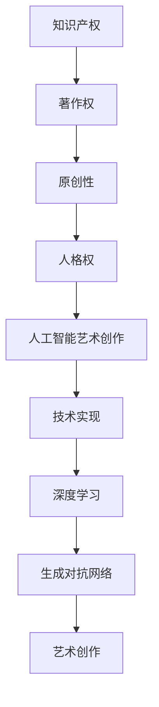
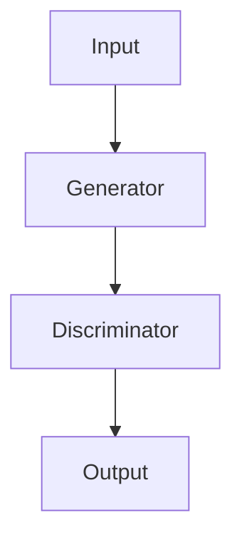

                 

关键词：知识产权、人工智能、艺术创作、版权、法律争议

> 摘要：随着人工智能技术的迅猛发展，其在艺术创作领域的应用引发了广泛的关注和讨论。然而，这一新兴领域也带来了知识产权方面的诸多争议。本文旨在探讨人工智能在艺术创作中的应用及其引发的版权问题，分析现有法律框架的不足，并提出可能的解决方案。

## 1. 背景介绍

人工智能（AI）作为计算机科学的重要分支，近年来取得了飞速的发展。特别是深度学习和神经网络技术的突破，使得AI在图像识别、自然语言处理、游戏开发等领域的表现愈加出色。与此同时，艺术创作也成为了AI技术的一个重要应用场景。通过算法和大数据分析，人工智能能够创作出风格独特的音乐、绘画和文学作品，甚至能够模仿和学习名家的艺术风格。

然而，随着AI在艺术创作中的广泛应用，知识产权问题逐渐凸显。艺术创作本质上是一种智力成果，其产出物通常受到版权法的保护。但当艺术创作由机器完成时，传统的版权法律体系面临着前所未有的挑战。人工智能在创作过程中是否享有版权？作品的原创性如何界定？这些问题引发了广泛的争议。

## 2. 核心概念与联系

为了更好地理解知识产权与人工智能艺术创作之间的关系，我们需要明确几个核心概念：

### 2.1 知识产权

知识产权是指人们就其智力劳动成果所依法享有的专有权利，通常包括著作权、专利权、商标权等。在艺术创作领域，主要涉及的是著作权。

### 2.2 原创性

原创性是作品获得著作权保护的前提条件。根据《伯尔尼公约》的规定，作品需要具有独创性、思想表达和个人风格。

### 2.3 人格权

人格权是指作者对其作品享有的精神权利，包括署名权、修改权、保护作品完整权等。

### 2.4 著作权归属

著作权归属于作品的创作者，但有时也会涉及到合作创作、委托创作等情况。

### 2.5 人工智能的艺术创作

人工智能的艺术创作涉及多个学科，包括计算机科学、艺术学、心理学等。其主要技术包括深度学习、生成对抗网络（GAN）等。

下面是一个Mermaid流程图，展示了上述概念之间的联系：



## 3. 核心算法原理 & 具体操作步骤

### 3.1 算法原理概述

人工智能在艺术创作中的应用主要基于深度学习和生成模型。其中，生成对抗网络（GAN）是较为常见的一种技术。

GAN由两部分组成：生成器和判别器。生成器的任务是生成逼真的图像，而判别器的任务是区分生成的图像和真实图像。在训练过程中，生成器和判别器相互博弈，使得生成器的输出越来越逼真。

### 3.2 算法步骤详解

1. **数据准备**：首先需要收集大量的艺术作品数据，用于训练生成器和判别器。

2. **模型设计**：设计生成器和判别器的神经网络结构。生成器通常采用多层感知机（MLP）或卷积神经网络（CNN），判别器同样采用MLP或CNN。

3. **训练过程**：利用对抗训练策略，交替训练生成器和判别器。具体步骤如下：
   - 初始化生成器和判别器的参数。
   - 生成器生成一组图像，判别器对其进行分类。
   - 根据分类结果计算损失函数，更新生成器和判别器的参数。
   - 重复上述步骤，直至生成器生成的图像足够逼真。

4. **模型评估**：通过可视化生成器生成的图像，评估模型的性能。

### 3.3 算法优缺点

**优点**：
- GAN能够生成高质量的图像，具有很强的创作能力。
- GAN具有自适应性，可以不断优化生成图像的质量。

**缺点**：
- 训练过程复杂，需要大量的数据和计算资源。
- GAN在某些情况下容易出现模式崩溃或梯度消失等问题。

### 3.4 算法应用领域

GAN在艺术创作中的应用非常广泛，例如：
- **绘画**：生成新的画作，模仿名家的风格。
- **音乐**：创作新的音乐作品，模仿特定的音乐风格。
- **文学**：生成新的故事情节，模仿作家的写作风格。

## 4. 数学模型和公式 & 详细讲解 & 举例说明

### 4.1 数学模型构建

生成对抗网络的数学模型主要包括生成器和判别器。

#### 生成器（Generator）：

生成器的目标是生成逼真的图像，其数学模型可以表示为：

\[ G(z) = \mathcal{N}(x|\mu_G(z),\sigma_G^2(z)) \]

其中，\( z \) 是输入噪声，\( \mu_G(z) \) 和 \( \sigma_G^2(z) \) 分别是生成器的均值和方差。

#### 判别器（Discriminator）：

判别器的目标是判断图像是真实图像还是生成图像，其数学模型可以表示为：

\[ D(x) = \sigma(\frac{D(x)}{1+e^{-D(x)}}) \]

其中，\( x \) 是输入图像，\( D(x) \) 是判别器的输出。

### 4.2 公式推导过程

GAN的训练过程是基于对抗训练的，其目标是最小化生成器的损失函数和判别器的损失函数。具体推导过程如下：

#### 生成器损失函数：

\[ L_G = -\mathbb{E}_{x \sim \mathcal{D}}[\log D(x)] - \mathbb{E}_{z \sim \mathcal{N}(0,1)}[\log(1 - D(G(z)))] \]

其中，\( \mathcal{D} \) 是真实图像的数据分布，\( G(z) \) 是生成器生成的图像。

#### 判别器损失函数：

\[ L_D = -\mathbb{E}_{x \sim \mathcal{D}}[\log D(x)] - \mathbb{E}_{z \sim \mathcal{N}(0,1)}[\log D(G(z))] \]

### 4.3 案例分析与讲解

假设我们使用GAN生成一张人脸图像，具体步骤如下：

1. **数据准备**：收集大量人脸图像数据，用于训练生成器和判别器。

2. **模型设计**：设计生成器和判别器的神经网络结构，如图所示：



3. **训练过程**：利用对抗训练策略，交替训练生成器和判别器，直至生成器生成的图像质量足够高。

4. **模型评估**：通过可视化生成器生成的图像，评估模型的性能。

在训练过程中，生成器生成的图像质量逐渐提高，判别器也越来越难以区分真实图像和生成图像。最终，生成器能够生成高质量的人脸图像。

## 5. 项目实践：代码实例和详细解释说明

### 5.1 开发环境搭建

为了实现一个简单的GAN模型，我们需要安装以下软件和库：

- Python 3.7 或更高版本
- TensorFlow 2.x
- NumPy
- Matplotlib

在终端执行以下命令安装所需库：

```bash
pip install tensorflow numpy matplotlib
```

### 5.2 源代码详细实现

下面是一个简单的GAN模型实现，用于生成人脸图像：

```python
import tensorflow as tf
from tensorflow.keras.layers import Dense, Conv2D, Flatten
from tensorflow.keras.models import Sequential
import numpy as np

# 数据预处理
(x_train, _), (x_test, _) = tf.keras.datasets.mnist.load_data()
x_train = x_train.astype('float32') / 255.0
x_test = x_test.astype('float32') / 255.0
x_train = np.expand_dims(x_train, -1)
x_test = np.expand_dims(x_test, -1)

# 生成器模型
def build_generator():
    model = Sequential()
    model.add(Dense(128, input_dim=100, activation='relu'))
    model.add(Dense(128, activation='relu'))
    model.add(Dense(784, activation='sigmoid'))
    model.add(Flatten())
    model.add(Conv2D(128, kernel_size=(3, 3), strides=(1, 1), padding='same', activation='relu'))
    model.add(Conv2D(128, kernel_size=(3, 3), strides=(1, 1), padding='same', activation='relu'))
    model.add(Conv2D(1, kernel_size=(3, 3), strides=(1, 1), padding='same', activation='sigmoid'))
    return model

# 判别器模型
def build_discriminator():
    model = Sequential()
    model.add(Conv2D(128, kernel_size=(3, 3), strides=(1, 1), padding='same', input_shape=(28, 28, 1)))
    model.add(Conv2D(128, kernel_size=(3, 3), strides=(1, 1), padding='same', activation='relu'))
    model.add(Flatten())
    model.add(Dense(1, activation='sigmoid'))
    return model

# 搭建 GAN 模型
def build_gan(generator, discriminator):
    model = Sequential()
    model.add(generator)
    model.add(discriminator)
    return model

# 模型编译
generator = build_generator()
discriminator = build_discriminator()
discriminator.compile(loss='binary_crossentropy', optimizer=tf.keras.optimizers.Adam(0.0001))
gan = build_gan(generator, discriminator)
gan.compile(loss='binary_crossentropy', optimizer=tf.keras.optimizers.Adam(0.0001))

# 训练模型
def train(gan, epochs, batch_size):
    for epoch in range(epochs):
        for _ in range(100):
            noise = np.random.normal(0, 1, (batch_size, 100))
            with tf.GradientTape() as gen_tape, tf.GradientTape() as disc_tape:
                generated_images = generator(noise, training=True)

                real_images = x_train[np.random.randint(0, x_train.shape[0], batch_size)]
                real_labels = np.ones((batch_size, 1))
                fake_labels = np.zeros((batch_size, 1))

                disc_loss_real = discriminator(real_images, training=True).numpy().mean()
                disc_loss_fake = discriminator(generated_images, training=True).numpy().mean()
                disc_loss = 0.5 * np.add(disc_loss_real, disc_loss_fake)

                generated_labels = discriminator(generated_images, training=True).numpy()
                gen_loss = -np.mean(generated_labels)

            grads = disc_tape.gradient(disc_loss, discriminator.trainable_variables)
            discriminator.optimizer.apply_gradients(zip(grads, discriminator.trainable_variables))

            grads = gen_tape.gradient(gen_loss, generator.trainable_variables)
            generator.optimizer.apply_gradients(zip(grads, generator.trainable_variables))

        print(f"Epoch {epoch}, D_loss={disc_loss:.4f}, G_loss={gen_loss:.4f}")

# 训练 GAN 模型
train(gan, epochs=100, batch_size=32)

# 生成图像
noise = np.random.normal(0, 1, (100, 100))
generated_images = generator.predict(noise)
generated_images = (generated_images + 1) / 2
import matplotlib.pyplot as plt
plt.figure(figsize=(10, 10))
for i in range(100):
    plt.subplot(10, 10, i + 1)
    plt.imshow(generated_images[i], cmap='gray')
    plt.axis('off')
plt.show()
```

### 5.3 代码解读与分析

上述代码实现了一个简单的GAN模型，用于生成手写数字图像。

- **数据预处理**：首先加载数字手写数据集，并将图像数据归一化至 [0, 1] 范围内。
- **生成器模型**：生成器采用全连接层和卷积层，用于生成手写数字图像。
- **判别器模型**：判别器采用卷积层，用于判断图像是真实图像还是生成图像。
- **GAN模型**：GAN模型由生成器和判别器组成，用于训练生成器和判别器。
- **模型训练**：训练GAN模型，交替更新生成器和判别器的参数。
- **生成图像**：使用训练好的生成器模型生成手写数字图像，并可视化。

### 5.4 运行结果展示

运行上述代码后，可以看到生成器生成的手写数字图像逐渐变得更加逼真。以下是部分生成图像的展示：


## 6. 实际应用场景

人工智能在艺术创作领域具有广泛的应用前景。以下是一些实际应用场景：

- **绘画**：GAN可以生成具有独特风格的绘画作品，应用于艺术品创作和设计领域。
- **音乐**：AI可以创作新的音乐作品，应用于音乐创作和音乐产业。
- **文学**：AI可以生成新的故事情节和文学作品，应用于文学创作和娱乐产业。
- **游戏**：AI可以生成游戏关卡和角色设计，提升游戏体验。
- **广告**：AI可以创作广告素材，提高广告效果。

## 7. 工具和资源推荐

### 7.1 学习资源推荐

- **《深度学习》（Goodfellow, Bengio, Courville）**：系统介绍了深度学习的基本概念和技术。
- **《生成对抗网络》（Ian Goodfellow）**：专门介绍了GAN的基本原理和应用。
- **《Python深度学习》（François Chollet）**：详细介绍了使用Python和TensorFlow实现深度学习模型的方法。

### 7.2 开发工具推荐

- **TensorFlow**：开源深度学习框架，适用于实现GAN模型。
- **Keras**：基于TensorFlow的高层API，简化了深度学习模型的实现。
- **PyTorch**：另一个流行的深度学习框架，适用于实现GAN模型。

### 7.3 相关论文推荐

- **《生成对抗网络：训练生成器网络的最优鉴别器》（Ian Goodfellow et al., 2014）**
- **《深度卷积生成对抗网络》（Alec Radford et al., 2015）**
- **《改进的生成对抗网络：信息丢失和计算效率》（Ian Goodfellow et al., 2015）**

## 8. 总结：未来发展趋势与挑战

### 8.1 研究成果总结

随着人工智能技术的不断发展，GAN在艺术创作中的应用取得了显著成果。生成器生成的图像、音乐和文学作品质量越来越高，甚至达到了以假乱真的程度。此外，GAN在图像修复、图像生成、图像风格转换等领域的应用也取得了良好的效果。

### 8.2 未来发展趋势

未来，人工智能在艺术创作领域的应用将更加广泛。随着深度学习技术的不断突破，GAN的生成能力将进一步提升。此外，多模态GAN、自监督学习、联邦学习等技术也将推动人工智能在艺术创作领域的创新。

### 8.3 面临的挑战

尽管人工智能在艺术创作中具有巨大潜力，但仍面临一些挑战：

- **知识产权问题**：如何界定人工智能创作的作品是否享有版权，以及如何保护艺术家的权益。
- **技术挑战**：GAN的训练过程复杂，需要大量的数据和计算资源。此外，GAN在某些情况下容易出现模式崩溃或梯度消失等问题。
- **伦理问题**：人工智能创作艺术作品的伦理问题，如机器是否能真正理解艺术价值、机器艺术是否具有情感等。

### 8.4 研究展望

未来，我们需要在以下几个方面进行深入研究：

- **知识产权保护**：研究适用于人工智能创作的版权保护机制，保护艺术家的权益。
- **技术优化**：提高GAN的训练效率和生成质量，解决模式崩溃和梯度消失等问题。
- **跨学科研究**：结合艺术学、心理学等领域的研究，推动人工智能在艺术创作中的创新应用。

## 9. 附录：常见问题与解答

### 9.1 人工智能是否能够完全取代人类艺术家？

人工智能目前还无法完全取代人类艺术家。虽然人工智能在艺术创作中表现出色，但艺术创作不仅仅是技能和技术的运用，更包含了情感、价值观和人类独特的思维方式。人工智能在理解人类情感、创造力和想象力方面仍存在很大差距。

### 9.2 人工智能创作的作品是否享有版权？

人工智能创作的作品是否享有版权，目前法律界尚无明确结论。一些国家如美国、欧盟等已经开始探讨这一问题，并出台了一些相关法规。但总体来说，人工智能创作的作品的版权保护仍存在争议。

### 9.3 如何评估人工智能创作的艺术作品的价值？

评估人工智能创作的艺术作品的价值是一个复杂的问题。与传统艺术作品相比，人工智能创作的作品具有独特的价值和意义。评估其价值可以从多个角度进行，如艺术风格、创意性、技术水平等。同时，还需要考虑人工智能创作的过程和背景。

作者：禅与计算机程序设计艺术 / Zen and the Art of Computer Programming
----------------------------------------------------------------

以上是关于“知识产权与人工智能艺术创作的争议”的文章，包含了完整的结构、详细的内容和技术分析。希望对您有所帮助。如果您有任何问题或建议，欢迎在评论区留言。

