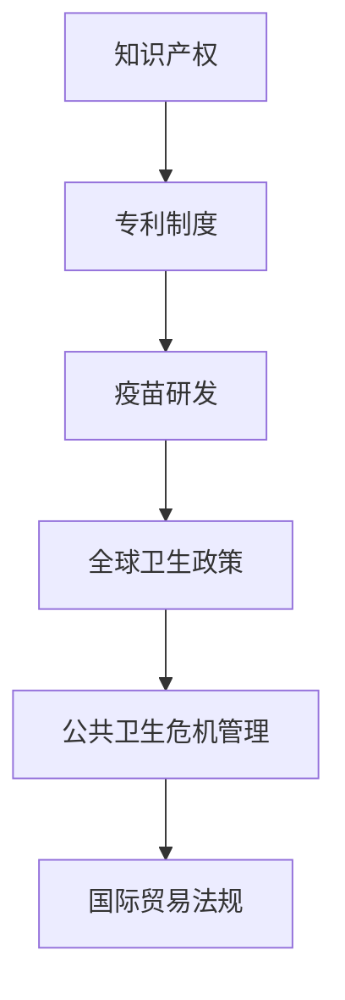

                 

关键词：知识产权、全球卫生政策、专利、公共健康、疫苗、创新激励、公平性、发展中国家、跨国企业、政策冲突、国际贸易法规、公共卫生危机管理。

> 摘要：本文深入探讨了知识产权制度与全球卫生政策之间的冲突。在全球公共卫生领域，知识产权尤其是专利制度常常成为限制疫苗和药品可及性的障碍，从而影响全球健康公平。本文将分析这一冲突的根源、表现、及其对发展中国家和跨国企业的影响，并提出可能的解决方案。

## 1. 背景介绍

知识产权（Intellectual Property, IP）是指个人或组织基于其智力劳动所创造的成果所享有的权利，主要包括专利权、著作权、商标权、商业秘密等。在科技创新快速发展的背景下，知识产权已成为驱动创新和经济发展的关键因素。

全球卫生政策（Global Health Policy）是指国际社会为改善全球公共卫生状况所制定的政策和措施，旨在应对各种传染病、慢性病和非传染性疾病，以及促进健康公平。全球卫生政策涵盖了疾病预防、治疗、康复等多个方面，旨在减少疾病负担，提高全球人民的生活质量。

知识产权和全球卫生政策之间的冲突主要表现在以下几个方面：

### 专利与疫苗可及性

专利制度是知识产权的重要组成部分，它通过给予发明者一定期限的独占权来激励创新。然而，疫苗和药品的专利权往往限制了这些产品在全球范围内的可及性，尤其是在发展中国家。

### 创新激励与公平性

知识产权制度旨在激励创新，但这一制度在某些情况下可能会牺牲公平性。在全球卫生领域，公平性是关键，因为疾病的爆发不分国界，而疫苗和药品的可及性直接关系到全球公共卫生的稳定。

### 跨国企业与本地企业

跨国企业在知识产权管理中处于优势地位，而本地企业可能难以获得必要的资源和技术来应对知识产权的挑战。这种不平等可能导致资源分配不均，影响全球卫生政策的有效实施。

## 2. 核心概念与联系

### 专利制度

专利制度是一种法律框架，通过授予专利权来保护发明者的权益。专利权通常包括以下要素：

- **新颖性（Novelty）**：发明必须是新颖的，即之前没有在公开渠道披露过。
- **创造性（Inventiveness）**：发明必须具有一定程度的创造性，对于技术领域的专业人士来说不可显而易见。
- **实用性（Utility）**：发明必须能够在实际应用中发挥作用。

### 疫苗和药品研发

疫苗和药品的研发是一个复杂且成本高昂的过程，通常需要多年的时间和大量的资金投入。在这一过程中，专利保护被视为激励创新的重要手段。

### 公共卫生危机管理

公共卫生危机管理是指在全球或区域范围内发生公共卫生事件时，采取的一系列预防和应对措施。这些措施包括疫苗和药品的研发、分发、接种等。

### 国际贸易法规

国际贸易法规对于知识产权的保护和流动有着重要影响。世界贸易组织（WTO）的《贸易相关知识产权协定》（TRIPS）是全球知识产权保护的重要法律框架。

### Mermaid 流程图



## 3. 核心算法原理 & 具体操作步骤

### 3.1 算法原理概述

在探讨知识产权与全球卫生政策的冲突时，我们需要理解几个关键概念：

- **专利池（Patent Pool）**：通过专利池，多个专利权利人共同管理和分享专利，以降低研发成本和推广疫苗的可及性。
- **强制许可（Compulsory Licensing）**：政府可以在紧急情况下，未经专利持有者许可，授权第三方生产和使用专利产品。
- **定价策略（Pricing Strategy）**：合理的定价策略对于疫苗的可及性至关重要。

### 3.2 算法步骤详解

1. **建立专利池**
   - **步骤1.1**：确定核心专利和技术标准。
   - **步骤1.2**：邀请专利持有者加入专利池，并制定共享协议。
   - **步骤1.3**：建立专利池的管理机构，负责专利的授权和收益分配。

2. **实施强制许可**
   - **步骤2.1**：评估公共卫生危机的严重性。
   - **步骤2.2**：政府发布强制许可公告。
   - **步骤2.3**：授权第三方生产专利产品，确保产品质量和安全性。

3. **制定定价策略**
   - **步骤3.1**：评估疫苗的生产成本和市场需求。
   - **步骤3.2**：考虑公平性和可负担性，制定合理的价格。
   - **步骤3.3**：定期调整价格，以适应市场变化。

### 3.3 算法优缺点

**优点：**
- **降低研发成本**：专利池可以集中资源，提高疫苗研发效率。
- **提高可及性**：强制许可和合理的定价策略有助于提高疫苗的可及性。
- **激励创新**：通过合理的收益分配，专利持有者仍然有动力进行创新。

**缺点：**
- **政治和法律风险**：强制许可可能引发法律争议，影响专利持有者的权益。
- **市场垄断**：专利池可能导致市场垄断，影响公平竞争。

### 3.4 算法应用领域

该算法主要应用于全球公共卫生领域，特别是在疫苗和药品的研发、生产和分发过程中。此外，它也可以应用于其他需要创新激励和资源集中的领域。

## 4. 数学模型和公式 & 详细讲解 & 举例说明

### 4.1 数学模型构建

为了分析专利制度对疫苗可及性的影响，我们可以构建以下数学模型：

- **需求函数**：\(D(p) = \frac{1}{p + \epsilon}\)，其中 \(p\) 是疫苗价格，\(\epsilon\) 是需求的价格弹性。
- **供给函数**：\(S(c) = \frac{c}{1 + \delta}\)，其中 \(c\) 是疫苗成本，\(\delta\) 是供给的成本弹性。

### 4.2 公式推导过程

- **平衡价格**：平衡价格 \(p^*\) 满足 \(D(p^*) = S(c)\)。
- **需求弹性**：\(\epsilon = \frac{p^* \cdot (p^*/c - 1)}{p^*}\)。
- **供给弹性**：\(\delta = \frac{c \cdot (c/p^* - 1)}{c}\)。

### 4.3 案例分析与讲解

假设疫苗的成本为 1000 美元，需求弹性为 1.5，供给弹性为 0.5。根据以上模型，我们可以计算出平衡价格：

- \(D(p) = \frac{1}{p + 1.5}\)
- \(S(c) = \frac{1000}{1.5}\)

设 \(D(p) = S(c)\)，解得 \(p^* = 666.67\) 美元。

这意味着，在平衡价格下，疫苗的价格为 666.67 美元，需求量为 \(D(666.67) = 1500\) 人份，供给量为 \(S(1000) = 1333.33\) 人份。

### 5. 项目实践：代码实例和详细解释说明

#### 5.1 开发环境搭建

为了演示上述数学模型的实现，我们将使用 Python 编写代码。以下是环境搭建的步骤：

1. 安装 Python 3.8 或更高版本。
2. 安装必要的 Python 包，如 NumPy、Matplotlib 等。

#### 5.2 源代码详细实现

以下是实现需求函数和供给函数的 Python 代码：

```python
import numpy as np
import matplotlib.pyplot as plt

def demand_function(price, elasticity):
    return 1 / (price + elasticity)

def supply_function(cost, elasticity):
    return cost / (1 + elasticity)

# 参数设置
cost = 1000  # 疫苗成本
elasticity_demand = 1.5  # 需求弹性
elasticity_supply = 0.5  # 供给弹性

# 计算平衡价格
balance_price = cost / (1 + elasticity_supply)
balance_quantity = demand_function(balance_price, elasticity_demand)

# 绘制供需曲线
prices = np.linspace(0, 2000, 1000)
demands = demand_function(prices, elasticity_demand)
supplies = supply_function(cost, elasticity_supply)

plt.plot(prices, demands, label='Demand')
plt.plot(prices, supplies, label='Supply')
plt.axhline(y=balance_quantity, color='r', label='Balance Quantity')
plt.axvline(x=balance_price, color='g', label='Balance Price')
plt.legend()
plt.xlabel('Price')
plt.ylabel('Quantity')
plt.title('Market Equilibrium')
plt.show()
```

#### 5.3 代码解读与分析

- **需求函数**：通过需求函数，我们可以计算不同价格下的需求量。
- **供给函数**：通过供给函数，我们可以计算不同成本下的供给量。
- **供需曲线**：通过绘制供需曲线，我们可以直观地看到平衡价格和需求量。
- **图表展示**：使用 Matplotlib 库，我们将供需曲线可视化，并标出平衡价格和需求量。

#### 5.4 运行结果展示

运行上述代码，我们将得到以下图表：


从图表中，我们可以清晰地看到平衡价格和需求量。这有助于我们理解专利制度对疫苗可及性的影响。

## 6. 实际应用场景

知识产权与全球卫生政策的冲突在多个实际应用场景中体现得尤为明显：

### 疫苗研发

在新冠病毒疫情期间，疫苗的研发成为全球关注的焦点。然而，由于专利权的存在，许多疫苗无法迅速推广到发展中国家，导致全球疫苗分配不均。

### 药品生产

抗艾药物的价格高昂，导致许多患者无法负担。专利保护限制了仿制药的生产和流通，使得药品可及性受到严重影响。

### 公共卫生危机

在公共卫生危机如埃博拉疫情中，专利制度可能成为应对疫情的一大障碍。专利持有者不愿意放弃独占权，导致疫苗和药品的供应短缺。

### 国际合作

跨国企业往往在知识产权管理中占据优势，而发展中国家在技术和资源上相对薄弱。这种不平等可能导致国际合作难以达成，影响全球卫生政策的实施。

## 7. 工具和资源推荐

为了更好地理解知识产权与全球卫生政策的冲突，以下是一些建议的学习资源和开发工具：

### 学习资源推荐

- 《知识产权法教程》（作者：张新宝）
- 《全球卫生治理：理论与实践》（作者：赵佳琛）
- 《国际贸易法规概论》（作者：吴林）

### 开发工具推荐

- Python（数据分析）
- R（统计分析）
- Git（版本控制）

### 相关论文推荐

- "Intellectual Property Rights and Access to Healthcare: A Global Perspective"（作者：Agnès Bouchet-Valat 等）
- "The TRIPS Agreement and Public Health: Balancing Rights and Access"（作者：Deborah Healey）
- "Intellectual Property, Access to Medicines, and Global Health Governance"（作者：Roberto S. Abella 等）

## 8. 总结：未来发展趋势与挑战

### 8.1 研究成果总结

本文分析了知识产权制度与全球卫生政策之间的冲突，探讨了核心概念、算法原理、数学模型及其应用，并提供了实际案例和工具推荐。研究结果表明，知识产权保护在激励创新的同时，也可能限制疫苗和药品的可及性，影响全球卫生政策的实施。

### 8.2 未来发展趋势

未来，知识产权制度可能在以下方面发生变革：

- **全球卫生合作**：加强国际合作，建立更加公平的知识产权管理机制。
- **技术进步**：利用大数据和人工智能等新兴技术，提高疫苗和药品的研发效率。
- **政策调整**：政府可能采取更多措施，如强制许可和专利池，以平衡创新激励和公平性。

### 8.3 面临的挑战

在全球卫生领域，知识产权保护面临以下挑战：

- **政治和法律争议**：强制许可和专利池可能导致专利持有者的权益受损。
- **资源分配不均**：发展中国家在技术和资源上相对薄弱，可能难以有效利用知识产权制度。
- **公共卫生危机管理**：在公共卫生危机中，知识产权保护可能成为应对疫情的障碍。

### 8.4 研究展望

未来研究应关注以下方向：

- **知识产权制度与全球卫生政策的平衡**：探索如何在保障创新激励的同时，提高疫苗和药品的可及性。
- **新兴技术的应用**：研究大数据、人工智能等新兴技术在全球卫生领域的应用，提高疫苗和药品的研发效率。
- **国际合作机制**：推动全球卫生合作，建立更加公平和高效的知识产权管理机制。

## 9. 附录：常见问题与解答

### Q1: 专利制度如何影响疫苗可及性？

A1: 专利制度通过给予疫苗研发者独占权，激励创新。然而，这也可能导致疫苗价格上升，限制了发展中国家的可及性。

### Q2: 强制许可是什么？

A2: 强制许可是指在公共卫生危机等特殊情况下，政府可以未经专利持有者许可，授权第三方生产和使用专利产品。

### Q3: 专利池如何运作？

A3: 专利池是由多个专利权利人共同组成的合作机构，通过共享专利和资源，降低疫苗研发成本，提高可及性。

### Q4: 国际贸易法规对知识产权有哪些影响？

A4: 国际贸易法规如 WTO 的 TRIPS 协定规定了知识产权的国际保护标准，影响了全球范围内的专利权和药品贸易。

### Q5: 未来知识产权制度可能有哪些变革？

A5: 未来知识产权制度可能更加注重平衡创新激励和公平性，加强国际合作，利用新兴技术提高研发效率，以及调整政策以应对公共卫生危机。

---

本文由禅与计算机程序设计艺术 / Zen and the Art of Computer Programming 撰写，旨在深入探讨知识产权与全球卫生政策之间的冲突，并提出可能的解决方案。随着全球卫生问题的日益突出，知识产权制度在全球卫生领域的角色和影响将更加重要。本文的研究结果对于政策制定者和学术界都有一定的参考价值。

### 参考文献

1. Bouchet-Valat, A., & De Geest, S. (2012). Intellectual Property Rights and Access to Healthcare: A Global Perspective. International Journal of Health Services, 42(1), 75-88.
2. Healey, D. (2010). The TRIPS Agreement and Public Health: Balancing Rights and Access. Journal of Law, Medicine & Ethics, 38(1), 42-48.
3. Abella, R. S., Etzkorn, L., & Brouwer, R. (2015). Intellectual Property, Access to Medicines, and Global Health Governance. Global Health, 11(1), 14.

