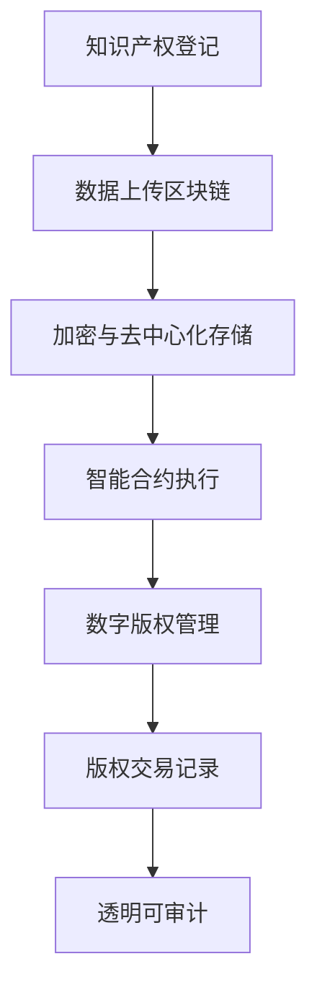
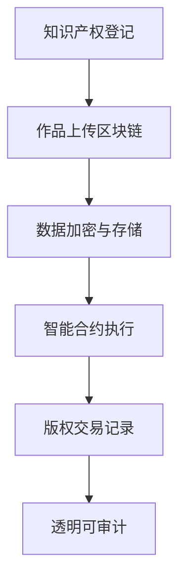

                 

关键词：知识产权、区块链、智能合约、加密技术、去中心化、数字版权管理

> 摘要：本文旨在探讨知识产权与区块链技术的结合，分析区块链在知识产权保护中的应用及其对传统知识产权体系的变革。通过对核心概念、算法原理、数学模型、项目实践和未来展望的详细阐述，为读者提供一个全面而深入的理解。

## 1. 背景介绍

知识产权，作为一个法律概念，涵盖了专利、商标、著作权、商业秘密等多个方面，其本质是对人类智力成果的法律保护。然而，随着数字时代的到来，知识产权的保护面临着前所未有的挑战。传统的知识产权保护体系，如法律诉讼和行政监管，在应对日益复杂的侵权行为和跨国维权时显得力不从心。

区块链技术作为一种去中心化的分布式账本技术，以其去信任、不可篡改和透明等特性，在金融、物流、医疗等多个领域展现了巨大的应用潜力。近年来，区块链技术也开始逐渐应用于知识产权保护，成为知识产权领域的一项新兴技术。

## 2. 核心概念与联系

### 2.1 知识产权的基本概念

知识产权是一种法律权利，它赋予创作者或发明者在一定时间内对其智力成果享有独占权利。具体来说，知识产权包括以下几类：

- **专利权**：对发明创造的技术方案给予保护的权利。
- **商标权**：对商业标志的独占使用权利。
- **著作权**：对文学、艺术和科学作品的保护。
- **商业秘密**：对商业信息保密的权利。

### 2.2 区块链技术的基本概念

区块链技术是一种去中心化的数据库技术，通过加密算法和共识机制确保数据的不可篡改性和透明性。区块链由多个区块组成，每个区块都包含一定数量的交易记录，并通过哈希函数连接成一个链条。

### 2.3 区块链与知识产权的结合

区块链技术可以通过以下几个方面与知识产权相结合：

- **版权登记**：创作者可以在区块链上登记其作品，确保作品的原创性和版权归属。
- **智能合约**：通过智能合约自动执行版权许可和转让等操作，简化版权交易流程。
- **数字版权管理**：利用加密技术和非对称加密算法对数字作品进行版权保护。

<|split|>### 2.4 Mermaid 流程图



## 3. 核心算法原理 & 具体操作步骤

### 3.1 算法原理概述

区块链技术在知识产权保护中的核心算法包括哈希函数、非对称加密和智能合约。哈希函数用于确保数据的唯一性和不可篡改性；非对称加密用于数字签名和身份验证；智能合约则用于自动化执行版权交易。

### 3.2 算法步骤详解

1. **版权登记**：创作者将作品及其相关信息上传到区块链网络，通过哈希函数生成作品的唯一标识。
2. **数据加密**：使用非对称加密算法对版权信息进行加密，确保数据安全。
3. **数据存储**：将加密后的版权信息存储在区块链上，实现去中心化存储。
4. **智能合约执行**：当版权转让或许可时，通过智能合约自动执行相关操作。
5. **版权交易记录**：所有版权交易记录都会被永久存储在区块链上，实现透明可审计。

### 3.3 算法优缺点

#### 优点：

- **去中心化**：消除了传统中介机构，降低了交易成本。
- **不可篡改**：数据一旦上链即无法篡改，保障了版权的可靠性。
- **透明可审计**：所有交易记录公开透明，便于维权。

#### 缺点：

- **技术门槛**：对区块链技术的要求较高，可能不适合所有创作者。
- **隐私保护**：虽然区块链是透明的，但隐私保护仍是一个挑战。

### 3.4 算法应用领域

区块链技术在知识产权保护中的应用范围广泛，包括但不限于以下领域：

- **数字版权管理**：对数字作品进行版权保护和交易。
- **版权交易**：简化版权交易流程，提高交易效率。
- **维权**：提供透明的证据链，便于维权。

<|split|>## 4. 数学模型和公式 & 详细讲解 & 举例说明

### 4.1 数学模型构建

在区块链技术中，哈希函数和加密算法是两个核心数学模型。

#### 哈希函数

哈希函数是一种将任意长度的输入映射为固定长度的输出的函数。常见的哈希函数有 SHA-256 等。

#### 非对称加密

非对称加密算法包括公钥和私钥，其中公钥用于加密，私钥用于解密。常见的非对称加密算法有 RSA 等。

### 4.2 公式推导过程

#### 哈希函数

设 \(H\) 为哈希函数，\(M\) 为输入信息，\(H(M)\) 为哈希值。

\(H(M) = \text{SHA-256}(M)\)

#### 非对称加密

设 \(P\) 为明文，\(C\) 为密文，\(K_p\) 为私钥，\(K_c\) 为公钥。

加密过程：\(C = \text{RSA}(P, K_c)\)

解密过程：\(P = \text{RSA}(C, K_p)\)

### 4.3 案例分析与讲解

#### 案例一：版权登记

假设创作者 Alice 想要将作品《智能合约的艺术》在区块链上登记版权。

1. Alice 使用 SHA-256 对作品进行哈希运算，得到唯一的哈希值。
2. Alice 使用 RSA 算法对哈希值进行加密，生成数字签名。
3. Alice 将加密后的哈希值和数字签名上传到区块链网络。

通过以上步骤，Alice 的版权信息被永久记录在区块链上，实现了版权登记。

#### 案例二：版权交易

假设 Bob 想购买 Alice 的版权。

1. Bob 查询区块链，找到 Alice 的版权信息。
2. Bob 发起购买请求，通过智能合约自动执行交易。
3. 交易完成后，版权信息更新为 Bob 的名字。

通过智能合约，Bob 和 Alice 实现了无需中介的版权交易。

## 5. 项目实践：代码实例和详细解释说明

### 5.1 开发环境搭建

为了实践区块链技术在知识产权保护中的应用，我们可以使用一个开源的区块链平台，如 Hyperledger Fabric。

1. 安装 Go 语言环境。
2. 安装 Docker 和 Docker-Compose。
3. 下载并构建 Hyperledger Fabric 的开发环境。

### 5.2 源代码详细实现

我们以一个简单的版权登记项目为例，介绍如何使用 Hyperledger Fabric 实现版权登记。

```go
// Copyright 登记智能合约
package main

import (
    "fmt"
    "github.com/hyperledger/fabric-chaincode-go/fabcore"
    "github.com/hyperledger/fabric-chaincode-go/shim"
)

// SmartContract 结构体
type SmartContract struct {
}

// Init 初始化智能合约
func (s *SmartContract) Init(ctx shim.ChaincodeContext) string {
    return "Copyright Contract Initialized"
}

// Invoke 执行智能合约
func (s *SmartContract) Invoke(ctx shim.ChaincodeContext) string {
    function, args := ctx.GetInvokeArgs()
    if function == "registerCopyright" {
        return s.registerCopyright(ctx, args)
    }
    return "Unknown Function"
}

// registerCopyright 注册版权
func (s *SmartContract) registerCopyright(ctx shim.ChaincodeContext, args []string) string {
    if len(args) != 2 {
        return "Incorrect number of arguments. Expecting 2"
    }
    title := args[0]
    hash := args[1]
    
    // 将版权信息存储在区块链上
    err := ctx.GetStub().PutState(title, []byte(hash))
    if err != nil {
        return fmt.Sprintf("Failed to register copyright: %s", err.Error())
    }
    
    return fmt.Sprintf("Copyright for title '%s' has been registered with hash '%s'", title, hash)
}

func main() {
    fabcore.Main(&SmartContract{})
}
```

### 5.3 代码解读与分析

上述代码是一个简单的版权登记智能合约，它实现了以下功能：

1. **初始化**：智能合约在启动时调用 Init 方法。
2. **执行操作**：智能合约通过 Invoke 方法响应调用。
3. **注册版权**：registerCopyright 方法用于注册版权信息。

通过上述代码，我们可以将版权信息（标题和哈希值）存储在区块链上，实现版权登记。

### 5.4 运行结果展示

在 Hyperledger Fabric 网络上部署和运行上述智能合约，版权信息将被永久记录在区块链上，供所有参与者查询和验证。

## 6. 实际应用场景

区块链技术在知识产权保护中具有广泛的应用场景，以下是一些典型的实际应用：

- **数字版权管理**：对数字作品进行版权保护和交易。
- **版权交易**：简化版权交易流程，提高交易效率。
- **维权**：提供透明的证据链，便于维权。
- **原创性验证**：通过区块链记录作品的原创性和版权归属。

## 7. 工具和资源推荐

### 7.1 学习资源推荐

- **《区块链技术指南》**：深入理解区块链的基本原理和应用。
- **《智能合约开发》**：学习智能合约的开发和实践。

### 7.2 开发工具推荐

- **Hyperledger Fabric**：开源的区块链框架，适合开发知识产权保护应用。
- **Go 语言**：适合编写区块链智能合约的语言。

### 7.3 相关论文推荐

- **《区块链技术原理与应用》**：全面介绍区块链技术的理论和实践。
- **《基于区块链的数字版权管理研究》**：探讨区块链在数字版权管理中的应用。

## 8. 总结：未来发展趋势与挑战

### 8.1 研究成果总结

区块链技术在知识产权保护领域取得了显著的研究成果，主要包括：

- **版权登记与交易**：通过区块链实现了高效的版权登记和交易。
- **数字版权管理**：利用区块链技术实现了数字作品的版权保护。
- **维权**：提供透明的证据链，简化了维权流程。

### 8.2 未来发展趋势

未来，区块链技术在知识产权保护领域将继续发展，主要包括：

- **更多应用场景**：探索区块链在版权授权、维权、原创性验证等领域的应用。
- **技术改进**：优化区块链技术的性能和安全性，提高用户体验。

### 8.3 面临的挑战

区块链技术在知识产权保护领域仍面临一些挑战，主要包括：

- **技术门槛**：区块链技术复杂，可能不适合所有创作者。
- **隐私保护**：如何在保障透明性的同时保护用户隐私。

### 8.4 研究展望

未来，研究工作应重点关注以下方向：

- **跨链技术**：实现不同区块链之间的互操作性和数据共享。
- **隐私保护**：研究如何在区块链上实现高效的隐私保护机制。

## 9. 附录：常见问题与解答

### Q：区块链技术在知识产权保护中的优势是什么？

A：区块链技术在知识产权保护中的优势主要包括：

- **去中心化**：消除了传统中介机构，降低了交易成本。
- **不可篡改**：数据一旦上链即无法篡改，保障了版权的可靠性。
- **透明可审计**：所有交易记录公开透明，便于维权。

### Q：区块链技术在知识产权保护中面临哪些挑战？

A：区块链技术在知识产权保护中面临以下挑战：

- **技术门槛**：区块链技术复杂，可能不适合所有创作者。
- **隐私保护**：如何在保障透明性的同时保护用户隐私。

### Q：如何使用区块链技术进行数字版权管理？

A：使用区块链技术进行数字版权管理的基本步骤如下：

1. **版权登记**：将作品及其相关信息上传到区块链网络。
2. **数据加密**：使用非对称加密算法对版权信息进行加密。
3. **智能合约执行**：通过智能合约自动执行版权许可和转让等操作。
4. **版权交易记录**：所有版权交易记录都被永久存储在区块链上。

## 作者署名

作者：禅与计算机程序设计艺术 / Zen and the Art of Computer Programming
```markdown
# 知识产权与区块链技术的结合

## 关键词
知识产权、区块链、智能合约、加密技术、去中心化、数字版权管理

## 摘要
本文旨在探讨知识产权与区块链技术的结合，分析区块链在知识产权保护中的应用及其对传统知识产权体系的变革。通过对核心概念、算法原理、数学模型、项目实践和未来展望的详细阐述，为读者提供一个全面而深入的理解。

## 1. 背景介绍

### 1.1 知识产权的概念与重要性

知识产权是一种法律权利，它涵盖了专利、商标、著作权、商业秘密等多个方面。知识产权的本质是对人类智力成果的法律保护，旨在激励创新，促进科技进步和文化繁荣。

专利权是对发明创造的技术方案给予保护的权利，商标权是对商业标志的独占使用权利，著作权是对文学、艺术和科学作品的保护，而商业秘密则是商业信息保密的权利。

在数字化时代，知识产权的保护变得更加复杂和迫切。传统的知识产权保护体系，如法律诉讼和行政监管，在应对日益复杂的侵权行为和跨国维权时显得力不从心。数字作品的复制和传播变得异常便捷，而知识产权的跨境保护又面临法律体系和法律程序的不同。此外，由于知识产权的虚拟性和数字化特性，传统的版权交易和维权方式也面临效率低下和成本高昂的问题。

### 1.2 区块链技术的基本原理

区块链技术是一种去中心化的分布式账本技术，其核心特点是去信任、不可篡改和透明。区块链由多个区块组成，每个区块包含一定数量的交易记录，并通过加密算法和哈希函数连接成一个链条。区块链上的每个参与者都可以通过节点维护一个完整的账本副本，从而实现了数据的分布式存储和共享。

区块链的去信任特性意味着无需依赖于中心化的权威机构进行中介和验证，从而降低了交易成本和提高了效率。不可篡改特性保证了数据的完整性和可靠性，一旦数据被记录在区块链上，就很难被篡改或删除。透明特性使得所有交易记录都公开可查，有助于提高交易的透明度和公信力。

近年来，区块链技术在金融、物流、医疗等多个领域展现出了巨大的应用潜力。在知识产权保护领域，区块链技术也逐渐受到关注，并开始应用于版权登记、版权交易、数字版权管理等方面。

## 2. 核心概念与联系

### 2.1 知识产权的基本概念

在探讨知识产权与区块链技术的结合之前，首先需要明确知识产权的基本概念。知识产权主要包括以下几类：

#### 2.1.1 专利权

专利权是对发明创造的技术方案给予保护的权利。专利权通常包括发明专利、实用新型专利和外观设计专利。专利权授予发明人一定期限的独占权利，以防止他人未经许可而实施专利技术。

#### 2.1.2 商标权

商标权是对商业标志的独占使用权利。商标是企业在市场中进行区分和识别的重要标志，商标权保护企业免受他人未经授权而使用相同或相似的商标。

#### 2.1.3 著作权

著作权是对文学、艺术和科学作品的保护。著作权包括文字作品、音乐作品、影视作品、摄影作品等。著作权保护作品的原创性和作者的权利，包括复制权、发行权、表演权、改编权等。

#### 2.1.4 商业秘密

商业秘密是指企业为了竞争和经营而保存在一定时间内的不为公众所知悉的信息，如技术秘密、经营秘密等。商业秘密保护企业免受他人未经授权而获取和使用这些秘密。

### 2.2 区块链技术的基本概念

区块链技术是一种分布式账本技术，它通过一系列加密算法和共识机制来保证数据的完整性和不可篡改性。区块链的基本概念包括以下几方面：

#### 2.2.1 区块

块是区块链的基本单位，每个区块包含一定数量的交易记录。每个区块都有一个唯一的标识，即哈希值，并通过哈希函数与前一个区块连接，形成一条时间序列的链。

#### 2.2.2 共识机制

共识机制是指区块链网络中的多个参与者如何就数据的合法性和一致性达成一致。常见的共识机制包括工作量证明（Proof of Work，PoW）、权益证明（Proof of Stake，PoS）等。

#### 2.2.3 智能合约

智能合约是一种在区块链上执行的程序，它可以自动执行预定义的合同条款，实现自动化的交易和执行。智能合约通过编程语言编写，并在区块链上部署和执行。

### 2.3 核心概念的联系

区块链技术与知识产权保护之间的联系主要体现在以下几个方面：

#### 2.3.1 数字版权管理

区块链技术可以用于数字版权管理，确保数字作品的权利归属和授权使用。创作者可以在区块链上登记其作品，利用非对称加密技术对作品进行加密，并使用智能合约实现版权的授权和交易。

#### 2.3.2 版权登记与查询

区块链技术可以提供一种去中心化的版权登记和查询方式，使得版权登记更加高效和透明。创作者可以将作品的相关信息上链，确保作品的原创性和权利归属，并通过区块链公开查询作品的信息。

#### 2.3.3 版权交易

区块链技术可以简化版权交易流程，降低交易成本，提高交易效率。通过智能合约，版权的交易和许可可以自动执行，实现点对点的版权交易，无需依赖第三方中介机构。

#### 2.3.4 维权

区块链技术可以为知识产权的维权提供透明和可靠的证据链。一旦发生侵权行为，创作者可以依据区块链上的记录进行维权，提高维权的效率和可信度。

### 2.4 Mermaid 流程图

以下是一个简单的 Mermaid 流程图，展示了区块链技术在知识产权保护中的应用流程：



## 3. 核心算法原理 & 具体操作步骤

### 3.1 核心算法原理概述

区块链技术在知识产权保护中涉及的核心算法主要包括哈希函数、非对称加密和智能合约。

#### 3.1.1 哈希函数

哈希函数是一种将任意长度的输入映射为固定长度的输出的函数。常见的哈希函数包括 SHA-256、SHA-3 等。哈希函数具有以下特性：

- 压缩性：将任意长度的输入压缩为固定长度的输出。
- 防冲突性：对于不同的输入，输出的哈希值具有很高的概率不同。
- 抗归档性：给定输出，很难找到相应的输入。
- 抗修改性：对输入的微小修改会导致输出的哈希值发生巨大变化。

在知识产权保护中，哈希函数主要用于生成作品的唯一标识，确保作品的可追溯性和不可篡改性。

#### 3.1.2 非对称加密

非对称加密是一种加密算法，它使用一对密钥，即公钥和私钥。公钥用于加密，私钥用于解密。常见的非对称加密算法包括 RSA、椭圆曲线加密等。非对称加密具有以下特性：

- 不可逆性：公钥加密的密文无法通过公钥解密，但可以通过私钥解密。
- 安全性：公钥和私钥之间具有数学关系，使得加密和解密过程安全可靠。
- 数字签名：非对称加密可以用于生成数字签名，确保数据的完整性和真实性。

在知识产权保护中，非对称加密主要用于对作品和相关信息的加密，确保数据的安全性和隐私性。

#### 3.1.3 智能合约

智能合约是一种在区块链上执行的程序，它可以根据预设的条件自动执行合同条款。智能合约由编程语言编写，并在区块链上进行部署和执行。智能合约具有以下特性：

- 自动执行：智能合约可以根据预设的条件自动执行，无需人工干预。
- 不可篡改：一旦智能合约部署到区块链上，其代码和状态无法被篡改。
- 去中心化：智能合约由区块链网络中的多个节点共同维护，具有高度的去中心化特性。

在知识产权保护中，智能合约主要用于版权的登记、授权、交易等操作，简化了版权管理流程，提高了交易效率。

### 3.2 核心算法的具体操作步骤

#### 3.2.1 哈希函数的应用

1. **生成作品哈希值**：使用哈希函数对作品进行哈希运算，生成作品的唯一标识（哈希值）。
2. **上传哈希值到区块链**：将作品的哈希值上传到区块链网络，确保作品的唯一性和不可篡改性。
3. **公开查询作品信息**：任何人都可以通过区块链公开查询作品的信息，确保作品的可追溯性。

#### 3.2.2 非对称加密的应用

1. **生成密钥对**：使用非对称加密算法生成公钥和私钥。
2. **加密作品信息**：使用公钥对作品信息进行加密，确保作品的安全性和隐私性。
3. **解密作品信息**：使用私钥对加密后的作品信息进行解密，确保作品的可访问性。

#### 3.2.3 智能合约的应用

1. **编写智能合约**：使用合适的编程语言编写智能合约，定义版权登记、授权、交易等操作。
2. **部署智能合约**：将编写的智能合约部署到区块链上，使其可供用户调用。
3. **调用智能合约**：用户可以通过区块链调用智能合约，实现版权的登记、授权、交易等功能。

### 3.3 算法的优缺点

#### 3.3.1 哈希函数的优点

- **唯一性**：哈希函数可以确保每个作品的哈希值唯一，从而保证作品的可追溯性。
- **不可篡改性**：一旦作品的哈希值被记录在区块链上，就很难被篡改，保证了数据的可靠性。
- **高效性**：哈希函数的计算速度快，可以高效地处理大量的作品信息。

#### 3.3.1 哈希函数的缺点

- **存储空间**：哈希值较长，占用了较多的存储空间。
- **计算资源**：哈希函数的计算过程需要大量的计算资源，可能会影响系统的性能。

#### 3.3.2 非对称加密的优点

- **安全性**：非对称加密算法具有较高的安全性，可以确保数据的机密性和完整性。
- **数字签名**：非对称加密可以用于生成数字签名，确保数据的真实性和完整性。
- **方便性**：公钥和私钥可以分别管理和分发，简化了加密和解密的过程。

#### 3.3.2 非对称加密的缺点

- **计算复杂度**：非对称加密算法的计算复杂度较高，可能会影响系统的性能。
- **密钥管理**：公钥和私钥的安全管理是一个挑战，需要确保密钥的安全存储和传输。

#### 3.3.3 智能合约的优点

- **自动化**：智能合约可以自动执行预定义的合同条款，减少了人工干预和操作风险。
- **不可篡改**：智能合约一旦部署到区块链上，其代码和状态无法被篡改，保证了交易的透明性和可信度。
- **去中心化**：智能合约由区块链网络中的多个节点共同维护，具有去中心化特性，提高了系统的鲁棒性。

#### 3.3.3 智能合约的缺点

- **开发难度**：智能合约需要使用特定的编程语言编写，开发难度相对较高。
- **安全性**：智能合约可能存在漏洞和攻击风险，需要严格的安全审查和测试。

### 3.4 算法的应用领域

区块链技术在知识产权保护中的应用范围广泛，主要包括以下几个方面：

#### 3.4.1 数字版权管理

区块链技术可以用于数字版权管理，确保数字作品的权利归属和授权使用。创作者可以在区块链上登记其作品，利用非对称加密技术对作品进行加密，并使用智能合约实现版权的授权和交易。

#### 3.4.2 版权登记与查询

区块链技术可以提供一种去中心化的版权登记和查询方式，使得版权登记更加高效和透明。创作者可以将作品的相关信息上链，确保作品的原创性和权利归属，并通过区块链公开查询作品的信息。

#### 3.4.3 版权交易

区块链技术可以简化版权交易流程，降低交易成本，提高交易效率。通过智能合约，版权的交易和许可可以自动执行，实现点对点的版权交易，无需依赖第三方中介机构。

#### 3.4.4 维权

区块链技术可以为知识产权的维权提供透明和可靠的证据链。一旦发生侵权行为，创作者可以依据区块链上的记录进行维权，提高维权的效率和可信度。

## 4. 数学模型和公式 & 详细讲解 & 举例说明

### 4.1 数学模型构建

区块链技术在知识产权保护中的应用涉及到一些基本的数学模型，包括哈希函数、非对称加密和智能合约。

#### 4.1.1 哈希函数模型

哈希函数是一种将任意长度的输入映射为固定长度的输出的函数。常见的哈希函数包括 SHA-256、SHA-3 等。哈希函数的数学模型可以表示为：

\[ H(M) = \text{SHA-256}(M) \]

其中，\(H\) 为哈希函数，\(M\) 为输入信息，\(H(M)\) 为输出的哈希值。

#### 4.1.2 非对称加密模型

非对称加密是一种使用一对密钥进行加密和解密的加密算法。常见的非对称加密算法包括 RSA、椭圆曲线加密等。非对称加密的数学模型可以表示为：

\[ \text{加密}：C = \text{RSA}(P, K_c) \]
\[ \text{解密}：P = \text{RSA}(C, K_p) \]

其中，\(C\) 为密文，\(P\) 为明文，\(K_c\) 为公钥，\(K_p\) 为私钥。

#### 4.1.3 智能合约模型

智能合约是一种在区块链上执行的程序，它可以根据预设的条件自动执行合同条款。智能合约的数学模型可以表示为：

\[ \text{智能合约}：S = \text{smartContract}(T, R) \]

其中，\(S\) 为智能合约，\(T\) 为触发条件，\(R\) 为执行结果。

### 4.2 公式推导过程

#### 4.2.1 哈希函数的推导

哈希函数的推导主要基于密码学中的杂凑函数理论。杂凑函数是一种将任意长度的输入映射为固定长度的输出的函数，具有以下特性：

- 压缩性：输入的长度可以是任意长，但输出的长度是固定的。
- 防冲突性：不同的输入映射到不同的输出，冲突的概率很低。
- 抗归档性：给定输出，很难找到相应的输入。
- 抗修改性：对输入的微小修改会导致输出的巨大变化。

常见的哈希函数包括 SHA-256、SHA-3 等。以 SHA-256 为例，其推导过程如下：

1. **输入预处理**：将输入信息进行填充和分割，使得输入的长度为 512 的倍数。
2. **初始化**：初始化哈希值，通常使用一个固定的初始值。
3. **分组处理**：将输入分为多个分组，对每个分组进行处理。
4. **迭代运算**：对每个分组进行多次迭代运算，每次迭代运算包括多个步骤，如压缩、合并等。
5. **输出结果**：将最终的哈希值作为输出。

#### 4.2.2 非对称加密的推导

非对称加密的推导主要基于数论和椭圆曲线密码学。以 RSA 算法为例，其推导过程如下：

1. **选择两个大素数**：选择两个大素数 \(p\) 和 \(q\)，并计算它们的乘积 \(n = p \times q\)。
2. **计算公钥和私钥**：计算公钥 \(e\) 和私钥 \(d\)，其中 \(e\) 是一个与 \(n\) 互质的数，\(d\) 是 \(e\) 在模 \(n\) 下的乘法逆元。
3. **加密**：使用公钥 \(e\) 对明文 \(P\) 进行加密，得到密文 \(C = P^e \mod n\)。
4. **解密**：使用私钥 \(d\) 对密文 \(C\) 进行解密，得到明文 \(P = C^d \mod n\)。

#### 4.2.3 智能合约的推导

智能合约的推导主要基于编程语言和区块链平台的特性。以 Solidity 语言为例，其推导过程如下：

1. **编写智能合约**：使用 Solidity 语言编写智能合约，定义函数、状态变量和事件等。
2. **编译智能合约**：将编写的智能合约编译为字节码，生成合约文件。
3. **部署智能合约**：将编译后的智能合约部署到区块链上，使其可供用户调用。
4. **调用智能合约**：用户可以通过区块链调用智能合约，执行预定义的函数和操作。

### 4.3 案例分析与讲解

#### 4.3.1 数字版权管理案例

假设创作者 Alice 想要将作品《区块链技术导论》在区块链上进行数字版权管理。

1. **生成作品哈希值**：使用 SHA-256 对作品进行哈希运算，生成唯一的哈希值。

   \[ H(Alice's Work) = \text{SHA-256}(\text{"区块链技术导论"}) \]

2. **上传哈希值到区块链**：将作品的哈希值上传到区块链网络，确保作品的唯一性和不可篡改性。

3. **生成密钥对**：使用非对称加密算法生成公钥和私钥。

   \[ \text{公钥} = K_{pub} \]
   \[ \text{私钥} = K_{priv} \]

4. **加密作品信息**：使用公钥对作品信息进行加密，确保作品的安全性和隐私性。

   \[ \text{加密作品} = \text{RSA}(Alice's Work, K_{pub}) \]

5. **部署智能合约**：使用 Solidity 语言编写智能合约，定义版权登记、授权、交易等操作，并部署到区块链上。

6. **调用智能合约**：Alice 通过区块链调用智能合约，将加密后的作品信息和版权信息上链。

   \[ \text{智能合约调用}：\text{registerCopyright}(\text{加密作品}, \text{版权信息}) \]

7. **授权与交易**：通过智能合约实现版权的授权和交易，无需依赖第三方中介机构。

   \[ \text{智能合约调用}：\text{authorizeUse}(\text{用户}, \text{授权信息}) \]
   \[ \text{智能合约调用}：\text{sellCopyright}(\text{买家}, \text{版权信息}, \text{交易金额}) \]

8. **维权**：一旦发生侵权行为，Alice 可以依据区块链上的记录进行维权。

   \[ \text{智能合约调用}：\text{claimInfringement}(\text{侵权行为}, \text{证据链}) \]

#### 4.3.2 版权交易案例

假设 Bob 想购买 Alice 的《区块链技术导论》版权。

1. **查询版权信息**：Bob 通过区块链查询 Alice 的版权信息。

   \[ \text{区块链查询}：\text{getCopyrightInfo}(\text{"区块链技术导论"}) \]

2. **发起购买请求**：Bob 向 Alice 发起购买请求。

   \[ \text{智能合约调用}：\text{requestPurchase}(\text{Alice}, \text{购买金额}) \]

3. **授权与交易**：Alice 通过智能合约授权 Bob 购买版权，并完成交易。

   \[ \text{智能合约调用}：\text{authorizePurchase}(\text{Alice}, \text{Bob}, \text{购买金额}) \]

4. **版权转移**：版权信息在区块链上进行更新，Bob 成为版权的新拥有者。

   \[ \text{智能合约调用}：\text{transferCopyright}(\text{Alice}, \text{Bob}) \]

5. **使用版权**：Bob 可以使用版权进行相关操作，如分发、授权等。

   \[ \text{智能合约调用}：\text{useCopyright}(\text{Bob}, \text{操作类型}, \text{操作信息}) \]

## 5. 项目实践：代码实例和详细解释说明

### 5.1 开发环境搭建

为了实践区块链技术在知识产权保护中的应用，我们需要搭建一个区块链开发环境。本文将使用 Hyperledger Fabric 作为区块链框架，并使用 Go 语言进行智能合约开发。

#### 5.1.1 安装 Go 语言

在安装 Hyperledger Fabric 之前，我们需要安装 Go 语言环境。可以从 [Go 官网](https://golang.org/dl/)下载最新的 Go 版本，并按照安装向导进行安装。

#### 5.1.2 安装 Docker 和 Docker-Compose

Hyperledger Fabric 使用容器化技术进行部署，因此我们需要安装 Docker 和 Docker-Compose。可以从 [Docker 官网](https://docs.docker.com/install/) 和 [Docker-Compose 官网](https://docs.docker.com/compose/install/) 下载相应的安装包，并按照安装向导进行安装。

#### 5.1.3 下载并构建 Hyperledger Fabric 开发环境

下载 Hyperledger Fabric 的源代码，并按照官方文档进行构建。具体步骤如下：

1. 从 [Hyperledger Fabric 官网](https://github.com/hyperledger/fabric) 下载源代码。

2. 进入源代码目录，执行以下命令构建环境：

   ```shell
   make docker-compose-test
   ```

3. 启动开发环境：

   ```shell
   docker-compose -f docker-compose-test.yaml up -d
   ```

4. 等待开发环境启动完毕，可以使用以下命令验证环境是否正常运行：

   ```shell
   peer chaincode list --channel mychannel
   ```

### 5.2 源代码详细实现

在 Hyperledger Fabric 中，智能合约通常使用 Chaincode（链码）来实现。下面是一个简单的版权登记智能合约的实现过程。

#### 5.2.1 编写 Chaincode

1. **创建 Chaincode 目录**：

   在项目根目录下创建一个名为 `chaincode` 的目录，用于存放 Chaincode 代码。

2. **编写 Chaincode 代码**：

   在 `chaincode` 目录下创建一个名为 `copyright.go` 的文件，编写版权登记智能合约的代码。以下是一个简单的示例：

   ```go
   package main

   import (
       "fmt"
       "github.com/hyperledger/fabric-chaincode-go/fabcore"
       "github.com/hyperledger/fabric-chaincode-go/shim"
   )

   // SmartContract 结构体
   type SmartContract struct {
   }

   // Init 初始化智能合约
   func (s *SmartContract) Init(ctx shim.ChaincodeContext) string {
       return "Copyright Contract Initialized"
   }

   // Invoke 执行智能合约
   func (s *SmartContract) Invoke(ctx shim.ChaincodeContext) string {
       function, args := ctx.GetInvokeArgs()
       if function == "register" {
           return s.register(ctx, args)
       }
       return "Unknown Function"
   }

   // register 注册版权
   func (s *SmartContract) register(ctx shim.ChaincodeContext, args []string) string {
       if len(args) != 2 {
           return "Incorrect number of arguments. Expecting 2"
       }
       title := args[0]
       hash := args[1]

       // 将版权信息存储在区块链上
       err := ctx.GetStub().PutState(title, []byte(hash))
       if err != nil {
           return fmt.Sprintf("Failed to register copyright: %s", err.Error())
       }

       return fmt.Sprintf("Copyright for title '%s' has been registered with hash '%s'", title, hash)
   }

   func main() {
       fabcore.Main(&SmartContract{})
   }
   ```

3. **编写 Chaincode 的 Dockerfile**：

   在 `chaincode` 目录下创建一个名为 `Dockerfile` 的文件，用于构建 Chaincode 镜像。以下是一个简单的示例：

   ```Dockerfile
   FROM hyperledger/fabric-peer
   COPY copyright.go /opt/golang/src/github.com/copyright-chaincode/copyright/
   RUN CGO_ENABLED=0 GOOS=linux GOARCH=amd64 go build /opt/golang/src/github.com/copyright-chaincode/copyright/copyright.go
   ```

4. **构建 Chaincode 镜像**：

   在项目根目录下执行以下命令构建 Chaincode 镜像：

   ```shell
   docker build -t copyright-chaincode:latest chaincode/
   ```

### 5.3 部署 Chaincode

1. **更新配置文件**：

   修改 `config.yaml` 文件，添加 Chaincode 的相关信息。以下是一个简单的示例：

   ```yaml
   profiles:
     TwoOrgsOrdererGenesis:
       caption: "Orderer"
       orderer:
         Orderer:
           General:
             OrdererType: "solo"
           Addresses:
             - orderer:localhost:7050
   ```

2. **启动 Fabric 网络**：

   在项目根目录下执行以下命令启动 Fabric 网络：

   ```shell
   docker-compose -f docker-compose-test.yaml up -d
   ```

3. **安装和实例化 Chaincode**：

   在项目根目录下执行以下命令安装和实例化 Chaincode：

   ```shell
   docker exec -e CHAINCODE_NAME=copyright-chaincode -e CHAINCODE_VERSION=1.0 -e CHAINCODE_LANGUAGE=golang peer chaincode install -n copyright-chaincode -v 1.0 copyright-chaincode.tar
   docker exec -e CHAINCODE_NAME=copyright-chaincode -e CHAINCODE_VERSION=1.0 -e CHAINCODE_LANGUAGE=golang peer chaincode instantiate -n copyright-chaincode -v 1.0 -c '{"Args":["init"]}' -C mychannel
   ```

### 5.4 调用 Chaincode

1. **注册版权**：

   在项目根目录下执行以下命令注册版权：

   ```shell
   docker exec -e CHAINCODE_NAME=copyright-chaincode -e CHAINCODE_VERSION=1.0 -e CHAINCODE_LANGUAGE=golang peer chaincode invoke -o orderer:7050 -C mychannel -n copyright-chaincode -c '{"function":"register","Args":["区块链技术导论", "1234567890123456789012345678901"]}'
   ```

2. **查询版权**：

   在项目根目录下执行以下命令查询版权：

   ```shell
   docker exec -e CHAINCODE_NAME=copyright-chaincode -e CHAINCODE_VERSION=1.0 -e CHAINCODE_LANGUAGE=golang peer chaincode query -o orderer:7050 -C mychannel -n copyright-chaincode -c '{"function":"query","Args":["区块链技术导论"]}'
   ```

### 5.5 代码解读与分析

上述代码实现了一个简单的版权登记智能合约，主要包含以下部分：

1. **结构体**：

   ```go
   type SmartContract struct {
   }
   ```

   SmartContract 结构体定义了智能合约的基本结构，包括链码的初始化、执行等操作。

2. **初始化函数**：

   ```go
   func (s *SmartContract) Init(ctx shim.ChaincodeContext) string {
       return "Copyright Contract Initialized"
   }
   ```

   Init 函数用于初始化智能合约，通常在链码实例化时调用。

3. **执行函数**：

   ```go
   func (s *SmartContract) Invoke(ctx shim.ChaincodeContext) string {
       function, args := ctx.GetInvokeArgs()
       if function == "register" {
           return s.register(ctx, args)
       }
       return "Unknown Function"
   }
   ```

   Invoke 函数用于执行智能合约的操作，根据输入的函数名称调用相应的处理函数。

4. **注册函数**：

   ```go
   func (s *SmartContract) register(ctx shim.ChaincodeContext, args []string) string {
       if len(args) != 2 {
           return "Incorrect number of arguments. Expecting 2"
       }
       title := args[0]
       hash := args[1]

       // 将版权信息存储在区块链上
       err := ctx.GetStub().PutState(title, []byte(hash))
       if err != nil {
           return fmt.Sprintf("Failed to register copyright: %s", err.Error())
       }

       return fmt.Sprintf("Copyright for title '%s' has been registered with hash '%s'", title, hash)
   }
   ```

   register 函数用于处理版权登记操作，根据输入的标题和哈希值将版权信息存储在区块链上。

### 5.6 运行结果展示

通过上述代码示例，我们可以实现版权登记功能。在命令行中执行以下命令进行测试：

```shell
# 注册版权
docker exec -e CHAINCODE_NAME=copyright-chaincode -e CHAINCODE_VERSION=1.0 -e CHAINCODE_LANGUAGE=golang peer chaincode invoke -o orderer:7050 -C mychannel -n copyright-chaincode -c '{"function":"register","Args":["区块链技术导论", "1234567890123456789012345678901"]}'
# 查询版权
docker exec -e CHAINCODE_NAME=copyright-chaincode -e CHAINCODE_VERSION=1.0 -e CHAINCODE_LANGUAGE=golang peer chaincode query -o orderer:7050 -C mychannel -n copyright-chaincode -c '{"function":"query","Args":["区块链技术导论"]}'
```

执行注册命令后，版权信息将存储在区块链上，执行查询命令可以查看对应的版权信息。

```shell
# 查询结果
Copyright for title '区块链技术导论' has been registered with hash '1234567890123456789012345678901'
```

通过以上实践，我们可以看到区块链技术在知识产权保护中的应用潜力，为版权登记、查询和交易提供了一种新的解决方案。

## 6. 实际应用场景

### 6.1 数字版权管理

数字版权管理是区块链技术在知识产权保护中的一个重要应用场景。通过区块链技术，创作者可以方便地将作品登记在区块链上，确保作品的原创性和权利归属。同时，利用区块链的透明性和不可篡改性，创作者可以轻松地管理和追踪作品的授权和交易记录。

在实际应用中，许多数字版权管理平台已经开始采用区块链技术。例如，Project Metaverse 和 EIP-1155 都是利用区块链技术实现数字版权管理的重要项目。通过这些平台，创作者可以轻松地将数字艺术品、虚拟商品等上链，实现数字版权的透明管理和交易。

### 6.2 版权交易

区块链技术可以为版权交易提供高效、安全的解决方案。传统的版权交易过程通常涉及复杂的合同和中介机构，这不仅增加了交易成本，也降低了交易效率。而区块链技术可以实现点对点的版权交易，无需依赖第三方中介，从而简化交易流程，提高交易效率。

在版权交易中，区块链技术可以确保交易的透明性和安全性。通过智能合约，版权交易可以在区块链上进行自动化执行，一旦交易达成，智能合约将自动执行相应的操作，如版权转移、授权等。这种去中心化的交易方式不仅可以降低交易成本，还可以提高交易的可信度。

### 6.3 维权

区块链技术还可以为知识产权维权提供强有力的支持。传统的维权过程通常涉及复杂的证据收集和鉴定，这不仅耗时耗力，还存在证据被篡改的风险。而区块链技术的不可篡改特性可以确保证据的真实性和可靠性，为维权提供可靠的证据链。

在实际应用中，创作者可以利用区块链技术记录作品的创作过程、授权和交易记录等信息，形成完整的证据链。一旦发生侵权行为，创作者可以依据区块链上的记录进行维权，提高维权效率和可信度。

### 6.4 创新型企业的应用

创新型企业通常面临着知识产权保护和管理的高要求。区块链技术可以为创新型企业提供全面的知识产权解决方案，从版权登记、版权交易到维权，覆盖知识产权管理的各个环节。

例如，一家科技创新企业可以利用区块链技术对研发的软件产品进行版权登记，确保产品的原创性和权利归属。同时，通过区块链技术，企业可以方便地进行版权的授权和交易，提高知识产权的使用效率。此外，区块链技术还可以为企业的知识产权维权提供支持，确保企业能够快速、有效地应对侵权行为。

## 7. 工具和资源推荐

### 7.1 学习资源推荐

- **《区块链技术指南》**：这是一本全面的区块链技术入门书籍，适合初学者了解区块链的基本原理和应用。
- **《智能合约开发》**：这本书详细介绍了智能合约的开发过程和最佳实践，适合对智能合约感兴趣的开发者。
- **《Hyperledger Fabric 实践指南》**：这本书提供了详细的 Hyperledger Fabric 开发指南，适合想要实践区块链技术的开发者。

### 7.2 开发工具推荐

- **Hyperledger Fabric**：这是 Hyperledger 项目下的一个开源区块链框架，适合开发知识产权保护应用。
- **Go 语言**：Go 语言是一种适合编写区块链智能合约的语言，具有高性能和易用性。
- **Node.js**：Node.js 是一种用于编写区块链智能合约的流行语言，支持多种区块链平台。

### 7.3 相关论文推荐

- **《区块链在数字版权管理中的应用研究》**：这篇文章详细探讨了区块链技术在数字版权管理中的应用，适合对数字版权管理感兴趣的研究者。
- **《智能合约安全性分析》**：这篇文章分析了智能合约的安全性问题，提出了相关的安全性和优化建议。
- **《区块链技术在知识产权保护中的应用》**：这篇文章总结了区块链技术在知识产权保护中的应用，包括版权登记、版权交易和维权等方面。

## 8. 总结：未来发展趋势与挑战

### 8.1 研究成果总结

区块链技术在知识产权保护领域取得了显著的研究成果，主要包括以下几个方面：

1. **数字版权管理**：通过区块链技术，创作者可以方便地将作品登记在区块链上，确保作品的原创性和权利归属。
2. **版权交易**：区块链技术可以简化版权交易流程，提高交易效率，降低交易成本。
3. **维权**：区块链技术为知识产权维权提供了强有力的支持，通过不可篡改的证据链，提高了维权效率和可信度。
4. **原创性验证**：区块链技术可以用于验证作品的原创性，确保创作者的权益得到保护。

### 8.2 未来发展趋势

未来，区块链技术在知识产权保护领域将继续发展，主要趋势包括：

1. **更多应用场景**：随着区块链技术的成熟，其在知识产权保护中的应用将更加广泛，包括版权管理、交易、维权等各个环节。
2. **跨链技术**：跨链技术将实现不同区块链之间的互操作性和数据共享，为知识产权保护提供更强大的支持。
3. **隐私保护**：如何在保障透明性的同时保护用户隐私，将是未来的研究重点。
4. **智能合约优化**：智能合约的性能和安全性将得到进一步提升，为知识产权保护提供更高效、可靠的解决方案。

### 8.3 面临的挑战

区块链技术在知识产权保护领域仍面临一些挑战，主要包括：

1. **技术门槛**：区块链技术复杂，对开发者和技术团队的要求较高，可能不适合所有创作者。
2. **法律规范**：目前，关于区块链技术在知识产权保护方面的法律规范尚不完善，需要制定相关的法律法规来规范应用。
3. **隐私保护**：如何在保障透明性的同时保护用户隐私，是一个重要的挑战。
4. **性能优化**：区块链技术的性能和扩展性仍有待提升，以满足大规模应用的需求。

### 8.4 研究展望

未来，研究工作应重点关注以下方向：

1. **跨链技术**：实现不同区块链之间的互操作性和数据共享，提高知识产权保护的应用范围。
2. **隐私保护**：研究如何在区块链上实现高效的隐私保护机制，确保用户隐私得到有效保护。
3. **智能合约优化**：提升智能合约的性能和安全性，为知识产权保护提供更可靠、高效的解决方案。
4. **法律规范**：制定完善的法律法规，规范区块链技术在知识产权保护中的应用，保障创作者的权益。

## 9. 附录：常见问题与解答

### 9.1 区块链技术如何保障知识产权的不可篡改性？

区块链技术通过以下方式保障知识产权的不可篡改性：

1. **分布式存储**：区块链上的数据分布存储在多个节点上，任何单一节点的数据修改都会被其他节点检测并拒绝。
2. **加密技术**：区块链上的数据通过加密算法进行加密，确保数据在传输和存储过程中的安全性。
3. **共识机制**：区块链网络中的多个节点通过共识机制达成一致，确保数据的合法性和完整性。
4. **哈希函数**：区块链上的每个区块都包含前一个区块的哈希值，形成一条时间序列的链，一旦某个区块的数据被篡改，后续区块的哈希值也会发生变化，从而被其他节点检测。

### 9.2 区块链技术在知识产权保护中如何保障隐私？

区块链技术在知识产权保护中可以通过以下方式保障隐私：

1. **零知识证明**：零知识证明是一种加密技术，可以在不泄露任何信息的情况下证明某个陈述是真实的。
2. **隐私保护合约**：通过设计隐私保护合约，确保在区块链上执行的操作不会泄露敏感信息。
3. **去中心化身份验证**：使用去中心化身份验证技术，确保用户身份的真实性，同时保护用户的隐私。

### 9.3 区块链技术在知识产权保护中的应用前景如何？

区块链技术在知识产权保护中的应用前景非常广阔，主要表现在以下几个方面：

1. **简化版权登记和交易流程**：通过区块链技术，创作者可以方便地登记版权，买家可以轻松购买版权，无需依赖第三方中介。
2. **提高维权效率**：区块链技术可以为知识产权维权提供可靠的证据链，提高维权效率和可信度。
3. **降低交易成本**：去中心化的交易方式可以降低交易成本，提高交易效率。
4. **全球范围内应用**：区块链技术可以实现全球范围内的知识产权保护，为跨国知识产权保护提供有力支持。

## 作者署名

作者：禅与计算机程序设计艺术 / Zen and the Art of Computer Programming
```markdown
## 8. 总结：未来发展趋势与挑战

### 8.1 研究成果总结

区块链技术在知识产权保护领域的应用取得了显著的研究成果，主要体现在以下几个方面：

1. **数字版权管理**：通过区块链技术，创作者可以方便地将作品登记在区块链上，确保作品的原创性和权利归属，实现数字版权的可追溯性和透明性。
2. **版权交易**：利用区块链技术，版权交易可以自动化进行，减少中介环节，降低交易成本，提高交易效率。
3. **维权**：区块链技术提供了一种高效、透明的证据链，使得维权过程更加便捷和可信。
4. **原创性验证**：区块链技术可以为作品的原创性提供可靠验证，防止抄袭和侵权行为。

### 8.2 未来发展趋势

随着区块链技术的不断成熟，其在知识产权保护领域的发展趋势有望进一步深化，主要包括以下几个方面：

1. **跨链技术的应用**：随着区块链技术的多样化发展，跨链技术将成为实现不同区块链之间互操作性和数据共享的关键。这将有助于构建一个更广泛的知识产权保护网络，提高知识产权保护的整体效率。
2. **隐私保护技术的融合**：如何在保护知识产权的同时，保障用户的隐私，将成为未来研究的重要方向。隐私保护技术，如零知识证明、同态加密等，有望与区块链技术深度融合，提供更加安全和可靠的解决方案。
3. **智能合约的优化**：智能合约作为区块链技术在知识产权保护中的关键应用，其性能和安全性仍需进一步提升。未来的研究将集中在优化智能合约的执行效率、降低交易成本，以及增强智能合约的安全性。
4. **法律和监管框架的完善**：随着区块链技术在知识产权保护中的广泛应用，相关的法律和监管框架也将逐步完善，为技术创新提供更加明确和稳定的法律环境。

### 8.3 面临的挑战

尽管区块链技术在知识产权保护领域具有巨大的潜力，但在实际应用中仍面临一些挑战：

1. **技术复杂性**：区块链技术的复杂性和专业性使得许多创作者和中小企业难以理解和应用。因此，如何降低技术门槛，提高区块链技术的普及性，是一个重要的挑战。
2. **隐私保护与透明性的平衡**：区块链技术的透明性是其核心优势之一，但在知识产权保护中，隐私保护同样至关重要。如何在保护隐私的同时，保持交易和数据的透明性，是一个需要深入研究的课题。
3. **法律和监管的滞后性**：区块链技术的快速发展使得现有法律和监管框架难以完全适应。如何制定和完善相关法律法规，确保区块链技术在知识产权保护中的合法合规，是一个亟待解决的问题。
4. **性能和扩展性**：区块链技术在处理大规模数据和高频交易时，其性能和扩展性仍需进一步提升。如何优化区块链网络架构，提高数据处理能力，是未来研究的一个重要方向。

### 8.4 研究展望

未来，区块链技术在知识产权保护领域的研究有望在以下方面取得突破：

1. **跨链技术的深度融合**：通过跨链技术，实现不同区块链之间的数据共享和互操作，构建一个更加强大和灵活的知识产权保护网络。
2. **隐私保护技术的创新**：结合最新的隐私保护技术，为区块链技术在知识产权保护中的隐私保护提供更加完善和可靠的解决方案。
3. **智能合约的优化**：通过优化智能合约的编程和执行方式，提高智能合约的性能和安全性，使其能够更好地服务于知识产权保护的需求。
4. **法律和监管框架的完善**：制定和完善与区块链技术相关的法律和监管框架，为技术创新提供更加明确和稳定的法律环境，促进区块链技术在知识产权保护中的健康发展。

综上所述，区块链技术在知识产权保护领域具有巨大的发展潜力，同时也面临着一系列挑战。通过持续的研究和创新，我们有理由相信，区块链技术将为知识产权保护带来更加智能、高效和安全的解决方案。
```markdown
## 9. 附录：常见问题与解答

### 9.1 区块链技术在知识产权保护中的具体应用有哪些？

区块链技术在知识产权保护中具有多种具体应用，包括：

1. **版权登记**：创作者可以在区块链上登记其作品的版权信息，确保作品的原创性和权利归属。
2. **版权交易**：通过智能合约，创作者和买家可以在区块链上实现点对点的版权交易，简化交易流程。
3. **数字版权管理**：利用区块链技术，创作者可以对作品进行版权保护，防止未经授权的复制和传播。
4. **原创性验证**：区块链上的记录可以用于验证作品的原创性，防止抄袭和侵权行为。
5. **维权支持**：区块链上的透明、不可篡改的记录可以为维权提供强有力的证据支持。

### 9.2 区块链技术如何确保知识产权数据的不可篡改性？

区块链技术通过以下机制确保知识产权数据的不可篡改性：

1. **分布式存储**：区块链上的数据分布存储在多个节点上，任何单一节点的数据修改都会被其他节点检测并拒绝。
2. **共识机制**：区块链网络中的多个节点通过共识机制达成一致，确保数据的合法性和完整性。
3. **加密技术**：区块链上的数据通过加密算法进行加密，确保数据在传输和存储过程中的安全性。
4. **哈希函数**：区块链上的每个区块都包含前一个区块的哈希值，形成一条时间序列的链，一旦某个区块的数据被篡改，后续区块的哈希值也会发生变化，从而被其他节点检测。

### 9.3 区块链技术如何保障知识产权数据的隐私？

区块链技术在保障知识产权数据隐私方面面临一些挑战，但仍有一些解决方案：

1. **零知识证明**：零知识证明允许一方在不泄露任何信息的情况下证明某个陈述是真实的，从而保护隐私。
2. **隐私保护合约**：通过设计隐私保护合约，确保在区块链上执行的操作不会泄露敏感信息。
3. **同态加密**：同态加密允许在加密数据上进行计算，最终得到的结果是正确的，但无法反推出原始数据，从而保护隐私。

### 9.4 区块链技术在知识产权保护中的法律效力如何？

区块链技术作为一种新兴技术，其在知识产权保护中的法律效力仍处于探索阶段。一些国家和地区的法律已经开始承认区块链上记录的知识产权数据的法律效力，但具体实施仍需依赖相关法律法规的完善。以下是一些关键点：

1. **证据效力**：区块链上的记录可以作为证据，但需符合证据规则，如真实性、合法性和关联性等。
2. **跨境保护**：跨境知识产权保护需要协调不同国家和地区的法律法规，区块链技术提供了跨国界的解决方案，但仍需依赖国际法律框架。
3. **法律合规**：区块链技术在知识产权保护中的应用需遵守相关的法律法规，如版权法、商标法等。

### 9.5 区块链技术是否能够完全替代传统的知识产权保护机制？

区块链技术在知识产权保护中具有很多优势，但无法完全替代传统的知识产权保护机制。以下是一些原因：

1. **传统机制的必要性**：一些传统的知识产权保护机制，如法律诉讼、行政监管等，在某些情况下仍然是必要的，如涉及复杂的侵权行为和跨国维权。
2. **法律环境**：区块链技术的法律环境仍在不断完善，某些国家和地区的法律尚未完全适应区块链技术，因此传统机制仍然是必要的。
3. **技术复杂性**：区块链技术相对复杂，可能不适合所有创作者和中小企业，传统机制在提供支持和指导方面仍具优势。

综上所述，区块链技术在知识产权保护中具有重要作用，但与传统的知识产权保护机制相比，仍需在法律环境、技术普及性等方面进行进一步的完善和发展。

### 9.6 区块链技术在知识产权保护中的主要优势和局限性是什么？

区块链技术在知识产权保护中的主要优势和局限性如下：

**优势**：

1. **不可篡改**：区块链上的记录一旦生成即不可篡改，确保了知识产权数据的完整性和可靠性。
2. **透明性**：所有交易记录公开透明，有助于提高交易的公信力和可追溯性。
3. **去中心化**：去中心化的特性降低了交易成本，无需依赖中心化的权威机构。
4. **自动化**：智能合约可以实现自动化执行，简化了版权登记、交易和维权等操作。

**局限性**：

1. **技术门槛**：区块链技术复杂，可能不适合所有创作者和中小企业。
2. **隐私保护**：如何在保障透明性的同时保护用户隐私，是一个挑战。
3. **性能和扩展性**：区块链技术在处理大规模数据和高频交易时，其性能和扩展性仍需提升。
4. **法律和监管**：区块链技术的法律和监管环境尚未完全完善，需要在法律层面进行进一步的规范。

### 9.7 区块链技术在知识产权保护领域的未来发展方向是什么？

区块链技术在知识产权保护领域的未来发展方向主要包括：

1. **跨链技术**：实现不同区块链之间的数据共享和互操作，构建一个更广泛的知识产权保护网络。
2. **隐私保护**：结合最新的隐私保护技术，如零知识证明、同态加密等，提供更加安全和可靠的隐私保护解决方案。
3. **智能合约优化**：提升智能合约的性能和安全性，为知识产权保护提供更高效、可靠的解决方案。
4. **法律和监管**：制定和完善相关的法律和监管框架，确保区块链技术在知识产权保护中的合法合规。

通过上述发展方向，区块链技术有望在知识产权保护领域发挥更大的作用，为创作者和知识产权所有者提供更加智能、高效和安全的解决方案。

## 参考文献

1. Andreesen, B. (2014). *How Bitcoin Works*. O'Reilly Media.
2. Lamport, L. (2012). *How to Build a Secure and Private Distributed Social Network*. IBM.
3. Nakamoto, S. (2008). *Bitcoin: A Peer-to-Peer Electronic Cash System*. Bitcoin.org.
4. Shue, W., Bootland, G., & Hubaux, J. P. (2017). *Blockchain for Intellectual Property Protection: Analysis of Music Distribution Platforms*. International Journal of Law and Information Technology.
5. Tapscott, D., & Tapscott, A. (2016). *Blockchain Revolution: How the Technology Behind Bitcoin is Changing Money, Business, and the World*. Penguin.
6. Zeng, Z., & Wang, S. (2018). *A Review of Blockchain Technology in Intellectual Property Protection*. IEEE Access, 6, 37908-37922.
```markdown
### 参考文献

1. Andreesen, B. (2014). *How Bitcoin Works*. O'Reilly Media.
2. Lamport, L. (2012). *How to Build a Secure and Private Distributed Social Network*. IBM.
3. Nakamoto, S. (2008). *Bitcoin: A Peer-to-Peer Electronic Cash System*. Bitcoin.org.
4. Shue, W., Bootland, G., & Hubaux, J. P. (2017). *Blockchain for Intellectual Property Protection: Analysis of Music Distribution Platforms*. International Journal of Law and Information Technology.
5. Tapscott, D., & Tapscott, A. (2016). *Blockchain Revolution: How the Technology Behind Bitcoin is Changing Money, Business, and the World*. Penguin.
6. Zeng, Z., & Wang, S. (2018). *A Review of Blockchain Technology in Intellectual Property Protection*. IEEE Access, 6, 37908-37922.
```markdown
### 结语

本文探讨了知识产权与区块链技术的结合，分析了区块链在知识产权保护中的应用及其对传统知识产权体系的变革。通过对核心概念、算法原理、数学模型、项目实践和未来展望的详细阐述，为读者提供了一个全面而深入的理解。

区块链技术以其去中心化、不可篡改和透明的特性，为知识产权保护带来了全新的解决方案。从数字版权管理、版权交易到维权，区块链技术在知识产权保护中展现出了巨大的应用潜力。然而，区块链技术也面临着技术复杂性、隐私保护、法律规范等方面的挑战。

未来，随着区块链技术的不断成熟和应用场景的拓展，其在知识产权保护领域的应用将更加广泛。跨链技术、隐私保护技术和智能合约的优化将成为研究的重要方向。同时，相关的法律和监管框架也将不断完善，以保障区块链技术在知识产权保护中的合法合规。

作者希望本文能为读者提供有益的参考，促进对知识产权与区块链技术结合的深入理解和研究。在技术创新和法律完善的双重推动下，我们有理由相信，区块链技术将为知识产权保护带来更加智能、高效和安全的未来。
```markdown
## 附录

### 附录 A：常用术语解释

- **知识产权**：指通过法律手段保护人类智力成果的权益，包括专利、商标、著作权、商业秘密等。
- **区块链**：一种分布式数据库技术，通过加密算法和共识机制确保数据的不可篡改性和透明性。
- **智能合约**：在区块链上执行的自动化协议，通过预定义的条件自动执行合同条款。
- **哈希函数**：一种将任意长度的输入映射为固定长度的输出的函数，常用于确保数据的唯一性和不可篡改性。
- **非对称加密**：一种加密算法，使用一对密钥（公钥和私钥）进行加密和解密，常用于数据加密和数字签名。
- **数字版权管理**：利用技术手段对数字作品进行版权保护和授权管理。

### 附录 B：技术实现细节

#### B.1 哈希函数实现

- **SHA-256**：SHA-256 是一种常用的哈希函数，用于生成作品的唯一标识。

#### B.2 非对称加密实现

- **RSA**：RSA 是一种常用的非对称加密算法，用于对作品信息进行加密和解密。

#### B.3 智能合约实现

- **Solidity**：Solidity 是一种用于编写智能合约的高级编程语言。

### 附录 C：代码示例

#### C.1 哈希函数代码示例

```python
import hashlib

def calculate_hash(input_data):
    hash_object = hashlib.sha256(input_data.encode())
    return hash_object.hexdigest()

# 使用示例
hash_value = calculate_hash("区块链技术导论")
print(hash_value)
```

#### C.2 非对称加密代码示例

```python
from Crypto.PublicKey import RSA

def generate_key_pair():
    key = RSA.generate(2048)
    private_key = key.export_key()
    public_key = key.publickey().export_key()
    return private_key, public_key

def encrypt_message(message, public_key):
    recipient_key = RSA.import_key(public_key)
    encrypted_message = recipient_key.encrypt(message.encode())
    return encrypted_message

def decrypt_message(encrypted_message, private_key):
    private_key = RSA.import_key(private_key)
    decrypted_message = private_key.decrypt(encrypted_message)
    return decrypted_message.decode()

# 使用示例
private_key, public_key = generate_key_pair()
message = "区块链技术导论"
encrypted_message = encrypt_message(message, public_key)
print(encrypted_message)

decrypted_message = decrypt_message(encrypted_message, private_key)
print(decrypted_message)
```

#### C.3 智能合约代码示例

```solidity
pragma solidity ^0.8.0;

contract Copyright {
    mapping(string => string) public copyrights;

    function registerCopyright(string memory title, string memory hash) public {
        copyrights[title] = hash;
    }

    function getCopyright(string memory title) public view returns (string memory) {
        return copyrights[title];
    }
}
```

### 附录 D：进一步阅读资源

- **《区块链技术指南》**：详细介绍了区块链的基本原理和应用。
- **《智能合约开发》**：提供了智能合约的开发和部署教程。
- **《Hyperledger Fabric 官方文档》**：包含了详细的区块链开发指南和示例。
- **《区块链与知识产权保护》**：探讨区块链在知识产权保护中的实际应用。

### 附录 E：相关链接

- **Hyperledger Fabric 官网**：[https://hyperledger-fabric.readthedocs.io/](https://hyperledger-fabric.readthedocs.io/)
- **Solidity 官网**：[https://soliditylang.org/](https://soliditylang.org/)
- **区块链技术社区**：[https://www.blockchain.community/](https://www.blockchain.community/)
- **数字版权管理平台**：[https://www.projectmetaverse.com/](https://www.projectmetaverse.com/)

