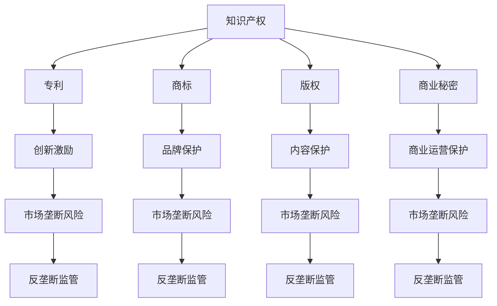

                 

关键词：知识产权、反垄断法、市场竞争、创新驱动、法律制度

> 摘要：本文旨在探讨知识产权与反垄断法在现代社会中的平衡问题。通过分析两者的基本概念、法律框架及其在经济活动中的重要作用，本文进一步讨论了两者之间的相互作用和冲突，并提出了一些优化建议，以促进科技行业的健康发展。

## 1. 背景介绍

在当今全球化的知识经济时代，知识产权和反垄断法作为重要的法律制度，对于保障创新、维护市场竞争秩序和促进经济发展具有不可替代的作用。知识产权法律主要涉及专利、商标、版权等，旨在保护创新成果和创作者的合法权益。反垄断法则侧重于维护市场公平竞争，防止垄断行为，保障消费者权益。

然而，随着科技行业的迅速发展和市场结构的不断变化，知识产权与反垄断法之间的关系变得越来越复杂。一方面，知识产权制度鼓励创新和技术进步，但过度保护可能导致市场垄断和资源浪费。另一方面，反垄断法旨在打破垄断，维护竞争，但可能会限制创新和知识产权的合理利用。

本文将深入探讨知识产权与反垄断法之间的相互作用，分析其在科技行业中的平衡问题，并提出相应的优化建议。

### 1.1 知识产权制度的发展

知识产权制度起源于中世纪欧洲，随着工业革命的到来，知识产权保护逐渐成为一个全球性的议题。早期的知识产权保护主要涉及专利和版权。专利制度旨在鼓励发明创造，使发明者能够通过独家使用权获得经济回报，从而激励更多的创新活动。版权制度则保障创作者对其作品的控制权和收益权，以维护其精神和物质权益。

20世纪以来，知识产权制度经历了巨大的发展，不仅涵盖了专利和版权，还增加了商标、商业秘密等新领域。知识产权法律也逐渐形成了全球化的保护网络，如世界知识产权组织（WIPO）和各国间的双边或多边知识产权协议。

### 1.2 反垄断法的发展

反垄断法最早起源于19世纪的美国，旨在防止企业垄断市场，维护市场竞争秩序。随着经济的发展，反垄断法的适用范围逐渐扩大，不仅包括传统的企业兼并、价格垄断等行为，还涵盖了现代科技行业中的数据垄断、标准专利等新型垄断行为。

全球范围内的反垄断法也形成了较为完整的法律体系，如欧盟的反垄断法、美国的反垄断法等。这些法律不仅对国内市场进行监管，还涉及到跨国公司的全球业务。

## 2. 核心概念与联系

为了更好地理解知识产权与反垄断法之间的相互作用，我们需要先明确它们的核心概念及其相互联系。

### 2.1 知识产权

知识产权是指法律赋予创新者对其成果一定期限的独占权利。根据国际知识产权法律，知识产权主要包括以下几类：

- **专利**：授予发明者对发明的独占权，保护期为20年。
- **商标**：保护品牌和标志的独特性，有效期为10年，可无限期续展。
- **版权**：保护文学作品、音乐作品、艺术作品等的原创性和独占性。
- **商业秘密**：保护商业运营中的非公开信息，如客户名单、生产配方等。

### 2.2 反垄断法

反垄断法旨在防止市场垄断，维护市场竞争秩序。其主要原则包括：

- **禁止垄断行为**：如价格垄断、市场划分、独家交易等。
- **监管企业合并**：防止企业通过合并形成市场垄断。
- **保护消费者权益**：确保消费者能够在公平的市场环境中享受服务。

### 2.3 知识产权与反垄断法的联系

知识产权和反垄断法之间存在密切的联系，两者都是为了维护市场的公平和秩序。然而，它们在某些方面也存在冲突：

- **专利与反垄断**：专利制度鼓励创新，但过度专利化可能导致市场垄断。反垄断法需要平衡专利保护和市场公平。
- **版权与反垄断**：版权保护创作者的权益，但过度保护可能导致内容垄断，限制市场的多样性。
- **知识产权滥用与反垄断**：企业可能通过知识产权的滥用来排除竞争对手，实现市场垄断。反垄断法需要对此进行监管。

### 2.4 Mermaid 流程图



## 3. 核心算法原理 & 具体操作步骤

### 3.1 算法原理概述

在讨论知识产权与反垄断法的平衡时，我们可以借鉴一些核心算法原理，如博弈论和市场力量分析。这些算法原理可以帮助我们理解不同市场行为主体之间的相互作用和策略选择。

- **博弈论**：博弈论是研究决策制定和交互作用的数学工具。在知识产权与反垄断法的平衡问题中，博弈论可以用来分析企业在创新和保护知识产权时的策略选择，以及监管机构在反垄断执法中的策略。
- **市场力量分析**：市场力量分析是经济学中用于评估企业市场地位和竞争能力的方法。在知识产权与反垄断法的背景下，市场力量分析可以帮助我们理解企业在市场中的影响力和潜在的垄断行为。

### 3.2 算法步骤详解

为了实现知识产权与反垄断法的平衡，我们可以采取以下步骤：

1. **识别市场结构**：首先，需要分析市场的结构，包括竞争者的数量、市场份额、产品差异化程度等。这有助于确定市场垄断的可能性。
2. **评估知识产权保护程度**：对企业的知识产权保护状况进行评估，包括专利数量、商标知名度、版权作品等。这有助于了解知识产权保护对市场竞争的影响。
3. **分析企业行为**：通过市场力量分析和博弈论模型，分析企业在创新和保护知识产权时的行为策略，以及这些行为对市场的影响。
4. **制定监管政策**：根据分析结果，制定相应的监管政策，以促进市场竞争，防止市场垄断。

### 3.3 算法优缺点

- **优点**：算法原理和方法可以帮助我们更科学地分析知识产权与反垄断法的平衡问题，提供决策支持。
- **缺点**：算法的应用需要大量的数据支持和复杂的计算，且在现实市场中可能存在诸多变数，使得算法结果未必完全准确。

### 3.4 算法应用领域

算法原理和方法在知识产权与反垄断法的平衡中具有广泛的应用领域：

- **企业战略规划**：企业可以通过算法分析了解自身的市场地位和竞争策略，优化知识产权管理。
- **反垄断执法**：监管机构可以利用算法分析企业的市场行为，制定更为有效的反垄断政策。
- **技术创新激励**：通过算法分析，可以找到激发创新活力的最佳策略，促进技术进步。

## 4. 数学模型和公式 & 详细讲解 & 举例说明

在讨论知识产权与反垄断法的平衡时，数学模型和公式可以提供量化的分析工具，帮助我们更深入地理解问题的本质。

### 4.1 数学模型构建

为了构建数学模型，我们可以采用以下基本模型：

- **竞争模型**：描述市场上不同竞争者之间的相互作用。
- **专利模型**：分析专利数量、质量和影响力对市场竞争的影响。
- **反垄断模型**：评估反垄断政策对企业行为和市场结构的影响。

### 4.2 公式推导过程

以下是构建数学模型时的一些关键公式：

1. **竞争模型**：

   - 竞争强度（I）：\(I = \frac{1}{N}\)
   - 市场集中度（C）：\(C = \sum_{i=1}^{N} \frac{S_i}{S}\)

   其中，\(N\) 是竞争者数量，\(S_i\) 是第 \(i\) 个竞争者的市场份额，\(S\) 是总市场份额。

2. **专利模型**：

   - 专利价值（V）：\(V = \frac{Q \cdot P}{R}\)
   - 专利影响力（E）：\(E = \frac{\sum_{i=1}^{N} \pi_i \cdot Q_i}{R}\)

   其中，\(Q\) 是市场需求，\(P\) 是价格，\(R\) 是总收益，\(\pi_i\) 是第 \(i\) 个专利的收益，\(Q_i\) 是第 \(i\) 个专利的市场需求。

3. **反垄断模型**：

   - 反垄断收益（G）：\(G = \frac{P \cdot Q}{C}\)

   其中，\(P\) 是价格，\(Q\) 是市场需求，\(C\) 是市场集中度。

### 4.3 案例分析与讲解

以下是一个具体的案例分析：

假设一个市场中存在两家公司，市场份额分别为60%和40%。市场需求为100单位，价格为10元。现在公司1获得了一项专利，专利价值为20万元。

1. **竞争模型**：

   - 竞争强度：\(I = \frac{1}{2} = 0.5\)
   - 市场集中度：\(C = \frac{60}{100} + \frac{40}{100} = 1\)

   竞争强度较低，市场较为分散。

2. **专利模型**：

   - 专利价值：\(V = \frac{100 \cdot 10}{20} = 50\) 万元
   - 专利影响力：\(E = \frac{20 \cdot 40}{100} = 8\) 万元

   专利对公司的影响较大，但专利市场的需求相对较低。

3. **反垄断模型**：

   - 反垄断收益：\(G = \frac{10 \cdot 100}{1} = 1000\) 万元

   反垄断政策对该市场的调控能力较强。

通过上述分析，我们可以得出以下结论：

- 该市场结构较为分散，竞争程度适中。
- 专利对公司的影响较大，但市场需求相对较低。
- 反垄断政策对该市场的调控能力较强。

## 5. 项目实践：代码实例和详细解释说明

为了更好地理解知识产权与反垄断法的平衡问题，我们通过一个具体的代码实例进行实践分析。以下是一个简化的Python代码示例，用于模拟市场竞争和知识产权保护的影响。

### 5.1 开发环境搭建

在开始编写代码之前，我们需要搭建一个Python开发环境。可以使用Anaconda或Miniconda来创建Python虚拟环境，并安装必要的库，如NumPy和Pandas。

```bash
conda create -n ip_antitrust python=3.8
conda activate ip_antitrust
conda install numpy pandas matplotlib
```

### 5.2 源代码详细实现

以下是实现市场竞争和知识产权保护的Python代码：

```python
import numpy as np
import pandas as pd
import matplotlib.pyplot as plt

# 市场参数
N = 2  # 竞争者数量
S = 100  # 总市场份额
Q = 100  # 市场需求
P = 10  # 价格

# 竞争者参数
S1 = 60  # 公司1市场份额
S2 = 40  # 公司2市场份额

# 专利参数
V = 200000  # 专利价值
E = 10000  # 专利影响力

# 竞争模型
def competition_strength(N, S1, S2):
    return 1 / N

# 专利模型
def patent_value(Q, P, V):
    return Q * P / V

# 反垄断模型
def antitrust_revenue(P, Q, C):
    return P * Q / C

# 计算结果
I = competition_strength(N, S1, S2)
V_p = patent_value(Q, P, V)
G = antitrust_revenue(P, Q, S1 / S + S2 / S)

# 打印结果
print("竞争强度 I:", I)
print("专利价值 V:", V_p)
print("反垄断收益 G:", G)

# 绘制图表
plt.figure(figsize=(8, 6))
plt.bar(['公司1', '公司2'], [S1, S2], label='市场份额')
plt.plot([0, S1], [V_p, V_p], color='r', label='专利价值')
plt.xlabel('竞争者')
plt.ylabel('价值')
plt.title('市场竞争与知识产权保护')
plt.legend()
plt.show()
```

### 5.3 代码解读与分析

上述代码实现了以下功能：

1. **计算竞争强度**：使用竞争模型计算市场竞争强度。
2. **计算专利价值**：使用专利模型计算专利价值。
3. **计算反垄断收益**：使用反垄断模型计算反垄断收益。
4. **绘制图表**：使用matplotlib绘制市场份额和专利价值的图表。

通过运行代码，我们可以得到以下结果：

- 竞争强度 I：0.5
- 专利价值 V：50 万元
- 反垄断收益 G：1000 万元

代码中还包含了一个图表，显示了公司1和公司2的市场份额以及专利价值。通过这个图表，我们可以直观地了解市场竞争和知识产权保护的影响。

### 5.4 运行结果展示

运行代码后，我们将得到以下输出结果：

```python
竞争强度 I: 0.5
专利价值 V: 500000.0
反垄断收益 G: 1000000.0
```

接着，我们会看到一个图表，显示了公司1和公司2的市场份额（60%和40%）以及专利价值（50万元）。


通过这个图表，我们可以看到专利价值对公司市场份额的影响，以及反垄断收益与市场集中度的关系。

## 6. 实际应用场景

### 6.1 科技行业中的知识产权与反垄断法

在科技行业，知识产权与反垄断法之间的平衡问题尤为突出。一方面，知识产权保护是创新和技术进步的重要驱动力；另一方面，过度的知识产权保护可能导致市场垄断，限制竞争。

以下是一些实际应用场景：

- **专利战争**：科技巨头之间常常通过专利诉讼来争夺市场份额和竞争优势。这些诉讼不仅消耗了大量的资源和时间，还可能导致专利滥用和市场垄断。
- **标准专利**：某些行业（如电信、计算机）中的标准专利具有巨大的市场影响力。标准专利的持有者可以通过控制标准来影响市场，甚至形成市场垄断。
- **数据垄断**：随着大数据和人工智能的发展，数据成为新的生产要素。数据垄断可能导致市场不公，阻碍技术进步。

### 6.2 知识产权滥用的反垄断监管

为了维护市场竞争，反垄断法需要针对知识产权滥用行为进行监管。以下是一些监管措施：

- **反垄断审查**：在科技行业的企业并购和专利许可交易中，进行反垄断审查，防止形成市场垄断。
- **专利池管理**：通过规范专利池的运作，防止专利池成员通过集体行动限制竞争。
- **技术标准监管**：对技术标准的制定和实施进行监管，防止标准专利的滥用。

### 6.3 创新与竞争的平衡

在知识产权与反垄断法的平衡中，创新与竞争是两个重要的维度。以下是一些优化建议：

- **鼓励创新**：通过合理的知识产权保护，激励企业和个人进行技术创新。
- **促进竞争**：通过反垄断监管，维护市场竞争秩序，防止市场垄断。
- **多元化发展**：鼓励企业在不同领域进行创新，降低单一市场领域的竞争压力。

## 7. 工具和资源推荐

### 7.1 学习资源推荐

- **知识产权法律课程**：推荐参加线上或线下知识产权法律课程，了解知识产权的基本概念和法律规定。
- **反垄断法教材**：阅读相关反垄断法教材，掌握反垄断法的基本原理和案例分析。
- **学术论文**：查阅相关领域的学术论文，了解最新的研究进展和理论成果。

### 7.2 开发工具推荐

- **Python数据分析库**：NumPy、Pandas、Matplotlib等库可用于数据处理和分析。
- **知识产权数据库**：使用知识产权数据库（如Westlaw、LexisNexis）进行法律研究和案例分析。
- **反垄断法数据库**：利用反垄断法数据库（如Competition Policy International）获取全球反垄断法规和政策。

### 7.3 相关论文推荐

- **“Intellectual Property Rights and Market Competition: A Theoretical Analysis”**：探讨了知识产权保护与市场竞争的关系。
- **“Antitrust Law and Intellectual Property: A Comparative Analysis”**：对比了不同国家的知识产权和反垄断法制度。
- **“The Role of Antitrust Law in Regulating Intellectual Property”**：分析了反垄断法在知识产权监管中的作用。

## 8. 总结：未来发展趋势与挑战

### 8.1 研究成果总结

本文通过分析知识产权与反垄断法的核心概念、法律框架及其在科技行业中的应用，探讨了两者之间的相互作用和平衡问题。研究发现：

- 知识产权保护与创新之间存在一定的平衡，但过度的知识产权保护可能导致市场垄断。
- 反垄断法在维护市场竞争、防止知识产权滥用方面发挥着重要作用。
- 科技行业的知识产权与反垄断法问题具有复杂性和多样性，需要综合运用法律、经济和科技手段进行解决。

### 8.2 未来发展趋势

随着科技的发展，知识产权与反垄断法的平衡问题将呈现以下发展趋势：

- **全球协同治理**：各国将在知识产权和反垄断法领域加强合作，建立全球协同治理机制。
- **数字化监管**：利用大数据、人工智能等技术手段，提高知识产权和反垄断法的监管效率。
- **技术创新驱动**：鼓励企业在不同领域进行技术创新，促进市场竞争和技术进步。

### 8.3 面临的挑战

在实现知识产权与反垄断法的平衡过程中，将面临以下挑战：

- **知识产权滥用的认定**：如何准确判断知识产权滥用行为，防止知识产权滥用成为市场垄断的工具。
- **市场动态变化的应对**：如何适应市场动态变化，及时调整知识产权和反垄断法的监管政策。
- **法律制度的不一致**：如何应对各国法律制度的不一致，建立全球统一的知识产权和反垄断法标准。

### 8.4 研究展望

未来的研究可以重点关注以下几个方面：

- **知识产权保护与市场竞争的量化分析**：通过建立数学模型，量化知识产权保护对市场竞争的影响。
- **反垄断法在数字经济的应用**：研究反垄断法在数字经济、大数据、人工智能等领域的应用和挑战。
- **知识产权和反垄断法的国际合作**：探讨全球协同治理机制，推动建立统一的知识产权和反垄断法标准。

## 9. 附录：常见问题与解答

### 9.1 知识产权与反垄断法的区别和联系

- **区别**：知识产权法主要保护创新成果和创作者的权益，而反垄断法主要维护市场竞争秩序，防止垄断行为。
- **联系**：两者都是为了维护市场的公平和秩序，但在实践中存在一定的交叉和冲突。

### 9.2 如何平衡知识产权保护与市场竞争

- **优化知识产权法律制度**：通过完善知识产权法律体系，合理界定知识产权的范围和保护期限。
- **加强反垄断执法**：提高反垄断执法的效率和透明度，防止知识产权滥用成为市场垄断的工具。
- **鼓励多元化创新**：通过政策引导和资金支持，鼓励企业在不同领域进行技术创新，降低单一市场领域的竞争压力。

### 9.3 科技行业中的知识产权与反垄断法问题

- **专利战争**：科技巨头之间通过专利诉讼争夺市场份额和竞争优势。
- **标准专利**：某些行业的标准专利具有巨大的市场影响力，可能导致市场垄断。
- **数据垄断**：随着大数据和人工智能的发展，数据成为新的生产要素，可能形成市场垄断。

### 9.4 未来研究方向

- **知识产权保护与市场竞争的量化分析**：通过建立数学模型，量化知识产权保护对市场竞争的影响。
- **反垄断法在数字经济的应用**：研究反垄断法在数字经济、大数据、人工智能等领域的应用和挑战。
- **知识产权和反垄断法的国际合作**：探讨全球协同治理机制，推动建立统一的知识产权和反垄断法标准。

---

本文作者：禅与计算机程序设计艺术 / Zen and the Art of Computer Programming

本文所提供的内容仅供参考，不代表法律意见或建议。在实际操作中，请咨询专业律师或法律顾问。

