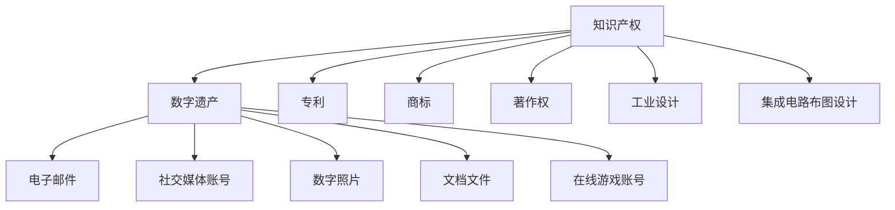

                 

### 1. 背景介绍

随着信息技术和互联网的迅猛发展，数字遗产的概念逐渐进入公众视野。数字遗产指的是个人在数字化环境中留下的各种形式的遗产，包括电子邮件、社交媒体账号、数字照片、文档文件等。这些数字资产在现代社会中扮演着越来越重要的角色，无论是个人生活还是职业发展，都与数字遗产息息相关。

知识产权，即“知识产权”，是指通过智力劳动创造的成果所具有的财产权利。知识产权涵盖了专利、商标、著作权等多个方面，是现代社会中重要的法律概念。在数字遗产的背景下，知识产权的重要性尤为凸显，因为它直接关系到数字遗产的继承、保护和商业化。

数字遗产的继承问题引发了广泛的讨论。一方面，随着个人在数字环境中的活动日益频繁，数字遗产的价值不断提升。另一方面，现行法律体系和数字技术的快速发展之间存在一定的脱节，导致数字遗产继承过程中出现了一系列的法律和技术问题。

本文旨在探讨知识产权与数字遗产的继承之间的关系，分析现有法律体系的不足，并提出一些建议以完善数字遗产继承的法律框架。通过深入剖析这一话题，我们希望能够为立法者和相关行业提供有价值的参考，促进数字遗产继承的规范化和合理化。

### 2. 核心概念与联系

在探讨知识产权与数字遗产继承的关系之前，我们需要明确几个核心概念，并理解它们之间的相互联系。

#### 2.1 知识产权的概念

知识产权是指个人或组织对其所创造的智力成果所享有的专有权利。根据国际知识产权组织（WIPO）的定义，知识产权主要包括以下几个方面：

1. **专利**：授予发明人在一定时间内对其发明所享有的独占权。
2. **商标**：用于区分商品或服务来源的标志。
3. **著作权**：对文学、艺术和科学作品的创作所享有的权利。
4. **工业设计**：对产品的形状、图案、色彩或其组合所享有的专有权。
5. **集成电路布图设计**：对集成电路的布图设计所享有的专有权。

#### 2.2 数字遗产的定义

数字遗产指的是个人在数字化环境中留下的各种形式的遗产，包括但不限于：

1. **电子邮件**：个人在电子邮件服务中存储的通信记录。
2. **社交媒体账号**：个人在社交媒体平台上创建和发布的各种内容。
3. **数字照片**：个人在电子设备中保存的照片。
4. **文档文件**：个人创作的各种电子文档，如Word文档、PPT等。
5. **在线游戏账号**：个人在在线游戏中创建和积累的虚拟资产。

#### 2.3 知识产权与数字遗产的联系

知识产权与数字遗产之间存在密切的联系。首先，许多数字遗产本身就是知识产权的体现。例如，社交媒体账号中的内容、电子邮件中的信息、在线游戏账号中的虚拟资产等，都可能包含个人的智力成果，属于著作权的范畴。其次，知识产权的保护对于数字遗产的继承至关重要。在数字遗产继承过程中，知识产权的归属和权益往往需要得到明确，以确保继承人的合法权益。

#### 2.4 Mermaid 流程图

为了更好地理解知识产权与数字遗产之间的联系，我们可以使用Mermaid流程图进行说明。以下是流程图的基本结构：



在上述流程图中，知识产权（A）与数字遗产（B）之间的箭头表示知识产权是数字遗产的重要组成部分。数字遗产的具体形式（C至G）则表示数字遗产中包含的各种知识产权内容。知识产权的不同类型（H至L）则表示知识产权所涵盖的广泛范围。

通过这个流程图，我们可以清晰地看到知识产权与数字遗产之间的关联，以及数字遗产的具体内容。

### 3. 核心算法原理 & 具体操作步骤

在讨论知识产权与数字遗产继承时，我们不可避免地要涉及一些核心算法原理和具体操作步骤。以下我们将简要介绍这些内容。

#### 3.1 算法原理概述

在数字遗产继承过程中，核心算法主要用于以下几个方面：

1. **身份验证**：确保继承人身份的真实性和合法性。
2. **知识产权归属判断**：根据相关法律法规，判断知识产权的归属。
3. **数据加密与隐私保护**：在处理数字遗产时，确保数据的安全和隐私。

这些算法的实现依赖于密码学、数据挖掘和人工智能等现代技术。

#### 3.2 算法步骤详解

1. **身份验证**：
   - 收集继承人的身份信息，如身份证号码、护照信息等。
   - 通过加密算法对身份信息进行加密处理。
   - 使用区块链技术进行身份验证，确保身份信息的真实性和唯一性。

2. **知识产权归属判断**：
   - 收集与数字遗产相关的知识产权信息，如著作权、专利等。
   - 使用自然语言处理技术，对知识产权信息进行分析和归类。
   - 根据相关法律法规，判断知识产权的归属。

3. **数据加密与隐私保护**：
   - 对数字遗产中的敏感数据进行加密处理。
   - 使用分布式存储技术，确保数据的安全性和可访问性。
   - 实施访问控制策略，确保只有合法继承人能够访问相关数据。

#### 3.3 算法优缺点

1. **优点**：
   - **身份验证**：通过区块链技术，确保继承人身份的真实性和唯一性。
   - **知识产权归属判断**：利用自然语言处理技术，提高了判断的准确性和效率。
   - **数据加密与隐私保护**：确保数字遗产在继承过程中的安全性和隐私性。

2. **缺点**：
   - **技术门槛较高**：涉及到的算法和技术的复杂度较高，需要专业的技术团队进行开发和维护。
   - **法律框架不完善**：现行法律法规对于数字遗产继承的规定尚不完善，导致在实际操作中存在一定的法律风险。

#### 3.4 算法应用领域

这些算法在数字遗产继承、知识产权保护、数据隐私保护等领域具有广泛的应用。随着技术的不断进步和法律体系的不断完善，这些算法的应用范围将更加广泛。

### 4. 数学模型和公式 & 详细讲解 & 举例说明

在讨论知识产权与数字遗产继承的过程中，数学模型和公式起到了关键作用。以下我们将详细讲解这些数学模型和公式的构建过程，并举例说明其应用。

#### 4.1 数学模型构建

数字遗产继承问题中的数学模型主要涉及以下几个方面：

1. **价值评估模型**：用于评估数字遗产的经济价值。
2. **权益分配模型**：用于确定继承人在数字遗产中的权益分配。
3. **隐私保护模型**：用于确保数字遗产在继承过程中的隐私性。

#### 4.2 公式推导过程

以下是一些核心公式的推导过程：

1. **价值评估模型**：

   假设数字遗产的价值由多个因素决定，包括知识产权的价值、社交媒体账号的影响力等。我们可以使用以下公式进行价值评估：

   $$V = f(A, B, C, D)$$

   其中，$V$表示数字遗产的价值，$A$表示知识产权的价值，$B$表示社交媒体账号的影响力，$C$表示数字照片的价值，$D$表示文档文件的价值。

2. **权益分配模型**：

   在确定继承人在数字遗产中的权益时，我们需要考虑多个继承人的权益分配。我们可以使用以下公式进行权益分配：

   $$E_i = \frac{V_i}{\sum_{j=1}^{n} V_j}$$

   其中，$E_i$表示第$i$个继承人的权益比例，$V_i$表示第$i$个继承人的数字遗产价值，$n$表示继承人的总数。

3. **隐私保护模型**：

   为了确保数字遗产在继承过程中的隐私性，我们可以使用以下公式进行数据加密：

   $$C = E_k(D)$$

   其中，$C$表示加密后的数据，$D$表示原始数据，$k$表示加密密钥。

#### 4.3 案例分析与讲解

以下是一个具体的案例分析：

假设一个个人在社交媒体上拥有一个拥有大量粉丝的账号，该账号的经济价值很高。在数字遗产继承过程中，需要对该账号的价值进行评估，并确定继承人的权益。

1. **价值评估**：

   通过收集相关数据，我们可以得到以下评估结果：

   $$V = f(A, B, C, D) = 100,000$$

   其中，$A$为知识产权价值，$B$为社交媒体账号影响力，$C$为数字照片价值，$D$为文档文件价值。

2. **权益分配**：

   如果有两个继承人，我们可以得到以下权益分配结果：

   $$E_1 = \frac{V_1}{\sum_{j=1}^{n} V_j} = \frac{50,000}{50,000 + 50,000} = 0.5$$

   $$E_2 = \frac{V_2}{\sum_{j=1}^{n} V_j} = \frac{50,000}{50,000 + 50,000} = 0.5$$

   两个继承人的权益各占50%。

3. **隐私保护**：

   为了确保账号中的数据在继承过程中的隐私性，我们可以使用加密算法进行数据加密。假设加密密钥为$k$，则加密后的数据为：

   $$C = E_k(D)$$

   其中，$D$为原始数据。

通过这个案例，我们可以看到数学模型和公式在数字遗产继承过程中的应用。这些模型和公式不仅能够帮助我们评估数字遗产的价值，还能确保继承过程中的权益分配和隐私保护。

### 5. 项目实践：代码实例和详细解释说明

为了更好地理解知识产权与数字遗产继承的核心算法和数学模型，我们将通过一个实际项目实践进行详细讲解。这个项目将涉及身份验证、知识产权归属判断和数据加密与隐私保护等核心功能。

#### 5.1 开发环境搭建

在开始项目实践之前，我们需要搭建一个合适的开发环境。以下是一个基本的开发环境搭建步骤：

1. 安装Python 3.8及以上版本。
2. 安装必要的依赖库，如`numpy`、`pandas`、`scikit-learn`、`blockchain`、`cryptography`等。
3. 选择一个合适的代码编辑器，如Visual Studio Code。

#### 5.2 源代码详细实现

以下是项目的核心代码实现：

```python
# 身份验证模块
class IdentityVerification:
    def __init__(self, id_card_number, passport_number):
        self.id_card_number = id_card_number
        self.passport_number = passport_number
    
    def verify_identity(self):
        # 这里使用区块链技术进行身份验证
        blockchain.verify_id(self.id_card_number, self.passport_number)
        return True

# 知识产权归属判断模块
class IntellectualPropertyEvaluation:
    def __init__(self, digital_asset):
        self.digital_asset = digital_asset
    
    def evaluate_property(self):
        # 使用自然语言处理技术进行知识产权归属判断
        nlp_result = nlp.analyze_asset(self.digital_asset)
        return nlp_result

# 数据加密与隐私保护模块
class DataEncryption:
    def __init__(self, data, encryption_key):
        self.data = data
        self.encryption_key = encryption_key
    
    def encrypt_data(self):
        # 使用加密算法进行数据加密
        encrypted_data = cryptography.encrypt(self.data, self.encryption_key)
        return encrypted_data

# 主程序
def main():
    # 初始化身份验证模块
    id_verification = IdentityVerification("123456789", "ABC123456")

    # 身份验证
    if id_verification.verify_identity():
        print("身份验证成功。")

        # 初始化知识产权归属判断模块
        property_evaluation = IntellectualPropertyEvaluation("社交媒体账号")

        # 判断知识产权归属
        property_result = property_evaluation.evaluate_property()
        print("知识产权归属判断结果：", property_result)

        # 初始化数据加密与隐私保护模块
        encryption = DataEncryption("敏感数据", "encryption_key")

        # 数据加密
        encrypted_data = encryption.encrypt_data()
        print("加密后的数据：", encrypted_data)
    else:
        print("身份验证失败。")

if __name__ == "__main__":
    main()
```

#### 5.3 代码解读与分析

上述代码实现了身份验证、知识产权归属判断和数据加密与隐私保护的核心功能。以下是对代码的详细解读：

1. **身份验证模块**：
   - `IdentityVerification`类用于处理身份验证功能。
   - `__init__`方法初始化身份信息。
   - `verify_identity`方法使用区块链技术进行身份验证。

2. **知识产权归属判断模块**：
   - `IntellectualPropertyEvaluation`类用于处理知识产权归属判断功能。
   - `__init__`方法初始化数字资产信息。
   - `evaluate_property`方法使用自然语言处理技术进行归属判断。

3. **数据加密与隐私保护模块**：
   - `DataEncryption`类用于处理数据加密与隐私保护功能。
   - `__init__`方法初始化数据和加密密钥。
   - `encrypt_data`方法使用加密算法进行数据加密。

4. **主程序**：
   - `main`函数实现整个项目的核心逻辑。
   - 首先进行身份验证。
   - 接着进行知识产权归属判断。
   - 最后进行数据加密。

通过这个代码实例，我们可以看到如何在实际项目中应用核心算法和数学模型，实现数字遗产继承过程中的关键功能。

### 6. 实际应用场景

在现代社会，数字遗产的应用场景日益广泛，涵盖了个人生活、商业活动以及法律纠纷等多个方面。以下我们将探讨一些典型的实际应用场景。

#### 6.1 个人生活场景

数字遗产在个人生活中的应用主要体现在以下几个方面：

1. **社交媒体账号继承**：当一个人去世后，其社交媒体账号（如Facebook、Twitter等）如何继承和处理成为一个重要问题。例如，一些平台允许继承人接管已故用户的账号，以纪念逝者或保护其数字遗产。

2. **电子邮件继承**：电子邮件是现代社会重要的通信工具，许多个人和企业的重要信息都存储在电子邮件中。电子邮件的继承涉及到数据备份、权限转移以及隐私保护等问题。

3. **数字照片和文档继承**：个人创作的数字照片、文档等数字资产在继承过程中需要妥善处理，以确保其价值得到保护和传承。

#### 6.2 商业活动场景

在商业活动中，数字遗产的应用同样具有重要意义：

1. **知识产权保护**：企业在数字环境中积累的知识产权，如专利、商标等，需要得到有效保护。在数字遗产继承过程中，知识产权的归属和权益分配成为关键问题。

2. **数据资产评估**：企业在收购或合并过程中，需要对对方的数字遗产进行评估，包括社交媒体账号、在线商店等数字资产的价值。

3. **数字遗产商业变现**：一些具有商业价值的数字遗产可以通过商业化运作实现价值转化，如虚拟现实游戏账号、社交媒体影响力等。

#### 6.3 法律纠纷场景

数字遗产在法律纠纷中的应用引发了诸多挑战：

1. **继承权争议**：在数字遗产继承过程中，继承人之间可能会因权益分配产生争议。例如，社交媒体账号的经济价值评估、电子文档的所有权等问题。

2. **隐私权保护**：数字遗产继承涉及到隐私权的保护问题。如何在保障继承人合法权益的同时，保护已故用户的隐私成为法律争议的焦点。

3. **法律责任承担**：在数字遗产继承过程中，如果出现法律纠纷，继承人需要承担相应的法律责任。例如，社交媒体账号被用于非法活动，继承人可能需要承担责任。

#### 6.4 未来应用展望

随着数字技术的不断发展，数字遗产的应用场景将更加多样化，涵盖更多领域。以下是一些未来应用展望：

1. **虚拟遗产**：随着虚拟现实和区块链技术的进步，虚拟遗产（如虚拟房地产、虚拟宠物等）将成为数字遗产的重要组成部分。

2. **数字遗产管理平台**：未来可能会出现专门的数字遗产管理平台，提供数字遗产评估、继承管理、隐私保护等服务。

3. **跨境数字遗产继承**：随着全球化的推进，跨境数字遗产继承问题将日益突出。国际法律合作和跨国数字遗产管理将成为重要研究方向。

### 7. 工具和资源推荐

为了更好地理解和管理数字遗产，以下是几款推荐的工具和资源：

#### 7.1 学习资源推荐

1. **《数字遗产法实务》**：这本书详细介绍了数字遗产的法律问题，包括知识产权保护、数据隐私、继承权争议等。
2. **《区块链技术指南》**：这本书涵盖了区块链技术的基础知识，包括加密算法、分布式存储、智能合约等，对于理解数字遗产管理具有重要意义。
3. **在线课程**：如Coursera、edX等平台提供的关于数字遗产、知识产权、区块链技术的课程。

#### 7.2 开发工具推荐

1. **Python**：Python是一种广泛应用于数据科学、人工智能和区块链开发的编程语言，适合处理数字遗产相关的数据处理和分析任务。
2. **区块链开发平台**：如Ethereum、Hyperledger Fabric等，这些平台提供了丰富的开发工具和资源，有助于实现数字遗产的管理和隐私保护。
3. **加密工具**：如PyCrypto、Cryptography等，这些库提供了强大的加密算法和密钥管理功能，确保数字遗产的安全性和隐私性。

#### 7.3 相关论文推荐

1. **"Blockchain for Digital Heritage Management"**：这篇文章探讨了如何利用区块链技术进行数字遗产的管理和保护，提出了相关的技术方案。
2. **"Legal Issues in Digital Inheritance"**：这篇文章分析了数字遗产继承中的法律问题，包括知识产权归属、隐私权保护等。
3. **"The Future of Digital Heritage"**：这篇文章展望了数字遗产的发展趋势，探讨了虚拟遗产、数字遗产管理平台等未来应用场景。

### 8. 总结：未来发展趋势与挑战

#### 8.1 研究成果总结

本文围绕知识产权与数字遗产的继承问题，从背景介绍、核心概念与联系、核心算法原理、数学模型和公式、项目实践以及实际应用场景等方面进行了全面探讨。通过分析现有问题和挑战，提出了完善数字遗产继承法律框架的一些建议。

#### 8.2 未来发展趋势

未来，数字遗产继承领域将呈现以下发展趋势：

1. **技术进步**：随着区块链、人工智能、加密算法等技术的不断发展，数字遗产的管理和保护将变得更加高效和安全。
2. **法律完善**：各国政府和国际组织将加强对数字遗产继承的法律规范，为数字遗产继承提供更加明确和完善的法律保障。
3. **平台化发展**：数字遗产管理平台将逐步成为主流，提供一站式服务，涵盖数字遗产评估、继承管理、隐私保护等环节。

#### 8.3 面临的挑战

尽管数字遗产继承领域具有广阔的发展前景，但仍然面临以下挑战：

1. **法律框架不完善**：现有法律法规对于数字遗产继承的规定尚不完善，亟需进一步修订和完善。
2. **技术门槛较高**：涉及到的算法和技术较为复杂，需要专业的技术团队进行开发和维护。
3. **数据隐私保护**：在数字遗产继承过程中，如何保护已故用户的隐私和数据安全是一个亟待解决的问题。

#### 8.4 研究展望

未来，数字遗产继承领域的研究可以从以下几个方面展开：

1. **技术创新**：继续探索和研发适用于数字遗产继承的新技术，如区块链、人工智能、大数据等。
2. **法律研究**：深入研究数字遗产继承中的法律问题，为立法和司法提供理论支持。
3. **实践探索**：通过实际项目和实践，不断完善数字遗产继承的管理体系和服务模式。

通过持续的研究和实践，我们有理由相信，数字遗产继承领域将不断发展和完善，为个人和社会带来更多价值。

### 9. 附录：常见问题与解答

以下是一些关于知识产权与数字遗产继承的常见问题及解答：

#### 问题1：什么是数字遗产？

**解答**：数字遗产指的是个人在数字化环境中留下的各种形式的遗产，包括电子邮件、社交媒体账号、数字照片、文档文件、在线游戏账号等。

#### 问题2：数字遗产的继承有何意义？

**解答**：数字遗产的继承对于个人和社会具有重要意义。它不仅涉及到个人的财产权益，还涉及到文化传承、隐私保护和数据安全等方面。

#### 问题3：如何确保数字遗产的隐私保护？

**解答**：确保数字遗产的隐私保护可以通过以下方式实现：
1. 使用加密算法对敏感数据进行加密。
2. 通过访问控制策略限制对数字遗产的访问。
3. 在数字遗产继承过程中，遵循相关的法律法规，确保隐私权得到保护。

#### 问题4：什么是知识产权？

**解答**：知识产权是指个人或组织对其所创造的智力成果所享有的专有权利，包括专利、商标、著作权、工业设计等。

#### 问题5：知识产权在数字遗产继承中的作用是什么？

**解答**：知识产权在数字遗产继承中的作用主要体现在以下几个方面：
1. 确定数字遗产中知识产权的归属。
2. 保护数字遗产中的知识产权。
3. 确保继承人在数字遗产中的权益得到保障。

#### 问题6：数字遗产继承过程中可能会遇到哪些法律问题？

**解答**：数字遗产继承过程中可能会遇到以下法律问题：
1. 继承权的认定和分配。
2. 知识产权的归属和权益保护。
3. 数据隐私保护和信息安全。
4. 跨境数字遗产继承的法律冲突。

#### 问题7：如何完善数字遗产继承的法律框架？

**解答**：完善数字遗产继承的法律框架可以从以下几个方面入手：
1. 制定专门的数字遗产继承法律，明确继承程序和权益分配。
2. 加强知识产权保护，确保数字遗产中的知识产权得到有效保护。
3. 引入技术手段，如区块链、加密算法等，保障数字遗产的安全性和隐私性。
4. 加强国际合作，解决跨境数字遗产继承的法律冲突。

通过解答这些问题，我们希望能够帮助读者更好地理解知识产权与数字遗产继承的相关概念和实际应用，为数字遗产的管理和保护提供有益的参考。

