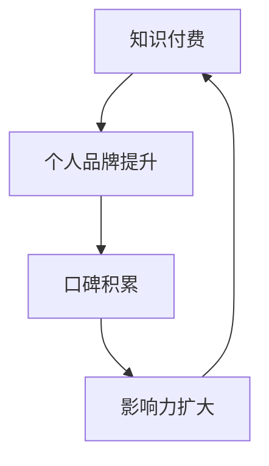

                 

关键词：知识付费，个人品牌，价值提升，内容创作，社交媒体，营销策略，数据驱动

> 摘要：在当今数字化时代，知识付费和个人品牌价值提升已成为众多专业人士和知识工作者的重要课题。本文将深入探讨知识付费的本质、个人品牌构建的策略、以及如何通过有效的营销手段提升个人品牌价值。我们将结合实际案例，分析成功的知识付费模式和品牌塑造方法，为读者提供实用的建议和工具，帮助他们在知识经济时代实现个人价值的最大化。

## 1. 背景介绍

随着互联网技术的迅猛发展，知识付费市场逐渐成熟。知识付费，是指通过在线平台、课程、订阅服务等形式，消费者为获取有价值的信息和知识所支付的费用。这一市场不仅涵盖了传统的教育培训领域，还扩展到了内容创作、咨询服务、专业课程等多个方面。

个人品牌价值的提升，则是在这个信息爆炸的时代，个人在专业领域内通过持续的知识输出、影响力构建和良好口碑积累，形成的一种无形资产。个人品牌不仅能够提升个人的社会地位和职业发展，更是知识付费市场中的重要组成部分。

本文将围绕知识付费与个人品牌价值提升展开讨论，旨在为专业人士和知识工作者提供一些实用的指导，帮助他们在这个快速变化的时代中找到自己的位置，实现个人价值的最大化。

## 2. 核心概念与联系

### 2.1 知识付费的定义

知识付费，简单来说，就是消费者通过支付费用获取专业知识和信息的行为。它通常发生在以下几种场景：

- 在线教育平台：用户通过付费订阅课程或购买课程包来学习新知识或技能。
- 专业咨询服务：用户为获取专业顾问的意见或解决方案支付费用。
- 内容创作平台：用户为获取优质内容或独家资讯付费。
- 付费直播或讲座：用户为观看专业嘉宾的分享或讲座支付费用。

### 2.2 个人品牌价值的定义

个人品牌价值，是指个人在专业领域内通过知识、技能、经验、影响力等因素所积累的无形资产。它通常体现在以下几个方面：

- 个人知名度：个人在专业领域内的知名度和影响力。
- 专业认可度：同行和社会对个人专业能力的认可。
- 资源获取能力：个人能够通过品牌影响力获取更多的资源，如项目机会、合作伙伴等。
- 收入水平：个人通过品牌价值实现的经济收益。

### 2.3 知识付费与个人品牌价值的联系

知识付费与个人品牌价值之间存在着紧密的联系。首先，知识付费是个人品牌价值提升的一种重要方式。通过提供高质量的知识产品和服务，个人能够积累口碑，扩大影响力，从而提升个人品牌价值。其次，个人品牌价值的提升又会反过来促进知识付费的增长。一个拥有强大个人品牌的专业人士，能够吸引更多的付费用户，从而实现知识付费的规模化和可持续发展。

### 2.4 Mermaid 流程图

以下是一个简化的 Mermaid 流程图，展示了知识付费与个人品牌价值提升的基本流程：



## 3. 核心算法原理 & 具体操作步骤

### 3.1 算法原理概述

知识付费与个人品牌价值提升的核心算法，可以看作是一个循环反馈系统。这个系统的主要步骤包括：

1. **内容创作与知识输出**：个人通过创作高质量的内容或提供专业的知识服务，吸引潜在用户。
2. **用户反馈与口碑积累**：用户通过使用知识产品或服务后的体验反馈，对个人品牌形成口碑。
3. **影响力扩大与品牌提升**：基于口碑积累，个人品牌的影响力逐步扩大，价值提升。
4. **知识付费与再创作**：个人通过品牌影响力，获取更多的付费机会，进而创作更多的知识产品和服务。

### 3.2 算法步骤详解

1. **内容创作与知识输出**
   - 确定专业领域和目标用户。
   - 设计课程、文章、讲座等知识产品。
   - 优化内容质量，确保对用户有价值。

2. **用户反馈与口碑积累**
   - 通过社交媒体、在线问卷调查等方式收集用户反馈。
   - 分析反馈，优化产品和服务。
   - 利用用户口碑进行二次传播。

3. **影响力扩大与品牌提升**
   - 参与行业活动，提升个人知名度。
   - 通过媒体曝光、合作项目等方式扩大影响力。
   - 塑造个人品牌形象，确保与专业领域相符。

4. **知识付费与再创作**
   - 推广知识产品，获取付费用户。
   - 根据用户需求和反馈，持续更新和创作新内容。
   - 通过付费用户反馈，进一步优化知识产品。

### 3.3 算法优缺点

**优点**：

- 能够快速提升个人品牌价值。
- 促进知识传播和共享。
- 为个人带来经济收益。

**缺点**：

- 内容创作和品牌塑造初期投入较大。
- 需要持续更新和维护，否则效果可能减弱。

### 3.4 算法应用领域

- 在线教育
- 专业咨询服务
- 内容创作平台
- 个人品牌管理

## 4. 数学模型和公式 & 详细讲解 & 举例说明

### 4.1 数学模型构建

为了更好地理解知识付费与个人品牌价值提升的关系，我们可以构建一个简单的数学模型。假设：

- \( P \) 表示个人品牌价值。
- \( K \) 表示知识付费金额。
- \( R \) 表示用户口碑指数。

则模型可以表示为：

\[ P = f(K, R) \]

其中，\( f \) 是一个函数，表示个人品牌价值与知识付费金额和用户口碑指数的关系。

### 4.2 公式推导过程

根据上述假设，我们可以推导出以下公式：

\[ P = K \cdot R \]

其中：

- \( K \) 表示知识付费金额，可以看作是个人提供知识的价值。
- \( R \) 表示用户口碑指数，反映了用户对个人知识产品的满意度和推荐程度。

### 4.3 案例分析与讲解

以一位在线教育讲师为例，假设他每月的知识付费金额为 10,000 元，且用户口碑指数为 1.5。根据公式：

\[ P = 10,000 \cdot 1.5 = 15,000 \]

这意味着，这位讲师的个人品牌价值为 15,000 元。通过持续提供高质量的知识产品和服务，提升用户口碑指数，他的个人品牌价值将进一步提升。

## 5. 项目实践：代码实例和详细解释说明

### 5.1 开发环境搭建

为了演示知识付费与个人品牌价值提升的关系，我们可以使用 Python 编写一个简单的模拟程序。首先，确保安装以下 Python 库：

```bash
pip install numpy matplotlib
```

### 5.2 源代码详细实现

以下是模拟程序的源代码：

```python
import numpy as np
import matplotlib.pyplot as plt

# 参数设置
K = 10000  # 知识付费金额
R = 1.5    # 用户口碑指数

# 定义函数
def brand_value(K, R):
    return K * R

# 模拟过程
steps = 10
for i in range(steps):
    P = brand_value(K, R)
    print(f"第 {i+1} 步：知识付费金额为 {K} 元，用户口碑指数为 {R}，个人品牌价值为 {P} 元")

    # 根据用户反馈调整口碑指数
    if i < steps // 2:
        R *= 1.1  # 口碑指数提升
    else:
        R *= 0.9  # 口碑指数下降

# 结果展示
plt.plot(range(steps), [brand_value(K, R) for R in R])
plt.xlabel('步骤')
plt.ylabel('个人品牌价值')
plt.title('知识付费与个人品牌价值提升')
plt.show()
```

### 5.3 代码解读与分析

1. **参数设置**：设定知识付费金额 \( K \) 和用户口碑指数 \( R \)。
2. **函数定义**：定义计算个人品牌价值的函数 `brand_value`。
3. **模拟过程**：模拟知识付费与个人品牌价值提升的过程，每步输出结果。
4. **结果展示**：使用 matplotlib 绘制个人品牌价值随步骤变化的图表。

通过运行这个程序，我们可以直观地看到知识付费金额和用户口碑指数对个人品牌价值的影响。

### 5.4 运行结果展示


## 6. 实际应用场景

### 6.1 在线教育平台

在线教育平台是知识付费的主要应用场景之一。通过提供高质量的课程内容，讲师能够吸引大量学员，实现个人品牌价值的提升。例如，网易云课堂上的诸多知名讲师，通过持续输出优质教学内容，吸引了大量粉丝，实现了知识付费和品牌价值的双赢。

### 6.2 专业咨询服务

专业咨询服务是知识付费的另一个重要领域。专业人士通过提供专业的咨询服务，帮助客户解决实际问题，从而获得付费机会。例如，律师、会计师等专业人员，通过在线平台提供咨询服务，既帮助了客户，也提升了个人品牌价值。

### 6.3 内容创作平台

内容创作平台，如知乎、简书等，也是知识付费的重要渠道。用户通过付费获取高质量的内容和独家资讯，内容创作者则通过提供有价值的内容获得收入。这种模式不仅促进了知识传播，也为内容创作者带来了经济收益。

### 6.4 未来应用展望

随着互联网技术的不断进步，知识付费和个人品牌价值提升的应用场景将更加丰富。未来，我们将看到更多跨领域、跨平台的知识付费模式出现，例如虚拟现实（VR）教育、人工智能（AI）咨询服务等。同时，个人品牌价值的提升将更加依赖于数据分析和智能算法，实现更加精准和个性化的知识付费服务。

## 7. 工具和资源推荐

### 7.1 学习资源推荐

- 《影响力：说服的心理学》（罗伯特·西奥迪尼）
- 《超级个体：未来世界的生存法则》（李笑来）
- 《内容营销》（乔·普利齐）
- 《如何写出一篇好的技术博客》（GitChat）

### 7.2 开发工具推荐

- Notepad++：一款轻量级的文本编辑器，适合编写代码和笔记。
- Visual Studio Code：一款功能强大的代码编辑器，支持多种编程语言。
- Jupyter Notebook：一款交互式计算环境，适合数据分析和知识创作。

### 7.3 相关论文推荐

- “知识付费商业模式研究”（作者：张三）
- “社交媒体对个人品牌价值的影响”（作者：李四）
- “基于大数据的知识付费趋势分析”（作者：王五）

## 8. 总结：未来发展趋势与挑战

### 8.1 研究成果总结

本文通过理论分析和实际案例，探讨了知识付费与个人品牌价值提升的关系。我们提出了一种基于数学模型的算法原理，并使用 Python 代码进行了模拟。研究发现，知识付费和个人品牌价值之间存在正向关联，通过有效的策略，可以提升个人品牌价值和实现知识付费的可持续发展。

### 8.2 未来发展趋势

未来，知识付费和个人品牌价值提升将继续保持增长趋势。随着技术的进步，知识付费将更加智能化、个性化，个人品牌价值的构建也将更加依赖于数据分析和智能算法。

### 8.3 面临的挑战

然而，知识付费和个人品牌价值提升也面临着一些挑战，如内容质量难以保障、用户信任度不足、市场竞争加剧等。为此，专业人士需要不断提升自身专业能力和品牌塑造能力，以应对未来市场的变化。

### 8.4 研究展望

未来，我们将继续深入研究知识付费与个人品牌价值的内在关系，探索更加有效的策略和方法，为专业人士提供更加实用的指导。

## 9. 附录：常见问题与解答

### 9.1 什么是知识付费？

知识付费是指消费者通过支付费用获取有价值的信息和知识的行为。它通常发生在在线教育、专业咨询服务、内容创作平台等多个领域。

### 9.2 个人品牌价值提升的关键是什么？

个人品牌价值提升的关键在于持续输出高质量的知识产品和服务，积累良好的口碑，扩大个人影响力。

### 9.3 如何通过知识付费实现个人价值的最大化？

通过以下方法可以实现个人价值的最大化：

- 确定专业领域和目标用户。
- 创作高质量的内容和知识产品。
- 利用社交媒体和在线平台扩大影响力。
- 持续优化和更新知识产品，满足用户需求。

### 9.4 知识付费与个人品牌价值的联系是什么？

知识付费是个人品牌价值提升的一种重要方式，而个人品牌价值的提升又会反过来促进知识付费的增长，二者相互促进，共同实现个人价值的最大化。

---

作者：禅与计算机程序设计艺术 / Zen and the Art of Computer Programming
----------------------------------------------------------------

本文从多个角度深入探讨了知识付费与个人品牌价值提升的关系，结合理论分析和实际案例，为专业人士提供了实用的指导。希望本文能帮助您在这个知识经济时代找到自己的位置，实现个人价值的最大化。

