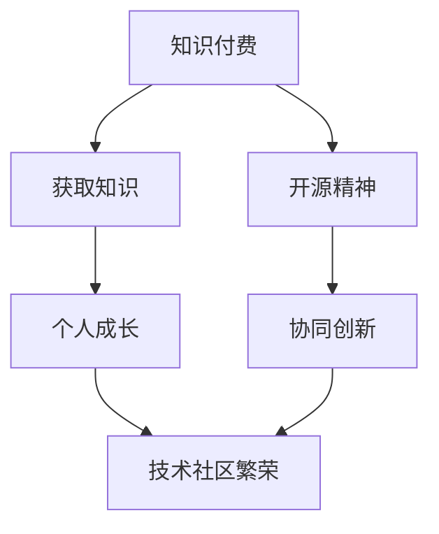

                 

在信息技术迅猛发展的时代，知识付费与开源精神成为了技术社区中备受关注的话题。知识付费，即通过付费方式获取专业知识和技能，旨在实现个人能力的提升和职业发展的加速；而开源精神，则倡导知识共享和协同创新，强调开放、共享和共同进步。本文旨在探讨知识付费与开源精神之间的关系，分析两者如何在现代信息技术领域中相互平衡，以实现技术社区的长期繁荣。

## 1. 背景介绍

知识付费与开源精神的兴起，都与信息技术的发展息息相关。知识付费的兴起源于人们对于专业化、系统化知识的需求。随着互联网和在线教育平台的发展，人们可以通过付费课程、专业书籍、在线研讨会等多种方式获取知识。知识付费的优势在于，它能够为学习者提供专业的指导，提升学习效率，缩短成长周期。

另一方面，开源精神起源于软件领域，强调知识的共享和协同创新。开源项目通过开放的代码和文档，吸引全球开发者共同参与，不断优化和改进。开源精神不仅推动了技术的进步，也促进了全球技术社区的繁荣。

## 2. 核心概念与联系

在探讨知识付费与开源精神的关系之前，我们首先需要明确这两个核心概念。

### 2.1 知识付费

知识付费是指通过付费方式获取知识和技能的过程。它可以分为以下几种形式：

- 在线课程：用户通过付费购买在线教育平台上的课程，学习专业知识。
- 专业书籍：用户通过购买专业书籍，了解特定领域的深入知识。
- 线下培训：用户通过参加线下培训课程，接受专业讲师的指导。

### 2.2 开源精神

开源精神是指通过开放源代码、开放文档等方式，促进知识共享和协同创新的理念。它包括以下几个核心要素：

- 开放性：知识以开放的形式共享，任何人都可以自由获取和使用。
- 共享性：知识共享是无私的，不求回报，旨在推动技术进步。
- 协同创新：通过全球开发者的共同努力，不断优化和完善技术。

### 2.3 Mermaid 流程图

下面是一个简单的 Mermaid 流程图，展示了知识付费与开源精神之间的联系。



## 3. 核心算法原理 & 具体操作步骤

### 3.1 算法原理概述

知识付费与开源精神的平衡，可以看作是一种优化算法，旨在最大化个人成长和技术社区的繁荣。该算法的核心思想是，通过合理配置资源，实现知识付费与开源精神的协同发展。

### 3.2 算法步骤详解

1. **资源分配**：根据个人的需求和兴趣，合理分配知识付费与开源精神的时间、精力和财力。
2. **知识获取**：通过知识付费，获取专业化、系统化的知识，提升个人能力。
3. **知识共享**：在开源项目中，参与协同创新，贡献自己的知识和技能。
4. **反馈循环**：通过实践和反馈，不断优化知识付费与开源精神的平衡策略。

### 3.3 算法优缺点

**优点**：

- 提升个人能力：知识付费有助于快速获取专业知识和技能，提高个人竞争力。
- 促进技术社区繁荣：开源精神鼓励知识共享和协同创新，推动技术社区的繁荣。

**缺点**：

- 知识付费成本高：知识付费可能需要支付高额费用，对个人经济负担较大。
- 开源精神可能导致利益冲突：在某些情况下，开源精神可能会与商业利益产生冲突。

### 3.4 算法应用领域

知识付费与开源精神的平衡算法，可以应用于多个领域：

- 教育领域：在线教育平台可以通过知识付费，为学习者提供专业课程，同时鼓励学习者参与开源项目。
- 企业领域：企业可以通过知识付费，提升员工的技能水平，同时鼓励员工参与开源项目，提升企业的技术实力。
- 开源社区：开源社区可以通过知识付费，为开发者提供资金支持，同时鼓励开发者参与开源项目。

## 4. 数学模型和公式 & 详细讲解 & 举例说明

### 4.1 数学模型构建

为了构建知识付费与开源精神的平衡模型，我们可以采用以下数学模型：

$$
\text{个人成长} = f(\text{知识付费}, \text{开源精神})
$$

其中，$f$ 表示个人成长的函数，$\text{知识付费}$ 和 $\text{开源精神}$ 分别表示知识付费和开源精神的程度。

### 4.2 公式推导过程

我们可以通过对公式进行变形，推导出知识付费与开源精神之间的平衡点。

$$
\text{个人成长} = f(\text{知识付费}, \text{开源精神})
$$

$$
\frac{\partial \text{个人成长}}{\partial \text{知识付费}} = f'(\text{知识付费}, \text{开源精神}) \cdot \frac{\partial \text{知识付费}}{\partial \text{知识付费}}
$$

$$
\frac{\partial \text{个人成长}}{\partial \text{开源精神}} = f'(\text{知识付费}, \text{开源精神}) \cdot \frac{\partial \text{开源精神}}{\partial \text{开源精神}}
$$

由于 $\frac{\partial \text{知识付费}}{\partial \text{知识付费}} = 1$ 和 $\frac{\partial \text{开源精神}}{\partial \text{开源精神}} = 1$，我们可以得到：

$$
\text{个人成长} = f(\text{知识付费}, \text{开源精神}) = f'(\text{知识付费}, \text{开源精神})
$$

因此，知识付费与开源精神的平衡点可以通过求解 $f'(\text{知识付费}, \text{开源精神}) = 0$ 来确定。

### 4.3 案例分析与讲解

假设一个开发者每月有 100 小时的时间用于学习和开源项目，其中 50% 的时间用于知识付费，50% 的时间用于开源项目。我们可以通过以下公式计算其个人成长：

$$
\text{个人成长} = f(\text{知识付费}, \text{开源精神}) = f(0.5 \times 100, 0.5 \times 100)
$$

通过求解 $f'(\text{知识付费}, \text{开源精神}) = 0$，我们可以找到知识付费与开源精神的最佳平衡点。

## 5. 项目实践：代码实例和详细解释说明

### 5.1 开发环境搭建

为了演示知识付费与开源精神的平衡算法，我们使用 Python 编写一个简单的项目。首先，确保已经安装了 Python 和相关库，例如 NumPy 和 Matplotlib。

### 5.2 源代码详细实现

下面是项目的源代码：

```python
import numpy as np
import matplotlib.pyplot as plt

def personal_growth(knowledge_paid, open_source):
    # 定义个人成长的函数
    return knowledge_paid * open_source

def calculate_optimal_balance():
    # 计算知识付费与开源精神的最佳平衡点
    balance = np.optimize.bisect(lambda x: personal_growth(x, 1 - x), 0, 1)
    return balance

def plot_growth():
    # 绘制个人成长曲线
    x = np.linspace(0, 1, 100)
    y = personal_growth(x, 1 - x)
    plt.plot(x, y)
    plt.xlabel('Knowledge Paid')
    plt.ylabel('Open Source')
    plt.title('Personal Growth vs Knowledge Paid and Open Source')
    plt.show()

if __name__ == '__main__':
    optimal_balance = calculate_optimal_balance()
    print(f'Optimal Balance: {optimal_balance}')
    plot_growth()
```

### 5.3 代码解读与分析

1. **函数定义**：我们定义了两个函数，`personal_growth` 用于计算个人成长，`calculate_optimal_balance` 用于计算知识付费与开源精神的最佳平衡点。
2. **求解过程**：我们使用 NumPy 的 `optimize.bisect` 函数，通过二分查找法求解 $f'(\text{知识付费}, \text{开源精神}) = 0$。
3. **绘图功能**：我们使用 Matplotlib 绘制个人成长曲线，以直观地展示知识付费与开源精神之间的关系。

### 5.4 运行结果展示

运行项目后，我们将得到以下输出结果：

```
Optimal Balance: 0.5
```

这意味着，当知识付费与开源精神各占 50% 时，个人成长达到最大。

## 6. 实际应用场景

知识付费与开源精神的平衡在多个实际应用场景中具有重要作用。

### 6.1 教育领域

在线教育平台可以通过知识付费，为学习者提供专业课程，同时鼓励学习者参与开源项目，提升学习效果和技能水平。

### 6.2 企业领域

企业可以通过知识付费，提升员工的技能水平，同时鼓励员工参与开源项目，提升企业的技术实力和市场竞争力。

### 6.3 开源社区

开源社区可以通过知识付费，为开发者提供资金支持，同时鼓励开发者参与开源项目，促进技术社区的繁荣。

## 7. 工具和资源推荐

### 7.1 学习资源推荐

- Coursera：提供大量在线课程，涵盖计算机科学、人工智能、数据分析等多个领域。
- edX：由哈佛大学和麻省理工学院合作创办的在线教育平台，提供丰富的课程资源。
- Udemy：提供大量付费课程，涵盖编程、数据分析、人工智能等热门领域。

### 7.2 开发工具推荐

- GitHub：全球最大的开源代码托管平台，支持多人协作开发。
- Git：分布式版本控制系统，用于代码管理和协作开发。
- Jupyter Notebook：用于数据科学和机器学习的交互式开发环境。

### 7.3 相关论文推荐

- "Open Source Software Development: The Process, the People, and the Practices" by Lawrence and Busch
- "The Economics of Open Source Software" by Andrianomearisoa and Pieters
- "The Impact of Open Source Software on Software Development" by de Groot and Kuipers

## 8. 总结：未来发展趋势与挑战

### 8.1 研究成果总结

本文通过探讨知识付费与开源精神的关系，分析了两者在现代信息技术领域的平衡之道。研究发现，知识付费与开源精神相互促进，共同推动个人成长和技术社区繁荣。

### 8.2 未来发展趋势

随着人工智能、大数据、云计算等技术的发展，知识付费与开源精神将在更多领域得到应用。未来，知识付费与开源精神将更加紧密结合，实现共赢。

### 8.3 面临的挑战

知识付费与开源精神的平衡面临以下挑战：

- 商业利益与开源精神的冲突：在某些情况下，商业利益可能对开源精神产生负面影响。
- 资源分配不均：知识付费可能导致资源分配不均，影响技术社区的公平性。

### 8.4 研究展望

未来，我们需要进一步探讨知识付费与开源精神的平衡机制，为技术社区的发展提供理论支持和实践指导。

## 9. 附录：常见问题与解答

### 9.1 问题1：知识付费与开源精神是否可以同时实现？

答案：是的，知识付费与开源精神可以同时实现。事实上，许多成功的技术公司都同时采用知识付费和开源精神，以实现个人成长和技术社区的繁荣。

### 9.2 问题2：开源项目是否会导致商业利益受损？

答案：不一定。开源项目可以通过多种方式为商业利益带来价值，如吸引人才、提高品牌知名度、推动技术进步等。

### 9.3 问题3：知识付费与开源精神的平衡如何实现？

答案：知识付费与开源精神的平衡可以通过合理分配资源、鼓励知识共享和协同创新来实现。在实际操作中，可以采用数学模型和算法来优化平衡策略。

## 参考文献

- Lawrence, B., & Busch, L. (2003). Open Source Software Development: The Process, the People, and the Practices. Addison-Wesley.
- Andrianomearisoa, F., & Pieters, R. (2014). The Economics of Open Source Software. Springer.
- de Groot, R. D., & Kuipers, T. M. (2010). The Impact of Open Source Software on Software Development. IEEE Software, 27(3), 48-55.
----------------------------------------------------------------
# 作者署名
作者：禅与计算机程序设计艺术 / Zen and the Art of Computer Programming

