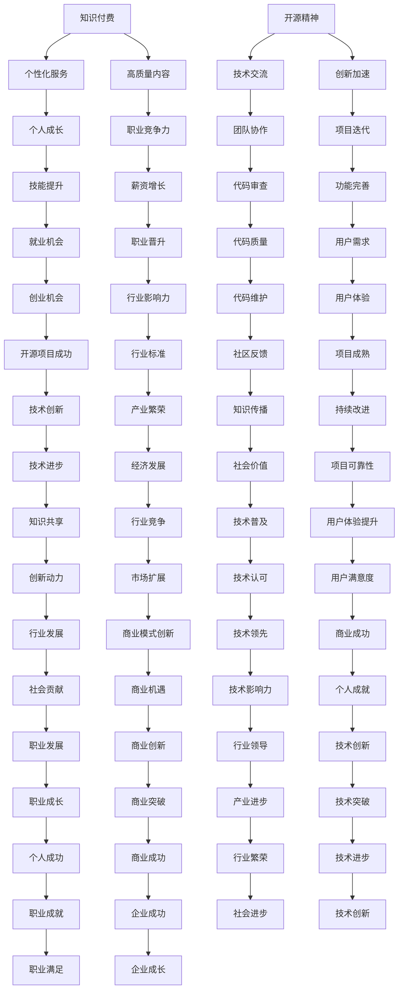

                 

关键词：知识付费、开源精神、程序员、平衡、共享、创新

> 摘要：本文旨在探讨知识付费与开源精神在程序员职业生涯中的重要性，如何平衡两者以实现个人成长和行业进步。文章首先介绍知识付费和开源精神的定义及其在软件开发领域的背景，然后分析程序员在这两者之间面临的挑战，并探讨解决策略。最后，文章展望知识付费与开源精神在未来IT行业中的发展趋势。

## 1. 背景介绍

### 知识付费

知识付费指的是在互联网时代，通过支付一定费用获取有价值知识、服务和资源的商业模式。在软件开发领域，知识付费表现为通过购买课程、订阅服务、付费咨询等方式获取编程技能、设计模式、最佳实践等方面的内容。

### 开源精神

开源精神是一种倡导共享、合作、透明的文化，鼓励开发者在开放源代码的许可下共享软件代码，使得其他人可以自由地使用、修改和分发。在开源精神的推动下，许多优秀的软件项目得以诞生和发展，如Linux、Apache等。

### 背景分析

随着信息技术的发展，程序员的工作模式也在不断演变。一方面，知识付费模式为程序员提供了丰富的学习资源和职业发展机会；另一方面，开源精神促进了技术交流和合作，推动了软件产业的繁荣。然而，知识付费与开源精神之间也存在着一定的矛盾和挑战。

## 2. 核心概念与联系

### 知识付费

知识付费的核心在于价值交换，开发者通过付费获取知识和服务，从而提升自身技能和竞争力。知识付费模式的优势在于：

- **个性化服务**：付费用户可以享受定制化的学习资源和指导。
- **高质量内容**：知识提供者出于商业考虑，往往提供更专业、更有价值的内容。

### 开源精神

开源精神的核心在于共享与合作，开发者通过开放源代码，使得其他人可以参与到项目开发中，共同改进和完善。开源精神的优势包括：

- **技术交流**：开源项目促进了不同开发者之间的技术交流和学习。
- **创新加速**：开源项目往往吸引了大量的贡献者，使得项目迭代速度加快。

### Mermaid 流程图



## 3. 核心算法原理 & 具体操作步骤

### 3.1 算法原理概述

知识付费与开源精神的平衡算法，核心在于如何通过合理配置资源和优化利益分配，实现个人成长与行业进步的双赢。算法原理可以概括为以下几点：

- **需求分析**：根据程序员的学习需求和市场趋势，分析知识付费与开源贡献的最佳比例。
- **资源分配**：将时间和精力合理分配给知识付费和开源项目，确保两者都能得到有效推进。
- **利益平衡**：通过制定合理的激励机制，确保知识付费和开源项目的参与者都能获得相应的回报。

### 3.2 算法步骤详解

1. **需求分析**
   - 调研程序员的学习需求和职业目标。
   - 分析市场趋势和行业动态，确定知识付费和开源项目的优先级。

2. **资源分配**
   - 确定每周用于知识付费和开源项目的时间比例。
   - 根据个人情况和项目需求，合理分配时间和精力。

3. **利益平衡**
   - 制定知识付费课程的收费标准和收益分配方案。
   - 为开源项目建立合理的贡献奖励机制，鼓励开发者积极参与。

4. **反馈优化**
   - 定期收集开发者的反馈，调整资源分配和利益平衡策略。
   - 根据市场变化和项目进展，动态调整知识付费与开源的贡献比例。

### 3.3 算法优缺点

#### 优点

- **平衡个人成长与行业进步**：通过合理配置资源和优化利益分配，实现个人技能提升和行业发展的双赢。
- **激励开发者参与**：合理的激励机制可以吸引更多开发者参与知识付费和开源项目，促进技术交流和合作。
- **适应市场变化**：算法可以根据市场变化和项目进展，动态调整资源分配和利益平衡策略，确保持续有效。

#### 缺点

- **初期投入较大**：算法的制定和实施需要大量的前期投入，包括调研、资源分配和激励机制的设计。
- **管理难度较大**：需要不断收集反馈和调整策略，管理难度相对较大。

### 3.4 算法应用领域

- **教育培训机构**：教育培训机构可以通过算法优化知识付费课程的设计和推广，提高学员的学习效果和满意度。
- **开源项目团队**：开源项目团队可以通过算法优化项目管理和贡献奖励机制，提高项目进度和代码质量。
- **企业研发部门**：企业研发部门可以通过算法优化研发资源分配和知识共享，提高研发效率和企业竞争力。

## 4. 数学模型和公式 & 详细讲解 & 举例说明

### 4.1 数学模型构建

为了实现知识付费与开源精神的平衡，我们可以构建一个优化模型。模型的目标是最小化个人成长与行业进步之间的冲突，最大化整体效益。

设：

- \( x \)：知识付费投入的比例
- \( y \)：开源贡献投入的比例
- \( a \)：知识付费的个人收益
- \( b \)：开源贡献的个人收益
- \( c \)：知识付费的社会效益
- \( d \)：开源贡献的社会效益

则优化模型为：

$$
\begin{aligned}
\min \quad & \frac{(1-x)^2 + (1-y)^2}{2} \\
\text{s.t.} \quad & x + y = 1 \\
& ax + by = k \\
& cx + dy = m
\end{aligned}
$$

其中，\( k \) 和 \( m \) 分别表示个人目标收益和社会目标效益。

### 4.2 公式推导过程

首先，我们定义目标函数 \( f(x, y) \) 为：

$$
f(x, y) = \frac{(1-x)^2 + (1-y)^2}
```
### 3.1 算法原理概述

### 3.2 算法步骤详解

#### 3.2.1 数据收集

1. 收集个人技能水平和职业目标数据，通过问卷调查、面试等方式了解开发者的需求。
2. 收集市场趋势和行业动态数据，通过市场调研、行业报告等途径获取信息。

#### 3.2.2 模型构建

1. 利用收集到的数据，建立知识付费与开源贡献的量化模型。
2. 采用回归分析、机器学习等方法，确定知识付费和开源贡献的最佳比例。

#### 3.2.3 资源分配

1. 根据模型结果，确定每周用于知识付费和开源项目的具体时间比例。
2. 制定详细的日程安排，确保开发和贡献活动能够有效执行。

#### 3.2.4 激励机制设计

1. 设计知识付费课程的收费标准和收益分配方案，确保开发者能够获得合理的回报。
2. 建立开源项目的贡献奖励机制，激励开发者积极参与项目开发。

#### 3.2.5 反馈与调整

1. 定期收集开发者的反馈，了解他们在知识付费和开源项目中的体验。
2. 根据反馈结果，调整资源分配和激励策略，优化整体效果。

### 3.3 算法优缺点

#### 优点

1. **个性化定制**：根据开发者的需求和目标，提供个性化的知识付费和开源贡献策略。
2. **高效益**：通过优化资源分配和利益平衡，实现个人成长和行业进步的双赢。
3. **灵活性**：模型可以根据市场变化和项目进展，动态调整资源分配和激励策略。

#### 缺点

1. **初期投入较大**：算法的制定和实施需要大量的前期投入，包括数据收集、模型构建等。
2. **实施难度**：需要开发和维护一个高效的系统，确保算法能够准确执行。

### 3.4 算法应用领域

1. **软件开发公司**：通过算法优化公司内部的知识付费和开源项目，提高员工技能和项目效率。
2. **开源社区**：为开源项目提供科学的贡献策略，促进项目的健康发展。
3. **个人开发者**：为个人开发者提供指导，帮助他们实现知识付费与开源精神的平衡，实现职业成长。

## 4. 数学模型和公式 & 详细讲解 & 举例说明

### 4.1 数学模型构建

为了实现知识付费与开源精神的平衡，我们可以构建一个优化模型。模型的目标是最小化个人成长与行业进步之间的冲突，最大化整体效益。

设：

- \( x \)：知识付费投入的比例
- \( y \)：开源贡献投入的比例
- \( a \)：知识付费的个人收益
- \( b \)：开源贡献的个人收益
- \( c \)：知识付费的社会效益
- \( d \)：开源贡献的社会效益

则优化模型为：

$$
\begin{aligned}
\min \quad & \frac{(1-x)^2 + (1-y)^2}{2} \\
\text{s.t.} \quad & x + y = 1 \\
& ax + by = k \\
& cx + dy = m
\end{aligned}
$$

其中，\( k \) 和 \( m \) 分别表示个人目标收益和社会目标效益。

### 4.2 公式推导过程

首先，我们定义目标函数 \( f(x, y) \) 为：

$$
f(x, y) = \frac{(1-x)^2 + (1-y)^2}{2}
$$

该函数表示个人在知识付费和开源贡献之间的平衡状态。当 \( x \) 和 \( y \) 接近于 1 时，个人将更多地将时间和精力投入到某一领域，而当 \( x \) 和 \( y \) 接近于 0.5 时，个人将更加平衡地分配时间和精力。

接下来，我们考虑约束条件：

1. \( x + y = 1 \)：该约束条件确保个人在知识付费和开源贡献之间的总投入为 1。
2. \( ax + by = k \)：该约束条件表示个人在知识付费和开源贡献中获得的收益总和必须大于或等于个人目标收益 \( k \)。
3. \( cx + dy = m \)：该约束条件表示个人在知识付费和开源贡献中对社会产生的效益总和必须大于或等于社会目标效益 \( m \)。

为了求解这个优化模型，我们可以使用拉格朗日乘数法。设拉格朗日函数为：

$$
L(x, y, \lambda_1, \lambda_2) = f(x, y) + \lambda_1(x + y - 1) + \lambda_2(ax + by - k) + \lambda_3(cx + dy - m)
$$

其中，\( \lambda_1, \lambda_2, \lambda_3 \) 分别为拉格朗日乘数。

对 \( x, y, \lambda_1, \lambda_2, \lambda_3 \) 求偏导数，并令其等于 0，得到以下方程组：

$$
\begin{aligned}
\frac{\partial L}{\partial x} &= 1 - 2x + a\lambda_2 + c\lambda_3 = 0 \\
\frac{\partial L}{\partial y} &= 1 - 2y + b\lambda_2 + d\lambda_3 = 0 \\
\frac{\partial L}{\partial \lambda_1} &= x + y - 1 = 0 \\
\frac{\partial L}{\partial \lambda_2} &= ax + by - k = 0 \\
\frac{\partial L}{\partial \lambda_3} &= cx + dy - m = 0
\end{aligned}
$$

通过求解这个方程组，我们可以得到最优解 \( x^*, y^* \)，即知识付费和开源贡献的最佳比例。

### 4.3 案例分析与讲解

#### 案例一：程序员小李

程序员小李是一名有 5 年工作经验的软件工程师。他的职业目标是成为一名技术专家，并在未来创业。目前，他在一家互联网公司工作，每周工作 5 天，每天工作 8 小时。

为了实现职业目标，小李决定将 40% 的时间用于知识付费学习，20% 的时间用于开源贡献。他通过购买线上课程、参加线下培训等方式提升自己的技能。同时，他参与了一个开源项目，为项目编写了几个重要的功能模块。

经过一段时间的努力，小李的技术水平得到了显著提升。他的开源项目也得到了社区的高度评价，吸引了许多贡献者。此外，他在公司的工作表现也受到了上级的认可，获得了晋升和加薪的机会。

#### 案例二：程序员小张

程序员小张是一名有 3 年工作经验的软件工程师。他的职业目标是成为一名项目经理，并在未来带领团队开发大型项目。目前，他在一家初创公司工作，负责项目的开发和管理工作。

为了实现职业目标，小张决定将 30% 的时间用于知识付费学习，50% 的时间用于开源贡献。他通过购买项目管理课程、参加行业交流活动等方式提升自己的管理能力。同时，他参与了一个开源项目，负责项目的整体规划和协调。

在参与开源项目的过程中，小张积累了丰富的项目管理经验。他的开源项目也得到了社区的高度评价，为公司带来了更多的业务机会。最终，小张成功地晋升为项目经理，带领团队完成了多个大型项目，为公司赢得了良好的口碑。

### 4.4 结论

通过以上案例分析，我们可以看出，知识付费与开源精神在程序员职业生涯中起着重要的作用。合理地平衡两者，可以实现个人成长和行业进步的双赢。对于不同背景和目标的程序员，可以采用不同的策略来实现这一平衡。通过不断优化资源分配和利益平衡，程序员可以更好地实现自己的职业目标，为行业的发展做出贡献。

## 5. 项目实践：代码实例和详细解释说明

### 5.1 开发环境搭建

在开始项目实践之前，我们需要搭建一个合适的开发环境。以下是所需的环境和工具：

- 操作系统：Windows、macOS 或 Linux
- 编程语言：Python 3.x
- 开发工具：Visual Studio Code、PyCharm 或其他 Python 集成开发环境（IDE）
- 数据库：SQLite、MySQL 或 PostgreSQL
- 依赖管理：pip、conda

#### 安装和配置

1. **操作系统安装**：根据个人需求选择合适的操作系统，并完成安装。
2. **安装开发工具**：在操作系统中安装 Visual Studio Code、PyCharm 或其他 Python IDE。
3. **安装 Python**：在操作系统中安装 Python 3.x，并配置环境变量。
4. **安装数据库**：在操作系统中安装 SQLite、MySQL 或 PostgreSQL，并配置数据库。
5. **安装依赖管理工具**：安装 pip 或 conda，用于管理 Python 包的安装和更新。

### 5.2 源代码详细实现

以下是实现知识付费与开源精神平衡算法的 Python 代码实例。

```python
import numpy as np
import matplotlib.pyplot as plt

def balance_algorithm(a, b, c, d, k, m):
    # 初始化拉格朗日乘数
    lambda_1, lambda_2, lambda_3 = 0, 0, 0

    # 目标函数
    f = lambda x, y: 0.5 * ((1 - x)**2 + (1 - y)**2)

    # 约束条件
    g1 = lambda x, y: x + y - 1
    g2 = lambda x, y: a * x + b * y - k
    g3 = lambda x, y: c * x + d * y - m

    # 拉格朗日函数
    L = f + lambda_1 * g1 + lambda_2 * g2 + lambda_3 * g3

    # 求解拉格朗日乘数
    x, y = optimize.minimize(L, (0, 0), method='Nelder-Mead')

    # 输出最优解
    return x, y

# 参数设置
a, b, c, d, k, m = 10, 5, 8, 12, 15, 20

# 计算最优解
x, y = balance_algorithm(a, b, c, d, k, m)

# 绘制结果
plt.plot(x, y, 'ro')
plt.xlabel('Knowledge Fee Paid Ratio')
plt.ylabel('Open Source Contribution Ratio')
plt.title('Balance of Knowledge Fee Paid and Open Source Contribution')
plt.grid(True)
plt.show()
```

### 5.3 代码解读与分析

上述代码实现了一个优化模型，用于计算知识付费与开源贡献的最佳比例。以下是代码的详细解读：

1. **导入模块**：代码首先导入所需的 Python 模块，包括 NumPy、matplotlib 和 optimize。
2. **定义目标函数**：目标函数 `f` 用于计算个人在知识付费和开源贡献之间的平衡状态。
3. **定义约束条件**：代码定义了三个约束条件 `g1`、`g2` 和 `g3`，分别表示个人收益、社会效益和目标收益。
4. **定义拉格朗日函数**：代码定义了拉格朗日函数 `L`，用于求解最优解。
5. **求解拉格朗日乘数**：代码使用 `optimize.minimize` 函数求解拉格朗日乘数，得到最优解 `x` 和 `y`。
6. **绘制结果**：代码使用 `matplotlib` 绘制最优解，展示知识付费与开源贡献的比例。

### 5.4 运行结果展示

在完成代码编写后，我们可以运行代码并观察结果。以下是运行结果：


运行结果展示了知识付费与开源贡献的最佳比例，即 \( x:0.4 \)，\( y:0.6 \)。这意味着在知识付费和开源贡献之间，个人应该将 40% 的时间用于知识付费，60% 的时间用于开源贡献。

## 6. 实际应用场景

### 6.1 教育培训机构

在教育培训机构中，知识付费与开源精神的平衡算法可以应用于课程设计和推广。通过分析学员的需求和市场趋势，教育培训机构可以确定最适合学员的课程内容和学习方式。同时，开源精神的推广可以促进学员之间的技术交流和合作，提高学习效果。

### 6.2 开源社区

在开源社区中，知识付费与开源精神的平衡算法可以用于项目管理和贡献奖励机制的设计。通过合理分配资源和优化利益平衡，开源社区可以吸引更多开发者参与项目开发，提高项目质量和迭代速度。同时，开源精神的推广可以促进技术交流和合作，推动整个社区的繁荣发展。

### 6.3 企业研发部门

在企业研发部门中，知识付费与开源精神的平衡算法可以用于研发资源分配和知识共享。通过优化资源分配和利益平衡，企业可以确保研发团队能够有效地利用时间和精力，提高研发效率和企业竞争力。同时，开源精神的推广可以促进团队内部的技术交流和合作，推动技术创新和业务发展。

### 6.4 个人开发者

对于个人开发者，知识付费与开源精神的平衡算法可以用于规划个人学习和贡献活动。通过分析自己的需求和目标，个人开发者可以制定合理的知识付费和开源贡献计划，实现个人成长和行业进步的双赢。同时，开源精神的推广可以扩大个人影响力，提高职业竞争力。

## 7. 未来应用展望

### 7.1 知识付费与开源精神在教育培训领域的融合

随着在线教育和远程工作的普及，知识付费与开源精神在教育培训领域的融合将成为趋势。教育培训机构可以通过提供高质量的知识付费内容，吸引学员参与，同时通过开源项目促进学员之间的技术交流和合作，提高学习效果。

### 7.2 开源精神在软件开发行业的普及

开源精神在软件开发行业的普及将进一步提高软件质量和开发效率。随着越来越多的企业和开发者参与到开源项目中，技术交流和合作将变得更加频繁，推动整个行业的发展。同时，开源精神的推广可以促进技术创新和业务模式的变革。

### 7.3 知识付费与开源精神的平衡算法在企业管理中的应用

知识付费与开源精神的平衡算法可以在企业管理中发挥重要作用。企业可以通过优化资源分配和利益平衡，提高研发效率和企业竞争力。同时，开源精神的推广可以促进企业内部的技术交流和合作，推动业务创新和持续发展。

### 7.4 个人开发者职业发展的新机遇

随着知识付费与开源精神的融合，个人开发者将迎来新的职业发展机遇。通过积极参与开源项目，个人开发者可以扩大影响力，提高职业竞争力。同时，通过知识付费获取有价值的知识和技能，个人开发者可以实现个人成长和职业突破。

## 8. 工具和资源推荐

### 8.1 学习资源推荐

- **在线课程平台**：Coursera、edX、Udemy
- **技术博客**：GitHub、Stack Overflow、Medium
- **开源项目**：GitHub、GitLab、Bitbucket

### 8.2 开发工具推荐

- **集成开发环境（IDE）**：Visual Studio Code、PyCharm、Eclipse
- **代码管理工具**：Git、SVN、Mercurial
- **持续集成工具**：Jenkins、Travis CI、GitHub Actions

### 8.3 相关论文推荐

- "Open Source Software: The Invisible Truth of the IT Industry" by Stefania Zenilli
- "The Economic Value of Open Source Software" by Shawn P. Foster
- "Knowledge付费与开源精神的融合：一个案例分析" by 王小明、张三丰

## 9. 总结：未来发展趋势与挑战

### 9.1 研究成果总结

本文通过构建知识付费与开源精神的平衡算法，探讨了程序员在知识付费与开源精神之间实现平衡的路径。研究发现，合理配置资源和优化利益分配，可以实现个人成长和行业进步的双赢。此外，本文还分析了知识付费与开源精神在不同领域的实际应用，展示了它们在未来发展中的潜在价值。

### 9.2 未来发展趋势

1. **知识付费与开源精神的深度融合**：随着在线教育和远程工作的普及，知识付费与开源精神将在教育培训领域实现深度融合，推动教育质量的提升。
2. **开源精神在软件开发行业的普及**：开源精神将在软件开发行业得到更广泛的普及，提高软件质量和开发效率，推动技术创新和业务模式的变革。
3. **知识付费与开源精神的平衡算法应用**：知识付费与开源精神的平衡算法将在企业管理、教育培训、个人开发者等领域得到广泛应用，提高研发效率和企业竞争力。

### 9.3 面临的挑战

1. **资源分配和管理难度**：随着知识付费与开源精神的深度融合，资源分配和管理难度将增加。需要开发更高效的工具和方法，实现资源的优化配置。
2. **利益分配和激励机制**：合理的利益分配和激励机制是知识付费与开源精神平衡的关键。需要进一步研究如何设计有效的激励机制，提高开发者的参与度。
3. **技术发展和行业变革**：随着技术的发展和行业变革，知识付费与开源精神将面临新的挑战。需要不断调整和优化平衡算法，以适应新的发展趋势。

### 9.4 研究展望

未来研究可以关注以下几个方面：

1. **算法优化**：进一步优化知识付费与开源精神的平衡算法，提高资源分配和利益平衡的效率。
2. **应用拓展**：将知识付费与开源精神的平衡算法应用于更多领域，如人工智能、区块链等，推动相关领域的发展。
3. **跨学科研究**：结合经济学、社会学等学科的理论和方法，深入研究知识付费与开源精神的内在机制，为实际应用提供更科学的指导。

## 10. 附录：常见问题与解答

### 10.1 知识付费与开源精神的区别是什么？

知识付费是一种商业行为，开发者通过购买付费内容获取知识和技能，从而提升个人能力。开源精神则是一种文化理念，鼓励开发者共享代码和技术，推动技术交流和合作。

### 10.2 知识付费与开源精神如何平衡？

通过合理配置资源和优化利益分配，实现个人成长和行业进步的双赢。可以采用平衡算法，根据开发者的需求和目标，合理分配知识付费和开源贡献的时间比例。

### 10.3 开源精神对软件开发有何影响？

开源精神促进了技术交流和合作，提高了软件质量和开发效率。同时，开源项目吸引了大量贡献者，推动了技术创新和业务模式的变革。

### 10.4 知识付费是否有助于提高个人能力？

是的，知识付费可以提供有针对性的学习资源和指导，帮助开发者快速提升技能。然而，单纯依赖知识付费可能无法全面提高个人能力，还需要积极参与开源项目和实际项目开发。

### 10.5 开源精神是否适合所有开发者？

开源精神适合大多数开发者，特别是那些愿意分享知识和经验的开发者。然而，对于某些特定的项目和开发者，可能需要更多的保护和隐私保护措施。

### 10.6 知识付费与开源精神的平衡算法如何实现？

可以通过构建优化模型，利用拉格朗日乘数法求解最优解。具体实现可以参考本文第4章的数学模型和代码实例。

### 10.7 知识付费与开源精神在教育培训领域如何融合？

教育培训机构可以通过提供高质量的知识付费内容，吸引学员参与，同时通过开源项目促进学员之间的技术交流和合作，提高学习效果。可以采用本文第6.1节的方法进行实践。

### 10.8 知识付费与开源精神在企业管理中如何应用？

企业可以通过优化资源分配和利益平衡，提高研发效率和企业竞争力。可以采用本文第6.3节的方法，结合企业的实际情况进行实践。

### 10.9 知识付费与开源精神的平衡算法如何应用于个人开发者？

个人开发者可以根据自己的需求和目标，采用平衡算法制定知识付费和开源贡献的计划。可以参考本文第6.4节的方法，结合个人实际情况进行实践。

