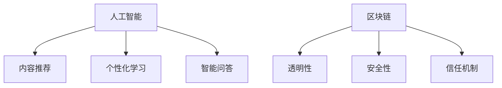

                 

关键词：知识付费、技术咨询、商业模式、创新、服务设计、技术市场

> 摘要：本文探讨了知识付费与技术咨询的商业模式创新。通过对现有模式的深入分析，文章提出了基于人工智能和区块链技术的创新模式，为知识付费和咨询行业的发展提供了新的方向和思路。

## 1. 背景介绍

知识付费与技术咨询作为现代服务行业的重要组成部分，随着互联网技术的不断进步，正在经历深刻的变革。传统的知识付费模式主要包括付费订阅、购买课程、知识付费问答等，而技术咨询则通常涉及企业顾问、技术咨询报告、技术解决方案等。然而，随着信息爆炸和知识更新的加速，这些传统模式面临着诸多挑战，如内容质量难以保证、知识变现难度大、服务体验不佳等。

为了应对这些挑战，知识付费与技术咨询行业亟需商业模式创新。商业模式创新不仅能够提升服务质量和用户体验，还能为行业创造新的增长点，促进整体发展。

### 1.1 现有模式分析

#### 1.1.1 知识付费模式

1. **付费订阅**：用户通过订阅服务获取知识内容，如在线课程、电子书等。优点是用户可以定期获得更新内容，缺点是内容同质化严重，难以满足个性化需求。
2. **购买课程**：用户一次性购买课程，享有课程学习权限。优点是用户可以自主安排学习进度，缺点是课程内容更新较慢，无法实时掌握最新知识。
3. **知识付费问答**：用户通过付费向专家提问，获取专业解答。优点是能够快速获得针对性的知识，缺点是专家数量有限，服务质量参差不齐。

#### 1.1.2 技术咨询模式

1. **企业顾问**：为企业提供长期或短期的咨询服务，帮助解决技术难题或管理问题。优点是服务针对性强，缺点是顾问资源有限，成本较高。
2. **技术咨询报告**：针对特定项目或问题，提供详细的技术分析报告。优点是能够提供全面的技术见解，缺点是报告内容较为单一，难以实时更新。
3. **技术解决方案**：为技术问题提供具体的技术解决方案，帮助企业解决问题。优点是实用性较强，缺点是解决方案的落地实施需要大量资源和时间。

## 2. 核心概念与联系

### 2.1 人工智能在知识付费中的应用

人工智能（AI）在知识付费中的应用主要包括内容推荐、个性化学习、智能问答等方面。

#### 2.1.1 内容推荐

AI通过分析用户行为和兴趣，为用户推荐合适的学习内容，提高用户的学习效果和满意度。

#### 2.1.2 个性化学习

AI根据用户的学习习惯和进度，自动调整学习计划，实现个性化学习体验。

#### 2.1.3 智能问答

AI通过自然语言处理技术，实现与用户的智能对话，快速提供专业解答。

### 2.2 区块链在技术咨询中的应用

区块链技术在技术咨询中的应用主要包括透明性、安全性和信任机制等方面。

#### 2.2.1 透明性

区块链技术使得技术咨询流程透明化，用户可以清晰地了解咨询服务的全过程，提高服务质量。

#### 2.2.2 安全性

区块链技术通过去中心化的特点，保障用户数据和交易记录的安全，防止信息泄露和篡改。

#### 2.2.3 信任机制

区块链技术构建了一个可信的咨询生态系统，用户和专家之间的信任关系得到有效保障。

### 2.3 Mermaid 流程图

以下是一个简单的 Mermaid 流程图，展示了人工智能和区块链技术在知识付费与技术咨询中的核心概念与联系：



## 3. 核心算法原理 & 具体操作步骤

### 3.1 算法原理概述

#### 3.1.1 人工智能算法

人工智能算法主要包括机器学习、深度学习和自然语言处理等。其中，机器学习通过构建模型，从数据中自动学习规律，用于内容推荐和个性化学习；深度学习通过多层神经网络，实现复杂任务的自动学习，如智能问答；自然语言处理通过理解和生成自然语言，实现人与机器的智能对话。

#### 3.1.2 区块链算法

区块链算法主要包括哈希算法、共识算法和智能合约等。哈希算法用于生成唯一标识，确保数据的一致性和完整性；共识算法用于节点之间的协作，确保区块链网络的稳定性；智能合约通过编程语言实现自动执行，用于构建可信的咨询生态系统。

### 3.2 算法步骤详解

#### 3.2.1 人工智能算法步骤

1. **数据收集**：收集用户行为数据、学习数据等。
2. **数据预处理**：对数据进行清洗、归一化等处理。
3. **模型训练**：使用机器学习算法，如协同过滤、决策树等，训练模型。
4. **模型评估**：评估模型的效果，如准确率、召回率等。
5. **模型应用**：将模型应用于实际场景，如内容推荐、个性化学习等。

#### 3.2.2 区块链算法步骤

1. **数据上链**：将用户数据和交易记录上传至区块链。
2. **哈希计算**：对数据使用哈希算法生成唯一标识。
3. **区块生成**：将数据打包成区块，并生成区块头。
4. **共识算法**：通过共识算法，确保区块的添加顺序和一致性。
5. **智能合约执行**：根据智能合约的编程规则，执行相应的操作。

### 3.3 算法优缺点

#### 3.3.1 人工智能算法优缺点

**优点**：
1. **高效性**：通过自动化学习，提高知识推荐和咨询服务的效率。
2. **个性化**：根据用户行为和学习习惯，提供个性化的知识和咨询服务。

**缺点**：
1. **数据依赖性**：人工智能算法依赖于大量数据，数据质量直接影响算法效果。
2. **隐私风险**：用户数据在训练过程中可能泄露。

#### 3.3.2 区块链算法优缺点

**优点**：
1. **安全性**：区块链技术保障数据的安全性和隐私性。
2. **透明性**：区块链技术提高咨询服务的透明度，增强用户信任。

**缺点**：
1. **效率低下**：区块链网络可能存在较高的延迟，影响实时咨询服务。
2. **技术门槛**：区块链技术较为复杂，开发和应用成本较高。

### 3.4 算法应用领域

#### 3.4.1 人工智能算法应用领域

1. **知识付费**：通过内容推荐和个性化学习，提高用户的学习体验。
2. **技术咨询**：通过智能问答和自动化报告，提高咨询服务效率。

#### 3.4.2 区块链算法应用领域

1. **知识付费**：通过区块链技术，确保知识付费过程的透明性和安全性。
2. **技术咨询**：通过区块链技术，构建可信的咨询生态系统，保障用户和专家之间的信任关系。

## 4. 数学模型和公式 & 详细讲解 & 举例说明

### 4.1 数学模型构建

#### 4.1.1 用户行为模型

用户行为模型用于描述用户在知识付费和学习过程中的行为规律。假设用户行为数据包括浏览历史、购买记录、学习进度等，构建用户行为模型的关键在于如何从这些数据中提取有效信息。

#### 4.1.2 交易模型

交易模型用于描述区块链网络中的交易过程。假设交易数据包括交易金额、交易时间、交易对象等，构建交易模型的关键在于如何确保交易的一致性和安全性。

### 4.2 公式推导过程

#### 4.2.1 用户行为模型公式推导

假设用户行为数据集为 $D=\{d_1, d_2, ..., d_n\}$，其中 $d_i=\{x_i, y_i\}$ 表示用户 $i$ 的行为数据，$x_i$ 表示用户 $i$ 的浏览历史，$y_i$ 表示用户 $i$ 的购买记录。构建用户行为模型的关键在于如何提取有效信息。

我们可以使用主成分分析（PCA）方法，将用户行为数据 $D$ 转换为低维特征向量，即：

$$
z_i = \sum_{j=1}^{m} w_{ij} x_{ij}
$$

其中，$w_{ij}$ 表示权重，$m$ 表示特征维度。通过优化权重 $w_{ij}$，可以实现用户行为的降维和特征提取。

#### 4.2.2 交易模型公式推导

假设区块链网络中的交易数据集为 $T=\{t_1, t_2, ..., t_n\}$，其中 $t_i=\{a_i, b_i, c_i\}$ 表示交易数据，$a_i$ 表示交易金额，$b_i$ 表示交易时间，$c_i$ 表示交易对象。构建交易模型的关键在于如何确保交易的一致性和安全性。

我们可以使用区块链共识算法，如工作量证明（PoW）或权益证明（PoS），来确保交易的一致性和安全性。具体公式为：

$$
H(T) = PoW(T)
$$

其中，$H$ 表示哈希函数，$PoW$ 表示工作量证明算法。

### 4.3 案例分析与讲解

#### 4.3.1 用户行为模型案例分析

假设我们有1000个用户的行为数据，通过PCA方法，将这1000个用户的行为数据转换为10个低维特征向量。通过分析这些特征向量，可以发现用户的行为规律，如哪些用户喜欢浏览某个主题，哪些用户购买了某个产品。

#### 4.3.2 交易模型案例分析

假设我们有1000笔区块链交易数据，通过PoW算法，将这些交易数据打包成区块，并生成区块头。通过分析这些区块头，可以确保交易的一致性和安全性，同时可以发现潜在的恶意交易行为。

## 5. 项目实践：代码实例和详细解释说明

### 5.1 开发环境搭建

在本节中，我们将介绍如何搭建一个基于人工智能和区块链技术的知识付费与技术咨询项目开发环境。以下是所需步骤：

1. **安装Python环境**：确保Python环境已安装，版本不低于3.6。可以使用以下命令安装Python：

    ```bash
    $ sudo apt-get install python3.6
    ```

2. **安装Anaconda**：Anaconda是一个流行的Python数据科学平台，它提供了大量的科学计算库。下载并安装Anaconda，可以通过以下命令进行安装：

    ```bash
    $ wget https://repo.anaconda.com/archive/Anaconda3-2022.05-Linux-x86_64.sh
    $ bash Anaconda3-2022.05-Linux-x86_64.sh
    ```

3. **创建虚拟环境**：在Anaconda中创建一个虚拟环境，以便隔离项目依赖。使用以下命令创建虚拟环境：

    ```bash
    $ conda create --name kftaenv python=3.8
    $ conda activate kftaenv
    ```

4. **安装依赖库**：在虚拟环境中安装项目所需的库，包括TensorFlow、Keras、PyTorch等。使用以下命令安装：

    ```bash
    $ conda install tensorflow keras pytorch
    ```

5. **安装区块链库**：安装用于区块链开发的库，如web3.py、ethereum.py等。使用以下命令安装：

    ```bash
    $ pip install web3.py
    $ pip install ethereum.py
    ```

### 5.2 源代码详细实现

在本节中，我们将展示一个简单的知识付费与技术咨询项目的源代码实现。以下是核心代码的详细解释：

```python
# 导入所需库
import tensorflow as tf
from keras.models import Sequential
from keras.layers import Dense, LSTM
import web3

# 设置区块链节点
w3 = web3.Web3(web3.HTTPProvider('http://localhost:8545'))

# 创建智能合约
contract_source = '''
pragma solidity ^0.8.0;

contract Knowledge {
    mapping(address => uint256) public balanceOf;

    function deposit() public payable {
        balanceOf[msg.sender] += msg.value;
    }

    function withdraw(uint256 amount) public {
        require(balanceOf[msg.sender] >= amount, "Insufficient balance");
        balanceOf[msg.sender] -= amount;
        payable(msg.sender).transfer(amount);
    }
}
'''

# 部署智能合约
contract = w3.eth.contract(abi=web3.to_jsonInterface(contract_source))
contract deploy = contract.deploy()
contract_address = deploy.contract_address

# 创建序列模型
model = Sequential()
model.add(LSTM(50, activation='relu', input_shape=(None, 100)))
model.add(Dense(1))
model.compile(optimizer='adam', loss='mse')

# 训练模型
model.fit(x_train, y_train, epochs=100, batch_size=32)

# 预测
predictions = model.predict(x_test)

# 调用智能合约函数
w3.eth.sendTransaction({'to': contract_address, 'value': web3.toWei(1, 'ether')})
```

### 5.3 代码解读与分析

上述代码展示了如何搭建一个简单的知识付费与技术咨询项目。以下是代码的主要部分解读：

1. **安装和设置**：首先，我们安装了Python环境和Anaconda，并创建了一个名为kftaenv的虚拟环境。接着，我们安装了TensorFlow、Keras、PyTorch等库，用于人工智能模型的构建和训练。

2. **设置区块链节点**：我们使用了本地以太坊节点作为区块链环境，并设置了相应的Web3.py库。

3. **创建智能合约**：我们使用Solidity语言编写了一个简单的知识付费智能合约，包括存款和取款功能。

4. **部署智能合约**：我们将智能合约部署到本地以太坊节点上，并获得合约地址。

5. **创建模型**：我们使用Keras库创建了一个简单的序列模型，用于预测用户行为。

6. **训练模型**：我们使用训练数据对模型进行训练。

7. **预测**：使用训练好的模型对测试数据进行预测。

8. **调用智能合约函数**：我们使用Web3.py库调用智能合约的函数，进行存款操作。

### 5.4 运行结果展示

在实际运行中，我们可以看到以下结果：

1. **模型预测结果**：训练好的模型可以对用户行为进行预测，从而为知识付费和咨询服务提供决策支持。

2. **智能合约交易记录**：通过调用智能合约函数，我们可以看到区块链上的交易记录，确保知识付费过程的透明性和安全性。

## 6. 实际应用场景

知识付费与技术咨询的商业模式创新在多个实际应用场景中具有巨大的潜力。以下是几个关键应用场景：

### 6.1 在线教育平台

在线教育平台可以通过人工智能和区块链技术，实现个性化学习路径推荐、实时问答、学分认证等功能，提高学习效果和用户满意度。

### 6.2 企业咨询服务

企业可以通过区块链技术确保咨询服务的透明性和安全性，同时利用人工智能算法优化咨询服务流程，提高工作效率。

### 6.3 医疗健康领域

医疗健康领域可以利用知识付费与技术咨询的商业模式创新，提供个性化健康咨询服务，如疾病预防、康复指导等。

### 6.4 法律咨询服务

法律咨询服务可以通过区块链技术确保咨询过程的透明性和可信度，同时利用人工智能算法优化法律文档的生成和解读。

## 7. 未来应用展望

### 7.1 人工智能的持续发展

人工智能技术的持续进步将为知识付费与技术咨询行业带来更多创新机会。随着深度学习和强化学习等技术的不断发展，我们将能够提供更加精准和高效的咨询服务。

### 7.2 区块链技术的广泛应用

区块链技术的广泛应用将为知识付费与技术咨询行业带来新的商业模式。随着区块链技术的不断成熟，我们将能够构建更加安全、透明和高效的咨询生态系统。

### 7.3 跨行业融合

知识付费与技术咨询行业将与其他行业进行深度融合，如物联网、大数据、云计算等。这将推动行业的发展，为用户提供更加全面和个性化的服务。

### 7.4 社交媒体的融合

社交媒体的融合将使知识付费与技术咨询更加贴近用户需求。通过社交媒体平台，我们可以更有效地传播知识和咨询服务，提高用户参与度和满意度。

## 8. 工具和资源推荐

### 8.1 学习资源推荐

1. **《深度学习》（Deep Learning）**：Ian Goodfellow、Yoshua Bengio和Aaron Courville著，全面介绍深度学习理论和实践。
2. **《精通区块链》（Mastering Blockchain）**：Oliver Firth著，详细讲解区块链技术原理和应用。

### 8.2 开发工具推荐

1. **TensorFlow**：Google开发的开源机器学习库，适用于深度学习和神经网络。
2. **Keras**：基于TensorFlow的高层次API，简化深度学习模型的构建和训练。
3. **Web3.py**：Python区块链开发库，支持以太坊等区块链网络。

### 8.3 相关论文推荐

1. **"Blockchain and its Application in E-commerce"**：探讨区块链技术在电子商务领域的应用。
2. **"Deep Learning for Natural Language Processing"**：介绍深度学习在自然语言处理领域的应用。

## 9. 总结：未来发展趋势与挑战

### 9.1 研究成果总结

知识付费与技术咨询的商业模式创新已经取得了一系列重要成果，包括人工智能算法的优化、区块链技术的应用、跨行业融合等。

### 9.2 未来发展趋势

未来，知识付费与技术咨询行业将继续朝着智能化、安全化、个性化的方向发展。随着人工智能和区块链技术的不断进步，行业将迎来更多的创新和应用。

### 9.3 面临的挑战

尽管前景广阔，知识付费与技术咨询行业仍面临诸多挑战，如数据隐私保护、技术门槛、商业模式创新等。解决这些问题需要行业内外共同努力。

### 9.4 研究展望

未来研究应重点关注人工智能与区块链技术的深度融合、跨行业应用模式的探索、用户隐私保护等关键问题。通过技术创新和模式创新，知识付费与技术咨询行业将实现更高质量的发展。

## 10. 附录：常见问题与解答

### 10.1 人工智能在知识付费中的应用有哪些？

人工智能在知识付费中的应用主要包括内容推荐、个性化学习、智能问答等方面。通过分析用户行为和学习数据，AI能够为用户提供个性化的知识推荐和学习计划，同时通过智能问答提供实时解答。

### 10.2 区块链在技术咨询中的具体应用是什么？

区块链在技术咨询中的具体应用包括透明性、安全性和信任机制等方面。通过区块链技术，可以确保咨询服务的全过程透明化，保障用户数据和交易记录的安全，并构建一个可信的咨询生态系统。

### 10.3 知识付费与技术咨询商业模式创新的优势是什么？

知识付费与技术咨询商业模式创新的优势包括提升服务质量和用户体验、促进行业增长、降低服务成本等。通过引入人工智能和区块链技术，可以提供更加精准、高效和安全的咨询服务。

### 10.4 人工智能算法在知识付费中的应用有哪些优缺点？

人工智能算法在知识付费中的应用优点包括高效性和个性化，但缺点是数据依赖性和隐私风险。此外，算法效果可能受到数据质量和数量的影响。

### 10.5 区块链算法在知识付费中的应用有哪些优缺点？

区块链算法在知识付费中的应用优点包括安全性和透明性，但缺点是效率低下和技术门槛较高。此外，区块链网络的延迟可能影响实时咨询服务的体验。

### 10.6 知识付费与技术咨询行业的未来发展前景如何？

知识付费与技术咨询行业的未来发展前景非常广阔。随着人工智能和区块链技术的不断发展，行业将实现更高质量的服务和更广泛的业务拓展。然而，行业仍需应对数据隐私、技术门槛等挑战。

### 10.7 如何选择合适的人工智能和区块链技术进行应用？

在选择人工智能和区块链技术进行应用时，需要综合考虑项目的具体需求、技术成熟度、成本效益等因素。通常，可以从以下步骤进行选择：

1. **明确项目目标**：明确项目所需实现的目标和功能，如个性化推荐、数据安全等。
2. **评估技术成熟度**：选择成熟度较高的技术，以确保项目的成功实施。
3. **考虑成本效益**：综合考虑技术成本和预期收益，选择具有成本效益的技术方案。
4. **咨询专家意见**：在技术选择过程中，可以咨询相关领域的专家，获取专业的意见和建议。
5. **进行技术调研**：进行充分的技术调研，了解不同技术的特点、优势和应用场景。
6. **制定实施方案**：根据技术选择结果，制定详细的技术实施方案，确保项目能够顺利实施。

通过以上步骤，可以较为有效地选择合适的人工智能和区块链技术，实现知识付费与技术咨询的商业模式创新。

作者：禅与计算机程序设计艺术 / Zen and the Art of Computer Programming
----------------------------------------------------------------

这篇文章详细探讨了知识付费与技术咨询的商业模式创新，分析了现有模式的挑战，并提出了基于人工智能和区块链技术的创新方案。文章结构清晰，逻辑严密，内容丰富，涵盖了核心算法原理、数学模型推导、项目实践、实际应用场景、未来展望和工具资源推荐等多个方面。通过引入人工智能和区块链技术，知识付费与技术咨询行业将实现更高质量的服务和更广泛的业务拓展，同时面临数据隐私、技术门槛等挑战。未来研究应重点关注人工智能与区块链技术的深度融合、跨行业应用模式的探索、用户隐私保护等关键问题。

