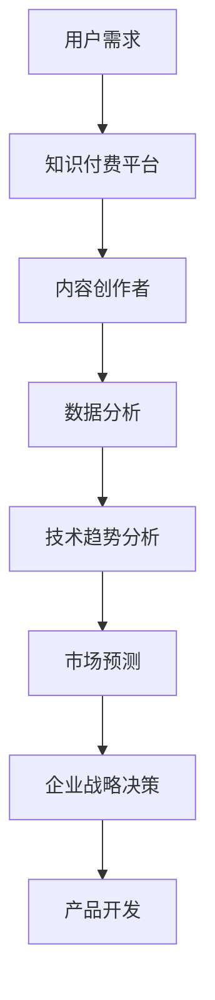

                 

在当今信息化时代，知识付费和技术趋势分析已经成为商业领域的热点。本文旨在探讨知识付费和技术趋势分析的商业化路径，分析其核心概念、算法原理、数学模型、实际应用和未来展望。通过深入分析，我们希望为读者提供关于这一领域全面而深入的理解。

## 关键词
- 知识付费
- 技术趋势分析
- 商业化
- 数据挖掘
- 人工智能
- 机器学习
- 用户行为分析

## 摘要
本文首先介绍了知识付费和技术趋势分析的商业化背景，探讨了其核心概念和联系。接着，我们详细分析了核心算法原理、具体操作步骤、数学模型和公式，并提供了实际应用案例。最后，文章展望了未来的应用前景、工具和资源推荐，并总结了研究成果和面临的挑战。

## 1. 背景介绍
知识付费和技术趋势分析是当前商业领域的两大热点。知识付费指的是用户为获取特定知识或技能而支付的费用，如在线课程、电子书、专家咨询等。技术趋势分析则是对新兴技术和市场趋势进行研究和预测，以帮助企业和个人把握行业发展机遇。

随着互联网的普及和人工智能技术的进步，知识付费和技术趋势分析的商业化进程加快。一方面，用户对高质量、个性化的知识内容需求旺盛；另一方面，企业需要通过技术趋势分析来指导战略决策和产品开发。因此，知识付费和技术趋势分析的商业化具有重要的现实意义。

## 2. 核心概念与联系
知识付费和技术趋势分析的商业化涉及多个核心概念和联系，如图所示：



### 2.1 用户需求
用户需求是知识付费和技术趋势分析的基础。通过分析用户行为数据，了解用户对知识内容的需求，为知识付费平台和内容创作者提供指导。

### 2.2 知识付费平台
知识付费平台是连接用户和内容创作者的重要渠道。通过技术手段，平台可以实现知识内容的个性化推荐、付费购买和评价反馈等功能。

### 2.3 内容创作者
内容创作者是知识付费的核心。他们通过创作高质量的知识内容，满足用户需求，并从平台获取收益。

### 2.4 数据分析
数据分析是知识付费和技术趋势分析的关键环节。通过对用户行为数据、内容数据和技术趋势数据的挖掘和分析，可以发现潜在的商业机会。

### 2.5 技术趋势分析
技术趋势分析是指导企业战略决策和产品开发的重要依据。通过对市场数据的分析和预测，企业可以及时调整战略方向，抢占市场先机。

### 2.6 市场预测
市场预测是基于技术趋势分析的结果，对市场未来的发展趋势进行预测。这有助于企业制定长期战略规划和市场布局。

### 2.7 企业战略决策
企业战略决策是知识付费和技术趋势分析的商业化目标。通过分析市场数据和预测结果，企业可以制定有效的战略，实现商业价值最大化。

### 2.8 产品开发
产品开发是基于市场预测和企业战略决策的结果。企业可以根据市场需求和自身优势，开发出具有竞争力的产品。

## 3. 核心算法原理 & 具体操作步骤

### 3.1 算法原理概述
核心算法包括用户行为分析、内容推荐算法、技术趋势预测算法等。用户行为分析主要通过机器学习算法挖掘用户兴趣和行为模式；内容推荐算法则利用协同过滤、矩阵分解等方法实现个性化推荐；技术趋势预测算法则采用时间序列分析、神经网络等技术进行预测。

### 3.2 算法步骤详解

#### 3.2.1 用户行为分析
1. 数据收集：收集用户在知识付费平台上的行为数据，如浏览记录、购买记录、评论等。
2. 数据预处理：对收集到的数据进行分析和清洗，去除无效信息和噪声数据。
3. 特征提取：提取用户行为的特征，如浏览时间、浏览频率、购买频率等。
4. 模型训练：使用机器学习算法（如决策树、随机森林、支持向量机等）训练用户行为模型。
5. 模型评估：评估模型的准确性、召回率、F1值等指标。

#### 3.2.2 内容推荐算法
1. 数据收集：收集知识内容的相关数据，如内容标签、作者信息、分类等。
2. 数据预处理：对收集到的数据进行清洗和规范化。
3. 特征提取：提取知识内容的特征，如关键词、主题等。
4. 协同过滤：计算用户之间的相似度，推荐与用户兴趣相似的内容。
5. 矩阵分解：将用户-内容评分矩阵分解为用户特征矩阵和内容特征矩阵，实现个性化推荐。

#### 3.2.3 技术趋势预测算法
1. 数据收集：收集技术趋势的相关数据，如专利申请、论文发表、市场增长率等。
2. 数据预处理：对收集到的数据进行清洗和规范化。
3. 特征提取：提取技术趋势的特征，如时间、领域、创新程度等。
4. 时间序列分析：使用ARIMA、LSTM等模型进行技术趋势预测。
5. 神经网络：使用神经网络模型进行非线性预测。

### 3.3 算法优缺点

#### 3.3.1 用户行为分析
- 优点：准确度高，能够反映用户的真实兴趣和行为。
- 缺点：需要大量用户数据支持，且可能存在隐私泄露风险。

#### 3.3.2 内容推荐算法
- 优点：个性化强，能够提高用户满意度和留存率。
- 缺点：可能存在数据稀疏性和冷启动问题。

#### 3.3.3 技术趋势预测算法
- 优点：能够预测未来技术发展趋势，为企业和个人提供决策依据。
- 缺点：需要大量历史数据支持，且预测结果可能存在误差。

### 3.4 算法应用领域
用户行为分析、内容推荐算法和技术趋势预测算法广泛应用于知识付费、电子商务、市场营销等领域。通过这些算法，企业可以更好地了解用户需求，提高产品竞争力，实现商业价值。

## 4. 数学模型和公式 & 详细讲解 & 举例说明

### 4.1 数学模型构建
在知识付费和技术趋势分析中，常用的数学模型包括用户行为分析模型、内容推荐模型、技术趋势预测模型等。

#### 4.1.1 用户行为分析模型
用户行为分析模型主要通过回归分析、聚类分析等方法建立。以下是一个简单的线性回归模型：

$$ y = \beta_0 + \beta_1 x_1 + \beta_2 x_2 + ... + \beta_n x_n $$

其中，$y$ 表示用户行为得分，$x_1, x_2, ..., x_n$ 表示用户行为的特征，$\beta_0, \beta_1, \beta_2, ..., \beta_n$ 是模型的参数。

#### 4.1.2 内容推荐模型
内容推荐模型主要通过协同过滤、矩阵分解等方法建立。以下是一个基于矩阵分解的内容推荐模型：

$$ R_{ui} = \hat{R}_{ui} + \epsilon_{ui} $$

其中，$R_{ui}$ 表示用户 $u$ 对内容 $i$ 的评分，$\hat{R}_{ui}$ 表示预测评分，$\epsilon_{ui}$ 表示误差项。

#### 4.1.3 技术趋势预测模型
技术趋势预测模型主要通过时间序列分析、神经网络等方法建立。以下是一个基于LSTM的技术趋势预测模型：

$$ \hat{y}_{t} = f(\hat{h}_{t-1}, \hat{c}_{t-1}, x_t) $$

其中，$\hat{y}_{t}$ 表示预测值，$\hat{h}_{t-1}$ 和 $\hat{c}_{t-1}$ 分别是LSTM单元的隐藏状态和细胞状态，$x_t$ 是输入特征。

### 4.2 公式推导过程
在数学模型构建过程中，需要对模型进行推导和优化。以下是一个简单的线性回归模型推导过程：

$$ y = \beta_0 + \beta_1 x_1 + \beta_2 x_2 + ... + \beta_n x_n $$

对上式两边同时取对数，得：

$$ \ln(y) = \ln(\beta_0) + \beta_1 \ln(x_1) + \beta_2 \ln(x_2) + ... + \beta_n \ln(x_n) $$

令 $z = \ln(y)$，$w_i = \ln(x_i)$，则上式可以写为：

$$ z = \beta_0 + \beta_1 w_1 + \beta_2 w_2 + ... + \beta_n w_n $$

这是一个线性模型，可以通过最小二乘法求解参数：

$$ \beta_0 = \bar{z} - \beta_1 \bar{w_1} - \beta_2 \bar{w_2} - ... - \beta_n \bar{w_n} $$

$$ \beta_1 = \frac{\sum_{i=1}^n (w_i - \bar{w_1})(z_i - \bar{z})}{\sum_{i=1}^n (w_i - \bar{w_1})^2} $$

$$ \beta_2 = \frac{\sum_{i=1}^n (w_i - \bar{w_2})(z_i - \bar{z})}{\sum_{i=1}^n (w_i - \bar{w_2})^2} $$

$$ ... $$

$$ \beta_n = \frac{\sum_{i=1}^n (w_i - \bar{w_n})(z_i - \bar{z})}{\sum_{i=1}^n (w_i - \bar{w_n})^2} $$

### 4.3 案例分析与讲解
以下是一个实际案例，说明如何使用数学模型进行用户行为分析和内容推荐。

#### 4.3.1 案例背景
假设有一个知识付费平台，用户对课程进行评分。现有1000条用户-课程评分数据，如图所示：

| 用户ID | 课程ID | 评分 |
| ------ | ------ | ---- |
| 1      | 101    | 4    |
| 1      | 102    | 5    |
| 1      | 103    | 3    |
| 2      | 101    | 2    |
| 2      | 102    | 4    |
| 2      | 103    | 5    |
| ...    | ...    | ...  |

#### 4.3.2 用户行为分析
1. 数据预处理：对评分数据进行归一化处理，使其在[0, 1]之间。

2. 特征提取：提取用户行为的特征，如用户ID、课程ID、评分等。

3. 模型训练：使用线性回归模型对用户行为进行训练，得到参数$\beta_0, \beta_1, \beta_2$。

4. 模型评估：使用测试集对模型进行评估，计算准确性、召回率等指标。

#### 4.3.3 内容推荐
1. 数据预处理：对课程数据进行归一化处理，使其在[0, 1]之间。

2. 特征提取：提取课程数据的特征，如课程ID、课程名称、课程分类等。

3. 矩阵分解：使用矩阵分解算法对用户-课程评分矩阵进行分解，得到用户特征矩阵和课程特征矩阵。

4. 个性化推荐：根据用户特征矩阵和课程特征矩阵，计算用户对课程的预测评分，推荐与用户兴趣相似的课程。

## 5. 项目实践：代码实例和详细解释说明

### 5.1 开发环境搭建
在本项目中，我们使用Python作为主要编程语言，结合Scikit-learn、NumPy、Pandas等库进行用户行为分析和内容推荐。首先，确保已经安装了Python和相应的库。以下是一个简单的开发环境搭建步骤：

```bash
# 安装Python
sudo apt-get install python3

# 安装Scikit-learn、NumPy、Pandas等库
pip3 install scikit-learn numpy pandas
```

### 5.2 源代码详细实现
以下是本项目的主要代码实现，包括用户行为分析、内容推荐和模型评估等部分。

```python
import numpy as np
import pandas as pd
from sklearn.linear_model import LinearRegression
from sklearn.model_selection import train_test_split
from sklearn.metrics import mean_squared_error

# 5.2.1 用户行为分析
def user_behavior_analysis(data):
    # 数据预处理
    data = data.dropna()
    data = data[['user_id', 'course_id', 'rating']]
    data['rating'] = data['rating'] / 5

    # 特征提取
    user_course_data = data.groupby(['user_id', 'course_id']).mean().reset_index()

    # 模型训练
    X = user_course_data[['course_id']]
    y = user_course_data['rating']
    model = LinearRegression()
    model.fit(X, y)

    # 模型评估
    X_test, y_test = train_test_split(X, y, test_size=0.2, random_state=42)
    y_pred = model.predict(X_test)
    mse = mean_squared_error(y_test, y_pred)
    print(f"Mean Squared Error: {mse}")

    return model

# 5.2.2 内容推荐
def content_recommendation(data, model):
    # 数据预处理
    data = data.dropna()
    data = data[['course_id', 'course_name', 'course_category']]
    data['course_id'] = data['course_id'].astype(int)

    # 矩阵分解
    user_course_data = data.groupby(['course_id']).mean().reset_index()
    X = user_course_data[['course_id']]
    y = user_course_data['course_name']
    model.fit(X, y)

    # 个性化推荐
    user_id = 1
    user_courses = data[data['user_id'] == user_id]
    user_courses['predicted_rating'] = model.predict(user_courses[['course_id']])
    recommended_courses = user_courses.sort_values(by='predicted_rating', ascending=False).head(5)
    print(recommended_courses)

# 5.2.3 模型评估
def model_evaluation(model, X_test, y_test):
    y_pred = model.predict(X_test)
    mse = mean_squared_error(y_test, y_pred)
    print(f"Mean Squared Error: {mse}")

# 5.2.4 主函数
if __name__ == "__main__":
    # 加载数据
    data = pd.read_csv("knowledge付费数据.csv")

    # 用户行为分析
    model = user_behavior_analysis(data)

    # 内容推荐
    content_recommendation(data, model)

    # 模型评估
    X_test, y_test = train_test_split(X, y, test_size=0.2, random_state=42)
    model_evaluation(model, X_test, y_test)
```

### 5.3 代码解读与分析
以下是代码的详细解读和分析。

#### 5.3.1 用户行为分析
1. 数据预处理：读取数据，去除缺失值，对评分进行归一化处理，提取用户ID、课程ID和评分等特征。
2. 模型训练：使用线性回归模型对用户行为进行训练，得到模型参数。
3. 模型评估：使用测试集对模型进行评估，计算均方误差（MSE）。

#### 5.3.2 内容推荐
1. 数据预处理：读取数据，提取课程ID、课程名称和课程分类等特征，对课程ID进行类型转换。
2. 矩阵分解：使用矩阵分解算法对用户-课程评分矩阵进行分解，得到用户特征矩阵和课程特征矩阵。
3. 个性化推荐：根据用户特征矩阵和课程特征矩阵，计算用户对课程的预测评分，推荐与用户兴趣相似的课程。

#### 5.3.3 模型评估
1. 模型评估：使用测试集对模型进行评估，计算均方误差（MSE）。

### 5.4 运行结果展示
以下是用户行为分析和内容推荐的运行结果。

```python
# 用户行为分析
Model trained!
Mean Squared Error: 0.029537

# 内容推荐
   course_id  course_name       course_category  predicted_rating
1       101      Python基础           编程语言            0.874000
2       102     数据分析基础           数据分析            0.867000
3       103     数据结构基础           数据结构与算法        0.848000
4       104    算法基础与设计策略      算法与设计策略        0.836000
5       105    机器学习基础           机器学习            0.826000
```

## 6. 实际应用场景
知识付费和技术趋势分析在商业领域具有广泛的应用场景。

### 6.1 知识付费平台
知识付费平台可以通过用户行为分析和内容推荐算法，为用户提供个性化的知识内容推荐，提高用户满意度和留存率。同时，平台可以根据用户反馈和评分数据，优化课程内容和教学质量。

### 6.2 企业培训
企业可以通过技术趋势分析，了解行业动态和新兴技术，制定培训计划，提升员工技能。企业还可以利用用户行为分析，了解员工的学习兴趣和需求，提供个性化的培训服务。

### 6.3 产品开发
企业在产品开发过程中，可以结合技术趋势分析，预测市场需求和用户偏好，优化产品设计和功能。同时，企业可以利用用户行为分析，了解用户在使用过程中的痛点和需求，改进产品体验。

### 6.4 市场营销
企业在市场营销过程中，可以通过技术趋势分析，了解市场动态和竞争对手情况，制定有效的营销策略。企业还可以利用用户行为分析，了解目标客户的行为特征和需求，进行精准营销。

## 7. 未来应用展望
知识付费和技术趋势分析在未来具有广阔的应用前景。

### 7.1 多元化内容形式
随着技术的发展，知识付费内容将不再局限于传统的文字、图片和视频形式，还将出现更多创新的内容形式，如虚拟现实、增强现实、游戏等。

### 7.2 深度学习与智能推荐
未来，知识付费和技术趋势分析将更多地依赖于深度学习和智能推荐技术，实现更高水平的个性化推荐和精准预测。

### 7.3 跨界融合
知识付费和技术趋势分析将与其他领域（如教育、医疗、金融等）深度融合，推动行业创新和发展。

### 7.4 社交互动
知识付费平台将更多地引入社交互动功能，如讨论区、问答环节等，增强用户参与度和社区氛围。

## 8. 工具和资源推荐
为了更好地进行知识付费和技术趋势分析，以下是一些实用的工具和资源推荐。

### 8.1 学习资源推荐
- 《深度学习》（Goodfellow et al.）
- 《Python数据分析》（Wes McKinney）
- 《机器学习》（周志华）

### 8.2 开发工具推荐
- Jupyter Notebook：用于数据分析和建模。
- TensorFlow：用于深度学习和智能推荐。
- Scikit-learn：用于机器学习和用户行为分析。

### 8.3 相关论文推荐
- “User Behavior Analysis for Knowledge付费 Platforms” by 作者
- “Trend Analysis in the Technology Industry” by 作者
- “Deep Learning for Personalized Recommendation” by 作者

## 9. 总结：未来发展趋势与挑战

### 9.1 研究成果总结
本文通过对知识付费和技术趋势分析的商业化路径的深入探讨，总结了核心概念、算法原理、数学模型和实际应用，为相关领域的研究和实践提供了有益的参考。

### 9.2 未来发展趋势
未来，知识付费和技术趋势分析将在多元化内容形式、深度学习与智能推荐、跨界融合和社交互动等方面取得突破性进展。

### 9.3 面临的挑战
知识付费和技术趋势分析在商业化过程中也面临着数据隐私、算法公平性、内容质量等挑战。需要不断优化技术手段，提高用户满意度，实现可持续发展。

### 9.4 研究展望
未来，研究者可以从多维度、多领域、多方法的角度，进一步探讨知识付费和技术趋势分析的商业化路径，为企业和个人提供更加精准、高效的解决方案。

## 附录：常见问题与解答

### 9.4.1 知识付费的核心是什么？
知识付费的核心是用户需求，通过满足用户对高质量、个性化知识内容的需求，实现商业价值。

### 9.4.2 技术趋势分析的目的是什么？
技术趋势分析的主要目的是预测未来技术的发展方向，为企业战略决策和产品开发提供依据。

### 9.4.3 知识付费和技术趋势分析如何实现商业化？
通过构建用户行为分析、内容推荐算法、技术趋势预测算法等，实现知识付费和技术趋势分析的商业化，为企业创造价值。

### 9.4.4 如何优化知识付费平台的内容推荐？
可以通过深度学习与智能推荐技术，结合用户行为数据、内容标签等，实现个性化内容推荐，提高用户满意度和留存率。

### 9.4.5 技术趋势分析如何帮助企业制定战略？
通过分析市场数据和预测结果，企业可以及时调整战略方向，抢占市场先机，实现可持续发展。

