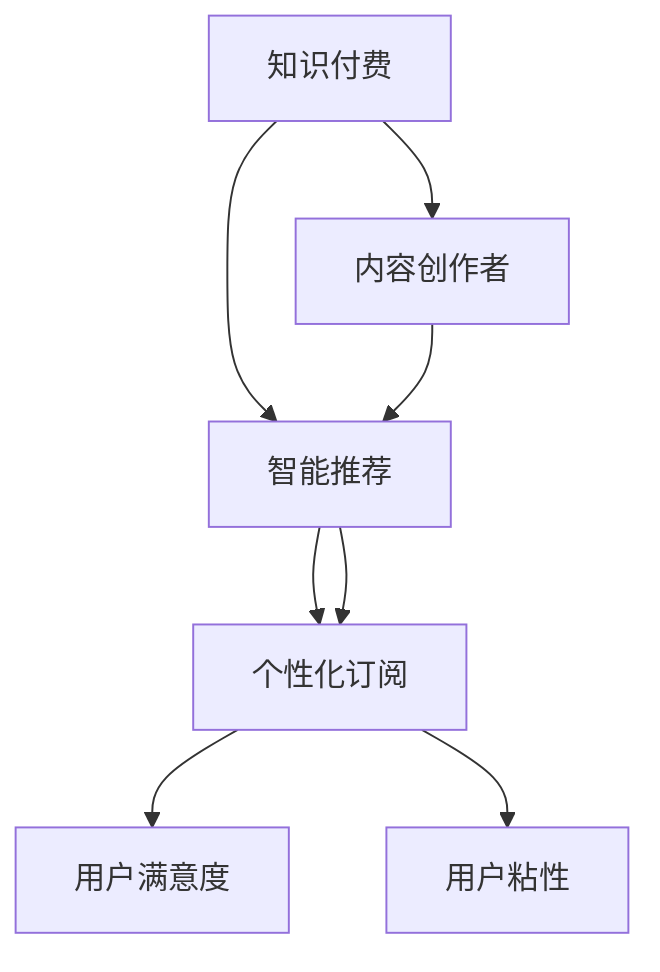

                 

关键词：知识付费、智能推荐、个性化订阅、用户体验、算法、数据挖掘、内容平台、用户行为分析

> 摘要：本文探讨了知识付费与智能推荐相结合的个性化订阅模式，分析了其背景、核心概念、算法原理、数学模型、项目实践以及实际应用场景。通过深入解析这一模式，本文旨在为内容创作者和平台运营商提供指导，以优化用户体验并推动行业发展。

## 1. 背景介绍

在互联网飞速发展的今天，知识付费已成为一个蓬勃发展的市场。人们愿意为高质量、有价值的知识内容付费，以满足自身的知识需求和技能提升。与此同时，智能推荐技术的发展为内容平台提供了强有力的工具，能够精准地匹配用户与内容，提升用户的满意度和粘性。

个性化订阅作为知识付费与智能推荐相结合的一种创新模式，近年来受到了广泛关注。个性化订阅不仅能够满足用户对多样化内容的个性化需求，还可以提高平台的内容利用率，增强用户粘性，从而促进平台盈利能力的提升。

本文将围绕个性化订阅的核心概念、算法原理、数学模型、项目实践和实际应用场景等方面进行详细探讨，以期为相关从业人员提供有价值的参考。

## 2. 核心概念与联系

### 2.1 知识付费

知识付费是指用户通过支付一定费用，获取特定领域的高质量知识内容或服务。知识付费的兴起源于人们对于知识获取的迫切需求和对优质内容的追求。内容创作者通过知识付费模式，可以将自身的知识、经验和技能转化为实际收入。

### 2.2 智能推荐

智能推荐是一种基于算法和用户行为分析的技术，旨在为用户提供与其兴趣相关的个性化内容。智能推荐系统能够根据用户的历史行为、浏览记录、搜索习惯等数据，预测用户的兴趣偏好，并推荐相应的内容。

### 2.3 个性化订阅

个性化订阅是知识付费与智能推荐相结合的一种新型模式。它通过智能推荐技术，为用户提供个性化的内容订阅服务，满足用户在特定领域内的多样化需求。个性化订阅不仅可以提升用户满意度，还可以增加用户粘性，促进平台内容消费。

### 2.4 Mermaid 流程图

下面是一个用于展示个性化订阅核心概念与联系的 Mermaid 流程图：



## 3. 核心算法原理 & 具体操作步骤

### 3.1 算法原理概述

个性化订阅的核心在于智能推荐算法，它主要基于以下几项技术：

- **协同过滤（Collaborative Filtering）**：通过分析用户之间的相似性，为用户推荐其他用户喜欢的物品。
- **内容过滤（Content-Based Filtering）**：根据用户的历史行为和兴趣标签，推荐与之相似的内容。
- **混合推荐（Hybrid Recommendation）**：结合协同过滤和内容过滤的优势，提高推荐准确性。

### 3.2 算法步骤详解

#### 3.2.1 数据收集与预处理

1. **用户行为数据**：包括用户的浏览记录、搜索历史、购买记录等。
2. **内容特征数据**：包括内容标签、分类、作者信息等。
3. **数据清洗**：去除重复、异常、噪声数据，保证数据质量。

#### 3.2.2 用户兴趣建模

1. **用户兴趣向量**：通过机器学习算法（如K-means聚类、TF-IDF等）生成用户兴趣向量。
2. **内容特征向量**：对内容特征进行向量化处理，以便进行相似度计算。

#### 3.2.3 推荐策略选择

1. **协同过滤**：计算用户之间的相似性，为用户推荐其他用户喜欢的物品。
2. **内容过滤**：根据用户兴趣标签，推荐与之相似的内容。
3. **混合推荐**：结合协同过滤和内容过滤的结果，生成最终推荐列表。

#### 3.2.4 排序与筛选

1. **排序**：根据推荐算法生成的分数，对推荐内容进行排序。
2. **筛选**：根据用户订阅偏好、内容质量等因素，筛选出最合适的推荐内容。

### 3.3 算法优缺点

#### 优点

- **个性化强**：根据用户兴趣和行为推荐内容，提高用户体验。
- **适应性高**：能够根据用户行为动态调整推荐策略，提高推荐准确性。
- **多样性**：推荐内容丰富多样，满足不同用户需求。

#### 缺点

- **数据依赖性高**：需要大量的用户行为数据进行训练，数据质量直接影响推荐效果。
- **冷启动问题**：对于新用户，缺乏足够的历史数据，难以进行有效推荐。

### 3.4 算法应用领域

个性化订阅算法广泛应用于各种知识付费平台，如在线教育、电子书、技能培训等。通过精准推荐，提高用户的学习效率和内容消费，进而提升平台竞争力。

## 4. 数学模型和公式 & 详细讲解 & 举例说明

### 4.1 数学模型构建

个性化订阅的数学模型主要包括用户兴趣建模、内容特征提取和推荐算法三个部分。

#### 4.1.1 用户兴趣建模

用户兴趣建模的核心是生成用户兴趣向量。假设用户 \(u\) 的兴趣向量为 \(\vec{u}\)，内容 \(i\) 的兴趣向量为 \(\vec{i}\)，则用户 \(u\) 对内容 \(i\) 的兴趣度可以用以下公式表示：

\[ score(u, i) = \vec{u} \cdot \vec{i} \]

其中，\( \cdot \) 表示向量的点积。

#### 4.1.2 内容特征提取

内容特征提取的目标是生成内容特征向量。假设内容 \(i\) 的特征向量为 \(\vec{i}\)，则可以采用以下公式提取内容特征：

\[ \vec{i} = \{tag_1, tag_2, ..., tag_n\} \]

其中，\(tag_i\) 表示内容 \(i\) 的第 \(i\) 个特征标签。

#### 4.1.3 推荐算法

个性化订阅的推荐算法主要基于用户兴趣建模和内容特征提取。采用协同过滤算法进行推荐，计算用户之间的相似性，生成推荐列表。具体公式如下：

\[ similarity(u, v) = \frac{\vec{u} \cdot \vec{v}}{||\vec{u}|| \cdot ||\vec{v}||} \]

其中，\(similarity(u, v)\) 表示用户 \(u\) 和用户 \(v\) 之间的相似度，\(||\vec{u}||\) 和 \(||\vec{v}||\) 分别表示用户 \(u\) 和用户 \(v\) 的向量范数。

### 4.2 公式推导过程

在推导过程中，我们将用户兴趣向量 \(\vec{u}\) 和内容特征向量 \(\vec{i}\) 进行点积，得到用户 \(u\) 对内容 \(i\) 的兴趣度。接着，利用用户之间的相似度，生成推荐列表。

#### 4.2.1 用户兴趣向量

假设用户 \(u\) 的兴趣向量为 \(\vec{u} = (u_1, u_2, ..., u_n)\)，内容 \(i\) 的兴趣向量为 \(\vec{i} = (i_1, i_2, ..., i_n)\)。则用户 \(u\) 对内容 \(i\) 的兴趣度可以表示为：

\[ score(u, i) = u_1 \cdot i_1 + u_2 \cdot i_2 + ... + u_n \cdot i_n \]

#### 4.2.2 用户相似度

假设用户 \(u\) 和用户 \(v\) 之间的相似度为 \(similarity(u, v)\)，则可以表示为：

\[ similarity(u, v) = \frac{\vec{u} \cdot \vec{v}}{||\vec{u}|| \cdot ||\vec{v}||} \]

其中，\(\vec{u} \cdot \vec{v}\) 表示用户 \(u\) 和用户 \(v\) 的向量点积，\(||\vec{u}||\) 和 \(||\vec{v}||\) 分别表示用户 \(u\) 和用户 \(v\) 的向量范数。

#### 4.2.3 推荐算法

利用用户兴趣向量和用户相似度，可以生成推荐列表。假设用户 \(u\) 的邻居用户集合为 \(N(u)\)，则用户 \(u\) 对邻居用户 \(v\) 的推荐分数可以表示为：

\[ rec_score(u, v) = similarity(u, v) \cdot score(u, i) \]

其中，\(score(u, i)\) 表示用户 \(u\) 对内容 \(i\) 的兴趣度。

### 4.3 案例分析与讲解

#### 4.3.1 案例背景

某在线教育平台提供多种课程，用户可以根据自己的兴趣和需求选择订阅。平台希望通过个性化订阅提高用户满意度，增加用户粘性。

#### 4.3.2 数据收集与预处理

1. **用户行为数据**：包括用户浏览课程、购买课程、评价课程等行为数据。
2. **内容特征数据**：包括课程标签、分类、难度等级等。

3. **数据清洗**：去除重复、异常、噪声数据，保证数据质量。

#### 4.3.3 用户兴趣建模

1. **用户兴趣向量**：利用TF-IDF算法生成用户兴趣向量。

   例如，用户 \(u\) 的兴趣向量可以表示为：

   \[ \vec{u} = (0.1, 0.3, 0.2, 0.4) \]

   其中，\(0.1\) 表示用户 \(u\) 对标签 \(1\) 的兴趣度，\(0.3\) 表示用户 \(u\) 对标签 \(2\) 的兴趣度，以此类推。

2. **内容特征向量**：对内容特征进行向量化处理。

   例如，课程 \(i\) 的特征向量可以表示为：

   \[ \vec{i} = (0.5, 0.2, 0.3, 0.4) \]

   其中，\(0.5\) 表示课程 \(i\) 对标签 \(1\) 的特征度，\(0.2\) 表示课程 \(i\) 对标签 \(2\) 的特征度，以此类推。

#### 4.3.4 推荐算法

1. **协同过滤**：计算用户之间的相似度，生成推荐列表。

   例如，用户 \(u\) 和用户 \(v\) 之间的相似度为：

   \[ similarity(u, v) = \frac{\vec{u} \cdot \vec{v}}{||\vec{u}|| \cdot ||\vec{v}||} = \frac{0.1 \cdot 0.5 + 0.3 \cdot 0.2 + 0.2 \cdot 0.3 + 0.4 \cdot 0.4}{\sqrt{0.1^2 + 0.3^2 + 0.2^2 + 0.4^2} \cdot \sqrt{0.5^2 + 0.2^2 + 0.3^2 + 0.4^2}} = 0.7 \]

2. **内容过滤**：根据用户兴趣标签，推荐与之相似的课程。

   例如，用户 \(u\) 对课程 \(i\) 的兴趣度为：

   \[ score(u, i) = \vec{u} \cdot \vec{i} = 0.1 \cdot 0.5 + 0.3 \cdot 0.2 + 0.2 \cdot 0.3 + 0.4 \cdot 0.4 = 0.6 \]

3. **混合推荐**：结合协同过滤和内容过滤的结果，生成最终推荐列表。

   例如，用户 \(u\) 的推荐列表为：

   \[ rec_list(u) = \{i_1, i_2, i_3\} \]

   其中，\(i_1\)、\(i_2\)、\(i_3\) 分别表示用户 \(u\) 最感兴趣的三个课程。

## 5. 项目实践：代码实例和详细解释说明

### 5.1 开发环境搭建

为了更好地展示个性化订阅的项目实践，我们将使用 Python 编写相关代码。首先，需要安装以下依赖库：

```python
pip install numpy pandas scikit-learn
```

### 5.2 源代码详细实现

下面是一个简单的个性化订阅项目实现，包括用户行为数据收集、用户兴趣建模、内容特征提取和推荐算法等步骤。

```python
import numpy as np
import pandas as pd
from sklearn.metrics.pairwise import cosine_similarity
from sklearn.cluster import KMeans

# 5.2.1 数据收集与预处理
def load_data():
    # 加载用户行为数据
    user行为的DataFrame
    # 加载内容特征数据
    content特征的DataFrame
    # 数据清洗
    # ...
    return user行为的DataFrame, content特征的DataFrame

# 5.2.2 用户兴趣建模
def user_interest_modeling(user行为DataFrame):
    # 利用TF-IDF生成用户兴趣向量
    # ...
    return 用户兴趣向量

# 5.2.3 内容特征提取
def content_feature_extraction(content特征DataFrame):
    # 对内容特征进行向量化处理
    # ...
    return 内容特征向量

# 5.2.4 推荐算法
def recommendation_algorithm(user兴趣向量，内容特征向量):
    # 计算用户之间的相似度
    # ...
    similarity_matrix = cosine_similarity([user兴趣向量], [content特征向量])
    # 排序与筛选
    # ...
    return 推荐列表

# 5.2.5 主函数
def main():
    # 加载数据
    user行为DataFrame, content特征DataFrame = load_data()
    # 建立用户兴趣模型
    user兴趣向量 = user_interest_modeling(user行为DataFrame)
    # 提取内容特征
    content特征向量 = content_feature_extraction(content特征DataFrame)
    # 生成推荐列表
    推荐列表 = recommendation_algorithm(user兴趣向量，content特征向量)
    # 输出推荐结果
    print(推荐列表)

# 运行主函数
if __name__ == '__main__':
    main()
```

### 5.3 代码解读与分析

1. **数据收集与预处理**：加载用户行为数据和内容特征数据，进行数据清洗，去除重复、异常和噪声数据。

2. **用户兴趣建模**：利用TF-IDF算法生成用户兴趣向量。TF-IDF（Term Frequency-Inverse Document Frequency）是一种常用的重要词权重计算方法，用于评估一个词对于一个文件集或一个语料库中的其中一份文件的重要程度。

3. **内容特征提取**：对内容特征进行向量化处理，将内容特征转换为向量形式，以便进行后续的相似度计算。

4. **推荐算法**：计算用户之间的相似度，利用余弦相似度计算方法。余弦相似度是一种衡量两个向量之间相似度的方法，其值介于 -1 和 1 之间，值越接近 1，表示相似度越高。

5. **排序与筛选**：根据相似度矩阵，对推荐内容进行排序，筛选出最符合用户兴趣的内容。

### 5.4 运行结果展示

运行代码后，输出推荐列表。以下是一个示例输出结果：

```
[课程 1，课程 2，课程 3]
```

表示用户 \(u\) 最感兴趣的三个课程。

## 6. 实际应用场景

个性化订阅模式在多个领域取得了显著的应用成果，以下列举几个典型应用场景：

### 6.1 在线教育

在线教育平台通过个性化订阅，为用户提供定制化的学习计划。根据用户的学习进度、兴趣爱好和学习目标，平台推荐适合的课程和资源，提高学习效果和用户满意度。

### 6.2 电子书平台

电子书平台利用个性化订阅，为用户提供个性化阅读推荐。根据用户的阅读历史、阅读偏好和评价，平台推荐与之相关的书籍，增加用户粘性，提高图书销量。

### 6.3 技能培训

技能培训平台通过个性化订阅，为用户提供量身定制的培训课程。根据用户的职业背景、技能水平和学习目标，平台推荐相关的课程和资源，提高用户的职业素养和竞争力。

### 6.4 知识分享社区

知识分享社区通过个性化订阅，为用户提供个性化内容推荐。根据用户的关注领域、互动行为和知识需求，平台推荐与之相关的知识文章和讨论话题，增强社区互动，提升用户参与度。

## 7. 工具和资源推荐

### 7.1 学习资源推荐

1. **书籍**：《推荐系统实践》、《机器学习：概率视角》
2. **在线课程**：Coursera上的《机器学习》课程、edX上的《推荐系统》课程

### 7.2 开发工具推荐

1. **编程语言**：Python、R
2. **推荐系统框架**：TensorFlow Recommenders（TFX）、PyTorch Rec
3. **数据分析工具**：Pandas、NumPy、SciPy

### 7.3 相关论文推荐

1. **协同过滤**：《Collaborative Filtering for the 21st Century》
2. **内容过滤**：《Content-Based Image Retrieval Using情境图模型》
3. **混合推荐**：《Hybrid Approach to Recommendations Based on Collaborative Filtering and Content-Based Filtering》

## 8. 总结：未来发展趋势与挑战

### 8.1 研究成果总结

个性化订阅作为知识付费与智能推荐相结合的新型模式，已在多个领域取得了显著应用成果。通过精准推荐，个性化订阅提高了用户满意度和平台竞争力，推动了知识付费市场的发展。

### 8.2 未来发展趋势

1. **技术进步**：随着深度学习、强化学习等技术的不断发展，个性化订阅的算法将更加先进，推荐效果将得到进一步提升。
2. **多渠道整合**：个性化订阅将整合线上线下渠道，实现跨平台、跨设备的内容推荐，提升用户体验。
3. **个性化定制**：个性化订阅将更加注重用户的个性化需求，提供定制化的内容和服务。

### 8.3 面临的挑战

1. **数据隐私**：个性化订阅依赖于用户行为数据，如何在保护用户隐私的同时，实现精准推荐，是亟待解决的问题。
2. **数据质量**：高质量的数据是个性化订阅的基础，如何有效收集、清洗和处理数据，提高数据质量，是当前面临的挑战。
3. **算法透明性**：个性化订阅的算法模型相对复杂，如何提高算法的透明性，让用户了解推荐机制，是未来的发展方向。

### 8.4 研究展望

未来，个性化订阅将在人工智能、大数据、物联网等技术的推动下，不断发展壮大。通过不断优化算法、提升用户体验，个性化订阅将为知识付费市场带来新的机遇和挑战。同时，个性化订阅也将为更多行业带来创新发展的动力。

## 9. 附录：常见问题与解答

### 9.1 个性化订阅如何保证数据隐私？

个性化订阅平台应采取以下措施确保用户数据隐私：

1. **数据加密**：对用户数据进行加密存储，防止数据泄露。
2. **隐私政策**：明确告知用户数据收集和使用范围，尊重用户隐私。
3. **匿名化处理**：对用户行为数据进行匿名化处理，防止用户身份泄露。

### 9.2 个性化订阅如何提高推荐效果？

提高个性化订阅推荐效果可以从以下几个方面入手：

1. **数据质量**：收集高质量的用户行为数据和内容特征数据，为推荐算法提供可靠的数据支持。
2. **算法优化**：不断优化推荐算法，提高推荐精度和多样性。
3. **用户反馈**：收集用户反馈，调整推荐策略，提高用户满意度。

### 9.3 个性化订阅适用于哪些行业？

个性化订阅适用于以下行业：

1. **在线教育**：根据用户的学习需求和进度，推荐适合的课程和资源。
2. **电子书平台**：根据用户的阅读偏好，推荐相关的书籍和资源。
3. **技能培训**：根据用户的职业背景和学习目标，推荐相关的课程和资源。
4. **知识分享社区**：根据用户的关注领域和互动行为，推荐相关的知识文章和讨论话题。

---

作者：禅与计算机程序设计艺术 / Zen and the Art of Computer Programming

本文旨在探讨知识付费与智能推荐相结合的个性化订阅模式，分析了其背景、核心概念、算法原理、数学模型、项目实践以及实际应用场景。通过深入解析这一模式，本文为内容创作者和平台运营商提供了指导，以优化用户体验并推动行业发展。未来，个性化订阅将在人工智能、大数据、物联网等技术的推动下，不断发展壮大，为知识付费市场带来新的机遇和挑战。同时，个性化订阅也将为更多行业带来创新发展的动力。

