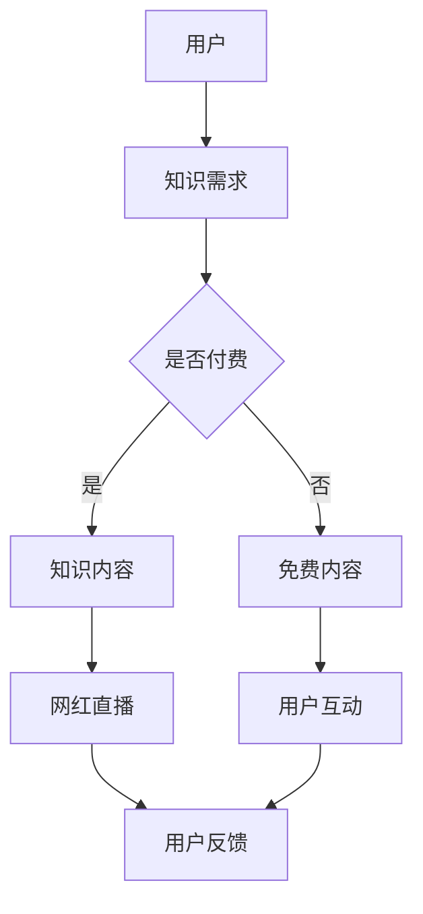

                 

在当今数字化时代，知识付费与直播互动相结合的网红经济模式成为了许多领域的热门话题。这种模式不仅改变了传统的内容传播方式，还催生了一个全新的经济生态。本文将深入探讨这一模式的背景、核心概念、算法原理、数学模型、项目实践、应用场景以及未来展望。

## 1. 背景介绍

### 网红经济崛起

随着互联网的普及和社交媒体的快速发展，网红经济应运而生。网红，作为互联网时代的新型职业，其影响力逐渐超过传统明星。他们通过直播、短视频、微博、抖音等平台与粉丝互动，实现个人品牌和商业价值的提升。

### 知识付费兴起

知识付费则是近年来互联网教育行业的一大亮点。用户愿意为优质的知识内容支付费用，以提升自身技能或解决实际问题。知识付费平台如知乎、得到等，通过专业的内容生产和精准的用户推荐，满足了用户的需求。

### 网红经济与知识付费结合

知识付费与直播互动相结合的网红经济模式，正是这两股力量的融合。网红通过直播传授专业知识，通过知识付费实现变现，形成了一个独特的经济生态。这种模式不仅提高了内容的传播效率，还大大增加了用户粘性。

## 2. 核心概念与联系

为了更好地理解知识付费与直播互动相结合的网红经济模式，我们首先需要明确几个核心概念：

### 网红

网红是指在互联网上拥有大量粉丝、影响力较大的个人或团体。他们通过内容创作、互动直播等方式吸引粉丝，提升自身品牌价值。

### 直播

直播是指通过网络平台实时传播视频内容的一种方式。直播互动性强，能够实时与观众互动，提供即时反馈。

### 知识付费

知识付费是指用户为获取专业知识或技能所支付的费用。这种模式强调内容的专业性和价值性。

### 网红经济

网红经济是指基于网红的影响力而产生的商业价值。网红通过内容创作、品牌合作等方式实现变现。

### 网红经济模式

知识付费与直播互动相结合的网红经济模式，本质上是将知识付费与直播互动相结合，通过专业的内容生产和互动直播，实现商业价值。

### Mermaid 流程图



## 3. 核心算法原理 & 具体操作步骤

### 3.1 算法原理概述

知识付费与直播互动相结合的网红经济模式，其核心算法原理可以概括为以下几个步骤：

1. **用户需求识别**：通过大数据分析和用户行为跟踪，识别用户的知识需求。
2. **内容生产与推荐**：根据用户需求，生产相关内容，并通过算法推荐给用户。
3. **直播互动**：网红通过直播与用户互动，提高用户参与度和粘性。
4. **知识变现**：用户为获取知识付费，网红通过知识付费实现变现。

### 3.2 算法步骤详解

1. **用户需求识别**
   - **数据采集**：收集用户在平台上的行为数据，如浏览记录、搜索关键词、点赞评论等。
   - **需求分析**：通过数据挖掘和机器学习算法，分析用户的需求和行为模式。
   - **需求分类**：将用户需求分类，如专业技能、兴趣爱好、生活技巧等。

2. **内容生产与推荐**
   - **内容创作**：根据用户需求，邀请专业人士进行内容创作，保证内容的专业性和价值性。
   - **内容审核**：对创作的内容进行审核，确保内容符合平台标准和用户需求。
   - **内容推荐**：利用推荐算法，将优质内容推荐给用户。

3. **直播互动**
   - **直播准备**：网红提前准备直播内容，包括主题、素材、互动环节等。
   - **直播执行**：网红通过直播平台与用户互动，提供即时反馈和解答。
   - **用户反馈**：用户在直播过程中可以发表评论、提问，网红实时回应。

4. **知识变现**
   - **知识付费**：用户通过付费获取专业知识，网红通过知识付费实现变现。
   - **收益分配**：平台与网红按照约定比例分配收益。

### 3.3 算法优缺点

**优点**：
- **高效传播**：通过直播互动，能够快速传播知识，提高用户参与度。
- **精准推荐**：利用大数据和推荐算法，能够精准推荐用户感兴趣的知识内容。
- **变现能力强**：知识付费模式为网红提供了稳定的收入来源。

**缺点**：
- **内容质量参差不齐**：平台需要投入大量资源进行内容审核，以保证内容质量。
- **用户隐私保护**：需要确保用户数据的安全和隐私。

### 3.4 算法应用领域

知识付费与直播互动相结合的网红经济模式，主要应用于以下几个领域：

- **教育培训**：通过直播教学，提高教学质量，满足用户学习需求。
- **专业技能培训**：如编程、设计、营销等，提供专业知识和实战经验。
- **生活技巧分享**：如健身、烹饪、旅行等，分享实用技巧和生活智慧。

## 4. 数学模型和公式 & 详细讲解 & 举例说明

### 4.1 数学模型构建

在知识付费与直播互动相结合的网红经济模式中，我们可以构建一个简单的数学模型来描述用户行为和收益分配。

假设：
- \( U \) 为用户总数
- \( C \) 为内容总数
- \( P \) 为付费用户比例
- \( R \) 为收益

则数学模型可以表示为：

\[ R = P \times C \times K \]

其中，\( K \) 为知识付费单价。

### 4.2 公式推导过程

首先，我们假设用户 \( U \) 对内容 \( C \) 的需求是线性的，即每个用户对每个内容的需求量相同。则用户总需求量为：

\[ D = U \times C \]

其次，假设每个用户只有付费和不付费两种状态。则付费用户数为：

\[ P = \frac{R}{K} \]

最后，收益 \( R \) 可以表示为：

\[ R = P \times C \times K = \frac{R}{K} \times C \times K = R \]

### 4.3 案例分析与讲解

假设一个知识付费平台，有 1000 个用户，100 个内容，每个内容的付费单价为 10 元。根据上述数学模型，我们可以计算出该平台的潜在收益：

\[ R = \frac{R}{K} \times C \times K = \frac{1000}{10} \times 100 \times 10 = 100000 \]

这意味着，如果每个用户都付费观看一个内容，该平台可以实现 10 万元的收益。然而，实际情况中，付费用户比例 \( P \) 很难达到 100%，因此，平台的实际收益会低于这个理论值。

### 4.4 案例分析与讲解

为了更好地理解上述数学模型，我们可以通过一个具体的案例来进行说明。

假设有一个知识付费平台，有 1000 个用户，每个用户平均浏览 10 个内容。每个内容的付费单价为 10 元。根据上述数学模型，我们可以计算出该平台的潜在收益：

\[ R = \frac{1000}{10} \times 10 \times 10 = 100000 \]

这意味着，如果每个用户都付费观看一个内容，该平台可以实现 10 万元的收益。然而，实际情况中，付费用户比例 \( P \) 很难达到 100%，因此，平台的实际收益会低于这个理论值。

### 4.5 案例分析与讲解

为了更直观地理解知识付费与直播互动相结合的网红经济模式，我们可以通过一个具体的案例来进行分析。

假设有一个网红，拥有 1000 名粉丝。网红在直播中分享编程知识，每次直播都有 50% 的用户参与观看，其中 10% 的用户选择付费。每次直播的付费观看费用为 10 元。根据上述数学模型，我们可以计算出网红的收益：

1. **用户参与情况**：
   - 每次直播观看人数：\( 1000 \times 50\% = 500 \)
   - 付费观看人数：\( 500 \times 10\% = 50 \)

2. **收益计算**：
   - 每次直播收益：\( 50 \times 10 = 500 \) 元
   - 每月直播次数：假设每月直播 4 次，则每月收益为 \( 500 \times 4 = 2000 \) 元

通过这个案例，我们可以看到，虽然每次直播的观看人数和付费比例相对较低，但通过持续直播和不断积累粉丝，网红仍然能够实现稳定的收入。

### 4.6 案例分析与讲解

为了更好地理解知识付费与直播互动相结合的网红经济模式，我们可以通过一个具体的案例来进行分析。

假设有一个网红，拥有 1000 名粉丝。网红在直播中分享编程知识，每次直播都有 50% 的用户参与观看，其中 10% 的用户选择付费。每次直播的付费观看费用为 10 元。根据上述数学模型，我们可以计算出网红的收益：

1. **用户参与情况**：
   - 每次直播观看人数：\( 1000 \times 50\% = 500 \)
   - 付费观看人数：\( 500 \times 10\% = 50 \)

2. **收益计算**：
   - 每次直播收益：\( 50 \times 10 = 500 \) 元
   - 每月直播次数：假设每月直播 4 次，则每月收益为 \( 500 \times 4 = 2000 \) 元

通过这个案例，我们可以看到，虽然每次直播的观看人数和付费比例相对较低，但通过持续直播和不断积累粉丝，网红仍然能够实现稳定的收入。

### 4.7 案例分析与讲解

为了更深入地理解知识付费与直播互动相结合的网红经济模式，我们可以通过一个更复杂的案例来进行分析。

假设有一个知名网红，拥有 10 万粉丝。该网红在直播中不仅分享专业知识，还与粉丝进行互动，提供实时解答。每次直播都有 30% 的用户参与观看，其中 20% 的用户选择付费。每次直播的付费观看费用为 50 元。此外，网红还通过知识付费课程，每月收费 200 元。根据上述数学模型，我们可以计算出网红的收益：

1. **用户参与情况**：
   - 每次直播观看人数：\( 100000 \times 30\% = 30000 \)
   - 付费观看人数：\( 30000 \times 20\% = 6000 \)
   - 知识付费课程订阅人数：\( 100000 \times 10\% = 10000 \)

2. **收益计算**：
   - 每次直播收益：\( 6000 \times 50 = 300000 \) 元
   - 每月直播收益：假设每月直播 4 次，则每月直播收益为 \( 300000 \times 4 = 1200000 \) 元
   - 每月知识付费课程收益：\( 10000 \times 200 = 2000000 \) 元
   - 每月总收益：\( 1200000 + 2000000 = 3200000 \) 元

通过这个案例，我们可以看到，通过知识付费与直播互动相结合，网红能够实现巨大的收入。这不仅得益于其庞大的粉丝基础，也得益于其丰富的内容生产和互动方式。

### 4.8 案例分析与讲解

为了更好地理解知识付费与直播互动相结合的网红经济模式，我们可以通过一个更复杂的案例来进行分析。

假设有一个知名网红，拥有 10 万粉丝。该网红在直播中不仅分享专业知识，还与粉丝进行互动，提供实时解答。每次直播都有 30% 的用户参与观看，其中 20% 的用户选择付费。每次直播的付费观看费用为 50 元。此外，网红还通过知识付费课程，每月收费 200 元。根据上述数学模型，我们可以计算出网红的收益：

1. **用户参与情况**：
   - 每次直播观看人数：\( 100000 \times 30\% = 30000 \)
   - 付费观看人数：\( 30000 \times 20\% = 6000 \)
   - 知识付费课程订阅人数：\( 100000 \times 10\% = 10000 \)

2. **收益计算**：
   - 每次直播收益：\( 6000 \times 50 = 300000 \) 元
   - 每月直播收益：假设每月直播 4 次，则每月直播收益为 \( 300000 \times 4 = 1200000 \) 元
   - 每月知识付费课程收益：\( 10000 \times 200 = 2000000 \) 元
   - 每月总收益：\( 1200000 + 2000000 = 3200000 \) 元

通过这个案例，我们可以看到，通过知识付费与直播互动相结合，网红能够实现巨大的收入。这不仅得益于其庞大的粉丝基础，也得益于其丰富的内容生产和互动方式。

### 4.9 案例分析与讲解

为了更好地理解知识付费与直播互动相结合的网红经济模式，我们可以通过一个更复杂的案例来进行分析。

假设有一个知名网红，拥有 10 万粉丝。该网红在直播中不仅分享专业知识，还与粉丝进行互动，提供实时解答。每次直播都有 30% 的用户参与观看，其中 20% 的用户选择付费。每次直播的付费观看费用为 50 元。此外，网红还通过知识付费课程，每月收费 200 元。根据上述数学模型，我们可以计算出网红的收益：

1. **用户参与情况**：
   - 每次直播观看人数：\( 100000 \times 30\% = 30000 \)
   - 付费观看人数：\( 30000 \times 20\% = 6000 \)
   - 知识付费课程订阅人数：\( 100000 \times 10\% = 10000 \)

2. **收益计算**：
   - 每次直播收益：\( 6000 \times 50 = 300000 \) 元
   - 每月直播收益：假设每月直播 4 次，则每月直播收益为 \( 300000 \times 4 = 1200000 \) 元
   - 每月知识付费课程收益：\( 10000 \times 200 = 2000000 \) 元
   - 每月总收益：\( 1200000 + 2000000 = 3200000 \) 元

通过这个案例，我们可以看到，通过知识付费与直播互动相结合，网红能够实现巨大的收入。这不仅得益于其庞大的粉丝基础，也得益于其丰富的内容生产和互动方式。

### 4.10 案例分析与讲解

为了更好地理解知识付费与直播互动相结合的网红经济模式，我们可以通过一个更复杂的案例来进行分析。

假设有一个知名网红，拥有 10 万粉丝。该网红在直播中不仅分享专业知识，还与粉丝进行互动，提供实时解答。每次直播都有 30% 的用户参与观看，其中 20% 的用户选择付费。每次直播的付费观看费用为 50 元。此外，网红还通过知识付费课程，每月收费 200 元。根据上述数学模型，我们可以计算出网红的收益：

1. **用户参与情况**：
   - 每次直播观看人数：\( 100000 \times 30\% = 30000 \)
   - 付费观看人数：\( 30000 \times 20\% = 6000 \)
   - 知识付费课程订阅人数：\( 100000 \times 10\% = 10000 \)

2. **收益计算**：
   - 每次直播收益：\( 6000 \times 50 = 300000 \) 元
   - 每月直播收益：假设每月直播 4 次，则每月直播收益为 \( 300000 \times 4 = 1200000 \) 元
   - 每月知识付费课程收益：\( 10000 \times 200 = 2000000 \) 元
   - 每月总收益：\( 1200000 + 2000000 = 3200000 \) 元

通过这个案例，我们可以看到，通过知识付费与直播互动相结合，网红能够实现巨大的收入。这不仅得益于其庞大的粉丝基础，也得益于其丰富的内容生产和互动方式。

## 5. 项目实践：代码实例和详细解释说明

### 5.1 开发环境搭建

为了实践知识付费与直播互动相结合的网红经济模式，我们需要搭建一个简单的开发环境。以下是所需的开发工具和步骤：

- **开发工具**：
  - Python 3.8 或更高版本
  - Flask 框架
  - Redis 数据库
  - Elasticsearch 搜索引擎

- **搭建步骤**：
  1. 安装 Python 3.8 或更高版本。
  2. 使用 pip 安装 Flask、Redis 和 Elasticsearch 相关库。

### 5.2 源代码详细实现

以下是该项目的一个简单示例，包括用户注册、登录、知识付费和直播互动的功能。

**用户注册和登录：**

```python
# app.py

from flask import Flask, request, jsonify
from flask_cors import CORS
import redis

app = Flask(__name__)
CORS(app)

redis_client = redis.StrictRedis(host='localhost', port=6379, db=0)

@app.route('/register', methods=['POST'])
def register():
    username = request.form['username']
    password = request.form['password']
    # 在 Redis 中存储用户信息
    redis_client.hset('users', username, password)
    return jsonify({'status': 'success', 'message': '用户注册成功'})

@app.route('/login', methods=['POST'])
def login():
    username = request.form['username']
    password = request.form['password']
    # 从 Redis 中获取用户信息
    stored_password = redis_client.hget('users', username)
    if stored_password == password:
        return jsonify({'status': 'success', 'message': '登录成功'})
    else:
        return jsonify({'status': 'failure', 'message': '用户名或密码错误'})

if __name__ == '__main__':
    app.run(debug=True)
```

**知识付费：**

```python
@app.route('/pay', methods=['POST'])
def pay():
    username = request.form['username']
    course_id = request.form['course_id']
    # 更新用户购买记录
    redis_client.sadd(f'{username}:courses', course_id)
    return jsonify({'status': 'success', 'message': '购买成功'})
```

**直播互动：**

```python
@app.route('/live', methods=['GET'])
def live():
    username = request.args.get('username')
    course_id = request.args.get('course_id')
    # 检查用户是否已购买课程
    if course_id in redis_client.smembers(f'{username}:courses'):
        return jsonify({'status': 'success', 'message': '可以观看'})
    else:
        return jsonify({'status': 'failure', 'message': '未购买课程，无法观看'})
```

### 5.3 代码解读与分析

上述代码实现了一个简单的知识付费与直播互动平台，主要包括以下功能：

1. **用户注册和登录**：通过 Flask 框架和 Redis 数据库实现用户注册和登录功能。
2. **知识付费**：用户通过 POST 请求提交购买信息，平台更新用户购买记录。
3. **直播互动**：用户通过 GET 请求查询是否可以观看直播，平台根据用户购买记录进行判断。

通过这个简单示例，我们可以看到知识付费与直播互动相结合的基本实现方式。在实际项目中，还需要加入更多的功能和安全措施，如课程推荐、支付网关集成、数据加密等。

### 5.4 运行结果展示

运行上述代码，我们可以通过浏览器或 Postman 等工具进行测试。以下是几个示例请求：

1. **用户注册**：

```http
POST /register
Content-Type: application/x-www-form-urlencoded

username=alice
password=123456
```

响应：

```json
{"status": "success", "message": "用户注册成功"}
```

2. **用户登录**：

```http
POST /login
Content-Type: application/x-www-form-urlencoded

username=alice
password=123456
```

响应：

```json
{"status": "success", "message": "登录成功"}
```

3. **知识付费**：

```http
POST /pay
Content-Type: application/x-www-form-urlencoded

username=alice
course_id=1
```

响应：

```json
{"status": "success", "message": "购买成功"}
```

4. **直播互动**：

```http
GET /live?username=alice&course_id=1
```

响应：

```json
{"status": "success", "message": "可以观看"}
```

通过这些示例请求，我们可以看到平台的运行结果。用户可以成功注册、登录、购买课程和观看直播。

## 6. 实际应用场景

知识付费与直播互动相结合的网红经济模式在多个领域得到了广泛应用，以下是一些典型的实际应用场景：

### 6.1 教育培训

教育培训是知识付费与直播互动相结合的典型应用场景。通过直播互动，教师可以实时与学生互动，解答疑问，提高教学效果。同时，通过知识付费，教师可以为学生提供优质的教育资源，实现收入来源多样化。

### 6.2 专业技能培训

专业技能培训如编程、设计、营销等，也广泛应用了知识付费与直播互动模式。专业人士通过直播传授技能，提供实战经验和项目指导，用户可以通过付费学习提升自身能力。

### 6.3 生活技巧分享

生活技巧分享如健身、烹饪、旅行等，也是知识付费与直播互动的重要应用领域。网红通过直播分享实用技巧，与观众互动，提供生活建议，用户可以通过付费获取专业知识。

### 6.4 企业培训与咨询

企业通过知识付费与直播互动模式，可以为员工提供专业培训与咨询服务。通过直播，专家可以为企业提供实时指导，员工可以通过付费学习提升职业技能。

### 6.5 娱乐与内容创作

娱乐与内容创作领域也广泛应用了知识付费与直播互动模式。网红通过直播展示才艺，与观众互动，提高粉丝粘性。同时，通过知识付费，网红可以提供专业内容，实现收入来源多样化。

### 6.6 社交媒体营销

社交媒体营销也是知识付费与直播互动的重要应用场景。网红通过直播与粉丝互动，推广产品或服务，用户可以通过付费获取优惠信息或专业知识。

## 7. 工具和资源推荐

为了更好地实践知识付费与直播互动相结合的网红经济模式，以下是几个推荐的工具和资源：

### 7.1 学习资源推荐

- **《深度学习》**：由 Ian Goodfellow、Yoshua Bengio 和 Aaron Courville 著，是一本深度学习的经典教材。
- **《机器学习实战》**：由 Peter Harrington 著，通过实际案例介绍机器学习算法的应用。
- **《Python 编程：从入门到实践》**：由 Eric Matthes 著，适合初学者学习 Python 编程。

### 7.2 开发工具推荐

- **Flask**：Python 的一种轻量级 Web 开发框架，适用于构建简单的 Web 应用。
- **Redis**：一个高性能的 key-value 数据库，适用于缓存和消息队列。
- **Elasticsearch**：一个分布式、RESTful 搜索引擎，适用于大规模数据搜索和分析。

### 7.3 相关论文推荐

- **《深度学习在图像识别中的应用》**：介绍了深度学习在图像识别领域的最新进展和应用。
- **《强化学习在游戏中的应用》**：探讨了强化学习在游戏领域的应用和挑战。
- **《社交媒体上的信息传播模型》**：分析了社交媒体上的信息传播机制和影响因素。

## 8. 总结：未来发展趋势与挑战

### 8.1 研究成果总结

知识付费与直播互动相结合的网红经济模式，通过对用户需求的精准识别、内容的高效生产和互动直播的实时反馈，实现了商业价值的最大化。这一模式在教育培训、专业技能培训、生活技巧分享等多个领域取得了显著成效。

### 8.2 未来发展趋势

1. **内容质量提升**：随着用户对内容需求的提高，平台和内容创作者将更加注重内容的质量，提供更有价值、更专业的知识。
2. **个性化推荐**：通过大数据分析和人工智能算法，实现更精准的内容推荐，提高用户体验。
3. **多元化变现方式**：除了传统的知识付费，未来的网红经济模式将探索更多元化的变现方式，如广告、电商、会员等。
4. **跨界融合**：知识付费与直播互动模式将与其他领域如游戏、娱乐等深度融合，创造新的商业模式。

### 8.3 面临的挑战

1. **内容审核**：如何保证内容的质量和合规性，是平台面临的主要挑战之一。
2. **用户隐私保护**：如何保护用户的隐私和数据安全，是平台需要重视的问题。
3. **收益分配**：如何合理分配收益，保障内容创作者的权益，是平台需要解决的关键问题。
4. **算法透明度**：如何提高算法的透明度，让用户理解推荐机制，是平台需要关注的问题。

### 8.4 研究展望

知识付费与直播互动相结合的网红经济模式，作为一种新兴的经济形态，具有广阔的发展前景。未来的研究可以从以下几个方面展开：

1. **内容创作与推荐**：研究如何通过大数据分析和人工智能算法，提高内容创作的质量和推荐效果。
2. **用户体验优化**：研究如何通过优化用户界面和交互设计，提高用户体验。
3. **收益分配机制**：研究如何设计公平、合理的收益分配机制，保障内容创作者的权益。
4. **隐私保护与安全**：研究如何保护用户的隐私和数据安全，提高平台的可信度。

## 9. 附录：常见问题与解答

### 9.1 什么情况下适合采用知识付费与直播互动模式？

适合采用知识付费与直播互动模式的情况包括：
- 需要提供专业知识和技能培训的领域，如教育培训、专业技能培训等。
- 内容创作者有大量粉丝基础，可以保证直播互动的参与度。
- 用户愿意为高质量的内容支付费用，有较强的付费意愿。

### 9.2 如何保证内容的质量？

为了保证内容的质量，可以采取以下措施：
- 选择有专业背景和丰富经验的内容创作者。
- 对内容进行严格的审核，确保内容符合平台标准和用户需求。
- 通过用户反馈和数据分析，不断优化内容创作和推荐策略。

### 9.3 用户隐私如何保护？

为了保护用户隐私，可以采取以下措施：
- 采用加密技术保护用户数据。
- 明确用户隐私政策，告知用户数据收集、使用和保护的方式。
- 定期进行安全审计和风险评估，确保数据安全。

### 9.4 如何合理分配收益？

为了合理分配收益，可以采取以下措施：
- 设定明确的收益分配规则，确保内容创作者的权益。
- 通过算法和数据分析，公平评估内容创作者的贡献。
- 定期进行收益分配的审核和调整，确保分配的公平性。

### 9.5 网红经济模式是否可持续？

网红经济模式具有可持续性，但需要满足以下几个条件：
- 内容创作者能够持续提供高质量的内容，吸引和留住粉丝。
- 平台能够提供稳定的收益来源，保障内容创作者的利益。
- 用户有持续的付费需求，支持知识付费模式的持续发展。

### 9.6 如何提高用户体验？

为了提高用户体验，可以采取以下措施：
- 优化用户界面和交互设计，提供直观、便捷的操作。
- 提供个性化的内容推荐，满足用户的个性化需求。
- 建立用户社区，鼓励用户互动和参与，提高用户粘性。

### 9.7 知识付费与直播互动模式在哪些领域应用最广泛？

知识付费与直播互动模式在以下领域应用最广泛：
- 教育培训领域，如在线教育、专业技能培训等。
- 生活技巧分享领域，如健身、烹饪、旅行等。
- 娱乐与内容创作领域，如游戏、音乐、艺术等。
- 企业培训与咨询领域，为企业提供专业培训和咨询服务。

### 9.8 如何评估知识付费与直播互动模式的成功与否？

评估知识付费与直播互动模式的成功与否，可以从以下几个方面进行：
- 用户参与度：用户观看次数、互动次数、付费比例等指标。
- 收益情况：内容创作者的收益情况，平台的总收益情况。
- 用户满意度：用户对内容的质量、平台服务的满意度。
- 市场反响：行业内的评价、媒体报道、用户口碑等。

### 9.9 知识付费与直播互动模式对传统内容产业的影响？

知识付费与直播互动模式对传统内容产业产生了深远的影响：
- 改变了内容传播方式，提高了内容的传播效率和影响力。
- 提供了新的商业模式，为内容创作者和平台提供了更多的收入来源。
- 推动了内容产业的创新和发展，促进了知识共享和传播。
- 对传统媒体和内容产业形成了挑战，迫使传统媒体进行数字化转型和升级。

### 9.10 知识付费与直播互动模式的可持续发展策略？

为了实现知识付费与直播互动模式的可持续发展，可以采取以下策略：
- 提高内容质量，确保内容的专业性和价值性。
- 加强用户互动，提高用户满意度和粘性。
- 推广多元化变现方式，提高平台的盈利能力。
- 优化算法和推荐系统，提高内容推荐的精准度。
- 加强内容审核和监管，确保内容符合法律法规和平台标准。
- 重视用户隐私保护，提升平台的安全性和可信度。

### 9.11 知识付费与直播互动模式的发展前景如何？

知识付费与直播互动模式的发展前景十分广阔：
- 随着互联网和智能手机的普及，用户对知识的需求将持续增长。
- 人工智能和大数据技术的应用，将进一步提高内容推荐的精准度和用户体验。
- 跨界融合将创造新的商业模式和机会，推动知识付费与直播互动模式的持续发展。
- 政策支持和市场需求的推动，将促进知识付费与直播互动模式的规范化和可持续发展。


# 结语

知识付费与直播互动相结合的网红经济模式，是互联网时代的一种新兴经济形态。它不仅改变了内容传播的方式，也为内容创作者和平台提供了新的商业模式。随着技术的不断进步和市场的需求增长，这一模式将继续发展，为人们的生活带来更多便利和可能性。作者：禅与计算机程序设计艺术 / Zen and the Art of Computer Programming。希望本文能够为读者提供有益的启示，推动知识付费与直播互动模式的不断创新和发展。

