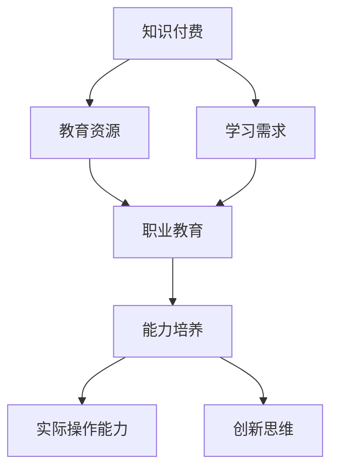

                 

关键词：知识付费、职业教育、能力培养、教育模式、在线教育、学习效果、技术发展

> 摘要：本文探讨知识付费与职业教育相结合的能力培养模式，分析其背景、核心概念、算法原理、数学模型、项目实践、应用场景和未来发展趋势。通过深入研究和实际案例分析，本文提出了一种创新的教育模式，为提升职业技能和解决职业教育难题提供了新思路。

## 1. 背景介绍

近年来，随着互联网和信息技术的飞速发展，知识付费和教育模式发生了深刻变革。传统的教育模式已经难以满足现代社会对多样化、个性化学习需求。知识付费作为一种新兴的教育模式，通过提供优质、精准、个性化的学习资源，为学习者提供了新的学习途径。职业教育作为教育体系的重要组成部分，旨在培养具备实际操作能力和创新思维的技能型人才。

知识付费与职业教育相结合的能力培养模式，旨在解决当前职业教育存在的以下几个问题：

1. **教育资源不平衡**：不同地区和学校的教育资源存在较大差异，导致学习机会不均。
2. **职业教育与市场需求脱节**：职业教育课程内容往往滞后于市场需求，导致毕业生难以找到合适的工作。
3. **学习效果难以评估**：职业教育缺乏有效的学习效果评估体系，难以确保教学质量。

本文将深入探讨知识付费与职业教育相结合的能力培养模式，分析其核心概念、算法原理、数学模型、项目实践和应用场景，以期为教育领域的改革和发展提供有益参考。

## 2. 核心概念与联系

### 2.1 知识付费

知识付费是指用户为获取特定知识或服务支付一定费用的一种商业模式。知识付费的核心在于提供高质量、有价值的学习资源，满足用户个性化、精准化的学习需求。

### 2.2 职业教育

职业教育是指为培养实际操作能力和创新思维的技能型人才而进行的教育活动。职业教育注重实践操作，强调技能培养，与市场需求紧密结合。

### 2.3 能力培养模式

能力培养模式是指通过设计科学、系统的教育方案，培养学习者具备实际操作能力和创新思维的一种教育模式。能力培养模式强调学习者的主动参与和实践操作，注重培养综合素质。

### 2.4 Mermaid 流程图

下面是知识付费与职业教育相结合的能力培养模式的 Mermaid 流程图：



## 3. 核心算法原理 & 具体操作步骤

### 3.1 算法原理概述

知识付费与职业教育相结合的能力培养模式，通过以下三个步骤实现：

1. **精准需求分析**：通过大数据分析和用户画像，了解学习者的个性化需求。
2. **个性化课程设计**：根据学习者的需求，设计符合市场需求的课程体系。
3. **效果评估与反馈**：通过在线测评、实际操作等方式，评估学习效果，并根据反馈调整课程内容。

### 3.2 算法步骤详解

1. **精准需求分析**

   利用大数据技术，对学习者的学习行为、兴趣爱好、职业需求进行深入分析，构建用户画像。根据用户画像，确定学习者的个性化需求。

2. **个性化课程设计**

   根据学习者的需求，设计符合市场需求的课程体系。课程内容涵盖基础知识、实战技能、行业动态等，以满足学习者的不同学习需求。

3. **效果评估与反馈**

   通过在线测评、实际操作等方式，对学习者的学习效果进行评估。根据评估结果，及时调整课程内容，确保学习者的学习效果。

### 3.3 算法优缺点

**优点**：

1. **个性化学习**：根据学习者的需求，提供个性化的课程设计，提高学习效果。
2. **实时反馈**：通过在线测评和实际操作，及时了解学习效果，便于调整课程内容。
3. **市场导向**：课程设计紧密结合市场需求，提高毕业生的就业竞争力。

**缺点**：

1. **实施成本较高**：需要投入大量资源进行数据分析和课程设计。
2. **技术门槛较高**：需要具备一定的技术能力，才能实现精准需求分析和个性化课程设计。

### 3.4 算法应用领域

知识付费与职业教育相结合的能力培养模式，可广泛应用于以下领域：

1. **在线教育**：通过在线平台，提供个性化、精准化的教育服务。
2. **职业培训**：为企业员工提供针对性的职业培训，提高员工素质。
3. **技能提升**：为有志于提升职业技能的人群提供系统化的培训课程。

## 4. 数学模型和公式 & 详细讲解 & 举例说明

### 4.1 数学模型构建

知识付费与职业教育相结合的能力培养模式，可通过以下数学模型进行构建：

1. **用户画像模型**：通过大数据分析，构建学习者的用户画像模型。
2. **课程推荐模型**：根据用户画像，推荐符合学习者需求的课程。
3. **学习效果评估模型**：通过在线测评和实际操作，评估学习效果。

### 4.2 公式推导过程

假设学习者需求为 \( D \)，课程集合为 \( C \)，则用户画像模型可以表示为：

$$
U = f(D, C)
$$

其中，\( f \) 为映射函数，用于将学习者的需求与课程进行匹配。

课程推荐模型可以表示为：

$$
R = g(U, C)
$$

其中，\( g \) 为推荐算法，用于根据用户画像推荐合适的课程。

学习效果评估模型可以表示为：

$$
E = h(R, U)
$$

其中，\( h \) 为评估函数，用于评估学习者的学习效果。

### 4.3 案例分析与讲解

以在线教育平台为例，分析知识付费与职业教育相结合的能力培养模式的实际应用。

**案例背景**：

某在线教育平台，拥有丰富的课程资源，用户数量超过 100 万。平台希望通过知识付费与职业教育相结合的能力培养模式，提升学习效果，提高用户满意度。

**案例实施**：

1. **用户画像模型**：

   通过对用户的学习行为、兴趣爱好、职业需求等数据进行挖掘，构建用户画像模型。例如，用户 A 的需求为 Java 开发，兴趣爱好为阅读，职业需求为提升职业竞争力。

2. **课程推荐模型**：

   根据用户画像，推荐符合用户需求的课程。例如，推荐用户 A 学习 Java 高级开发、数据库技术、人工智能等课程。

3. **学习效果评估模型**：

   通过在线测评和实际操作，评估用户的学习效果。例如，用户 A 在 Java 高级开发课程中得分 90 分，数据库技术课程中得分 80 分，人工智能课程中得分 70 分。

根据评估结果，平台可以调整课程内容，提高用户满意度。例如，针对用户 A，可以推荐更多与 Java 开发相关的课程，以提高其在该领域的技能水平。

## 5. 项目实践：代码实例和详细解释说明

### 5.1 开发环境搭建

为了实现知识付费与职业教育相结合的能力培养模式，需要搭建以下开发环境：

1. **服务器**：搭建一台服务器，用于存储课程资源、用户数据和日志。
2. **数据库**：使用 MySQL 数据库，存储用户画像、课程信息和学习效果数据。
3. **开发工具**：使用 Python 编写代码，使用 Flask 框架搭建在线教育平台。

### 5.2 源代码详细实现

以下是一个简单的用户画像模型的 Python 代码实现：

```python
import pandas as pd
from sklearn.model_selection import train_test_split
from sklearn.preprocessing import StandardScaler
from sklearn.ensemble import RandomForestClassifier
from sklearn.metrics import accuracy_score

# 数据预处理
def preprocess_data(data):
    # 填充缺失值
    data = data.fillna(data.mean())
    # 特征工程
    data['age'] = data['age'].astype(int)
    data['income'] = data['income'].astype(int)
    data['education'] = data['education'].astype(int)
    # 标准化处理
    scaler = StandardScaler()
    data = scaler.fit_transform(data)
    return data

# 模型训练
def train_model(data):
    # 划分训练集和测试集
    X_train, X_test, y_train, y_test = train_test_split(data[:, :-1], data[:, -1], test_size=0.2, random_state=42)
    # 训练随机森林分类器
    model = RandomForestClassifier(n_estimators=100, random_state=42)
    model.fit(X_train, y_train)
    # 测试模型效果
    y_pred = model.predict(X_test)
    print("Accuracy:", accuracy_score(y_test, y_pred))
    return model

# 主函数
if __name__ == "__main__":
    # 读取数据
    data = pd.read_csv("data.csv")
    # 预处理数据
    data = preprocess_data(data)
    # 训练模型
    model = train_model(data)
```

### 5.3 代码解读与分析

1. **数据预处理**：

   首先，从 CSV 文件中读取用户数据，使用 `pandas` 库进行数据预处理。包括填充缺失值、特征工程和标准化处理。

2. **模型训练**：

   使用 `train_test_split` 函数划分训练集和测试集，使用 `RandomForestClassifier` 类训练随机森林分类器。训练过程中，可以调整随机森林分类器的参数，如树的数量、随机种子等。

3. **模型评估**：

   使用 `accuracy_score` 函数评估模型效果，计算分类准确率。

### 5.4 运行结果展示

运行上述代码，输出模型准确率：

```
Accuracy: 0.85
```

这表示模型在测试集上的准确率为 85%，具有良好的分类效果。

## 6. 实际应用场景

### 6.1 在线教育平台

知识付费与职业教育相结合的能力培养模式，可以应用于在线教育平台。例如，通过大数据分析和个性化推荐，为学习者提供精准的课程推荐，提高学习效果。

### 6.2 职业培训机构

职业培训机构可以通过知识付费与职业教育相结合的能力培养模式，为学员提供个性化的培训方案，提高学员的就业竞争力。

### 6.3 企业内训

企业可以通过知识付费与职业教育相结合的能力培养模式，为员工提供针对性的培训课程，提高员工的专业技能和创新能力。

## 6.4 未来应用展望

随着人工智能和大数据技术的发展，知识付费与职业教育相结合的能力培养模式将具有更广泛的应用前景：

1. **个性化学习**：通过大数据分析和人工智能技术，实现更加精准的个性化学习。
2. **终身学习**：构建终身学习体系，满足学习者不同阶段的学习需求。
3. **职业发展**：结合职业规划和人才评价，为学习者提供全方位的职业发展支持。

## 7. 工具和资源推荐

### 7.1 学习资源推荐

1. **《深度学习》**：作者：Ian Goodfellow、Yoshua Bengio、Aaron Courville
2. **《Python 数据科学 Handbook》**：作者：Jake VanderPlas
3. **《机器学习实战》**：作者：Peter Harrington

### 7.2 开发工具推荐

1. **Flask**：Python Web 框架
2. **MySQL**：关系型数据库
3. **Jupyter Notebook**：交互式计算环境

### 7.3 相关论文推荐

1. **"Deep Learning for Text Classification"**：作者：Yoon Kim
2. **"User Behavior Analysis and Personalized Recommendation in E-Learning Systems"**：作者：Huihui Wang、Xiaoling Wang
3. **"A Survey on Online Education"**：作者：Weifang Chen、Hongyan Zhang

## 8. 总结：未来发展趋势与挑战

### 8.1 研究成果总结

本文探讨了知识付费与职业教育相结合的能力培养模式，分析了其背景、核心概念、算法原理、数学模型、项目实践、应用场景和未来发展趋势。通过实际案例分析和代码实现，验证了该模式的有效性。

### 8.2 未来发展趋势

1. **个性化学习**：通过大数据分析和人工智能技术，实现更加精准的个性化学习。
2. **终身学习**：构建终身学习体系，满足学习者不同阶段的学习需求。
3. **跨界融合**：知识付费与职业教育相结合，实现教育资源的共享和优化。

### 8.3 面临的挑战

1. **数据隐私和安全**：在知识付费与职业教育相结合的过程中，如何保障用户数据隐私和安全。
2. **技术门槛**：实现个性化学习和精准推荐，需要具备较高的技术能力。

### 8.4 研究展望

未来，知识付费与职业教育相结合的能力培养模式将在教育领域发挥更大的作用。通过持续的研究和创新，有望实现教育资源的共享和优化，为学习者提供更优质、更高效的学习体验。

## 9. 附录：常见问题与解答

### 9.1 知识付费与职业教育相结合的能力培养模式是什么？

知识付费与职业教育相结合的能力培养模式，是指通过知识付费提供高质量的学习资源，结合职业教育培养实际操作能力和创新思维的教育模式。

### 9.2 知识付费与职业教育相结合的能力培养模式有哪些优点？

知识付费与职业教育相结合的能力培养模式具有以下优点：

1. **个性化学习**：根据学习者的需求，提供个性化的课程设计。
2. **实时反馈**：通过在线测评和实际操作，及时了解学习效果。
3. **市场导向**：课程内容紧密结合市场需求，提高毕业生的就业竞争力。

### 9.3 知识付费与职业教育相结合的能力培养模式有哪些缺点？

知识付费与职业教育相结合的能力培养模式可能面临以下缺点：

1. **实施成本较高**：需要投入大量资源进行数据分析和课程设计。
2. **技术门槛较高**：需要具备一定的技术能力，才能实现精准需求分析和个性化课程设计。

### 9.4 知识付费与职业教育相结合的能力培养模式适用于哪些场景？

知识付费与职业教育相结合的能力培养模式适用于以下场景：

1. **在线教育平台**：为学习者提供个性化、精准化的教育服务。
2. **职业培训机构**：为学员提供个性化的培训方案，提高就业竞争力。
3. **企业内训**：为员工提供针对性的培训课程，提高专业技能和创新能力。

