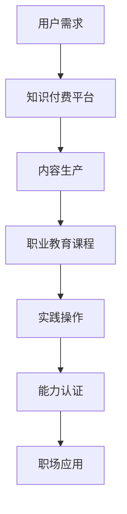

                 

 关键词：知识付费，职业教育，能力培养模式，在线学习平台，教育科技

> 摘要：本文探讨知识付费与职业教育相结合的能力培养模式，通过分析当前教育市场趋势，阐述知识付费与职业教育的联系与价值，提出一种整合型能力培养模式，并对其实施策略、挑战与未来展望进行深入探讨。

## 1. 背景介绍

在信息化和数字化迅速发展的今天，知识付费和职业教育逐渐成为教育领域的重要组成部分。知识付费是指个人或组织为获取特定知识或技能而支付的费用，这种模式打破了传统教育免费共享的局限，满足了不同人群对专业知识的个性化需求。而职业教育则专注于培养适应职场需求的专业技能和实践能力。

随着互联网技术的普及，在线学习平台如雨后春笋般涌现，为广大用户提供了便捷的学习途径。知识付费与职业教育的融合，不仅丰富了教育资源的供给，还推动了教育模式的创新。然而，如何有效地将知识付费与职业教育相结合，以培养用户的核心能力，成为当前教育领域亟待解决的问题。

## 2. 核心概念与联系

### 2.1 知识付费

知识付费是指用户通过支付费用来获取特定的知识或技能。这种模式的核心在于价值的直接交换，用户为知识付费，以期望获得个人成长或职业发展的提升。

### 2.2 职业教育

职业教育是针对职场需求，培养专业技能和实践能力的一种教育形式。它强调实践性、实用性和针对性，旨在为用户未来的职业生涯提供支持。

### 2.3 能力培养模式

能力培养模式是指通过系统化的教学方法，培养用户在特定领域的综合能力。这种模式关注知识的深度与广度，以及实际应用能力的提升。

### 2.4 联系与融合

知识付费与职业教育的融合，旨在通过付费机制激发用户的学习动力，同时结合职业教育的实践性，提升用户的核心能力。这一过程可以通过以下Mermaid流程图展示：



## 3. 核心算法原理 & 具体操作步骤

### 3.1 算法原理概述

知识付费与职业教育相结合的能力培养模式，本质上是基于用户需求驱动的教育模式。其核心算法原理包括以下几个方面：

1. **需求分析**：通过大数据分析用户需求，精准定位学习目标。
2. **内容定制**：根据用户需求，提供个性化、专业化的内容。
3. **实践操作**：通过实际操作，锻炼用户的能力。
4. **能力评估**：对用户的能力进行评估，确保学习效果。

### 3.2 算法步骤详解

1. **需求分析**：利用大数据分析技术，收集用户的学习行为、兴趣偏好和职业目标，构建用户画像。
2. **内容定制**：根据用户画像，设计个性化学习内容，包括视频课程、图文资料和实践项目。
3. **实践操作**：提供模拟环境或真实场景，让用户在实际操作中锻炼能力。
4. **能力评估**：通过在线测试、作业提交和实践项目评估，对用户的能力进行评估。

### 3.3 算法优缺点

**优点**：

- **个性化**：根据用户需求定制学习内容，提高学习效果。
- **实践性**：通过实际操作，提升用户的实践能力。
- **高效性**：利用大数据技术，快速响应用户需求。

**缺点**：

- **付费机制**：用户需要支付一定费用，可能影响部分用户参与度。
- **内容质量**：内容质量参差不齐，可能影响学习效果。

### 3.4 算法应用领域

知识付费与职业教育相结合的能力培养模式，广泛应用于以下领域：

- **IT技能培训**：如编程、数据分析、人工智能等。
- **职业资格认证**：如金融分析师、项目管理师等。
- **职业技能提升**：如市场营销、销售技能等。

## 4. 数学模型和公式 & 详细讲解 & 举例说明

### 4.1 数学模型构建

知识付费与职业教育相结合的能力培养模式，可以通过以下数学模型进行描述：

$$
A = f(B, C, D)
$$

其中，$A$ 表示用户能力，$B$ 表示用户需求，$C$ 表示学习内容，$D$ 表示实践操作。

### 4.2 公式推导过程

$$
A = f(B, C, D)
$$

- $B$：通过大数据分析技术，获取用户需求。
- $C$：根据用户需求，定制学习内容。
- $D$：提供实践操作环境，让用户进行实际操作。

通过上述三个因素的综合作用，不断提升用户能力$A$。

### 4.3 案例分析与讲解

以编程技能培训为例，用户需求为学习Python编程。根据需求，平台提供以下学习内容：

- **视频课程**：Python基础语法、数据结构、算法等。
- **图文资料**：Python编程实战案例、编程技巧等。
- **实践操作**：Python编程练习、项目实战等。

通过学习这些内容，用户可以不断提升编程能力。

## 5. 项目实践：代码实例和详细解释说明

### 5.1 开发环境搭建

首先，我们需要搭建一个Python编程的学习环境。以下是具体步骤：

1. 安装Python：在官网下载Python安装包，安装完成后，确保环境变量配置正确。
2. 安装相关库：使用pip命令安装Python相关库，如numpy、pandas等。

### 5.2 源代码详细实现

以下是一个简单的Python编程实例：

```python
# 计算两个数的和
def add(a, b):
    return a + b

# 计算两个数的差
def subtract(a, b):
    return a - b

# 主函数
def main():
    num1 = int(input("请输入第一个数："))
    num2 = int(input("请输入第二个数："))

    print("两数之和：", add(num1, num2))
    print("两数之差：", subtract(num1, num2))

# 程序入口
if __name__ == "__main__":
    main()
```

### 5.3 代码解读与分析

- **函数定义**：定义了`add`和`subtract`两个函数，分别实现两个数的和与差。
- **主函数**：定义了主函数`main`，通过用户输入获取两个数，调用函数计算结果并输出。

### 5.4 运行结果展示

运行程序后，输入两个数，程序将输出它们的和与差。

```
请输入第一个数：10
请输入第二个数：5
两数之和： 15
两数之差： 5
```

## 6. 实际应用场景

知识付费与职业教育相结合的能力培养模式，在多个实际应用场景中取得了显著成效：

- **企业培训**：企业通过知识付费平台，为员工提供定制化的培训课程，提高员工的职业素养和技能水平。
- **个人学习**：个人通过知识付费平台，学习专业知识和技能，提升个人竞争力。
- **在线教育**：在线教育机构通过知识付费模式，提供高质量的教育资源，满足用户的学习需求。

## 7. 未来应用展望

随着知识付费和职业教育的不断融合，未来应用前景广阔：

- **个性化学习**：通过大数据技术，实现更加精准的个性化学习。
- **智能教育**：利用人工智能技术，提升教育质量和学习效果。
- **终身学习**：推动终身学习理念的普及，满足不同阶段用户的学习需求。

## 8. 工具和资源推荐

### 8.1 学习资源推荐

- **Python编程**：Python官方文档、廖雪峰的Python教程。
- **数据分析**：数据分析精品课、Excel实战技巧。

### 8.2 开发工具推荐

- **Python开发环境**：PyCharm、VSCode。
- **数据分析工具**：Python的Pandas库、Excel。

### 8.3 相关论文推荐

- 《知识付费与职业教育融合模式研究》
- 《基于大数据的个性化学习模式研究》
- 《人工智能在教育领域的应用与挑战》

## 9. 总结：未来发展趋势与挑战

### 9.1 研究成果总结

知识付费与职业教育相结合的能力培养模式，为教育领域带来了新的发展机遇。通过个性化学习、智能教育和终身学习，不断提升用户的核心能力。

### 9.2 未来发展趋势

未来，知识付费与职业教育将进一步融合，推动教育模式的创新。个性化学习、智能教育和终身学习将成为主流。

### 9.3 面临的挑战

- **内容质量**：保证学习内容的权威性和实用性。
- **用户参与度**：提高用户的学习积极性和参与度。
- **技术挑战**：实现大数据和人工智能在教育领域的深度应用。

### 9.4 研究展望

未来，我们将进一步探索知识付费与职业教育相结合的能力培养模式，为教育领域的发展贡献力量。

## 10. 附录：常见问题与解答

### 10.1 如何选择合适的知识付费平台？

- **内容质量**：查看用户评价和课程评分。
- **课程体系**：了解课程设置和教学体系。
- **用户服务**：考虑平台的用户服务和支持。

### 10.2 如何在学习过程中保持动力？

- **设定目标**：明确学习目标和计划。
- **定期复习**：定期回顾所学内容。
- **寻求支持**：向导师或同学请教问题。

### 10.3 如何评估自己的学习效果？

- **在线测试**：参加平台提供的在线测试。
- **实践项目**：完成实际项目并评估。
- **反馈与改进**：根据反馈调整学习策略。

---

作者：禅与计算机程序设计艺术 / Zen and the Art of Computer Programming

