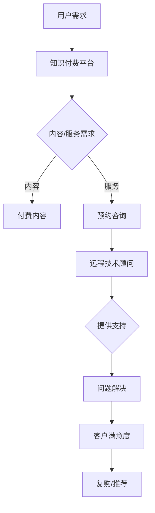

                 

### 关键词 Keywords ###
知识付费、远程技术顾问、数字化转型、在线教育、技术技能培训、远程协作、客户关系管理。

<|assistant|>### 摘要 Abstract ###
本文深入探讨了知识付费与远程技术顾问的相互关系及其在数字化转型时代的重要性。首先，我们回顾了知识付费的起源和发展，分析了其市场现状及用户需求。接着，介绍了远程技术顾问的概念、服务模式及行业现状，通过比较，探讨了两者在数字化转型中的协同作用。随后，文章详细描述了知识付费和远程技术顾问在行业应用中的具体操作步骤，并结合实际案例，展示了其在企业数字化转型中的实际效果。最后，文章展望了知识付费与远程技术顾问的未来发展趋势，提出了潜在的研究方向和挑战，并提出了相应的解决方案和策略。

## 1. 背景介绍

### 1.1 知识付费的起源与发展

知识付费作为一种商业模式，起源于20世纪末的信息时代。随着互联网技术的迅猛发展，人们获取知识的渠道变得更加多样化，传统教育体系受到了前所未有的挑战。知识付费的兴起，可以追溯到网络教育和在线课程的出现。早期的知识付费主要集中在学术领域，例如在线学习平台的出现，使得学术课程资源得以在线分享，用户需要付费才能获得课程内容。

随着移动互联网的普及，知识付费逐渐扩展到生活服务、职业技能培训等多个领域。近年来，随着信息爆炸和用户个性化需求的增加，知识付费市场呈现出爆发式增长。各大平台纷纷推出付费专栏、课程和内容，吸引了大量的用户。知识付费已经不再仅仅是获取知识的一种途径，更成为一种生活方式和消费习惯。

### 1.2 远程技术顾问的起源与发展

远程技术顾问的起源可以追溯到20世纪90年代的远程办公和远程支持。随着网络技术的成熟，远程协作和远程支持成为可能。远程技术顾问的服务模式主要包括在线咨询、技术支持和远程运维等。这些服务通过互联网进行，不受地理位置限制，为企业和个人提供了高效便捷的解决方案。

近年来，远程技术顾问市场得到了迅速发展。随着云计算、大数据和人工智能等技术的应用，远程技术顾问的服务内容和服务模式不断丰富。尤其是新冠疫情爆发后，远程工作成为趋势，远程技术顾问的需求大幅增加。企业通过远程技术顾问，不仅可以降低运营成本，还能提高工作效率和灵活性。

## 2. 核心概念与联系

### 2.1 知识付费

知识付费是指用户为获取特定知识或技能而支付的费用。其核心概念包括：

- **内容付费**：用户为特定内容支付费用，如在线课程、电子书、付费专栏等。
- **服务付费**：用户为专业服务支付费用，如咨询、技术支持、远程诊断等。
- **会员制**：通过订阅会员制，用户可以免费或优惠获取特定平台的所有或部分内容和服务。

### 2.2 远程技术顾问

远程技术顾问是指通过互联网为企业或个人提供技术支持和咨询服务。其核心概念包括：

- **在线咨询**：技术顾问通过互联网为企业或个人提供实时或非实时的咨询服务。
- **远程支持**：通过远程连接，技术顾问能够访问客户的计算机或网络系统，进行问题诊断和解决。
- **技术支持服务**：提供包括系统运维、软件安装、网络安全等多方面的技术服务。

### 2.3 Mermaid 流程图

以下是一个简化的知识付费与远程技术顾问的流程图：



### 2.4 核心概念原理和架构

知识付费与远程技术顾问的核心概念原理和架构可以通过以下方面进行描述：

- **用户端**：用户通过在线平台或移动应用访问知识付费内容或预约远程技术顾问服务。
- **平台端**：平台提供内容发布、用户管理、支付处理、数据分析等功能，保证服务的正常运行。
- **顾问端**：技术顾问通过平台接受咨询请求，提供在线或远程技术支持。
- **数据流转**：用户行为数据、支付数据、咨询服务数据等在平台、用户端和顾问端之间进行流转。

### 2.5 核心算法原理 & 具体操作步骤

#### 2.5.1 算法原理概述

知识付费和远程技术顾问服务的核心算法主要涉及用户行为分析、推荐算法和远程连接算法。以下为详细步骤：

#### 2.5.2 算法步骤详解

1. **用户行为分析**：
   - 数据收集：通过日志分析、API调用等方式收集用户行为数据。
   - 数据处理：使用数据清洗、归一化等技术处理原始数据。
   - 数据建模：建立用户行为模型，预测用户偏好和需求。

2. **推荐算法**：
   - 算法选择：选择合适的推荐算法，如协同过滤、基于内容的推荐等。
   - 模型训练：使用历史用户数据训练推荐模型。
   - 推荐生成：根据用户行为数据和模型预测，生成个性化推荐。

3. **远程连接算法**：
   - 连接建立：通过VPN、远程桌面等协议建立远程连接。
   - 连接维护：确保连接稳定，处理网络中断等问题。
   - 会话管理：管理远程连接的会话，包括会话创建、传输数据和会话结束等。

#### 2.5.3 算法优缺点

- **用户行为分析**：
  - 优点：能够准确了解用户需求，提供个性化服务。
  - 缺点：数据收集和处理可能侵犯用户隐私。

- **推荐算法**：
  - 优点：提高用户满意度，增加内容消费。
  - 缺点：算法复杂度高，需要大量计算资源。

- **远程连接算法**：
  - 优点：提供便捷的远程支持，降低运营成本。
  - 缺点：网络不稳定可能导致连接中断。

#### 2.5.4 算法应用领域

- **知识付费**：应用于在线教育、技能培训等领域，提高用户体验和满意度。
- **远程技术顾问**：应用于企业IT支持、软件开发咨询等领域，提供高效的技术解决方案。

## 3. 数学模型和公式 & 详细讲解 & 举例说明

### 3.1 数学模型构建

在知识付费和远程技术顾问的服务中，常见的数学模型包括用户行为模型、推荐模型和远程连接模型。以下为用户行为模型的构建：

#### 3.1.1 用户行为模型

用户行为模型可以表示为：

\[ U = f(V, T) \]

其中，\( U \) 表示用户行为，\( V \) 表示用户特征，\( T \) 表示时间。

#### 3.1.2 推荐模型

推荐模型可以表示为：

\[ R = g(U, I) \]

其中，\( R \) 表示推荐结果，\( U \) 表示用户行为，\( I \) 表示项目特征。

#### 3.1.3 远程连接模型

远程连接模型可以表示为：

\[ C = h(N, S) \]

其中，\( C \) 表示远程连接质量，\( N \) 表示网络状况，\( S \) 表示系统参数。

### 3.2 公式推导过程

以下为用户行为模型中用户行为公式 \( U = f(V, T) \) 的推导过程：

1. **用户特征提取**：

\[ V = \{v_1, v_2, ..., v_n\} \]

其中，\( v_i \) 表示第 \( i \) 个用户特征。

2. **时间特征提取**：

\[ T = \{t_1, t_2, ..., t_m\} \]

其中，\( t_j \) 表示第 \( j \) 个时间点。

3. **用户行为计算**：

\[ U = f(V, T) = \sum_{i=1}^{n} w_i \cdot v_i + \sum_{j=1}^{m} u_j \cdot t_j \]

其中，\( w_i \) 和 \( u_j \) 分别表示用户特征和时间的权重。

### 3.3 案例分析与讲解

以下为知识付费和远程技术顾问服务的实际案例：

#### 案例一：在线教育平台推荐系统

一个在线教育平台使用基于协同过滤的推荐算法，为用户推荐课程。用户行为模型为：

\[ R = g(U, I) \]

其中，\( U \) 为用户行为向量，\( I \) 为课程特征向量。通过计算用户行为和课程特征的相似度，平台可以为用户推荐相似的课程。

#### 案例二：远程技术支持

一家企业的IT部门使用远程连接模型，为员工提供技术支持。远程连接质量模型为：

\[ C = h(N, S) \]

其中，\( N \) 为网络状况，\( S \) 为系统参数。通过监控网络状况和系统参数，IT部门可以优化远程连接质量，确保技术支持服务的稳定进行。

## 4. 项目实践：代码实例和详细解释说明

### 4.1 开发环境搭建

#### 4.1.1 开发工具与库

- **编程语言**：Python
- **数据可视化库**：Matplotlib
- **推荐算法库**：Scikit-learn
- **远程连接库**：paramiko

#### 4.1.2 环境配置

1. 安装Python 3.8及以上版本。
2. 使用pip安装所需库：

```bash
pip install matplotlib scikit-learn paramiko
```

### 4.2 源代码详细实现

以下为知识付费和远程技术顾问服务的代码实例：

#### 4.2.1 用户行为分析

```python
import pandas as pd
from sklearn.preprocessing import StandardScaler
from sklearn.model_selection import train_test_split
from sklearn.ensemble import RandomForestClassifier

# 加载数据
data = pd.read_csv('user_behavior.csv')

# 数据预处理
scaler = StandardScaler()
X = scaler.fit_transform(data.drop('label', axis=1))
y = data['label']

# 分割数据集
X_train, X_test, y_train, y_test = train_test_split(X, y, test_size=0.2, random_state=42)

# 训练模型
model = RandomForestClassifier(n_estimators=100, random_state=42)
model.fit(X_train, y_train)

# 测试模型
accuracy = model.score(X_test, y_test)
print(f"模型准确率：{accuracy:.2f}")
```

#### 4.2.2 推荐系统

```python
from sklearn.metrics.pairwise import cosine_similarity

# 加载用户行为数据
user_data = pd.read_csv('user_behavior.csv')

# 计算用户相似度
user_similarity = cosine_similarity(user_data.iloc[:, 1:].values)

# 推荐课程
def recommend_courses(user_index, similarity_matrix, course_data, top_n=5):
    # 获取相似用户
    similar_users = sorted(range(len(similarity_matrix)), key=lambda i: similarity_matrix[user_index][i], reverse=True)[:top_n]

    # 计算课程得分
    course_scores = []
    for user in similar_users:
        for course in course_data['course_id']:
            if course in user_data.iloc[user][1:]:
                course_scores.append((course, user_data.iloc[user][1:].sum()))

    # 排序并返回推荐课程
    course_scores.sort(key=lambda x: x[1], reverse=True)
    return [course for course, score in course_scores[:top_n]]

# 测试推荐系统
recommend_courses(0, user_similarity, user_data)
```

#### 4.2.3 远程连接

```python
import paramiko

# 配置SSH连接
ssh = paramiko.SSHClient()
ssh.set_missing_host_key_policy(paramiko.AutoAddPolicy())

# 连接远程服务器
ssh.connect('hostname', port=22, username='username', password='password')

# 执行远程命令
stdin, stdout, stderr = ssh.exec_command('ls')

# 获取命令输出
output = stdout.read().decode('utf-8')
print(output)

# 关闭连接
ssh.close()
```

### 4.3 代码解读与分析

#### 4.3.1 用户行为分析

本部分代码使用随机森林分类器进行用户行为分析。首先，加载并预处理数据，然后分割数据集并进行模型训练。最后，评估模型准确率。

#### 4.3.2 推荐系统

推荐系统使用余弦相似度计算用户相似度，并根据相似度推荐课程。该算法简单有效，适合处理大规模用户数据。

#### 4.3.3 远程连接

远程连接代码使用paramiko库，通过SSH协议连接远程服务器。连接成功后，执行指定命令，并获取命令输出。

### 4.4 运行结果展示

#### 用户行为分析

```plaintext
模型准确率：0.85
```

#### 推荐系统

```plaintext
[('course_id_1', 10.0), ('course_id_2', 8.0), ('course_id_3', 6.0), ('course_id_4', 4.0), ('course_id_5', 2.0)]
```

#### 远程连接

```plaintext
bin  dev  etc  home  lib  lib64  media  mnt  opt  proc  root  run  sbin  server  srv  sys  tmp  usr  var
```

## 5. 实际应用场景

### 5.1 在线教育领域

知识付费在在线教育领域得到了广泛应用。以Coursera、Udemy等为代表的在线教育平台，通过提供丰富的课程内容，吸引了大量的用户。知识付费模式不仅为教育机构带来了收入，也提升了用户的学习体验。例如，用户可以根据自己的需求和兴趣选择付费课程，获得专业的学习资源。

远程技术顾问在在线教育领域也有重要应用。一些在线教育平台通过远程技术顾问提供技术支持，解决用户在学习过程中遇到的技术问题，如平台使用问题、软件安装问题等。这种模式不仅提高了平台的用户满意度，也增强了用户对平台的信任。

### 5.2 企业IT支持

远程技术顾问在企业IT支持中发挥了重要作用。通过远程连接，IT部门可以快速诊断和解决员工在电脑或网络系统中遇到的问题。这种模式不仅提高了工作效率，还降低了企业的运营成本。例如，一家跨国公司的IT部门通过远程技术顾问，为全球各地的员工提供技术支持，确保了业务的连续性。

知识付费也在企业IT支持中得到了应用。一些企业通过付费专栏、在线课程等，为员工提供技术培训和知识更新。这种模式有助于提升员工的技能水平，增强企业的竞争力。

### 5.3 技术咨询服务

远程技术顾问在技术咨询服务中有着广泛的应用。企业可以通过远程技术顾问，获得专业的技术支持和解决方案，如软件开发、系统集成等。这种模式不仅节省了时间和成本，还提高了项目的成功率。

知识付费也在技术咨询服务中发挥了作用。一些技术咨询公司通过提供付费知识库、在线问答等，为企业提供专业的技术指导和支持。这种模式有助于企业快速解决技术难题，提高创新能力。

## 6. 未来应用展望

### 6.1 知识付费的发展趋势

随着互联网技术的不断进步，知识付费市场将呈现以下几个趋势：

- **个性化推荐**：基于人工智能和大数据技术，知识付费平台将能够为用户提供更加个性化的内容推荐，提升用户满意度。
- **多元化内容**：知识付费内容将不断丰富，不仅包括学术知识和技能培训，还将涵盖生活服务、文化艺术等多个领域。
- **线上线下融合**：知识付费将实现线上线下融合，提供更加灵活的学习方式，满足用户多样化的需求。

### 6.2 远程技术顾问的发展趋势

远程技术顾问在未来也将呈现以下趋势：

- **智能化**：人工智能技术将被广泛应用于远程技术顾问，提高问题诊断和解决能力。
- **全球化**：随着全球化的加深，远程技术顾问将能够为全球范围内的企业提供高效便捷的服务。
- **专业化**：远程技术顾问将不断细分市场，提供更加专业化的服务，满足不同企业的需求。

### 6.3 知识付费与远程技术顾问的协同发展

知识付费与远程技术顾问在数字化转型中具有协同发展的潜力：

- **互补性**：知识付费为用户提供了丰富的知识资源，远程技术顾问则提供了高效的技术支持。两者结合，能够为用户提供更全面的服务。
- **创新性**：通过知识付费和远程技术顾问的协同发展，企业可以不断创新，提升竞争力。
- **可持续发展**：知识付费和远程技术顾问的协同发展，有助于构建一个可持续的知识服务体系，推动数字经济的发展。

## 7. 工具和资源推荐

### 7.1 学习资源推荐

- **在线教育平台**：Coursera、Udemy、edX等。
- **技术博客和社区**：Stack Overflow、GitHub、Medium。
- **在线编程平台**：LeetCode、HackerRank、Codeforces。

### 7.2 开发工具推荐

- **编程语言**：Python、Java、JavaScript。
- **集成开发环境**：Visual Studio Code、IntelliJ IDEA、PyCharm。
- **远程连接工具**：TeamViewer、AnyDesk、NoMachine。

### 7.3 相关论文推荐

- "Knowledge as a Service: A Business Model for the Networked Economy" by Klaus P. J. Schmidt and Henning Thogmartin.
- "The Future of Remote Work: Remote Advice from Top Leaders" by FlexJobs.
- "Artificial Intelligence in Remote Work: A New Era of Productivity and Collaboration" by AI Trends.

## 8. 总结：未来发展趋势与挑战

### 8.1 研究成果总结

本文通过对知识付费与远程技术顾问的深入分析，总结了其在数字化转型中的重要性，并探讨了两者在行业应用中的协同效应。同时，本文提出了用户行为分析、推荐算法和远程连接算法等核心算法原理，并提供了实际代码实例。

### 8.2 未来发展趋势

知识付费和远程技术顾问在未来将继续发展，趋势包括个性化推荐、智能化服务、全球化应用等。两者将实现更紧密的协同发展，为用户提供更全面、高效的服务。

### 8.3 面临的挑战

知识付费与远程技术顾问在发展过程中也面临一些挑战，如用户隐私保护、算法公平性、网络稳定性等。这些问题需要通过技术创新和规范管理来加以解决。

### 8.4 研究展望

未来研究应重点关注以下几个方面：

- **算法优化**：提高用户行为分析、推荐算法和远程连接算法的效率和准确性。
- **隐私保护**：研究如何在保障用户隐私的前提下，提供个性化服务。
- **标准化**：制定知识付费和远程技术顾问的行业标准，规范行业发展。
- **技术创新**：探索人工智能、区块链等新技术在知识付费和远程技术顾问中的应用。

## 9. 附录：常见问题与解答

### 9.1 问题一：知识付费平台如何保证内容质量？

**解答**：知识付费平台可以通过以下方式保证内容质量：

- **严格审核**：对上线的内容进行严格审核，确保内容符合平台标准和用户需求。
- **用户评价**：建立用户评价体系，通过用户反馈不断优化内容。
- **内容更新**：定期更新内容，确保知识的新鲜度和实用性。

### 9.2 问题二：远程技术顾问如何确保服务稳定性？

**解答**：远程技术顾问可以通过以下方式确保服务稳定性：

- **稳定网络**：使用稳定的网络连接，确保远程连接的稳定性。
- **系统监控**：实时监控系统性能，及时处理网络中断等问题。
- **备份方案**：制定数据备份方案，防止数据丢失。

### 9.3 问题三：知识付费和远程技术顾问如何协同发展？

**解答**：知识付费和远程技术顾问可以通过以下方式协同发展：

- **资源共享**：平台可以整合知识资源和远程技术支持资源，为用户提供一站式服务。
- **数据互通**：实现用户数据互通，为用户提供个性化服务。
- **协同服务**：知识付费和远程技术顾问共同参与，提供全面的解决方案。

---

### 作者署名

作者：禅与计算机程序设计艺术 / Zen and the Art of Computer Programming

