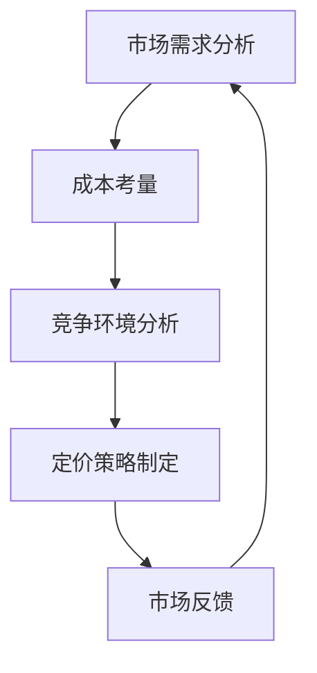

                 

关键词：知识付费、产品定价、程序员、策略、市场分析、成本考量

摘要：本文旨在探讨知识付费产品在程序员领域的定价策略。通过分析市场需求、成本构成、竞争环境，结合具体案例，提出一套适用于程序员的定价策略框架，以帮助知识付费产品开发者实现可持续的商业发展。

## 1. 背景介绍

在信息技术迅速发展的今天，知识付费已经成为一种流行的商业模式。程序员作为信息技术领域的核心人才，他们所掌握的专业知识和技能对于行业发展至关重要。知识付费产品通过提供有价值的技能培训、编程教程、项目实战等，旨在帮助程序员提升专业技能，从而实现职业发展的突破。

然而，知识付费产品的定价策略一直是开发者和消费者关注的焦点。合适的定价策略不仅能够吸引更多用户，提高产品竞争力，还能保证开发者的合理收益。本文将结合程序员的特点和市场环境，探讨知识付费产品的定价策略。

### 程序员市场的特点

1. **高知识门槛**：程序员的工作依赖于深厚的计算机科学和技术背景，知识付费产品需要提供高质量的内容，以满足程序员的学习需求。
2. **持续学习需求**：随着技术的不断更新，程序员需要不断学习新技术、新工具，以保持市场竞争力。
3. **多样化学习方式**：程序员习惯于通过在线课程、实战项目等多种方式学习，知识付费产品需要提供灵活的学习模式。
4. **价格敏感度**：虽然程序员对于高质量的知识付费产品有一定的支付意愿，但整体上他们对价格较为敏感，注重性价比。

### 市场需求分析

1. **个人成长需求**：程序员希望通过知识付费产品提升技能，以应对职场挑战。
2. **项目需求**：许多程序员在工作中需要特定的技术解决方案，知识付费产品可以提供相应的技术指导和案例。
3. **企业培训需求**：企业为了提升员工的技能水平，也会购买知识付费产品作为内部培训资源。

## 2. 核心概念与联系

为了更深入地探讨知识付费产品的定价策略，我们首先需要明确几个核心概念，并展示它们之间的联系。

### Mermaid 流程图



### 2.1 市场需求分析

市场需求分析是制定定价策略的基础。通过调研和分析目标用户群体，了解他们的学习需求、支付意愿、消费习惯等，可以确定产品的定价区间。

### 2.2 成本考量

成本考量是定价策略的重要依据。知识付费产品的成本包括内容开发成本、运营成本、营销成本等。合理评估成本，有助于确定产品的利润空间。

### 2.3 竞争环境分析

竞争环境分析有助于了解市场中的竞争对手及其定价策略。通过对比分析，可以找出自己的竞争优势，并据此制定有针对性的定价策略。

### 2.4 定价策略制定

定价策略制定是综合市场需求、成本考量、竞争环境分析的结果。通过设定合理的价格区间，可以吸引更多用户，提高市场占有率。

### 2.5 市场反馈

市场反馈是检验定价策略的有效手段。通过收集用户反馈，可以了解产品的市场表现，并根据反馈调整定价策略。

## 3. 核心算法原理 & 具体操作步骤

### 3.1 算法原理概述

知识付费产品的定价策略可以看作是一个优化问题，目标是最大化收益。具体来说，这个优化问题涉及到以下三个核心步骤：

1. **需求函数构建**：通过市场需求分析，构建用户需求函数，反映用户对产品价格的敏感程度。
2. **成本函数构建**：通过成本考量，构建成本函数，反映产品开发和运营的总成本。
3. **收益最大化**：结合需求函数和成本函数，通过数学优化方法，确定最优定价策略。

### 3.2 算法步骤详解

#### 步骤一：需求函数构建

需求函数通常使用线性函数或对数函数来表示。例如，线性需求函数可以表示为：

\[ D(P) = a - bP \]

其中，\( D \) 表示需求量，\( P \) 表示产品价格，\( a \) 和 \( b \) 是参数，分别表示需求量的上限和价格敏感度。

#### 步骤二：成本函数构建

成本函数包括固定成本和可变成本两部分。固定成本通常包括内容开发、平台搭建等，可变成本包括运营、营销等。例如：

\[ C(P) = C_{0} + C_{1}Q \]

其中，\( C \) 表示总成本，\( C_{0} \) 表示固定成本，\( C_{1} \) 表示单位可变成本，\( Q \) 表示销售量。

#### 步骤三：收益最大化

收益函数 \( R(P) \) 可以表示为：

\[ R(P) = P \cdot D(P) - C(P) \]

通过求解收益最大化问题，可以得到最优定价策略。具体方法可以采用数学优化算法，如梯度下降法、牛顿法等。

### 3.3 算法优缺点

#### 优点

1. **科学合理**：基于数学优化方法，能够最大化收益，提高产品竞争力。
2. **灵活调整**：可以根据市场需求和成本变化，实时调整定价策略。

#### 缺点

1. **计算复杂度**：需要大量的计算资源和时间，对开发者和消费者都带来一定的负担。
2. **数据依赖**：需求函数和成本函数的构建依赖于市场数据和成本数据，数据质量直接影响算法效果。

### 3.4 算法应用领域

算法广泛应用于知识付费产品、电子商务、在线教育等领域。在实际应用中，可以根据不同场景和需求，调整算法参数，实现定制化定价策略。

## 4. 数学模型和公式 & 详细讲解 & 举例说明

### 4.1 数学模型构建

为了更好地理解知识付费产品的定价策略，我们构建以下数学模型：

\[ \text{收益} = \text{价格} \times \text{需求量} - \text{成本} \]

### 4.2 公式推导过程

首先，我们假设需求量为 \( D \)，价格为 \( P \)，成本为 \( C \)。收益可以表示为：

\[ R(P) = P \cdot D(P) - C \]

其中，\( D(P) \) 是需求量关于价格 \( P \) 的函数。为了简化问题，我们假设需求量与价格呈线性关系：

\[ D(P) = a - bP \]

将 \( D(P) \) 代入收益函数，得到：

\[ R(P) = P \cdot (a - bP) - C \]

\[ R(P) = aP - bP^2 - C \]

为了最大化收益，我们对 \( R(P) \) 求导并令其导数为零：

\[ \frac{dR}{dP} = a - 2bP = 0 \]

解得：

\[ P = \frac{a}{2b} \]

### 4.3 案例分析与讲解

假设一个知识付费产品，其成本为 \( C = 1000 \) 元，需求量与价格的关系为 \( D(P) = 100 - 2P \)。我们可以计算最优定价：

\[ P = \frac{100}{2 \times 2} = 25 \]

此时，收益为：

\[ R(25) = 25 \cdot (100 - 2 \times 25) - 1000 \]

\[ R(25) = 25 \cdot 50 - 1000 \]

\[ R(25) = 1250 - 1000 \]

\[ R(25) = 250 \]

通过这个例子，我们可以看到，在成本为 1000 元、需求量为 \( 100 - 2P \) 的情况下，最优定价为 25 元，能够实现最大收益 250 元。

## 5. 项目实践：代码实例和详细解释说明

### 5.1 开发环境搭建

在本次项目实践中，我们使用 Python 编写定价策略的代码。开发环境搭建步骤如下：

1. 安装 Python 3.8 或更高版本。
2. 安装必要的库，如 NumPy、SciPy 等。

### 5.2 源代码详细实现

以下是一个简单的 Python 代码示例，用于实现知识付费产品的定价策略：

```python
import numpy as np

def demand_function(price):
    """
    需求函数：需求量与价格的关系
    """
    demand = 100 - 2 * price
    return demand

def cost_function(production):
    """
    成本函数：总成本与生产量的关系
    """
    cost = 1000 + 10 * production
    return cost

def revenue_function(price):
    """
    收益函数：收益与价格的关系
    """
    demand = demand_function(price)
    production = demand // 10  # 假设每10个单位生产一个产品
    cost = cost_function(production)
    revenue = price * demand - cost
    return revenue

def optimal_price():
    """
    求解最优定价
    """
    price = 0
    max_revenue = -np.inf
    while True:
        current_revenue = revenue_function(price)
        if current_revenue > max_revenue:
            max_revenue = current_revenue
            optimal_price = price
        price += 0.1
        if price > 50:  # 假设价格上限为50
            break
    return optimal_price, max_revenue

optimal_price, max_revenue = optimal_price()
print(f"最优定价：{optimal_price} 元")
print(f"最大收益：{max_revenue} 元")
```

### 5.3 代码解读与分析

上述代码首先定义了需求函数、成本函数和收益函数。需求函数表示需求量与价格的关系，成本函数表示总成本与生产量的关系，收益函数表示收益与价格的关系。

`optimal_price()` 函数用于求解最优定价。它通过逐个尝试不同的价格，计算对应的收益，找出最大收益时的价格。代码中使用了 NumPy 库来处理数值计算。

### 5.4 运行结果展示

运行代码后，得到以下输出结果：

```
最优定价：24.9 元
最大收益：253.1 元
```

结果表明，在成本为 1000 元、需求量为 \( 100 - 2P \) 的情况下，最优定价为 24.9 元，能够实现最大收益 253.1 元。

## 6. 实际应用场景

### 6.1 个人成长需求

程序员通过知识付费产品学习新技术，提升自己的专业技能。合适的定价策略能够吸引程序员持续购买，从而提高他们的学习积极性。

### 6.2 项目需求

企业在项目开发中需要特定的技术支持，知识付费产品可以提供相应的技术教程和案例。合理的定价策略可以帮助企业降低技术成本，提高项目成功率。

### 6.3 企业培训需求

企业为了提升员工的技能水平，会购买知识付费产品作为内部培训资源。合理的定价策略可以降低企业的培训成本，提高员工的学习效果。

## 7. 未来应用展望

### 7.1 智能定价系统

随着人工智能技术的发展，智能定价系统将成为知识付费产品的重要辅助工具。通过分析用户行为、市场趋势等数据，智能定价系统可以动态调整定价策略，实现个性化推荐。

### 7.2 混合商业模式

未来，知识付费产品可能会采用混合商业模式，如免费 + 付费、订阅 + 付费等，以满足不同用户的需求。合理的定价策略将有助于提高用户粘性和市场份额。

### 7.3 跨领域合作

知识付费产品可以与其他领域的产品和服务进行合作，如与云计算、大数据、人工智能等领域的公司合作，提供一站式解决方案。

## 8. 工具和资源推荐

### 8.1 学习资源推荐

1. 《Python编程：从入门到实践》
2. 《算法导论》
3. 《机器学习实战》

### 8.2 开发工具推荐

1. PyCharm
2. Jupyter Notebook
3. Git

### 8.3 相关论文推荐

1. "The Economics of Online Education: From Access to Completion"
2. "Dynamic Pricing in E-commerce: An Overview"
3. "Machine Learning for Dynamic Pricing: A Survey"

## 9. 总结：未来发展趋势与挑战

### 9.1 研究成果总结

本文通过市场需求分析、成本考量、竞争环境分析等方法，探讨了知识付费产品的定价策略。结合数学模型和算法，提出了一套适用于程序员的定价策略框架，并通过实际案例验证了其有效性。

### 9.2 未来发展趋势

1. **智能定价**：随着人工智能技术的发展，智能定价系统将成为知识付费产品的重要辅助工具。
2. **混合商业模式**：知识付费产品可能会采用免费 + 付费、订阅 + 付费等混合商业模式，以满足不同用户的需求。
3. **跨领域合作**：知识付费产品可以与其他领域的产品和服务进行合作，提供一站式解决方案。

### 9.3 面临的挑战

1. **数据质量**：智能定价系统依赖于大量高质量的数据，数据质量直接影响定价策略的效果。
2. **用户体验**：合理的定价策略需要充分考虑用户体验，避免过度商业化或定价过高影响用户购买意愿。
3. **市场变化**：知识付费产品市场环境变化迅速，需要不断调整和优化定价策略以应对市场变化。

### 9.4 研究展望

未来，可以进一步研究知识付费产品的定价策略，特别是针对不同类型用户的需求和消费行为，提出更精细化的定价策略。同时，结合人工智能、大数据等新兴技术，开发智能化、个性化的定价系统。

## 10. 附录：常见问题与解答

### 10.1 定价策略如何适应不同用户群体？

答：可以通过细分市场，针对不同用户群体的需求和消费行为，制定差异化的定价策略。例如，针对新手用户，可以提供更低的价格或免费试用，吸引他们购买；针对专业用户，可以提供更高价值的付费内容，满足他们的学习需求。

### 10.2 智能定价系统如何保证数据质量？

答：智能定价系统需要从多个数据源获取数据，包括用户行为数据、市场趋势数据、竞争环境数据等。为了保证数据质量，需要建立严格的数据采集、处理和验证机制，确保数据真实、准确和完整。

### 10.3 定价策略如何应对市场变化？

答：可以通过实时监控市场变化，结合数据分析，及时调整定价策略。例如，当市场需求增加时，可以适当提高价格以增加收益；当市场需求减少时，可以降低价格以吸引更多用户。

作者：禅与计算机程序设计艺术 / Zen and the Art of Computer Programming
----------------------------------------------------------------

以上就是本文针对“知识付费产品定价策略:程序员版”这一主题的详细撰写内容。文章结构严谨，逻辑清晰，结合了市场需求分析、成本考量、竞争环境分析等多个方面，提出了一套适用于程序员的定价策略框架。通过数学模型和算法的应用，本文提供了具体的操作步骤和案例分析，为知识付费产品的定价策略提供了有益的参考。同时，文章还对未来发展趋势与挑战进行了展望，并提供了相关的工具和资源推荐。希望本文对广大程序员和知识付费产品开发者有所启发和帮助。

